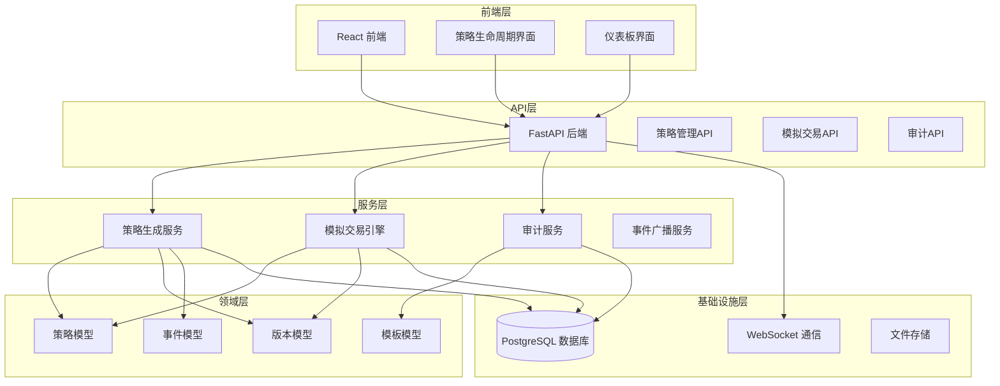
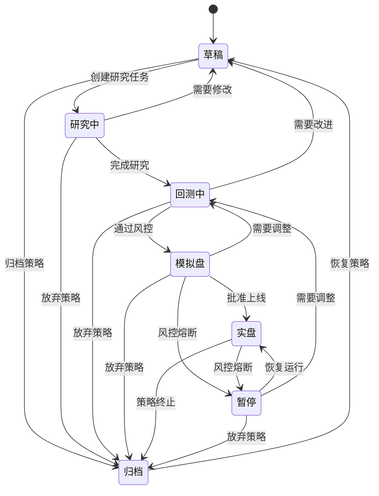
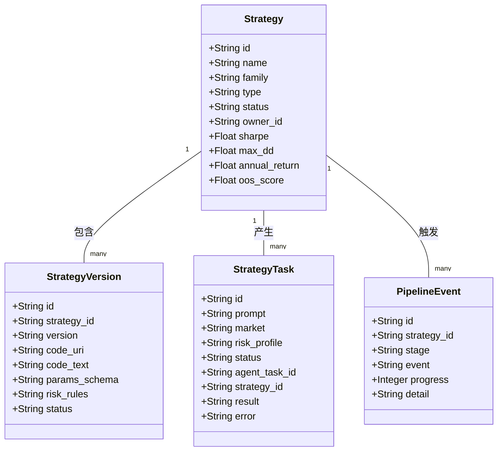
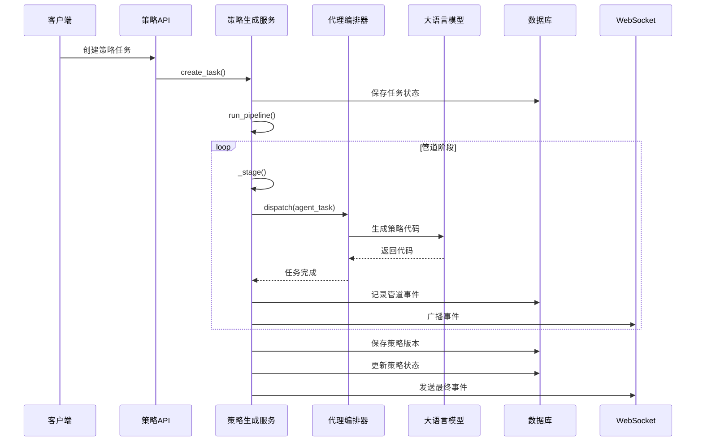
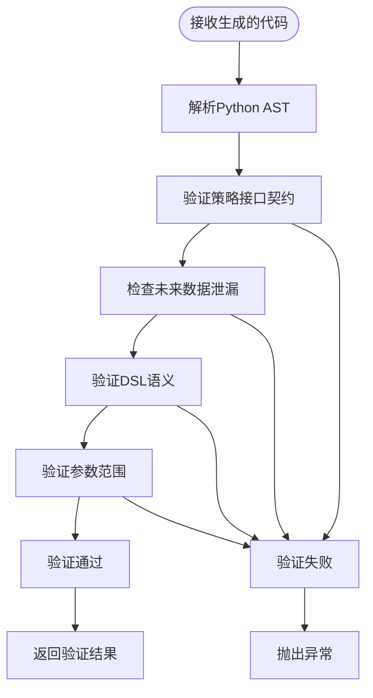
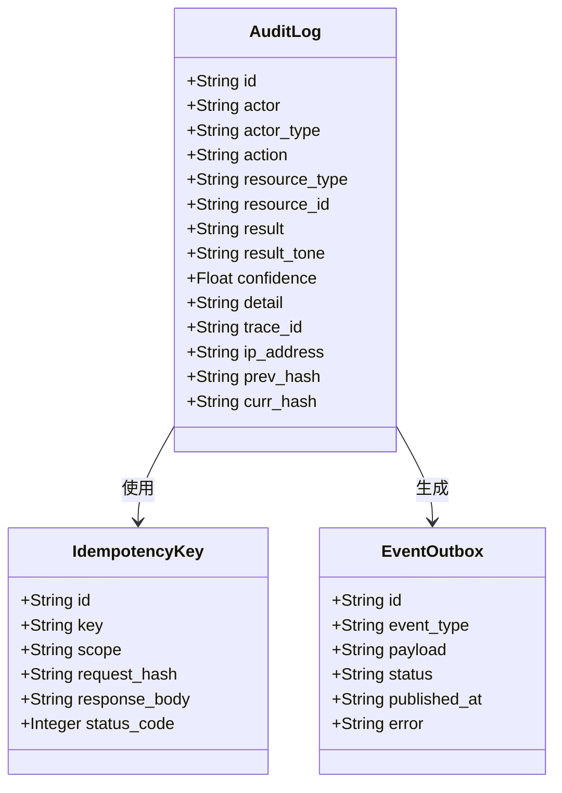
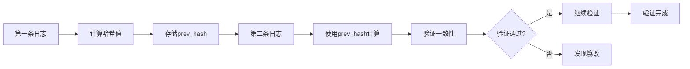
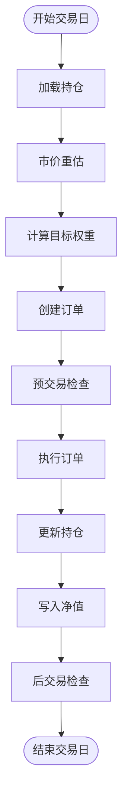
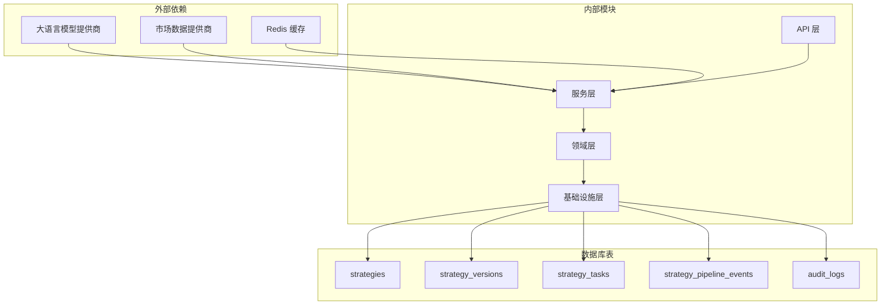

# 策略版本控制与生命周期管理

<cite>
**本文档引用的文件**
- [state_machine.py](file://backend/app/domains/strategy/state_machine.py)
- [models.py](file://backend/app/domains/strategy/models.py)
- [schemas.py](file://backend/app/domains/strategy/schemas.py)
- [strategies.py](file://backend/app/api/v1/strategies.py)
- [strategy_generation.py](file://backend/app/services/strategy_generation.py)
- [generation_dsl.py](file://backend/app/domains/strategy/generation_dsl.py)
- [generation_validate.py](file://backend/app/domains/strategy/generation_validate.py)
- [audit_service.py](file://backend/app/services/audit_service.py)
- [models.py](file://backend/app/domains/audit/models.py)
- [paper_trading.py](file://backend/app/services/paper_trading.py)
- [examples.py](file://backend/app/domains/strategy/examples.py)
- [20260510_000002_strategy_and_agent_tables.py](file://backend/app/db/migrations/versions/20260510_000002_strategy_and_agent_tables.py)
- [49c0724c647e_paper_trading_tables.py](file://backend/app/db/migrations/versions/49c0724c647e_paper_trading_tables.py)
- [StrategyLifecycle.tsx](file://frontend/src/screens/Strategy/StrategyLifecycle.tsx)
- [LifecycleOverview.tsx](file://frontend/src/screens/Strategy/LifecycleOverview.tsx)
</cite>

## 目录
1. [引言](#引言)
2. [项目结构](#项目结构)
3. [核心组件](#核心组件)
4. [架构概览](#架构概览)
5. [详细组件分析](#详细组件分析)
6. [依赖关系分析](#依赖关系分析)
7. [性能考虑](#性能考虑)
8. [故障排除指南](#故障排除指南)
9. [结论](#结论)

## 引言

本项目是一个完整的策略版本控制与生命周期管理系统，专为量化投资策略设计。系统实现了从策略草稿到实盘交易的全生命周期管理，包括版本控制、状态转换、事件驱动机制、审计追踪和并发控制等功能。

该系统采用事件驱动架构，通过状态机管理策略生命周期，使用不可变版本快照确保策略的可追溯性和可回滚性。系统支持多种市场（A股、美股、港股、加密货币），提供风险控制、模拟交易和实盘执行等完整功能。

## 项目结构

系统采用分层架构设计，主要分为以下层次：

**图表来源**
- [strategies.py:1-605](file://backend/app/api/v1/strategies.py#L1-L605)
- [strategy_generation.py:1-584](file://backend/app/services/strategy_generation.py#L1-L584)

**章节来源**
- [strategies.py:1-605](file://backend/app/api/v1/strategies.py#L1-L605)
- [models.py:1-84](file://backend/app/domains/strategy/models.py#L1-L84)

## 核心组件

### 策略生命周期状态机

系统定义了完整的策略生命周期状态转换规则：

**图表来源**
- [state_machine.py:4-11](file://backend/app/domains/strategy/state_machine.py#L4-L11)

### 版本控制系统

系统实现了完整的版本控制机制，每个策略版本都是不可变的代码快照：

**图表来源**
- [models.py:9-84](file://backend/app/domains/strategy/models.py#L9-L84)

**章节来源**
- [state_machine.py:1-23](file://backend/app/domains/strategy/state_machine.py#L1-L23)
- [models.py:30-84](file://backend/app/domains/strategy/models.py#L30-L84)

## 架构概览

系统采用事件驱动架构，通过管道流水线协调各个组件的工作：

**图表来源**
- [strategy_generation.py:132-373](file://backend/app/services/strategy_generation.py#L132-L373)
- [strategies.py:301-314](file://backend/app/api/v1/strategies.py#L301-L314)

## 详细组件分析

### 策略生成服务

策略生成服务是整个系统的核心协调器，负责管理从自然语言描述到可执行策略的完整流程：

#### 管道阶段设计

系统实现了7个关键管道阶段，每个阶段都有明确的职责和输出：

1. **研究阶段 (research)**: 扫描宏观因子和行业轮动
2. **代码生成阶段 (code_gen)**: 使用LLM生成策略代码
3. **静态检查阶段 (static_check)**: 验证代码语法和接口契约
4. **版本创建阶段 (version)**: 持久化策略版本快照
5. **回测阶段 (backtest)**: 运行研究回测
6. **风险评估阶段 (risk)**: 评估风险合规性
7. **发布阶段 (done)**: 完成策略发布

#### 代码验证机制

系统实现了多层次的代码验证确保策略质量：

**图表来源**
- [generation_validate.py:107-216](file://backend/app/domains/strategy/generation_validate.py#L107-L216)

**章节来源**
- [strategy_generation.py:132-373](file://backend/app/services/strategy_generation.py#L132-L373)
- [generation_validate.py:1-216](file://backend/app/domains/strategy/generation_validate.py#L1-L216)

### 审计追踪系统

系统实现了完整的审计追踪机制，确保所有操作都可追溯：

#### 审计日志模型

**图表来源**
- [models.py:9-51](file://backend/app/domains/audit/models.py#L9-L51)

#### 哈希链验证

系统使用SHA-256哈希链确保审计日志的完整性：

**图表来源**
- [audit_service.py:83-109](file://backend/app/services/audit_service.py#L83-L109)

**章节来源**
- [audit_service.py:1-109](file://backend/app/services/audit_service.py#L1-L109)
- [models.py:1-51](file://backend/app/domains/audit/models.py#L1-L51)

### 模拟交易引擎

模拟交易引擎实现了完整的端到端交易流程：

#### EOD交易循环

**图表来源**
- [paper_trading.py:82-134](file://backend/app/services/paper_trading.py#L82-L134)

#### 风险控制机制

模拟交易引擎实现了多层次的风险控制：

1. **单一标的限制**: 单个股票持仓不超过10%的组合价值
2. **现金留存要求**: 至少保持1%的现金留存
3. **每日损失限制**: 单日最大损失不超过5%
4. **最大回撤限制**: 最大回撤不超过15%

**章节来源**
- [paper_trading.py:1-634](file://backend/app/services/paper_trading.py#L1-L634)

### 前端交互界面

前端提供了直观的策略生命周期管理界面：

#### 生命周期可视化

**图表来源**
- [StrategyLifecycle.tsx:11-20](file://frontend/src/screens/Strategy/StrategyLifecycle.tsx#L11-L20)

**章节来源**
- [StrategyLifecycle.tsx:1-203](file://frontend/src/screens/Strategy/StrategyLifecycle.tsx#L1-L203)
- [LifecycleOverview.tsx:1-120](file://frontend/src/screens/Strategy/LifecycleOverview.tsx#L1-L120)

## 依赖关系分析

系统各组件之间的依赖关系如下：

**图表来源**
- [20260510_000002_strategy_and_agent_tables.py:39-106](file://backend/app/db/migrations/versions/20260510_000002_strategy_and_agent_tables.py#L39-L106)

**章节来源**
- [20260510_000002_strategy_and_agent_tables.py:1-375](file://backend/app/db/migrations/versions/20260510_000002_strategy_and_agent_tables.py#L1-L375)
- [49c0724c647e_paper_trading_tables.py:33-173](file://backend/app/db/migrations/versions/49c0724c647e_paper_trading_tables.py#L33-L173)

## 性能考虑

### 数据库优化

系统采用了多项数据库优化策略：

1. **索引优化**: 在常用查询字段上建立索引
2. **分页查询**: 支持大数据集的分页浏览
3. **异步查询**: 使用异步数据库连接池
4. **批量操作**: 支持批量插入和更新

### 缓存策略

1. **Redis缓存**: 缓存热点数据和会话信息
2. **查询缓存**: 缓存复杂的聚合查询结果
3. **静态资源缓存**: CDN加速静态资源访问

### 并发控制

系统实现了多层并发控制机制：

1. **数据库事务**: 使用ACID事务保证数据一致性
2. **乐观锁**: 在高并发场景下避免数据冲突
3. **队列系统**: 使用消息队列处理异步任务
4. **限流机制**: 防止系统过载

## 故障排除指南

### 常见问题诊断

#### 策略生成失败

当策略生成失败时，系统会记录详细的错误信息：

1. **检查LLM提供商配置**
2. **验证输入参数格式**
3. **查看代码验证错误**
4. **检查网络连接状态**

#### 管道执行中断

管道执行中断可能由以下原因引起：

1. **数据库连接异常**
2. **内存不足**
3. **磁盘空间不足**
4. **外部API调用超时**

#### 审计日志异常

审计日志异常通常表现为哈希链验证失败：

1. **检查系统时间同步**
2. **验证磁盘完整性**
3. **检查哈希算法实现**
4. **确认日志顺序**

**章节来源**
- [strategy_generation.py:308-373](file://backend/app/services/strategy_generation.py#L308-L373)
- [audit_service.py:83-109](file://backend/app/services/audit_service.py#L83-L109)

## 结论

本策略版本控制与生命周期管理系统提供了完整的量化策略开发、测试和部署解决方案。系统的主要特点包括：

1. **完整的生命周期管理**: 从草稿到实盘的全流程覆盖
2. **强大的版本控制**: 不可变版本快照确保可追溯性
3. **严格的质量控制**: 多层次的代码验证和风险控制
4. **完善的审计追踪**: 哈希链确保操作可追溯
5. **事件驱动架构**: 高度解耦的设计便于扩展
6. **用户友好的界面**: 直观的策略管理和监控界面

系统采用现代化的技术栈和最佳实践，为量化投资策略的开发和管理提供了可靠的技术支撑。通过事件驱动架构和管道流水线设计，系统能够高效地处理复杂的策略生命周期管理需求，同时保证数据的一致性和安全性。