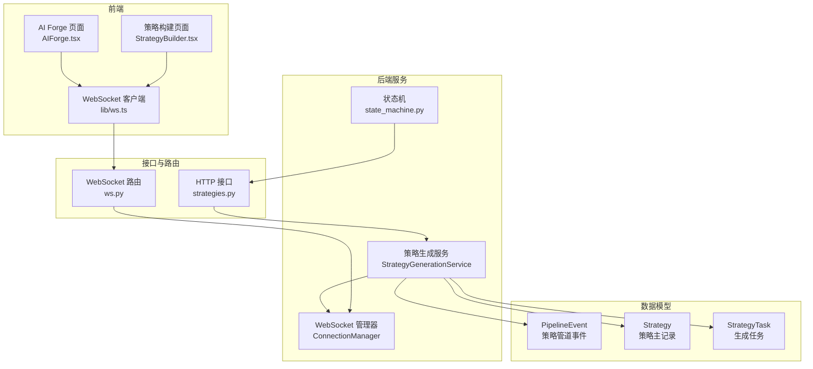
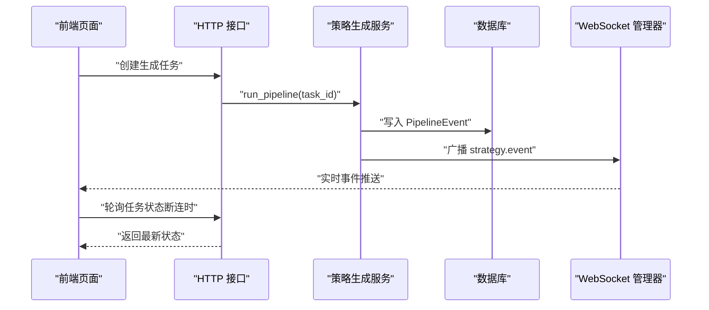
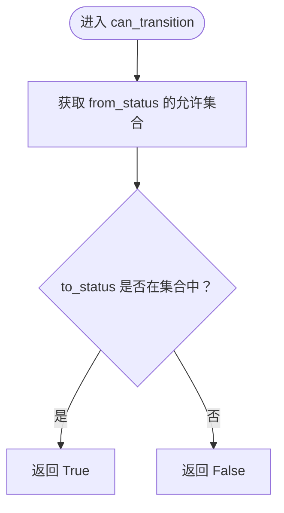
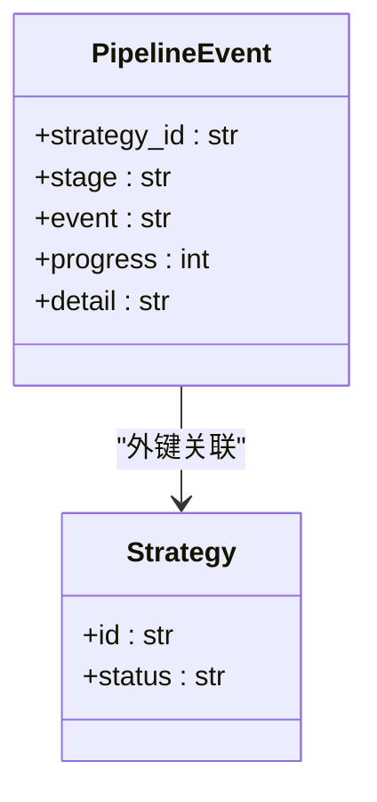
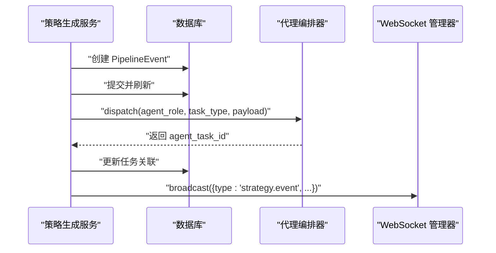
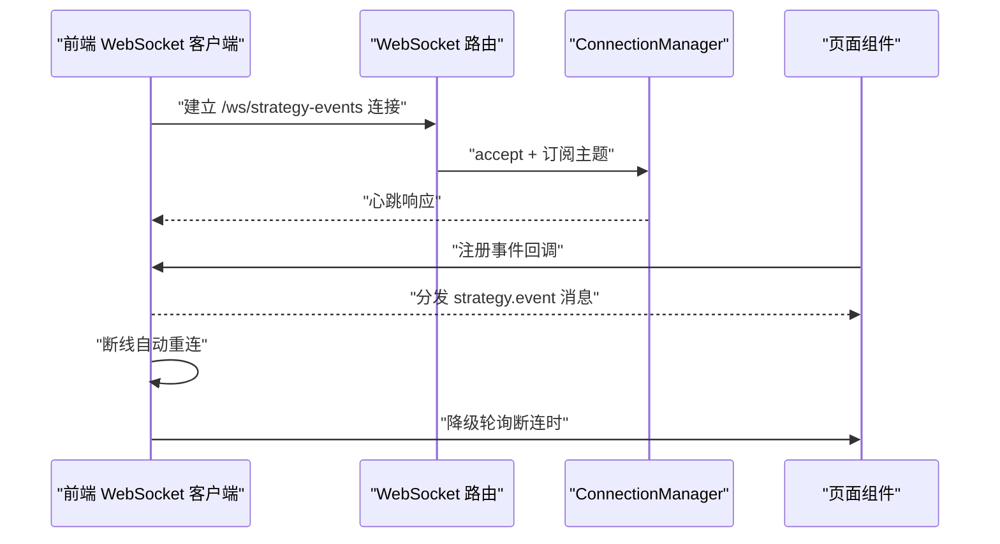
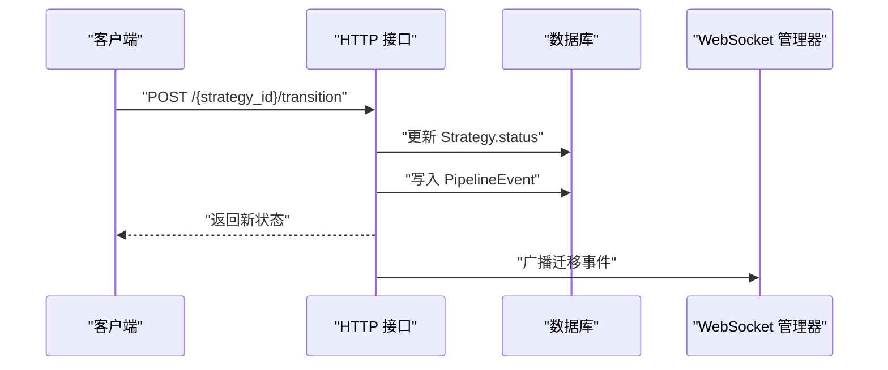
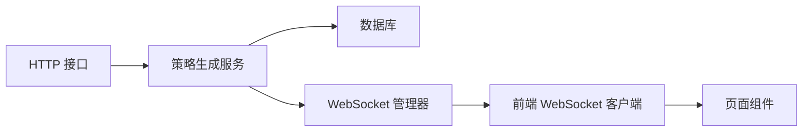

# 管道事件驱动与状态转换

<cite>
**本文引用的文件**
- [backend/app/domains/strategy/state_machine.py](file://backend/app/domains/strategy/state_machine.py)
- [backend/app/domains/strategy/models.py](file://backend/app/domains/strategy/models.py)
- [backend/app/domains/strategy/schemas.py](file://backend/app/domains/strategy/schemas.py)
- [backend/app/services/strategy_generation.py](file://backend/app/services/strategy_generation.py)
- [backend/app/api/v1/strategies.py](file://backend/app/api/v1/strategies.py)
- [backend/app/core/websocket.py](file://backend/app/core/websocket.py)
- [backend/app/api/v1/ws.py](file://backend/app/api/v1/ws.py)
- [frontend/src/lib/ws.ts](file://frontend/src/lib/ws.ts)
- [frontend/src/screens/Strategy/AIForge.tsx](file://frontend/src/screens/Strategy/AIForge.tsx)
- [frontend/src/screens/Strategy/StrategyBuilder.tsx](file://frontend/src/screens/Strategy/StrategyBuilder.tsx)
- [backend/app/core/errors.py](file://backend/app/core/errors.py)
</cite>

## 目录
1. [简介](#简介)
2. [项目结构](#项目结构)
3. [核心组件](#核心组件)
4. [架构总览](#架构总览)
5. [详细组件分析](#详细组件分析)
6. [依赖关系分析](#依赖关系分析)
7. [性能考量](#性能考量)
8. [故障排查指南](#故障排查指南)
9. [结论](#结论)

## 简介
本技术文档围绕“管道事件驱动与状态转换系统”展开，系统以事件驱动为核心，通过策略生命周期状态机与事件模型实现从自然语言到可回测策略的流水线编排。文档重点覆盖以下方面：
- 基于事件驱动的策略管道架构：PipelineEvent 事件模型、状态转换引擎、事件处理器与异步执行机制
- 状态转换规则：策略状态机定义与合法性校验
- 事件传播机制：数据库持久化、WebSocket 广播与前端实时订阅
- 错误处理策略与重试机制：失败回滚、审计日志与降级轮询
- 性能优化策略：连接管理、消息去重与幂等处理

## 项目结构
该系统横跨后端服务、数据库模型、WebSocket 广播与前端订阅四个层面，形成完整的事件驱动闭环。

**图表来源**
- [backend/app/services/strategy_generation.py:86-131](file://backend/app/services/strategy_generation.py#L86-L131)
- [backend/app/domains/strategy/state_machine.py:4-22](file://backend/app/domains/strategy/state_machine.py#L4-L22)
- [backend/app/domains/strategy/models.py:61-71](file://backend/app/domains/strategy/models.py#L61-L71)
- [backend/app/api/v1/strategies.py:422-446](file://backend/app/api/v1/strategies.py#L422-L446)
- [backend/app/core/websocket.py:10-44](file://backend/app/core/websocket.py#L10-L44)
- [backend/app/api/v1/ws.py:28-49](file://backend/app/api/v1/ws.py#L28-L49)
- [frontend/src/lib/ws.ts:27-89](file://frontend/src/lib/ws.ts#L27-L89)
- [frontend/src/screens/Strategy/AIForge.tsx:38-105](file://frontend/src/screens/Strategy/AIForge.tsx#L38-L105)
- [frontend/src/screens/Strategy/StrategyBuilder.tsx:383-465](file://frontend/src/screens/Strategy/StrategyBuilder.tsx#L383-L465)

**章节来源**
- [backend/app/services/strategy_generation.py:86-131](file://backend/app/services/strategy_generation.py#L86-L131)
- [backend/app/domains/strategy/models.py:61-71](file://backend/app/domains/strategy/models.py#L61-L71)
- [backend/app/api/v1/strategies.py:422-446](file://backend/app/api/v1/strategies.py#L422-L446)
- [backend/app/core/websocket.py:10-44](file://backend/app/core/websocket.py#L10-L44)
- [backend/app/api/v1/ws.py:28-49](file://backend/app/api/v1/ws.py#L28-L49)
- [frontend/src/lib/ws.ts:27-89](file://frontend/src/lib/ws.ts#L27-L89)
- [frontend/src/screens/Strategy/AIForge.tsx:38-105](file://frontend/src/screens/Strategy/AIForge.tsx#L38-L105)
- [frontend/src/screens/Strategy/StrategyBuilder.tsx:383-465](file://frontend/src/screens/Strategy/StrategyBuilder.tsx#L383-L465)

## 核心组件
- 策略生命周期状态机：定义合法状态转换集合与查询允许转换的方法
- PipelineEvent 事件模型：记录策略在各阶段的状态变化、进度与详情
- 策略生成服务：协调状态变更、事件持久化、代理任务派发与 WebSocket 广播
- WebSocket 管理器：按主题订阅与广播消息
- HTTP/WebSocket 接口：提供状态迁移与事件流订阅能力
- 前端 WebSocket 客户端与页面：实时接收事件并降级轮询

**章节来源**
- [backend/app/domains/strategy/state_machine.py:4-22](file://backend/app/domains/strategy/state_machine.py#L4-L22)
- [backend/app/domains/strategy/models.py:61-71](file://backend/app/domains/strategy/models.py#L61-L71)
- [backend/app/services/strategy_generation.py:86-131](file://backend/app/services/strategy_generation.py#L86-L131)
- [backend/app/core/websocket.py:10-44](file://backend/app/core/websocket.py#L10-L44)
- [backend/app/api/v1/ws.py:28-49](file://backend/app/api/v1/ws.py#L28-L49)
- [frontend/src/lib/ws.ts:27-89](file://frontend/src/lib/ws.ts#L27-L89)

## 架构总览
系统采用“事件驱动 + 状态机 + 广播”的架构模式：
- 事件源：策略生成服务在每个阶段结束时创建 PipelineEvent，并派发代理任务
- 数据存储：PipelineEvent 写入数据库，供历史查询与审计
- 实时分发：通过 ConnectionManager 将事件广播至订阅者
- 前端消费：WebSocket 客户端接收实时事件；若断连则退化为轮询

**图表来源**
- [backend/app/services/strategy_generation.py:132-200](file://backend/app/services/strategy_generation.py#L132-L200)
- [backend/app/domains/strategy/models.py:61-71](file://backend/app/domains/strategy/models.py#L61-L71)
- [backend/app/core/websocket.py:27-41](file://backend/app/core/websocket.py#L27-L41)
- [frontend/src/lib/ws.ts:44-94](file://frontend/src/lib/ws.ts#L44-L94)
- [frontend/src/screens/Strategy/AIForge.tsx:83-132](file://frontend/src/screens/Strategy/AIForge.tsx#L83-L132)

## 详细组件分析

### 状态转换引擎
- 状态机定义：以字典形式维护每种状态的允许转换目标集合
- 合法性校验：提供 can_transition 与 get_allowed_transitions 辅助函数
- 使用场景：HTTP 接口在进行手动状态迁移时可复用该工具进行约束

**图表来源**
- [backend/app/domains/strategy/state_machine.py:14-22](file://backend/app/domains/strategy/state_machine.py#L14-L22)

**章节来源**
- [backend/app/domains/strategy/state_machine.py:4-22](file://backend/app/domains/strategy/state_machine.py#L4-L22)
- [backend/app/api/v1/strategies.py:422-446](file://backend/app/api/v1/strategies.py#L422-L446)

### PipelineEvent 事件模型
- 字段职责：标识所属策略、当前阶段、事件类型、进度百分比与详情文本
- 存储位置：作为独立实体持久化，支持历史追踪与审计
- 传播路径：服务层创建后写入数据库并广播

**图表来源**
- [backend/app/domains/strategy/models.py:61-71](file://backend/app/domains/strategy/models.py#L61-L71)

**章节来源**
- [backend/app/domains/strategy/models.py:61-71](file://backend/app/domains/strategy/models.py#L61-L71)
- [backend/app/domains/strategy/schemas.py:108-119](file://backend/app/domains/strategy/schemas.py#L108-L119)

### 策略生成服务（事件处理器）
- 协调流程：创建占位策略、标记任务运行、按阶段推进并记录事件
- 事件创建：在每个阶段结束后构造 PipelineEvent，写入数据库并刷新
- 代理派发：根据阶段事件类型派发代理任务，记录 agent_task_id
- 广播通知：将事件封装为统一格式并通过 WebSocket 主题广播
- 失败处理：捕获异常，记录失败事件、回滚状态并审计

**图表来源**
- [backend/app/services/strategy_generation.py:377-415](file://backend/app/services/strategy_generation.py#L377-L415)
- [backend/app/services/strategy_generation.py:556-583](file://backend/app/services/strategy_generation.py#L556-L583)

**章节来源**
- [backend/app/services/strategy_generation.py:132-200](file://backend/app/services/strategy_generation.py#L132-L200)
- [backend/app/services/strategy_generation.py:377-415](file://backend/app/services/strategy_generation.py#L377-L415)
- [backend/app/services/strategy_generation.py:556-583](file://backend/app/services/strategy_generation.py#L556-L583)

### WebSocket 广播与前端订阅
- 连接管理：按主题维护连接列表，支持广播与点对点发送
- 路由接口：提供多主题 WebSocket 端点
- 前端客户端：自动重连、消息分发与订阅管理
- 页面集成：AI Forge 与策略构建页面监听事件，断连时启动轮询降级

**图表来源**
- [backend/app/api/v1/ws.py:28-49](file://backend/app/api/v1/ws.py#L28-L49)
- [backend/app/core/websocket.py:16-41](file://backend/app/core/websocket.py#L16-L41)
- [frontend/src/lib/ws.ts:44-94](file://frontend/src/lib/ws.ts#L44-L94)
- [frontend/src/screens/Strategy/AIForge.tsx:83-132](file://frontend/src/screens/Strategy/AIForge.tsx#L83-L132)
- [frontend/src/screens/Strategy/StrategyBuilder.tsx:425-465](file://frontend/src/screens/Strategy/StrategyBuilder.tsx#L425-L465)

**章节来源**
- [backend/app/api/v1/ws.py:28-49](file://backend/app/api/v1/ws.py#L28-L49)
- [backend/app/core/websocket.py:16-41](file://backend/app/core/websocket.py#L16-L41)
- [frontend/src/lib/ws.ts:44-94](file://frontend/src/lib/ws.ts#L44-L94)
- [frontend/src/screens/Strategy/AIForge.tsx:83-132](file://frontend/src/screens/Strategy/AIForge.tsx#L83-L132)
- [frontend/src/screens/Strategy/StrategyBuilder.tsx:425-465](file://frontend/src/screens/Strategy/StrategyBuilder.tsx#L425-L465)

### HTTP 接口与手动状态迁移
- 手动迁移：提供 POST /{strategy_id}/transition 接口，更新策略状态并生成迁移事件
- 参数校验：使用 Pydantic Schema 校验目标状态与备注信息
- 事件生成：构造 PipelineEvent 并持久化

**图表来源**
- [backend/app/api/v1/strategies.py:422-446](file://backend/app/api/v1/strategies.py#L422-L446)
- [backend/app/domains/strategy/schemas.py:122-127](file://backend/app/domains/strategy/schemas.py#L122-L127)

**章节来源**
- [backend/app/api/v1/strategies.py:422-446](file://backend/app/api/v1/strategies.py#L422-L446)
- [backend/app/domains/strategy/schemas.py:122-127](file://backend/app/domains/strategy/schemas.py#L122-L127)

## 依赖关系分析
- 组件耦合
  - 策略生成服务依赖数据库会话、代理编排器与 WebSocket 管理器
  - HTTP 接口依赖数据库会话与 PipelineEvent 模型
  - 前端仅依赖 WebSocket 路由与 HTTP 轮询降级
- 外部依赖
  - FastAPI 提供 WebSocket 与 HTTP 路由
  - SQLAlchemy 提供 ORM 与异步会话
  - React + TypeScript 提供前端事件订阅与 UI 更新

**图表来源**
- [backend/app/api/v1/strategies.py:422-446](file://backend/app/api/v1/strategies.py#L422-L446)
- [backend/app/services/strategy_generation.py:86-131](file://backend/app/services/strategy_generation.py#L86-L131)
- [backend/app/core/websocket.py:10-44](file://backend/app/core/websocket.py#L10-L44)
- [frontend/src/lib/ws.ts:27-89](file://frontend/src/lib/ws.ts#L27-L89)

**章节来源**
- [backend/app/api/v1/strategies.py:422-446](file://backend/app/api/v1/strategies.py#L422-L446)
- [backend/app/services/strategy_generation.py:86-131](file://backend/app/services/strategy_generation.py#L86-L131)
- [backend/app/core/websocket.py:10-44](file://backend/app/core/websocket.py#L10-L44)
- [frontend/src/lib/ws.ts:27-89](file://frontend/src/lib/ws.ts#L27-L89)

## 性能考量
- 连接池与并发
  - WebSocket 管理器按主题维护连接列表，广播时遍历连接并忽略异常连接，避免阻塞主线程
- 消息体积控制
  - 事件详情以字符串存储，建议控制 JSON 文本大小，避免过大数据导致广播延迟
- 幂等与去重
  - 前端在断连恢复后应避免重复处理已消费的消息，可通过时间戳或事件 ID 去重
- 轮询降级
  - 断线时启用定时轮询，建议指数退避与上限控制，减少无效请求
- 数据库写入
  - 事件写入与提交分离，先写入再刷新，降低锁竞争

[本节为通用性能建议，不直接分析具体文件]

## 故障排查指南
- WebSocket 断连
  - 现象：前端无法接收实时事件
  - 排查：检查路由是否正确、连接是否被异常关闭、重连间隔是否合理
  - 参考
    - [前端 WebSocket 客户端:44-94](file://frontend/src/lib/ws.ts#L44-L94)
    - [WebSocket 路由:28-49](file://backend/app/api/v1/ws.py#L28-L49)
- 事件未到达
  - 现象：页面无更新
  - 排查：确认主题名称一致、广播方法未抛出异常、前端订阅了正确主题
  - 参考
    - [策略生成服务广播:556-583](file://backend/app/services/strategy_generation.py#L556-L583)
    - [前端页面订阅:38-105](file://frontend/src/screens/Strategy/AIForge.tsx#L38-L105)
- 状态迁移失败
  - 现象：手动迁移接口报错或状态未更新
  - 排查：确认目标状态在状态机允许集合内、数据库事务成功提交
  - 参考
    - [状态机工具:14-22](file://backend/app/domains/strategy/state_machine.py#L14-L22)
    - [HTTP 接口:422-446](file://backend/app/api/v1/strategies.py#L422-L446)
- 未捕获异常
  - 现象：服务端出现 500 错误
  - 排查：检查全局异常处理器与日志输出
  - 参考
    - [全局异常处理器:98-118](file://backend/app/core/errors.py#L98-L118)

**章节来源**
- [frontend/src/lib/ws.ts:44-94](file://frontend/src/lib/ws.ts#L44-L94)
- [backend/app/api/v1/ws.py:28-49](file://backend/app/api/v1/ws.py#L28-L49)
- [backend/app/services/strategy_generation.py:556-583](file://backend/app/services/strategy_generation.py#L556-L583)
- [frontend/src/screens/Strategy/AIForge.tsx:38-105](file://frontend/src/screens/Strategy/AIForge.tsx#L38-L105)
- [backend/app/domains/strategy/state_machine.py:14-22](file://backend/app/domains/strategy/state_machine.py#L14-L22)
- [backend/app/api/v1/strategies.py:422-446](file://backend/app/api/v1/strategies.py#L422-L446)
- [backend/app/core/errors.py:98-118](file://backend/app/core/errors.py#L98-L118)

## 结论
本系统通过清晰的事件模型与状态机规则，结合数据库持久化与 WebSocket 实时广播，实现了从自然语言到策略的全链路可观测与可追溯。服务层负责事件编排与代理派发，前端通过 WebSocket 实时订阅并具备断连轮询降级能力。建议在生产环境中进一步完善事件去重、异常重试与指标监控，以提升稳定性与用户体验。