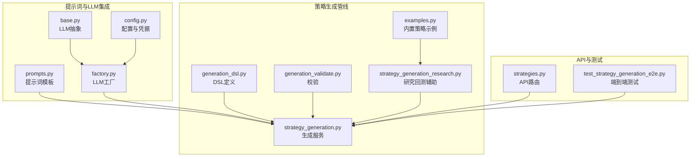
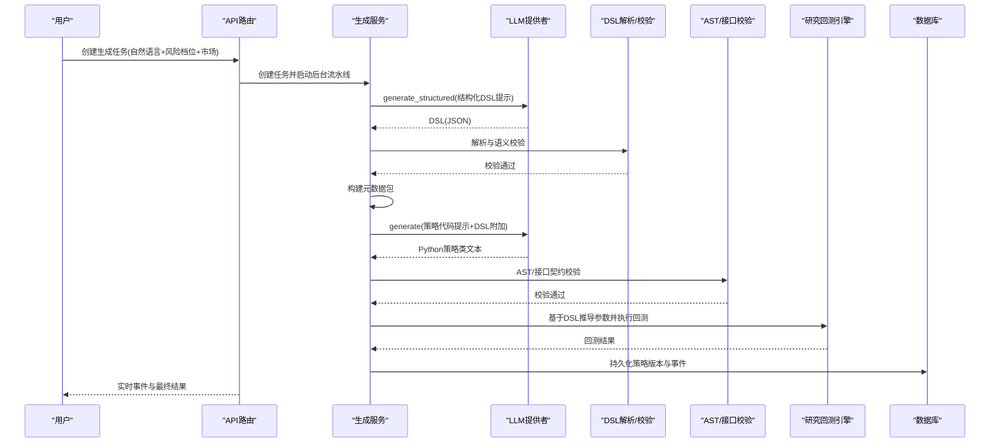
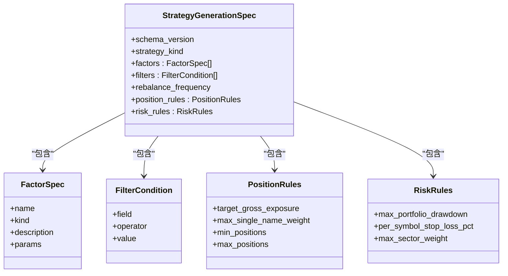
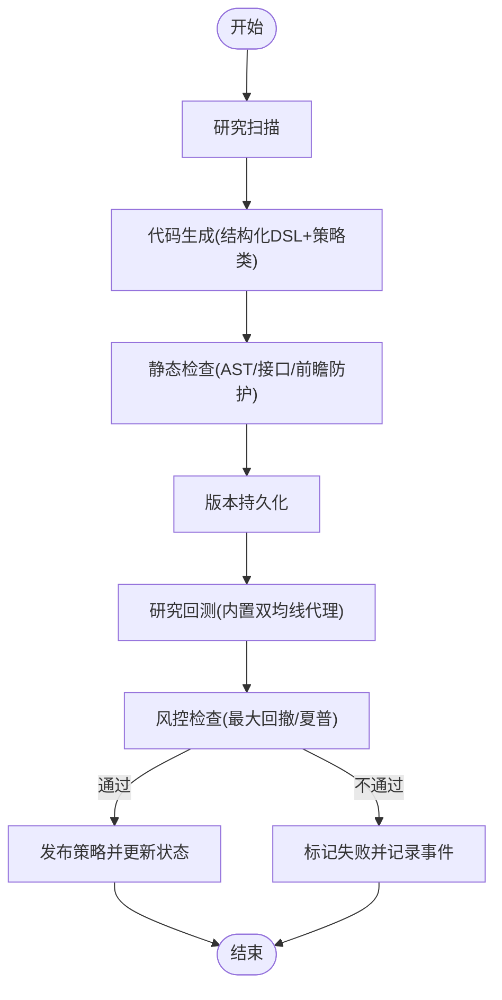
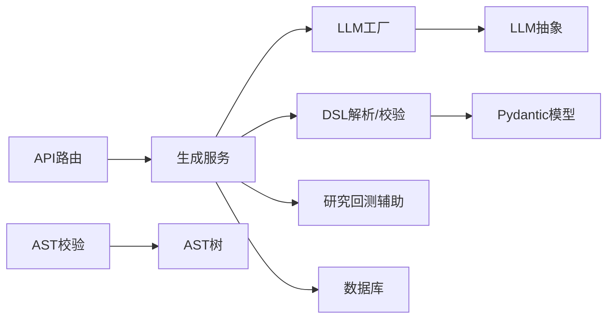

# 自然语言处理与提示词工程

<cite>
**本文引用的文件**
- [prompts.py](file://backend/app/integrations/llm/prompts.py)
- [strategy_generation.py](file://backend/app/services/strategy_generation.py)
- [generation_dsl.py](file://backend/app/domains/strategy/generation_dsl.py)
- [generation_validate.py](file://backend/app/domains/strategy/generation_validate.py)
- [strategy_generation_research.py](file://backend/app/services/strategy_generation_research.py)
- [strategies.py](file://backend/app/api/v1/strategies.py)
- [base.py](file://backend/app/integrations/llm/base.py)
- [factory.py](file://backend/app/integrations/llm/factory.py)
- [config.py](file://backend/app/core/config.py)
- [errors.py](file://backend/app/core/errors.py)
- [examples.py](file://backend/app/domains/strategy/examples.py)
- [test_strategy_generation_e2e.py](file://backend/tests/services/test_strategy_generation_e2e.py)
</cite>

## 目录
1. [简介](#简介)
2. [项目结构](#项目结构)
3. [核心组件](#核心组件)
4. [架构总览](#架构总览)
5. [详细组件分析](#详细组件分析)
6. [依赖分析](#依赖分析)
7. [性能考虑](#性能考虑)
8. [故障排查指南](#故障排查指南)
9. [结论](#结论)
10. [附录](#附录)

## 简介
本技术文档围绕“自然语言处理与提示词工程”模块，系统阐述如何将用户的自然语言策略描述转化为结构化的策略指令与可执行代码。该流程以提示词模板为核心，结合结构化DSL（领域特定语言）、静态与语义校验、以及受控回测与风险控制，确保从自然语言到可运行策略的高质量闭环。

重点覆盖：
- 提示词模板设计与最佳实践
- 上下文构建与多轮对话管理
- 结构化DSL与语义解析规则
- 代码生成与AST/接口契约校验
- 风险边界与回测驱动的验证
- 常见问题与解决方案

## 项目结构
该模块位于后端服务中，涉及提示词模板、DSL定义、生成服务、LLM工厂、API路由与测试用例等文件。下图展示了与“自然语言处理与提示词工程”直接相关的文件与职责映射：

图表来源
- [prompts.py:1-94](file://backend/app/integrations/llm/prompts.py#L1-L94)
- [strategy_generation.py:1-584](file://backend/app/services/strategy_generation.py#L1-L584)
- [generation_dsl.py:1-144](file://backend/app/domains/strategy/generation_dsl.py#L1-L144)
- [generation_validate.py:1-216](file://backend/app/domains/strategy/generation_validate.py#L1-L216)
- [strategy_generation_research.py:1-81](file://backend/app/services/strategy_generation_research.py#L1-L81)
- [examples.py:1-368](file://backend/app/domains/strategy/examples.py#L1-L368)
- [strategies.py:1-605](file://backend/app/api/v1/strategies.py#L1-L605)
- [base.py:1-75](file://backend/app/integrations/llm/base.py#L1-L75)
- [factory.py:1-66](file://backend/app/integrations/llm/factory.py#L1-L66)
- [config.py:1-196](file://backend/app/core/config.py#L1-L196)
- [test_strategy_generation_e2e.py:1-247](file://backend/tests/services/test_strategy_generation_e2e.py#L1-L247)

章节来源
- [prompts.py:1-94](file://backend/app/integrations/llm/prompts.py#L1-L94)
- [strategy_generation.py:1-584](file://backend/app/services/strategy_generation.py#L1-L584)
- [generation_dsl.py:1-144](file://backend/app/domains/strategy/generation_dsl.py#L1-L144)
- [generation_validate.py:1-216](file://backend/app/domains/strategy/generation_validate.py#L1-L216)
- [strategy_generation_research.py:1-81](file://backend/app/services/strategy_generation_research.py#L1-L81)
- [examples.py:1-368](file://backend/app/domains/strategy/examples.py#L1-L368)
- [strategies.py:1-605](file://backend/app/api/v1/strategies.py#L1-L605)
- [base.py:1-75](file://backend/app/integrations/llm/base.py#L1-L75)
- [factory.py:1-66](file://backend/app/integrations/llm/factory.py#L1-L66)
- [config.py:1-196](file://backend/app/core/config.py#L1-L196)
- [test_strategy_generation_e2e.py:1-247](file://backend/tests/services/test_strategy_generation_e2e.py#L1-L247)

## 核心组件
- 提示词模板与系统指令
  - 策略生成系统提示与用户提示：用于将自然语言描述转为Python策略类，约束方法签名、可用列、风险档位与禁止前瞻。
  - 元数据生成提示：从自然语言描述抽取策略名称、家族、描述、市场、频率、预期夏普与最大回撤等键。
  - 结构化规范生成提示：将自然语言意图映射为标准化的DSL规范，约束因子、过滤器、调仓频率、仓位与风控规则。
- LLM抽象与工厂
  - 抽象基类定义统一的generate/generate_structured接口，屏蔽不同供应商差异。
  - 工厂根据配置动态选择Mock/Anthropic/OpenAI提供者，并注入超时与令牌限制。
- DSL定义与校验
  - 定义StrategyGenerationSpec及其子结构（因子、过滤器、位置规则、风控规则），并提供JSON Schema与解析函数。
  - 语义校验：检查风险档位上限、市场白名单、因子参数范围、未来字段名等。
  - AST校验：拒绝负移位、负周期差分/涨跌幅、负滚动等典型前瞻模式，确保生成代码不使用未来信息。
- 生成服务与流水线
  - 任务创建与状态广播，阶段事件持久化与Agent消息派发。
  - 结构化DSL优先：先生成并校验DSL，再生成策略代码；随后进行AST与接口契约校验。
  - 研究回测：基于DSL推导内置双均线参数，使用真实K线进行受控回测。
  - 风控检查：依据风险档位对最大回撤与夏普比率进行阈值判断。
  - 版本持久化：将策略代码与参数Schema写入版本表，供后续回测与运行使用。
- API与前端交互
  - 提供创建生成任务、查询任务、获取策略详情与事件流等接口。
  - 前端通过WebSocket订阅策略事件，实时展示流水线进度与Agent活动。

章节来源
- [prompts.py:1-94](file://backend/app/integrations/llm/prompts.py#L1-L94)
- [base.py:1-75](file://backend/app/integrations/llm/base.py#L1-L75)
- [factory.py:1-66](file://backend/app/integrations/llm/factory.py#L1-L66)
- [generation_dsl.py:1-144](file://backend/app/domains/strategy/generation_dsl.py#L1-L144)
- [generation_validate.py:1-216](file://backend/app/domains/strategy/generation_validate.py#L1-L216)
- [strategy_generation.py:1-584](file://backend/app/services/strategy_generation.py#L1-L584)
- [strategy_generation_research.py:1-81](file://backend/app/services/strategy_generation_research.py#L1-L81)
- [strategies.py:1-605](file://backend/app/api/v1/strategies.py#L1-L605)

## 架构总览
下图展示了从自然语言到策略代码与版本的完整流水线，以及提示词在其中的关键作用：

图表来源
- [strategy_generation.py:132-373](file://backend/app/services/strategy_generation.py#L132-L373)
- [prompts.py:27-93](file://backend/app/integrations/llm/prompts.py#L27-L93)
- [generation_dsl.py:98-105](file://backend/app/domains/strategy/generation_dsl.py#L98-L105)
- [generation_validate.py:107-127](file://backend/app/domains/strategy/generation_validate.py#L107-L127)
- [strategy_generation_research.py:15-46](file://backend/app/services/strategy_generation_research.py#L15-L46)

## 详细组件分析

### 提示词模板与最佳实践
- 设计原则
  - 明确角色与约束：系统提示限定策略类必须满足的方法签名、可用列、风险档位与禁止前瞻。
  - 结构化输出：针对DSL与元数据分别提供系统提示与用户提示，配合temperature=0.2降低随机性，提升稳定性。
  - 上下文完备：在用户提示中包含市场、风险档位与原始描述，确保LLM在有限上下文中准确理解意图。
- 关键规则
  - 方法契约：generate_signals与risk_check或generate_signals与rebalance二选一。
  - 数据列约束：仅使用open/high/low/close/volume/pe/pb/roe/market_cap等列，且需防御性检查。
  - 风险档位：保守(<=0.05单只权重, 总杠杆<=1.0)、平衡(<=0.10, <=1.5)、激进(<=0.20, <=2.0)。
  - 禁止前瞻：不得使用负移位、负周期差分/涨跌幅、负滚动等。
- 最佳实践清单
  - 清晰表达目标：明确策略类型（趋势/均值回归/动量/价值等）、时间频率、目标市场与风险偏好。
  - 精炼描述：避免歧义词汇，尽量使用可量化的指标与阈值。
  - 一致性：因子命名与过滤器操作符保持一致，避免未来信息字段。
  - 可回测性：描述应能映射到实际可计算的信号与风控规则。

章节来源
- [prompts.py:3-25](file://backend/app/integrations/llm/prompts.py#L3-L25)
- [prompts.py:36-47](file://backend/app/integrations/llm/prompts.py#L36-L47)
- [prompts.py:57-86](file://backend/app/integrations/llm/prompts.py#L57-L86)

### DSL定义与语义解析
- DSL结构
  - 根对象：StrategyGenerationSpec，包含strategy_kind、factors、filters、rebalance_frequency、position_rules、risk_rules。
  - 因子：name(kind,params)，支持momentum/value/quality/volatility/size/custom。
  - 过滤器：field/operator/value，支持between与in形态。
  - 位置规则：目标总敞口、单只最大权重、最小/最大持仓数。
  - 风控规则：最大组合回撤、个股止损、行业权重上限。
- 解析与校验
  - JSON Schema：与模型严格对应，禁止未知键。
  - 语义校验：校验风险档位上限、市场白名单、因子参数范围、未来字段名。
  - AST校验：拒绝负移位、负周期差分/涨跌幅、负滚动等前瞻模式。
- 推导与映射
  - 从DSL推导内置双均线参数，作为研究回测代理。
  - 将DSL映射为元数据包，填充策略名称、家族、描述、市场、频率与预期指标。

图表来源
- [generation_dsl.py:78-95](file://backend/app/domains/strategy/generation_dsl.py#L78-L95)
- [generation_dsl.py:20-48](file://backend/app/domains/strategy/generation_dsl.py#L20-L48)
- [generation_dsl.py:51-76](file://backend/app/domains/strategy/generation_dsl.py#L51-L76)

章节来源
- [generation_dsl.py:1-144](file://backend/app/domains/strategy/generation_dsl.py#L1-L144)
- [generation_validate.py:48-86](file://backend/app/domains/strategy/generation_validate.py#L48-L86)
- [generation_validate.py:107-215](file://backend/app/domains/strategy/generation_validate.py#L107-L215)

### 生成服务与流水线
- 流程阶段
  - 研究扫描：派发给“research”角色Agent，记录事件。
  - 代码生成：先生成结构化DSL，再生成策略代码；记录事件。
  - 静态检查：AST解析、DSL语义校验、接口契约校验、前瞻数据防护。
  - 版本持久化：将策略代码与参数Schema写入版本表。
  - 研究回测：基于DSL推导参数，使用真实K线执行回测。
  - 风控检查：依据风险档位对最大回撤与夏普比率进行阈值判断。
  - 成功/失败：成功则更新策略状态并发布；失败则分类失败阶段并记录事件。
- 广播与审计
  - 每个阶段持久化PipelineEvent并广播至WebSocket主题。
  - 审计服务记录动作与结果，便于追溯。

图表来源
- [strategy_generation.py:132-373](file://backend/app/services/strategy_generation.py#L132-L373)

章节来源
- [strategy_generation.py:86-373](file://backend/app/services/strategy_generation.py#L86-L373)
- [strategy_generation_research.py:15-80](file://backend/app/services/strategy_generation_research.py#L15-L80)

### LLM工厂与配置
- 工厂选择
  - 支持mock、anthropic、openai三种提供者；默认从环境变量或用户家目录配置文件自动检测。
- 配置项
  - llm_provider、llm_timeout_seconds、llm_max_tokens、anthropic_*、openai_*等。
- 凭据加载
  - 自动从~/.claude/settings.json与~/.codex/auth.json加载，优先级低于显式环境变量。

章节来源
- [factory.py:1-66](file://backend/app/integrations/llm/factory.py#L1-L66)
- [config.py:48-196](file://backend/app/core/config.py#L48-L196)

### API与前端交互
- API路由
  - 创建生成任务、查询任务、获取策略详情与事件流、列表筛选与分页、状态迁移等。
- 前端集成
  - 通过WebSocket订阅策略事件，实时展示流水线进度与Agent活动。
  - 支持风险偏好筛选与模板选择，便于快速生成策略草案。

章节来源
- [strategies.py:301-605](file://backend/app/api/v1/strategies.py#L301-L605)

## 依赖分析
- 组件耦合
  - 生成服务依赖LLM工厂与提示词模板，依赖DSL解析与校验模块，依赖研究回测辅助与数据库。
  - DSL模块独立性强，仅依赖Pydantic模型校验；校验模块依赖DSL模型与AST。
  - API路由依赖生成服务与审计服务，负责任务状态与事件流的对外暴露。
- 外部依赖
  - LLM提供者（Mock/Anthropic/OpenAI）通过工厂注入，配置由Settings统一管理。
  - 回测引擎依赖真实市场数据（日线K线），若无数据则触发失败事件。

图表来源
- [strategies.py:301-605](file://backend/app/api/v1/strategies.py#L301-L605)
- [strategy_generation.py:1-584](file://backend/app/services/strategy_generation.py#L1-L584)
- [factory.py:1-66](file://backend/app/integrations/llm/factory.py#L1-L66)
- [base.py:1-75](file://backend/app/integrations/llm/base.py#L1-L75)
- [generation_dsl.py:1-144](file://backend/app/domains/strategy/generation_dsl.py#L1-L144)
- [generation_validate.py:1-216](file://backend/app/domains/strategy/generation_validate.py#L1-L216)
- [strategy_generation_research.py:1-81](file://backend/app/services/strategy_generation_research.py#L1-L81)

章节来源
- [strategy_generation.py:1-584](file://backend/app/services/strategy_generation.py#L1-L584)
- [generation_dsl.py:1-144](file://backend/app/domains/strategy/generation_dsl.py#L1-L144)
- [generation_validate.py:1-216](file://backend/app/domains/strategy/generation_validate.py#L1-L216)
- [factory.py:1-66](file://backend/app/integrations/llm/factory.py#L1-L66)
- [base.py:1-75](file://backend/app/integrations/llm/base.py#L1-L75)
- [strategies.py:1-605](file://backend/app/api/v1/strategies.py#L1-L605)

## 性能考虑
- 温度与稳定性
  - 提示词温度设置为0.2，降低输出随机性，提高DSL与代码的一致性与可重复性。
- 回测代理
  - 研究回测采用内置双均线代理，参数由DSL推导，避免复杂策略在早期阶段的高开销运行。
- 并发与异步
  - 生成任务在后台异步执行，API路由返回即时响应，WebSocket广播实时推送进度。
- 资源限制
  - LLM工厂提供超时与最大Token限制，防止长尾请求影响系统稳定性。

## 故障排查指南
- 常见失败阶段与原因
  - 风控不达标：最大回撤超过风险档位上限或夏普比率过低。
  - 回测失败：数据库无足够K线或数据导入异常。
  - 验证失败：DSL结构非法、因子参数越界、未来字段名、代码语法错误或接口契约不符。
  - 生成失败：LLM结构化输出无法解析或非期望格式。
- 诊断步骤
  - 查看PipelineEvent事件流，定位失败阶段与错误类型。
  - 检查任务错误信息与异常类型，区分“验证/DSL/AST”、“生成/结构化”、“回测/数据”、“风控”等类别。
  - 确认市场数据是否充足，回测日期范围是否有效。
  - 校验提示词模板与系统指令是否被正确传入LLM。
- 预防措施
  - 在提示词中明确风险档位与市场，减少歧义。
  - 使用内置示例策略作为参考，确保因子与过滤器符合实际可计算性。
  - 对DSL参数进行边界检查，避免过大窗口或不合理阈值。

章节来源
- [strategy_generation.py:308-373](file://backend/app/services/strategy_generation.py#L308-L373)
- [generation_validate.py:48-86](file://backend/app/domains/strategy/generation_validate.py#L48-L86)
- [strategy_generation_research.py:49-80](file://backend/app/services/strategy_generation_research.py#L49-L80)
- [errors.py:66-71](file://backend/app/core/errors.py#L66-L71)

## 结论
本模块通过“提示词模板+结构化DSL+静态与语义校验+受控回测+风控检查”的闭环，实现了从自然语言到可执行策略的稳健转化。提示词工程在此过程中承担了“意图澄清、约束对齐、输出规范化”的关键职责；DSL与校验保障了策略意图的可落地性与合规性；流水线与事件机制提供了可观测性与可追溯性。建议在实际应用中持续完善提示词模板、加强前端引导与模板库建设，并在生产环境中引入更严格的回测与风控阈值。

## 附录
- 提示词示例路径
  - 策略生成系统提示：[提示词模板:3-25](file://backend/app/integrations/llm/prompts.py#L3-L25)
  - 策略生成用户提示：[提示词模板:27-33](file://backend/app/integrations/llm/prompts.py#L27-L33)
  - 元数据生成系统提示：[提示词模板:36-47](file://backend/app/integrations/llm/prompts.py#L36-L47)
  - 元数据生成用户提示：[提示词模板:50-54](file://backend/app/integrations/llm/prompts.py#L50-L54)
  - DSL生成系统提示：[提示词模板:57-77](file://backend/app/integrations/llm/prompts.py#L57-L77)
  - DSL生成用户提示：[提示词模板:80-86](file://backend/app/integrations/llm/prompts.py#L80-L86)
  - DSL附加片段：[提示词模板:89-93](file://backend/app/integrations/llm/prompts.py#L89-L93)
- 端到端测试参考
  - E2E流水线验证：[测试文件:87-247](file://backend/tests/services/test_strategy_generation_e2e.py#L87-L247)
- 内置策略参考
  - 双均线/动量/均值回归策略：[内置策略:51-368](file://backend/app/domains/strategy/examples.py#L51-L368)