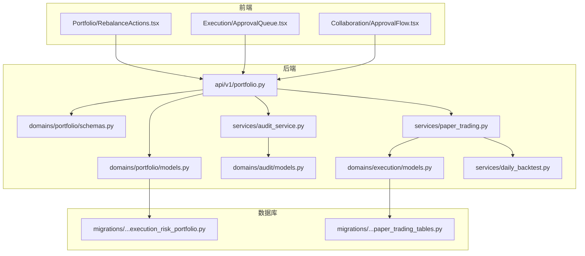
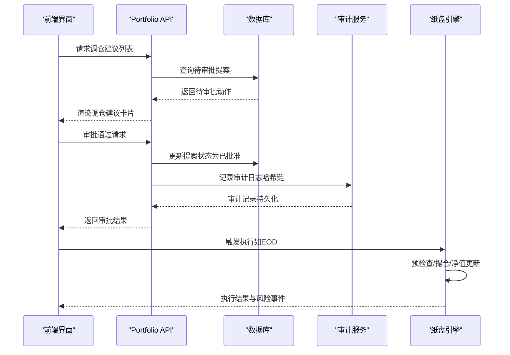
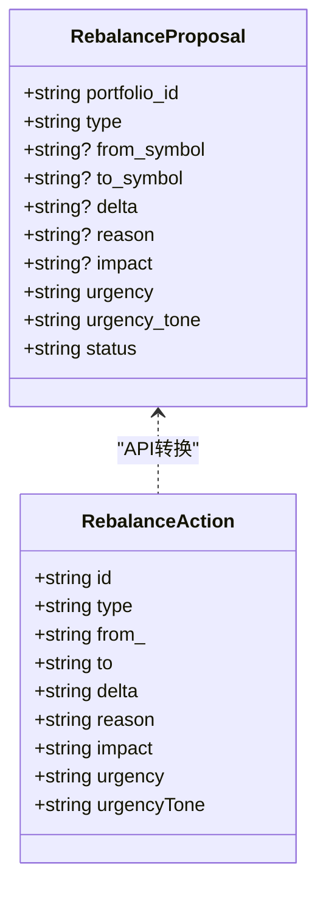
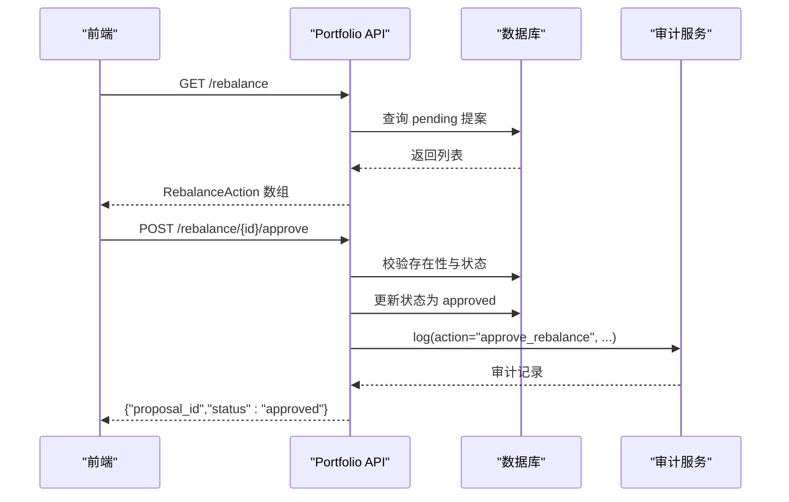
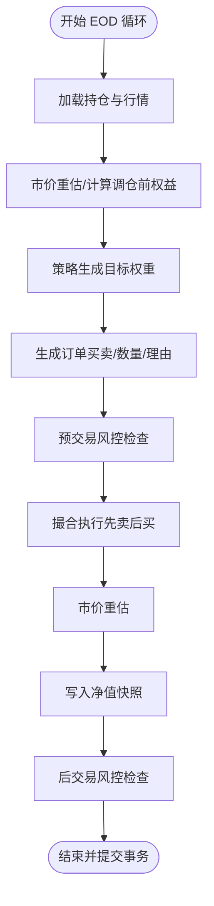
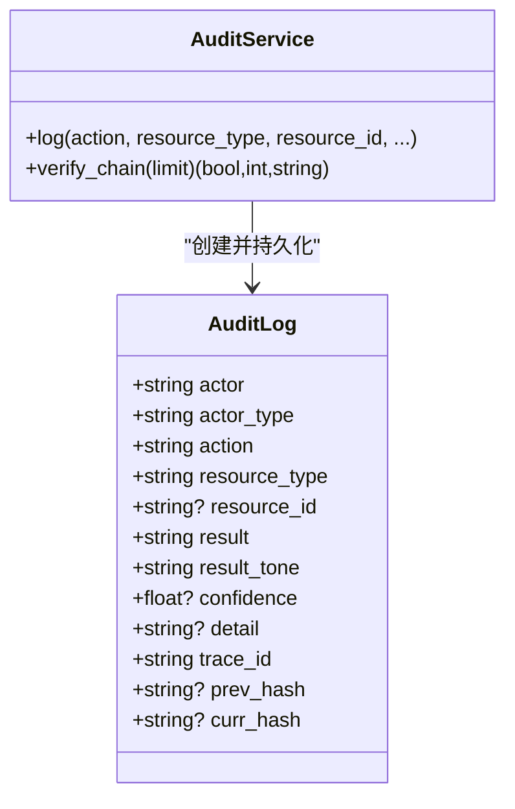
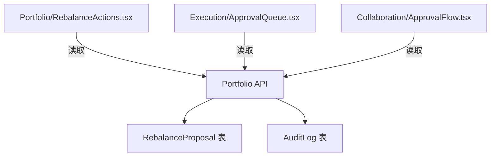
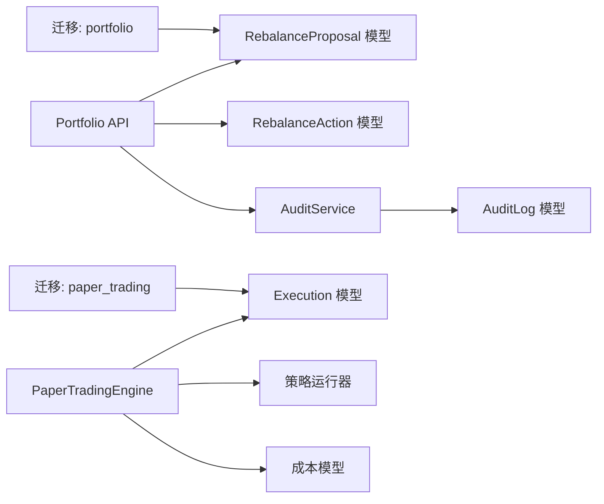

# 再平衡系统

<cite>
**本文引用的文件**
- [backend/app/domains/portfolio/models.py](file://backend/app/domains/portfolio/models.py)
- [backend/app/domains/portfolio/schemas.py](file://backend/app/domains/portfolio/schemas.py)
- [backend/app/api/v1/portfolio.py](file://backend/app/api/v1/portfolio.py)
- [backend/app/services/paper_trading.py](file://backend/app/services/paper_trading.py)
- [backend/app/services/daily_backtest.py](file://backend/app/services/daily_backtest.py)
- [backend/app/services/audit_service.py](file://backend/app/services/audit_service.py)
- [backend/app/domains/audit/models.py](file://backend/app/domains/audit/models.py)
- [backend/app/domains/execution/models.py](file://backend/app/domains/execution/models.py)
- [frontend/src/screens/Portfolio/RebalanceActions.tsx](file://frontend/src/screens/Portfolio/RebalanceActions.tsx)
- [frontend/src/screens/Execution/ApprovalQueue.tsx](file://frontend/src/screens/Execution/ApprovalQueue.tsx)
- [frontend/src/screens/Collaboration/ApprovalFlow.tsx](file://frontend/src/screens/Collaboration/ApprovalFlow.tsx)
- [backend/app/db/migrations/versions/20260513_000001_execution_risk_portfolio.py](file://backend/app/db/migrations/versions/20260513_000001_execution_risk_portfolio.py)
- [backend/app/db/migrations/versions/49c0724c647e_paper_trading_tables.py](file://backend/app/db/migrations/versions/49c0724c647e_paper_trading_tables.py)
- [backend/tests/api/test_screens.py](file://backend/tests/api/test_screens.py)
</cite>

## 目录
1. [简介](#简介)
2. [项目结构](#项目结构)
3. [核心组件](#核心组件)
4. [架构总览](#架构总览)
5. [详细组件分析](#详细组件分析)
6. [依赖关系分析](#依赖关系分析)
7. [性能考量](#性能考量)
8. [故障排查指南](#故障排查指南)
9. [结论](#结论)
10. [附录](#附录)

## 简介
本文件面向量化投资组合的动态再平衡系统，围绕“再平衡提案生成—自动化调仓执行—人工审批流程—审计追踪”闭环进行系统化说明。重点覆盖以下方面：
- 再平衡提案与动作的数据模型与接口定义
- 调仓时机判断与执行策略（含预交易风控）
- 审计追踪与哈希链验证机制
- 前端交互界面与审批流程设计
- 算法与流程图示，帮助开发者快速理解并扩展系统

## 项目结构
再平衡系统横跨后端领域模型与服务层、API 层、前端界面层，以及数据库迁移脚本与测试用例，形成前后端协同、数据驱动的闭环。

**图表来源**
- [backend/app/api/v1/portfolio.py:1-186](file://backend/app/api/v1/portfolio.py#L1-L186)
- [backend/app/domains/portfolio/models.py:68-82](file://backend/app/domains/portfolio/models.py#L68-L82)
- [backend/app/domains/portfolio/schemas.py:75-85](file://backend/app/domains/portfolio/schemas.py#L75-L85)
- [backend/app/services/audit_service.py:1-109](file://backend/app/services/audit_service.py#L1-L109)
- [backend/app/domains/audit/models.py:9-26](file://backend/app/domains/audit/models.py#L9-L26)
- [backend/app/services/paper_trading.py:76-134](file://backend/app/services/paper_trading.py#L76-L134)
- [backend/app/domains/execution/models.py:9-31](file://backend/app/domains/execution/models.py#L9-L31)
- [backend/app/services/daily_backtest.py:569-582](file://backend/app/services/daily_backtest.py#L569-L582)
- [backend/app/db/migrations/versions/20260513_000001_execution_risk_portfolio.py:276-290](file://backend/app/db/migrations/versions/20260513_000001_execution_risk_portfolio.py#L276-L290)
- [backend/app/db/migrations/versions/49c0724c647e_paper_trading_tables.py:155-172](file://backend/app/db/migrations/versions/49c0724c647e_paper_trading_tables.py#L155-L172)

**章节来源**
- [backend/app/api/v1/portfolio.py:1-186](file://backend/app/api/v1/portfolio.py#L1-L186)
- [frontend/src/screens/Portfolio/RebalanceActions.tsx:1-82](file://frontend/src/screens/Portfolio/RebalanceActions.tsx#L1-L82)
- [backend/app/db/migrations/versions/20260513_000001_execution_risk_portfolio.py:276-290](file://backend/app/db/migrations/versions/20260513_000001_execution_risk_portfolio.py#L276-L290)

## 核心组件
- 再平衡提案与动作
  - 提案模型：记录调仓类型、标的、方向、原因、影响、紧急度与状态等
  - 动作模型：用于前端展示的调仓建议条目
- 审计追踪
  - 审计日志模型与服务，提供不可篡改的哈希链
- 执行引擎
  - 纸盘引擎：每日执行流程（标记、信号、预检查、撮合、净值）
  - 风控规则：单票上限、现金底仓、日损/回撤阈值
- 前端界面
  - 调仓建议卡片、审批队列、协作审批流

**章节来源**
- [backend/app/domains/portfolio/models.py:68-82](file://backend/app/domains/portfolio/models.py#L68-L82)
- [backend/app/domains/portfolio/schemas.py:75-85](file://backend/app/domains/portfolio/schemas.py#L75-L85)
- [backend/app/services/audit_service.py:32-81](file://backend/app/services/audit_service.py#L32-L81)
- [backend/app/services/paper_trading.py:76-134](file://backend/app/services/paper_trading.py#L76-L134)
- [frontend/src/screens/Portfolio/RebalanceActions.tsx:28-81](file://frontend/src/screens/Portfolio/RebalanceActions.tsx#L28-L81)

## 架构总览
再平衡系统采用“AI策略生成目标—数据库存储提案—人工审批—执行引擎落地—审计日志留痕”的闭环设计。前端通过 API 获取待审批的再平衡建议，审批通过后由执行引擎按规则执行，同时写入审计日志。

**图表来源**
- [backend/app/api/v1/portfolio.py:161-185](file://backend/app/api/v1/portfolio.py#L161-L185)
- [backend/app/services/audit_service.py:38-81](file://backend/app/services/audit_service.py#L38-L81)
- [backend/app/services/paper_trading.py:82-134](file://backend/app/services/paper_trading.py#L82-L134)

## 详细组件分析

### 数据模型与接口：RebalanceProposal 与 RebalanceAction
- RebalanceProposal（数据库表）字段要点
  - portfolio_id：归属组合
  - type：调仓类型（reduce/add/rotate/hedge）
  - from_symbol/to_symbol：来源/目标标的
  - delta：数量或权重变化
  - reason/impact：触发原因与影响描述
  - urgency/urgency_tone/status：紧急度、颜色标识与状态（pending/approved/rejected/executed）
- RebalanceAction（响应模型）字段要点
  - id/type/from_/to/delta/urgency/urgencyTone
  - 用于前端渲染调仓建议卡片

**图表来源**
- [backend/app/domains/portfolio/models.py:68-82](file://backend/app/domains/portfolio/models.py#L68-L82)
- [backend/app/domains/portfolio/schemas.py:75-85](file://backend/app/domains/portfolio/schemas.py#L75-L85)

**章节来源**
- [backend/app/domains/portfolio/models.py:68-82](file://backend/app/domains/portfolio/models.py#L68-L82)
- [backend/app/domains/portfolio/schemas.py:75-85](file://backend/app/domains/portfolio/schemas.py#L75-L85)
- [backend/app/db/migrations/versions/20260513_000001_execution_risk_portfolio.py:276-290](file://backend/app/db/migrations/versions/20260513_000001_execution_risk_portfolio.py#L276-L290)

### 再平衡提案 API 与审批流程
- 列表接口
  - GET /api/v1/portfolio/rebalance：返回 status=pending 的 RebalanceAction 列表
- 审批接口
  - POST /api/v1/portfolio/rebalance/{proposal_id}/approve：校验状态并更新为 approved，同时写入审计日志

**图表来源**
- [backend/app/api/v1/portfolio.py:155-185](file://backend/app/api/v1/portfolio.py#L155-L185)
- [backend/app/services/audit_service.py:38-81](file://backend/app/services/audit_service.py#L38-L81)

**章节来源**
- [backend/app/api/v1/portfolio.py:155-185](file://backend/app/api/v1/portfolio.py#L155-L185)

### 调仓时机判断与执行策略
- 时机判断
  - 纸盘引擎每日运行一次，基于策略信号生成目标权重，计算目标头寸并生成订单
  - 预交易风控：单票上限、现金底仓、无效价格等
  - 撮合执行：先清仓/减持再买入，考虑滑点、佣金、印花税
  - 后交易风控：日损超阈值、最大回撤超阈值
- 执行策略
  - 目标权重到目标数量的映射，依据市价与成本模型执行
  - 成交记录与净值快照落库

**图表来源**
- [backend/app/services/paper_trading.py:82-134](file://backend/app/services/paper_trading.py#L82-L134)
- [backend/app/services/paper_trading.py:314-372](file://backend/app/services/paper_trading.py#L314-L372)
- [backend/app/services/paper_trading.py:374-498](file://backend/app/services/paper_trading.py#L374-L498)
- [backend/app/services/paper_trading.py:536-577](file://backend/app/services/paper_trading.py#L536-L577)

**章节来源**
- [backend/app/services/paper_trading.py:76-134](file://backend/app/services/paper_trading.py#L76-L134)
- [backend/app/services/paper_trading.py:314-372](file://backend/app/services/paper_trading.py#L314-L372)
- [backend/app/services/paper_trading.py:374-498](file://backend/app/services/paper_trading.py#L374-L498)
- [backend/app/services/paper_trading.py:536-577](file://backend/app/services/paper_trading.py#L536-L577)

### 审计追踪与哈希链验证
- 审计日志模型
  - 包含 actor/actor_type/action/resource_type/resource_id/result/result_tone/detail/trace_id 等
  - 支持 prev_hash/curr_hash 形成不可篡改链
- 审计服务
  - 自动取最新记录 prev_hash，计算 curr_hash 并持久化
  - 提供 verify_chain 进行链式校验

**图表来源**
- [backend/app/domains/audit/models.py:9-26](file://backend/app/domains/audit/models.py#L9-L26)
- [backend/app/services/audit_service.py:32-81](file://backend/app/services/audit_service.py#L32-L81)

**章节来源**
- [backend/app/domains/audit/models.py:9-26](file://backend/app/domains/audit/models.py#L9-L26)
- [backend/app/services/audit_service.py:32-81](file://backend/app/services/audit_service.py#L32-L81)

### 前端操作界面与审批流程
- 调仓建议卡片
  - 展示类型图标/标签、紧急度色带、方向箭头、delta、原因与影响
  - 支持单个/批量审批入口
- 审批队列
  - 展示待审批订单的倒计时、紧急度与类型色带
- 协作审批流
  - 展示审批阶段进度与负责人

**图表来源**
- [frontend/src/screens/Portfolio/RebalanceActions.tsx:28-81](file://frontend/src/screens/Portfolio/RebalanceActions.tsx#L28-L81)
- [frontend/src/screens/Execution/ApprovalQueue.tsx:44-76](file://frontend/src/screens/Execution/ApprovalQueue.tsx#L44-L76)
- [frontend/src/screens/Collaboration/ApprovalFlow.tsx:1-40](file://frontend/src/screens/Collaboration/ApprovalFlow.tsx#L1-L40)
- [backend/app/api/v1/portfolio.py:155-185](file://backend/app/api/v1/portfolio.py#L155-L185)

**章节来源**
- [frontend/src/screens/Portfolio/RebalanceActions.tsx:1-82](file://frontend/src/screens/Portfolio/RebalanceActions.tsx#L1-L82)
- [frontend/src/screens/Execution/ApprovalQueue.tsx:1-76](file://frontend/src/screens/Execution/ApprovalQueue.tsx#L1-L76)
- [frontend/src/screens/Collaboration/ApprovalFlow.tsx:1-40](file://frontend/src/screens/Collaboration/ApprovalFlow.tsx#L1-L40)

## 依赖关系分析
- 数据模型与迁移
  - RebalanceProposal 表由迁移脚本创建，包含索引与默认值
  - Paper 风控表（paper_risk_breaches）支持后交易风控
- API 与服务
  - Portfolio API 依赖 SQLAlchemy 查询与审计服务
  - 纸盘引擎依赖市场行情、策略运行器、成本模型与风控规则
- 前后端耦合
  - 前端通过 RebalanceAction 字段直接消费后端返回的结构
  - 审批接口与审计服务强耦合，确保可追溯性

**图表来源**
- [backend/app/db/migrations/versions/20260513_000001_execution_risk_portfolio.py:276-290](file://backend/app/db/migrations/versions/20260513_000001_execution_risk_portfolio.py#L276-L290)
- [backend/app/db/migrations/versions/49c0724c647e_paper_trading_tables.py:155-172](file://backend/app/db/migrations/versions/49c0724c647e_paper_trading_tables.py#L155-L172)
- [backend/app/services/paper_trading.py:76-134](file://backend/app/services/paper_trading.py#L76-L134)

**章节来源**
- [backend/app/db/migrations/versions/20260513_000001_execution_risk_portfolio.py:276-290](file://backend/app/db/migrations/versions/20260513_000001_execution_risk_portfolio.py#L276-L290)
- [backend/app/db/migrations/versions/49c0724c647e_paper_trading_tables.py:155-172](file://backend/app/db/migrations/versions/49c0724c647e_paper_trading_tables.py#L155-L172)
- [backend/app/services/paper_trading.py:76-134](file://backend/app/services/paper_trading.py#L76-L134)

## 性能考量
- 查询优化
  - RebalanceProposal 使用 portfolio_id 索引与按时间倒序限制返回数量，避免全表扫描
- 执行效率
  - 订单按买卖顺序处理，先卖后买减少资金占用与阻塞
  - 成本计算与撮合在内存中完成，数据库仅做幂等写入
- 风控开销
  - 预检查与后检查均以常数次查询完成，避免复杂联表
- 可扩展性
  - 策略参数与目标权重解耦，便于替换策略与调整风控阈值

## 故障排查指南
- 审批失败
  - 若提案不存在或状态非 pending，接口会返回错误；检查提案 ID 与状态
- 执行失败
  - 预检查失败：单票超限、现金不足、无效价格等；查看 PaperPreTradeCheck 结果
  - 撮合失败：资金不足、无可用头寸、滑点导致无法成交；查看 PaperFill 与账户余额
  - 后检查告警：日损超阈值、最大回撤超阈值；查看 PaperRiskBreach
- 审计链异常
  - 使用 verify_chain 校验最近 N 条记录，定位断裂位置与破坏记录 ID

**章节来源**
- [backend/app/api/v1/portfolio.py:161-185](file://backend/app/api/v1/portfolio.py#L161-L185)
- [backend/app/services/paper_trading.py:314-372](file://backend/app/services/paper_trading.py#L314-L372)
- [backend/app/services/paper_trading.py:374-498](file://backend/app/services/paper_trading.py#L374-L498)
- [backend/app/services/paper_trading.py:536-577](file://backend/app/services/paper_trading.py#L536-L577)
- [backend/app/services/audit_service.py:83-109](file://backend/app/services/audit_service.py#L83-L109)

## 结论
再平衡系统通过“AI策略—数据库提案—人工审批—引擎执行—审计留痕”的完整闭环，实现了可解释、可追溯、可风控的动态调仓机制。前端界面直观呈现调仓建议与审批状态，后端以严格的风控与成本模型保障执行质量。该设计既满足自动化效率，又保留了人工干预与审计能力，适合在实盘与纸盘场景中稳健演进。

## 附录
- 测试用例参考
  - 种子 pending 提案用于接口测试，便于验证前端与后端集成

**章节来源**
- [backend/tests/api/test_screens.py:73-112](file://backend/tests/api/test_screens.py#L73-L112)