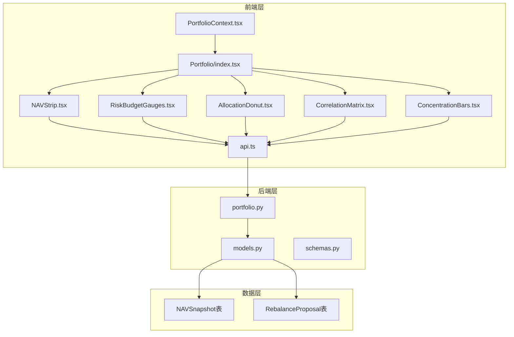
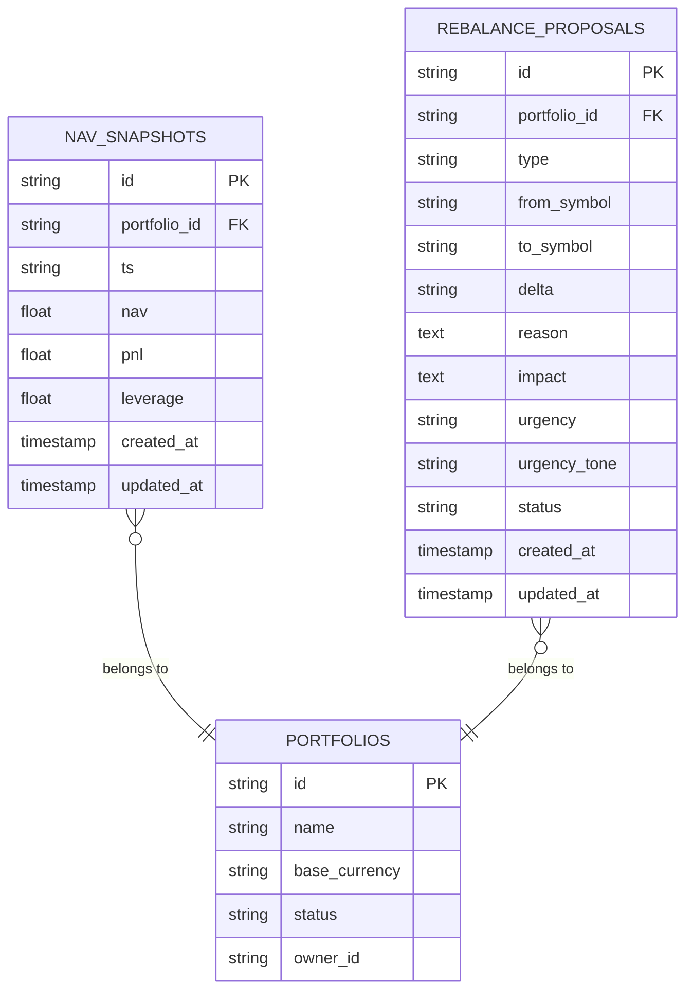
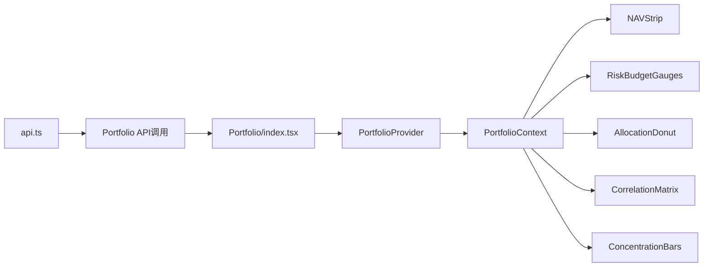
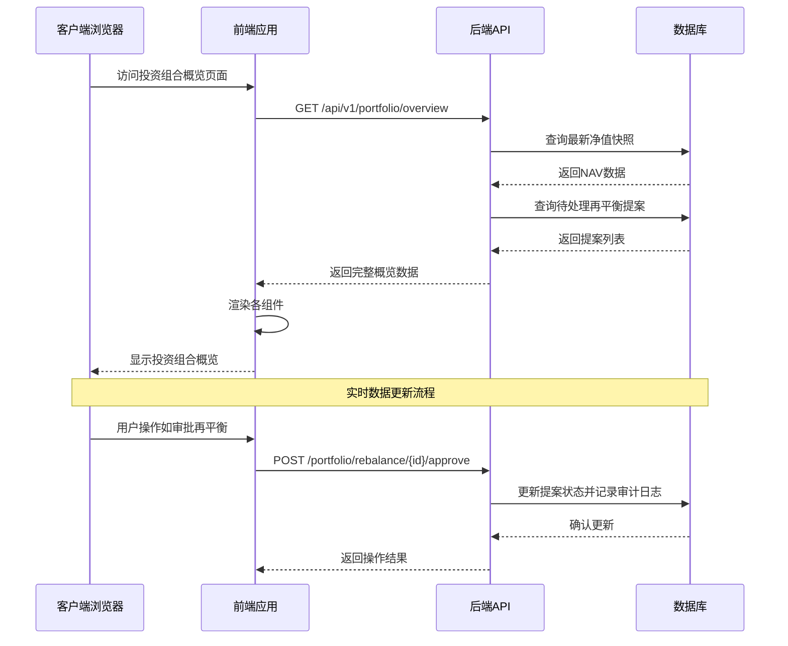
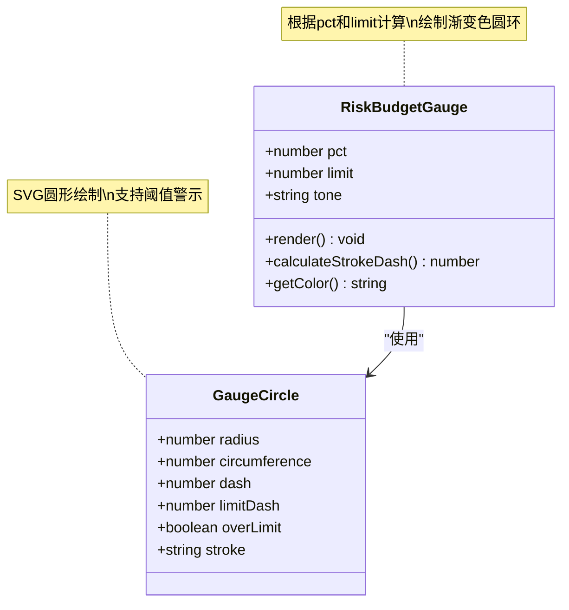
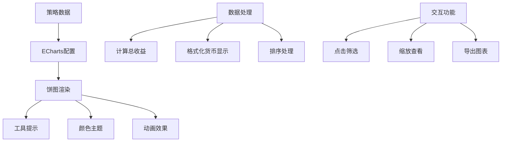
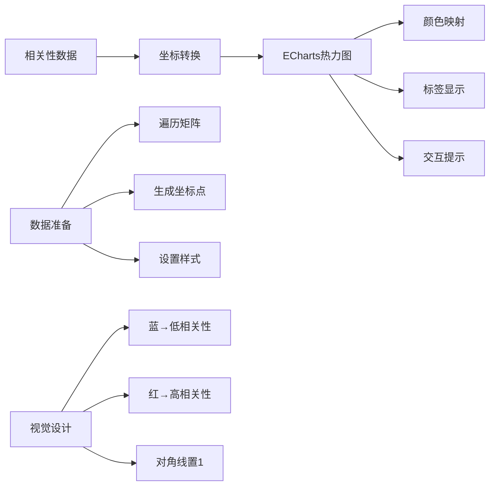
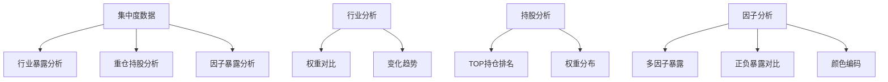
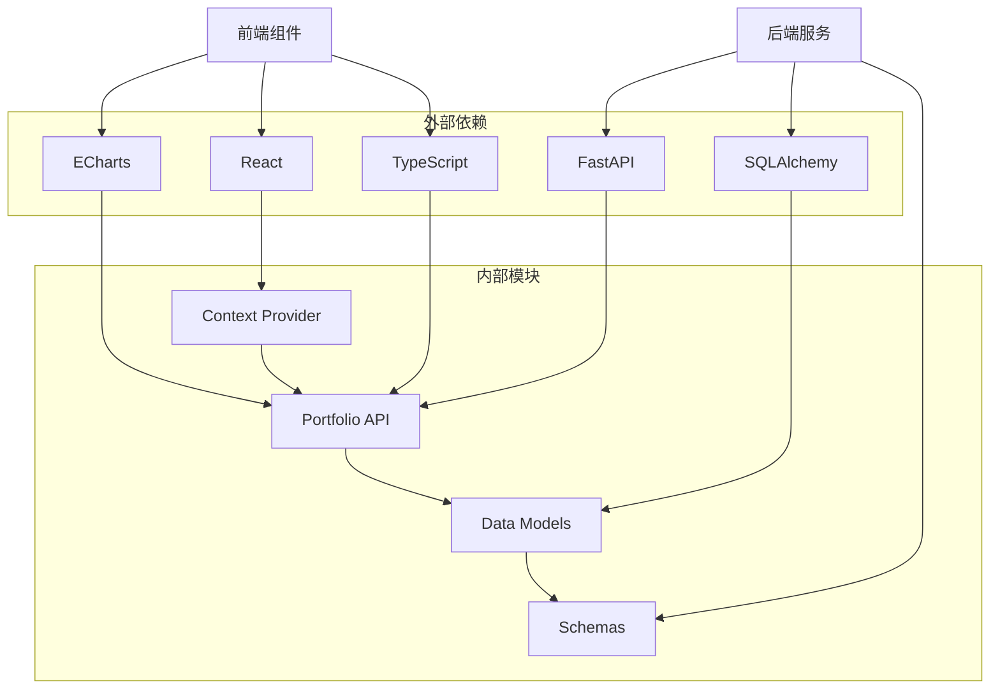

# 投资组合概览

<cite>
**本文档引用的文件**
- [backend/app/api/v1/portfolio.py](file://backend/app/api/v1/portfolio.py)
- [backend/app/domains/portfolio/models.py](file://backend/app/domains/portfolio/models.py)
- [backend/app/domains/portfolio/schemas.py](file://backend/app/domains/portfolio/schemas.py)
- [frontend/src/lib/api.ts](file://frontend/src/lib/api.ts)
- [frontend/src/contexts/PortfolioContext.tsx](file://frontend/src/contexts/PortfolioContext.tsx)
- [frontend/src/screens/Portfolio/index.tsx](file://frontend/src/screens/Portfolio/index.tsx)
- [frontend/src/screens/Portfolio/NAVStrip.tsx](file://frontend/src/screens/Portfolio/NAVStrip.tsx)
- [frontend/src/screens/Portfolio/RiskBudgetGauges.tsx](file://frontend/src/screens/Portfolio/RiskBudgetGauges.tsx)
- [frontend/src/screens/Portfolio/AllocationDonut.tsx](file://frontend/src/screens/Portfolio/AllocationDonut.tsx)
- [frontend/src/screens/Portfolio/CorrelationMatrix.tsx](file://frontend/src/screens/Portfolio/CorrelationMatrix.tsx)
- [frontend/src/screens/Portfolio/ConcentrationBars.tsx](file://frontend/src/screens/Portfolio/ConcentrationBars.tsx)
- [frontend/src/data/types.ts](file://frontend/src/data/types.ts)
- [frontend/src/data/mock_ashare.ts](file://frontend/src/data/mock_ashare.ts)
</cite>

## 目录
1. [简介](#简介)
2. [项目结构](#项目结构)
3. [核心组件](#核心组件)
4. [架构概览](#架构概览)
5. [详细组件分析](#详细组件分析)
6. [依赖分析](#依赖分析)
7. [性能考虑](#性能考虑)
8. [故障排除指南](#故障排除指南)
9. [结论](#结论)

## 简介

投资组合概览是量化交易系统中的核心功能模块，负责提供组合的实时财务状况、风险指标和关键绩效指标的综合视图。该功能集成了净值计算、实时收益追踪、风险指标展示和关键绩效指标汇总，为用户提供完整的投资组合洞察。

本系统采用前后端分离架构，后端使用FastAPI提供RESTful API，前端使用React + TypeScript构建响应式用户界面。数据通过ECharts进行可视化展示，支持多种图表类型包括仪表盘、饼图、热力图和条形图。

## 项目结构

投资组合概览功能跨越了后端API服务、数据库模型、前端组件等多个层次：



**图表来源**
- [frontend/src/contexts/PortfolioContext.tsx:1-13](file://frontend/src/contexts/PortfolioContext.tsx#L1-L13)
- [frontend/src/screens/Portfolio/index.tsx:1-43](file://frontend/src/screens/Portfolio/index.tsx#L1-L43)
- [backend/app/api/v1/portfolio.py:1-186](file://backend/app/api/v1/portfolio.py#L1-L186)
- [backend/app/domains/portfolio/models.py:1-83](file://backend/app/domains/portfolio/models.py#L1-L83)

**章节来源**
- [backend/app/api/v1/portfolio.py:1-186](file://backend/app/api/v1/portfolio.py#L1-L186)
- [frontend/src/screens/Portfolio/index.tsx:17-42](file://frontend/src/screens/Portfolio/index.tsx#L17-L42)

## 核心组件

### 后端API服务

后端提供了专门的投资组合概览API，包含以下核心功能：

1. **净值计算服务** - 从`nav_snapshots`表获取最新净值快照
2. **再平衡提案管理** - 查询和审批再平衡提案
3. **静态数据聚合** - 提供风险预算、资产配置、相关性和集中度等静态指标

### 数据模型结构

系统使用SQLAlchemy ORM定义了核心数据模型：



**图表来源**
- [backend/app/domains/portfolio/models.py:56-83](file://backend/app/domains/portfolio/models.py#L56-L83)

### 前端组件架构

前端采用React Hooks模式，通过Context提供数据共享：



**图表来源**
- [frontend/src/contexts/PortfolioContext.tsx:1-13](file://frontend/src/contexts/PortfolioContext.tsx#L1-L13)
- [frontend/src/screens/Portfolio/index.tsx:28-41](file://frontend/src/screens/Portfolio/index.tsx#L28-L41)

**章节来源**
- [backend/app/domains/portfolio/models.py:9-83](file://backend/app/domains/portfolio/models.py#L9-L83)
- [frontend/src/contexts/PortfolioContext.tsx:1-13](file://frontend/src/contexts/PortfolioContext.tsx#L1-L13)

## 架构概览

投资组合概览采用分层架构设计，确保了良好的可维护性和扩展性：



**图表来源**
- [frontend/src/lib/api.ts:671-678](file://frontend/src/lib/api.ts#L671-L678)
- [backend/app/api/v1/portfolio.py:140-186](file://backend/app/api/v1/portfolio.py#L140-L186)

系统的关键特性包括：

1. **实时数据获取** - 通过API实时拉取最新的投资组合数据
2. **多维度指标展示** - 包含净值、收益、风险、配置等全方位指标
3. **交互式可视化** - 使用ECharts提供丰富的图表展示
4. **权限控制** - 支持再平衡提案的审批流程
5. **审计追踪** - 完整的操作日志记录

**章节来源**
- [backend/app/api/v1/portfolio.py:140-186](file://backend/app/api/v1/portfolio.py#L140-L186)
- [frontend/src/lib/api.ts:671-678](file://frontend/src/lib/api.ts#L671-L678)

## 详细组件分析

### 净值计算组件 (NAVStrip)

净值计算组件负责展示组合的核心财务指标：

```mermaid
flowchart TD
A[获取净值数据] --> B[计算今日收益百分比]
B --> C[格式化货币显示]
C --> D[判断收益正负]
D --> E[渲染指标卡片]
F[指标计算公式] --> G[pct = pnl / (nav - pnl) * 100]
G --> H[处理除零情况]
H --> I[保留两位小数]
J[格式化规则] --> K{货币类型}
K --> |CNY| L[¥格式显示]
K --> |USDT/USD| M[$格式显示]
L --> N[千/百万单位转换]
M --> N
```

**图表来源**
- [backend/app/api/v1/portfolio.py:87-112](file://backend/app/api/v1/portfolio.py#L87-L112)
- [frontend/src/screens/Portfolio/NAVStrip.tsx:3-14](file://frontend/src/screens/Portfolio/NAVStrip.tsx#L3-L14)

净值计算的关键实现要点：

1. **收益计算公式**：`pct = pnl / (nav - pnl) * 100`
2. **货币格式化**：支持人民币(CNY)和美元(USD/USDT)两种货币
3. **单位转换**：自动将大额数值转换为K/M格式
4. **颜色编码**：根据收益正负动态调整显示颜色

### 风险预算仪表盘 (RiskBudgetGauges)

风险预算组件使用SVG实现圆形仪表盘，展示各项风险指标的使用情况：



**图表来源**
- [frontend/src/screens/Portfolio/RiskBudgetGauges.tsx:3-59](file://frontend/src/screens/Portfolio/RiskBudgetGauges.tsx#L3-L59)

仪表盘的实现特点：

1. **渐变色彩系统** - 使用CSS渐变实现流畅的颜色过渡
2. **阈值警示** - 当使用率超过限制时显示红色警示
3. **响应式设计** - 自适应不同屏幕尺寸
4. **实时更新** - 支持动态数据刷新

### 资产配置饼图 (AllocationDonut)

资产配置组件使用ECharts实现交互式饼图，展示策略权重分布：



**图表来源**
- [frontend/src/screens/Portfolio/AllocationDonut.tsx:50-89](file://frontend/src/screens/Portfolio/AllocationDonut.tsx#L50-L89)

饼图的核心功能：

1. **策略权重可视化** - 直观展示各策略的资产配置比例
2. **收益贡献分析** - 显示各策略的收益贡献度
3. **交互式探索** - 支持鼠标悬停查看详细信息
4. **响应式布局** - 自适应容器大小变化

### 相关性热力图 (CorrelationMatrix)

相关性矩阵组件展示策略间的相关性关系：



**图表来源**
- [frontend/src/screens/Portfolio/CorrelationMatrix.tsx:44-133](file://frontend/src/screens/Portfolio/CorrelationMatrix.tsx#L44-L133)

热力图的设计特色：

1. **颜色编码系统** - 蓝色表示低相关性，红色表示高相关性
2. **对称矩阵** - 展示策略间双向相关性关系
3. **实时更新** - 支持动态数据刷新
4. **详细提示** - 鼠标悬停显示具体相关系数

### 集中度分析 (ConcentrationBars)

集中度组件提供多维度的持仓集中度分析：



**图表来源**
- [frontend/src/screens/Portfolio/ConcentrationBars.tsx:11-122](file://frontend/src/screens/Portfolio/ConcentrationBars.tsx#L11-L122)

集中度分析的功能特点：

1. **多维度展示** - 同时分析行业、个股和因子三个层面
2. **动态比较** - 使用相对比例进行横向比较
3. **趋势指示** - 显示权重变化的方向和幅度
4. **风险警示** - 识别潜在的过度集中风险

**章节来源**
- [frontend/src/screens/Portfolio/NAVStrip.tsx:16-44](file://frontend/src/screens/Portfolio/NAVStrip.tsx#L16-L44)
- [frontend/src/screens/Portfolio/RiskBudgetGauges.tsx:61-90](file://frontend/src/screens/Portfolio/RiskBudgetGauges.tsx#L61-L90)
- [frontend/src/screens/Portfolio/AllocationDonut.tsx:7-158](file://frontend/src/screens/Portfolio/AllocationDonut.tsx#L7-L158)
- [frontend/src/screens/Portfolio/CorrelationMatrix.tsx:5-153](file://frontend/src/screens/Portfolio/CorrelationMatrix.tsx#L5-L153)
- [frontend/src/screens/Portfolio/ConcentrationBars.tsx:1-122](file://frontend/src/screens/Portfolio/ConcentrationBars.tsx#L1-L122)

## 依赖分析

系统各组件之间的依赖关系清晰明确：



**图表来源**
- [frontend/src/lib/api.ts:514-779](file://frontend/src/lib/api.ts#L514-L779)
- [backend/app/api/v1/portfolio.py:1-27](file://backend/app/api/v1/portfolio.py#L1-L27)

主要依赖关系：

1. **前端技术栈** - React + TypeScript + ECharts
2. **后端技术栈** - FastAPI + SQLAlchemy + PostgreSQL
3. **数据传输** - JSON格式的RESTful API
4. **状态管理** - React Context提供数据共享
5. **可视化库** - ECharts提供丰富的图表功能

**章节来源**
- [frontend/src/lib/api.ts:514-779](file://frontend/src/lib/api.ts#L514-L779)
- [backend/app/api/v1/portfolio.py:1-27](file://backend/app/api/v1/portfolio.py#L1-L27)

## 性能考虑

### 数据加载优化

1. **懒加载策略** - 图表组件按需初始化，避免不必要的资源消耗
2. **缓存机制** - 前端对API响应进行缓存，减少重复请求
3. **增量更新** - 支持部分数据更新，而非全量刷新

### 渲染性能

1. **虚拟滚动** - 对于大量数据的表格组件使用虚拟滚动
2. **防抖处理** - 避免频繁的窗口resize事件触发重绘
3. **组件拆分** - 将大型组件拆分为多个独立的小组件

### API性能

1. **批量查询** - 后端支持一次请求返回多个指标
2. **索引优化** - 数据库对常用查询字段建立索引
3. **连接池** - 使用连接池管理数据库连接

## 故障排除指南

### 常见问题及解决方案

1. **数据加载失败**
   - 检查API端点是否可达
   - 验证认证令牌有效性
   - 查看网络连接状态

2. **图表渲染异常**
   - 确认容器元素可见性
   - 检查数据格式正确性
   - 验证ECharts库加载状态

3. **权限相关错误**
   - 确认用户具有相应权限
   - 检查会话状态
   - 重新登录系统

### 调试工具

1. **浏览器开发者工具** - 监控网络请求和响应
2. **后端日志** - 查看API调用日志
3. **数据库查询** - 验证数据存储状态

**章节来源**
- [frontend/src/lib/api.ts:32-57](file://frontend/src/lib/api.ts#L32-L57)
- [backend/app/api/v1/portfolio.py:161-186](file://backend/app/api/v1/portfolio.py#L161-L186)

## 结论

投资组合概览功能通过精心设计的架构和组件实现了全面的投资组合监控能力。系统具备以下优势：

1. **完整性** - 覆盖了净值计算、收益追踪、风险管理和配置分析的所有核心需求
2. **实时性** - 通过API实现数据的实时获取和展示
3. **可视化** - 使用多种图表类型提供直观的数据洞察
4. **可扩展性** - 模块化的架构设计便于功能扩展和维护
5. **用户体验** - 响应式的界面设计和丰富的交互功能

该系统为量化交易团队提供了强大的决策支持工具，能够帮助用户及时了解投资组合的状态并做出相应的调整决策。通过持续的优化和扩展，该功能将继续为用户提供更加精准和及时的投资组合洞察。