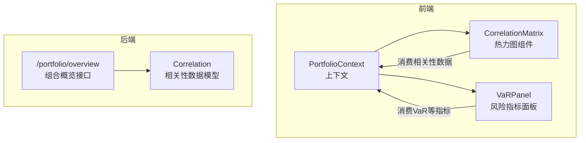
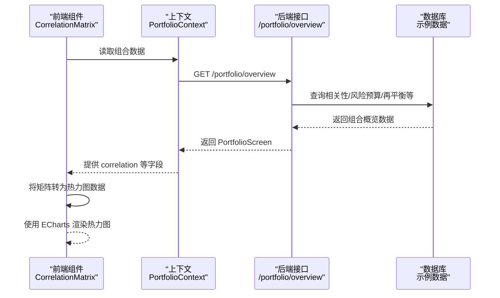
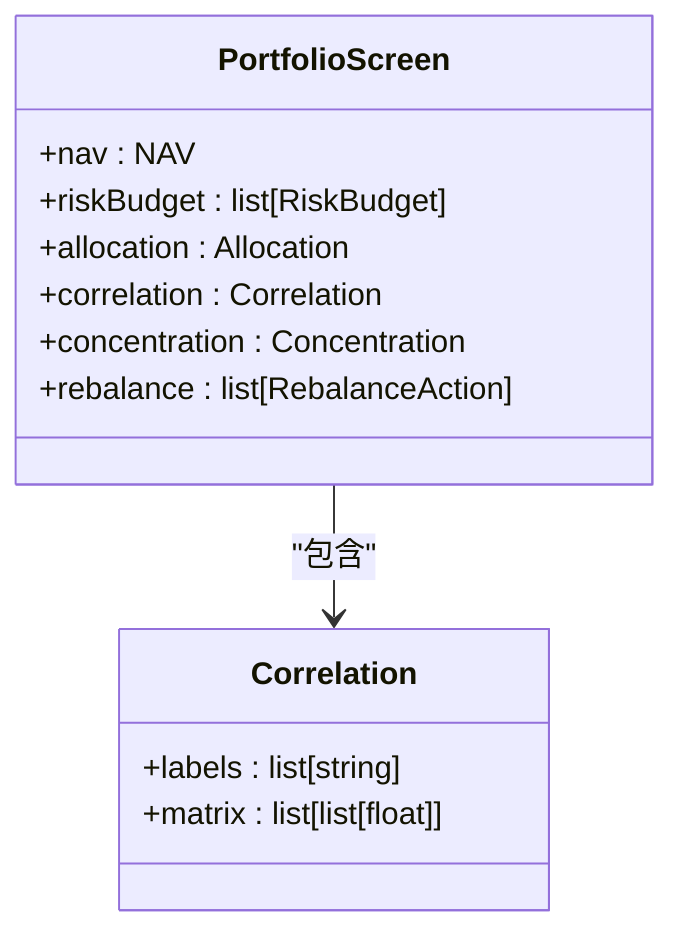
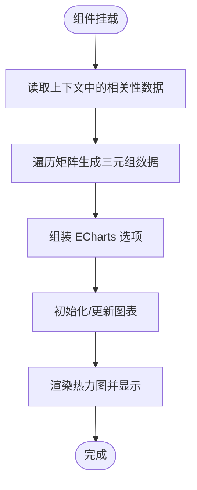
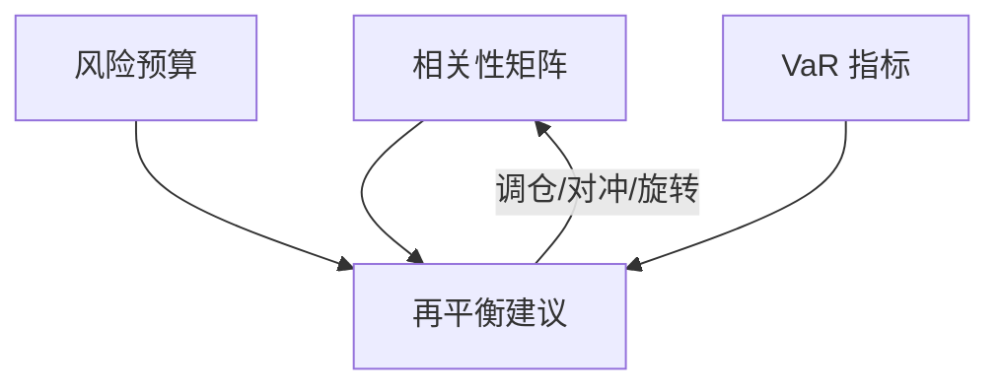
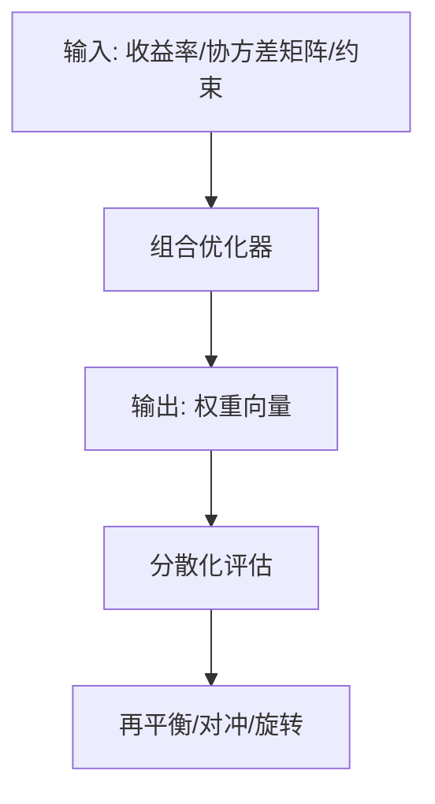
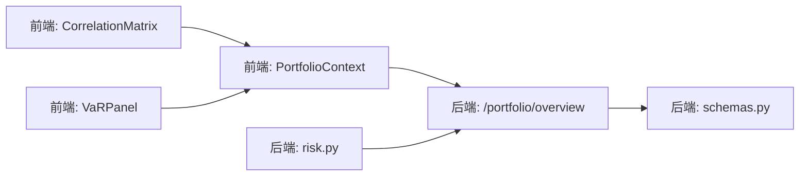

# 相关性分析

<cite>
**本文档引用的文件**
- [CorrelationMatrix.tsx](file://frontend/src/screens/Portfolio/CorrelationMatrix.tsx)
- [portfolio.py](file://backend/app/api/v1/portfolio.py)
- [schemas.py](file://backend/app/domains/portfolio/schemas.py)
- [PortfolioContext.tsx](file://frontend/src/contexts/PortfolioContext.tsx)
- [mock_ashare.ts](file://frontend/src/data/mock_ashare.ts)
- [types.ts](file://frontend/src/data/types.ts)
- [03-核心模块设计.md](file://doc/03-核心模块设计.md)
- [07-后端项目设计说明书.md](file://doc/07-后端项目设计说明书.md)
- [risk.py](file://backend/app/api/v1/risk.py)
- [VaRPanel.tsx](file://frontend/src/screens/Risk/VaRPanel.tsx)
</cite>

## 目录
1. [简介](#简介)
2. [项目结构](#项目结构)
3. [核心组件](#核心组件)
4. [架构概览](#架构概览)
5. [详细组件分析](#详细组件分析)
6. [依赖分析](#依赖分析)
7. [性能考虑](#性能考虑)
8. [故障排查指南](#故障排查指南)
9. [结论](#结论)

## 简介
本文件围绕量化投资组合中的“相关性分析”能力，系统阐述组合内资产（策略或因子）间相关性矩阵的计算、存储、传输与可视化展示，并结合风险预算、VaR 等风控指标，给出分散化效果评估与组合优化策略建议。文档同时覆盖后端接口如何提供静态示例数据、前端如何渲染热力图、以及如何将相关性与再平衡建议联动。

## 项目结构
相关性分析涉及前后端协同：
- 后端提供组合概览接口，返回包含相关性矩阵的数据结构；
- 前端通过上下文消费数据，使用 ECharts 渲染热力图；
- 风控侧提供 VaR、风险预算等指标，用于综合评估相关性对组合风险的影响。

**图表来源**
- [CorrelationMatrix.tsx:1-153](file://frontend/src/screens/Portfolio/CorrelationMatrix.tsx#L1-L153)
- [portfolio.py:140-152](file://backend/app/api/v1/portfolio.py#L140-L152)
- [schemas.py:45-47](file://backend/app/domains/portfolio/schemas.py#L45-L47)

**章节来源**
- [CorrelationMatrix.tsx:1-153](file://frontend/src/screens/Portfolio/CorrelationMatrix.tsx#L1-L153)
- [portfolio.py:1-186](file://backend/app/api/v1/portfolio.py#L1-L186)
- [schemas.py:1-94](file://backend/app/domains/portfolio/schemas.py#L1-L94)

## 核心组件
- 相关性数据模型（后端）：定义相关性标签与矩阵二维数组，作为组合概览的一部分返回。
- 组合概览接口（后端）：聚合 NAV、风险预算、相关性、集中度、再平衡建议等，统一输出给前端。
- 相关性热力图组件（前端）：从上下文中读取相关性数据，转换为 ECharts 所需格式，渲染热力图。
- PortfolioContext（前端）：提供组合数据的全局上下文，供多个组件共享。
- 示例数据（前端）：提供一组示例相关性矩阵，便于演示与开发调试。
- 风控指标（前端/后端）：VaR、风险预算等，用于评估相关性变化对组合风险的影响。

**章节来源**
- [schemas.py:45-47](file://backend/app/domains/portfolio/schemas.py#L45-L47)
- [portfolio.py:140-152](file://backend/app/api/v1/portfolio.py#L140-L152)
- [CorrelationMatrix.tsx:1-153](file://frontend/src/screens/Portfolio/CorrelationMatrix.tsx#L1-L153)
- [PortfolioContext.tsx:1-13](file://frontend/src/contexts/PortfolioContext.tsx#L1-L13)
- [mock_ashare.ts:619-631](file://frontend/src/data/mock_ashare.ts#L619-L631)
- [VaRPanel.tsx:1-119](file://frontend/src/screens/Risk/VaRPanel.tsx#L1-L119)

## 架构概览
下图展示了从后端接口到前端可视化的完整流程，以及与风控指标的衔接。

**图表来源**
- [portfolio.py:140-152](file://backend/app/api/v1/portfolio.py#L140-L152)
- [CorrelationMatrix.tsx:44-133](file://frontend/src/screens/Portfolio/CorrelationMatrix.tsx#L44-L133)
- [PortfolioContext.tsx:1-13](file://frontend/src/contexts/PortfolioContext.tsx#L1-L13)

## 详细组件分析

### 相关性数据模型与接口
- 后端通过 Pydantic 模型定义相关性数据结构，包含标签列表与对称矩阵。
- 组合概览接口将相关性作为 PortfolioScreen 的一部分返回，便于前端一次性消费。

**图表来源**
- [schemas.py:45-47](file://backend/app/domains/portfolio/schemas.py#L45-L47)
- [schemas.py:87-93](file://backend/app/domains/portfolio/schemas.py#L87-L93)

**章节来源**
- [schemas.py:45-47](file://backend/app/domains/portfolio/schemas.py#L45-L47)
- [schemas.py:87-93](file://backend/app/domains/portfolio/schemas.py#L87-L93)
- [portfolio.py:140-152](file://backend/app/api/v1/portfolio.py#L140-L152)

### 前端热力图渲染流程
- 组件从 PortfolioContext 读取相关性数据；
- 将二维矩阵转换为 ECharts 所需的三元组数据（行列索引 + 相关系数）；
- 配置坐标轴、视觉映射与标签格式；
- 使用热力图 series 渲染，支持 Tooltip、高亮边框等交互。

**图表来源**
- [CorrelationMatrix.tsx:44-133](file://frontend/src/screens/Portfolio/CorrelationMatrix.tsx#L44-L133)

**章节来源**
- [CorrelationMatrix.tsx:1-153](file://frontend/src/screens/Portfolio/CorrelationMatrix.tsx#L1-L153)

### 示例数据与类型定义
- 前端示例数据包含一组扩展版相关性矩阵（更多策略维度），便于演示不同场景下的分散化效果；
- 类型定义文件明确了 PortfolioScreen 的结构，确保前后端契约一致。

**章节来源**
- [mock_ashare.ts:619-631](file://frontend/src/data/mock_ashare.ts#L619-L631)
- [types.ts:186-200](file://frontend/src/data/types.ts#L186-L200)

### 相关性与风险预算、VaR 的联动
- 风控侧提供 VaR 历史与分解，用于衡量组合整体风险；
- 相关性矩阵可辅助判断策略间的同涨同跌风险，指导再平衡与对冲；
- 风险预算限制可约束单策略或行业集中度，避免高相关性导致的系统性风险。

**图表来源**
- [VaRPanel.tsx:1-119](file://frontend/src/screens/Risk/VaRPanel.tsx#L1-L119)
- [risk.py:91-116](file://backend/app/api/v1/risk.py#L91-L116)
- [portfolio.py:155-158](file://backend/app/api/v1/portfolio.py#L155-L158)

**章节来源**
- [VaRPanel.tsx:1-119](file://frontend/src/screens/Risk/VaRPanel.tsx#L1-L119)
- [risk.py:91-116](file://backend/app/api/v1/risk.py#L91-L116)
- [portfolio.py:155-158](file://backend/app/api/v1/portfolio.py#L155-L158)

### 组合优化策略与分散化评估
- 文档中提供了组合优化器的接口设计，包括均值方差、风险平价、Black-Litterman、最大分散化等方法；
- 相关性矩阵可作为协方差矩阵的输入之一，用于优化权重分配；
- 分散化效果可通过相关性矩阵的对角线稳定性、非对角线元素大小与再平衡建议来评估。

**图表来源**
- [03-核心模块设计.md:430-451](file://doc/03-核心模块设计.md#L430-L451)

**章节来源**
- [03-核心模块设计.md:426-460](file://doc/03-核心模块设计.md#L426-L460)

## 依赖分析
- 前端组件依赖上下文提供的数据结构，热力图渲染依赖 ECharts；
- 后端接口依赖数据库模型与序列化模型，返回统一的 PortfolioScreen；
- 风控模块提供 VaR 与风险预算，与组合相关性共同构成风险评估闭环。

**图表来源**
- [CorrelationMatrix.tsx:1-153](file://frontend/src/screens/Portfolio/CorrelationMatrix.tsx#L1-L153)
- [PortfolioContext.tsx:1-13](file://frontend/src/contexts/PortfolioContext.tsx#L1-L13)
- [portfolio.py:140-152](file://backend/app/api/v1/portfolio.py#L140-L152)
- [schemas.py:87-93](file://backend/app/domains/portfolio/schemas.py#L87-L93)
- [risk.py:91-116](file://backend/app/api/v1/risk.py#L91-L116)

**章节来源**
- [CorrelationMatrix.tsx:1-153](file://frontend/src/screens/Portfolio/CorrelationMatrix.tsx#L1-L153)
- [portfolio.py:140-152](file://backend/app/api/v1/portfolio.py#L140-L152)
- [schemas.py:87-93](file://backend/app/domains/portfolio/schemas.py#L87-L93)
- [risk.py:91-116](file://backend/app/api/v1/risk.py#L91-L116)

## 性能考虑
- 相关性矩阵规模通常较小（策略/因子数量有限），前端热力图渲染开销可控；
- 建议在数据更新频率较低的场景下使用 ECharts 的 setOption 并开启增量更新；
- 若未来接入实时数据，应考虑分页或降采样策略，避免大规模矩阵频繁重绘。

## 故障排查指南
- 相关性数据为空或标签长度与矩阵维度不匹配：检查后端序列化模型与接口返回；
- 前端热力图不显示：确认上下文是否正确提供数据、容器尺寸是否有效、ECharts 初始化是否成功；
- 风控指标异常：核对 VaR 历史数据是否存在、风险预算阈值是否合理；
- 再平衡建议与相关性不一致：检查策略权重、相关性阈值与再平衡触发条件。

**章节来源**
- [portfolio.py:140-152](file://backend/app/api/v1/portfolio.py#L140-L152)
- [CorrelationMatrix.tsx:13-42](file://frontend/src/screens/Portfolio/CorrelationMatrix.tsx#L13-L42)
- [risk.py:91-116](file://backend/app/api/v1/risk.py#L91-L116)

## 结论
相关性分析是量化组合风险管理与优化的重要抓手。通过后端稳定的接口与模型、前端直观的热力图渲染，以及风控指标的联动，可以有效评估策略间的关联风险、指导分散化与再平衡决策。随着真实回测/模拟盘数据的接入，相关性矩阵可进一步演进为协方差矩阵，支撑更精细的组合优化与风险传播分析。