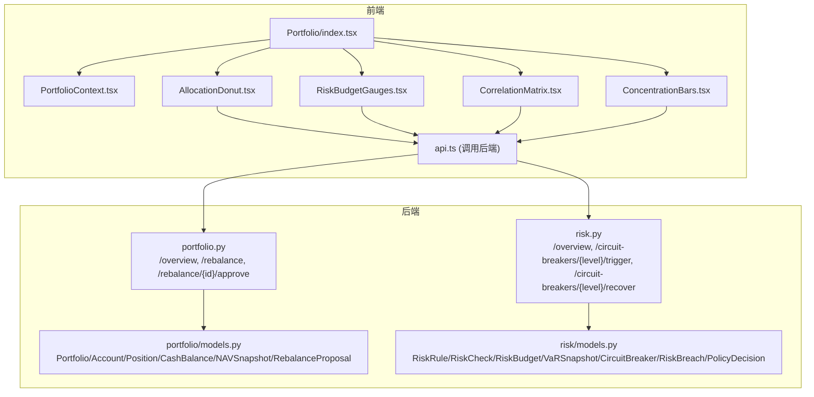
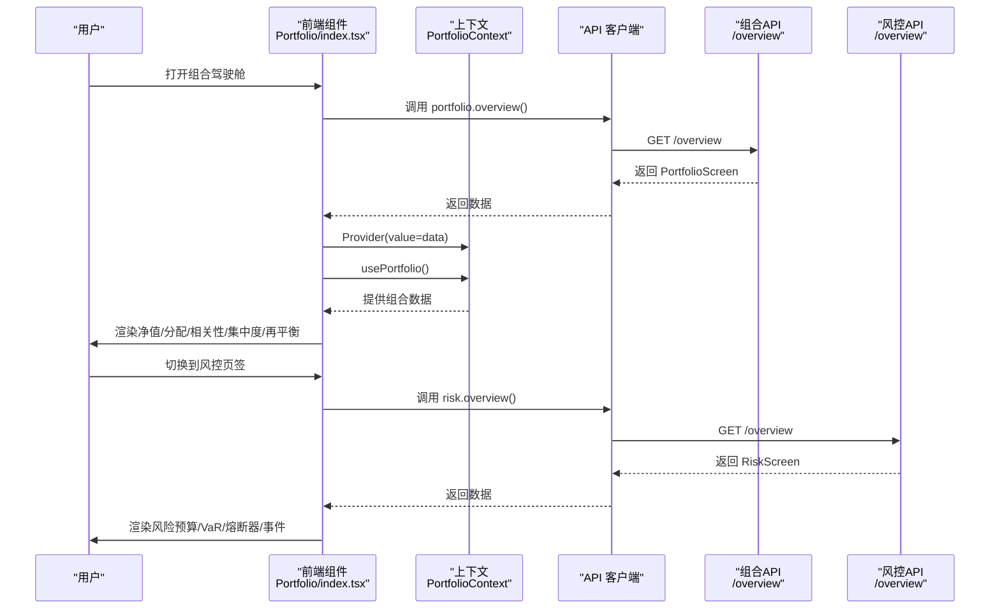
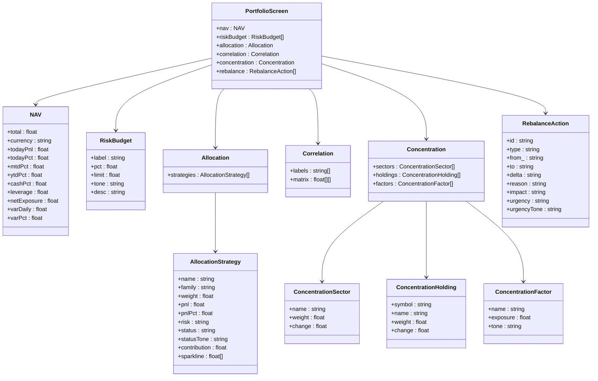
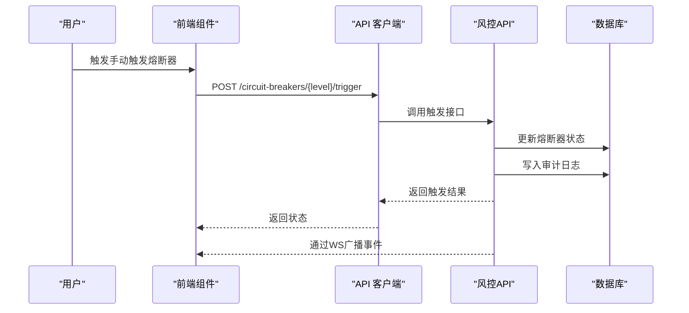
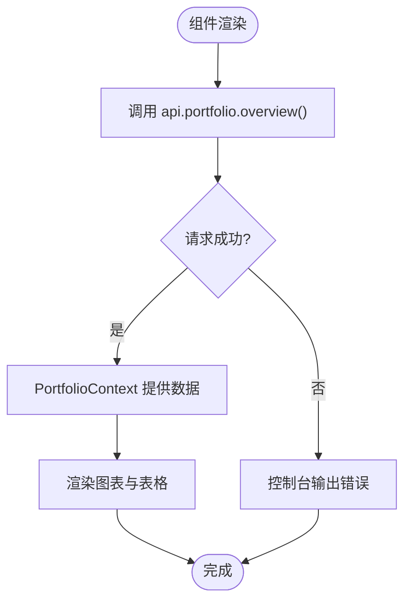
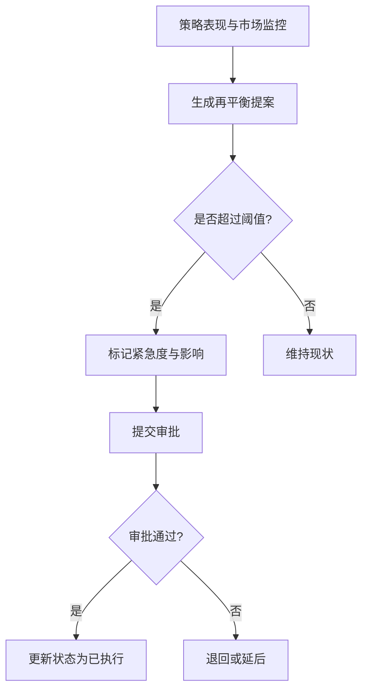
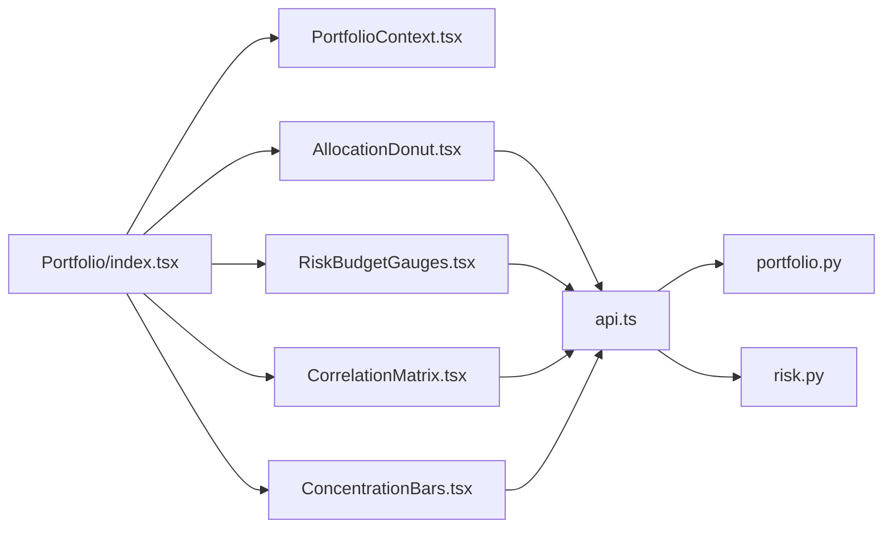

# 组合驾驶舱

<cite>
**本文档引用的文件**
- [backend/app/api/v1/portfolio.py](file://backend/app/api/v1/portfolio.py)
- [backend/app/domains/portfolio/models.py](file://backend/app/domains/portfolio/models.py)
- [backend/app/domains/portfolio/schemas.py](file://backend/app/domains/portfolio/schemas.py)
- [backend/app/api/v1/risk.py](file://backend/app/api/v1/risk.py)
- [backend/app/domains/risk/models.py](file://backend/app/domains/risk/models.py)
- [frontend/src/screens/Portfolio/index.tsx](file://frontend/src/screens/Portfolio/index.tsx)
- [frontend/src/contexts/PortfolioContext.tsx](file://frontend/src/contexts/PortfolioContext.tsx)
- [frontend/src/screens/Portfolio/AllocationDonut.tsx](file://frontend/src/screens/Portfolio/AllocationDonut.tsx)
- [frontend/src/screens/Portfolio/RiskBudgetGauges.tsx](file://frontend/src/screens/Portfolio/RiskBudgetGauges.tsx)
- [frontend/src/screens/Portfolio/CorrelationMatrix.tsx](file://frontend/src/screens/Portfolio/CorrelationMatrix.tsx)
- [frontend/src/screens/Portfolio/ConcentrationBars.tsx](file://frontend/src/screens/Portfolio/ConcentrationBars.tsx)
- [frontend/src/data/mock_ashare.ts](file://frontend/src/data/mock_ashare.ts)
- [frontend/src/data/types.ts](file://frontend/src/data/types.ts)
</cite>

## 目录
1. [简介](#简介)
2. [项目结构](#项目结构)
3. [核心组件](#核心组件)
4. [架构总览](#架构总览)
5. [详细组件分析](#详细组件分析)
6. [依赖分析](#依赖分析)
7. [性能考虑](#性能考虑)
8. [故障排查指南](#故障排查指南)
9. [结论](#结论)

## 简介
组合驾驶舱提供量化投资组合的全景视图与实时监控能力，覆盖投资组合管理、资产配置优化、风险预算分配与绩效分析。系统从前端仪表盘到后端服务与数据库形成闭环：前端通过 API 获取组合概览（净值、策略分配、相关性、集中度、再平衡建议），并以可视化图表呈现；后端提供组合与风控相关接口，支撑策略层面的资产权重调整与实时风控。

## 项目结构
- 后端采用 FastAPI 提供 REST 接口，组合与风控数据由 SQLAlchemy 模型映射到数据库表，接口返回 Pydantic Schema。
- 前端使用 React + ECharts 构建组合驾驶舱页面，通过上下文共享数据并在多个可视化组件中复用。

**图表来源**
- [frontend/src/screens/Portfolio/index.tsx:17-42](file://frontend/src/screens/Portfolio/index.tsx#L17-L42)
- [frontend/src/contexts/PortfolioContext.tsx:1-13](file://frontend/src/contexts/PortfolioContext.tsx#L1-L13)
- [frontend/src/screens/Portfolio/AllocationDonut.tsx:1-158](file://frontend/src/screens/Portfolio/AllocationDonut.tsx#L1-L158)
- [frontend/src/screens/Portfolio/RiskBudgetGauges.tsx:1-90](file://frontend/src/screens/Portfolio/RiskBudgetGauges.tsx#L1-L90)
- [frontend/src/screens/Portfolio/CorrelationMatrix.tsx:1-153](file://frontend/src/screens/Portfolio/CorrelationMatrix.tsx#L1-L153)
- [frontend/src/screens/Portfolio/ConcentrationBars.tsx:1-122](file://frontend/src/screens/Portfolio/ConcentrationBars.tsx#L1-L122)
- [backend/app/api/v1/portfolio.py:140-152](file://backend/app/api/v1/portfolio.py#L140-L152)
- [backend/app/api/v1/risk.py:188-207](file://backend/app/api/v1/risk.py#L188-L207)
- [backend/app/domains/portfolio/models.py:9-83](file://backend/app/domains/portfolio/models.py#L9-L83)
- [backend/app/domains/risk/models.py:9-101](file://backend/app/domains/risk/models.py#L9-L101)

**章节来源**
- [backend/app/api/v1/portfolio.py:1-186](file://backend/app/api/v1/portfolio.py#L1-L186)
- [backend/app/domains/portfolio/models.py:1-83](file://backend/app/domains/portfolio/models.py#L1-L83)
- [backend/app/domains/portfolio/schemas.py:1-94](file://backend/app/domains/portfolio/schemas.py#L1-L94)
- [backend/app/api/v1/risk.py:1-273](file://backend/app/api/v1/risk.py#L1-L273)
- [backend/app/domains/risk/models.py:1-101](file://backend/app/domains/risk/models.py#L1-L101)
- [frontend/src/screens/Portfolio/index.tsx:1-43](file://frontend/src/screens/Portfolio/index.tsx#L1-L43)
- [frontend/src/contexts/PortfolioContext.tsx:1-13](file://frontend/src/contexts/PortfolioContext.tsx#L1-L13)
- [frontend/src/screens/Portfolio/AllocationDonut.tsx:1-158](file://frontend/src/screens/Portfolio/AllocationDonut.tsx#L1-L158)
- [frontend/src/screens/Portfolio/RiskBudgetGauges.tsx:1-90](file://frontend/src/screens/Portfolio/RiskBudgetGauges.tsx#L1-L90)
- [frontend/src/screens/Portfolio/CorrelationMatrix.tsx:1-153](file://frontend/src/screens/Portfolio/CorrelationMatrix.tsx#L1-L153)
- [frontend/src/screens/Portfolio/ConcentrationBars.tsx:1-122](file://frontend/src/screens/Portfolio/ConcentrationBars.tsx#L1-L122)
- [frontend/src/data/mock_ashare.ts:587-667](file://frontend/src/data/mock_ashare.ts#L587-L667)
- [frontend/src/data/types.ts:186-241](file://frontend/src/data/types.ts#L186-L241)

## 核心组件
- 组合概览 API：提供净值、风险预算、策略分配、相关性矩阵、集中度与再平衡建议。
- 风控概览 API：提供健康评分、风险预算、VaR 面板、熔断器状态、策略决策流与风险事件。
- 前端可视化组件：策略分配环形图、风险预算仪表、相关性热力图、集中度条形图。
- 数据模型与 Schema：定义组合与风控实体及对外响应结构。

**章节来源**
- [backend/app/api/v1/portfolio.py:140-152](file://backend/app/api/v1/portfolio.py#L140-L152)
- [backend/app/api/v1/risk.py:188-207](file://backend/app/api/v1/risk.py#L188-L207)
- [frontend/src/screens/Portfolio/AllocationDonut.tsx:1-158](file://frontend/src/screens/Portfolio/AllocationDonut.tsx#L1-L158)
- [frontend/src/screens/Portfolio/RiskBudgetGauges.tsx:1-90](file://frontend/src/screens/Portfolio/RiskBudgetGauges.tsx#L1-L90)
- [frontend/src/screens/Portfolio/CorrelationMatrix.tsx:1-153](file://frontend/src/screens/Portfolio/CorrelationMatrix.tsx#L1-L153)
- [frontend/src/screens/Portfolio/ConcentrationBars.tsx:1-122](file://frontend/src/screens/Portfolio/ConcentrationBars.tsx#L1-L122)
- [backend/app/domains/portfolio/schemas.py:6-94](file://backend/app/domains/portfolio/schemas.py#L6-L94)
- [backend/app/domains/risk/models.py:9-101](file://backend/app/domains/risk/models.py#L9-L101)

## 架构总览
组合驾驶舱采用前后端分离架构：前端负责数据展示与用户交互，后端提供数据聚合与业务接口。组合与风控数据分别存储在独立的领域模型中，通过 API 屏蔽底层复杂度。

**图表来源**
- [frontend/src/screens/Portfolio/index.tsx:17-42](file://frontend/src/screens/Portfolio/index.tsx#L17-L42)
- [frontend/src/contexts/PortfolioContext.tsx:1-13](file://frontend/src/contexts/PortfolioContext.tsx#L1-L13)
- [backend/app/api/v1/portfolio.py:140-152](file://backend/app/api/v1/portfolio.py#L140-L152)
- [backend/app/api/v1/risk.py:188-207](file://backend/app/api/v1/risk.py#L188-L207)

## 详细组件分析

### 组合概览 API 与数据模型
- 接口职责
  - 获取组合概览：返回净值、风险预算、策略分配、相关性矩阵、集中度与再平衡建议。
  - 列出再平衡提案：查询待审批的再平衡提案。
  - 审批再平衡提案：更新状态并记录审计日志。
- 关键数据结构
  - PortfolioScreen：聚合 NAV、riskBudget、allocation、correlation、concentration、rebalance。
  - AllocationStrategy：策略名称、家族、权重、收益、风险等级、状态与贡献度等。
  - RebalanceAction：再平衡类型、方向、幅度、原因、影响与紧急度。
- 数据来源
  - NAVSnapshot：净值快照用于计算当日收益与杠杆等指标。
  - RebalanceProposal：再平衡提案表，支持 approve/reject 状态流转。

**图表来源**
- [backend/app/domains/portfolio/schemas.py:6-94](file://backend/app/domains/portfolio/schemas.py#L6-L94)
- [backend/app/api/v1/portfolio.py:140-152](file://backend/app/api/v1/portfolio.py#L140-L152)

**章节来源**
- [backend/app/api/v1/portfolio.py:140-186](file://backend/app/api/v1/portfolio.py#L140-L186)
- [backend/app/domains/portfolio/models.py:56-83](file://backend/app/domains/portfolio/models.py#L56-L83)
- [backend/app/domains/portfolio/schemas.py:6-94](file://backend/app/domains/portfolio/schemas.py#L6-L94)

### 风控概览 API 与熔断器
- 接口职责
  - 获取风控概览：健康评分、风险预算、VaR 面板、熔断器列表、策略决策流与风险事件。
  - 手动触发/恢复熔断器：记录审计日志并通过 WebSocket 广播事件。
- 关键数据结构
  - RiskScreen：聚合 header、kpis、budgets、var、circuits、policyStream、breaches。
  - VaRPanel：包含日/周 VaR、置信度与历史序列。
  - CircuitBreaker：熔断器层级、状态、触发次数与最近触发时间。
- 数据来源
  - RiskBudget：组合风险预算使用情况。
  - VaRSnapshot：VaR 快照表。
  - CircuitBreakerModel：熔断器配置与状态。
  - PolicyDecision：策略引擎决策流。
  - RiskBreach：风险事件。

**图表来源**
- [backend/app/api/v1/risk.py:210-239](file://backend/app/api/v1/risk.py#L210-L239)

**章节来源**
- [backend/app/api/v1/risk.py:188-273](file://backend/app/api/v1/risk.py#L188-L273)
- [backend/app/domains/risk/models.py:34-101](file://backend/app/domains/risk/models.py#L34-L101)

### 前端可视化组件与数据流
- 组合概览页入口
  - 初始化时调用 portfolio.overview()，将返回数据注入 PortfolioContext，供各可视化组件使用。
- 策略分配环形图
  - 使用 ECharts 渲染策略权重分布，支持提示框与动画过渡。
- 风险预算仪表
  - 自定义 SVG 仪表，按阈值颜色显示使用率与上限。
- 相关性热力图
  - 使用 ECharts heatmap 展示策略间相关性矩阵。
- 集中度条形图
  - 行业、重仓股与因子暴露的对比展示，支持正负暴露可视化。

**图表来源**
- [frontend/src/screens/Portfolio/index.tsx:20-24](file://frontend/src/screens/Portfolio/index.tsx#L20-L24)
- [frontend/src/contexts/PortfolioContext.tsx:8-12](file://frontend/src/contexts/PortfolioContext.tsx#L8-L12)

**章节来源**
- [frontend/src/screens/Portfolio/index.tsx:17-42](file://frontend/src/screens/Portfolio/index.tsx#L17-L42)
- [frontend/src/contexts/PortfolioContext.tsx:1-13](file://frontend/src/contexts/PortfolioContext.tsx#L1-L13)
- [frontend/src/screens/Portfolio/AllocationDonut.tsx:1-158](file://frontend/src/screens/Portfolio/AllocationDonut.tsx#L1-L158)
- [frontend/src/screens/Portfolio/RiskBudgetGauges.tsx:1-90](file://frontend/src/screens/Portfolio/RiskBudgetGauges.tsx#L1-L90)
- [frontend/src/screens/Portfolio/CorrelationMatrix.tsx:1-153](file://frontend/src/screens/Portfolio/CorrelationMatrix.tsx#L1-L153)
- [frontend/src/screens/Portfolio/ConcentrationBars.tsx:1-122](file://frontend/src/screens/Portfolio/ConcentrationBars.tsx#L1-L122)

### 组合构建流程与再平衡机制
- 组合构建
  - 通过策略分配与相关性矩阵指导资产配置，结合集中度限制与风险预算控制整体风险。
- 再平衡建议
  - 系统根据策略表现与市场变化生成再平衡提案（减少、增加、轮换、对冲），标注紧急度与影响。
- 审批与执行
  - 人工审批后更新状态并记录审计日志，确保合规与可追溯。

**图表来源**
- [backend/app/api/v1/portfolio.py:115-137](file://backend/app/api/v1/portfolio.py#L115-L137)
- [backend/app/api/v1/portfolio.py:161-186](file://backend/app/api/v1/portfolio.py#L161-L186)

**章节来源**
- [backend/app/api/v1/portfolio.py:115-186](file://backend/app/api/v1/portfolio.py#L115-L186)
- [frontend/src/data/mock_ashare.ts:661-666](file://frontend/src/data/mock_ashare.ts#L661-L666)

### 风险度量与预算分配
- 风险度量
  - VaR 面板提供日/周 VaR 与历史序列，支持分解与可视化。
- 预算分配
  - 风险预算使用率与阈值可视化，辅助判断是否需要收缩或调整策略权重。
- 熔断器
  - 多层级熔断器支持手动触发与恢复，事件通过 WebSocket 广播。

**章节来源**
- [backend/app/api/v1/risk.py:91-116](file://backend/app/api/v1/risk.py#L91-L116)
- [backend/app/api/v1/risk.py:119-135](file://backend/app/api/v1/risk.py#L119-L135)
- [backend/app/api/v1/risk.py:210-273](file://backend/app/api/v1/risk.py#L210-L273)
- [frontend/src/screens/Portfolio/RiskBudgetGauges.tsx:1-90](file://frontend/src/screens/Portfolio/RiskBudgetGauges.tsx#L1-L90)

### 绩效分析与可视化
- 绩效指标
  - 净值、当日收益、月度/年度收益、杠杆、敞口与 VaR 百分比等。
- 可视化
  - 策略分配环形图、相关性热力图、集中度条形图与风险预算仪表，直观反映组合健康状况。

**章节来源**
- [backend/app/api/v1/portfolio.py:87-112](file://backend/app/api/v1/portfolio.py#L87-L112)
- [frontend/src/screens/Portfolio/AllocationDonut.tsx:1-158](file://frontend/src/screens/Portfolio/AllocationDonut.tsx#L1-L158)
- [frontend/src/screens/Portfolio/CorrelationMatrix.tsx:1-153](file://frontend/src/screens/Portfolio/CorrelationMatrix.tsx#L1-L153)
- [frontend/src/screens/Portfolio/ConcentrationBars.tsx:1-122](file://frontend/src/screens/Portfolio/ConcentrationBars.tsx#L1-L122)

## 依赖分析
- 组件耦合
  - 前端组件通过上下文共享数据，降低跨组件传递复杂度。
  - 组合与风控 API 独立，便于扩展与维护。
- 外部依赖
  - ECharts 用于图表渲染。
  - WebSocket 管理器用于风控事件广播。

**图表来源**
- [frontend/src/screens/Portfolio/index.tsx:1-43](file://frontend/src/screens/Portfolio/index.tsx#L1-L43)
- [frontend/src/contexts/PortfolioContext.tsx:1-13](file://frontend/src/contexts/PortfolioContext.tsx#L1-L13)
- [frontend/src/screens/Portfolio/AllocationDonut.tsx:1-158](file://frontend/src/screens/Portfolio/AllocationDonut.tsx#L1-L158)
- [frontend/src/screens/Portfolio/RiskBudgetGauges.tsx:1-90](file://frontend/src/screens/Portfolio/RiskBudgetGauges.tsx#L1-L90)
- [frontend/src/screens/Portfolio/CorrelationMatrix.tsx:1-153](file://frontend/src/screens/Portfolio/CorrelationMatrix.tsx#L1-L153)
- [frontend/src/screens/Portfolio/ConcentrationBars.tsx:1-122](file://frontend/src/screens/Portfolio/ConcentrationBars.tsx#L1-L122)
- [backend/app/api/v1/portfolio.py:1-186](file://backend/app/api/v1/portfolio.py#L1-L186)
- [backend/app/api/v1/risk.py:1-273](file://backend/app/api/v1/risk.py#L1-L273)

**章节来源**
- [frontend/src/screens/Portfolio/index.tsx:1-43](file://frontend/src/screens/Portfolio/index.tsx#L1-L43)
- [backend/app/api/v1/portfolio.py:1-186](file://backend/app/api/v1/portfolio.py#L1-L186)
- [backend/app/api/v1/risk.py:1-273](file://backend/app/api/v1/risk.py#L1-L273)

## 性能考虑
- 图表渲染
  - 使用 ECharts Canvas 渲染器，避免重复初始化，利用 ResizeObserver 自适应布局。
- API 调用
  - 合理设置缓存与节流，避免频繁刷新导致的抖动。
- 数据结构
  - 前端使用扁平化数据结构，减少渲染层的计算负担。

[本节为通用建议，无需特定文件来源]

## 故障排查指南
- 组合 API 错误
  - 检查网络请求与返回状态，确认 PortfolioContext 是否正确注入数据。
- 风控熔断器
  - 确认触发/恢复接口返回状态，查看审计日志与 WebSocket 广播事件。
- 图表不显示
  - 检查容器尺寸与 ECharts 初始化时机，确保 ResizeObserver 正常工作。

**章节来源**
- [frontend/src/screens/Portfolio/index.tsx:20-24](file://frontend/src/screens/Portfolio/index.tsx#L20-L24)
- [backend/app/api/v1/risk.py:210-273](file://backend/app/api/v1/risk.py#L210-L273)
- [frontend/src/screens/Portfolio/AllocationDonut.tsx:19-48](file://frontend/src/screens/Portfolio/AllocationDonut.tsx#L19-L48)

## 结论
组合驾驶舱通过清晰的前后端分工与标准化的数据模型，实现了从策略分配、相关性分析、集中度监控到风险预算与熔断器的全链路可视化。系统具备良好的扩展性与可维护性，适合在量化投资组合管理中作为核心监控与决策支持平台。