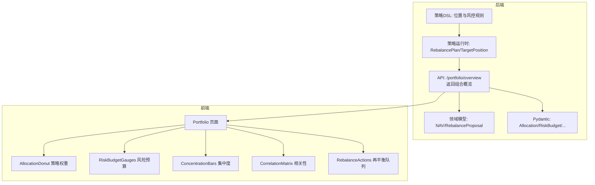
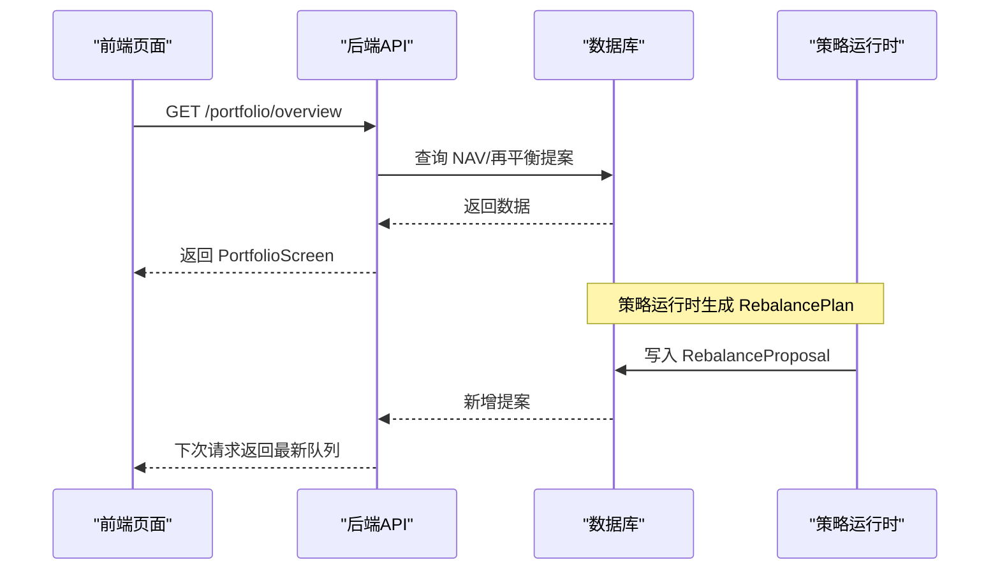
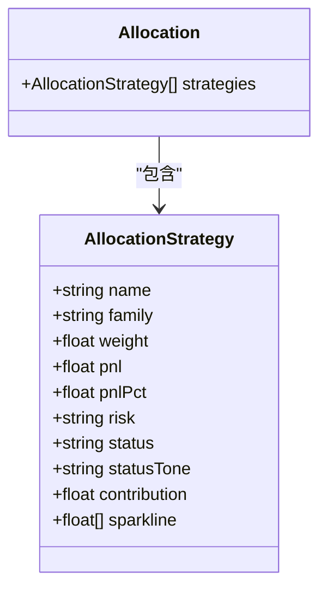
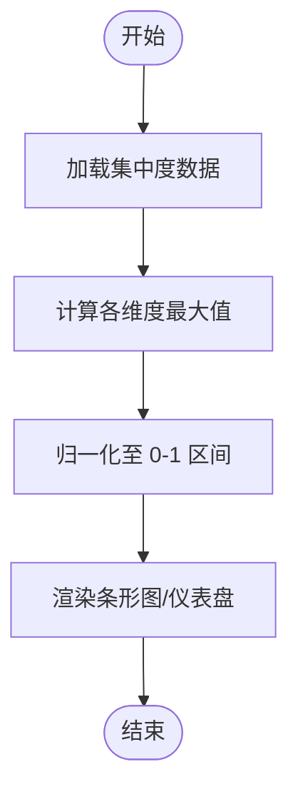
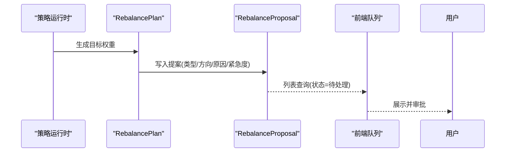
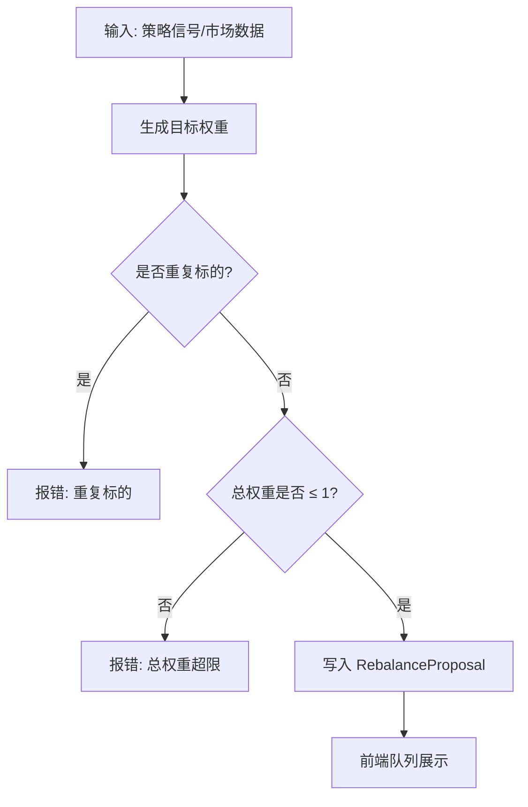
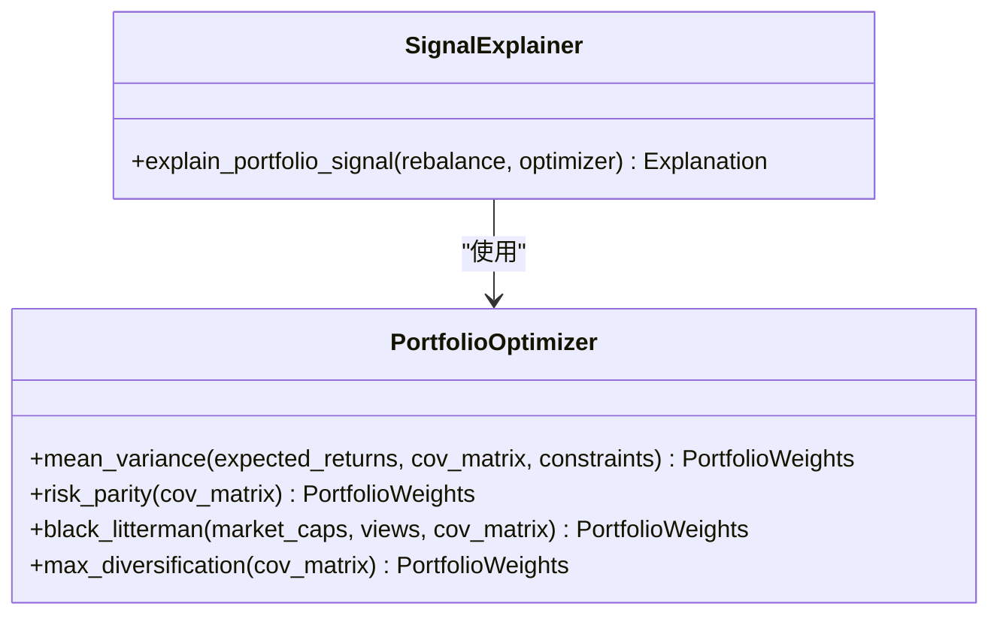
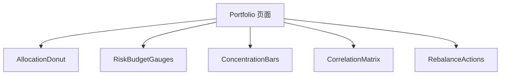
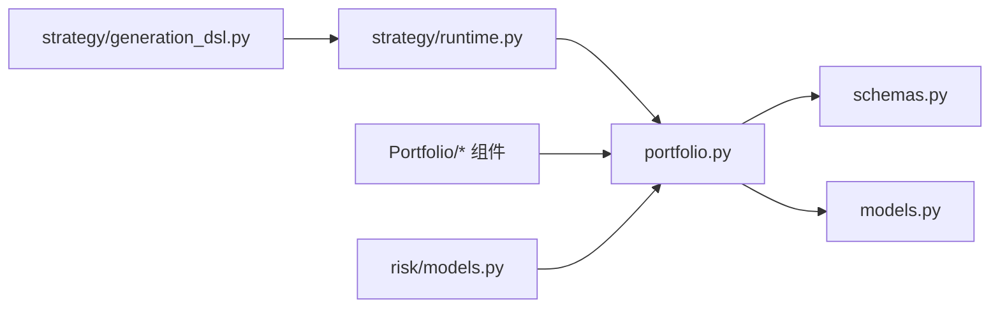

# 资产配置管理

<cite>
**本文引用的文件**   
- [backend/app/api/v1/portfolio.py](file://backend/app/api/v1/portfolio.py)
- [backend/app/domains/portfolio/schemas.py](file://backend/app/domains/portfolio/schemas.py)
- [backend/app/domains/portfolio/models.py](file://backend/app/domains/portfolio/models.py)
- [backend/app/domains/strategy/runtime.py](file://backend/app/domains/strategy/runtime.py)
- [backend/app/domains/strategy/generation_dsl.py](file://backend/app/domains/strategy/generation_dsl.py)
- [backend/app/domains/risk/models.py](file://backend/app/domains/risk/models.py)
- [frontend/src/screens/Portfolio/index.tsx](file://frontend/src/screens/Portfolio/index.tsx)
- [frontend/src/screens/Portfolio/AllocationDonut.tsx](file://frontend/src/screens/Portfolio/AllocationDonut.tsx)
- [frontend/src/screens/Portfolio/ConcentrationBars.tsx](file://frontend/src/screens/Portfolio/ConcentrationBars.tsx)
- [frontend/src/screens/Portfolio/RiskBudgetGauges.tsx](file://frontend/src/screens/Portfolio/RiskBudgetGauges.tsx)
- [frontend/src/screens/Portfolio/CorrelationMatrix.tsx](file://frontend/src/screens/Portfolio/CorrelationMatrix.tsx)
- [frontend/src/screens/Portfolio/RebalanceActions.tsx](file://frontend/src/screens/Portfolio/RebalanceActions.tsx)
- [doc/03-核心模块设计.md](file://doc/03-核心模块设计.md)
</cite>

## 目录
1. [简介](#简介)
2. [项目结构](#项目结构)
3. [核心组件](#核心组件)
4. [架构总览](#架构总览)
5. [详细组件分析](#详细组件分析)
6. [依赖分析](#依赖分析)
7. [性能考虑](#性能考虑)
8. [故障排查指南](#故障排查指南)
9. [结论](#结论)
10. [附录](#附录)

## 简介
本文件围绕“资产配置管理”主题，系统阐述策略权重分配、资产类别配置、组合多元化控制与动态再平衡机制。文档从后端数据模型与接口、前端可视化组件到策略运行时接口与生成式DSL，形成完整的技术闭环。重点覆盖以下方面：
- AllocationStrategy 模型与策略权重分配
- 集中度限制与风险预算控制
- 动态再平衡触发与执行流程
- 可视化图表组件与实时监控指标
- 风险贡献度分析与组合引擎设计思路

## 项目结构
资产配置管理涉及后端API、领域模型与前端可视化两大层面：
- 后端：提供组合概览API，返回NAV、策略分配、相关性矩阵、集中度与再平衡建议等；策略运行时定义权重与再平衡计划的数据契约；策略生成DSL约束设计阶段的参数与风控边界。
- 前端：以Portfolio页面为核心，集成多维图表组件，展示策略权重、风险预算、集中度暴露与相关性热力图，并呈现待审批的再平衡动作。

**图表来源**
- [backend/app/api/v1/portfolio.py:140-158](file://backend/app/api/v1/portfolio.py#L140-L158)
- [backend/app/domains/portfolio/schemas.py:28-93](file://backend/app/domains/portfolio/schemas.py#L28-L93)
- [backend/app/domains/portfolio/models.py:56-83](file://backend/app/domains/portfolio/models.py#L56-L83)
- [backend/app/domains/strategy/runtime.py:135-164](file://backend/app/domains/strategy/runtime.py#L135-L164)
- [backend/app/domains/strategy/generation_dsl.py:51-89](file://backend/app/domains/strategy/generation_dsl.py#L51-L89)
- [frontend/src/screens/Portfolio/index.tsx:17-42](file://frontend/src/screens/Portfolio/index.tsx#L17-L42)

**章节来源**
- [backend/app/api/v1/portfolio.py:1-158](file://backend/app/api/v1/portfolio.py#L1-L158)
- [frontend/src/screens/Portfolio/index.tsx:1-43](file://frontend/src/screens/Portfolio/index.tsx#L1-L43)

## 核心组件
- AllocationStrategy 模型：描述策略名称、家族、权重、收益、风险等级、状态与贡献曲线等，用于前端饼图与表格展示。
- RebalancePlan/TargetPosition：策略运行时输出的目标权重集合，确保总权重不超过1且符号一致，避免重复标的。
- RebalanceProposal：数据库中的再平衡提案，包含类型、方向、原因、影响与紧急度，供前端“再平衡队列”展示。
- 风险预算与集中度：后端提供静态示例数据，前端以仪表盘与条形图展示当前使用率与阈值关系。
- 可视化组件：前端通过 ECharts 与 SVG 实现策略权重、相关性热力图、集中度暴露与风险预算仪表。

**章节来源**
- [backend/app/domains/portfolio/schemas.py:28-93](file://backend/app/domains/portfolio/schemas.py#L28-L93)
- [backend/app/domains/strategy/runtime.py:135-164](file://backend/app/domains/strategy/runtime.py#L135-L164)
- [backend/app/domains/portfolio/models.py:68-83](file://backend/app/domains/portfolio/models.py#L68-L83)
- [frontend/src/screens/Portfolio/AllocationDonut.tsx:1-158](file://frontend/src/screens/Portfolio/AllocationDonut.tsx#L1-L158)
- [frontend/src/screens/Portfolio/RiskBudgetGauges.tsx:1-90](file://frontend/src/screens/Portfolio/RiskBudgetGauges.tsx#L1-L90)
- [frontend/src/screens/Portfolio/ConcentrationBars.tsx:1-122](file://frontend/src/screens/Portfolio/ConcentrationBars.tsx#L1-L122)
- [frontend/src/screens/Portfolio/CorrelationMatrix.tsx:1-153](file://frontend/src/screens/Portfolio/CorrelationMatrix.tsx#L1-L153)
- [frontend/src/screens/Portfolio/RebalanceActions.tsx:1-56](file://frontend/src/screens/Portfolio/RebalanceActions.tsx#L1-L56)

## 架构总览
后端API负责聚合组合概览数据，前端页面按模块化组件渲染。策略运行时负责将信号转换为目标权重并生成再平衡计划，最终由后端持久化为再平衡提案，供前端展示与人工审批。

**图表来源**
- [backend/app/api/v1/portfolio.py:140-158](file://backend/app/api/v1/portfolio.py#L140-L158)
- [backend/app/domains/portfolio/models.py:68-83](file://backend/app/domains/portfolio/models.py#L68-L83)
- [backend/app/domains/strategy/runtime.py:135-164](file://backend/app/domains/strategy/runtime.py#L135-L164)

## 详细组件分析

### AllocationStrategy 模型与策略权重分配
- 字段构成：名称、家族、权重、P&L、P&L百分比、风险等级、状态与颜色、贡献度、贡献曲线。
- 前端展示：饼图按权重显示，右侧表格列出策略明细；支持按权重排序与颜色区分。
- 数据来源：后端API返回的 Allocation 对象包含多个 AllocationStrategy。

**图表来源**
- [backend/app/domains/portfolio/schemas.py:28-43](file://backend/app/domains/portfolio/schemas.py#L28-L43)
- [frontend/src/screens/Portfolio/AllocationDonut.tsx:77-81](file://frontend/src/screens/Portfolio/AllocationDonut.tsx#L77-L81)

**章节来源**
- [backend/app/domains/portfolio/schemas.py:28-43](file://backend/app/domains/portfolio/schemas.py#L28-L43)
- [frontend/src/screens/Portfolio/AllocationDonut.tsx:1-158](file://frontend/src/screens/Portfolio/AllocationDonut.tsx#L1-L158)

### 集中度限制与风险预算控制
- 集中度：行业、重仓股与因子暴露，前端以条形图展示权重或暴露程度，支持相对最大值归一化。
- 风险预算：以仪表盘形式展示使用率与阈值，超限时高亮提示。
- 设计约束：策略生成DSL在设计阶段即设定位置与风控上限，如单只权重上限、行业权重上限、最大持仓数等。

**图表来源**
- [frontend/src/screens/Portfolio/ConcentrationBars.tsx:14-16](file://frontend/src/screens/Portfolio/ConcentrationBars.tsx#L14-L16)
- [frontend/src/screens/Portfolio/RiskBudgetGauges.tsx:12-16](file://frontend/src/screens/Portfolio/RiskBudgetGauges.tsx#L12-L16)

**章节来源**
- [frontend/src/screens/Portfolio/ConcentrationBars.tsx:1-122](file://frontend/src/screens/Portfolio/ConcentrationBars.tsx#L1-L122)
- [frontend/src/screens/Portfolio/RiskBudgetGauges.tsx:1-90](file://frontend/src/screens/Portfolio/RiskBudgetGauges.tsx#L1-L90)
- [backend/app/domains/strategy/generation_dsl.py:51-76](file://backend/app/domains/strategy/generation_dsl.py#L51-L76)

### 动态再平衡机制
- 触发条件：定期再平衡、阈值再平衡、事件再平衡、风险再平衡。
- 输出契约：RebalancePlan 包含目标权重集合与现金权重，要求无重复标的、总权重不超过1。
- 数据持久化：策略运行时生成的再平衡计划写入 RebalanceProposal，前端以“再平衡队列”展示并支持批量审批。

**图表来源**
- [backend/app/domains/strategy/runtime.py:135-164](file://backend/app/domains/strategy/runtime.py#L135-L164)
- [backend/app/domains/portfolio/models.py:68-83](file://backend/app/domains/portfolio/models.py#L68-L83)
- [backend/app/api/v1/portfolio.py:115-137](file://backend/app/api/v1/portfolio.py#L115-L137)
- [frontend/src/screens/Portfolio/RebalanceActions.tsx:28-56](file://frontend/src/screens/Portfolio/RebalanceActions.tsx#L28-L56)

**章节来源**
- [doc/03-核心模块设计.md:453-460](file://doc/03-核心模块设计.md#L453-L460)
- [backend/app/domains/strategy/runtime.py:135-164](file://backend/app/domains/strategy/runtime.py#L135-L164)
- [backend/app/domains/portfolio/models.py:68-83](file://backend/app/domains/portfolio/models.py#L68-L83)
- [frontend/src/screens/Portfolio/RebalanceActions.tsx:1-56](file://frontend/src/screens/Portfolio/RebalanceActions.tsx#L1-L56)

### 权重计算算法与集中度限制
- 权重计算：策略运行时根据信号生成目标权重，RebalancePlan 校验总权重与重复标的。
- 集中度限制：策略生成DSL在设计阶段强制设置单只权重上限、最大持仓数、行业权重上限等。
- 风险预算：后端提供风险预算使用率与阈值，前端以仪表盘可视化。

**图表来源**
- [backend/app/domains/strategy/runtime.py:144-156](file://backend/app/domains/strategy/runtime.py#L144-L156)
- [backend/app/domains/strategy/generation_dsl.py:56-59](file://backend/app/domains/strategy/generation_dsl.py#L56-L59)
- [backend/app/api/v1/portfolio.py:115-137](file://backend/app/api/v1/portfolio.py#L115-L137)

**章节来源**
- [backend/app/domains/strategy/runtime.py:135-164](file://backend/app/domains/strategy/runtime.py#L135-L164)
- [backend/app/domains/strategy/generation_dsl.py:51-76](file://backend/app/domains/strategy/generation_dsl.py#L51-L76)
- [backend/app/api/v1/portfolio.py:115-137](file://backend/app/api/v1/portfolio.py#L115-L137)

### 风险贡献度分析与组合引擎
- 风险贡献度：解释器可分解组合信号的风险贡献、边际VaR与相关性影响。
- 组合优化器：支持均值方差、风险平价、Black-Litterman与最大化分散化等策略。
- 实时监控：VaR面板与风险预算仪表结合，辅助判断是否触发风险再平衡。

**图表来源**
- [doc/03-核心模块设计.md:426-451](file://doc/03-核心模块设计.md#L426-L451)
- [doc/03-核心模块设计.md:489-497](file://doc/03-核心模块设计.md#L489-L497)

**章节来源**
- [doc/03-核心模块设计.md:426-460](file://doc/03-核心模块设计.md#L426-L460)

### 可视化图表组件与实时监控
- 策略权重（AllocationDonut）：饼图展示策略权重，右侧表格展示P&L与贡献度。
- 风险预算（RiskBudgetGauges）：SVG仪表盘展示使用率与阈值，超限高亮。
- 集中度（ConcentrationBars）：分行业、重仓、因子三列，条形图展示暴露程度。
- 相关性（CorrelationMatrix）：ECharts热力图展示策略两两相关性。
- 再平衡队列（RebalanceActions）：卡片式列表展示类型、紧急度与影响。

**图表来源**
- [frontend/src/screens/Portfolio/index.tsx:17-42](file://frontend/src/screens/Portfolio/index.tsx#L17-L42)
- [frontend/src/screens/Portfolio/AllocationDonut.tsx:1-158](file://frontend/src/screens/Portfolio/AllocationDonut.tsx#L1-L158)
- [frontend/src/screens/Portfolio/RiskBudgetGauges.tsx:1-90](file://frontend/src/screens/Portfolio/RiskBudgetGauges.tsx#L1-L90)
- [frontend/src/screens/Portfolio/ConcentrationBars.tsx:1-122](file://frontend/src/screens/Portfolio/ConcentrationBars.tsx#L1-L122)
- [frontend/src/screens/Portfolio/CorrelationMatrix.tsx:1-153](file://frontend/src/screens/Portfolio/CorrelationMatrix.tsx#L1-L153)
- [frontend/src/screens/Portfolio/RebalanceActions.tsx:1-56](file://frontend/src/screens/Portfolio/RebalanceActions.tsx#L1-L56)

**章节来源**
- [frontend/src/screens/Portfolio/index.tsx:1-43](file://frontend/src/screens/Portfolio/index.tsx#L1-L43)
- [frontend/src/screens/Portfolio/AllocationDonut.tsx:1-158](file://frontend/src/screens/Portfolio/AllocationDonut.tsx#L1-L158)
- [frontend/src/screens/Portfolio/RiskBudgetGauges.tsx:1-90](file://frontend/src/screens/Portfolio/RiskBudgetGauges.tsx#L1-L90)
- [frontend/src/screens/Portfolio/ConcentrationBars.tsx:1-122](file://frontend/src/screens/Portfolio/ConcentrationBars.tsx#L1-L122)
- [frontend/src/screens/Portfolio/CorrelationMatrix.tsx:1-153](file://frontend/src/screens/Portfolio/CorrelationMatrix.tsx#L1-L153)
- [frontend/src/screens/Portfolio/RebalanceActions.tsx:1-56](file://frontend/src/screens/Portfolio/RebalanceActions.tsx#L1-L56)

## 依赖分析
- 后端API依赖领域模型与Pydantic Schema，统一输出PortfolioScreen。
- 策略运行时依赖运行时上下文与信号，输出RebalancePlan。
- 前端组件依赖上下文与后端API，ECharts与SVG分别用于图表渲染。
- 风控模型支撑风险预算与熔断器等能力，与组合概览并行展示。

**图表来源**
- [backend/app/api/v1/portfolio.py:1-27](file://backend/app/api/v1/portfolio.py#L1-L27)
- [backend/app/domains/portfolio/schemas.py:1-94](file://backend/app/domains/portfolio/schemas.py#L1-L94)
- [backend/app/domains/portfolio/models.py:1-83](file://backend/app/domains/portfolio/models.py#L1-L83)
- [backend/app/domains/strategy/runtime.py:1-240](file://backend/app/domains/strategy/runtime.py#L1-L240)
- [backend/app/domains/strategy/generation_dsl.py:1-144](file://backend/app/domains/strategy/generation_dsl.py#L1-L144)
- [backend/app/domains/risk/models.py:1-101](file://backend/app/domains/risk/models.py#L1-L101)

**章节来源**
- [backend/app/api/v1/portfolio.py:1-27](file://backend/app/api/v1/portfolio.py#L1-L27)
- [backend/app/domains/strategy/runtime.py:1-240](file://backend/app/domains/strategy/runtime.py#L1-L240)
- [backend/app/domains/strategy/generation_dsl.py:1-144](file://backend/app/domains/strategy/generation_dsl.py#L1-L144)
- [backend/app/domains/risk/models.py:1-101](file://backend/app/domains/risk/models.py#L1-L101)

## 性能考虑
- 图表渲染：ECharts初始化与ResizeObserver监听，避免重复初始化与内存泄漏。
- 数据聚合：后端API一次性返回组合概览，减少多次请求开销。
- 校验前置：策略运行时在生成RebalancePlan阶段严格校验权重与重复标的，降低后续执行成本。
- 风险预算：仪表盘仅展示使用率与阈值，避免复杂计算带来的UI卡顿。

[本节为通用指导，无需特定文件引用]

## 故障排查指南
- 权重校验错误：当目标权重总和超过1或存在重复标的时，会抛出异常。请检查策略信号与目标权重生成逻辑。
- 再平衡队列为空：确认策略运行时已生成并写入RebalanceProposal，且状态为待处理。
- 风险预算告警：使用率超过阈值时仪表盘高亮，需调整策略或增加现金缓冲。
- 集中度过高：行业或个股权重偏高时，前端条形图会突出显示，应考虑分散化或调整集中度上限。

**章节来源**
- [backend/app/domains/strategy/runtime.py:144-156](file://backend/app/domains/strategy/runtime.py#L144-L156)
- [backend/app/api/v1/portfolio.py:115-137](file://backend/app/api/v1/portfolio.py#L115-L137)
- [frontend/src/screens/Portfolio/RiskBudgetGauges.tsx:74-75](file://frontend/src/screens/Portfolio/RiskBudgetGauges.tsx#L74-L75)
- [frontend/src/screens/Portfolio/ConcentrationBars.tsx:1-122](file://frontend/src/screens/Portfolio/ConcentrationBars.tsx#L1-L122)

## 结论
资产配置管理通过“策略生成DSL约束 + 策略运行时权重生成 + 后端API聚合 + 前端可视化”的链路，实现了从设计到执行再到监控的闭环。AllocationStrategy模型与RebalancePlan构成了权重与再平衡的核心数据契约，配合集中度与风险预算的可视化监控，为动态再平衡提供了坚实基础。

[本节为总结性内容，无需特定文件引用]

## 附录
- 关键流程参考：组合引擎与解释性引擎的设计思路，可作为扩展实现的参考。
- 风控模型：风险预算、熔断器与违约事件，为组合概览提供实时风险信号。

**章节来源**
- [doc/03-核心模块设计.md:426-460](file://doc/03-核心模块设计.md#L426-L460)
- [backend/app/domains/risk/models.py:34-86](file://backend/app/domains/risk/models.py#L34-L86)