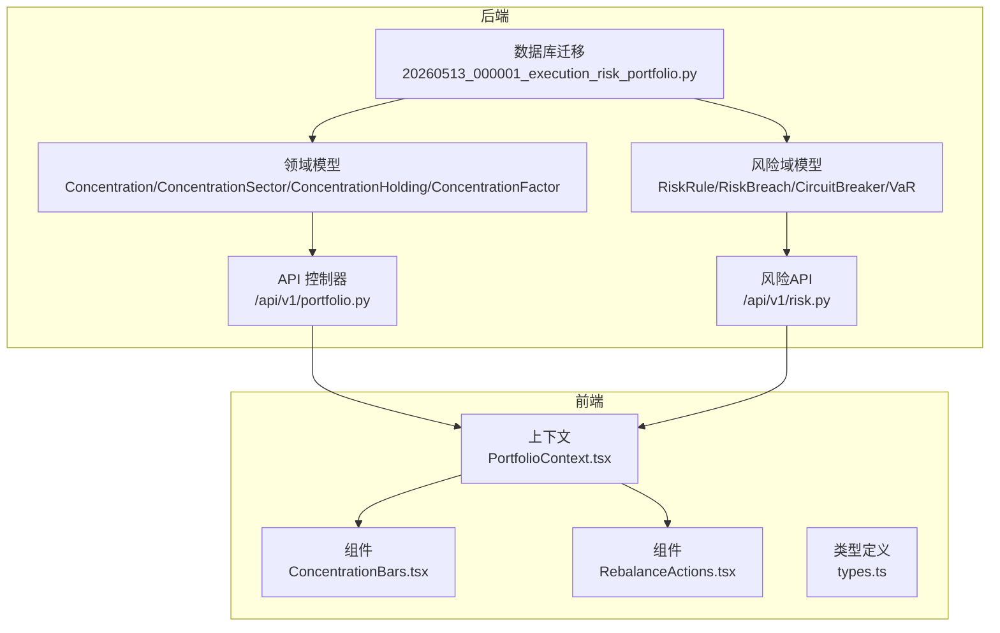
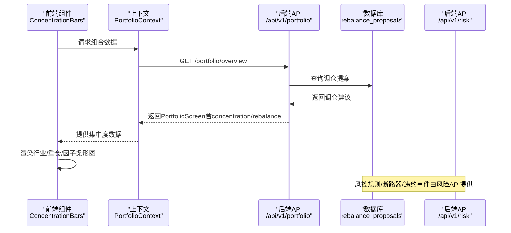
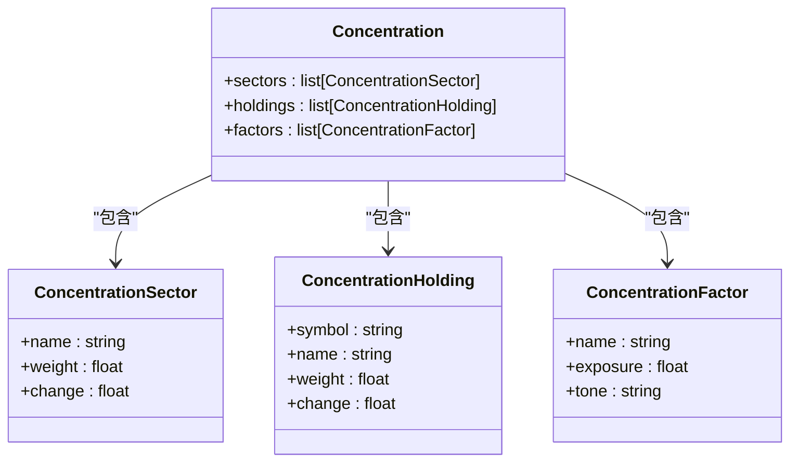
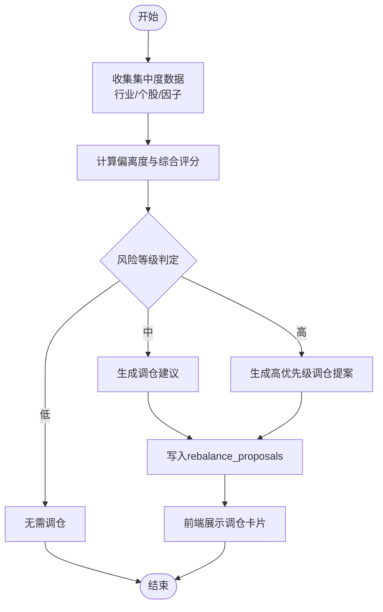
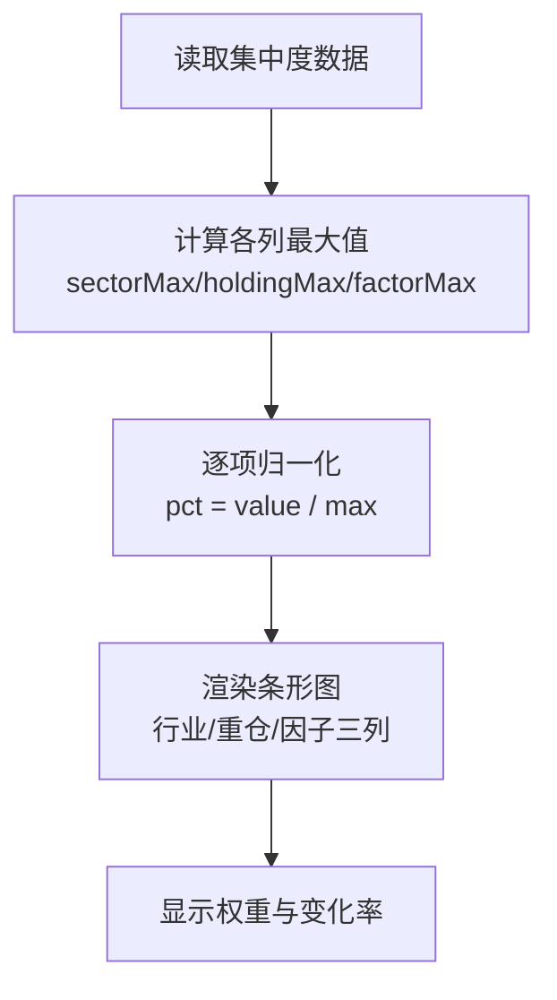
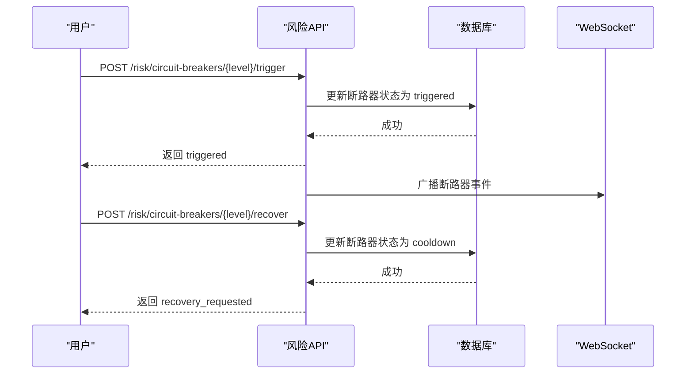
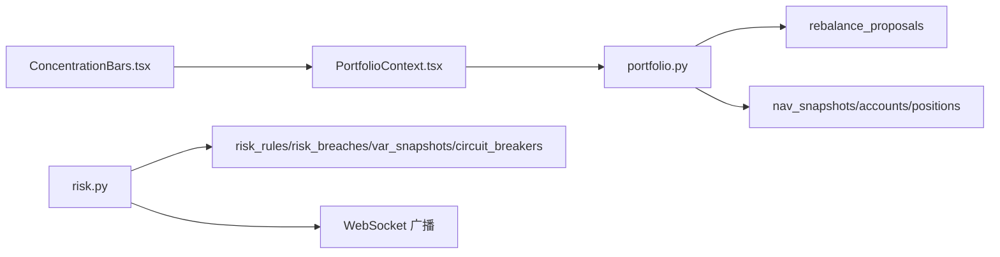

# 集中度风险

<cite>
**本文引用的文件**
- [backend/app/domains/portfolio/schemas.py](file://backend/app/domains/portfolio/schemas.py)
- [backend/app/api/v1/portfolio.py](file://backend/app/api/v1/portfolio.py)
- [frontend/src/screens/Portfolio/ConcentrationBars.tsx](file://frontend/src/screens/Portfolio/ConcentrationBars.tsx)
- [frontend/src/contexts/PortfolioContext.tsx](file://frontend/src/contexts/PortfolioContext.tsx)
- [backend/app/domains/risk/models.py](file://backend/app/domains/risk/models.py)
- [backend/app/api/v1/risk.py](file://backend/app/api/v1/risk.py)
- [backend/app/db/migrations/versions/20260513_000001_execution_risk_portfolio.py](file://backend/app/db/migrations/versions/20260513_000001_execution_risk_portfolio.py)
- [frontend/src/screens/Portfolio/RebalanceActions.tsx](file://frontend/src/screens/Portfolio/RebalanceActions.tsx)
- [frontend/src/data/types.ts](file://frontend/src/data/types.ts)
- [backend/app/services/paper_trading.py](file://backend/app/services/paper_trading.py)
</cite>

## 目录
1. [简介](#简介)
2. [项目结构](#项目结构)
3. [核心组件](#核心组件)
4. [架构总览](#架构总览)
5. [详细组件分析](#详细组件分析)
6. [依赖分析](#依赖分析)
7. [性能考虑](#性能考虑)
8. [故障排查指南](#故障排查指南)
9. [结论](#结论)
10. [附录](#附录)

## 简介
本文件系统化梳理量化投资组合中的集中度风险控制体系，覆盖行业集中度监控、个股集中度管理、因子暴露度分析与风险预警机制。文档基于现有代码实现，明确集中度模型定义、阈值与评级策略、自动调仓建议流程，并提供前端条形图展示方案，帮助开发者快速理解并扩展集中度风险管理体系。

## 项目结构
集中度相关能力横跨后端领域模型与前端可视化组件：
- 后端领域模型与API：定义集中度数据结构、风险规则与告警、调仓建议等
- 前端上下文与组件：消费后端数据并渲染集中度条形图与调仓队列卡片
- 数据库迁移：落地风险规则、VaR、断路器、调仓提案等表结构

图表来源
- [backend/app/domains/portfolio/schemas.py:69-94](file://backend/app/domains/portfolio/schemas.py#L69-L94)
- [backend/app/api/v1/portfolio.py:63-158](file://backend/app/api/v1/portfolio.py#L63-L158)
- [backend/app/domains/risk/models.py:9-101](file://backend/app/domains/risk/models.py#L9-L101)
- [backend/app/api/v1/risk.py:188-273](file://backend/app/api/v1/risk.py#L188-L273)
- [frontend/src/contexts/PortfolioContext.tsx:1-13](file://frontend/src/contexts/PortfolioContext.tsx#L1-L13)
- [frontend/src/screens/Portfolio/ConcentrationBars.tsx:1-122](file://frontend/src/screens/Portfolio/ConcentrationBars.tsx#L1-L122)
- [frontend/src/screens/Portfolio/RebalanceActions.tsx:28-56](file://frontend/src/screens/Portfolio/RebalanceActions.tsx#L28-L56)
- [frontend/src/data/types.ts:228-280](file://frontend/src/data/types.ts#L228-L280)
- [backend/app/db/migrations/versions/20260513_000001_execution_risk_portfolio.py:32-203](file://backend/app/db/migrations/versions/20260513_000001_execution_risk_portfolio.py#L32-L203)

章节来源
- [backend/app/domains/portfolio/schemas.py:69-94](file://backend/app/domains/portfolio/schemas.py#L69-L94)
- [backend/app/api/v1/portfolio.py:63-158](file://backend/app/api/v1/portfolio.py#L63-L158)
- [frontend/src/contexts/PortfolioContext.tsx:1-13](file://frontend/src/contexts/PortfolioContext.tsx#L1-L13)
- [frontend/src/screens/Portfolio/ConcentrationBars.tsx:1-122](file://frontend/src/screens/Portfolio/ConcentrationBars.tsx#L1-L122)
- [frontend/src/screens/Portfolio/RebalanceActions.tsx:28-56](file://frontend/src/screens/Portfolio/RebalanceActions.tsx#L28-L56)
- [frontend/src/data/types.ts:228-280](file://frontend/src/data/types.ts#L228-L280)
- [backend/app/domains/risk/models.py:9-101](file://backend/app/domains/risk/models.py#L9-L101)
- [backend/app/api/v1/risk.py:188-273](file://backend/app/api/v1/risk.py#L188-L273)
- [backend/app/db/migrations/versions/20260513_000001_execution_risk_portfolio.py:32-203](file://backend/app/db/migrations/versions/20260513_000001_execution_risk_portfolio.py#L32-L203)

## 核心组件
- 集中度模型（后端）
  - 行业集中度：ConcentrationSector（名称、权重、变化）
  - 个股集中度：ConcentrationHolding（代码、名称、权重、变化）
  - 因子暴露：ConcentrationFactor（名称、暴露度、色调）
  - 组合集中度容器：Concentration（包含上述三类列表）
- 集中度API（后端）
  - 提供组合概览接口，返回集中度与调仓建议
- 前端组件
  - 集中度条形图：ConcentrationBars，按行业、重仓、因子三列展示
  - 调仓建议卡片：RebalanceActions，展示待审批的调仓建议
  - 上下文：PortfolioContext，提供集中度数据给组件使用
- 风险规则与预警（后端）
  - 风控规则、断路器、风险违约事件等模型与API
- 数据库结构（迁移）
  - 风控规则、VaR、断路器、调仓提案等表

章节来源
- [backend/app/domains/portfolio/schemas.py:50-94](file://backend/app/domains/portfolio/schemas.py#L50-L94)
- [backend/app/api/v1/portfolio.py:63-158](file://backend/app/api/v1/portfolio.py#L63-L158)
- [frontend/src/screens/Portfolio/ConcentrationBars.tsx:11-122](file://frontend/src/screens/Portfolio/ConcentrationBars.tsx#L11-L122)
- [frontend/src/screens/Portfolio/RebalanceActions.tsx:28-56](file://frontend/src/screens/Portfolio/RebalanceActions.tsx#L28-L56)
- [frontend/src/contexts/PortfolioContext.tsx:1-13](file://frontend/src/contexts/PortfolioContext.tsx#L1-L13)
- [backend/app/domains/risk/models.py:9-101](file://backend/app/domains/risk/models.py#L9-L101)
- [backend/app/db/migrations/versions/20260513_000001_execution_risk_portfolio.py:32-203](file://backend/app/db/migrations/versions/20260513_000001_execution_risk_portfolio.py#L32-L203)

## 架构总览
集中度风险控制的端到端流程：
- 后端聚合组合数据（含集中度、调仓建议），并通过API输出
- 前端通过上下文获取数据并渲染集中度条形图与调仓卡片
- 风控域提供规则、断路器与违约事件，支撑风险预警与自动阻断

图表来源
- [frontend/src/screens/Portfolio/ConcentrationBars.tsx:11-122](file://frontend/src/screens/Portfolio/ConcentrationBars.tsx#L11-L122)
- [frontend/src/contexts/PortfolioContext.tsx:1-13](file://frontend/src/contexts/PortfolioContext.tsx#L1-L13)
- [backend/app/api/v1/portfolio.py:140-158](file://backend/app/api/v1/portfolio.py#L140-L158)
- [backend/app/db/migrations/versions/20260513_000001_execution_risk_portfolio.py:276-291](file://backend/app/db/migrations/versions/20260513_000001_execution_risk_portfolio.py#L276-L291)
- [backend/app/api/v1/risk.py:188-273](file://backend/app/api/v1/risk.py#L188-L273)

## 详细组件分析

### 模型与数据结构
- 集中度模型
  - 行业集中度：ConcentrationSector（name, weight, change）
  - 个股集中度：ConcentrationHolding（symbol, name, weight, change）
  - 因子暴露：ConcentrationFactor（name, exposure, tone）
  - 组合集中度：Concentration（sectors[], holdings[], factors[]）

图表来源
- [backend/app/domains/portfolio/schemas.py:50-94](file://backend/app/domains/portfolio/schemas.py#L50-L94)

章节来源
- [backend/app/domains/portfolio/schemas.py:50-94](file://backend/app/domains/portfolio/schemas.py#L50-L94)

### 集中度计算与阈值设定
- 计算方式
  - 行业集中度：按行业权重累加，取前N名展示
  - 个股集中度：按持仓权重排序，取前N名展示
  - 因子暴露：按因子暴露度绝对值或符号展示，支持正负双向条形
- 阈值与评级
  - 当前仓库未内置集中度阈值与评级算法，建议在后端新增集中度评分函数，结合权重与暴露度给出风险等级
  - 可参考VaR与断路器的阈值设计模式，将阈值参数化并存储于风险规则表

章节来源
- [backend/app/api/v1/portfolio.py:63-84](file://backend/app/api/v1/portfolio.py#L63-L84)
- [backend/app/domains/risk/models.py:9-20](file://backend/app/domains/risk/models.py#L9-L20)

### 风险评级算法与自动调仓建议
- 风险评级（建议实现）
  - 输入：各行业权重、个股权重、因子暴露度
  - 输出：集中度风险等级（低/中/高）与改进建议
  - 实现思路：对每个维度计算偏离度，汇总得到综合评分
- 自动调仓建议（现有实现）
  - 调仓提案来源于rebalance_proposals表，API返回Pending状态的提案
  - 前端以卡片形式展示类型、紧急度、Delta与原因

图表来源
- [backend/app/db/migrations/versions/20260513_000001_execution_risk_portfolio.py:68-83](file://backend/app/db/migrations/versions/20260513_000001_execution_risk_portfolio.py#L68-L83)
- [backend/app/api/v1/portfolio.py:115-137](file://backend/app/api/v1/portfolio.py#L115-L137)
- [frontend/src/screens/Portfolio/RebalanceActions.tsx:28-56](file://frontend/src/screens/Portfolio/RebalanceActions.tsx#L28-L56)

章节来源
- [backend/app/db/migrations/versions/20260513_000001_execution_risk_portfolio.py:68-83](file://backend/app/db/migrations/versions/20260513_000001_execution_risk_portfolio.py#L68-L83)
- [backend/app/api/v1/portfolio.py:115-137](file://backend/app/api/v1/portfolio.py#L115-L137)
- [frontend/src/screens/Portfolio/RebalanceActions.tsx:28-56](file://frontend/src/screens/Portfolio/RebalanceActions.tsx#L28-L56)

### 前端条形图展示（集中度暴露）
- 行业暴露：按sectorMax归一化绘制横向条形
- 重仓持股：按holdingMax归一化绘制横向条形
- 因子暴露：按factorMax归一化绘制双向条形（正负轴对称）

图表来源
- [frontend/src/screens/Portfolio/ConcentrationBars.tsx:14-116](file://frontend/src/screens/Portfolio/ConcentrationBars.tsx#L14-L116)

章节来源
- [frontend/src/screens/Portfolio/ConcentrationBars.tsx:11-122](file://frontend/src/screens/Portfolio/ConcentrationBars.tsx#L11-L122)
- [frontend/src/contexts/PortfolioContext.tsx:1-13](file://frontend/src/contexts/PortfolioContext.tsx#L1-L13)
- [frontend/src/data/types.ts:228-241](file://frontend/src/data/types.ts#L228-L241)

### 风控预警机制
- 断路器（Circuit Breaker）
  - 状态：armed / triggered / cooldown / disabled
  - 支持手动触发与恢复请求
- 风险违约（Risk Breach）
  - 记录严重级别、标题、详情、状态等
- VaR与预算
  - VaR快照与历史序列，用于衡量尾部风险
  - 风控预算限制与使用情况

图表来源
- [backend/app/api/v1/risk.py:210-273](file://backend/app/api/v1/risk.py#L210-L273)
- [backend/app/domains/risk/models.py:60-86](file://backend/app/domains/risk/models.py#L60-L86)

章节来源
- [backend/app/api/v1/risk.py:188-273](file://backend/app/api/v1/risk.py#L188-L273)
- [backend/app/domains/risk/models.py:60-86](file://backend/app/domains/risk/models.py#L60-L86)

## 依赖分析
- 组件耦合
  - 前端组件依赖PortfolioContext提供的数据结构
  - API控制器依赖数据库表rebalance_proposals与风险相关表
- 外部依赖
  - WebSocket用于广播断路器事件
  - 数据库迁移脚本定义了集中度相关表结构

图表来源
- [frontend/src/screens/Portfolio/ConcentrationBars.tsx:1-122](file://frontend/src/screens/Portfolio/ConcentrationBars.tsx#L1-L122)
- [frontend/src/contexts/PortfolioContext.tsx:1-13](file://frontend/src/contexts/PortfolioContext.tsx#L1-L13)
- [backend/app/api/v1/portfolio.py:140-158](file://backend/app/api/v1/portfolio.py#L140-L158)
- [backend/app/db/migrations/versions/20260513_000001_execution_risk_portfolio.py:276-291](file://backend/app/db/migrations/versions/20260513_000001_execution_risk_portfolio.py#L276-L291)
- [backend/app/api/v1/risk.py:235-238](file://backend/app/api/v1/risk.py#L235-L238)

章节来源
- [frontend/src/screens/Portfolio/ConcentrationBars.tsx:1-122](file://frontend/src/screens/Portfolio/ConcentrationBars.tsx#L1-L122)
- [frontend/src/contexts/PortfolioContext.tsx:1-13](file://frontend/src/contexts/PortfolioContext.tsx#L1-L13)
- [backend/app/api/v1/portfolio.py:140-158](file://backend/app/api/v1/portfolio.py#L140-L158)
- [backend/app/db/migrations/versions/20260513_000001_execution_risk_portfolio.py:276-291](file://backend/app/db/migrations/versions/20260513_000001_execution_risk_portfolio.py#L276-L291)
- [backend/app/api/v1/risk.py:235-238](file://backend/app/api/v1/risk.py#L235-L238)

## 性能考虑
- 前端渲染
  - 条形图按最大值归一化，避免重复计算开销
  - 使用CSS样式动态设置宽度，减少DOM节点数量
- 后端查询
  - 调仓建议限制返回条数，避免大列表传输
  - 断路器与风险违约按状态索引查询，提高检索效率

## 故障排查指南
- 集中度数据为空
  - 检查Portfolio API是否正确组装PortfolioScreen
  - 确认数据库中rebalance_proposals存在Pending记录
- 断路器状态异常
  - 手动触发/恢复接口仅允许特定状态转换
  - 检查数据库中断路器状态字段与tone字段是否一致
- 风控违约事件
  - 新增违约事件时需设置严重级别与状态
  - 关注违约事件状态索引，确保查询性能

章节来源
- [backend/app/api/v1/portfolio.py:140-158](file://backend/app/api/v1/portfolio.py#L140-L158)
- [backend/app/db/migrations/versions/20260513_000001_execution_risk_portfolio.py:276-291](file://backend/app/db/migrations/versions/20260513_000001_execution_risk_portfolio.py#L276-L291)
- [backend/app/api/v1/risk.py:210-273](file://backend/app/api/v1/risk.py#L210-L273)

## 结论
本文件梳理了集中度风险在当前代码库中的实现现状与扩展方向。现有能力覆盖集中度数据模型、前端可视化与调仓建议展示；风险域提供了断路器与违约事件等预警机制。建议下一步完善集中度阈值与评级算法，并将自动调仓建议流程与风控阈值联动，形成闭环的风险管理体系。

## 附录
- 集中度阈值与评级建议
  - 行业集中度：若单一行业权重超过阈值则预警，按偏离程度分级
  - 个股集中度：若前N只股票权重合计超过阈值则预警
  - 因子暴露：若因子暴露度绝对值超过阈值则预警
- 自动调仓建议流程
  - 基于集中度评分生成目标权重，计算缺口并生成调仓提案
  - 将提案写入rebalance_proposals并通知前端展示