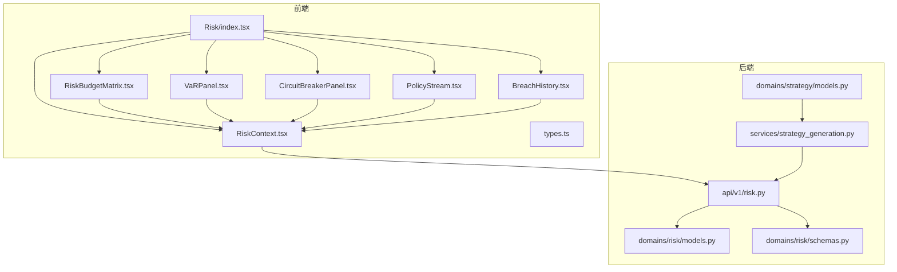
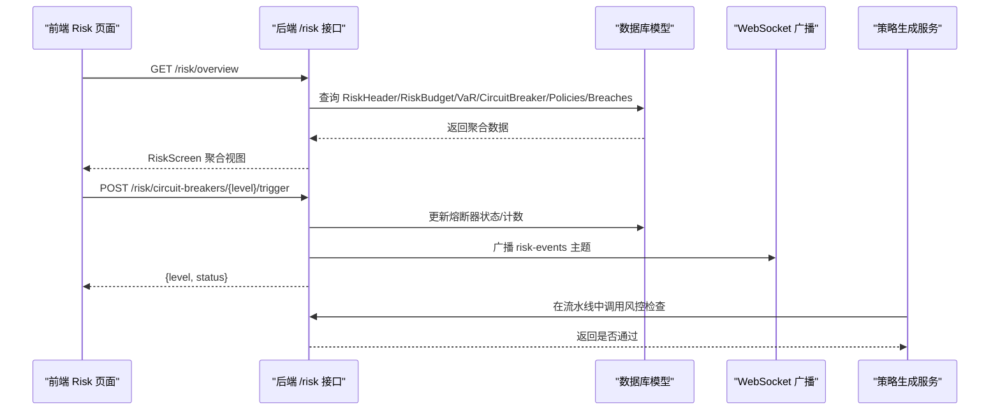
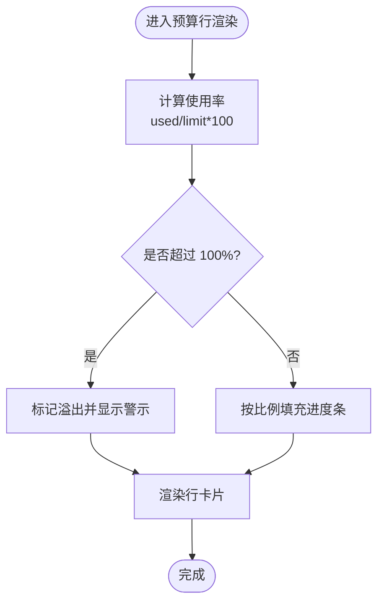
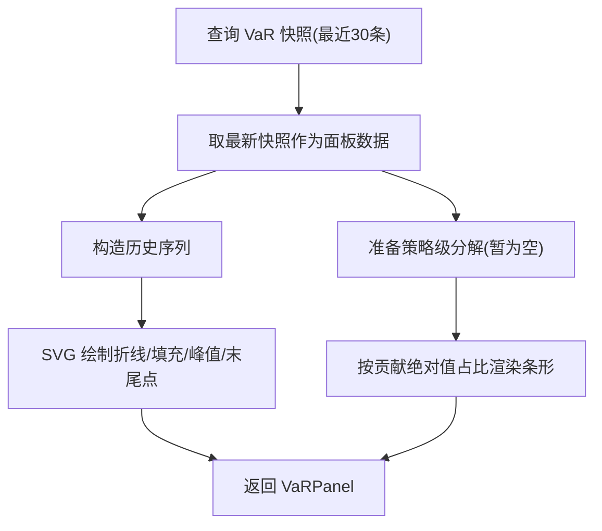
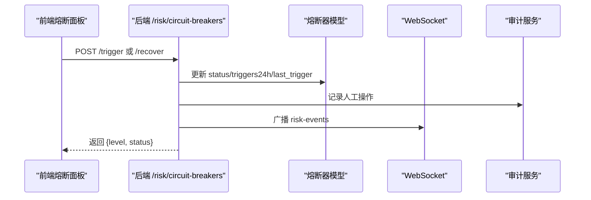
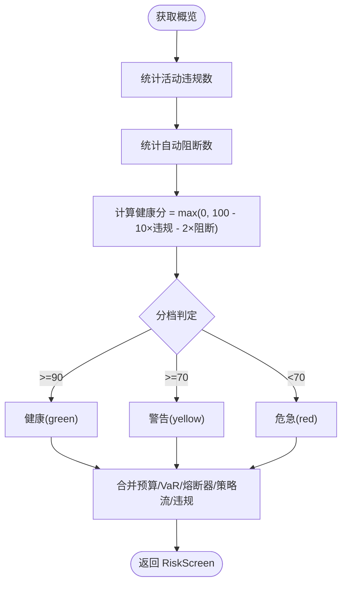
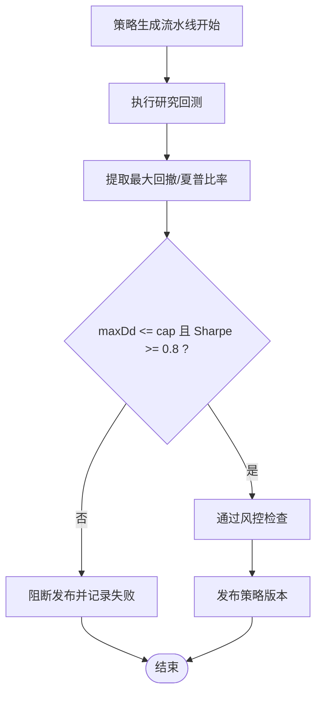
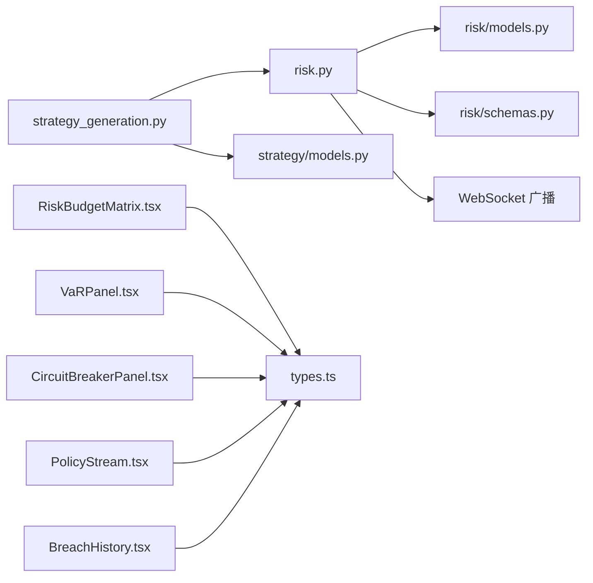

# 风险预算

<cite>
**本文引用的文件**
- [backend/app/api/v1/risk.py](file://backend/app/api/v1/risk.py)
- [backend/app/domains/risk/models.py](file://backend/app/domains/risk/models.py)
- [backend/app/domains/risk/schemas.py](file://backend/app/domains/risk/schemas.py)
- [frontend/src/screens/Risk/index.tsx](file://frontend/src/screens/Risk/index.tsx)
- [frontend/src/screens/Risk/RiskBudgetMatrix.tsx](file://frontend/src/screens/Risk/RiskBudgetMatrix.tsx)
- [frontend/src/screens/Risk/VaRPanel.tsx](file://frontend/src/screens/Risk/VaRPanel.tsx)
- [frontend/src/screens/Risk/CircuitBreakerPanel.tsx](file://frontend/src/screens/Risk/CircuitBreakerPanel.tsx)
- [frontend/src/screens/Risk/BreachHistory.tsx](file://frontend/src/screens/Risk/BreachHistory.tsx)
- [frontend/src/screens/Risk/PolicyStream.tsx](file://frontend/src/screens/Risk/PolicyStream.tsx)
- [frontend/src/contexts/RiskContext.tsx](file://frontend/src/contexts/RiskContext.tsx)
- [frontend/src/data/types.ts](file://frontend/src/data/types.ts)
- [backend/app/db/migrations/versions/20260513_000001_execution_risk_portfolio.py](file://backend/app/db/migrations/versions/20260513_000001_execution_risk_portfolio.py)
- [backend/scripts/seed_dev_data.py](file://backend/scripts/seed_dev_data.py)
- [backend/app/services/strategy_generation.py](file://backend/app/services/strategy_generation.py)
- [backend/app/domains/strategy/models.py](file://backend/app/domains/strategy/models.py)
</cite>

## 目录
1. [简介](#简介)
2. [项目结构](#项目结构)
3. [核心组件](#核心组件)
4. [架构总览](#架构总览)
5. [详细组件分析](#详细组件分析)
6. [依赖关系分析](#依赖关系分析)
7. [性能考量](#性能考量)
8. [故障排查指南](#故障排查指南)
9. [结论](#结论)
10. [附录](#附录)

## 简介
本文件面向量化投资组合的风险控制与实时监控场景，系统性阐述风险预算分配、风险限额管理、实时风险监控与风险预警体系。围绕 RiskBudget 模型、预算使用率计算、风险阈值设置与紧急响应机制，结合后端 API、数据库模型、前端可视化组件与策略生成流程，帮助开发者快速理解并落地量化风控框架。

## 项目结构
风险预算功能由“后端 API + 数据模型 + 前端可视化”三层构成，并与策略生成流程中的风控检查点衔接，形成从策略生成到执行的闭环风控。

图表来源
- [frontend/src/screens/Risk/index.tsx:17-44](file://frontend/src/screens/Risk/index.tsx#L17-L44)
- [frontend/src/contexts/RiskContext.tsx:1-13](file://frontend/src/contexts/RiskContext.tsx#L1-L13)
- [backend/app/api/v1/risk.py:188-207](file://backend/app/api/v1/risk.py#L188-L207)
- [backend/app/domains/risk/models.py:34-87](file://backend/app/domains/risk/models.py#L34-L87)
- [backend/app/domains/risk/schemas.py:88-96](file://backend/app/domains/risk/schemas.py#L88-L96)
- [backend/app/services/strategy_generation.py:516-518](file://backend/app/services/strategy_generation.py#L516-L518)

章节来源
- [frontend/src/screens/Risk/index.tsx:17-44](file://frontend/src/screens/Risk/index.tsx#L17-L44)
- [backend/app/api/v1/risk.py:188-207](file://backend/app/api/v1/risk.py#L188-L207)

## 核心组件
- 风控概览接口：提供健康评分、预算矩阵、VaR 面板、熔断器状态、策略决策流与违规历史的聚合视图。
- 风险预算模型：记录组合维度的预算分配、使用量、单位与颜色等级（安全/注意/临界）。
- VaR 快照模型：记录滚动日/周 VaR 及置信度，支持历史趋势与策略级分解。
- 熔断器模型：定义 L1-L4 级别、触发条件、动作、状态与 24 小时触发计数。
- 违规事件模型：记录风险违规的严重级别、状态与处置进展。
- 策略风控检查：在策略生成流水线中对最大回撤与夏普比率进行阈值校验，未达标则阻断发布。

章节来源
- [backend/app/api/v1/risk.py:39-116](file://backend/app/api/v1/risk.py#L39-L116)
- [backend/app/domains/risk/models.py:34-87](file://backend/app/domains/risk/models.py#L34-L87)
- [backend/app/services/strategy_generation.py:516-518](file://backend/app/services/strategy_generation.py#L516-L518)

## 架构总览
下图展示从前端到后端 API，再到数据库模型与策略服务的整体交互路径，以及实时事件广播通道。

图表来源
- [backend/app/api/v1/risk.py:188-207](file://backend/app/api/v1/risk.py#L188-L207)
- [backend/app/api/v1/risk.py:210-272](file://backend/app/api/v1/risk.py#L210-L272)
- [backend/app/domains/risk/models.py:60-87](file://backend/app/domains/risk/models.py#L60-L87)
- [backend/app/services/strategy_generation.py:516-518](file://backend/app/services/strategy_generation.py#L516-L518)

## 详细组件分析

### 风险预算模型与预算使用率计算
- 数据模型字段
  - 组合标识、指标名称、限额、已用、单位、颜色等级、描述。
- 预算使用率
  - 使用百分比 = 已用 / 限额 × 100；若超过 100%，标记超限并显示溢出提示。
- 前端展示
  - 颜色等级映射安全/注意/临界；显示已用/限额与描述；统计非绿色预警数量。

图表来源
- [frontend/src/screens/Risk/RiskBudgetMatrix.tsx:22-51](file://frontend/src/screens/Risk/RiskBudgetMatrix.tsx#L22-L51)
- [backend/app/domains/risk/models.py:34-46](file://backend/app/domains/risk/models.py#L34-L46)

章节来源
- [frontend/src/screens/Risk/RiskBudgetMatrix.tsx:1-56](file://frontend/src/screens/Risk/RiskBudgetMatrix.tsx#L1-L56)
- [backend/app/domains/risk/models.py:34-46](file://backend/app/domains/risk/models.py#L34-L46)

### VaR 面板与策略级分解
- 数据来源
  - VaR 快照表取最新滚动窗口，计算日/周 VaR 与占净值百分比；历史序列用于绘制面积图与峰值标注。
- 策略级分解
  - 展示各策略对 VaR 的正负贡献及占比，支持按绝对值占比绘制横向条形。
- 前端可视化
  - SVG 绘制折线与填充区域；峰值与末尾点位标注数值；统计 30 日均值与方差。

图表来源
- [backend/app/api/v1/risk.py:91-116](file://backend/app/api/v1/risk.py#L91-L116)
- [frontend/src/screens/Risk/VaRPanel.tsx:1-120](file://frontend/src/screens/Risk/VaRPanel.tsx#L1-L120)
- [backend/app/domains/risk/models.py:48-58](file://backend/app/domains/risk/models.py#L48-L58)

章节来源
- [backend/app/api/v1/risk.py:91-116](file://backend/app/api/v1/risk.py#L91-L116)
- [frontend/src/screens/Risk/VaRPanel.tsx:1-120](file://frontend/src/screens/Risk/VaRPanel.tsx#L1-L120)

### 熔断器面板与紧急响应机制
- 状态流转
  - L1-L4 四级熔断，状态包括待命/触发/冷却/禁用；手动触发后更新状态与 24 小时触发计数，并广播风险事件主题。
- 前端展示
  - 状态图标与标签；规则触发/动作说明；24 小时触发次数与最近触发时间；L4 提供全局熔断入口。
- 紧急响应
  - 触发后可请求恢复，进入冷却状态；审计日志记录人工干预结果与色调。

图表来源
- [backend/app/api/v1/risk.py:210-272](file://backend/app/api/v1/risk.py#L210-L272)
- [backend/app/domains/risk/models.py:60-73](file://backend/app/domains/risk/models.py#L60-L73)
- [frontend/src/screens/Risk/CircuitBreakerPanel.tsx:1-88](file://frontend/src/screens/Risk/CircuitBreakerPanel.tsx#L1-L88)

章节来源
- [backend/app/api/v1/risk.py:210-272](file://backend/app/api/v1/risk.py#L210-L272)
- [frontend/src/screens/Risk/CircuitBreakerPanel.tsx:1-88](file://frontend/src/screens/Risk/CircuitBreakerPanel.tsx#L1-L88)

### 风控概览与健康评分
- 健康评分
  - 由“活动违规数 × 10 + 自动阻断数 × 2”折算，区间映射健康/警告/危急三档。
- 概览聚合
  - 同步返回预算、VaR、熔断器、策略决策流与违规历史等子面板数据。
- 前端上下文
  - 通过 React Context 提供风险数据给各子面板消费。

图表来源
- [backend/app/api/v1/risk.py:39-71](file://backend/app/api/v1/risk.py#L39-L71)
- [backend/app/api/v1/risk.py:188-207](file://backend/app/api/v1/risk.py#L188-L207)
- [frontend/src/contexts/RiskContext.tsx:1-13](file://frontend/src/contexts/RiskContext.tsx#L1-L13)

章节来源
- [backend/app/api/v1/risk.py:39-71](file://backend/app/api/v1/risk.py#L39-L71)
- [frontend/src/contexts/RiskContext.tsx:1-13](file://frontend/src/contexts/RiskContext.tsx#L1-L13)

### 策略生成中的风控检查与阈值设置
- 阈值设定
  - 不同风险画像的最大回撤上限与最低夏普比率阈值，用于策略发布前的风控校验。
- 流水线集成
  - 在“risk”阶段调用风控检查，若不通过则抛出异常并阻断发布，同时记录失败事件。
- 风控指标
  - 使用回测结果中的最大回撤与夏普比率作为判定依据。

图表来源
- [backend/app/services/strategy_generation.py:264-278](file://backend/app/services/strategy_generation.py#L264-L278)
- [backend/app/services/strategy_generation.py:516-518](file://backend/app/services/strategy_generation.py#L516-L518)
- [backend/app/domains/strategy/models.py:9-28](file://backend/app/domains/strategy/models.py#L9-L28)

章节来源
- [backend/app/services/strategy_generation.py:516-518](file://backend/app/services/strategy_generation.py#L516-L518)
- [backend/app/domains/strategy/models.py:9-28](file://backend/app/domains/strategy/models.py#L9-L28)

### 前端数据类型与组件契约
- 类型定义
  - 前端 MockData 中的 risk 字段与各子面板的数据结构保持一致，确保组件与后端返回字段一一对应。
- 组件职责
  - 概览页负责拉取并分发数据；各子面板独立消费上下文数据，渲染预算、VaR、熔断器、策略流与违规历史。

章节来源
- [frontend/src/data/types.ts:317-386](file://frontend/src/data/types.ts#L317-L386)
- [frontend/src/screens/Risk/index.tsx:17-44](file://frontend/src/screens/Risk/index.tsx#L17-L44)

## 依赖关系分析
- 后端 API 依赖数据库模型与模式，负责聚合视图与熔断器的人工操作。
- 前端组件依赖上下文与类型定义，保证数据一致性与渲染稳定性。
- 策略生成服务在流水线中调用风控检查，将风控阈值与回测指标耦合，形成闭环。

图表来源
- [backend/app/api/v1/risk.py:1-29](file://backend/app/api/v1/risk.py#L1-L29)
- [backend/app/domains/risk/models.py:1-101](file://backend/app/domains/risk/models.py#L1-L101)
- [backend/app/domains/risk/schemas.py:1-96](file://backend/app/domains/risk/schemas.py#L1-L96)
- [backend/app/services/strategy_generation.py:1-50](file://backend/app/services/strategy_generation.py#L1-L50)
- [frontend/src/screens/Risk/RiskBudgetMatrix.tsx:1-56](file://frontend/src/screens/Risk/RiskBudgetMatrix.tsx#L1-L56)
- [frontend/src/screens/Risk/VaRPanel.tsx:1-120](file://frontend/src/screens/Risk/VaRPanel.tsx#L1-L120)
- [frontend/src/screens/Risk/CircuitBreakerPanel.tsx:1-88](file://frontend/src/screens/Risk/CircuitBreakerPanel.tsx#L1-L88)
- [frontend/src/screens/Risk/PolicyStream.tsx:1-42](file://frontend/src/screens/Risk/PolicyStream.tsx#L1-L42)
- [frontend/src/screens/Risk/BreachHistory.tsx:1-66](file://frontend/src/screens/Risk/BreachHistory.tsx#L1-L66)
- [frontend/src/data/types.ts:317-386](file://frontend/src/data/types.ts#L317-L386)

章节来源
- [backend/app/api/v1/risk.py:1-29](file://backend/app/api/v1/risk.py#L1-L29)
- [frontend/src/data/types.ts:317-386](file://frontend/src/data/types.ts#L317-L386)

## 性能考量
- 数据查询优化
  - 风控概览接口采用多任务并发获取各子面板数据，减少往返延迟。
  - VaR 历史查询限制窗口大小，避免大范围扫描。
- 渲染性能
  - 预算与熔断器列表按需渲染，避免重复计算；VaR 图表使用 SVG 路径缓存与最小化重绘。
- 实时性
  - 熔断器状态变更通过 WebSocket 广播，前端即时刷新，降低轮询开销。

## 故障排查指南
- 熔断器状态异常
  - 若触发后无法恢复，请确认当前状态非“待命”，并检查审计日志中的人工操作记录。
- 预算使用率显示异常
  - 检查数据库中限额与已用值是否正确写入；确认前端单位与颜色等级映射。
- VaR 面板无数据
  - 确认 VaR 快照表存在数据；检查历史序列长度与置信度字段。
- 策略发布被阻断
  - 查看流水线“risk”阶段事件详情，确认最大回撤或夏普比率是否低于阈值。

章节来源
- [backend/app/api/v1/risk.py:210-272](file://backend/app/api/v1/risk.py#L210-L272)
- [backend/app/services/strategy_generation.py:314-335](file://backend/app/services/strategy_generation.py#L314-L335)

## 结论
该风险预算体系以 RiskBudget 模型为核心，结合 VaR 监控、熔断器紧急响应与策略生成阶段的风控检查，实现了从预算分配、限额管理到实时监控与应急处置的完整闭环。前端通过直观的可视化组件呈现关键指标与事件流，便于运营与风控人员快速掌握组合风险状况并采取行动。

## 附录
- 数据库初始化脚本中包含示例预算数据，可用于本地开发与演示。
- 风控阈值可通过策略画像参数动态调整，建议在生产环境以配置中心或策略模板方式统一管理。

章节来源
- [backend/scripts/seed_dev_data.py:128-181](file://backend/scripts/seed_dev_data.py#L128-L181)
- [backend/app/db/migrations/versions/20260513_000001_execution_risk_portfolio.py:153-203](file://backend/app/db/migrations/versions/20260513_000001_execution_risk_portfolio.py#L153-L203)