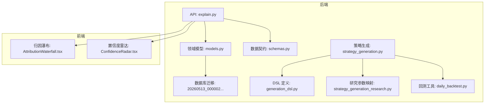
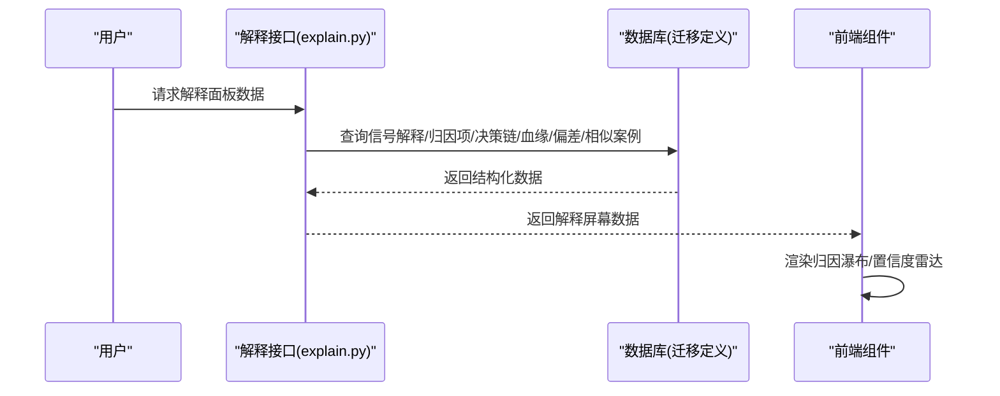
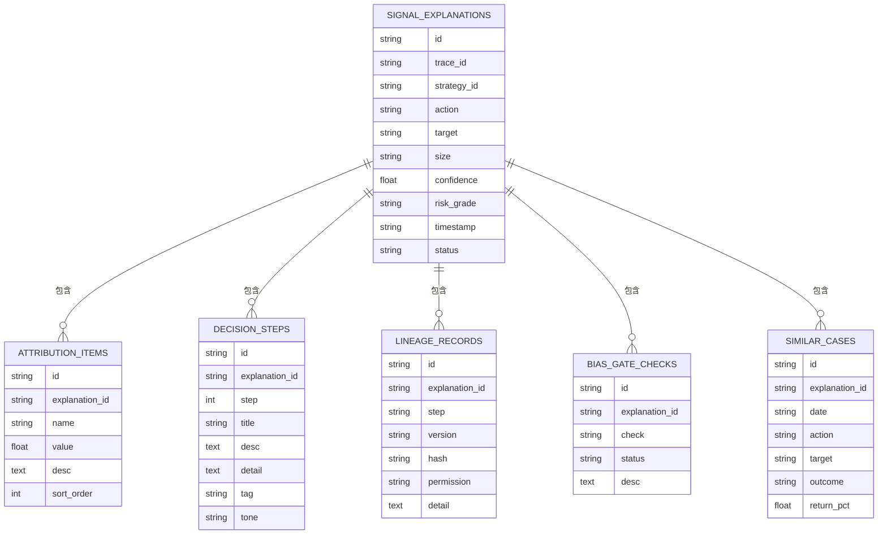
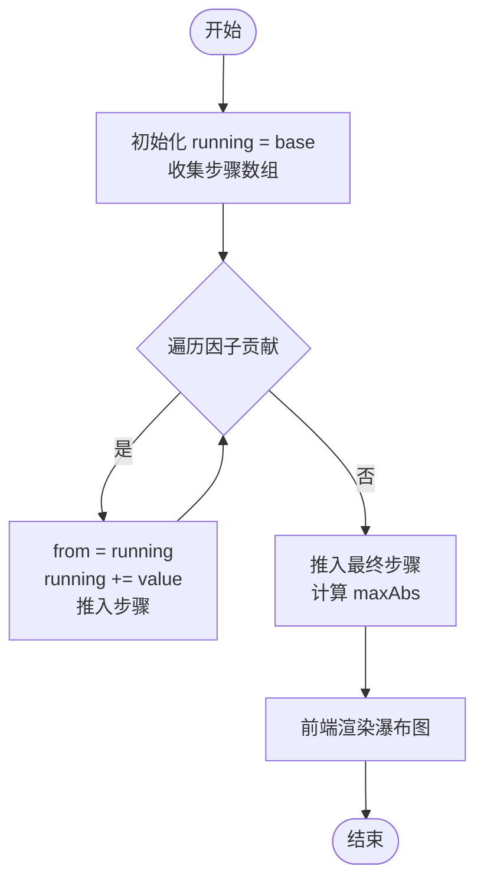
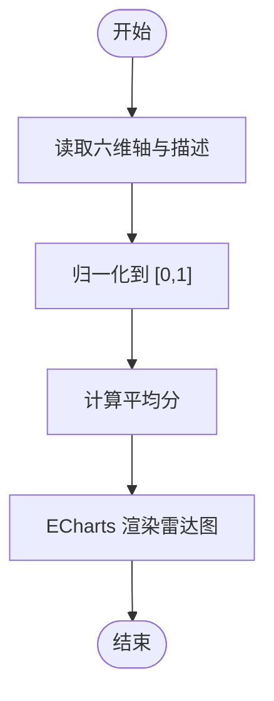
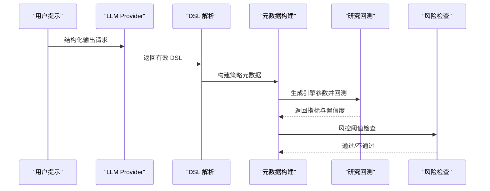
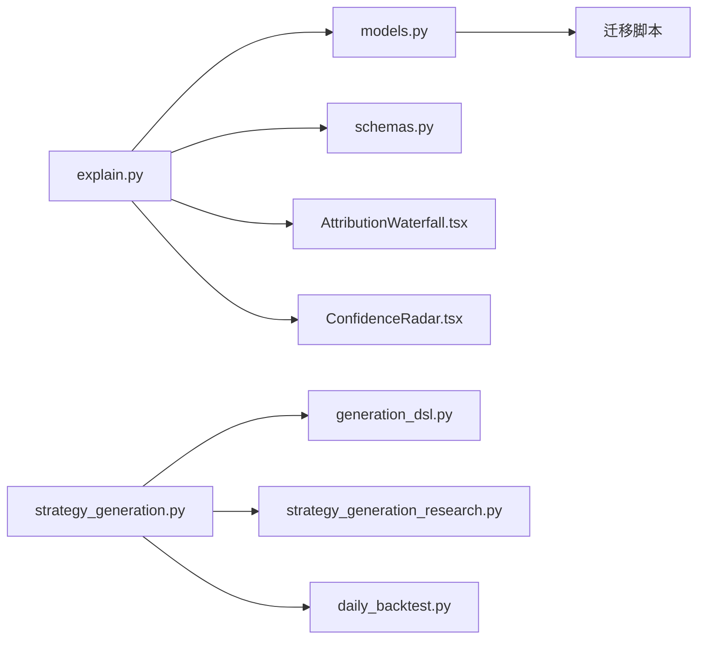

# 信号归因分析

<cite>
**本文引用的文件**
- [backend/app/api/v1/explain.py](file://backend/app/api/v1/explain.py)
- [backend/app/domains/explain/models.py](file://backend/app/domains/explain/models.py)
- [backend/app/domains/explain/schemas.py](file://backend/app/domains/explain/schemas.py)
- [backend/app/db/migrations/versions/20260513_000002_security_collaboration_explain.py](file://backend/app/db/migrations/versions/20260513_000002_security_collaboration_explain.py)
- [frontend/src/screens/Explain/AttributionWaterfall.tsx](file://frontend/src/screens/Explain/AttributionWaterfall.tsx)
- [frontend/src/screens/Explain/ConfidenceRadar.tsx](file://frontend/src/screens/Explain/ConfidenceRadar.tsx)
- [backend/app/services/strategy_generation.py](file://backend/app/services/strategy_generation.py)
- [backend/app/services/strategy_generation_research.py](file://backend/app/services/strategy_generation_research.py)
- [backend/app/domains/strategy/generation_dsl.py](file://backend/app/domains/strategy/generation_dsl.py)
- [backend/app/services/daily_backtest.py](file://backend/app/services/daily_backtest.py)
- [doc/data_mock.js](file://doc/data_mock.js)
</cite>

## 目录
1. [引言](#引言)
2. [项目结构](#项目结构)
3. [核心组件](#核心组件)
4. [架构总览](#架构总览)
5. [详细组件分析](#详细组件分析)
6. [依赖分析](#依赖分析)
7. [性能考虑](#性能考虑)
8. [故障排查指南](#故障排查指南)
9. [结论](#结论)
10. [附录](#附录)

## 引言
本文件面向信号归因分析系统的算法与实现，围绕“信号生成过程的归因分解、因子贡献度计算、决策链路追踪”展开，系统性阐述趋势动量、成交量确认、行业景气度、估值修复等因子的量化评分机制，以及信号强度计算与风险调整后收益评估方法。文档同时给出权重分配策略、异常信号检测与可视化呈现方式，帮助开发者快速理解量化策略的决策逻辑与性能归因技术。

## 项目结构
本项目采用前后端分离架构，后端以 FastAPI 提供 Explain 服务，前端通过 ECharts 展示归因瀑布图与置信度雷达图。数据库层面通过迁移脚本定义信号解释相关表结构，包括信号解释、归因项、决策链、数据血缘、偏差闸门与相似案例等。

图表来源
- [backend/app/api/v1/explain.py:1-110](file://backend/app/api/v1/explain.py#L1-L110)
- [backend/app/domains/explain/models.py:1-87](file://backend/app/domains/explain/models.py#L1-L87)
- [backend/app/domains/explain/schemas.py:1-93](file://backend/app/domains/explain/schemas.py#L1-L93)
- [backend/app/db/migrations/versions/20260513_000002_security_collaboration_explain.py:111-201](file://backend/app/db/migrations/versions/20260513_000002_security_collaboration_explain.py#L111-L201)
- [frontend/src/screens/Explain/AttributionWaterfall.tsx:1-87](file://frontend/src/screens/Explain/AttributionWaterfall.tsx#L1-L87)
- [frontend/src/screens/Explain/ConfidenceRadar.tsx:1-115](file://frontend/src/screens/Explain/ConfidenceRadar.tsx#L1-L115)
- [backend/app/services/strategy_generation.py:1-584](file://backend/app/services/strategy_generation.py#L1-L584)
- [backend/app/services/strategy_generation_research.py:1-46](file://backend/app/services/strategy_generation_research.py#L1-L46)
- [backend/app/domains/strategy/generation_dsl.py:1-144](file://backend/app/domains/strategy/generation_dsl.py#L1-L144)
- [backend/app/services/daily_backtest.py:760-796](file://backend/app/services/daily_backtest.py#L760-L796)

章节来源
- [backend/app/api/v1/explain.py:1-110](file://backend/app/api/v1/explain.py#L1-L110)
- [backend/app/domains/explain/models.py:1-87](file://backend/app/domains/explain/models.py#L1-L87)
- [backend/app/domains/explain/schemas.py:1-93](file://backend/app/domains/explain/schemas.py#L1-L93)
- [backend/app/db/migrations/versions/20260513_000002_security_collaboration_explain.py:111-201](file://backend/app/db/migrations/versions/20260513_000002_security_collaboration_explain.py#L111-L201)
- [frontend/src/screens/Explain/AttributionWaterfall.tsx:1-87](file://frontend/src/screens/Explain/AttributionWaterfall.tsx#L1-L87)
- [frontend/src/screens/Explain/ConfidenceRadar.tsx:1-115](file://frontend/src/screens/Explain/ConfidenceRadar.tsx#L1-L115)
- [backend/app/services/strategy_generation.py:1-584](file://backend/app/services/strategy_generation.py#L1-L584)
- [backend/app/services/strategy_generation_research.py:1-46](file://backend/app/services/strategy_generation_research.py#L1-L46)
- [backend/app/domains/strategy/generation_dsl.py:1-144](file://backend/app/domains/strategy/generation_dsl.py#L1-L144)
- [backend/app/services/daily_backtest.py:760-796](file://backend/app/services/daily_backtest.py#L760-L796)

## 核心组件
- 信号解释与归因
  - 后端提供解释接口，返回信号头、归因瀑布、置信度雷达、决策链、数据血缘、偏差闸门与相似历史等。
  - 数据库模型定义了信号解释、归因项、决策步骤、数据血缘、偏差检查与相似案例等实体。
- 归因瀑布图
  - 前端基于归因数据渲染瀑布图，展示从基线到最终决策的累积贡献。
- 置信度雷达图
  - 前端基于雷达轴数据渲染雷达图，综合评估数据质量、模型稳定性、因子显著性、回测表现、风险控制与可解释性。
- 策略生成与回测
  - 通过 DSL 定义策略意图，映射为内置引擎参数并执行研究回测，产出风险调整后收益指标，用于置信度与风险评估。

章节来源
- [backend/app/api/v1/explain.py:23-109](file://backend/app/api/v1/explain.py#L23-L109)
- [backend/app/domains/explain/models.py:9-87](file://backend/app/domains/explain/models.py#L9-L87)
- [backend/app/domains/explain/schemas.py:6-93](file://backend/app/domains/explain/schemas.py#L6-L93)
- [frontend/src/screens/Explain/AttributionWaterfall.tsx:4-87](file://frontend/src/screens/Explain/AttributionWaterfall.tsx#L4-L87)
- [frontend/src/screens/Explain/ConfidenceRadar.tsx:5-115](file://frontend/src/screens/Explain/ConfidenceRadar.tsx#L5-L115)
- [backend/app/services/strategy_generation.py:61-83](file://backend/app/services/strategy_generation.py#L61-L83)

## 架构总览
下图展示了从策略生成到信号解释与可视化的整体流程，重点体现归因计算、因子贡献与风险评估的衔接。

图表来源
- [backend/app/api/v1/explain.py:98-109](file://backend/app/api/v1/explain.py#L98-L109)
- [backend/app/domains/explain/models.py:9-87](file://backend/app/domains/explain/models.py#L9-L87)
- [backend/app/db/migrations/versions/20260513_000002_security_collaboration_explain.py:111-201](file://backend/app/db/migrations/versions/20260513_000002_security_collaboration_explain.py#L111-L201)
- [frontend/src/screens/Explain/AttributionWaterfall.tsx:4-87](file://frontend/src/screens/Explain/AttributionWaterfall.tsx#L4-L87)
- [frontend/src/screens/Explain/ConfidenceRadar.tsx:5-115](file://frontend/src/screens/Explain/ConfidenceRadar.tsx#L5-L115)

## 详细组件分析

### 信号解释与归因数据模型
- 信号解释表
  - 字段：跟踪 ID、策略 ID、动作、目标、规模、置信度、风险等级、时间戳、状态。
- 归因项表
  - 字段：解释 ID、名称、数值、描述、排序序号。
- 决策链、数据血缘、偏差闸门、相似案例
  - 对应的模型与迁移脚本定义了完整的解释与审计链条。

图表来源
- [backend/app/domains/explain/models.py:9-87](file://backend/app/domains/explain/models.py#L9-L87)
- [backend/app/db/migrations/versions/20260513_000002_security_collaboration_explain.py:111-201](file://backend/app/db/migrations/versions/20260513_000002_security_collaboration_explain.py#L111-L201)

章节来源
- [backend/app/domains/explain/models.py:9-87](file://backend/app/domains/explain/models.py#L9-L87)
- [backend/app/db/migrations/versions/20260513_000002_security_collaboration_explain.py:111-201](file://backend/app/db/migrations/versions/20260513_000002_security_collaboration_explain.py#L111-L201)

### 归因瀑布图算法
- 输入
  - 基线分数、因子贡献列表（含名称、数值、描述）、最终分数。
- 计算流程
  - 初始化运行值为基线分数，依次累加每个因子贡献，记录起止位置与类型（正/负/基线/最终）。
  - 计算最大绝对值用于归一化，确保图形比例一致。
- 输出
  - 步骤序列与最大绝对值，前端据此绘制带标签、描述与颜色的瀑布条形。

图表来源
- [frontend/src/screens/Explain/AttributionWaterfall.tsx:8-27](file://frontend/src/screens/Explain/AttributionWaterfall.tsx#L8-L27)

章节来源
- [frontend/src/screens/Explain/AttributionWaterfall.tsx:4-87](file://frontend/src/screens/Explain/AttributionWaterfall.tsx#L4-L87)

### 置信度雷达图算法
- 输入
  - 六维轴：数据质量、模型稳定性、因子显著性、回测表现、风险控制、可解释性，以及平均分。
- 计算流程
  - 将各轴分数映射到 0~1 区间，计算平均分作为综合指标。
  - 前端使用 ECharts 渲染雷达图，支持提示框、渐变填充与自适应尺寸。
- 输出
  - 雷达图与各轴得分列表，辅助判断信号可信度。

图表来源
- [frontend/src/screens/Explain/ConfidenceRadar.tsx:24-80](file://frontend/src/screens/Explain/ConfidenceRadar.tsx#L24-L80)

章节来源
- [frontend/src/screens/Explain/ConfidenceRadar.tsx:5-115](file://frontend/src/screens/Explain/ConfidenceRadar.tsx#L5-L115)

### 策略生成与回测对归因的支持
- DSL 解析与元数据构建
  - 将自然语言意图解析为结构化 DSL，映射为策略家族、频率、参数与风控规则，用于后续解释与可视化。
- 研究回测与指标
  - 将 DSL 映射为内置引擎参数（如双均线窗口），执行研究回测，产出夏普比率、最大回撤、年化收益、胜率、换手率等指标，并转换为置信度与样本外评分。
- 风险检查
  - 基于风险画像设定上限（如最大回撤与最低夏普），用于信号发布前的风险闸门。

图表来源
- [backend/app/services/strategy_generation.py:445-514](file://backend/app/services/strategy_generation.py#L445-L514)
- [backend/app/services/strategy_generation_research.py:15-46](file://backend/app/services/strategy_generation_research.py#L15-L46)
- [backend/app/domains/strategy/generation_dsl.py:108-143](file://backend/app/domains/strategy/generation_dsl.py#L108-L143)
- [backend/app/services/daily_backtest.py:760-796](file://backend/app/services/daily_backtest.py#L760-L796)

章节来源
- [backend/app/services/strategy_generation.py:61-83](file://backend/app/services/strategy_generation.py#L61-L83)
- [backend/app/services/strategy_generation_research.py:15-46](file://backend/app/services/strategy_generation_research.py#L15-L46)
- [backend/app/domains/strategy/generation_dsl.py:108-143](file://backend/app/domains/strategy/generation_dsl.py#L108-L143)
- [backend/app/services/daily_backtest.py:760-796](file://backend/app/services/daily_backtest.py#L760-L796)

### 因子贡献度计算与权重分配策略
- 因子贡献度
  - 归因项列表中的数值即为因子贡献，正负表示增益或减损。
- 权重分配
  - 基线分数与最终分数之间的差值即为总贡献，因子贡献之和等于最终分数减基线分数。
- 评分机制示例
  - 趋势动量、成交量确认、行业景气度、估值修复等因子分别给出数值与描述，最终决策由综合得分决定。

章节来源
- [backend/app/api/v1/explain.py:36-48](file://backend/app/api/v1/explain.py#L36-L48)
- [backend/app/domains/explain/schemas.py:19-31](file://backend/app/domains/explain/schemas.py#L19-L31)

### 决策链路追踪
- 决策链步骤
  - 信号生成、因子打分、风险检查、组合影响、人类审批等步骤构成闭环，每步包含标题、描述、细节与标签。
- 数据血缘
  - 记录从原始数据、特征工程、模型推理、信号生成、风控审查到执行的全流程版本与权限信息。
- 偏差闸门
  - 未来函数检测、幸存者偏差、数据窥探、回测偏差等检查项，状态分为通过/观察/失败/强制。

章节来源
- [backend/app/api/v1/explain.py:62-83](file://backend/app/api/v1/explain.py#L62-L83)
- [backend/app/domains/explain/schemas.py:44-92](file://backend/app/domains/explain/schemas.py#L44-L92)
- [backend/app/domains/explain/models.py:37-87](file://backend/app/domains/explain/models.py#L37-L87)
- [doc/data_mock.js:187-197](file://doc/data_mock.js#L187-L197)

### 异常信号检测算法
- 偏差闸门检查
  - 通过/观察/失败/强制四种状态，结合描述进行人工复核与干预。
- 相似历史比对
  - 历史相似案例的胜率、平均回报与具体案例详情，辅助判断当前信号的可靠性与预期收益。

章节来源
- [backend/app/api/v1/explain.py:78-95](file://backend/app/api/v1/explain.py#L78-L95)
- [backend/app/domains/explain/schemas.py:68-83](file://backend/app/domains/explain/schemas.py#L68-L83)
- [backend/app/domains/explain/models.py:75-87](file://backend/app/domains/explain/models.py#L75-L87)

## 依赖分析
- 后端 API 依赖领域模型与数据契约，模型与迁移脚本共同保证数据结构稳定。
- 前端组件依赖解释接口返回的数据格式，瀑布图与雷达图分别处理归因与置信度数据。
- 策略生成服务通过 DSL 与研究回测为解释面板提供指标与元数据支撑。

图表来源
- [backend/app/api/v1/explain.py:1-110](file://backend/app/api/v1/explain.py#L1-L110)
- [backend/app/domains/explain/models.py:1-87](file://backend/app/domains/explain/models.py#L1-L87)
- [backend/app/domains/explain/schemas.py:1-93](file://backend/app/domains/explain/schemas.py#L1-L93)
- [backend/app/db/migrations/versions/20260513_000002_security_collaboration_explain.py:111-201](file://backend/app/db/migrations/versions/20260513_000002_security_collaboration_explain.py#L111-L201)
- [frontend/src/screens/Explain/AttributionWaterfall.tsx:1-87](file://frontend/src/screens/Explain/AttributionWaterfall.tsx#L1-L87)
- [frontend/src/screens/Explain/ConfidenceRadar.tsx:1-115](file://frontend/src/screens/Explain/ConfidenceRadar.tsx#L1-L115)
- [backend/app/services/strategy_generation.py:1-584](file://backend/app/services/strategy_generation.py#L1-L584)
- [backend/app/services/strategy_generation_research.py:1-46](file://backend/app/services/strategy_generation_research.py#L1-L46)
- [backend/app/domains/strategy/generation_dsl.py:1-144](file://backend/app/domains/strategy/generation_dsl.py#L1-L144)
- [backend/app/services/daily_backtest.py:760-796](file://backend/app/services/daily_backtest.py#L760-L796)

章节来源
- [backend/app/api/v1/explain.py:1-110](file://backend/app/api/v1/explain.py#L1-L110)
- [backend/app/domains/explain/models.py:1-87](file://backend/app/domains/explain/models.py#L1-L87)
- [backend/app/domains/explain/schemas.py:1-93](file://backend/app/domains/explain/schemas.py#L1-L93)
- [backend/app/db/migrations/versions/20260513_000002_security_collaboration_explain.py:111-201](file://backend/app/db/migrations/versions/20260513_000002_security_collaboration_explain.py#L111-L201)
- [frontend/src/screens/Explain/AttributionWaterfall.tsx:1-87](file://frontend/src/screens/Explain/AttributionWaterfall.tsx#L1-L87)
- [frontend/src/screens/Explain/ConfidenceRadar.tsx:1-115](file://frontend/src/screens/Explain/ConfidenceRadar.tsx#L1-L115)
- [backend/app/services/strategy_generation.py:1-584](file://backend/app/services/strategy_generation.py#L1-L584)
- [backend/app/services/strategy_generation_research.py:1-46](file://backend/app/services/strategy_generation_research.py#L1-L46)
- [backend/app/domains/strategy/generation_dsl.py:1-144](file://backend/app/domains/strategy/generation_dsl.py#L1-L144)
- [backend/app/services/daily_backtest.py:760-796](file://backend/app/services/daily_backtest.py#L760-L796)

## 性能考虑
- 前端渲染
  - 归因瀑布与置信度雷达均采用一次性数据计算与渲染，避免频繁重排；雷达图使用 Canvas 渲染器提升大屏场景性能。
- 后端接口
  - 解释接口返回静态聚合数据，减少复杂查询；数据库索引覆盖关键查询字段（如策略 ID、解释 ID）。
- 回测指标
  - 回测阶段仅在研究回测中使用，生产信号解释不重复执行回测，降低延迟。

## 故障排查指南
- 解释接口返回空数据
  - 检查数据库中是否存在对应解释 ID 的归因项、决策链、血缘、偏差与相似案例记录。
- 前端图表不显示
  - 确认解释接口返回的数据结构与前端组件期望一致；检查雷达图容器是否正确挂载与响应窗口大小变化。
- 策略生成失败
  - 关注管道事件与失败阶段定位问题：代码生成失败、DSL 校验失败、静态检查失败、回测失败或风控不通过。
- 风控不通过
  - 检查最大回撤与夏普比率阈值设置，必要时调整风险画像或策略参数。

章节来源
- [backend/app/api/v1/explain.py:98-109](file://backend/app/api/v1/explain.py#L98-L109)
- [backend/app/services/strategy_generation.py:308-373](file://backend/app/services/strategy_generation.py#L308-L373)
- [frontend/src/screens/Explain/ConfidenceRadar.tsx:11-22](file://frontend/src/screens/Explain/ConfidenceRadar.tsx#L11-L22)

## 结论
本系统通过结构化的解释数据模型与可视化组件，实现了从信号生成到归因分解、因子贡献度计算与决策链路追踪的完整闭环。结合研究回测指标与风险闸门，能够为信号强度与风险调整后收益提供可靠评估，并通过偏差闸门与相似历史辅助异常信号检测与人工复核，满足可解释性与合规要求。

## 附录
- 示例数据与说明
  - 文档中提供了信号触发、风险约束、负面因素与最终动作等示例，便于理解解释面板的组成与用途。

章节来源
- [doc/data_mock.js:182-197](file://doc/data_mock.js#L182-L197)