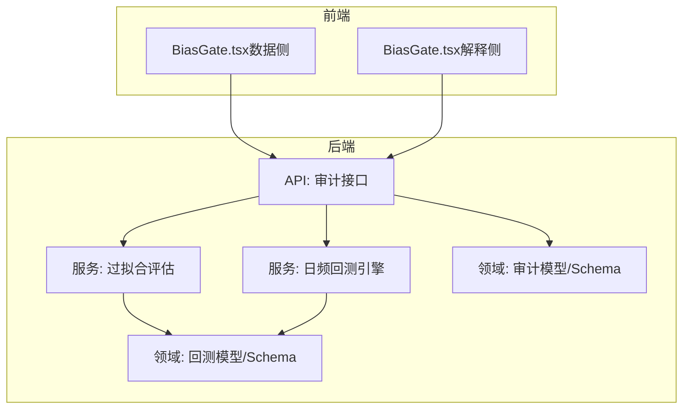
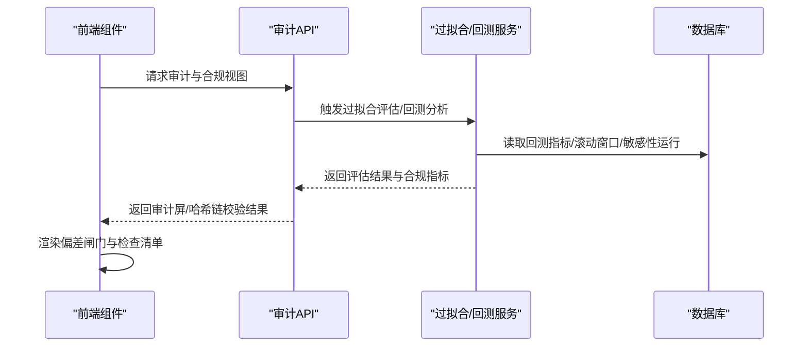
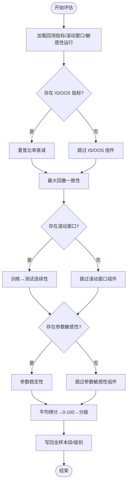
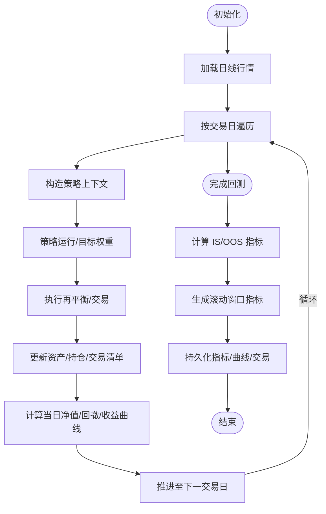
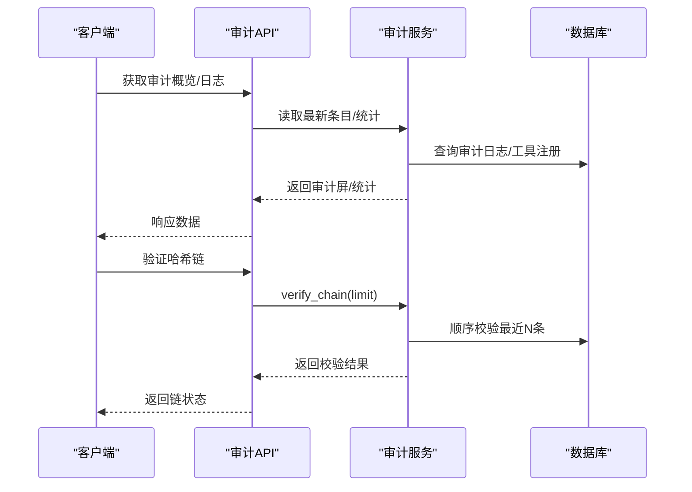
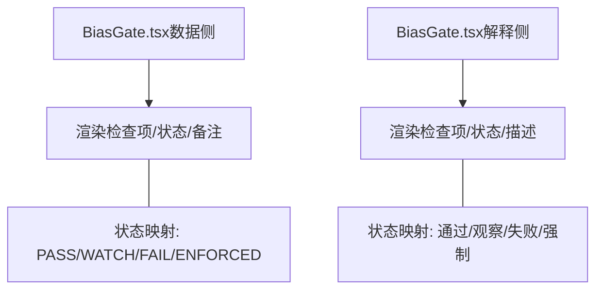
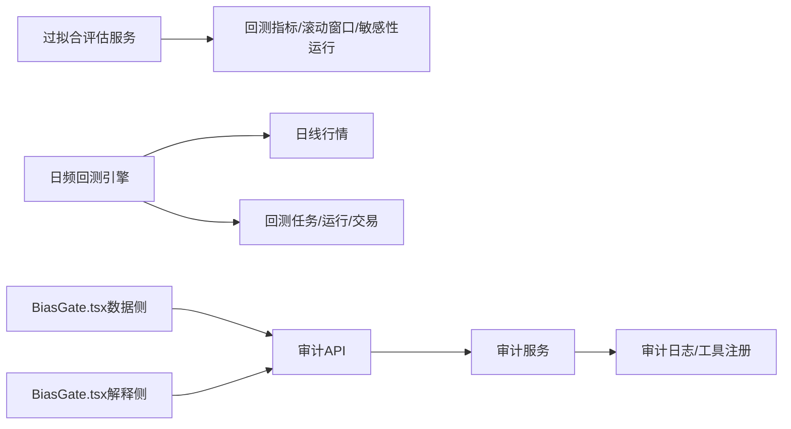

# 偏差检测门禁

<cite>
**本文档引用的文件**
- [overfitting.py](file://backend/app/services/overfitting.py)
- [daily_backtest.py](file://backend/app/services/daily_backtest.py)
- [models.py（回测）](file://backend/app/domains/backtest/models.py)
- [schemas.py（回测）](file://backend/app/domains/backtest/schemas.py)
- [audit_service.py](file://backend/app/services/audit_service.py)
- [audit.py](file://backend/app/api/v1/audit.py)
- [models.py（审计）](file://backend/app/domains/audit/models.py)
- [schemas.py（审计）](file://backend/app/domains/audit/schemas.py)
- [BiasGate.tsx（数据侧）](file://frontend/src/screens/Data/BiasGate.tsx)
- [BiasGate.tsx（解释侧）](file://frontend/src/screens/Explain/BiasGate.tsx)
- [ai_quant_trading.html](file://doc/ai_quant_trading.html)
- [mock_ashare.ts](file://frontend/src/data/mock_ashare.ts)
- [mock_crypto.ts](file://frontend/src/data/mock_crypto.ts)
</cite>

## 目录
1. [引言](#引言)
2. [项目结构](#项目结构)
3. [核心组件](#核心组件)
4. [架构总览](#架构总览)
5. [详细组件分析](#详细组件分析)
6. [依赖分析](#依赖分析)
7. [性能考虑](#性能考虑)
8. [故障排查指南](#故障排查指南)
9. [结论](#结论)
10. [附录](#附录)

## 引言
本文件面向量化研究与交易系统的“偏差检测门禁”体系，系统化阐述如何在回测与实盘信号生成全生命周期中，通过自动化手段识别并阻断多种关键偏差：幸存者偏差、未来函数偏差、特征泄漏、数据许可越界、样本失衡等。文档同时给出各检测项的算法原理、阈值设定策略与预警机制，帮助开发者快速落地高质量的质量控制与合规门禁。

## 项目结构
后端采用分层架构：服务层负责业务流程编排与质量控制；领域模型定义回测、审计等核心实体；API 层提供对外接口；前端以组件形式展示偏差闸门与检查清单。

图表来源
- [audit.py:1-258](file://backend/app/api/v1/audit.py#L1-L258)
- [overfitting.py:1-168](file://backend/app/services/overfitting.py#L1-L168)
- [daily_backtest.py:1-899](file://backend/app/services/daily_backtest.py#L1-L899)
- [models.py（回测）:1-155](file://backend/app/domains/backtest/models.py#L1-L155)
- [models.py（审计）:1-51](file://backend/app/domains/audit/models.py#L1-L51)

章节来源
- [audit.py:1-258](file://backend/app/api/v1/audit.py#L1-L258)
- [overfitting.py:1-168](file://backend/app/services/overfitting.py#L1-L168)
- [daily_backtest.py:1-899](file://backend/app/services/daily_backtest.py#L1-L899)
- [models.py（回测）:1-155](file://backend/app/domains/backtest/models.py#L1-L155)
- [models.py（审计）:1-51](file://backend/app/domains/audit/models.py#L1-L51)

## 核心组件
- 过拟合评估服务：基于 IS/OOS 分割、滚动窗口连续性、参数敏感性稳定性等多维度信号合成 0–100 的过拟合评分，并按阈值分级。
- 日频回测引擎：加载日线行情，执行策略每日再平衡，计算收益曲线与多类指标，支持 IS/OOS 分割与滚动窗口分析。
- 审计服务与接口：提供不可篡改的审计链路与合规视图，支撑偏差闸门的可信记录与验证。
- 偏差闸门前端组件：以卡片/列表形式展示各项检查状态、描述与备注，统一“通过/观察/失败/强制”语义。

章节来源
- [overfitting.py:1-168](file://backend/app/services/overfitting.py#L1-L168)
- [daily_backtest.py:1-899](file://backend/app/services/daily_backtest.py#L1-L899)
- [audit_service.py:1-109](file://backend/app/services/audit_service.py#L1-L109)
- [audit.py:1-258](file://backend/app/api/v1/audit.py#L1-L258)
- [BiasGate.tsx（数据侧）:1-59](file://frontend/src/screens/Data/BiasGate.tsx#L1-L59)
- [BiasGate.tsx（解释侧）:1-51](file://frontend/src/screens/Explain/BiasGate.tsx#L1-L51)

## 架构总览
下图展示了从回测到偏差闸门的关键流程：回测产出指标与等分段结果，过拟合评估聚合多信号形成综合评分；审计接口提供哈希链完整性校验与合规视图；前端以 BiasGate 组件呈现检查结果。

图表来源
- [audit.py:153-212](file://backend/app/api/v1/audit.py#L153-L212)
- [overfitting.py:129-167](file://backend/app/services/overfitting.py#L129-L167)
- [daily_backtest.py:373-452](file://backend/app/services/daily_backtest.py#L373-L452)

## 详细组件分析

### 过拟合评估服务（IS/OOS/滚动窗口/参数敏感性）
该服务将四个关键信号归一化到 [0,1] 后平均，得到 0–100 的综合评分，并按阈值映射为低/中/高等级。未满足条件时返回高风险并跳过持久化。

- IS/OOS 夏普比率衰减：当 IS 夏普为负时，OOS 至少不更差即视为可接受；否则按 OOS/IS 比值折算分数。
- IS/OOS 最大回撤一致性：以 IS 与 OOS 最大回撤差值比衡量稳定性。
- 滚动窗口连续性：每折训练/测试收益方向一致性与幅度比加权组合，反映外样本连续性。
- 参数敏感性稳定性：以变体相对基线的累计收益差异均值衡量参数鲁棒性。

图表来源
- [overfitting.py:51-126](file://backend/app/services/overfitting.py#L51-L126)
- [overfitting.py:129-167](file://backend/app/services/overfitting.py#L129-L167)

章节来源
- [overfitting.py:1-168](file://backend/app/services/overfitting.py#L1-L168)
- [models.py（回测）:33-119](file://backend/app/domains/backtest/models.py#L33-L119)
- [schemas.py（回测）:269-279](file://backend/app/domains/backtest/schemas.py#L269-L279)

### 日频回测引擎（收益曲线与指标计算）
引擎从日线表加载行情，逐日推进策略上下文，执行再平衡与交易，累积收益曲线与交易清单，并计算年化回报、最大回撤、夏普比率、胜率、换手率等指标。支持 IS/OOS 分割与滚动窗口分析，便于后续过拟合评估。

图表来源
- [daily_backtest.py:191-283](file://backend/app/services/daily_backtest.py#L191-L283)
- [daily_backtest.py:373-452](file://backend/app/services/daily_backtest.py#L373-L452)
- [daily_backtest.py:702-799](file://backend/app/services/daily_backtest.py#L702-L799)

章节来源
- [daily_backtest.py:1-899](file://backend/app/services/daily_backtest.py#L1-L899)
- [models.py（回测）:20-140](file://backend/app/domains/backtest/models.py#L20-L140)
- [schemas.py（回测）:155-193](file://backend/app/domains/backtest/schemas.py#L155-L193)

### 审计服务与接口（不可篡改链与合规视图）
审计服务以 SHA-256 链式哈希记录每次操作，支持链完整性验证；API 提供审计概览、分页查询、导出与工具注册等能力，辅助偏差闸门的可信记录与追溯。

图表来源
- [audit.py:153-212](file://backend/app/api/v1/audit.py#L153-L212)
- [audit_service.py:32-109](file://backend/app/services/audit_service.py#L32-L109)
- [models.py（审计）:9-26](file://backend/app/domains/audit/models.py#L9-L26)

章节来源
- [audit_service.py:1-109](file://backend/app/services/audit_service.py#L1-L109)
- [audit.py:1-258](file://backend/app/api/v1/audit.py#L1-L258)
- [models.py（审计）:1-51](file://backend/app/domains/audit/models.py#L1-L51)
- [schemas.py（审计）:1-53](file://backend/app/domains/audit/schemas.py#L1-L53)

### 偏差闸门前端组件
前端 BiasGate 组件以卡片或列表形式展示各项检查，统一状态语义（通过/观察/失败/强制），并显示检查时间与备注，便于研发与风控人员快速定位问题。

图表来源
- [BiasGate.tsx（数据侧）:1-59](file://frontend/src/screens/Data/BiasGate.tsx#L1-L59)
- [BiasGate.tsx（解释侧）:1-51](file://frontend/src/screens/Explain/BiasGate.tsx#L1-L51)

章节来源
- [BiasGate.tsx（数据侧）:1-59](file://frontend/src/screens/Data/BiasGate.tsx#L1-L59)
- [BiasGate.tsx（解释侧）:1-51](file://frontend/src/screens/Explain/BiasGate.tsx#L1-L51)

## 依赖分析
- 过拟合评估依赖回测指标、滚动窗口与敏感性运行结果，最终写回全样本段与风险等级字段。
- 日频回测引擎依赖市场日线表、策略运行器与成本配置，输出指标、收益曲线与交易清单。
- 审计服务与接口依赖数据库模型与哈希计算，提供链完整性校验与合规视图。
- 前端 BiasGate 组件依赖上下文数据与状态映射，统一展示偏差闸门检查结果。

图表来源
- [overfitting.py:129-167](file://backend/app/services/overfitting.py#L129-L167)
- [daily_backtest.py:285-371](file://backend/app/services/daily_backtest.py#L285-L371)
- [audit.py:153-212](file://backend/app/api/v1/audit.py#L153-L212)
- [audit_service.py:32-109](file://backend/app/services/audit_service.py#L32-L109)

章节来源
- [overfitting.py:1-168](file://backend/app/services/overfitting.py#L1-L168)
- [daily_backtest.py:1-899](file://backend/app/services/daily_backtest.py#L1-L899)
- [audit.py:1-258](file://backend/app/api/v1/audit.py#L1-L258)
- [audit_service.py:1-109](file://backend/app/services/audit_service.py#L1-L109)

## 性能考虑
- 过拟合评估：四个组件独立计算，时间复杂度近似 O(N)，其中 N 为折数或变体数量；建议在批量任务中并行处理不同 run_id。
- 日频回测：按交易日遍历，时间复杂度 O(T×S)，T 为交易日数，S 为标的数；可通过缓存行情与减少重复计算优化。
- 审计链校验：顺序校验最近 limit 条，时间复杂度 O(L)；建议限制校验窗口并异步执行。
- 前端渲染：BiasGate 组件仅消费后端返回数据，性能开销主要在数据请求与排序；建议分页与懒加载。

## 故障排查指南
- 过拟合评估返回高风险
  - 检查是否存在 IS/OOS 指标；若缺失，需补充分割配置。
  - 检查滚动窗口是否足够长；若不足，增加折数或延长样本。
  - 检查参数敏感性运行是否齐全；若缺失，重新执行参数扰动。
- 审计链校验失败
  - 使用“验证哈希链”接口检查最近 limit 条记录，定位破坏点。
  - 确认审计日志表中 prev_hash/curr_hash 字段是否正确填充。
- 偏差闸门显示“强制”或“观察”
  - 根据前端提示的检查项与备注，核查数据许可、特征泄漏与样本分布等。
  - 对于“强制”，需阻断实盘信号生成或订单草案；对于“观察”，需复核后再放行。

章节来源
- [overfitting.py:129-167](file://backend/app/services/overfitting.py#L129-L167)
- [audit.py:198-212](file://backend/app/api/v1/audit.py#L198-L212)
- [audit_service.py:83-109](file://backend/app/services/audit_service.py#L83-L109)
- [BiasGate.tsx（数据侧）:1-59](file://frontend/src/screens/Data/BiasGate.tsx#L1-L59)
- [BiasGate.tsx（解释侧）:1-51](file://frontend/src/screens/Explain/BiasGate.tsx#L1-L51)

## 结论
偏差检测门禁通过“过拟合评估 + 日频回测 + 审计链 + 前端闸门”的闭环，系统化地覆盖了量化研究与实盘信号生成的关键风险面。开发者可据此建立可追溯、可验证、可告警的质量控制体系，确保研究结果的有效性与可靠性。

## 附录

### 关键检测项与阈值策略
- 幸存者偏差
  - 策略：回测样本必须包含退市与历史成分变更标的。
  - 阈值：通过/失败；失败则阻断。
- 未来函数偏差
  - 策略：特征仅使用 t 时刻已可见数据；通过时间穿越一致性测试。
  - 阈值：全部通过为通过；否则为失败或观察。
- 特征泄漏
  - 策略：标签、成交结果、未来资金费率不得进入训练特征；对潜在泄漏特征进行滞后与相关性检验。
  - 阈值：高相关性或跨期信息泄露为观察；严重违规为失败。
- 数据许可越界
  - 策略：Research Only 数据禁止进入实盘信号与订单草案；自动拦截并记录。
  - 阈值：阻断计数与命中规则为强制。
- 样本失衡
  - 策略：正负样本比例需在合理区间；对类别不平衡进行重采样或代价调整。
  - 阈值：超出阈值为观察；需复核后再放行。

章节来源
- [ai_quant_trading.html:1312-1320](file://doc/ai_quant_trading.html#L1312-L1320)
- [mock_ashare.ts:1131-1136](file://frontend/src/data/mock_ashare.ts#L1131-L1136)
- [mock_crypto.ts:1151-1156](file://frontend/src/data/mock_crypto.ts#L1151-L1156)