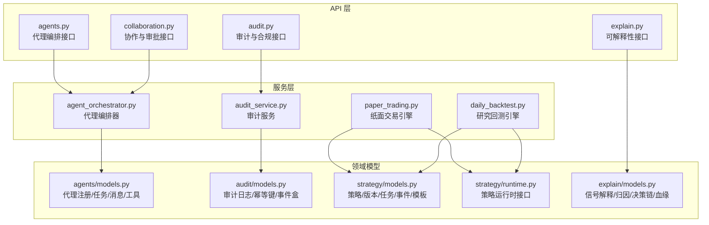
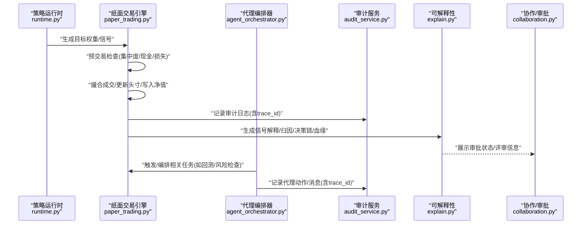
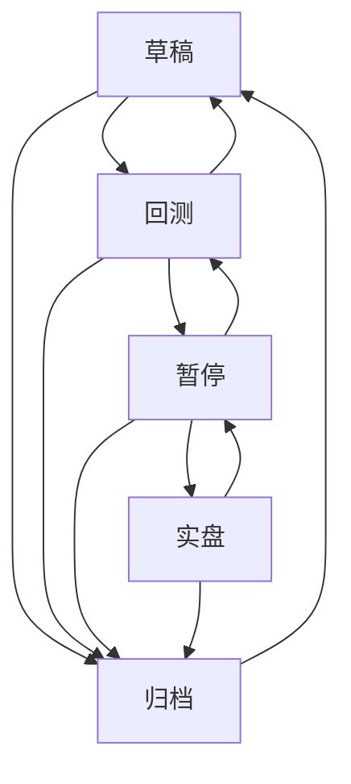
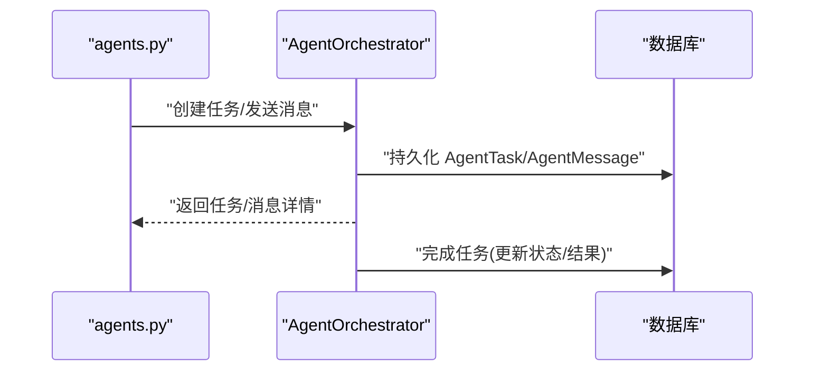
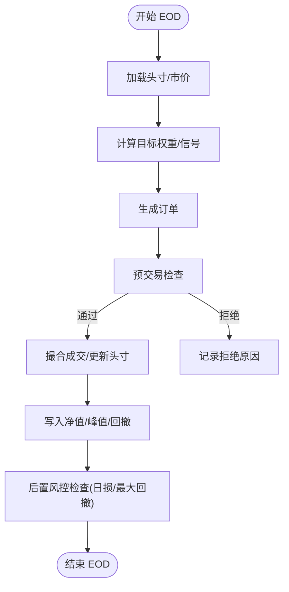
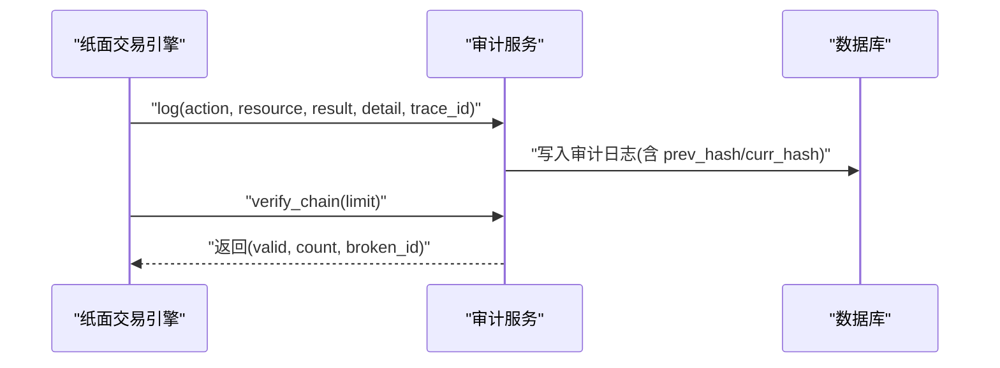
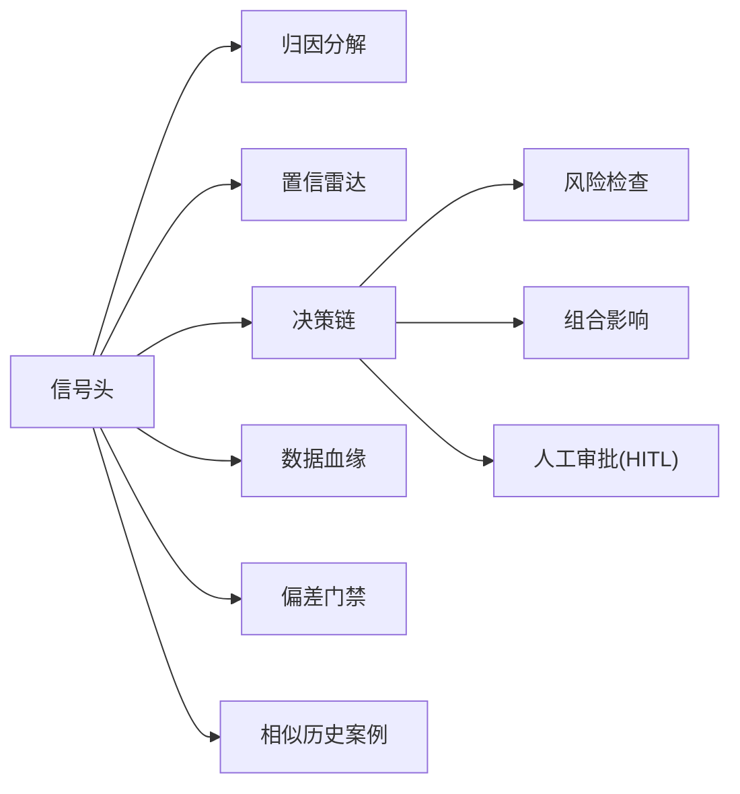
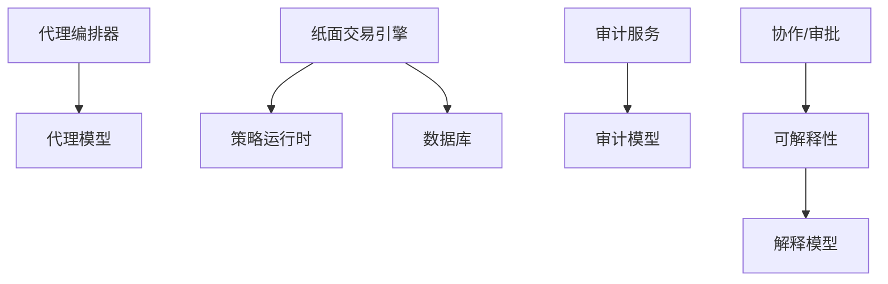

# 决策链路追踪

<cite>
**本文引用的文件**
- [backend/app/domains/strategy/state_machine.py](file://backend/app/domains/strategy/state_machine.py)
- [backend/app/services/agent_orchestrator.py](file://backend/app/services/agent_orchestrator.py)
- [backend/app/api/v1/agents.py](file://backend/app/api/v1/agents.py)
- [backend/app/api/v1/audit.py](file://backend/app/api/v1/audit.py)
- [backend/app/domains/audit/models.py](file://backend/app/domains/audit/models.py)
- [backend/app/services/audit_service.py](file://backend/app/services/audit_service.py)
- [backend/app/domains/agents/models.py](file://backend/app/domains/agents/models.py)
- [backend/app/domains/agents/schemas.py](file://backend/app/domains/agents/schemas.py)
- [backend/app/api/v1/collaboration.py](file://backend/app/api/v1/collaboration.py)
- [backend/app/services/paper_trading.py](file://backend/app/services/paper_trading.py)
- [backend/app/domains/strategy/models.py](file://backend/app/domains/strategy/models.py)
- [backend/app/domains/strategy/runtime.py](file://backend/app/domains/strategy/runtime.py)
- [backend/app/api/v1/explain.py](file://backend/app/api/v1/explain.py)
- [backend/app/domains/explain/models.py](file://backend/app/domains/explain/models.py)
- [backend/app/services/daily_backtest.py](file://backend/app/services/daily_backtest.py)
</cite>

## 目录
1. [引言](#引言)
2. [项目结构](#项目结构)
3. [核心组件](#核心组件)
4. [架构总览](#架构总览)
5. [详细组件分析](#详细组件分析)
6. [依赖分析](#依赖分析)
7. [性能考虑](#性能考虑)
8. [故障排查指南](#故障排查指南)
9. [结论](#结论)
10. [附录](#附录)

## 引言
本文件面向量化交易系统中的“决策链路追踪”能力，围绕从信号生成到最终执行的完整闭环，系统化梳理策略扫描、因子打分、风险检查、组合影响评估与人工审批等关键步骤的职责分工、状态流转与交互关系。文档同时给出状态机设计、异常处理流程与可操作的排障建议，帮助开发者理解人机协作机制与决策透明度保障技术。

## 项目结构
后端采用分层架构：API 层负责对外接口与数据序列化；服务层封装业务流程（如代理编排、回测引擎、纸面交易）；领域模型与模式库提供数据结构与持久化契约；审计与可解释性模块贯穿全链路以保证可追溯与可观测。

图表来源
- [backend/app/api/v1/agents.py:1-172](file://backend/app/api/v1/agents.py#L1-L172)
- [backend/app/services/agent_orchestrator.py:1-105](file://backend/app/services/agent_orchestrator.py#L1-L105)
- [backend/app/services/paper_trading.py:1-634](file://backend/app/services/paper_trading.py#L1-L634)
- [backend/app/services/daily_backtest.py:1-800](file://backend/app/services/daily_backtest.py#L1-L800)
- [backend/app/services/audit_service.py:1-109](file://backend/app/services/audit_service.py#L1-L109)
- [backend/app/domains/agents/models.py:1-62](file://backend/app/domains/agents/models.py#L1-L62)
- [backend/app/domains/audit/models.py:1-51](file://backend/app/domains/audit/models.py#L1-L51)
- [backend/app/domains/strategy/models.py:1-84](file://backend/app/domains/strategy/models.py#L1-L84)
- [backend/app/domains/strategy/runtime.py:1-240](file://backend/app/domains/strategy/runtime.py#L1-L240)
- [backend/app/domains/explain/models.py:1-87](file://backend/app/domains/explain/models.py#L1-L87)

章节来源
- [backend/app/api/v1/agents.py:1-172](file://backend/app/api/v1/agents.py#L1-L172)
- [backend/app/services/agent_orchestrator.py:1-105](file://backend/app/services/agent_orchestrator.py#L1-L105)
- [backend/app/services/paper_trading.py:1-634](file://backend/app/services/paper_trading.py#L1-L634)
- [backend/app/services/daily_backtest.py:1-800](file://backend/app/services/daily_backtest.py#L1-L800)
- [backend/app/services/audit_service.py:1-109](file://backend/app/services/audit_service.py#L1-L109)
- [backend/app/domains/agents/models.py:1-62](file://backend/app/domains/agents/models.py#L1-L62)
- [backend/app/domains/audit/models.py:1-51](file://backend/app/domains/audit/models.py#L1-L51)
- [backend/app/domains/strategy/models.py:1-84](file://backend/app/domains/strategy/models.py#L1-L84)
- [backend/app/domains/strategy/runtime.py:1-240](file://backend/app/domains/strategy/runtime.py#L1-L240)
- [backend/app/domains/explain/models.py:1-87](file://backend/app/domains/explain/models.py#L1-L87)

## 核心组件
- 代理编排器：统一调度策略/研究/回测/风险/执行/组合/解释等角色代理，支持任务派发、结果完成标记与跨代理消息传递。
- 纸面交易引擎：按日执行“盯市-信号-预交易检查-撮合-净值”全流程，内置硬规则风控与后置风控检查。
- 审计服务：不可变审计日志，基于 SHA-256 的链式校验，支持完整性验证与导出。
- 可解释性模块：信号归因、决策链、数据血缘、偏差门禁与相似历史案例，支撑决策透明度。
- 策略生命周期状态机：定义策略从草稿到回测、模拟、实盘、暂停、归档的状态转换合法性。
- 协作与审批：评审、差异对比、A/B 测试与审批流，保障策略变更的人机协作与合规。

章节来源
- [backend/app/services/agent_orchestrator.py:15-105](file://backend/app/services/agent_orchestrator.py#L15-L105)
- [backend/app/services/paper_trading.py:76-135](file://backend/app/services/paper_trading.py#L76-L135)
- [backend/app/services/audit_service.py:32-109](file://backend/app/services/audit_service.py#L32-L109)
- [backend/app/domains/strategy/state_machine.py:1-23](file://backend/app/domains/strategy/state_machine.py#L1-L23)
- [backend/app/api/v1/collaboration.py:22-105](file://backend/app/api/v1/collaboration.py#L22-L105)
- [backend/app/api/v1/explain.py:23-110](file://backend/app/api/v1/explain.py#L23-L110)

## 架构总览
下图展示从“信号生成”到“最终执行”的关键路径，以及与审计、可解释性、协作与代理编排的交互。

图表来源
- [backend/app/domains/strategy/runtime.py:206-229](file://backend/app/domains/strategy/runtime.py#L206-L229)
- [backend/app/services/paper_trading.py:82-135](file://backend/app/services/paper_trading.py#L82-L135)
- [backend/app/services/audit_service.py:38-82](file://backend/app/services/audit_service.py#L38-L82)
- [backend/app/api/v1/explain.py:98-110](file://backend/app/api/v1/explain.py#L98-L110)
- [backend/app/api/v1/collaboration.py:94-105](file://backend/app/api/v1/collaboration.py#L94-L105)
- [backend/app/services/agent_orchestrator.py:31-105](file://backend/app/services/agent_orchestrator.py#L31-L105)

## 详细组件分析

### 组件A：策略生命周期状态机
- 职责：定义策略状态与合法转换，确保状态演进符合业务规则。
- 关键点：
  - 转换表：草稿、回测、模拟、实盘、暂停、归档之间的允许转换。
  - 工具函数：校验两状态间是否允许转换、查询某状态下允许的所有转换。
- 适用场景：策略上线/切换/暂停/归档的合规控制。

图表来源
- [backend/app/domains/strategy/state_machine.py:4-11](file://backend/app/domains/strategy/state_machine.py#L4-L11)

章节来源
- [backend/app/domains/strategy/state_machine.py:14-23](file://backend/app/domains/strategy/state_machine.py#L14-L23)

### 组件B：代理编排器与跨代理通信
- 职责：统一派发任务、完成任务、发送跨代理消息；持久化 AgentTask/AgentMessage；注入 trace_id 与 correlation_id。
- 关键点：
  - 任务派发：根据角色解析 agent_id，设置优先级、状态、时间戳与 trace_id。
  - 任务完成：更新状态与结果，记录完成时间。
  - 消息发送：支持 request/response/event/broadcast 类型，支持关联 ID。
- 与审计集成：所有任务/消息均携带 trace_id，便于端到端追踪。

图表来源
- [backend/app/api/v1/agents.py:115-160](file://backend/app/api/v1/agents.py#L115-L160)
- [backend/app/services/agent_orchestrator.py:31-105](file://backend/app/services/agent_orchestrator.py#L31-L105)
- [backend/app/domains/agents/models.py:23-49](file://backend/app/domains/agents/models.py#L23-L49)

章节来源
- [backend/app/services/agent_orchestrator.py:15-105](file://backend/app/services/agent_orchestrator.py#L15-L105)
- [backend/app/domains/agents/models.py:9-62](file://backend/app/domains/agents/models.py#L9-L62)
- [backend/app/domains/agents/schemas.py:6-78](file://backend/app/domains/agents/schemas.py#L6-L78)
- [backend/app/api/v1/agents.py:1-172](file://backend/app/api/v1/agents.py#L1-L172)

### 组件C：纸面交易引擎（EOD 决策链）
- 职责：每日执行“盯市-信号-预检查-撮合-净值”全流程，输出订单、成交、净值与风险事件。
- 关键步骤：
  1) 价格盯市与组合权重计算（基于策略运行时）。
  2) 计算目标权重并生成订单。
  3) 预交易检查：单券上限、现金留存、买入资金不足等。
  4) 撮合成交：按成本模型（滑点、佣金、印花税）计算成交数量与费用。
  5) 写入净值与后置风控检查：日度损失与最大回撤。
- 输出：每账户 EOD 摘要（创建/成交/拒绝/违约数与 NAV）。

图表来源
- [backend/app/services/paper_trading.py:82-135](file://backend/app/services/paper_trading.py#L82-L135)
- [backend/app/services/paper_trading.py:314-373](file://backend/app/services/paper_trading.py#L314-L373)
- [backend/app/services/paper_trading.py:374-578](file://backend/app/services/paper_trading.py#L374-L578)

章节来源
- [backend/app/services/paper_trading.py:76-135](file://backend/app/services/paper_trading.py#L76-L135)
- [backend/app/services/paper_trading.py:198-244](file://backend/app/services/paper_trading.py#L198-L244)
- [backend/app/services/paper_trading.py:314-373](file://backend/app/services/paper_trading.py#L314-L373)
- [backend/app/services/paper_trading.py:374-578](file://backend/app/services/paper_trading.py#L374-L578)

### 组件D：审计与合规（不可变链路）
- 职责：记录不可篡改的审计日志，形成 SHA-256 链，支持完整性校验与导出。
- 关键点：
  - 追加记录：计算 prev_hash，生成 curr_hash，写入数据库。
  - 链校验：按时间序验证链路连续性。
  - API：概览、分页查询、演员统计、工具注册、HITL 规则、链校验、CSV 导出。
- 与决策链路结合：每个关键动作（任务派发、消息、交易、风控触发、审批）均可记录审计日志，统一 trace_id。

图表来源
- [backend/app/services/audit_service.py:38-109](file://backend/app/services/audit_service.py#L38-L109)
- [backend/app/domains/audit/models.py:9-27](file://backend/app/domains/audit/models.py#L9-L27)
- [backend/app/api/v1/audit.py:153-258](file://backend/app/api/v1/audit.py#L153-L258)

章节来源
- [backend/app/services/audit_service.py:32-109](file://backend/app/services/audit_service.py#L32-L109)
- [backend/app/domains/audit/models.py:1-51](file://backend/app/domains/audit/models.py#L1-L51)
- [backend/app/api/v1/audit.py:29-258](file://backend/app/api/v1/audit.py#L29-L258)

### 组件E：可解释性与决策链
- 职责：提供信号头、归因分解、置信雷达、决策链、数据血缘、偏差门禁与相似历史案例，支撑“可解释、可审计、可追溯”。
- 关键点：
  - 决策链：信号生成、因子打分、风险检查、组合影响、人工审批。
  - 血缘：从原始数据到特征工程、模型推理、信号生成、风控审查。
  - 偏差门禁：未来函数、幸存者偏差、数据窥探、回测偏差等。
- 与协作/审批联动：展示审批状态、评审线程、A/B 测试与审批流程。

图表来源
- [backend/app/api/v1/explain.py:23-110](file://backend/app/api/v1/explain.py#L23-L110)
- [backend/app/domains/explain/models.py:9-87](file://backend/app/domains/explain/models.py#L9-L87)

章节来源
- [backend/app/api/v1/explain.py:23-110](file://backend/app/api/v1/explain.py#L23-L110)
- [backend/app/domains/explain/models.py:1-87](file://backend/app/domains/explain/models.py#L1-L87)

### 组件F：协作与审批
- 职责：评审概览、差异面板、评审线程、A/B 测试、审批流与卡片提示。
- 关键点：
  - 活跃评审、审批通过率、平均评审时长等 KPI。
  - 审批流阶段：策略自测、风控审查、技术审核、人工审批。
  - 与可解释性联动：展示审批状态与评审意见。

章节来源
- [backend/app/api/v1/collaboration.py:22-105](file://backend/app/api/v1/collaboration.py#L22-L105)

### 组件G：策略运行时与回测
- 职责：策略运行时接口（上下文、信号、目标、重平衡计划），回测引擎（按日执行、成本建模、指标计算、分段评估）。
- 关键点：
  - 运行时：initialize/generate_signals/rebalance 生命周期。
  - 回测：成本配置、交易执行、净值曲线、月度收益、Walk-Forward 折叠评估。

章节来源
- [backend/app/domains/strategy/runtime.py:14-240](file://backend/app/domains/strategy/runtime.py#L14-L240)
- [backend/app/services/daily_backtest.py:185-453](file://backend/app/services/daily_backtest.py#L185-L453)

## 依赖分析
- 组件耦合与内聚：
  - 代理编排器与审计服务通过 trace_id 强耦合，确保端到端可追踪。
  - 纸面交易引擎依赖策略运行时与市场数据，内部强内聚于 EOD 流程。
  - 可解释性模块与协作模块作为“前端展示层”，弱依赖后端数据。
- 外部依赖与集成点：
  - 数据来源：市场日线数据（用于盯市与回测）。
  - 工具注册：Agent 工具的风险等级与可用角色限制。
- 潜在循环依赖：当前文件未见直接循环导入。

图表来源
- [backend/app/services/agent_orchestrator.py:18-105](file://backend/app/services/agent_orchestrator.py#L18-L105)
- [backend/app/domains/agents/models.py:9-62](file://backend/app/domains/agents/models.py#L9-L62)
- [backend/app/services/paper_trading.py:79-135](file://backend/app/services/paper_trading.py#L79-L135)
- [backend/app/services/audit_service.py:35-82](file://backend/app/services/audit_service.py#L35-L82)
- [backend/app/domains/audit/models.py:9-27](file://backend/app/domains/audit/models.py#L9-L27)
- [backend/app/domains/explain/models.py:9-87](file://backend/app/domains/explain/models.py#L9-L87)

章节来源
- [backend/app/services/agent_orchestrator.py:15-105](file://backend/app/services/agent_orchestrator.py#L15-L105)
- [backend/app/services/paper_trading.py:76-135](file://backend/app/services/paper_trading.py#L76-L135)
- [backend/app/services/audit_service.py:32-109](file://backend/app/services/audit_service.py#L32-L109)
- [backend/app/domains/explain/models.py:1-87](file://backend/app/domains/explain/models.py#L1-L87)

## 性能考虑
- 数据访问：
  - 批量加载日线数据与历史条目，注意分页与索引（trade_date、symbol、trace_id 等）。
  - 使用 flush/commit 合理拆分事务，避免长时间持有锁。
- 计算复杂度：
  - 策略运行时与回测按日迭代，复杂度与标的数、历史长度线性相关。
  - 预交易检查与撮合按订单数线性处理，建议在上游做粗筛（如 can_buy/can_sell）。
- 成本建模：
  - 滑点、佣金、印花税参数化，避免重复计算，缓存常用值。
- 可观测性：
  - trace_id 全链路贯穿，便于热点定位与延迟分析。

## 故障排查指南
- 审计链完整性：
  - 使用链校验接口验证最近 N 条记录，定位断裂位置与 ID。
  - 若返回 broken，优先检查最近写入是否成功、网络抖动或并发写入问题。
- 代理任务异常：
  - 检查任务状态是否停留在 pending/running，核对 agent_id 与角色映射。
  - 查看消息关联 ID（correlation_id）串联上下游。
- 纸面交易失败：
  - 预检查失败：查看单券占比、现金留存、价格有效性等拒绝原因。
  - 撮合失败：检查滑点/佣金/印花税导致的可购/可卖数量不足。
  - 后置风控：关注日损与最大回撤阈值触发。
- 可解释性数据缺失：
  - 确认解释模块是否正确生成归因、决策链与血缘记录。
  - 检查 trace_id 是否一致，确保审计日志与解释数据关联。

章节来源
- [backend/app/api/v1/audit.py:198-212](file://backend/app/api/v1/audit.py#L198-L212)
- [backend/app/services/audit_service.py:83-109](file://backend/app/services/audit_service.py#L83-L109)
- [backend/app/services/paper_trading.py:314-373](file://backend/app/services/paper_trading.py#L314-L373)
- [backend/app/services/paper_trading.py:374-578](file://backend/app/services/paper_trading.py#L374-L578)

## 结论
本系统通过“策略运行时 + 纸面交易引擎 + 代理编排 + 审计服务 + 可解释性 + 协作审批”的协同，实现了从信号生成到最终执行的完整闭环与可追溯性。状态机确保策略生命周期合规，代理编排器提供统一的任务与消息通道，审计服务保障不可篡改的链路证据，可解释性模块提升决策透明度，协作模块强化人机协同与审批治理。上述设计共同构成了量化交易系统中的人机协作机制与决策透明度保障技术体系。

## 附录
- 决策步骤定义（示意）：
  1) 策略扫描：全市场筛选满足条件的标的。
  2) 因子打分：多因子模型综合评分，输出信号强度与置信度。
  3) 风险检查：集中度、现金、涨跌停、日损/回撤等硬规则。
  4) 组合影响：评估对组合权重与夏普比率等指标的影响。
  5) 人工审批（HITL）：根据规则触发人工审批或提醒。
- 异常处理流程：
  - 预检查失败：记录拒绝原因与阈值，阻断下单。
  - 撮合失败：按成本模型回退可购/可卖数量，记录费用与净值变化。
  - 审计异常：链校验失败时，定位断裂项并回溯相关 trace_id。
- 最佳实践：
  - 明确 trace_id 与 correlation_id 的使用边界，贯穿所有关键路径。
  - 将风险规则与审批策略固化为可配置规则集（HITL 规则）。
  - 对回测与交易的成本参数进行版本化管理，确保可追溯与可复现。