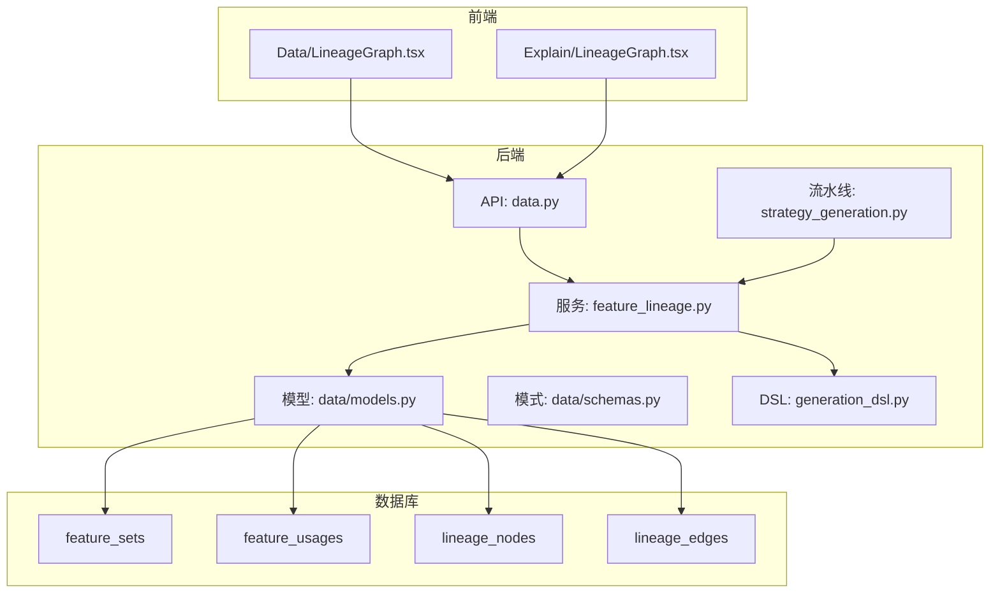
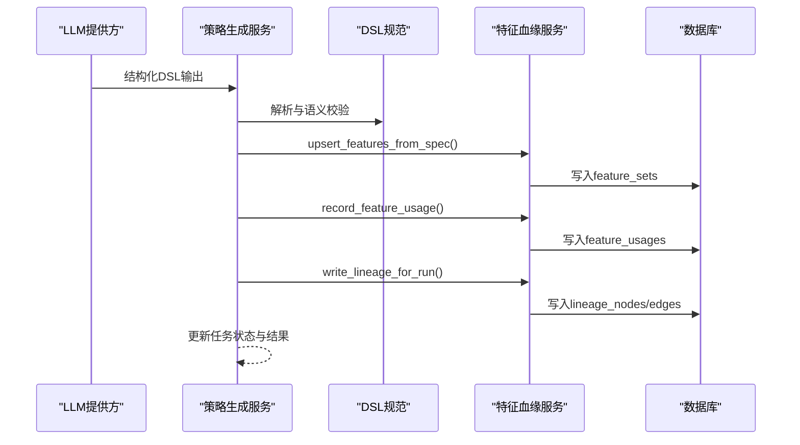
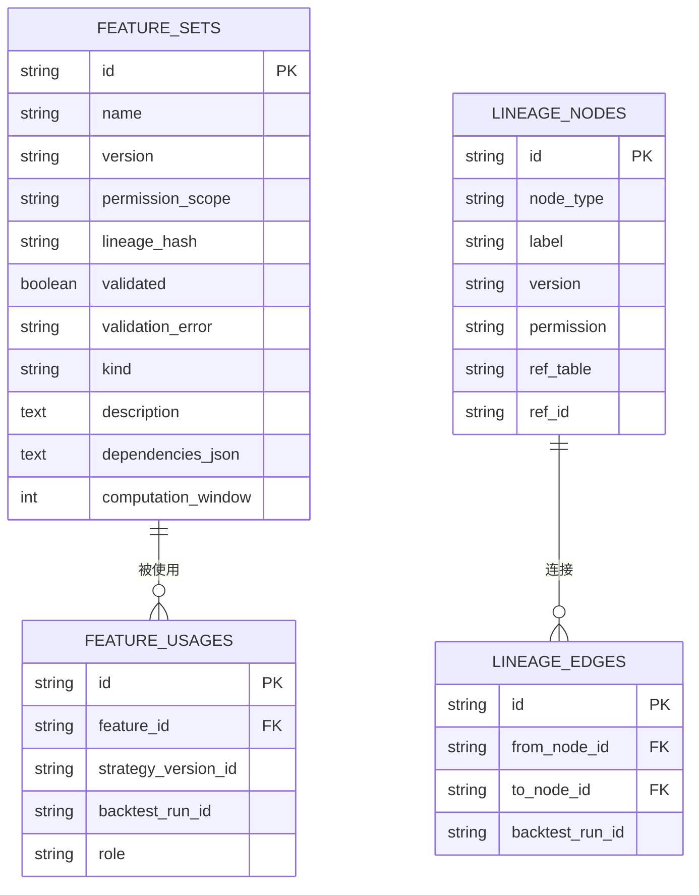
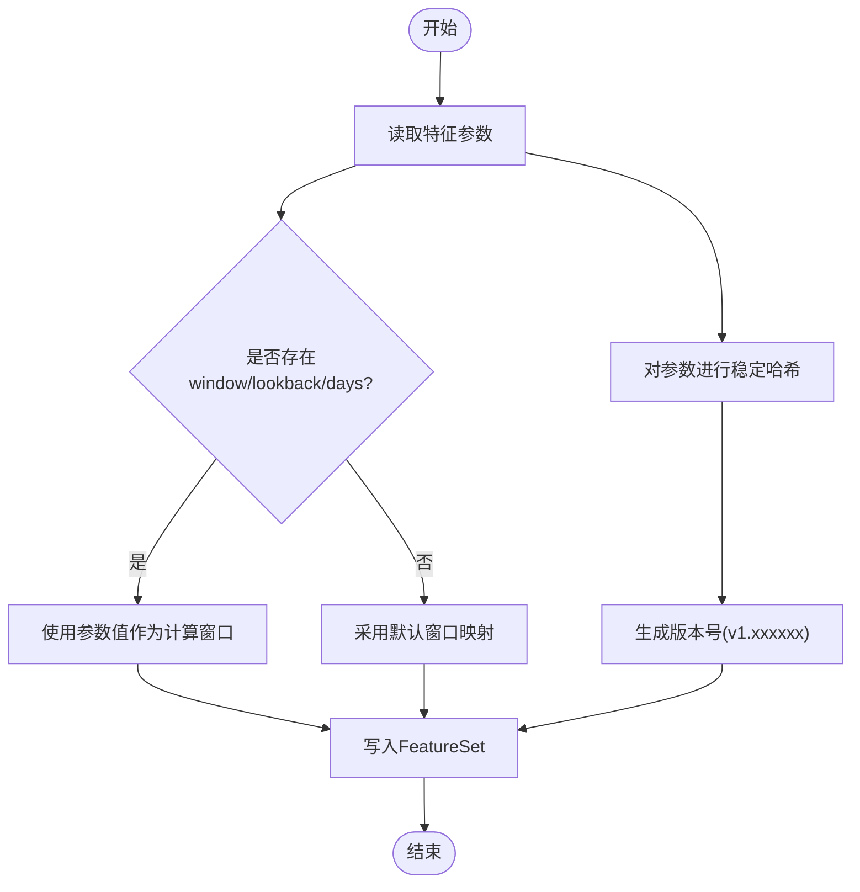
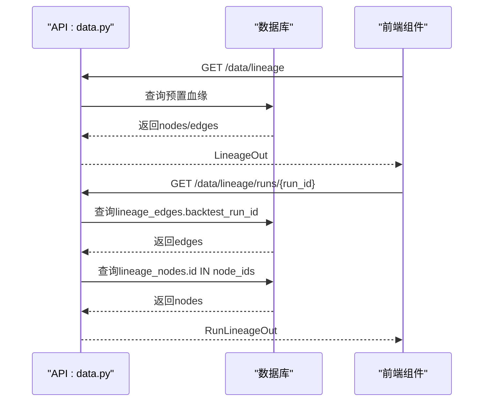
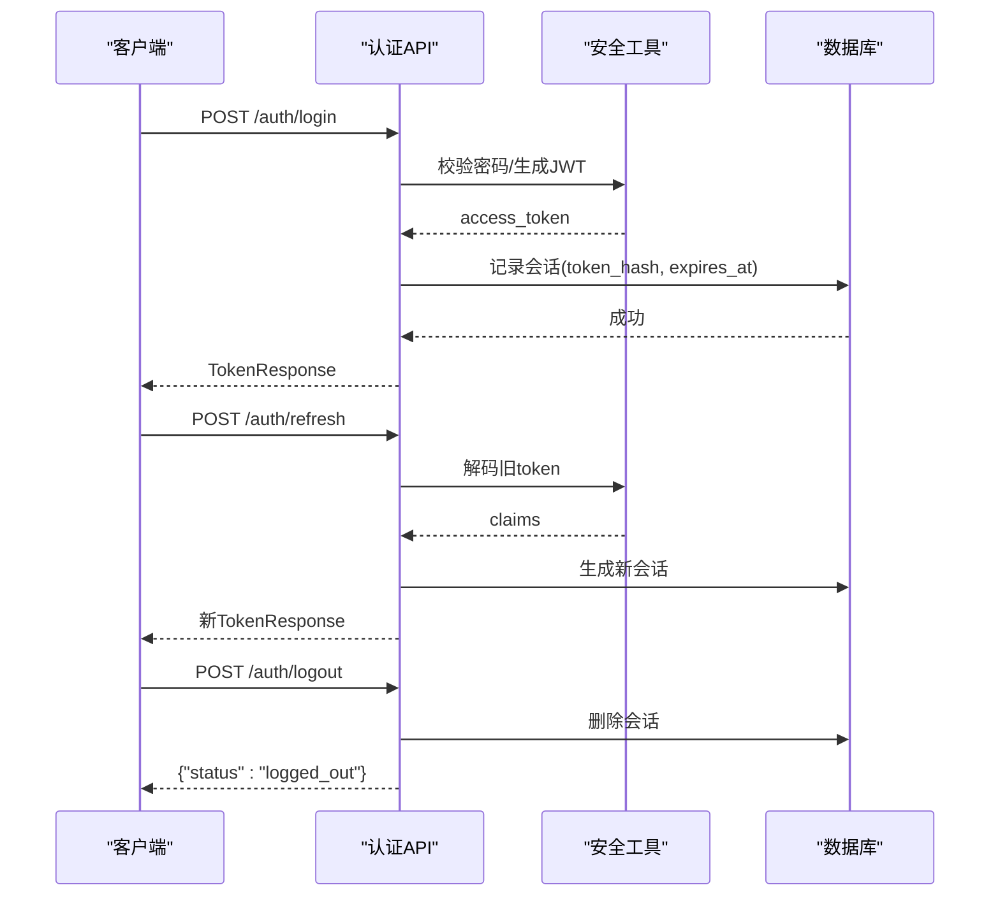
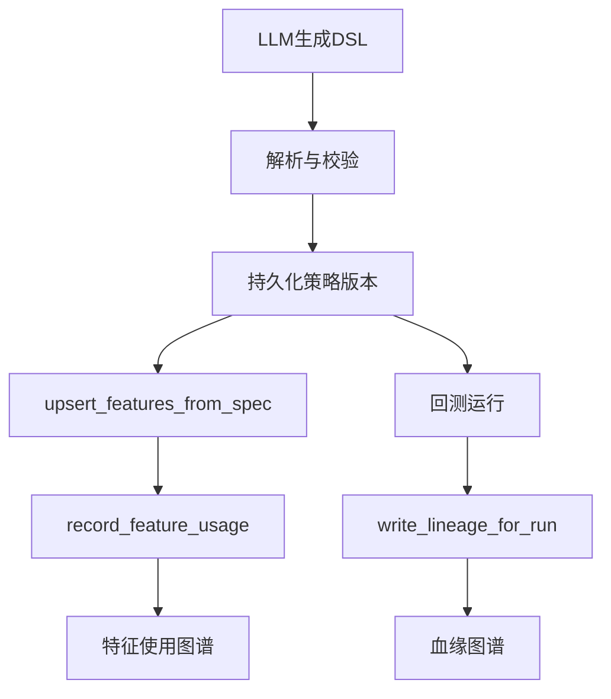
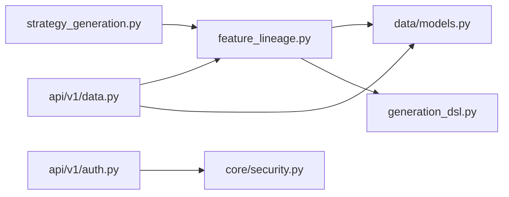

# 特征血缘追踪

<cite>
**本文引用的文件**
- [backend/app/db/migrations/versions/61868637158e_feature_store_and_lineage.py](file://backend/app/db/migrations/versions/61868637158e_feature_store_and_lineage.py)
- [backend/app/services/feature_lineage.py](file://backend/app/services/feature_lineage.py)
- [backend/app/domains/data/models.py](file://backend/app/domains/data/models.py)
- [backend/app/domains/data/schemas.py](file://backend/app/domains/data/schemas.py)
- [backend/app/api/v1/data.py](file://backend/app/api/v1/data.py)
- [backend/app/domains/strategy/generation_dsl.py](file://backend/app/domains/strategy/generation_dsl.py)
- [backend/app/services/strategy_generation.py](file://backend/app/services/strategy_generation.py)
- [frontend/src/screens/Data/LineageGraph.tsx](file://frontend/src/screens/Data/LineageGraph.tsx)
- [frontend/src/screens/Explain/LineageGraph.tsx](file://frontend/src/screens/Explain/LineageGraph.tsx)
- [backend/app/core/security.py](file://backend/app/core/security.py)
- [backend/app/api/v1/auth.py](file://backend/app/api/v1/auth.py)
- [doc/07-后端项目设计说明书.md](file://doc/07-后端项目设计说明书.md)
</cite>

## 目录
1. [简介](#简介)
2. [项目结构](#项目结构)
3. [核心组件](#核心组件)
4. [架构总览](#架构总览)
5. [详细组件分析](#详细组件分析)
6. [依赖分析](#依赖分析)
7. [性能考虑](#性能考虑)
8. [故障排查指南](#故障排查指南)
9. [结论](#结论)
10. [附录](#附录)

## 简介
本技术文档围绕“特征血缘追踪系统”展开，聚焦于特征来源追踪机制、数据血缘关系建模、特征版本管理与权限控制。文档详细说明特征工程流水线中的数据流转、特征依赖关系图谱构建与特征变更追踪算法，并给出具体的血缘查询接口、版本对比功能与权限验证机制，帮助开发者理解量化特征的完整生命周期管理与可追溯性实现。

## 项目结构
特征血缘追踪系统由三层组成：
- 数据层：特征集注册、特征使用关联、血缘节点与边持久化
- 服务层：特征注册与使用记录、血缘图谱写入、版本号派生与窗口推断
- 接口层：数据与特征查询、血缘查询、运行期血缘查询

图表来源
- [backend/app/api/v1/data.py:220-327](file://backend/app/api/v1/data.py#L220-L327)
- [backend/app/services/feature_lineage.py:41-97](file://backend/app/services/feature_lineage.py#L41-L97)
- [backend/app/domains/data/models.py:81-130](file://backend/app/domains/data/models.py#L81-L130)
- [backend/app/domains/strategy/generation_dsl.py:78-96](file://backend/app/domains/strategy/generation_dsl.py#L78-L96)
- [backend/app/services/strategy_generation.py:232-249](file://backend/app/services/strategy_generation.py#L232-L249)

章节来源
- [backend/app/api/v1/data.py:134-346](file://backend/app/api/v1/data.py#L134-L346)
- [backend/app/services/feature_lineage.py:100-194](file://backend/app/services/feature_lineage.py#L100-L194)
- [backend/app/domains/data/models.py:81-130](file://backend/app/domains/data/models.py#L81-L130)

## 核心组件
- 特征存储与使用
  - 特征集注册：名称、版本、类型、描述、依赖参数、计算窗口、权限范围等
  - 特征使用：将特征与策略版本、回测运行进行关联，标注角色（因子/过滤器/信号）
- 血缘图谱
  - 节点：原始数据、清洗后数据、特征集、策略版本、回测运行等
  - 边：按回测运行标识连接节点，形成可追溯的有向无环图
- 血缘查询接口
  - 获取全局血缘图谱
  - 按回测运行 ID 查询对应血缘子图
- 版本管理与变更追踪
  - 特征版本号基于参数哈希稳定派生
  - 计算窗口从参数中提取或采用默认映射
- 权限控制
  - 节点权限字符串用于前端展示与访问控制
  - 认证与会话管理通过 JWT 实现

章节来源
- [backend/app/domains/data/models.py:81-130](file://backend/app/domains/data/models.py#L81-L130)
- [backend/app/services/feature_lineage.py:41-97](file://backend/app/services/feature_lineage.py#L41-L97)
- [backend/app/api/v1/data.py:220-327](file://backend/app/api/v1/data.py#L220-L327)

## 架构总览
特征血缘追踪贯穿策略生成流水线：先生成结构化 DSL，再解析为策略规范，随后写入特征集并记录使用关系，最后在回测运行时构建血缘链路。

图表来源
- [backend/app/services/strategy_generation.py:210-249](file://backend/app/services/strategy_generation.py#L210-L249)
- [backend/app/services/feature_lineage.py:41-97](file://backend/app/services/feature_lineage.py#L41-L97)
- [backend/app/domains/strategy/generation_dsl.py:98-105](file://backend/app/domains/strategy/generation_dsl.py#L98-L105)

## 详细组件分析

### 数据模型与迁移
- 特征集表：包含名称、版本、权限范围、验证状态、依赖参数、计算窗口等
- 特征使用表：将特征与策略版本、回测运行关联，标注角色
- 血缘节点表：记录节点类型、标签、版本、权限、引用表与ID
- 血缘边表：记录父子节点与回测运行ID

图表来源
- [backend/app/db/migrations/versions/61868637158e_feature_store_and_lineage.py:33-92](file://backend/app/db/migrations/versions/61868637158e_feature_store_and_lineage.py#L33-L92)
- [backend/app/domains/data/models.py:81-130](file://backend/app/domains/data/models.py#L81-L130)

章节来源
- [backend/app/db/migrations/versions/61868637158e_feature_store_and_lineage.py:19-112](file://backend/app/db/migrations/versions/61868637158e_feature_store_and_lineage.py#L19-L112)
- [backend/app/domains/data/models.py:81-130](file://backend/app/domains/data/models.py#L81-L130)

### 特征版本管理与变更追踪
- 版本派生：以特征参数字典的稳定哈希作为版本号，确保相同参数产生相同版本
- 计算窗口：优先从参数提取 window/lookback/days，否则采用默认映射
- 变更追踪：同一参数集合产生新记录，便于版本对比与回归定位

图表来源
- [backend/app/services/feature_lineage.py:200-217](file://backend/app/services/feature_lineage.py#L200-L217)
- [backend/app/services/feature_lineage.py:27-38](file://backend/app/services/feature_lineage.py#L27-L38)

章节来源
- [backend/app/services/feature_lineage.py:41-97](file://backend/app/services/feature_lineage.py#L41-L97)
- [backend/app/services/feature_lineage.py:200-217](file://backend/app/services/feature_lineage.py#L200-L217)

### 血缘图谱构建与查询
- 图谱构建：原始数据 → 清洗数据 → 特征集 → 策略版本 → 回测运行，按运行ID写入边
- 运行期查询：按回测运行ID筛选边，聚合节点ID并查询节点信息
- 前端展示：Data/Explain 两个页面分别渲染不同风格的血缘图

图表来源
- [backend/app/api/v1/data.py:220-223](file://backend/app/api/v1/data.py#L220-L223)
- [backend/app/api/v1/data.py:299-327](file://backend/app/api/v1/data.py#L299-L327)
- [frontend/src/screens/Data/LineageGraph.tsx:24-46](file://frontend/src/screens/Data/LineageGraph.tsx#L24-L46)
- [frontend/src/screens/Explain/LineageGraph.tsx:3-42](file://frontend/src/screens/Explain/LineageGraph.tsx#L3-L42)

章节来源
- [backend/app/api/v1/data.py:220-327](file://backend/app/api/v1/data.py#L220-L327)
- [frontend/src/screens/Data/LineageGraph.tsx:24-46](file://frontend/src/screens/Data/LineageGraph.tsx#L24-L46)
- [frontend/src/screens/Explain/LineageGraph.tsx:3-42](file://frontend/src/screens/Explain/LineageGraph.tsx#L3-L42)

### 权限控制与认证
- 权限字段：节点包含权限字符串，前端据此渲染样式与提示
- 认证流程：登录/注册/刷新/登出，使用 JWT 并记录会话
- 会话管理：通过 token 哈希与过期时间维护会话有效性

图表来源
- [backend/app/api/v1/auth.py:47-89](file://backend/app/api/v1/auth.py#L47-L89)
- [backend/app/api/v1/auth.py:134-169](file://backend/app/api/v1/auth.py#L134-L169)
- [backend/app/api/v1/auth.py:172-182](file://backend/app/api/v1/auth.py#L172-L182)
- [backend/app/core/security.py:24-37](file://backend/app/core/security.py#L24-L37)

章节来源
- [backend/app/core/security.py:1-38](file://backend/app/core/security.py#L1-L38)
- [backend/app/api/v1/auth.py:1-194](file://backend/app/api/v1/auth.py#L1-L194)

### 特征工程流水线中的数据流转
- DSL 生成：LLM 输出结构化 DSL，经解析与语义校验
- 版本持久化：生成策略版本快照，供回测引用
- 特征登记：根据 DSL 将因子写入特征集，记录使用关系
- 血缘写入：在回测运行时构建血缘链路，形成可追溯图谱

图表来源
- [backend/app/services/strategy_generation.py:210-249](file://backend/app/services/strategy_generation.py#L210-L249)
- [backend/app/services/feature_lineage.py:41-97](file://backend/app/services/feature_lineage.py#L41-L97)
- [backend/app/services/feature_lineage.py:100-194](file://backend/app/services/feature_lineage.py#L100-L194)

章节来源
- [backend/app/services/strategy_generation.py:132-373](file://backend/app/services/strategy_generation.py#L132-L373)
- [backend/app/domains/strategy/generation_dsl.py:98-105](file://backend/app/domains/strategy/generation_dsl.py#L98-L105)

## 依赖分析
- 组件耦合
  - 策略生成服务依赖特征血缘服务完成特征登记与血缘写入
  - 特征血缘服务依赖数据模型与 DSL 模型
  - API 层依赖服务层与数据模型
- 外部依赖
  - LLM 提供方用于结构化输出
  - WebSocket 用于流水线事件广播
  - JWT 用于认证与权限控制

图表来源
- [backend/app/services/strategy_generation.py:48-52](file://backend/app/services/strategy_generation.py#L48-L52)
- [backend/app/services/feature_lineage.py:18-24](file://backend/app/services/feature_lineage.py#L18-L24)
- [backend/app/api/v1/data.py:9-16](file://backend/app/api/v1/data.py#L9-L16)
- [backend/app/api/v1/auth.py:13-18](file://backend/app/api/v1/auth.py#L13-L18)

章节来源
- [backend/app/services/strategy_generation.py:86-93](file://backend/app/services/strategy_generation.py#L86-L93)
- [backend/app/api/v1/data.py:1-44](file://backend/app/api/v1/data.py#L1-L44)

## 性能考虑
- 查询优化
  - 血缘查询按回测运行ID过滤边，再聚合节点ID查询节点，避免全表扫描
  - 特征使用查询支持按策略版本与回测运行过滤
- 写入优化
  - 批量 flush 后一次性提交，减少事务开销
  - 版本号派生与窗口推断为纯内存计算，成本低
- 前端渲染
  - 按层级分组节点，计算固定布局坐标，提升大图渲染性能

## 故障排查指南
- 血缘查询为空
  - 检查回测运行ID是否正确，确认边表中存在对应记录
  - 确认节点ID集合查询返回非空
- 版本号不一致
  - 核对特征参数字典是否一致（键顺序不影响哈希）
  - 检查默认窗口映射是否符合预期
- 认证失败
  - 校验 JWT 是否过期或签名错误
  - 确认会话记录是否被删除或撤销

章节来源
- [backend/app/api/v1/data.py:299-327](file://backend/app/api/v1/data.py#L299-L327)
- [backend/app/services/feature_lineage.py:200-217](file://backend/app/services/feature_lineage.py#L200-L217)
- [backend/app/api/v1/auth.py:134-182](file://backend/app/api/v1/auth.py#L134-L182)

## 结论
特征血缘追踪系统通过“特征集注册 + 特征使用记录 + 血缘图谱写入”的闭环，实现了从策略生成到回测运行的完整可追溯性。版本管理与权限控制进一步增强了系统的稳定性与安全性。接口层提供了灵活的查询能力，前端组件支持多种可视化方式，满足不同场景下的审计与分析需求。

## 附录

### 血缘查询接口定义
- 获取全局血缘图谱
  - 方法与路径：GET /data/lineage
  - 返回：LineageOut(nodes, edges)
- 按运行查询血缘子图
  - 方法与路径：GET /data/lineage/runs/{run_id}
  - 返回：RunLineageOut(runId, nodes, edges)
- 特征清单
  - 方法与路径：GET /data/features
  - 返回：FeatureOut 列表
- 特征使用清单
  - 方法与路径：GET /data/features/usages
  - 参数：strategy_version_id, backtest_run_id
  - 返回：FeatureUsageOut 列表

章节来源
- [backend/app/api/v1/data.py:220-346](file://backend/app/api/v1/data.py#L220-L346)
- [doc/07-后端项目设计说明书.md:639-651](file://doc/07-后端项目设计说明书.md#L639-L651)