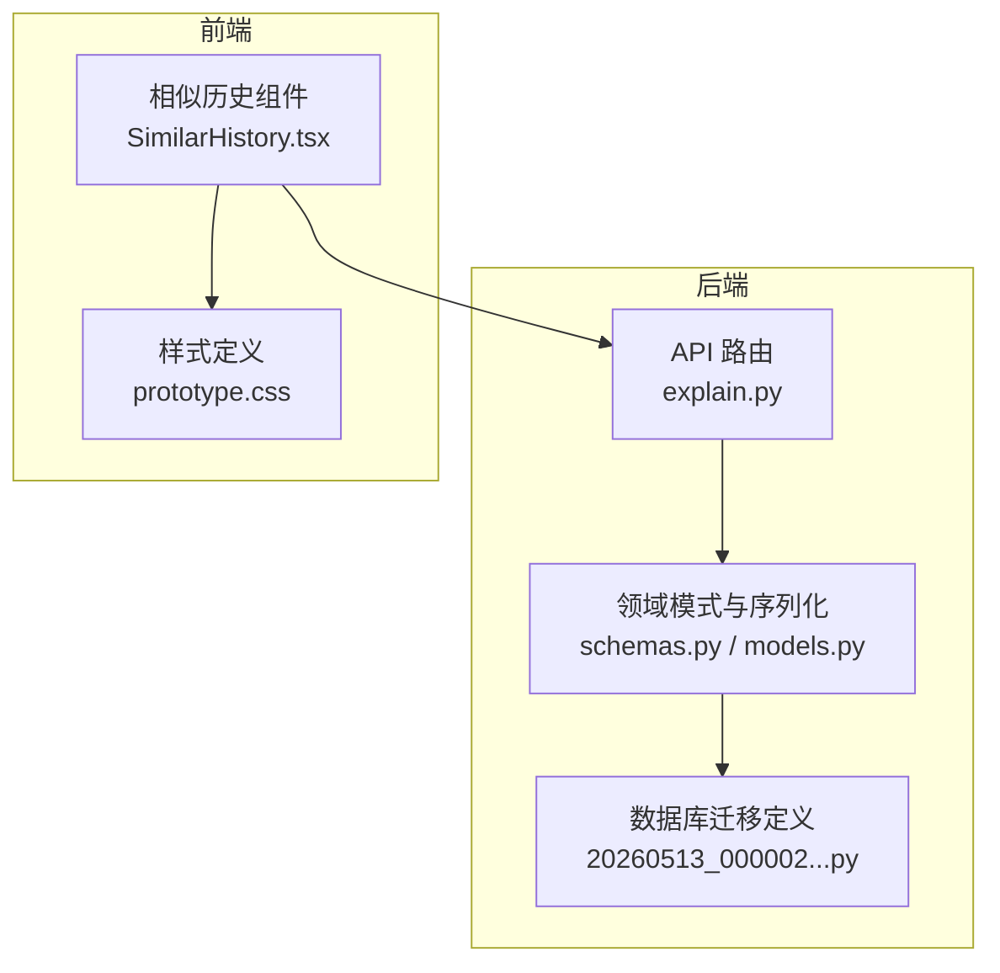
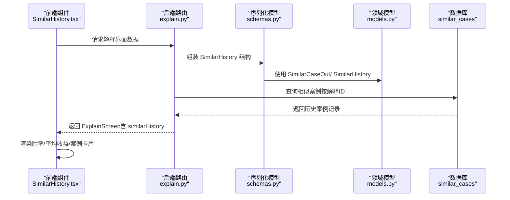
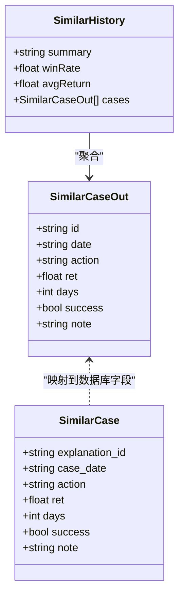
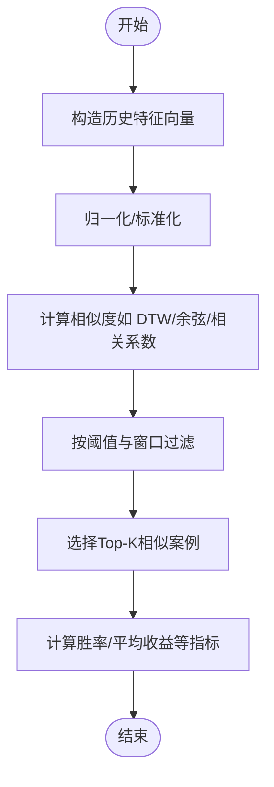
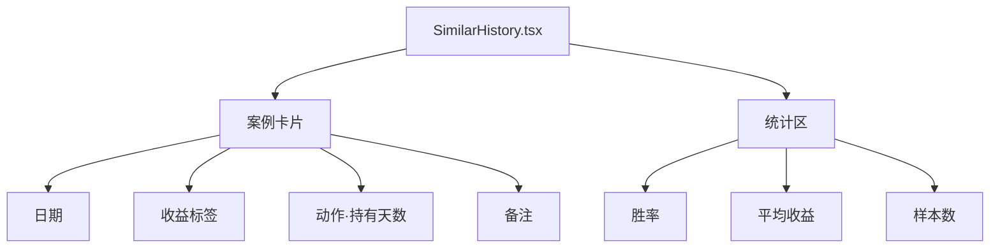
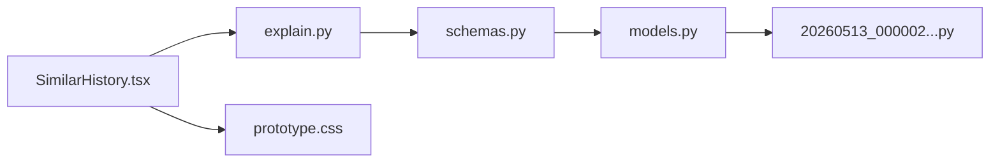

# 相似历史案例

<cite>
**本文引用的文件**
- [explain.py](file://backend/app/api/v1/explain.py)
- [models.py](file://backend/app/domains/explain/models.py)
- [schemas.py](file://backend/app/domains/explain/schemas.py)
- [20260513_000002_security_collaboration_explain.py](file://backend/app/db/migrations/versions/20260513_000002_security_collaboration_explain.py)
- [SimilarHistory.tsx](file://frontend/src/screens/Explain/SimilarHistory.tsx)
- [prototype.css](file://frontend/src/styles/prototype.css)
- [examples.py](file://backend/app/domains/strategy/examples.py)
</cite>

## 目录
1. [简介](#简介)
2. [项目结构](#项目结构)
3. [核心组件](#核心组件)
4. [架构总览](#架构总览)
5. [详细组件分析](#详细组件分析)
6. [依赖分析](#依赖分析)
7. [性能考虑](#性能考虑)
8. [故障排查指南](#故障排查指南)
9. [结论](#结论)
10. [附录](#附录)

## 简介
本文件面向“相似历史案例”系统，围绕历史信号相似度匹配、案例检索机制与回测结果对比分析进行深入说明。内容涵盖时间窗口匹配、市场条件相似度计算思路、历史表现统计分析方法，并提供相似度计算公式、案例筛选逻辑与统计指标汇总，帮助开发者基于历史数据挖掘验证当前信号的可靠性与预期表现。

## 项目结构
相似历史案例功能由后端解释（Explain）域与前端展示组件协同完成：
- 后端负责相似案例的数据模型、接口返回结构与示例数据组织；
- 前端负责相似历史卡片的渲染、统计指标展示与交互样式。

图表来源
- [explain.py:1-110](file://backend/app/api/v1/explain.py#L1-L110)
- [schemas.py:1-93](file://backend/app/domains/explain/schemas.py#L1-L93)
- [models.py:1-87](file://backend/app/domains/explain/models.py#L1-L87)
- [20260513_000002_security_collaboration_explain.py:111-182](file://backend/app/db/migrations/versions/20260513_000002_security_collaboration_explain.py#L111-L182)
- [SimilarHistory.tsx:1-55](file://frontend/src/screens/Explain/SimilarHistory.tsx#L1-L55)
- [prototype.css:4641-4709](file://frontend/src/styles/prototype.css#L4641-L4709)

章节来源
- [explain.py:1-110](file://backend/app/api/v1/explain.py#L1-L110)
- [schemas.py:1-93](file://backend/app/domains/explain/schemas.py#L1-L93)
- [models.py:1-87](file://backend/app/domains/explain/models.py#L1-L87)
- [20260513_000002_security_collaboration_explain.py:111-182](file://backend/app/db/migrations/versions/20260513_000002_security_collaboration_explain.py#L111-L182)
- [SimilarHistory.tsx:1-55](file://frontend/src/screens/Explain/SimilarHistory.tsx#L1-L55)
- [prototype.css:4641-4709](file://frontend/src/styles/prototype.css#L4641-L4709)

## 核心组件
- 相似历史数据结构：后端通过领域模式与Pydantic序列化定义相似案例的字段与聚合统计，包括摘要、胜率、平均收益与案例列表。
- 数据库表结构：迁移脚本定义了相似案例表及索引，支持以解释ID关联历史信号。
- 示例API：后端提供解释界面的示例数据，包含相似历史统计与具体案例条目。
- 前端展示：相似历史组件负责渲染统计指标与案例卡片，样式定义在CSS中。

章节来源
- [schemas.py:78-82](file://backend/app/domains/explain/schemas.py#L78-L82)
- [models.py:75-86](file://backend/app/domains/explain/models.py#L75-L86)
- [20260513_000002_security_collaboration_explain.py:172-181](file://backend/app/db/migrations/versions/20260513_000002_security_collaboration_explain.py#L172-L181)
- [explain.py:85-95](file://backend/app/api/v1/explain.py#L85-L95)
- [SimilarHistory.tsx:3-54](file://frontend/src/screens/Explain/SimilarHistory.tsx#L3-L54)

## 架构总览
相似历史案例的调用链路如下：

图表来源
- [explain.py:98-109](file://backend/app/api/v1/explain.py#L98-L109)
- [schemas.py:78-92](file://backend/app/domains/explain/schemas.py#L78-L92)
- [models.py:75-86](file://backend/app/domains/explain/models.py#L75-L86)
- [20260513_000002_security_collaboration_explain.py:172-181](file://backend/app/db/migrations/versions/20260513_000002_security_collaboration_explain.py#L172-L181)
- [SimilarHistory.tsx:3-54](file://frontend/src/screens/Explain/SimilarHistory.tsx#L3-L54)

## 详细组件分析

### 相似历史数据模型与序列化
- SimilarHistory：包含摘要、胜率、平均收益与案例数组。
- SimilarCaseOut：单个历史案例的日期、动作、收益、持有天数、成功标记与备注。
- 相关数据库字段：日期、动作、目标、结果描述、收益率等。

图表来源
- [schemas.py:78-82](file://backend/app/domains/explain/schemas.py#L78-L82)
- [schemas.py:68-76](file://backend/app/domains/explain/schemas.py#L68-L76)
- [models.py:75-86](file://backend/app/domains/explain/models.py#L75-L86)

章节来源
- [schemas.py:68-82](file://backend/app/domains/explain/schemas.py#L68-L82)
- [models.py:75-86](file://backend/app/domains/explain/models.py#L75-L86)

### 相似度匹配与案例检索机制
- 时间窗口匹配：前端组件通过案例的持有天数字段展示观察期长度，便于对比当前信号的持有周期与历史案例一致。
- 市场条件相似度：当前仓库示例采用静态结构与固定示例数据，未直接暴露具体相似度计算公式与检索算法实现。建议在实际实现中引入以下思路：
  - 特征向量构造：以历史K线窗口内的价格序列、成交量、波动率等作为输入特征。
  - 归一化与标准化：对价格、成交量、技术指标进行归一化处理，减少量纲差异。
  - 相似度度量：采用动态时间规整（DTW）、余弦相似度或皮尔逊相关系数衡量序列相似度。
  - 过滤与阈值：设置相似度阈值与时间窗口约束，过滤不满足条件的历史案例。
- 案例筛选逻辑（建议实现）：
  - 条件匹配：交易标的、信号方向（买入/卖出）、时间窗口前后±N个交易日。
  - 市场环境：行业/板块、流动性、波动率区间等。
  - 回测口径：统一滑点、手续费、涨跌停限制等参数，确保可比性。
- 统计指标汇总：
  - 胜率 = 成功案例数 / 总案例数
  - 平均收益 = 所有案例收益的算术平均
  - 最大连续胜/负、收益分布（分位数）

（本图为概念流程示意，用于指导实现思路）

### 前端展示与交互
- 组件职责：渲染相似历史摘要、胜率、平均收益与案例卡片网格。
- 样式要点：卡片区分胜负态、日期与收益展示、响应式网格布局。

图表来源
- [SimilarHistory.tsx:3-54](file://frontend/src/screens/Explain/SimilarHistory.tsx#L3-L54)
- [prototype.css:4641-4709](file://frontend/src/styles/prototype.css#L4641-L4709)

章节来源
- [SimilarHistory.tsx:3-54](file://frontend/src/screens/Explain/SimilarHistory.tsx#L3-L54)
- [prototype.css:4641-4709](file://frontend/src/styles/prototype.css#L4641-L4709)

### 示例API与数据组织
- 后端提供解释界面的示例数据，包含相似历史统计与案例列表，便于前端联调与演示。
- API路由返回完整的解释屏幕数据结构，其中包含相似历史部分。

章节来源
- [explain.py:85-95](file://backend/app/api/v1/explain.py#L85-L95)
- [explain.py:98-109](file://backend/app/api/v1/explain.py#L98-L109)

## 依赖分析
- 后端依赖关系：API路由依赖序列化模型，序列化模型依赖领域模型，领域模型映射到数据库表。
- 前端依赖关系：组件依赖上下文提供的解释数据，样式独立于业务逻辑。

图表来源
- [explain.py:1-110](file://backend/app/api/v1/explain.py#L1-L110)
- [schemas.py:1-93](file://backend/app/domains/explain/schemas.py#L1-L93)
- [models.py:1-87](file://backend/app/domains/explain/models.py#L1-L87)
- [20260513_000002_security_collaboration_explain.py:111-182](file://backend/app/db/migrations/versions/20260513_000002_security_collaboration_explain.py#L111-L182)
- [SimilarHistory.tsx:1-55](file://frontend/src/screens/Explain/SimilarHistory.tsx#L1-L55)
- [prototype.css:4641-4709](file://frontend/src/styles/prototype.css#L4641-L4709)

章节来源
- [explain.py:1-110](file://backend/app/api/v1/explain.py#L1-L110)
- [schemas.py:1-93](file://backend/app/domains/explain/schemas.py#L1-L93)
- [models.py:1-87](file://backend/app/domains/explain/models.py#L1-L87)
- [20260513_000002_security_collaboration_explain.py:111-182](file://backend/app/db/migrations/versions/20260513_000002_security_collaboration_explain.py#L111-L182)
- [SimilarHistory.tsx:1-55](file://frontend/src/screens/Explain/SimilarHistory.tsx#L1-L55)
- [prototype.css:4641-4709](file://frontend/src/styles/prototype.css#L4641-L4709)

## 性能考虑
- 相似度计算复杂度：若采用全局遍历历史数据并逐条计算相似度，时间复杂度约为O(N×M×L)，其中N为候选历史信号数，M为历史案例数，L为时间窗口长度。建议：
  - 预计算与缓存：对常用特征向量与相似度矩阵进行缓存。
  - 索引优化：在数据库层面按时间、标的、信号方向建立索引。
  - 分页与Top-K：优先返回Top-K最相似案例，避免一次性加载过多数据。
- 前端渲染：卡片数量较多时，采用虚拟滚动或分页展示，降低DOM压力。
- 网络传输：仅传输必要字段，避免冗余数据。

## 故障排查指南
- 数据为空或指标异常
  - 检查数据库相似案例表是否正确创建与索引是否存在。
  - 确认API返回的解释ID与前端请求上下文一致。
- 前端显示异常
  - 检查样式类名与CSS变量是否正确应用。
  - 确认上下文提供的解释数据结构与组件期望一致。
- 相似度计算未生效
  - 若为演示数据，确认示例API是否启用；若为真实实现，检查相似度算法与阈值配置。

章节来源
- [20260513_000002_security_collaboration_explain.py:172-181](file://backend/app/db/migrations/versions/20260513_000002_security_collaboration_explain.py#L172-L181)
- [explain.py:98-109](file://backend/app/api/v1/explain.py#L98-L109)
- [SimilarHistory.tsx:3-54](file://frontend/src/screens/Explain/SimilarHistory.tsx#L3-L54)

## 结论
相似历史案例系统通过“相似度匹配 + 案例检索 + 统计分析”的闭环，为当前信号提供历史参考与预期收益评估。当前仓库提供了清晰的数据结构、示例API与前端展示组件，开发者可在现有基础上扩展相似度计算与检索算法，结合数据库索引与缓存策略，实现高效稳定的相似历史查询能力。

## 附录
- 相关策略示例（用于理解时间窗口与信号生成）：参见策略示例文件中的窗口与动量计算逻辑，有助于理解历史窗口构造与信号生成背景。

章节来源
- [examples.py:218-247](file://backend/app/domains/strategy/examples.py#L218-L247)
- [examples.py:279-306](file://backend/app/domains/strategy/examples.py#L279-L306)