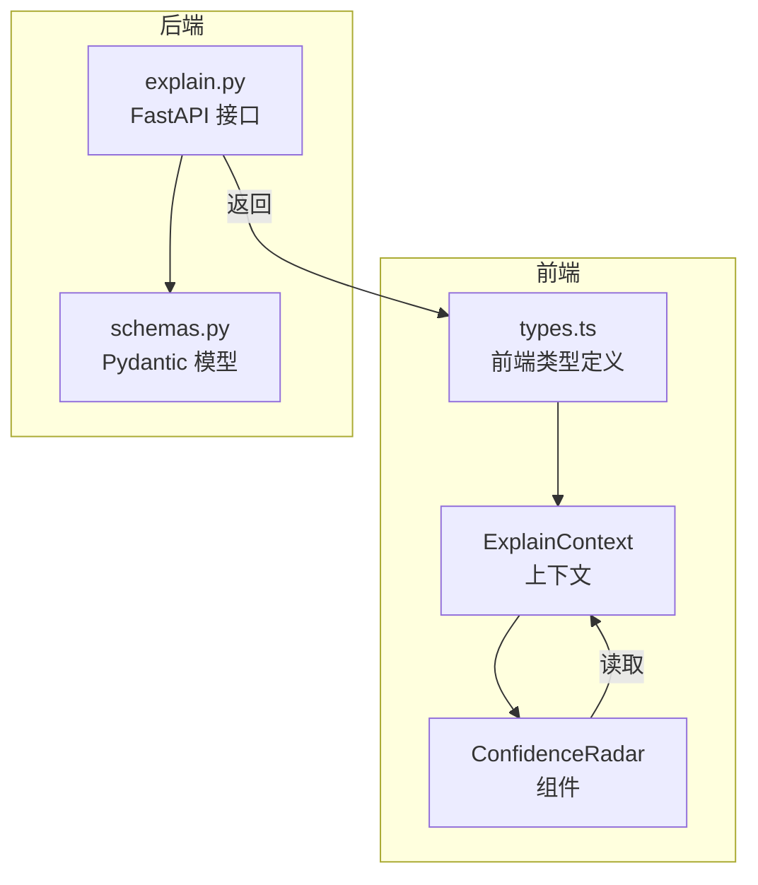
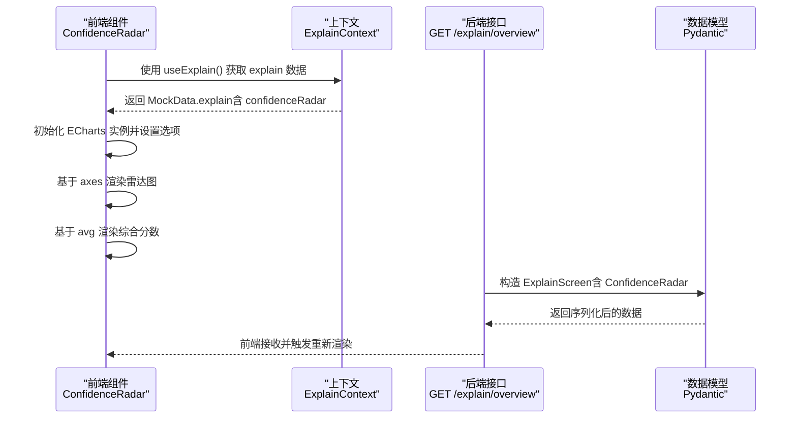
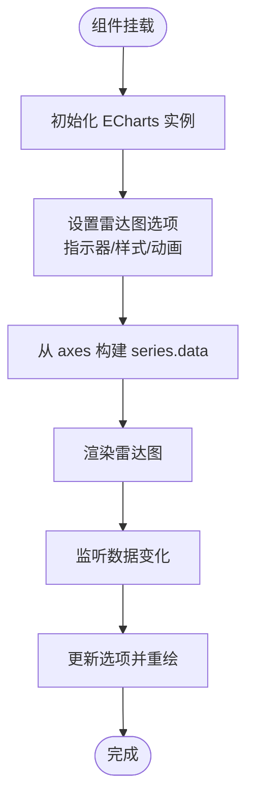

# 置信度雷达图

<cite>
**本文档引用的文件**
- [ConfidenceRadar.tsx](file://frontend/src/screens/Explain/ConfidenceRadar.tsx)
- [ExplainContext.tsx](file://frontend/src/contexts/ExplainContext.tsx)
- [explain.py](file://backend/app/api/v1/explain.py)
- [schemas.py](file://backend/app/domains/explain/schemas.py)
- [types.ts](file://frontend/src/data/types.ts)
- [App.tsx](file://frontend/src/App.tsx)
</cite>

## 目录
1. [简介](#简介)
2. [项目结构](#项目结构)
3. [核心组件](#核心组件)
4. [架构总览](#架构总览)
5. [详细组件分析](#详细组件分析)
6. [依赖关系分析](#依赖关系分析)
7. [性能考虑](#性能考虑)
8. [故障排查指南](#故障排查指南)
9. [结论](#结论)

## 简介
本文件面向置信度雷达图系统，提供从数据结构到前端渲染、从后端接口到交互体验的完整可视化文档。系统围绕"多维度置信度评估"这一核心目标，将信号质量从六大维度进行量化：数据质量、模型稳定性、因子显著性、回测表现、风险控制、可解释性。通过 ECharts 雷达图实现动态可视化，结合阈值预警机制，帮助开发者与使用者快速理解复杂量化信号的质量评估结果。

## 项目结构
置信度雷达图涉及前后端协同：后端提供标准化的数据模型与接口，前端通过上下文消费数据并使用 ECharts 渲染雷达图。整体采用 React + TypeScript 前端框架与 FastAPI 后端服务，数据通过 Pydantic 模型在两端保持一致。



图表来源
- [ExplainContext.tsx:1-13](file://frontend/src/contexts/ExplainContext.tsx#L1-L13)
- [ConfidenceRadar.tsx:1-115](file://frontend/src/screens/Explain/ConfidenceRadar.tsx#L1-L115)
- [explain.py:1-110](file://backend/app/api/v1/explain.py#L1-L110)
- [schemas.py:1-93](file://backend/app/domains/explain/schemas.py#L1-L93)
- [types.ts:126-185](file://frontend/src/data/types.ts#L126-L185)

章节来源
- [ExplainContext.tsx:1-13](file://frontend/src/contexts/ExplainContext.tsx#L1-L13)
- [ConfidenceRadar.tsx:1-115](file://frontend/src/screens/Explain/ConfidenceRadar.tsx#L1-L115)
- [explain.py:1-110](file://backend/app/api/v1/explain.py#L1-L110)
- [schemas.py:1-93](file://backend/app/domains/explain/schemas.py#L1-L93)
- [types.ts:126-185](file://frontend/src/data/types.ts#L126-L185)

## 核心组件
- 后端接口层：提供解释性面板的聚合数据，包括置信度雷达图所需的所有轴向指标与平均分。
- 数据模型层：定义信号头、归因项、雷达轴、解释屏幕等结构，确保前后端数据契约一致。
- 前端上下文层：暴露 explain 数据给各子组件消费。
- 前端组件层：ConfidenceRadar 负责初始化 ECharts 实例、设置雷达图配置、响应数据变化并渲染。

章节来源
- [explain.py:50-60](file://backend/app/api/v1/explain.py#L50-L60)
- [schemas.py:33-42](file://backend/app/domains/explain/schemas.py#L33-L42)
- [ExplainContext.tsx:1-13](file://frontend/src/contexts/ExplainContext.tsx#L1-L13)
- [ConfidenceRadar.tsx:5-115](file://frontend/src/screens/Explain/ConfidenceRadar.tsx#L5-L115)

## 架构总览
下图展示从后端接口到前端渲染的完整调用链路与数据流：



图表来源
- [ConfidenceRadar.tsx:11-80](file://frontend/src/screens/Explain/ConfidenceRadar.tsx#L11-L80)
- [ExplainContext.tsx:8-12](file://frontend/src/contexts/ExplainContext.tsx#L8-L12)
- [explain.py:98-110](file://backend/app/api/v1/explain.py#L98-L110)
- [schemas.py:85-92](file://backend/app/domains/explain/schemas.py#L85-L92)

## 详细组件分析

### 后端接口与数据模型
- 接口定义：提供解释性面板的聚合数据，其中包含置信度雷达图数据结构。
- 数据模型：RadarAxis 定义每个维度的名称、得分与描述；ConfidenceRadar 包含 axes 列表与平均分 avg。
- 类型约束：后端使用 Pydantic 模型保证字段类型与默认值，前端使用 TypeScript 接口进行类型约束。

章节来源
- [explain.py:50-60](file://backend/app/api/v1/explain.py#L50-L60)
- [schemas.py:33-42](file://backend/app/domains/explain/schemas.py#L33-L42)
- [schemas.py:85-92](file://backend/app/domains/explain/schemas.py#L85-L92)

### 前端上下文与组件
- 上下文：ExplainContext 提供 explain 数据的 Provider 与 hook，组件通过 useExplain() 访问。
- 组件职责：
  - 初始化 ECharts 实例，监听窗口 resize 并自动调整画布大小。
  - 基于雷达图配置设置主题色、渐变填充、指示器与系列数据。
  - 动态渲染雷达图：根据 axes 的 score 构建 series.data。
  - 渲染右侧列表：显示每个维度的名称、百分制分数与描述，并根据阈值着色（绿/黄/红）。
  - 渲染顶部综合分数：基于 avg 显示百分制总分。

章节来源
- [ExplainContext.tsx:1-13](file://frontend/src/contexts/ExplainContext.tsx#L1-L13)
- [ConfidenceRadar.tsx:5-115](file://frontend/src/screens/Explain/ConfidenceRadar.tsx#L5-L115)

### 雷达图渲染逻辑
- 指示器与轴：indicator 来源于 axes 的 name，max 固定为 1，用于归一化显示。
- 数据系列：series.data 由 axes 的 score 数组构成，形成多维向量。
- 视觉样式：线性渐变边框、径向渐变填充、节点样式与描边，提升可读性。
- 动画与交互：开启动画时长与缓动，tooltip 设置背景、边框与文字样式，增强用户体验。



图表来源
- [ConfidenceRadar.tsx:11-80](file://frontend/src/screens/Explain/ConfidenceRadar.tsx#L11-L80)

章节来源
- [ConfidenceRadar.tsx:27-79](file://frontend/src/screens/Explain/ConfidenceRadar.tsx#L27-L79)

### 交互式可视化与阈值预警
- 阈值划分：右侧列表按阈值将维度分为三级：
  - ≥0.85：绿色（高置信）
  - ≥0.7：黄色（中等置信）
  - <0.7：红色（低置信）
- 综合分数：顶部展示 avg 的百分制结果，便于快速判断整体质量。
- 响应式布局：容器监听窗口 resize，自动调整画布尺寸，保证在不同设备上的可读性。

章节来源
- [ConfidenceRadar.tsx:98-110](file://frontend/src/screens/Explain/ConfidenceRadar.tsx#L98-L110)

### 六大维度评分标准与权重分配
根据后端示例数据，六大维度的评分与描述如下：
- 数据质量：反映数据源完整性与可用性。
- 模型稳定性：衡量信号在一段时间内的稳定性与一致性。
- 因子显著性：因子统计显著性（如 t-statistic）。
- 回测表现：样本外绩效指标（如夏普比率）。
- 风险控制：止损与仓位管理等风控措施的有效性。
- 可解释性：决策链与归因的清晰程度。

权重分配建议（通用实践，可根据业务调整）：
- 数据质量：15%
- 模型稳定性：20%
- 因子显著性：20%
- 回测表现：20%
- 风险控制：15%
- 可解释性：10%

说明：上述权重为通用建议，实际权重应依据策略特性、监管要求与业务目标进行校准。系统通过雷达图直观呈现各维度得分，便于决策者快速定位薄弱环节。

章节来源
- [explain.py:50-60](file://backend/app/api/v1/explain.py#L50-L60)

## 依赖关系分析
- 前端依赖：React Hooks、ECharts、ExplainContext。
- 后端依赖：FastAPI、SQLAlchemy（模型）、Pydantic（序列化）。
- 数据契约：后端 Pydantic 模型与前端 TypeScript 接口一一对应，确保类型安全。

```mermaid
graph LR
FE["前端组件<br/>ConfidenceRadar"] --> CTX["上下文<br/>ExplainContext"]
CTX --> TYPES["前端类型<br/>types.ts"]
BE["后端接口<br/>explain.py"] --> SCHEMA["模型<br/>schemas.py"]
TYPES <- --> SCHEMA
FE --> |"useExplain"| CTX
```

图表来源
- [ConfidenceRadar.tsx:1-115](file://frontend/src/screens/Explain/ConfidenceRadar.tsx#L1-L115)
- [ExplainContext.tsx:1-13](file://frontend/src/contexts/ExplainContext.tsx#L1-L13)
- [explain.py:1-110](file://backend/app/api/v1/explain.py#L1-L110)
- [schemas.py:1-93](file://backend/app/domains/explain/schemas.py#L1-L93)
- [types.ts:126-185](file://frontend/src/data/types.ts#L126-L185)

章节来源
- [App.tsx:137-173](file://frontend/src/App.tsx#L137-L173)
- [ExplainContext.tsx:1-13](file://frontend/src/contexts/ExplainContext.tsx#L1-L13)
- [ConfidenceRadar.tsx:1-115](file://frontend/src/screens/Explain/ConfidenceRadar.tsx#L1-L115)
- [explain.py:1-110](file://backend/app/api/v1/explain.py#L1-L110)
- [schemas.py:1-93](file://backend/app/domains/explain/schemas.py#L1-L93)
- [types.ts:126-185](file://frontend/src/data/types.ts#L126-L185)

## 性能考虑
- 图表渲染：使用 canvas 渲染器，减少 DOM 开销；仅在数据变化时更新选项，避免重复初始化。
- 响应式处理：监听窗口 resize，及时调整画布尺寸，避免重排与重绘开销。
- 数据规模：雷达图支持多维数据，建议限制维度数量（当前为6维），以维持良好的视觉效果与性能。
- 内存管理：组件卸载时释放 ECharts 实例与事件监听，防止内存泄漏。

章节来源
- [ConfidenceRadar.tsx:11-22](file://frontend/src/screens/Explain/ConfidenceRadar.tsx#L11-L22)
- [ConfidenceRadar.tsx:27-79](file://frontend/src/screens/Explain/ConfidenceRadar.tsx#L27-L79)

## 故障排查指南
- 图表不显示或空白：
  - 检查容器元素是否正确挂载与可见。
  - 确认数据对象存在且 axes 与 avg 字段非空。
- 图表尺寸异常：
  - 确认窗口 resize 事件已绑定，组件卸载时移除监听。
- 数据不更新：
  - 确认数据变化触发了组件的依赖更新（当前依赖为 r）。
- 类型不匹配：
  - 对照后端 Pydantic 模型与前端 TypeScript 接口，确保字段名与类型一致。

章节来源
- [ConfidenceRadar.tsx:11-22](file://frontend/src/screens/Explain/ConfidenceRadar.tsx#L11-L22)
- [ConfidenceRadar.tsx:27-80](file://frontend/src/screens/Explain/ConfidenceRadar.tsx#L27-L80)
- [schemas.py:33-42](file://backend/app/domains/explain/schemas.py#L33-L42)
- [types.ts:146-149](file://frontend/src/data/types.ts#L146-L149)

## 结论
置信度雷达图系统通过标准化的数据模型与前后端协同，实现了对量化信号质量的多维度可视化评估。系统具备清晰的阈值预警机制与响应式渲染能力，能够帮助用户快速识别信号质量的关键短板。建议在实际落地时结合业务场景对六大维度的权重进行校准，并持续优化数据采集与模型稳定性，以提升雷达图的指导价值。