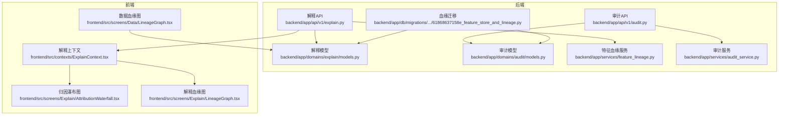
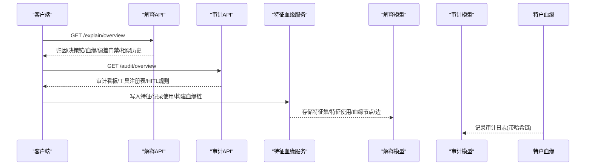
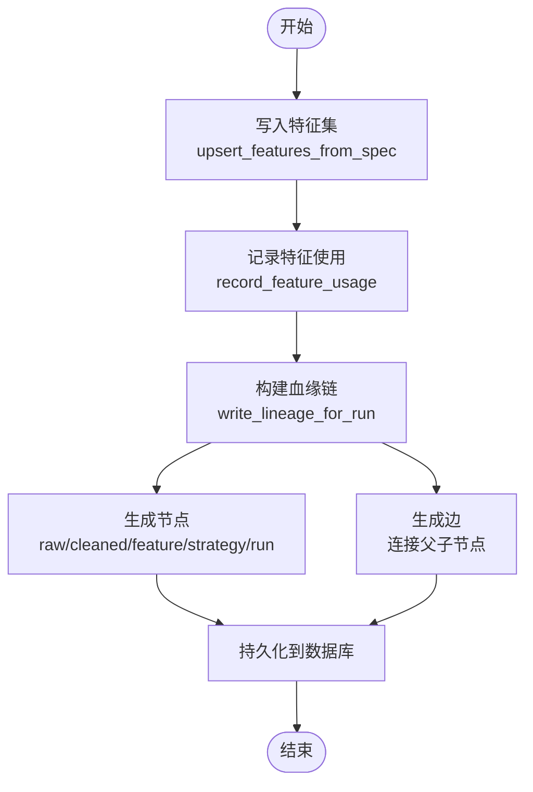
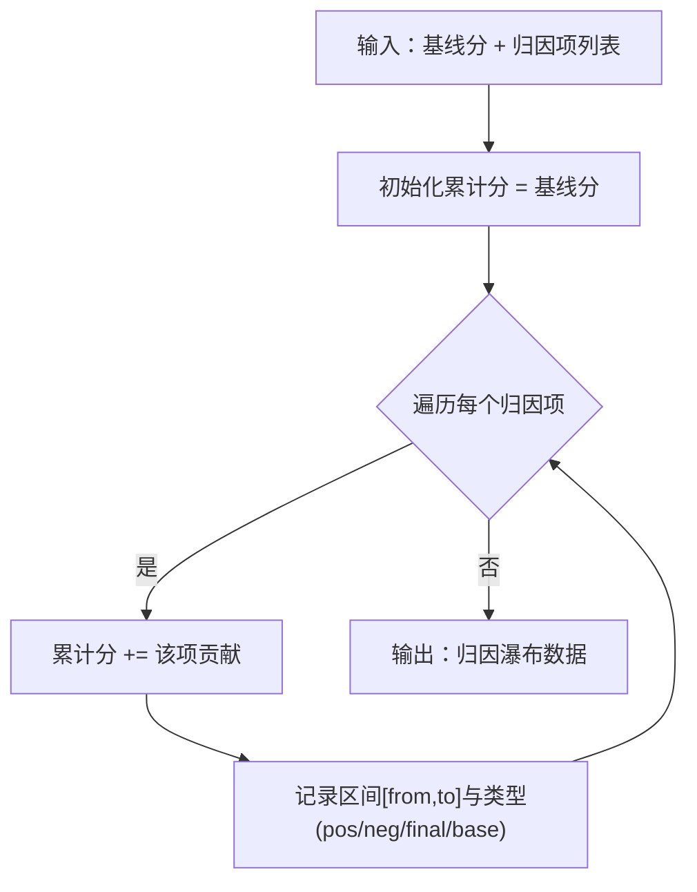
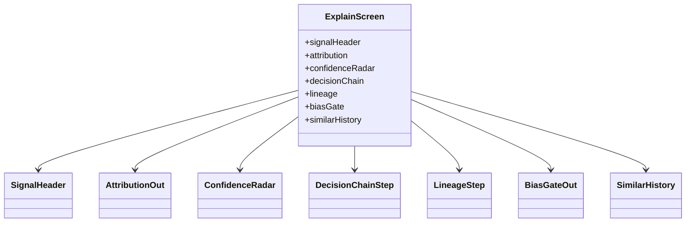
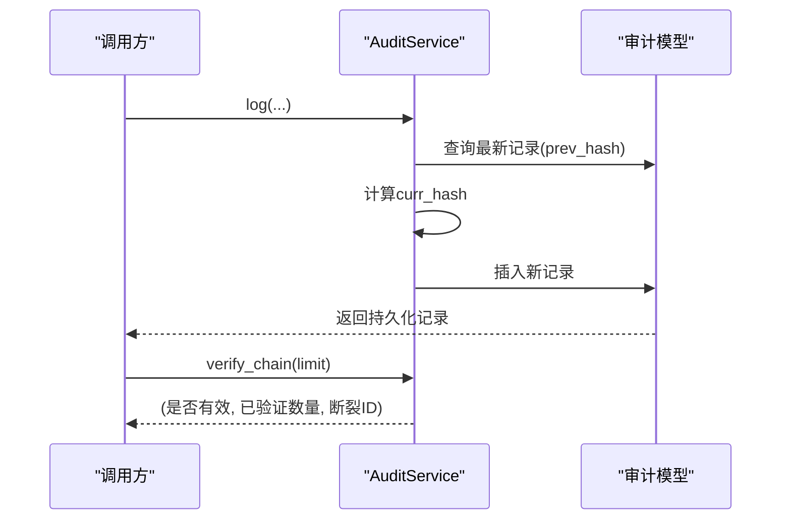
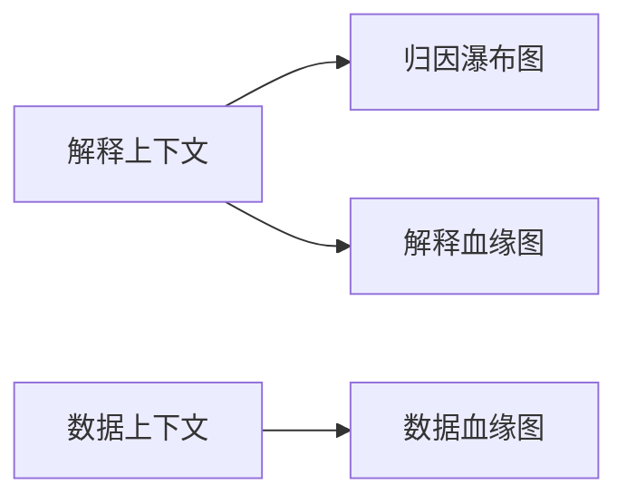
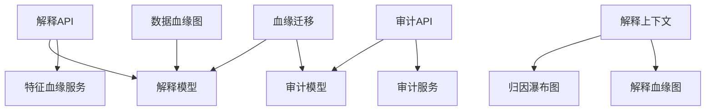

# 解释与血缘追踪

<cite>
**本文档引用的文件**
- [backend/app/api/v1/explain.py](file://backend/app/api/v1/explain.py)
- [backend/app/domains/explain/models.py](file://backend/app/domains/explain/models.py)
- [backend/app/domains/explain/schemas.py](file://backend/app/domains/explain/schemas.py)
- [backend/app/services/feature_lineage.py](file://backend/app/services/feature_lineage.py)
- [backend/app/db/migrations/versions/61868637158e_feature_store_and_lineage.py](file://backend/app/db/migrations/versions/61868637158e_feature_store_and_lineage.py)
- [backend/app/api/v1/audit.py](file://backend/app/api/v1/audit.py)
- [backend/app/domains/audit/models.py](file://backend/app/domains/audit/models.py)
- [backend/app/domains/audit/schemas.py](file://backend/app/domains/audit/schemas.py)
- [backend/app/services/audit_service.py](file://backend/app/services/audit_service.py)
- [frontend/src/contexts/ExplainContext.tsx](file://frontend/src/contexts/ExplainContext.tsx)
- [frontend/src/screens/Explain/AttributionWaterfall.tsx](file://frontend/src/screens/Explain/AttributionWaterfall.tsx)
- [frontend/src/screens/Explain/LineageGraph.tsx](file://frontend/src/screens/Explain/LineageGraph.tsx)
- [frontend/src/screens/Data/LineageGraph.tsx](file://frontend/src/screens/Data/LineageGraph.tsx)
</cite>

## 目录
1. [引言](#引言)
2. [项目结构](#项目结构)
3. [核心组件](#核心组件)
4. [架构概览](#架构概览)
5. [详细组件分析](#详细组件分析)
6. [依赖关系分析](#依赖关系分析)
7. [性能考虑](#性能考虑)
8. [故障排查指南](#故障排查指南)
9. [结论](#结论)

## 引言
本文件面向量化策略研发与合规团队，系统化阐述解释与血缘追踪体系：包括特征血缘追踪机制、信号归因分析算法、可解释性报告生成以及审计日志系统。文档覆盖特征来源追踪、信号生成过程可视化、风险因子分解与合规性报告，并提供可视化组件与审计流程的技术实现说明，帮助开发者快速理解并应用可解释性与透明度能力。

## 项目结构
解释与血缘追踪功能由“后端API + 数据模型 + 前端可视化”三层构成：
- 后端API层：提供解释与审计接口，返回统一的前端数据结构
- 数据层：定义解释与审计相关的数据库模型及迁移脚本
- 前端层：提供归因瀑布图、血缘图等可视化组件

**图表来源**
- [backend/app/api/v1/explain.py:1-110](file://backend/app/api/v1/explain.py#L1-L110)
- [backend/app/api/v1/audit.py:1-258](file://backend/app/api/v1/audit.py#L1-L258)
- [backend/app/domains/explain/models.py:1-87](file://backend/app/domains/explain/models.py#L1-L87)
- [backend/app/domains/audit/models.py:1-51](file://backend/app/domains/audit/models.py#L1-L51)
- [backend/app/db/migrations/versions/61868637158e_feature_store_and_lineage.py:1-112](file://backend/app/db/migrations/versions/61868637158e_feature_store_and_lineage.py#L1-L112)
- [backend/app/services/feature_lineage.py:1-217](file://backend/app/services/feature_lineage.py#L1-L217)
- [backend/app/services/audit_service.py:1-109](file://backend/app/services/audit_service.py#L1-L109)
- [frontend/src/contexts/ExplainContext.tsx:1-13](file://frontend/src/contexts/ExplainContext.tsx#L1-L13)
- [frontend/src/screens/Explain/AttributionWaterfall.tsx:1-87](file://frontend/src/screens/Explain/AttributionWaterfall.tsx#L1-L87)
- [frontend/src/screens/Explain/LineageGraph.tsx:1-43](file://frontend/src/screens/Explain/LineageGraph.tsx#L1-L43)
- [frontend/src/screens/Data/LineageGraph.tsx:1-138](file://frontend/src/screens/Data/LineageGraph.tsx#L1-L138)

**章节来源**
- [backend/app/api/v1/explain.py:1-110](file://backend/app/api/v1/explain.py#L1-L110)
- [backend/app/api/v1/audit.py:1-258](file://backend/app/api/v1/audit.py#L1-L258)
- [backend/app/domains/explain/models.py:1-87](file://backend/app/domains/explain/models.py#L1-L87)
- [backend/app/domains/audit/models.py:1-51](file://backend/app/domains/audit/models.py#L1-L51)
- [backend/app/db/migrations/versions/61868637158e_feature_store_and_lineage.py:1-112](file://backend/app/db/migrations/versions/61868637158e_feature_store_and_lineage.py#L1-L112)
- [backend/app/services/feature_lineage.py:1-217](file://backend/app/services/feature_lineage.py#L1-L217)
- [backend/app/services/audit_service.py:1-109](file://backend/app/services/audit_service.py#L1-L109)
- [frontend/src/contexts/ExplainContext.tsx:1-13](file://frontend/src/contexts/ExplainContext.tsx#L1-L13)
- [frontend/src/screens/Explain/AttributionWaterfall.tsx:1-87](file://frontend/src/screens/Explain/AttributionWaterfall.tsx#L1-L87)
- [frontend/src/screens/Explain/LineageGraph.tsx:1-43](file://frontend/src/screens/Explain/LineageGraph.tsx#L1-L43)
- [frontend/src/screens/Data/LineageGraph.tsx:1-138](file://frontend/src/screens/Data/LineageGraph.tsx#L1-L138)

## 核心组件
- 解释API：提供信号解释总览接口，返回归因、决策链、血缘、偏差门禁、相似历史等数据
- 审计API：提供审计看板、日志列表、工具注册表、HITL规则、哈希链校验与导出
- 特征血缘服务：负责特征集写入、特征使用记录、回测运行的血缘链路构建
- 解释与审计模型：定义信号解释、归因项、决策步骤、血缘记录、偏差门禁、相似案例、审计日志等持久化结构
- 前端可视化：归因瀑布图、解释血缘图、数据血缘图等组件

**章节来源**
- [backend/app/api/v1/explain.py:98-110](file://backend/app/api/v1/explain.py#L98-L110)
- [backend/app/api/v1/audit.py:153-168](file://backend/app/api/v1/audit.py#L153-L168)
- [backend/app/services/feature_lineage.py:41-194](file://backend/app/services/feature_lineage.py#L41-L194)
- [backend/app/domains/explain/models.py:9-87](file://backend/app/domains/explain/models.py#L9-L87)
- [backend/app/domains/audit/models.py:9-51](file://backend/app/domains/audit/models.py#L9-L51)
- [frontend/src/screens/Explain/AttributionWaterfall.tsx:1-87](file://frontend/src/screens/Explain/AttributionWaterfall.tsx#L1-L87)
- [frontend/src/screens/Explain/LineageGraph.tsx:1-43](file://frontend/src/screens/Explain/LineageGraph.tsx#L1-L43)
- [frontend/src/screens/Data/LineageGraph.tsx:1-138](file://frontend/src/screens/Data/LineageGraph.tsx#L1-L138)

## 架构概览
解释与血缘追踪贯穿“策略生成 → 特征工程 → 回测运行 → 信号生成 → 风控审查”的全流程，形成可追溯的数据血缘链；同时提供信号归因与决策链可视化，支撑可解释性与合规审计。

**图表来源**
- [backend/app/api/v1/explain.py:98-110](file://backend/app/api/v1/explain.py#L98-L110)
- [backend/app/api/v1/audit.py:153-168](file://backend/app/api/v1/audit.py#L153-L168)
- [backend/app/services/feature_lineage.py:100-194](file://backend/app/services/feature_lineage.py#L100-L194)
- [backend/app/domains/explain/models.py:9-87](file://backend/app/domains/explain/models.py#L9-L87)
- [backend/app/domains/audit/models.py:9-51](file://backend/app/domains/audit/models.py#L9-L51)

## 详细组件分析

### 特征血缘追踪机制
- 功能目标：在策略生成与回测运行期间，建立从原始市场数据到特征、策略版本、回测运行的完整血缘链
- 关键流程：
  - 将策略DSL中的因子写入特征集（去重、版本化）
  - 记录特征使用关系（关联策略版本与回测运行）
  - 构建血缘节点与边：raw → cleaned → feature(s) → strategy → run
  - 统一权限与版本标注，支持可视化展示

**图表来源**
- [backend/app/services/feature_lineage.py:41-194](file://backend/app/services/feature_lineage.py#L41-L194)
- [backend/app/db/migrations/versions/61868637158e_feature_store_and_lineage.py:33-93](file://backend/app/db/migrations/versions/61868637158e_feature_store_and_lineage.py#L33-L93)

**章节来源**
- [backend/app/services/feature_lineage.py:41-194](file://backend/app/services/feature_lineage.py#L41-L194)
- [backend/app/db/migrations/versions/61868637158e_feature_store_and_lineage.py:33-93](file://backend/app/db/migrations/versions/61868637158e_feature_store_and_lineage.py#L33-L93)

### 信号归因分析算法
- 数据结构：归因包含基线分、归因项列表、最终分与决策
- 算法思路：以基线分为起点，按顺序累加各因子贡献，形成“基线 → 因子贡献 → 最终决策”的瀑布图
- 可视化要点：正负贡献分别渲染，显示累计值与描述信息

**图表来源**
- [frontend/src/screens/Explain/AttributionWaterfall.tsx:8-27](file://frontend/src/screens/Explain/AttributionWaterfall.tsx#L8-L27)
- [backend/app/domains/explain/schemas.py:19-31](file://backend/app/domains/explain/schemas.py#L19-L31)

**章节来源**
- [frontend/src/screens/Explain/AttributionWaterfall.tsx:1-87](file://frontend/src/screens/Explain/AttributionWaterfall.tsx#L1-L87)
- [backend/app/domains/explain/schemas.py:19-31](file://backend/app/domains/explain/schemas.py#L19-L31)

### 可解释性报告生成
- 报告维度：信号头、归因瀑布、置信度雷达、决策链、血缘链、偏差门禁、相似历史
- 生成流程：后端API组装各模块数据，前端组件按需渲染
- 用途：辅助策略评审、人工审批、合规审计与风险提示

**图表来源**
- [backend/app/domains/explain/schemas.py:85-93](file://backend/app/domains/explain/schemas.py#L85-L93)
- [backend/app/api/v1/explain.py:98-110](file://backend/app/api/v1/explain.py#L98-L110)

**章节来源**
- [backend/app/domains/explain/schemas.py:1-93](file://backend/app/domains/explain/schemas.py#L1-L93)
- [backend/app/api/v1/explain.py:98-110](file://backend/app/api/v1/explain.py#L98-L110)

### 审计日志系统
- 设计目标：不可篡改的审计轨迹，支持哈希链完整性校验、导出与工具注册表管理
- 关键能力：
  - 追加式写入，每条记录携带前一条curr_hash
  - 提供哈希链校验接口，定位断裂点
  - 支持CSV导出、分页查询、按角色/动作过滤
  - 工具注册表与HITL规则动态展示

**图表来源**
- [backend/app/services/audit_service.py:32-109](file://backend/app/services/audit_service.py#L32-L109)
- [backend/app/domains/audit/models.py:9-51](file://backend/app/domains/audit/models.py#L9-L51)
- [backend/app/api/v1/audit.py:198-213](file://backend/app/api/v1/audit.py#L198-L213)

**章节来源**
- [backend/app/services/audit_service.py:1-109](file://backend/app/services/audit_service.py#L1-L109)
- [backend/app/domains/audit/models.py:1-51](file://backend/app/domains/audit/models.py#L1-L51)
- [backend/app/api/v1/audit.py:1-258](file://backend/app/api/v1/audit.py#L1-L258)

### 前端可视化组件
- 归因瀑布图：按贡献正负渲染区间，显示累计得分与描述
- 解释血缘图：展示从原始数据到信号执行的权限与版本信息
- 数据血缘图：按层级布局节点，连接边形成流程图

**图表来源**
- [frontend/src/contexts/ExplainContext.tsx:1-13](file://frontend/src/contexts/ExplainContext.tsx#L1-L13)
- [frontend/src/screens/Explain/AttributionWaterfall.tsx:1-87](file://frontend/src/screens/Explain/AttributionWaterfall.tsx#L1-L87)
- [frontend/src/screens/Explain/LineageGraph.tsx:1-43](file://frontend/src/screens/Explain/LineageGraph.tsx#L1-L43)
- [frontend/src/screens/Data/LineageGraph.tsx:1-138](file://frontend/src/screens/Data/LineageGraph.tsx#L1-L138)

**章节来源**
- [frontend/src/contexts/ExplainContext.tsx:1-13](file://frontend/src/contexts/ExplainContext.tsx#L1-L13)
- [frontend/src/screens/Explain/AttributionWaterfall.tsx:1-87](file://frontend/src/screens/Explain/AttributionWaterfall.tsx#L1-L87)
- [frontend/src/screens/Explain/LineageGraph.tsx:1-43](file://frontend/src/screens/Explain/LineageGraph.tsx#L1-L43)
- [frontend/src/screens/Data/LineageGraph.tsx:1-138](file://frontend/src/screens/Data/LineageGraph.tsx#L1-L138)

## 依赖关系分析
- 后端API依赖领域模型与服务层，服务层再依赖数据库模型与迁移脚本
- 前端通过上下文消费后端提供的解释数据结构，组件独立渲染
- 血缘迁移脚本定义特征集、特征使用、血缘节点与边的表结构

**图表来源**
- [backend/app/api/v1/explain.py:1-110](file://backend/app/api/v1/explain.py#L1-L110)
- [backend/app/api/v1/audit.py:1-258](file://backend/app/api/v1/audit.py#L1-L258)
- [backend/app/domains/explain/models.py:1-87](file://backend/app/domains/explain/models.py#L1-L87)
- [backend/app/domains/audit/models.py:1-51](file://backend/app/domains/audit/models.py#L1-L51)
- [backend/app/services/feature_lineage.py:1-217](file://backend/app/services/feature_lineage.py#L1-L217)
- [backend/app/services/audit_service.py:1-109](file://backend/app/services/audit_service.py#L1-L109)
- [backend/app/db/migrations/versions/61868637158e_feature_store_and_lineage.py:1-112](file://backend/app/db/migrations/versions/61868637158e_feature_store_and_lineage.py#L1-L112)
- [frontend/src/contexts/ExplainContext.tsx:1-13](file://frontend/src/contexts/ExplainContext.tsx#L1-L13)
- [frontend/src/screens/Explain/AttributionWaterfall.tsx:1-87](file://frontend/src/screens/Explain/AttributionWaterfall.tsx#L1-L87)
- [frontend/src/screens/Explain/LineageGraph.tsx:1-43](file://frontend/src/screens/Explain/LineageGraph.tsx#L1-L43)
- [frontend/src/screens/Data/LineageGraph.tsx:1-138](file://frontend/src/screens/Data/LineageGraph.tsx#L1-L138)

**章节来源**
- [backend/app/api/v1/explain.py:1-110](file://backend/app/api/v1/explain.py#L1-L110)
- [backend/app/api/v1/audit.py:1-258](file://backend/app/api/v1/audit.py#L1-L258)
- [backend/app/domains/explain/models.py:1-87](file://backend/app/domains/explain/models.py#L1-L87)
- [backend/app/domains/audit/models.py:1-51](file://backend/app/domains/audit/models.py#L1-L51)
- [backend/app/services/feature_lineage.py:1-217](file://backend/app/services/feature_lineage.py#L1-L217)
- [backend/app/services/audit_service.py:1-109](file://backend/app/services/audit_service.py#L1-L109)
- [backend/app/db/migrations/versions/61868637158e_feature_store_and_lineage.py:1-112](file://backend/app/db/migrations/versions/61868637158e_feature_store_and_lineage.py#L1-L112)
- [frontend/src/contexts/ExplainContext.tsx:1-13](file://frontend/src/contexts/ExplainContext.tsx#L1-L13)
- [frontend/src/screens/Explain/AttributionWaterfall.tsx:1-87](file://frontend/src/screens/Explain/AttributionWaterfall.tsx#L1-L87)
- [frontend/src/screens/Explain/LineageGraph.tsx:1-43](file://frontend/src/screens/Explain/LineageGraph.tsx#L1-L43)
- [frontend/src/screens/Data/LineageGraph.tsx:1-138](file://frontend/src/screens/Data/LineageGraph.tsx#L1-L138)

## 性能考虑
- 血缘链构建：节点与边数量随特征数与回测运行次数增长，建议在批量写入时合并flush，避免频繁I/O
- 前端渲染：归因瀑布图与血缘图在大数据量时应采用虚拟滚动或分页策略
- 审计哈希链：verify_chain默认限制验证条数，生产环境可根据需要调整limit并异步执行

## 故障排查指南
- 血缘链不完整：检查特征集写入与特征使用记录是否成功，确认血缘节点与边是否正确插入
- 归因数据异常：核对归因项排序与累计逻辑，确保基线分与最终分一致
- 审计哈希链断裂：使用哈希链校验接口定位断裂位置，检查网络中断或并发写入导致的记录缺失
- 日志导出为空：确认查询条件与limit设置，检查数据库连接与权限

**章节来源**
- [backend/app/services/feature_lineage.py:100-194](file://backend/app/services/feature_lineage.py#L100-L194)
- [frontend/src/screens/Explain/AttributionWaterfall.tsx:1-87](file://frontend/src/screens/Explain/AttributionWaterfall.tsx#L1-L87)
- [backend/app/services/audit_service.py:83-109](file://backend/app/services/audit_service.py#L83-L109)
- [backend/app/api/v1/audit.py:215-245](file://backend/app/api/v1/audit.py#L215-L245)

## 结论
解释与血缘追踪体系通过“特征血缘 + 信号归因 + 决策链 + 审计日志”的协同，实现了从数据到信号的全流程可追溯与可解释。配合前端可视化组件，能够高效支撑策略评审、人工审批与合规审计，提升量化系统的透明度与可信度。