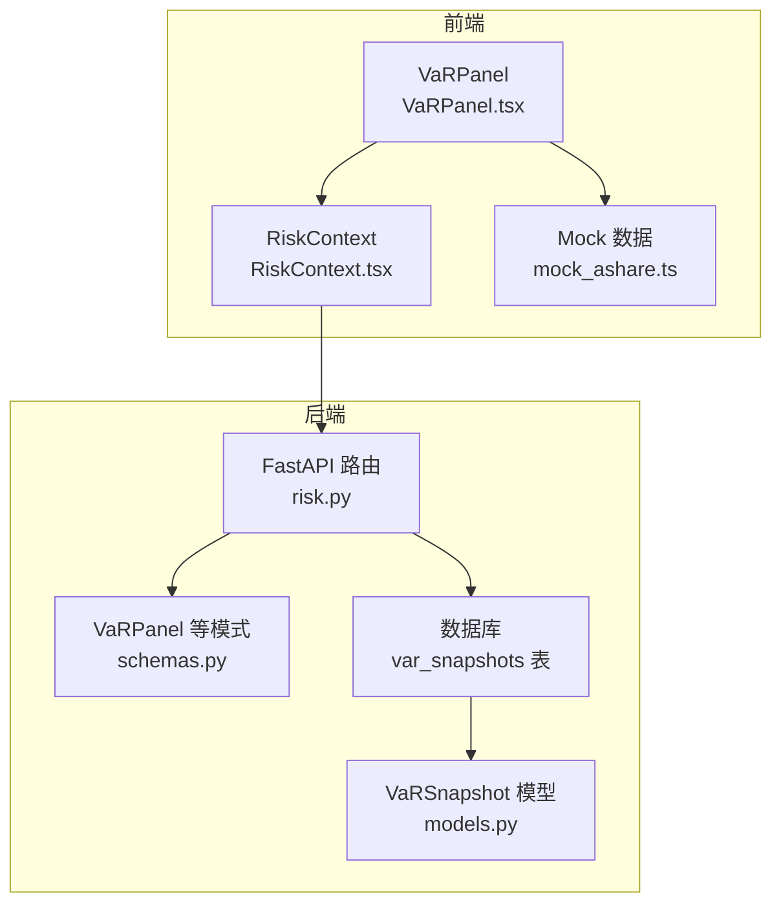
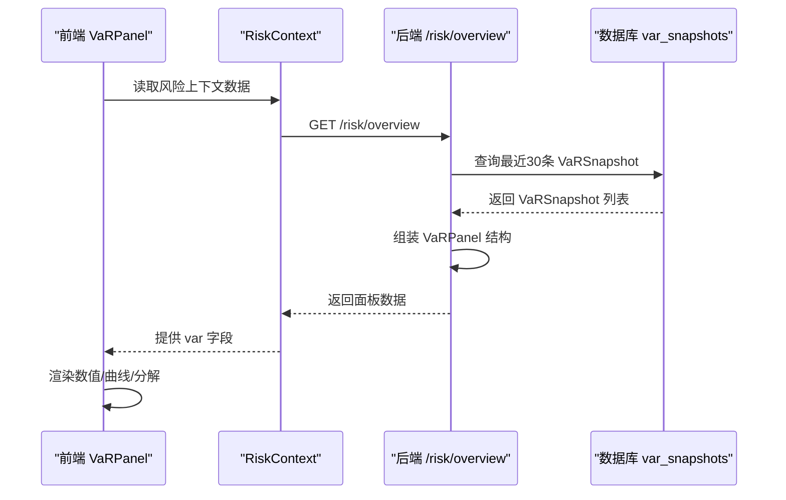
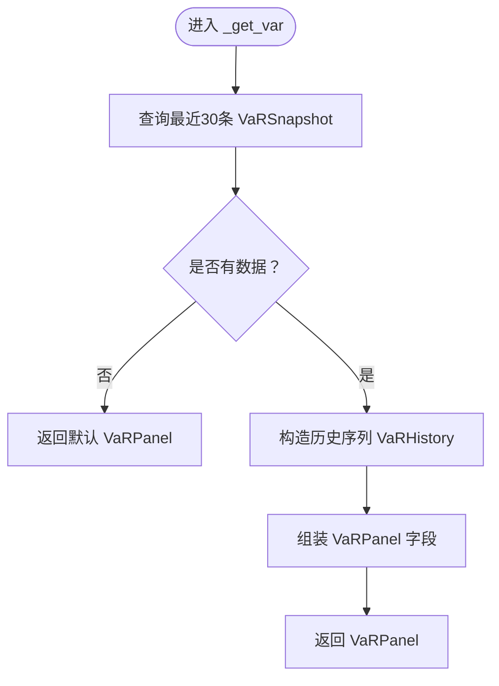
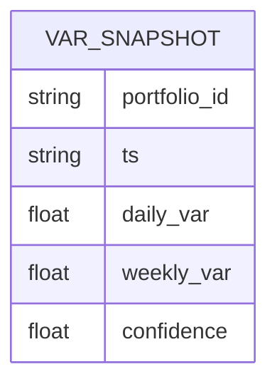
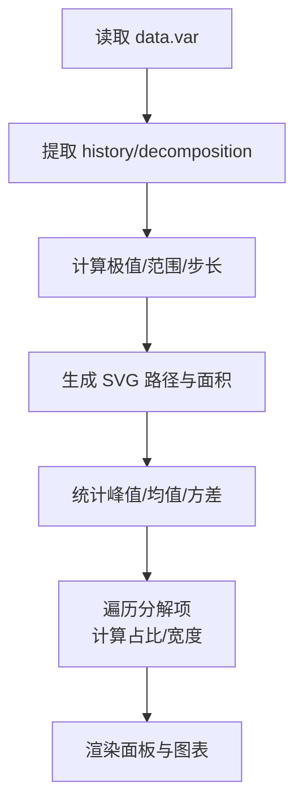
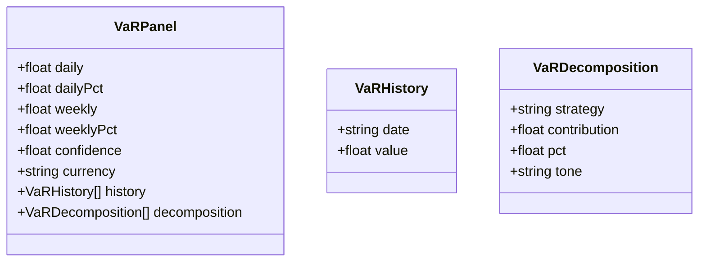
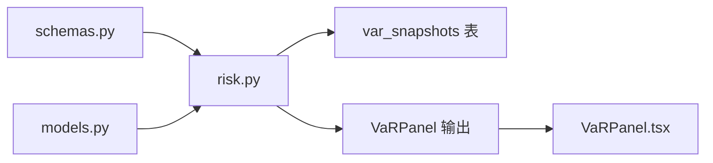

# VaR风险度量

<cite>
**本文档引用的文件**
- [backend/app/api/v1/risk.py](file://backend/app/api/v1/risk.py)
- [backend/app/domains/risk/models.py](file://backend/app/domains/risk/models.py)
- [backend/app/domains/risk/schemas.py](file://backend/app/domains/risk/schemas.py)
- [frontend/src/screens/Risk/VaRPanel.tsx](file://frontend/src/screens/Risk/VaRPanel.tsx)
- [frontend/src/contexts/RiskContext.tsx](file://frontend/src/contexts/RiskContext.tsx)
- [backend/app/db/migrations/versions/20260513_000001_execution_risk_portfolio.py](file://backend/app/db/migrations/versions/20260513_000001_execution_risk_portfolio.py)
- [frontend/src/data/mock_ashare.ts](file://frontend/src/data/mock_ashare.ts)
</cite>

## 目录
1. [简介](#简介)
2. [项目结构](#项目结构)
3. [核心组件](#核心组件)
4. [架构总览](#架构总览)
5. [详细组件分析](#详细组件分析)
6. [依赖分析](#依赖分析)
7. [性能考虑](#性能考虑)
8. [故障排查指南](#故障排查指南)
9. [结论](#结论)

## 简介
本文件面向VaR（风险价值）风险度量系统，提供从数据模型、接口定义到前端展示的完整技术文档。内容覆盖VaR的历史回溯与滚动窗口、置信水平与时间窗口配置、策略级分解与可视化呈现，并给出可扩展的实现建议，帮助开发者快速理解并集成量化风险管理中的核心指标。

## 项目结构
VaR功能由后端API、数据库模型与前端组件协同实现：
- 后端API负责VaR快照查询与返回面板数据
- 数据库模型定义VaR快照表结构及字段
- 前端组件负责VaR数值展示、历史曲线绘制与策略级分解可视化

图表来源
- [backend/app/api/v1/risk.py:91-116](file://backend/app/api/v1/risk.py#L91-L116)
- [backend/app/domains/risk/models.py:48-57](file://backend/app/domains/risk/models.py#L48-L57)
- [backend/app/domains/risk/schemas.py:45-54](file://backend/app/domains/risk/schemas.py#L45-L54)
- [frontend/src/contexts/RiskContext.tsx:1-13](file://frontend/src/contexts/RiskContext.tsx#L1-L13)
- [frontend/src/screens/Risk/VaRPanel.tsx:1-119](file://frontend/src/screens/Risk/VaRPanel.tsx#L1-L119)

章节来源
- [backend/app/api/v1/risk.py:91-116](file://backend/app/api/v1/risk.py#L91-L116)
- [backend/app/domains/risk/models.py:48-57](file://backend/app/domains/risk/models.py#L48-L57)
- [backend/app/domains/risk/schemas.py:45-54](file://backend/app/domains/risk/schemas.py#L45-L54)
- [frontend/src/contexts/RiskContext.tsx:1-13](file://frontend/src/contexts/RiskContext.tsx#L1-L13)
- [frontend/src/screens/Risk/VaRPanel.tsx:1-119](file://frontend/src/screens/Risk/VaRPanel.tsx#L1-L119)

## 核心组件
- VaRSnapshot 数据模型：存储每日/每周VaR、置信水平与时间戳
- VaRPanel 模式：定义前端面板所需的数据结构（含历史序列与分解）
- FastAPI 路由：按最近30条记录返回VaR面板数据
- 前端 VaRPanel 组件：渲染VaR数值、历史曲线与策略级分解

章节来源
- [backend/app/domains/risk/models.py:48-57](file://backend/app/domains/risk/models.py#L48-L57)
- [backend/app/domains/risk/schemas.py:45-54](file://backend/app/domains/risk/schemas.py#L45-L54)
- [backend/app/api/v1/risk.py:91-116](file://backend/app/api/v1/risk.py#L91-L116)
- [frontend/src/screens/Risk/VaRPanel.tsx:1-119](file://frontend/src/screens/Risk/VaRPanel.tsx#L1-L119)

## 架构总览
下图展示了VaR从数据入库到前端展示的端到端流程：

图表来源
- [backend/app/api/v1/risk.py:91-116](file://backend/app/api/v1/risk.py#L91-L116)
- [backend/app/domains/risk/models.py:48-57](file://backend/app/domains/risk/models.py#L48-L57)
- [frontend/src/contexts/RiskContext.tsx:1-13](file://frontend/src/contexts/RiskContext.tsx#L1-L13)
- [frontend/src/screens/Risk/VaRPanel.tsx:1-119](file://frontend/src/screens/Risk/VaRPanel.tsx#L1-L119)

## 详细组件分析

### 后端 API：VaR 面板数据组装
- 查询最近30条 VaRSnapshot，按创建时间倒序
- 组装 VaRPanel：包含日/周VaR、置信水平、货币单位、历史序列与分解列表
- 若无数据，返回默认空面板

图表来源
- [backend/app/api/v1/risk.py:91-116](file://backend/app/api/v1/risk.py#L91-L116)

章节来源
- [backend/app/api/v1/risk.py:91-116](file://backend/app/api/v1/risk.py#L91-L116)

### 数据模型：VaRSnapshot
- 字段：组合标识、时间戳、日VaR、周VaR、置信水平
- 索引：按组合与时间戳索引，支持高效查询

图表来源
- [backend/app/domains/risk/models.py:48-57](file://backend/app/domains/risk/models.py#L48-L57)
- [backend/app/db/migrations/versions/20260513_000001_execution_risk_portfolio.py:166-175](file://backend/app/db/migrations/versions/20260513_000001_execution_risk_portfolio.py#L166-L175)

章节来源
- [backend/app/domains/risk/models.py:48-57](file://backend/app/domains/risk/models.py#L48-L57)
- [backend/app/db/migrations/versions/20260513_000001_execution_risk_portfolio.py:166-175](file://backend/app/db/migrations/versions/20260513_000001_execution_risk_portfolio.py#L166-L175)

### 前端组件：VaR 面板与策略级分解
- 数值展示：当前日VaR、周VaR、百分比、峰值与均值
- 历史曲线：30日滚动窗口，线段与填充区域
- 策略级分解：按贡献度与方向显示各策略的VaR暴露

图表来源
- [frontend/src/screens/Risk/VaRPanel.tsx:1-119](file://frontend/src/screens/Risk/VaRPanel.tsx#L1-L119)

章节来源
- [frontend/src/screens/Risk/VaRPanel.tsx:1-119](file://frontend/src/screens/Risk/VaRPanel.tsx#L1-L119)
- [frontend/src/contexts/RiskContext.tsx:1-13](file://frontend/src/contexts/RiskContext.tsx#L1-L13)

### 数据模式：VaRPanel 与历史序列
- VaRPanel：包含日/周VaR、置信水平、货币单位、历史序列与分解列表
- VaRHistory：日期与对应VaR值
- VaRDecomposition：策略名、贡献值、占比与色调

图表来源
- [backend/app/domains/risk/schemas.py:45-54](file://backend/app/domains/risk/schemas.py#L45-L54)
- [backend/app/domains/risk/schemas.py:33-43](file://backend/app/domains/risk/schemas.py#L33-L43)

章节来源
- [backend/app/domains/risk/schemas.py:45-54](file://backend/app/domains/risk/schemas.py#L45-L54)
- [backend/app/domains/risk/schemas.py:33-43](file://backend/app/domains/risk/schemas.py#L33-L43)

## 依赖分析
- 后端路由依赖数据库模型与模式定义
- 前端组件依赖上下文与模式定义
- 数据库迁移脚本定义了 VaRSnapshot 表结构与索引

图表来源
- [backend/app/domains/risk/schemas.py:45-54](file://backend/app/domains/risk/schemas.py#L45-L54)
- [backend/app/domains/risk/models.py:48-57](file://backend/app/domains/risk/models.py#L48-L57)
- [backend/app/api/v1/risk.py:91-116](file://backend/app/api/v1/risk.py#L91-L116)
- [frontend/src/screens/Risk/VaRPanel.tsx:1-119](file://frontend/src/screens/Risk/VaRPanel.tsx#L1-L119)

章节来源
- [backend/app/api/v1/risk.py:91-116](file://backend/app/api/v1/risk.py#L91-L116)
- [backend/app/domains/risk/models.py:48-57](file://backend/app/domains/risk/models.py#L48-L57)
- [backend/app/domains/risk/schemas.py:45-54](file://backend/app/domains/risk/schemas.py#L45-L54)
- [frontend/src/screens/Risk/VaRPanel.tsx:1-119](file://frontend/src/screens/Risk/VaRPanel.tsx#L1-L119)

## 性能考虑
- 查询优化：按组合与时间戳建立索引，限制返回条数（最近30条），避免全表扫描
- 前端渲染：SVG路径与面积计算在内存中完成，适合小规模滚动窗口；若滚动窗口扩大，建议服务端聚合或采样
- 数据类型：浮点数精度满足VaR展示需求；如需更高精度，可在服务端进行四舍五入控制

## 故障排查指南
- 无VaR数据：检查 VaRSnapshot 是否正确写入，确认数据库连接与权限
- 前端不显示：确认 RiskContext 提供的数据结构与 VaRPanel 字段一致
- 历史曲线异常：检查历史序列长度与极值计算逻辑，确保非空与数值有效
- 策略级分解为空：确认分解列表是否由上游模块填充，前端渲染依赖 totalContrib 进行占比计算

章节来源
- [backend/app/api/v1/risk.py:91-116](file://backend/app/api/v1/risk.py#L91-L116)
- [frontend/src/contexts/RiskContext.tsx:1-13](file://frontend/src/contexts/RiskContext.tsx#L1-L13)
- [frontend/src/screens/Risk/VaRPanel.tsx:1-119](file://frontend/src/screens/Risk/VaRPanel.tsx#L1-L119)

## 结论
本系统以简洁的 VaRSnapshot 数据模型与 VaRPanel 模式为核心，结合 FastAPI 的高效查询与前端的直观可视化，实现了VaR的风险度量与监控。通过置信水平与滚动窗口配置，可灵活适配不同风险偏好与市场环境。后续可在此基础上扩展VaR计算引擎（如历史模拟法、蒙特卡洛法或参数法）与实时流式更新机制，进一步完善量化风控体系。