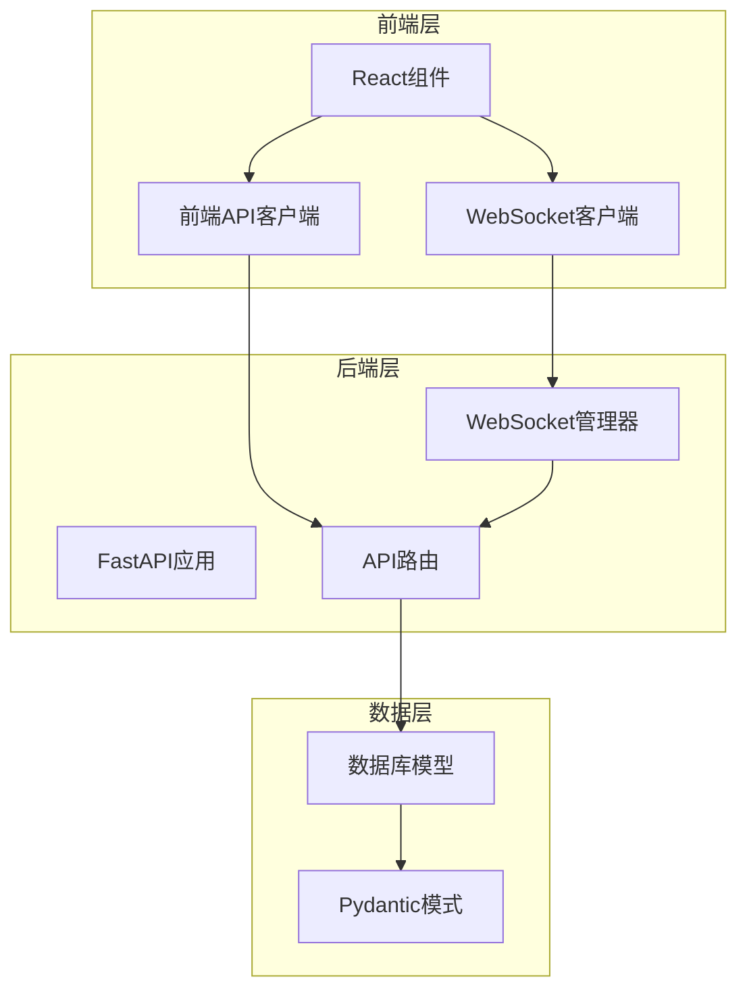
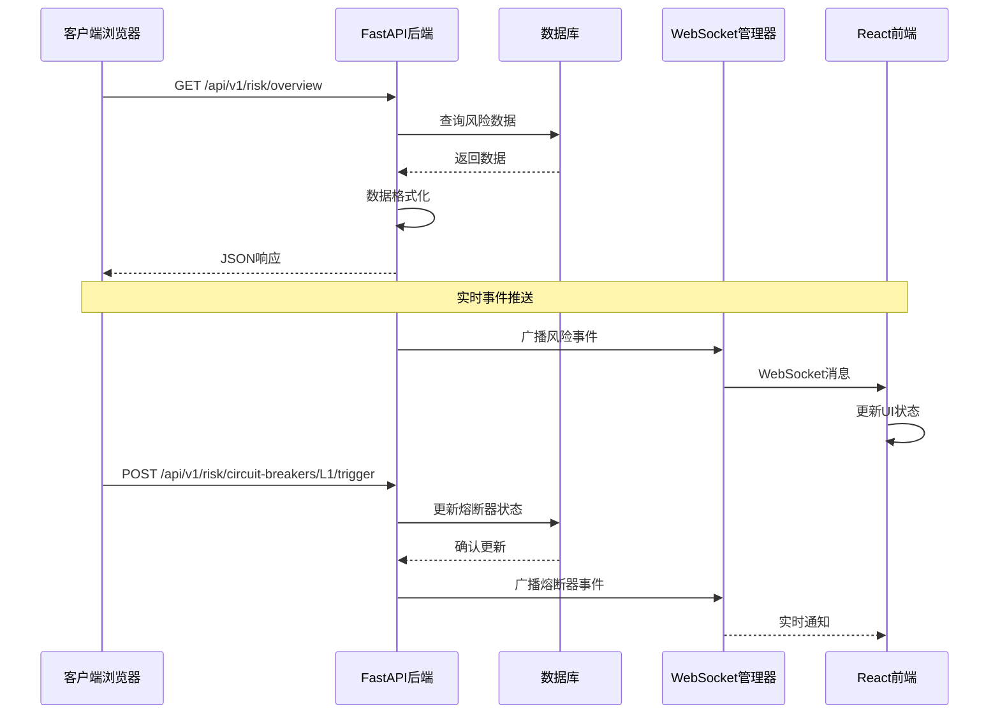
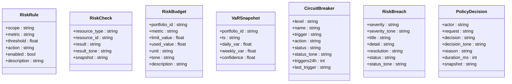
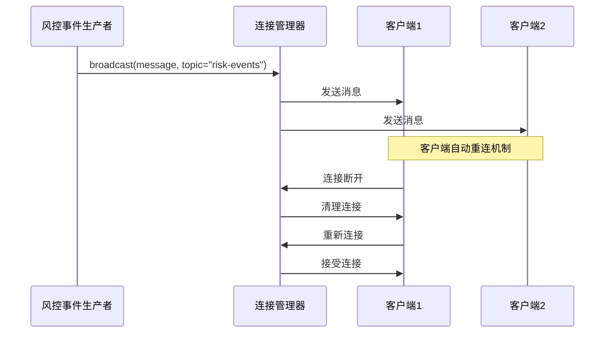
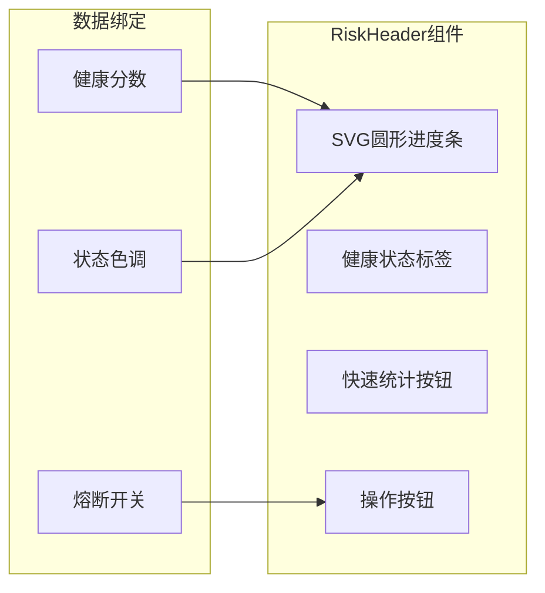
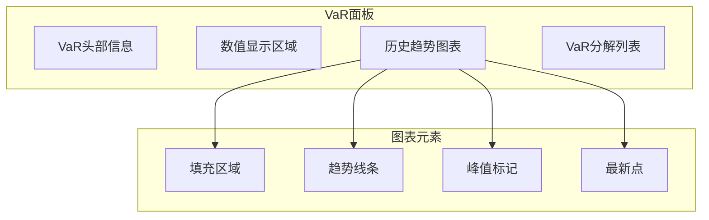
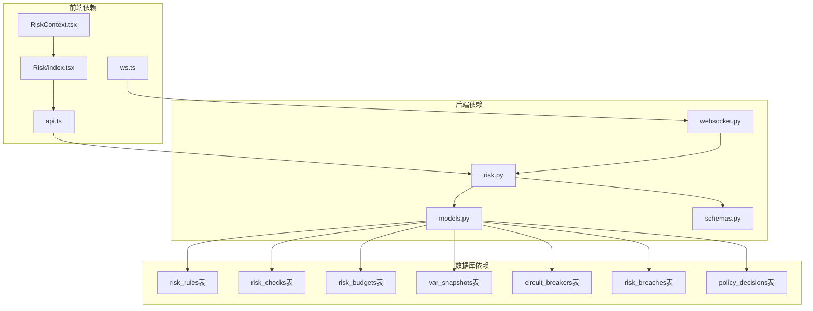

# 实时监控系统

<cite>
**本文档引用的文件**
- [backend/app/api/v1/risk.py](file://backend/app/api/v1/risk.py)
- [backend/app/domains/risk/models.py](file://backend/app/domains/risk/models.py)
- [backend/app/domains/risk/schemas.py](file://backend/app/domains/risk/schemas.py)
- [backend/app/core/websocket.py](file://backend/app/core/websocket.py)
- [frontend/src/lib/api.ts](file://frontend/src/lib/api.ts)
- [frontend/src/lib/ws.ts](file://frontend/src/lib/ws.ts)
- [frontend/src/screens/Risk/index.tsx](file://frontend/src/screens/Risk/index.tsx)
- [frontend/src/screens/Risk/RiskHeader.tsx](file://frontend/src/screens/Risk/RiskHeader.tsx)
- [frontend/src/screens/Risk/VaRPanel.tsx](file://frontend/src/screens/Risk/VaRPanel.tsx)
- [frontend/src/screens/Risk/CircuitBreakerPanel.tsx](file://frontend/src/screens/Risk/CircuitBreakerPanel.tsx)
- [frontend/src/contexts/RiskContext.tsx](file://frontend/src/contexts/RiskContext.tsx)
- [backend/app/api/v1/dashboard.py](file://backend/app/api/v1/dashboard.py)
- [backend/app/schemas/dashboard.py](file://backend/app/schemas/dashboard.py)
</cite>

## 目录
1. [简介](#简介)
2. [项目结构](#项目结构)
3. [核心组件](#核心组件)
4. [架构概览](#架构概览)
5. [详细组件分析](#详细组件分析)
6. [依赖关系分析](#依赖关系分析)
7. [性能考虑](#性能考虑)
8. [故障排除指南](#故障排除指南)
9. [结论](#结论)

## 简介

实时监控系统是一个高性能的风控监控平台，专为量化交易环境设计。该系统提供实时风险指标监控、数据流处理和可视化展示功能，支持VaR（风险价值）计算、熔断器管理、策略执行监控和异常检测。

系统采用前后端分离架构，后端基于FastAPI构建RESTful API，前端使用React开发响应式用户界面。通过WebSocket实现实时数据推送，确保监控面板能够及时反映系统状态变化。

## 项目结构

项目采用模块化组织方式，主要分为后端API服务、数据库模型、前端组件和实时通信三个层面：



**图表来源**
- [backend/app/api/v1/risk.py:1-273](file://backend/app/api/v1/risk.py#L1-L273)
- [backend/app/core/websocket.py:1-45](file://backend/app/core/websocket.py#L1-L45)
- [frontend/src/lib/api.ts:1-779](file://frontend/src/lib/api.ts#L1-L779)

**章节来源**
- [backend/app/api/v1/risk.py:1-273](file://backend/app/api/v1/risk.py#L1-L273)
- [backend/app/domains/risk/models.py:1-101](file://backend/app/domains/risk/models.py#L1-L101)
- [frontend/src/lib/api.ts:1-779](file://frontend/src/lib/api.ts#L1-L779)

## 核心组件

### 风控监控API
风控监控API提供完整的风险控制功能，包括：
- 风险头部信息计算（健康评分、熔断开关状态）
- 风险预算监控（VaR预算使用情况）
- VaR面板展示（历史VaR曲线和分解）
- 熔断器管理（L1-L4四级熔断）
- 策略执行流监控
- 风险违规历史追踪

### 实时通信系统
系统通过WebSocket实现双向实时通信：
- 连接管理器负责维护订阅关系
- 主题化消息广播支持多租户隔离
- 自动重连机制确保连接稳定性
- 类型安全的消息处理

### 前端监控面板
React组件提供丰富的可视化界面：
- 风控健康仪表盘
- VaR历史趋势图表
- 熔断器状态面板
- 策略执行流展示
- 风险违规历史记录

**章节来源**
- [backend/app/api/v1/risk.py:188-207](file://backend/app/api/v1/risk.py#L188-L207)
- [backend/app/core/websocket.py:10-45](file://backend/app/core/websocket.py#L10-L45)
- [frontend/src/screens/Risk/index.tsx:1-45](file://frontend/src/screens/Risk/index.tsx#L1-L45)

## 架构概览

系统采用分层架构设计，确保关注点分离和可扩展性：



**图表来源**
- [backend/app/api/v1/risk.py:210-273](file://backend/app/api/v1/risk.py#L210-L273)
- [backend/app/core/websocket.py:27-35](file://backend/app/core/websocket.py#L27-L35)
- [frontend/src/lib/ws.ts:40-68](file://frontend/src/lib/ws.ts#L40-L68)

## 详细组件分析

### 风控数据模型

系统使用SQLAlchemy定义了完整的风控数据模型，支持灵活的风险监控需求：



**图表来源**
- [backend/app/domains/risk/models.py:9-101](file://backend/app/domains/risk/models.py#L9-L101)

### 风控API接口设计

风控API提供了完整的RESTful接口，支持风险监控的各个方面：

```mermaid
flowchart TD
Start([API请求到达]) --> Route{路由匹配}
Route --> |GET /risk/overview| Overview[获取风控概览]
Route --> |POST /risk/circuit-breakers/{level}/trigger| Trigger[触发熔断器]
Route --> |POST /risk/circuit-breakers/{level}/recover| Recover[熔断器恢复]
Overview --> QueryDB[查询数据库]
QueryDB --> FormatData[格式化数据]
FormatData --> ReturnJSON[返回JSON响应]
Trigger --> UpdateCB[更新熔断器状态]
UpdateCB --> LogAudit[记录审计日志]
LogAudit --> BroadcastWS[广播WebSocket消息]
BroadcastWS --> ReturnJSON
Recover --> UpdateCB2[更新熔断器状态]
UpdateCB2 --> LogAudit2[记录审计日志]
LogAudit2 --> BroadcastWS2[广播WebSocket消息]
BroadcastWS2 --> ReturnJSON
```

**图表来源**
- [backend/app/api/v1/risk.py:188-273](file://backend/app/api/v1/risk.py#L188-L273)

### 实时数据推送机制

WebSocket系统实现了高效的数据推送机制：



**图表来源**
- [backend/app/core/websocket.py:27-42](file://backend/app/core/websocket.py#L27-L42)
- [frontend/src/lib/ws.ts:40-88](file://frontend/src/lib/ws.ts#L40-L88)

### 前端监控面板组件

React组件提供了丰富的可视化界面：

#### 风控头部组件
RiskHeader组件实现了动态健康仪表盘，支持SVG圆形进度条和实时状态指示：



**图表来源**
- [frontend/src/screens/Risk/RiskHeader.tsx:19-97](file://frontend/src/screens/Risk/RiskHeader.tsx#L19-L97)

#### VaR面板组件
VaRPanel组件展示了风险价值的历史趋势和策略分解：



**图表来源**
- [frontend/src/screens/Risk/VaRPanel.tsx:69-89](file://frontend/src/screens/Risk/VaRPanel.tsx#L69-L89)

**章节来源**
- [frontend/src/screens/Risk/RiskHeader.tsx:1-112](file://frontend/src/screens/Risk/RiskHeader.tsx#L1-L112)
- [frontend/src/screens/Risk/VaRPanel.tsx:1-120](file://frontend/src/screens/Risk/VaRPanel.tsx#L1-L120)
- [frontend/src/screens/Risk/CircuitBreakerPanel.tsx:1-88](file://frontend/src/screens/Risk/CircuitBreakerPanel.tsx#L1-L88)

## 依赖关系分析

系统各组件之间的依赖关系清晰明确：



**图表来源**
- [frontend/src/lib/api.ts:692-704](file://frontend/src/lib/api.ts#L692-L704)
- [frontend/src/lib/ws.ts:92-95](file://frontend/src/lib/ws.ts#L92-L95)
- [backend/app/api/v1/risk.py:1-29](file://backend/app/api/v1/risk.py#L1-L29)
- [backend/app/domains/risk/models.py:1-101](file://backend/app/domains/risk/models.py#L1-L101)

**章节来源**
- [backend/app/api/v1/risk.py:1-29](file://backend/app/api/v1/risk.py#L1-L29)
- [backend/app/domains/risk/models.py:1-101](file://backend/app/domains/risk/models.py#L1-L101)
- [frontend/src/lib/api.ts:692-704](file://frontend/src/lib/api.ts#L692-L704)

## 性能考虑

### 数据库优化
- 使用索引优化常用查询字段（如created_at、status、level）
- 限制查询结果集大小（默认限制20条记录）
- 使用异步数据库连接池提高并发性能

### 缓存策略
- 前端使用React状态缓存避免重复API调用
- WebSocket消息去重处理防止重复渲染
- 合理设置缓存失效时间平衡实时性和性能

### 实时通信优化
- 自适应重连延迟避免服务器过载
- 连接数限制防止内存泄漏
- 消息队列处理高并发事件推送

## 故障排除指南

### 常见问题诊断

**WebSocket连接问题**
- 检查网络连接和防火墙设置
- 验证URL协议（http/https）与WebSocket协议匹配
- 查看浏览器开发者工具中的网络面板

**API响应错误**
- 确认认证令牌有效性和过期时间
- 检查API端点路径和HTTP方法
- 验证请求参数格式和类型

**数据同步问题**
- 确认数据库连接状态
- 检查异步任务执行状态
- 验证数据格式转换逻辑

**章节来源**
- [frontend/src/lib/ws.ts:40-88](file://frontend/src/lib/ws.ts#L40-L88)
- [frontend/src/lib/api.ts:32-57](file://frontend/src/lib/api.ts#L32-L57)

## 结论

实时监控系统通过精心设计的架构和组件实现了高性能的风险监控功能。系统具备以下优势：

1. **实时性**：基于WebSocket的双向通信确保监控数据的即时更新
2. **可扩展性**：模块化设计支持功能扩展和性能优化
3. **可靠性**：完善的错误处理和重连机制保证系统稳定性
4. **可视化**：丰富的React组件提供直观的数据展示界面

该系统为量化交易环境提供了完整的风控监控解决方案，支持高频交易场景下的实时风险管理和决策支持。通过合理的架构设计和性能优化，系统能够在保证实时性的前提下处理大规模并发请求。