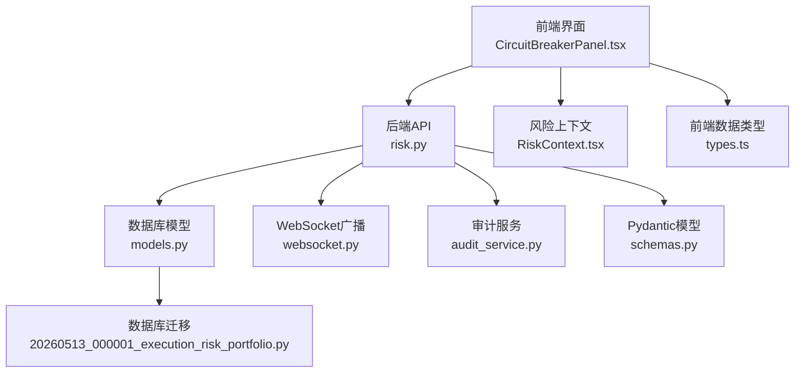
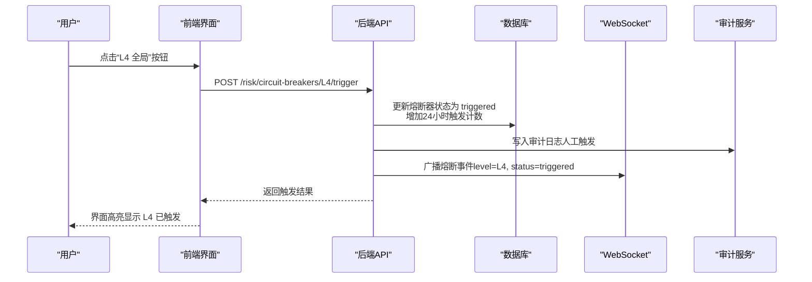
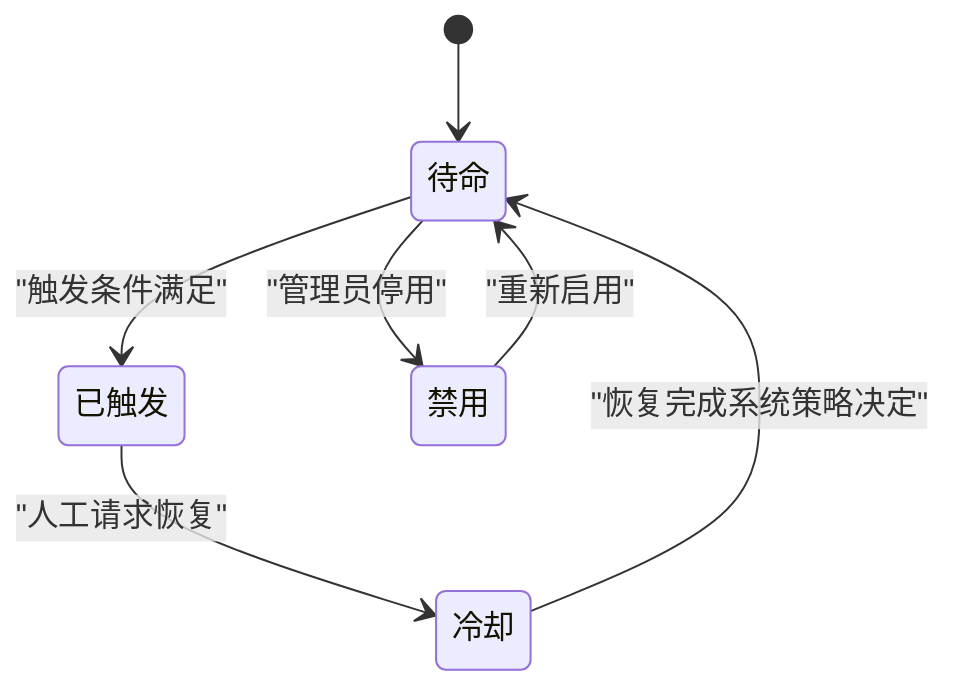
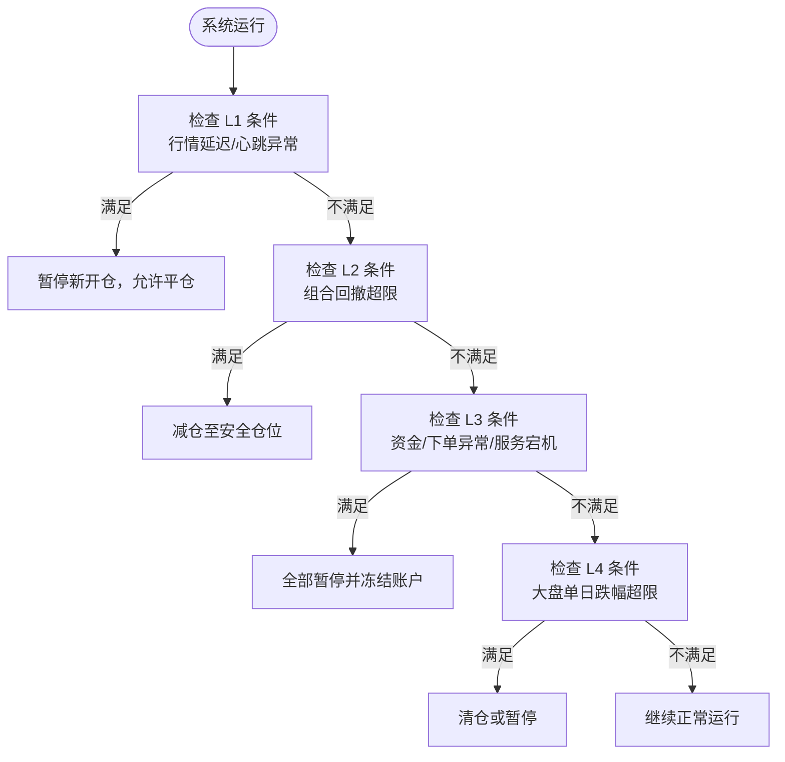
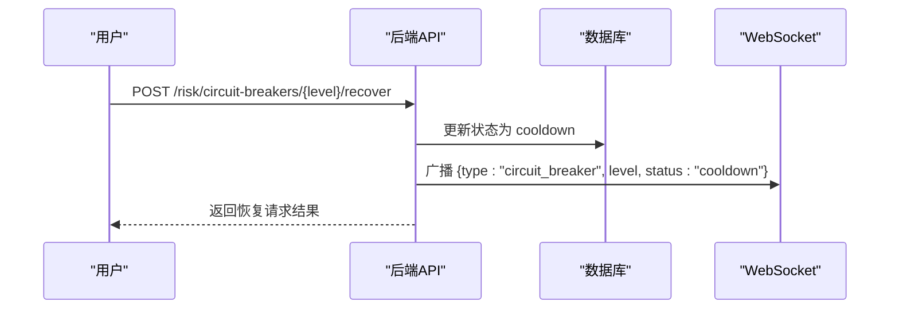
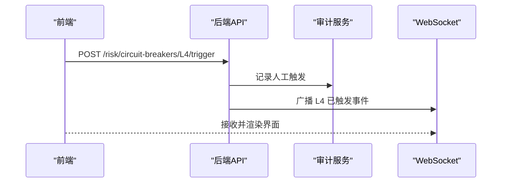
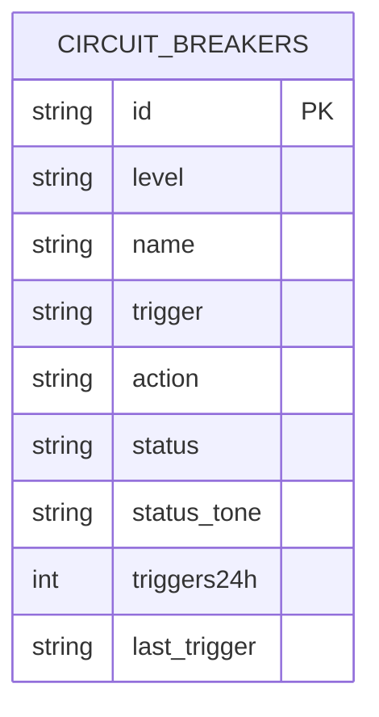
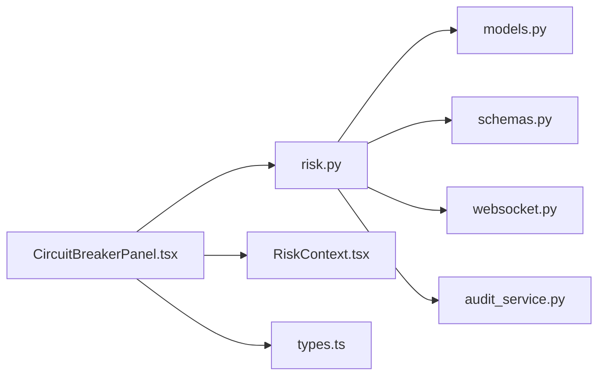

# 熔断机制

<cite>
**本文引用的文件**
- [backend/app/api/v1/risk.py](file://backend/app/api/v1/risk.py)
- [backend/app/domains/risk/models.py](file://backend/app/domains/risk/models.py)
- [backend/app/domains/risk/schemas.py](file://backend/app/domains/risk/schemas.py)
- [backend/app/db/migrations/versions/20260513_000001_execution_risk_portfolio.py](file://backend/app/db/migrations/versions/20260513_000001_execution_risk_portfolio.py)
- [backend/scripts/seed_dev_data.py](file://backend/scripts/seed_dev_data.py)
- [frontend/src/screens/Risk/CircuitBreakerPanel.tsx](file://frontend/src/screens/Risk/CircuitBreakerPanel.tsx)
- [frontend/src/contexts/RiskContext.tsx](file://frontend/src/contexts/RiskContext.tsx)
- [frontend/src/data/types.ts](file://frontend/src/data/types.ts)
- [backend/app/core/websocket.py](file://backend/app/core/websocket.py)
- [backend/app/services/audit_service.py](file://backend/app/services/audit_service.py)
</cite>

## 目录
1. [简介](#简介)
2. [项目结构](#项目结构)
3. [核心组件](#核心组件)
4. [架构总览](#架构总览)
5. [详细组件分析](#详细组件分析)
6. [依赖分析](#依赖分析)
7. [性能考虑](#性能考虑)
8. [故障排查指南](#故障排查指南)
9. [结论](#结论)
10. [附录](#附录)

## 简介
本文件系统性阐述本项目的熔断机制，围绕四级熔断（L1–L4）的设计理念、状态流转、触发条件与响应动作展开，并结合后端 API、数据库模型、前端展示与审计日志，给出完整的实现与运维参考。文档同时覆盖冷却机制与人工干预流程，帮助开发者在极端市场情况下理解熔断系统的保护作用与运行方式。

## 项目结构
与熔断机制直接相关的代码分布在后端 API、领域模型与前端界面三部分：
- 后端 API：提供熔断器查询与人工触发/恢复接口，负责状态更新与事件广播。
- 领域模型：定义熔断器实体及其字段，包括级别、名称、触发条件、动作、状态与统计信息。
- 前端界面：展示熔断器状态、触发次数与最近触发时间，并提供 L4 全局熔断的人工触发入口。
- 数据库迁移：定义熔断器表结构及索引。
- 审计服务：记录人工触发/恢复等关键操作，形成不可篡改的审计链。
- WebSocket：向客户端实时推送熔断事件。

图表来源
- [backend/app/api/v1/risk.py:188-273](file://backend/app/api/v1/risk.py#L188-L273)
- [backend/app/domains/risk/models.py:60-73](file://backend/app/domains/risk/models.py#L60-L73)
- [backend/app/core/websocket.py:10-45](file://backend/app/core/websocket.py#L10-L45)
- [backend/app/services/audit_service.py:32-82](file://backend/app/services/audit_service.py#L32-L82)
- [backend/app/db/migrations/versions/20260513_000001_execution_risk_portfolio.py:177-189](file://backend/app/db/migrations/versions/20260513_000001_execution_risk_portfolio.py#L177-L189)
- [frontend/src/screens/Risk/CircuitBreakerPanel.tsx:21-88](file://frontend/src/screens/Risk/CircuitBreakerPanel.tsx#L21-L88)
- [frontend/src/contexts/RiskContext.tsx:1-13](file://frontend/src/contexts/RiskContext.tsx#L1-L13)
- [frontend/src/data/types.ts:317-386](file://frontend/src/data/types.ts#L317-L386)
- [backend/app/domains/risk/schemas.py:56-65](file://backend/app/domains/risk/schemas.py#L56-L65)

章节来源
- [backend/app/api/v1/risk.py:188-273](file://backend/app/api/v1/risk.py#L188-L273)
- [backend/app/domains/risk/models.py:60-73](file://backend/app/domains/risk/models.py#L60-L73)
- [frontend/src/screens/Risk/CircuitBreakerPanel.tsx:21-88](file://frontend/src/screens/Risk/CircuitBreakerPanel.tsx#L21-L88)

## 核心组件
- 熔断器实体（CircuitBreaker）
  - 字段：级别（L1–L4）、名称、触发条件描述、动作描述、当前状态（待命/已触发/冷却/禁用）、状态色调、24 小时触发次数、最近触发时间。
  - 状态流转：armed → triggered → cooldown；支持手动恢复请求将状态置为 cooldown。
- 后端 API
  - 查询熔断器列表与概览。
  - 手动触发指定级别的熔断器。
  - 请求熔断器恢复（将状态置为 cooldown）。
- 前端界面
  - 展示 L1–L4 熔断器状态、触发条件与动作。
  - 提供 L4 全局熔断的人工触发按钮。
- 审计与事件
  - 记录人工触发/恢复操作，形成审计链。
  - 通过 WebSocket 广播熔断事件，前端实时刷新。

章节来源
- [backend/app/domains/risk/models.py:60-73](file://backend/app/domains/risk/models.py#L60-L73)
- [backend/app/api/v1/risk.py:119-135](file://backend/app/api/v1/risk.py#L119-L135)
- [backend/app/api/v1/risk.py:210-272](file://backend/app/api/v1/risk.py#L210-L272)
- [frontend/src/screens/Risk/CircuitBreakerPanel.tsx:21-88](file://frontend/src/screens/Risk/CircuitBreakerPanel.tsx#L21-L88)
- [backend/app/services/audit_service.py:38-81](file://backend/app/services/audit_service.py#L38-L81)
- [backend/app/core/websocket.py:27-35](file://backend/app/core/websocket.py#L27-L35)

## 架构总览
下图展示了从用户操作到状态持久化与事件广播的整体流程，以及审计日志的写入路径。

图表来源
- [backend/app/api/v1/risk.py:210-239](file://backend/app/api/v1/risk.py#L210-L239)
- [backend/app/services/audit_service.py:38-81](file://backend/app/services/audit_service.py#L38-L81)
- [backend/app/core/websocket.py:27-35](file://backend/app/core/websocket.py#L27-L35)
- [frontend/src/screens/Risk/CircuitBreakerPanel.tsx:37](file://frontend/src/screens/Risk/CircuitBreakerPanel.tsx#L37)

## 详细组件分析

### 熔断器状态与生命周期
- 状态定义
  - 待命（armed）：正常运行态，等待触发条件满足。
  - 已触发（triggered）：触发条件满足，执行相应动作。
  - 冷却（cooldown）：触发后进入冷却期，需人工确认恢复。
  - 禁用（disabled）：策略性停用，不参与触发判断。
- 生命周期流转
  - 由“待命”到“已触发”，再进入“冷却”。
  - “冷却”状态下，需人工发起恢复请求，将状态置为“冷却”（表示恢复流程已启动），随后系统可按策略进一步处理。
- 统计指标
  - 24 小时触发次数：用于监控与告警。
  - 最近触发时间：用于追踪事件时效性。

图表来源
- [backend/app/domains/risk/models.py:69](file://backend/app/domains/risk/models.py#L69)
- [backend/app/api/v1/risk.py:210-272](file://backend/app/api/v1/risk.py#L210-L272)

章节来源
- [backend/app/domains/risk/models.py:60-73](file://backend/app/domains/risk/models.py#L60-L73)
- [backend/app/api/v1/risk.py:210-272](file://backend/app/api/v1/risk.py#L210-L272)

### 熔断器分级设计（L1–L4）
- L1 可恢复熔断
  - 触发条件：行情延迟超过一定阈值、策略心跳异常。
  - 动作：暂停新开仓，允许平仓。
- L2 组合熔断
  - 触发条件：组合回撤超过设定阈值。
  - 动作：将仓位降低至安全水平（例如 50%）。
- L3 不可恢复熔断
  - 触发条件：资金异常、重复下单、风控服务宕机等严重情形。
  - 动作：全部暂停并冻结账户。
- L4 全市场熔断
  - 触发条件：大盘单日跌幅超过设定阈值。
  - 动作：清仓或暂停交易。
- 初始化配置
  - 开发环境通过种子脚本预置四档熔断器的默认配置，便于演示与测试。

图表来源
- [backend/scripts/seed_dev_data.py:75-122](file://backend/scripts/seed_dev_data.py#L75-L122)

章节来源
- [backend/scripts/seed_dev_data.py:75-122](file://backend/scripts/seed_dev_data.py#L75-L122)

### 触发条件与响应动作
- 触发条件
  - 由业务规则驱动，可在数据库中配置不同熔断器的触发条件描述。
  - 实际触发逻辑通常由风控引擎或市场数据流驱动，本仓库提供了人工触发接口作为补充手段。
- 响应动作
  - 动作描述存储于熔断器实体，前端展示用于指导操作人员理解当前层级的处置策略。
  - 实际执行细节由上层策略与执行模块配合完成，熔断器在此处承担“状态开关”的角色。

章节来源
- [backend/app/domains/risk/models.py:67-68](file://backend/app/domains/risk/models.py#L67-L68)
- [backend/app/domains/risk/schemas.py:56-65](file://backend/app/domains/risk/schemas.py#L56-L65)
- [frontend/src/screens/Risk/CircuitBreakerPanel.tsx:59-66](file://frontend/src/screens/Risk/CircuitBreakerPanel.tsx#L59-L66)

### 状态管理与冷却机制
- 状态更新
  - 人工触发：将状态置为“已触发”，并增加 24 小时触发计数。
  - 恢复请求：将状态置为“冷却”，表示恢复流程已启动。
- 冷却机制
  - 进入“冷却”后，系统可进行评估与审批，最终决定是否完全解除熔断。
  - 冷却期间，前端界面以对应色调提示，避免误操作。
- 事件广播
  - 状态变更通过 WebSocket 广播到前端，确保界面实时同步。

图表来源
- [backend/app/api/v1/risk.py:242-272](file://backend/app/api/v1/risk.py#L242-L272)
- [backend/app/core/websocket.py:27-35](file://backend/app/core/websocket.py#L27-L35)

章节来源
- [backend/app/api/v1/risk.py:242-272](file://backend/app/api/v1/risk.py#L242-L272)
- [backend/app/core/websocket.py:27-35](file://backend/app/core/websocket.py#L27-L35)

### 手动干预流程
- 人工触发
  - 前端点击“L4 全局”按钮，调用后端触发接口，将 L4 置为“已触发”，并记录审计日志。
- 恢复请求
  - 当条件缓解后，管理员可请求恢复，将状态置为“冷却”，随后按策略完成最终恢复。
- 审计与追溯
  - 所有操作均写入审计链，支持校验与追溯。

图表来源
- [frontend/src/screens/Risk/CircuitBreakerPanel.tsx:37](file://frontend/src/screens/Risk/CircuitBreakerPanel.tsx#L37)
- [backend/app/api/v1/risk.py:210-239](file://backend/app/api/v1/risk.py#L210-L239)
- [backend/app/services/audit_service.py:38-81](file://backend/app/services/audit_service.py#L38-L81)
- [backend/app/core/websocket.py:27-35](file://backend/app/core/websocket.py#L27-L35)

章节来源
- [frontend/src/screens/Risk/CircuitBreakerPanel.tsx:21-88](file://frontend/src/screens/Risk/CircuitBreakerPanel.tsx#L21-L88)
- [backend/app/api/v1/risk.py:210-239](file://backend/app/api/v1/risk.py#L210-L239)
- [backend/app/services/audit_service.py:38-81](file://backend/app/services/audit_service.py#L38-L81)

### 数据模型与表结构
- 熔断器表（circuit_breakers）
  - 关键列：level、name、trigger、action、status、status_tone、triggers24h、last_trigger。
  - 索引：按 level 建立索引，便于快速查询与排序。
- 初始化与迁移
  - 迁移脚本创建熔断器表并插入初始数据。
  - 种子脚本提供默认的 L1–L4 配置，便于本地开发与演示。

图表来源
- [backend/app/db/migrations/versions/20260513_000001_execution_risk_portfolio.py:177-189](file://backend/app/db/migrations/versions/20260513_000001_execution_risk_portfolio.py#L177-L189)
- [backend/app/domains/risk/models.py:60-73](file://backend/app/domains/risk/models.py#L60-L73)

章节来源
- [backend/app/db/migrations/versions/20260513_000001_execution_risk_portfolio.py:177-189](file://backend/app/db/migrations/versions/20260513_000001_execution_risk_portfolio.py#L177-L189)
- [backend/app/domains/risk/models.py:60-73](file://backend/app/domains/risk/models.py#L60-L73)

### 前端展示与交互
- 面板组件
  - 展示 L1–L4 的状态、触发条件、动作与统计信息。
  - 提供“规则配置”与“L4 全局”按钮，其中 L4 按钮用于人工触发。
- 上下文与类型
  - 风险上下文提供熔断器数据源。
  - 前端类型定义明确字段与枚举值，保证前后端一致性。

章节来源
- [frontend/src/screens/Risk/CircuitBreakerPanel.tsx:21-88](file://frontend/src/screens/Risk/CircuitBreakerPanel.tsx#L21-L88)
- [frontend/src/contexts/RiskContext.tsx:1-13](file://frontend/src/contexts/RiskContext.tsx#L1-L13)
- [frontend/src/data/types.ts:357-366](file://frontend/src/data/types.ts#L357-L366)

## 依赖分析
- 组件耦合
  - API 层依赖数据库模型与审计服务，负责状态更新与事件广播。
  - 前端依赖风险上下文与类型定义，负责展示与交互。
- 外部依赖
  - WebSocket 管理器提供事件广播能力。
  - 审计服务提供不可篡改的日志链路。

图表来源
- [backend/app/api/v1/risk.py:13-26](file://backend/app/api/v1/risk.py#L13-L26)
- [frontend/src/screens/Risk/CircuitBreakerPanel.tsx:1-1](file://frontend/src/screens/Risk/CircuitBreakerPanel.tsx#L1-L1)
- [backend/app/core/websocket.py:10-45](file://backend/app/core/websocket.py#L10-L45)
- [backend/app/services/audit_service.py:32-82](file://backend/app/services/audit_service.py#L32-L82)

章节来源
- [backend/app/api/v1/risk.py:13-26](file://backend/app/api/v1/risk.py#L13-L26)
- [frontend/src/screens/Risk/CircuitBreakerPanel.tsx:1-1](file://frontend/src/screens/Risk/CircuitBreakerPanel.tsx#L1-L1)

## 性能考虑
- 数据访问
  - 熔断器查询按级别排序，迁移脚本对 level 建立索引，有利于高效检索。
- 事件广播
  - WebSocket 广播采用连接池管理，异常连接会自动清理，避免阻塞。
- 审计写入
  - 审计日志写入前计算哈希，顺序写入，保证链式完整性。

章节来源
- [backend/app/db/migrations/versions/20260513_000001_execution_risk_portfolio.py:189](file://backend/app/db/migrations/versions/20260513_000001_execution_risk_portfolio.py#L189)
- [backend/app/core/websocket.py:27-41](file://backend/app/core/websocket.py#L27-L41)
- [backend/app/services/audit_service.py:18-29](file://backend/app/services/audit_service.py#L18-L29)

## 故障排查指南
- 熔断未生效
  - 检查熔断器状态是否仍为“待命”，确认触发条件是否满足。
  - 查看 24 小时触发次数与最近触发时间，确认是否存在异常波动。
- 无法恢复
  - 若状态为“已触发”，需先请求恢复（进入“冷却”），再按策略完成最终恢复。
  - 检查 WebSocket 是否正常接收事件，确认前端界面是否刷新。
- 审计缺失
  - 确认审计服务是否成功写入，必要时验证哈希链的连续性。
- 人工触发失败
  - 检查接口返回的错误码与消息，确认级别是否存在且状态合法。

章节来源
- [backend/app/api/v1/risk.py:210-272](file://backend/app/api/v1/risk.py#L210-L272)
- [backend/app/core/websocket.py:27-35](file://backend/app/core/websocket.py#L27-L35)
- [backend/app/services/audit_service.py:83-109](file://backend/app/services/audit_service.py#L83-L109)

## 结论
本项目的熔断机制以四级设计为核心，结合状态管理、事件广播与审计日志，实现了从触发到恢复的闭环控制。L1–L4 分别覆盖轻度到全局的保护场景，既可通过业务规则自动触发，也支持人工干预，满足极端市场下的稳健运营需求。建议在生产环境中结合实际市场特征调整触发阈值与动作策略，并完善冷却期的自动化评估与审批流程。

## 附录
- 默认配置（L1–L4）
  - 由种子脚本初始化，包含级别、名称、触发条件描述与动作描述。
- 前端类型定义
  - 明确熔断器字段与枚举值，保证前后端一致。

章节来源
- [backend/scripts/seed_dev_data.py:75-122](file://backend/scripts/seed_dev_data.py#L75-L122)
- [frontend/src/data/types.ts:357-366](file://frontend/src/data/types.ts#L357-L366)