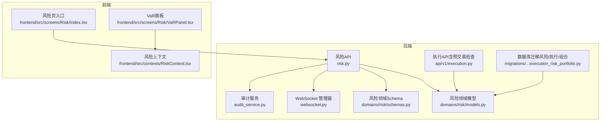
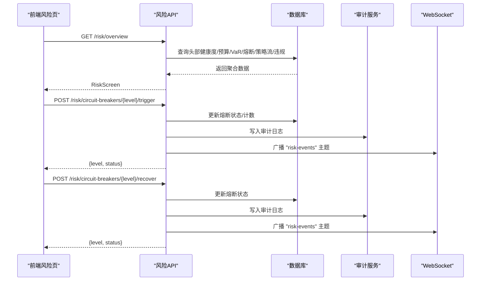
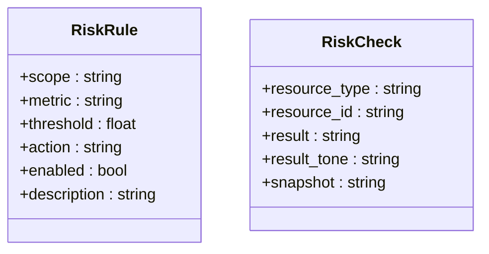
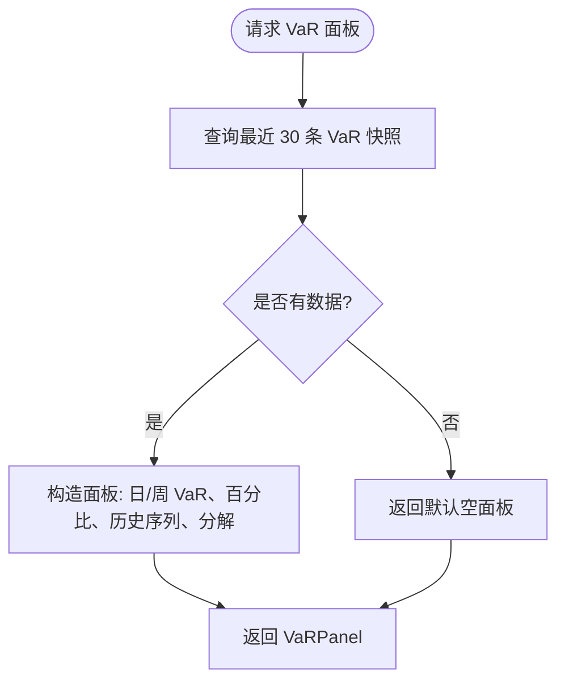
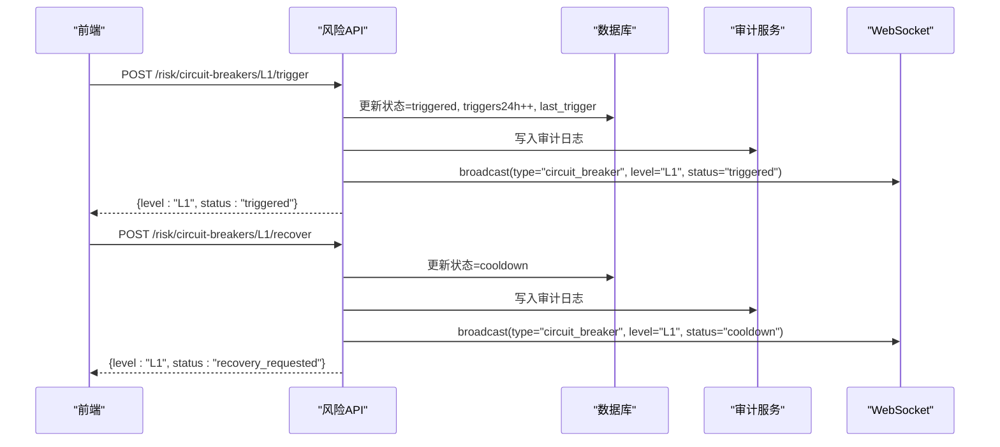
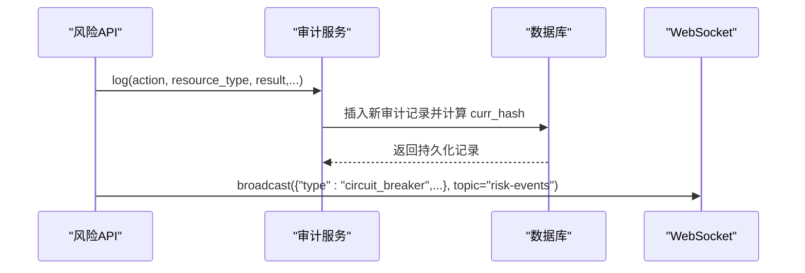
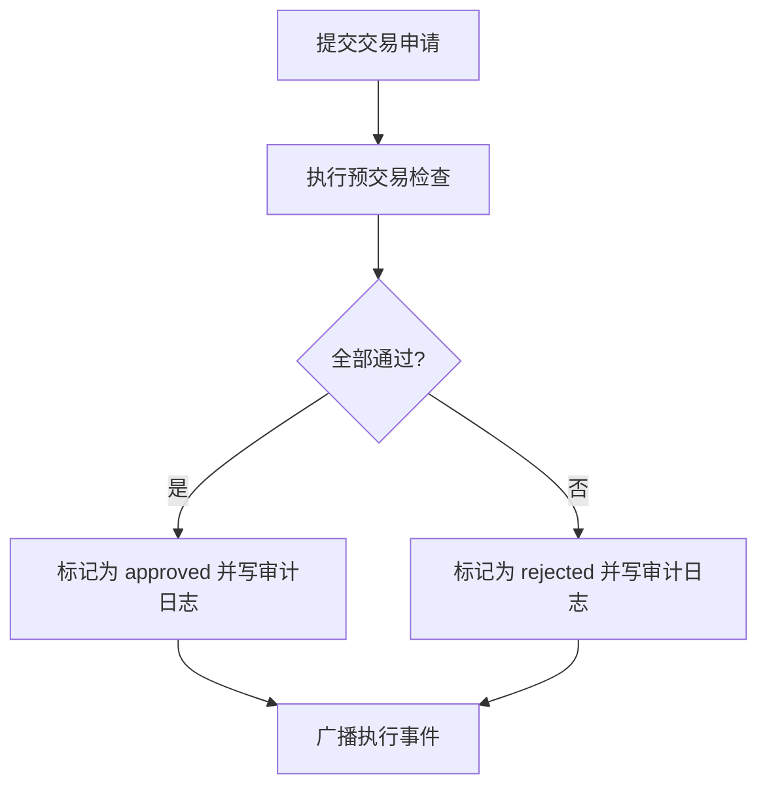
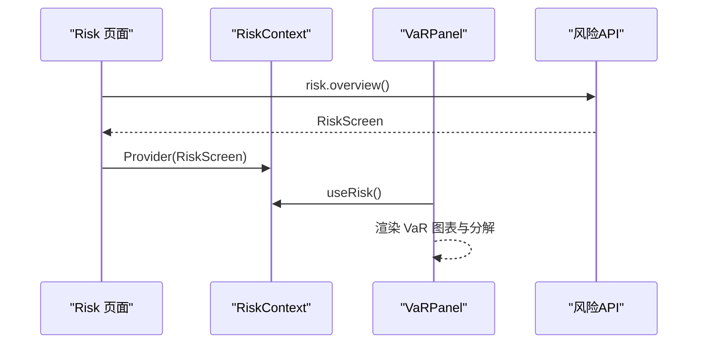
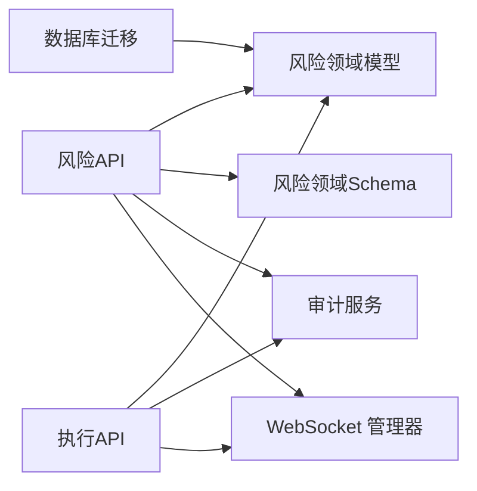

# 风控与熔断

<cite>
**本文引用的文件**
- [backend/app/api/v1/risk.py](file://backend/app/api/v1/risk.py)
- [backend/app/domains/risk/models.py](file://backend/app/domains/risk/models.py)
- [backend/app/domains/risk/schemas.py](file://backend/app/domains/risk/schemas.py)
- [backend/app/core/websocket.py](file://backend/app/core/websocket.py)
- [backend/app/services/audit_service.py](file://backend/app/services/audit_service.py)
- [backend/app/db/migrations/versions/20260513_000001_execution_risk_portfolio.py](file://backend/app/db/migrations/versions/20260513_000001_execution_risk_portfolio.py)
- [backend/app/api/v1/execution.py](file://backend/app/api/v1/execution.py)
- [frontend/src/screens/Risk/index.tsx](file://frontend/src/screens/Risk/index.tsx)
- [frontend/src/screens/Risk/VaRPanel.tsx](file://frontend/src/screens/Risk/VaRPanel.tsx)
- [frontend/src/contexts/RiskContext.tsx](file://frontend/src/contexts/RiskContext.tsx)
</cite>

## 目录
1. [简介](#简介)
2. [项目结构](#项目结构)
3. [核心组件](#核心组件)
4. [架构总览](#架构总览)
5. [详细组件分析](#详细组件分析)
6. [依赖分析](#依赖分析)
7. [性能考虑](#性能考虑)
8. [故障排查指南](#故障排查指南)
9. [结论](#结论)
10. [附录](#附录)

## 简介
本文件面向量化交易系统的风控与熔断子系统，围绕规则引擎、实时监控、熔断触发与恢复、审计与告警等能力进行系统化说明。重点覆盖以下方面：
- VaR 风险度量：日/周 VaR 的数据采集、滚动窗口展示与策略级分解
- 账户级、组合级、策略级风控：通过规则与检查点实现分层控制
- 熔断机制：L1–L4 多级熔断的配置、状态机与人工干预接口
- 审计与告警：基于哈希链的不可篡改审计日志，以及 WebSocket 实时事件广播
- 前端集成：风险看板的数据来源、可视化与交互流程

## 项目结构
风控与熔断功能由后端 API、领域模型与前端页面共同组成，采用“API 屏幕 + 领域模型 + 数据迁移 + 前端看板”的分层组织方式。

**图表来源**
- [backend/app/api/v1/risk.py:1-273](file://backend/app/api/v1/risk.py#L1-L273)
- [backend/app/domains/risk/models.py:1-101](file://backend/app/domains/risk/models.py#L1-L101)
- [backend/app/domains/risk/schemas.py:1-96](file://backend/app/domains/risk/schemas.py#L1-L96)
- [backend/app/core/websocket.py:1-45](file://backend/app/core/websocket.py#L1-L45)
- [backend/app/services/audit_service.py:1-109](file://backend/app/services/audit_service.py#L1-L109)
- [backend/app/db/migrations/versions/20260513_000001_execution_risk_portfolio.py:1-316](file://backend/app/db/migrations/versions/20260513_000001_execution_risk_portfolio.py#L1-L316)
- [backend/app/api/v1/execution.py:1-281](file://backend/app/api/v1/execution.py#L1-L281)
- [frontend/src/screens/Risk/index.tsx:1-45](file://frontend/src/screens/Risk/index.tsx#L1-L45)
- [frontend/src/screens/Risk/VaRPanel.tsx:1-120](file://frontend/src/screens/Risk/VaRPanel.tsx#L1-L120)
- [frontend/src/contexts/RiskContext.tsx:1-13](file://frontend/src/contexts/RiskContext.tsx#L1-L13)

**章节来源**
- [backend/app/api/v1/risk.py:1-273](file://backend/app/api/v1/risk.py#L1-L273)
- [backend/app/domains/risk/models.py:1-101](file://backend/app/domains/risk/models.py#L1-L101)
- [backend/app/domains/risk/schemas.py:1-96](file://backend/app/domains/risk/schemas.py#L1-L96)
- [backend/app/core/websocket.py:1-45](file://backend/app/core/websocket.py#L1-L45)
- [backend/app/services/audit_service.py:1-109](file://backend/app/services/audit_service.py#L1-L109)
- [backend/app/db/migrations/versions/20260513_000001_execution_risk_portfolio.py:1-316](file://backend/app/db/migrations/versions/20260513_000001_execution_risk_portfolio.py#L1-L316)
- [backend/app/api/v1/execution.py:1-281](file://backend/app/api/v1/execution.py#L1-L281)
- [frontend/src/screens/Risk/index.tsx:1-45](file://frontend/src/screens/Risk/index.tsx#L1-L45)
- [frontend/src/screens/Risk/VaRPanel.tsx:1-120](file://frontend/src/screens/Risk/VaRPanel.tsx#L1-L120)
- [frontend/src/contexts/RiskContext.tsx:1-13](file://frontend/src/contexts/RiskContext.tsx#L1-L13)

## 核心组件
- 风控规则引擎
  - 规则表：支持按作用域（账户/组合/策略/订单）定义指标、阈值与处置动作（告警/阻断/强停）
  - 检查记录：记录每次风控检查的结果与快照
- VaR 风险度量
  - 日/周 VaR 快照、置信度、历史滚动序列与策略级贡献分解
- 熔断系统
  - L1–L4 多级熔断配置、状态机与 24 小时触发次数统计
- 审计与告警
  - 基于 SHA-256 的不可篡改审计链；WebSocket 广播“风险事件”主题
- 执行侧风控
  - 预交易检查清单（如个股/行业集中度、单日亏损、净敞口、VaR 限额等）

**章节来源**
- [backend/app/domains/risk/models.py:9-101](file://backend/app/domains/risk/models.py#L9-L101)
- [backend/app/domains/risk/schemas.py:6-96](file://backend/app/domains/risk/schemas.py#L6-L96)
- [backend/app/api/v1/risk.py:39-273](file://backend/app/api/v1/risk.py#L39-L273)
- [backend/app/api/v1/execution.py:43-70](file://backend/app/api/v1/execution.py#L43-L70)
- [backend/app/services/audit_service.py:32-109](file://backend/app/services/audit_service.py#L32-L109)
- [backend/app/core/websocket.py:10-45](file://backend/app/core/websocket.py#L10-L45)

## 架构总览
风控与熔断系统以“API 屏幕 + 领域模型 + 数据库 + 前端看板”协同工作，形成闭环：
- 后端 API 聚合风险头部健康度、预算、VaR、熔断、策略决策流与违规事件
- 领域模型承载规则、检查、预算、VaR、熔断、违规与策略决策等实体
- 数据库迁移定义风险相关表结构及索引
- 审计服务提供不可篡改的审计链，配合 WebSocket 实时广播
- 前端通过上下文与看板组件渲染风险视图

**图表来源**
- [backend/app/api/v1/risk.py:188-273](file://backend/app/api/v1/risk.py#L188-L273)
- [backend/app/services/audit_service.py:38-81](file://backend/app/services/audit_service.py#L38-L81)
- [backend/app/core/websocket.py:27-41](file://backend/app/core/websocket.py#L27-L41)

**章节来源**
- [backend/app/api/v1/risk.py:188-273](file://backend/app/api/v1/risk.py#L188-L273)
- [frontend/src/screens/Risk/index.tsx:17-44](file://frontend/src/screens/Risk/index.tsx#L17-L44)

## 详细组件分析

### 风控规则引擎
- 设计要点
  - 作用域：account / portfolio / strategy / order
  - 指标：如 max_drawdown、daily_loss、position_limit、var 等
  - 处置：alert / block / kill_switch
  - 可启用/禁用，支持描述性说明
- 检查记录
  - 记录资源类型/ID、结果（pass/watch/fail）、结果色调、快照（JSON）
- 实现位置
  - 模型：[backend/app/domains/risk/models.py:9-32](file://backend/app/domains/risk/models.py#L9-L32)
  - Schema：[backend/app/domains/risk/schemas.py:1-22](file://backend/app/domains/risk/schemas.py#L1-L22)

**图表来源**
- [backend/app/domains/risk/models.py:9-32](file://backend/app/domains/risk/models.py#L9-L32)

**章节来源**
- [backend/app/domains/risk/models.py:9-32](file://backend/app/domains/risk/models.py#L9-L32)
- [backend/app/domains/risk/schemas.py:6-22](file://backend/app/domains/risk/schemas.py#L6-L22)

### VaR 风险度量
- 数据模型
  - VaRSnapshot：组合级日/周 VaR、置信度、时间戳
- API 能力
  - 获取 VaR 面板：最近 30 条历史、日/周 VaR、百分比 NAV、策略级分解
- 前端展示
  - 折线面积图、峰值标注、统计信息与策略级贡献条形图

**图表来源**
- [backend/app/api/v1/risk.py:91-116](file://backend/app/api/v1/risk.py#L91-L116)
- [backend/app/domains/risk/models.py:48-58](file://backend/app/domains/risk/models.py#L48-L58)

**章节来源**
- [backend/app/api/v1/risk.py:91-116](file://backend/app/api/v1/risk.py#L91-L116)
- [backend/app/domains/risk/models.py:48-58](file://backend/app/domains/risk/models.py#L48-L58)
- [frontend/src/screens/Risk/VaRPanel.tsx:1-120](file://frontend/src/screens/Risk/VaRPanel.tsx#L1-L120)

### 熔断系统（L1–L4）
- 配置与状态
  - 级别：L1/L2/L3/L4
  - 状态：armed / triggered / cooldown / disabled
  - 统计：24 小时触发次数、最近触发时间
- 接口
  - 手动触发：POST /risk/circuit-breakers/{level}/trigger
  - 请求恢复：POST /risk/circuit-breakers/{level}/recover
- 审计与广播
  - 触发/恢复均写入审计日志，并通过 WebSocket 广播到 “risk-events” 主题

**图表来源**
- [backend/app/api/v1/risk.py:210-273](file://backend/app/api/v1/risk.py#L210-L273)
- [backend/app/services/audit_service.py:38-81](file://backend/app/services/audit_service.py#L38-L81)
- [backend/app/core/websocket.py:27-41](file://backend/app/core/websocket.py#L27-L41)

**章节来源**
- [backend/app/api/v1/risk.py:119-135](file://backend/app/api/v1/risk.py#L119-L135)
- [backend/app/api/v1/risk.py:210-273](file://backend/app/api/v1/risk.py#L210-L273)
- [backend/app/domains/risk/models.py:60-73](file://backend/app/domains/risk/models.py#L60-L73)

### 审计与告警（不可篡改审计链）
- 特性
  - 追加式审计日志，每条记录包含前一条 curr_hash，形成哈希链
  - 支持链验证（verify_chain），返回校验是否有效、验证条数与首个破坏项
- 使用场景
  - 熔断触发/恢复、交易审批等关键操作均写入审计日志
- 前端联动
  - WebSocket 广播风险事件，前端订阅并更新界面

**图表来源**
- [backend/app/services/audit_service.py:38-81](file://backend/app/services/audit_service.py#L38-L81)
- [backend/app/core/websocket.py:27-41](file://backend/app/core/websocket.py#L27-L41)
- [backend/app/api/v1/risk.py:225-238](file://backend/app/api/v1/risk.py#L225-L238)

**章节来源**
- [backend/app/services/audit_service.py:32-109](file://backend/app/services/audit_service.py#L32-L109)
- [backend/app/api/v1/risk.py:225-238](file://backend/app/api/v1/risk.py#L225-L238)

### 执行侧风控（预交易检查）
- 预交易检查清单示例
  - 单票集中上限、行业集中上限、单日亏损限额、净敞口限额、VaR 限额
- 与风控看板的关系
  - 执行 API 中的静态检查清单体现了“账户级/组合级”风控的落地形态
- 审计与事件
  - 审批通过/拒绝会写入审计日志并通过 WebSocket 广播

**图表来源**
- [backend/app/api/v1/execution.py:43-70](file://backend/app/api/v1/execution.py#L43-L70)
- [backend/app/api/v1/execution.py:223-281](file://backend/app/api/v1/execution.py#L223-L281)

**章节来源**
- [backend/app/api/v1/execution.py:43-70](file://backend/app/api/v1/execution.py#L43-L70)
- [backend/app/api/v1/execution.py:223-281](file://backend/app/api/v1/execution.py#L223-L281)

### 前端集成与数据流
- 风险页入口
  - 初始化加载风险概览，渲染风险预算、VaR、熔断、策略流与违规历史
- VaR 面板
  - 基于 RiskContext 提供的数据绘制折线图、统计值与策略级分解
- 风控上下文
  - 提供风险数据的 Provider 与 Hook，确保组件可访问全局风险状态

**图表来源**
- [frontend/src/screens/Risk/index.tsx:17-44](file://frontend/src/screens/Risk/index.tsx#L17-L44)
- [frontend/src/contexts/RiskContext.tsx:1-13](file://frontend/src/contexts/RiskContext.tsx#L1-L13)
- [frontend/src/screens/Risk/VaRPanel.tsx:1-120](file://frontend/src/screens/Risk/VaRPanel.tsx#L1-L120)

**章节来源**
- [frontend/src/screens/Risk/index.tsx:17-44](file://frontend/src/screens/Risk/index.tsx#L17-L44)
- [frontend/src/contexts/RiskContext.tsx:1-13](file://frontend/src/contexts/RiskContext.tsx#L1-L13)
- [frontend/src/screens/Risk/VaRPanel.tsx:1-120](file://frontend/src/screens/Risk/VaRPanel.tsx#L1-L120)

## 依赖分析
- 表结构与索引
  - 风控相关表：risk_rules、risk_checks、risk_budgets、var_snapshots、circuit_breakers、risk_breaches、policy_decisions
  - 执行与组合相关表：approvals、orders、fills、execution_metrics、pre_trade_checks、agent_traces、portfolios、accounts、positions、cash_balances、nav_snapshots、rebalance_proposals
- 关键依赖
  - 风控 API 依赖领域模型与 Schema
  - 审计服务独立于业务，但被风控与执行 API 调用
  - WebSocket 管理器被风控 API 用于广播熔断事件

**图表来源**
- [backend/app/api/v1/risk.py:1-273](file://backend/app/api/v1/risk.py#L1-L273)
- [backend/app/domains/risk/models.py:1-101](file://backend/app/domains/risk/models.py#L1-L101)
- [backend/app/domains/risk/schemas.py:1-96](file://backend/app/domains/risk/schemas.py#L1-L96)
- [backend/app/services/audit_service.py:1-109](file://backend/app/services/audit_service.py#L1-L109)
- [backend/app/core/websocket.py:1-45](file://backend/app/core/websocket.py#L1-L45)
- [backend/app/db/migrations/versions/20260513_000001_execution_risk_portfolio.py:1-316](file://backend/app/db/migrations/versions/20260513_000001_execution_risk_portfolio.py#L1-L316)
- [backend/app/api/v1/execution.py:1-281](file://backend/app/api/v1/execution.py#L1-L281)

**章节来源**
- [backend/app/db/migrations/versions/20260513_000001_execution_risk_portfolio.py:127-218](file://backend/app/db/migrations/versions/20260513_000001_execution_risk_portfolio.py#L127-L218)

## 性能考虑
- 数据查询优化
  - 风控 API 对关键表使用索引字段排序与 LIMIT 控制返回规模（如 VaR 最近 30 条、熔断按级别排序）
- 实时事件广播
  - WebSocket 广播仅针对活跃连接，异常连接会被清理，避免广播风暴
- 审计链验证
  - verify_chain 支持限制验证条数，避免大规模扫描带来的性能问题

[本节为通用建议，不直接分析具体文件]

## 故障排查指南
- 熔断接口错误
  - 触发/恢复接口返回 404：指定级别不存在
  - 恢复接口返回 409：熔断未处于触发状态
- 审计链问题
  - verify_chain 返回失败：检查最新记录的 curr_hash 是否与前序 prev_hash 计算一致
- WebSocket 事件未到达
  - 检查连接是否建立、topic 是否正确订阅（如 “risk-events”）

**章节来源**
- [backend/app/api/v1/risk.py:210-273](file://backend/app/api/v1/risk.py#L210-L273)
- [backend/app/services/audit_service.py:83-109](file://backend/app/services/audit_service.py#L83-L109)
- [backend/app/core/websocket.py:16-41](file://backend/app/core/websocket.py#L16-L41)

## 结论
该风控与熔断系统通过规则引擎、VaR 度量、多级熔断与不可篡改审计链，实现了从账户级到策略级的全链路风险控制。结合 WebSocket 实时广播与前端看板，形成了可观测、可追溯、可干预的安全体系。后续可在规则动态下发、策略级 VaR 分解算法、熔断阈值自适应等方面持续演进。

[本节为总结性内容，不直接分析具体文件]

## 附录
- 数据模型一览（与迁移脚本对应）
  - 风控表：risk_rules、risk_checks、risk_budgets、var_snapshots、circuit_breakers、risk_breaches、policy_decisions
  - 执行表：approvals、orders、fills、execution_metrics、pre_trade_checks、agent_traces
  - 组合表：portfolios、accounts、positions、cash_balances、nav_snapshots、rebalance_proposals

**章节来源**
- [backend/app/db/migrations/versions/20260513_000001_execution_risk_portfolio.py:127-291](file://backend/app/db/migrations/versions/20260513_000001_execution_risk_portfolio.py#L127-L291)