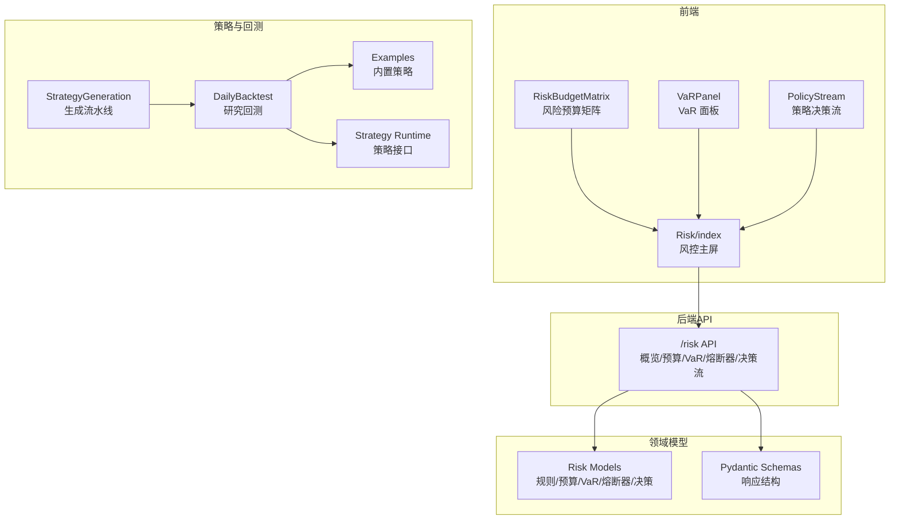
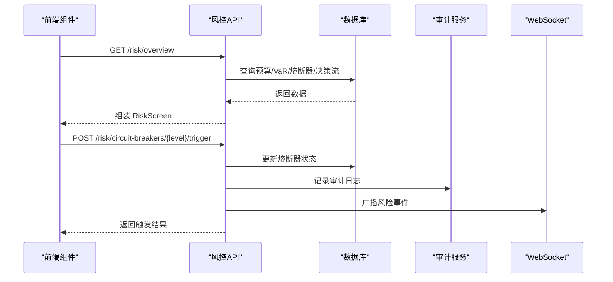
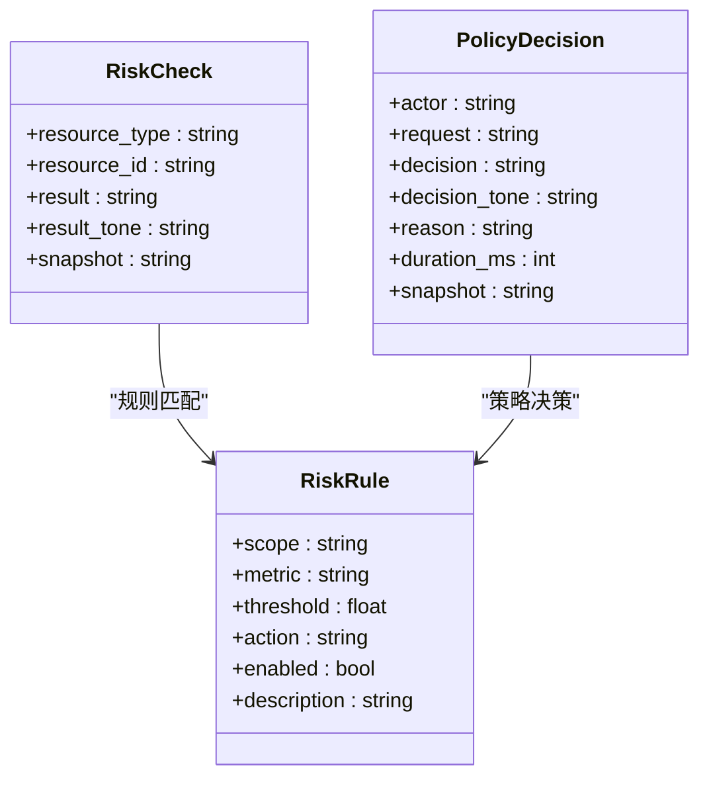
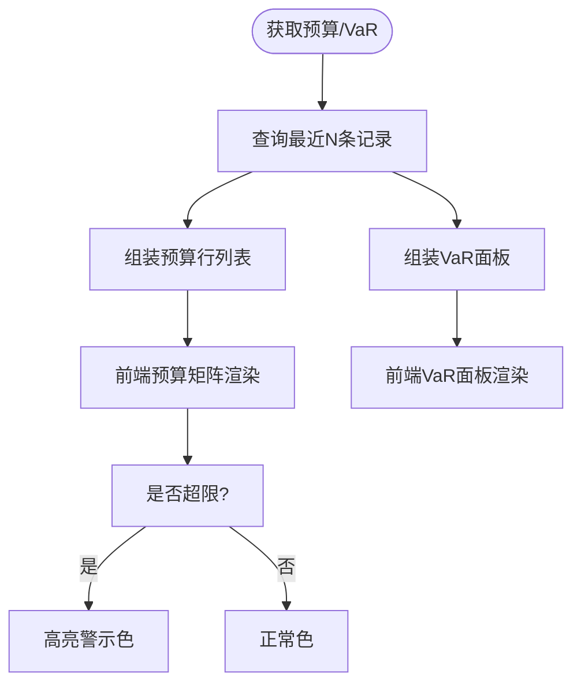
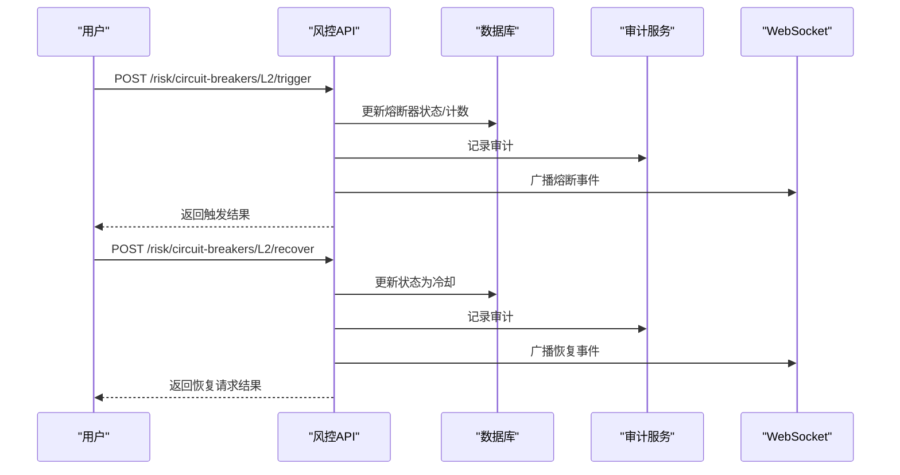
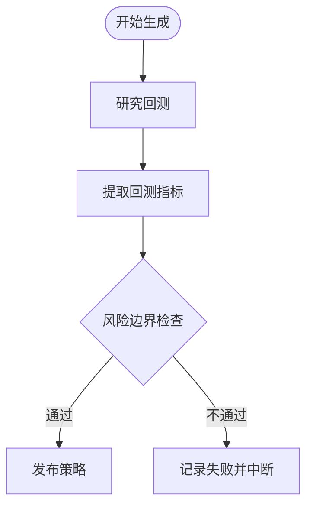
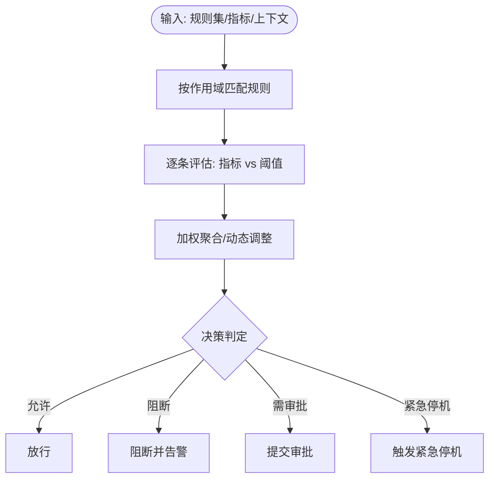
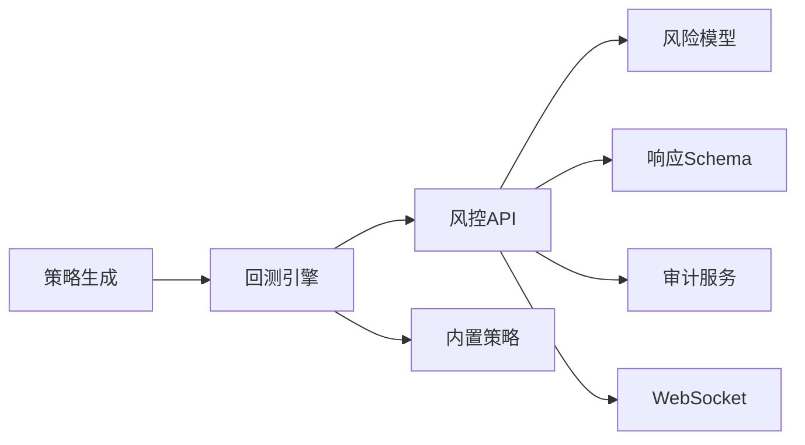

# 风控规则引擎

<cite>
**本文档引用的文件**
- [backend/app/api/v1/risk.py](file://backend/app/api/v1/risk.py)
- [backend/app/domains/risk/models.py](file://backend/app/domains/risk/models.py)
- [backend/app/domains/risk/schemas.py](file://backend/app/domains/risk/schemas.py)
- [backend/app/services/strategy_generation.py](file://backend/app/services/strategy_generation.py)
- [backend/app/domains/strategy/runtime.py](file://backend/app/domains/strategy/runtime.py)
- [backend/app/domains/strategy/examples.py](file://backend/app/domains/strategy/examples.py)
- [backend/app/services/daily_backtest.py](file://backend/app/services/daily_backtest.py)
- [frontend/src/screens/Risk/RiskBudgetMatrix.tsx](file://frontend/src/screens/Risk/RiskBudgetMatrix.tsx)
- [frontend/src/screens/Risk/VaRPanel.tsx](file://frontend/src/screens/Risk/VaRPanel.tsx)
- [frontend/src/screens/Risk/PolicyStream.tsx](file://frontend/src/screens/Risk/PolicyStream.tsx)
- [frontend/src/screens/Risk/index.tsx](file://frontend/src/screens/Risk/index.tsx)
- [backend/scripts/seed_dev_data.py](file://backend/scripts/seed_dev_data.py)
- [doc/07-后端项目设计说明书.md](file://doc/07-后端项目设计说明书.md)
</cite>

## 目录
1. [简介](#简介)
2. [项目结构](#项目结构)
3. [核心组件](#核心组件)
4. [架构总览](#架构总览)
5. [详细组件分析](#详细组件分析)
6. [依赖关系分析](#依赖关系分析)
7. [性能考虑](#性能考虑)
8. [故障排查指南](#故障排查指南)
9. [结论](#结论)
10. [附录](#附录)

## 简介
本文件面向量化风控系统中的“规则引擎”子系统，系统性阐述风控规则的定义、存储与执行机制，覆盖规则类型分类（账户级、组合级、策略级）、规则评估逻辑与决策流程，并结合现有代码库中的风险预算、VaR、熔断器与策略生成阶段的风险检查，给出可操作的规则配置示例、评估函数实现思路与性能优化策略。目标是帮助开发者快速理解并扩展风控规则引擎。

## 项目结构
风控相关能力主要分布在以下层次：
- 后端API层：提供风控概览、预算、VaR、熔断器与策略决策流等接口
- 领域模型层：定义风险规则、检查记录、预算、VaR快照、熔断器、违规事件与策略决策等数据模型
- 前端展示层：以组件形式渲染风险预算矩阵、VaR面板、策略决策流与违规历史
- 策略生成与回测：在策略生成流水线中进行风险边界检查，作为发布前置条件

图表来源
- [backend/app/api/v1/risk.py:188-207](file://backend/app/api/v1/risk.py#L188-L207)
- [backend/app/domains/risk/models.py:9-101](file://backend/app/domains/risk/models.py#L9-L101)
- [backend/app/domains/risk/schemas.py:6-96](file://backend/app/domains/risk/schemas.py#L6-L96)
- [backend/app/services/strategy_generation.py:264-278](file://backend/app/services/strategy_generation.py#L264-L278)
- [backend/app/domains/strategy/runtime.py:175-203](file://backend/app/domains/strategy/runtime.py#L175-L203)
- [backend/app/services/daily_backtest.py:185-200](file://backend/app/services/daily_backtest.py#L185-L200)
- [backend/app/domains/strategy/examples.py:51-200](file://backend/app/domains/strategy/examples.py#L51-L200)

章节来源
- [backend/app/api/v1/risk.py:188-207](file://backend/app/api/v1/risk.py#L188-L207)
- [backend/app/domains/risk/models.py:9-101](file://backend/app/domains/risk/models.py#L9-L101)
- [backend/app/domains/risk/schemas.py:6-96](file://backend/app/domains/risk/schemas.py#L6-L96)
- [frontend/src/screens/Risk/index.tsx:17-44](file://frontend/src/screens/Risk/index.tsx#L17-L44)

## 核心组件
- 风控规则模型：支持按作用域（账户/组合/策略/订单）定义阈值型规则，包含启用状态与动作（告警/阻断/紧急停机）
- 风控预算模型：记录组合维度的预算占用与限额，用于实时监控与预警
- VaR 快照模型：保存滚动窗口的日/周VaR及置信度，支撑风险限额与压力场景评估
- 熔断器模型：分级熔断器（L1-L4），支持手动触发与恢复请求
- 策略决策日志：记录策略引擎对请求的决策（允许/拒绝/审批/修改）及其原因与时长
- 风控API：聚合风控概览、预算、VaR、熔断器与策略决策流，提供统一入口
- 前端组件：风险预算矩阵、VaR面板、策略决策流与违规历史，直观呈现风控状态

章节来源
- [backend/app/domains/risk/models.py:9-101](file://backend/app/domains/risk/models.py#L9-L101)
- [backend/app/domains/risk/schemas.py:6-96](file://backend/app/domains/risk/schemas.py#L6-L96)
- [backend/app/api/v1/risk.py:39-273](file://backend/app/api/v1/risk.py#L39-L273)
- [frontend/src/screens/Risk/RiskBudgetMatrix.tsx:1-56](file://frontend/src/screens/Risk/RiskBudgetMatrix.tsx#L1-L56)
- [frontend/src/screens/Risk/VaRPanel.tsx:1-119](file://frontend/src/screens/Risk/VaRPanel.tsx#L1-L119)
- [frontend/src/screens/Risk/PolicyStream.tsx:1-69](file://frontend/src/screens/Risk/PolicyStream.tsx#L1-L69)

## 架构总览
风控规则引擎在系统中的位置与交互如下：

图表来源
- [backend/app/api/v1/risk.py:188-207](file://backend/app/api/v1/risk.py#L188-L207)
- [backend/app/api/v1/risk.py:210-239](file://backend/app/api/v1/risk.py#L210-L239)
- [backend/app/api/v1/risk.py:242-272](file://backend/app/api/v1/risk.py#L242-L272)

## 详细组件分析

### 风控规则模型与作用域
- 规则定义：scope（账户/组合/策略/订单）、metric（如最大回撤、日损失、持仓限制、VaR）、阈值、动作（告警/阻断/紧急停机）、启用状态
- 评估逻辑：基于资源类型与ID进行规则匹配，比较指标值与阈值，输出通过/观察/失败
- 执行流程：在策略生成、下单或组合层面触发检查，依据规则动作决定后续处理

图表来源
- [backend/app/domains/risk/models.py:9-101](file://backend/app/domains/risk/models.py#L9-L101)

章节来源
- [backend/app/domains/risk/models.py:9-31](file://backend/app/domains/risk/models.py#L9-L31)
- [backend/app/domains/risk/models.py:89-101](file://backend/app/domains/risk/models.py#L89-L101)

### 风控预算与VaR
- 风控预算：按组合维度记录限额与使用量，支持单位（绝对/权重/比例）与颜色标记（安全/注意/临界）
- VaR 快照：保存日/周VaR与置信度，支持历史滚动序列与策略级分解
- 前端预算矩阵：根据使用率与限额计算进度条宽度，超过限额时显示溢出标识
- 前端VaR面板：绘制30日滚动曲线，展示峰值、均值与方差统计，支持策略级贡献分解

图表来源
- [backend/app/api/v1/risk.py:74-116](file://backend/app/api/v1/risk.py#L74-L116)
- [frontend/src/screens/Risk/RiskBudgetMatrix.tsx:22-51](file://frontend/src/screens/Risk/RiskBudgetMatrix.tsx#L22-L51)
- [frontend/src/screens/Risk/VaRPanel.tsx:15-21](file://frontend/src/screens/Risk/VaRPanel.tsx#L15-L21)

章节来源
- [backend/app/api/v1/risk.py:74-116](file://backend/app/api/v1/risk.py#L74-L116)
- [frontend/src/screens/Risk/RiskBudgetMatrix.tsx:1-56](file://frontend/src/screens/Risk/RiskBudgetMatrix.tsx#L1-L56)
- [frontend/src/screens/Risk/VaRPanel.tsx:1-119](file://frontend/src/screens/Risk/VaRPanel.tsx#L1-L119)
- [backend/scripts/seed_dev_data.py:128-179](file://backend/scripts/seed_dev_data.py#L128-L179)

### 熔断器与策略决策流
- 熔断器：分级（L1-L4），支持手动触发与恢复请求，记录24小时触发次数与最后触发时间
- 策略决策流：记录最近N笔策略引擎的决策，包含耗时、原因与决策标签（允许/拒绝/审批/修改）

图表来源
- [backend/app/api/v1/risk.py:210-239](file://backend/app/api/v1/risk.py#L210-L239)
- [backend/app/api/v1/risk.py:242-272](file://backend/app/api/v1/risk.py#L242-L272)

章节来源
- [backend/app/api/v1/risk.py:210-272](file://backend/app/api/v1/risk.py#L210-L272)
- [frontend/src/screens/Risk/PolicyStream.tsx:17-69](file://frontend/src/screens/Risk/PolicyStream.tsx#L17-L69)

### 策略生成流水线中的风险检查
- 在策略生成流水线中，完成研究回测后进行风险边界检查，依据最大回撤与夏普比率与风险画像设定的上限进行判定
- 若不满足风险边界，则中断流水线并记录失败阶段

图表来源
- [backend/app/services/strategy_generation.py:264-278](file://backend/app/services/strategy_generation.py#L264-L278)
- [backend/app/services/strategy_generation.py:516-518](file://backend/app/services/strategy_generation.py#L516-L518)

章节来源
- [backend/app/services/strategy_generation.py:264-278](file://backend/app/services/strategy_generation.py#L264-L278)
- [backend/app/services/strategy_generation.py:516-518](file://backend/app/services/strategy_generation.py#L516-L518)

### 风控规则类型与评估逻辑
- 账户级规则：针对账户维度的指标（如单日亏损、最大回撤）进行阈值判断
- 组合级规则：针对组合维度的集中度、净敞口等进行限额控制
- 策略级规则：针对策略层面的参数或信号强度进行约束
- 订单级规则：针对单笔订单的规模、价格偏离等进行拦截

评估流程（概念性）：
- 输入：规则集合、当前指标值、资源上下文
- 处理：按作用域匹配规则，比较指标与阈值，叠加权重与优先级
- 输出：决策（允许/阻断/需审批/紧急停机），并记录检查快照

（该图为概念流程，不直接映射具体源码文件）

## 依赖关系分析
- API 层依赖领域模型与Pydantic Schema进行数据转换与响应封装
- 风控预算与VaR依赖数据库快照表；熔断器与策略决策依赖审计与WebSocket广播
- 策略生成流水线依赖回测引擎与内置策略，将风险检查作为发布前置条件

图表来源
- [backend/app/api/v1/risk.py:13-26](file://backend/app/api/v1/risk.py#L13-L26)
- [backend/app/services/strategy_generation.py:207-228](file://backend/app/services/strategy_generation.py#L207-L228)
- [backend/app/services/daily_backtest.py:185-200](file://backend/app/services/daily_backtest.py#L185-L200)
- [backend/app/domains/strategy/examples.py:51-200](file://backend/app/domains/strategy/examples.py#L51-L200)

章节来源
- [backend/app/api/v1/risk.py:13-26](file://backend/app/api/v1/risk.py#L13-L26)
- [backend/app/services/strategy_generation.py:207-228](file://backend/app/services/strategy_generation.py#L207-L228)

## 性能考虑
- 数据访问优化
  - 风控概览接口采用分页与索引查询，避免全表扫描
  - 预算/VaR查询限制返回条数，前端按需加载
- 渲染优化
  - 前端预算矩阵与VaR面板采用预计算百分比与SVG路径，减少重复计算
- 流水线优化
  - 回测与风险检查在生成阶段尽早失败，避免后续昂贵步骤
- 存储与索引
  - 规则与熔断器关键字段建立索引，提升匹配效率

（本节为通用性能建议，不直接分析具体文件）

## 故障排查指南
- 熔断器状态异常
  - 确认熔断器级别是否存在，检查状态流转（已触发/冷却/已武装）
  - 查看审计日志确认人工触发/恢复请求
- 风控预算超限
  - 检查预算限额与使用量，关注单位与颜色标记
  - 结合VaR面板峰值与滚动趋势定位风险来源
- 策略决策流异常
  - 查看最近决策记录的耗时与原因，识别高频拒绝/审批请求
- 生成流水线失败
  - 根据失败阶段定位（回测/验证/风险），核对回测指标与风险边界

章节来源
- [backend/app/api/v1/risk.py:210-272](file://backend/app/api/v1/risk.py#L210-L272)
- [frontend/src/screens/Risk/PolicyStream.tsx:17-69](file://frontend/src/screens/Risk/PolicyStream.tsx#L17-L69)
- [backend/app/services/strategy_generation.py:308-372](file://backend/app/services/strategy_generation.py#L308-L372)

## 结论
本风控规则引擎以“规则+预算+VaR+熔断器+策略决策流”的组合实现全面的风险控制能力。通过清晰的作用域划分与阈值驱动的评估逻辑，配合可视化前端与审计/广播集成，既满足实时风控需求，又便于扩展新的规则类型与评估函数。建议在实际落地中完善规则权重与动态调整机制，并持续优化数据访问与渲染性能。

## 附录

### 风控规则配置示例（概念性）
- 账户级：单日亏损限额（绝对值），阈值0.05，动作阻断
- 组合级：最大回撤限额（绝对值），阈值0.2，动作告警
- 策略级：单票集中上限（权重），阈值0.1，动作需审批
- 订单级：价格偏离阈值（比例），阈值0.02，动作阻断

（本节为示例说明，不直接分析具体文件）

### 风险预算分配算法与动态调整（概念性）
- 预算分配：基于组合历史表现与市场环境，按策略/资产类别设定限额
- 动态调整：根据VaR滚动趋势与市场波动率，定期或事件触发调整限额
- 权重计算：将规则动作与权重系数结合，形成综合决策

（本节为方法论说明，不直接分析具体文件）

### 数据模型概览
- 风控规则：scope、metric、threshold、action、enabled
- 风控检查：resource_type、resource_id、result、snapshot
- 风控预算：portfolio_id、metric、limit_value、used_value、unit、tone
- VaR 快照：portfolio_id、ts、daily_var、weekly_var、confidence
- 熔断器：level、name、trigger、action、status、status_tone、triggers24h、last_trigger
- 违规事件：severity、title、detail、resolution、status、status_tone
- 策略决策：actor、request、decision、decision_tone、reason、duration_ms、snapshot

章节来源
- [doc/07-后端项目设计说明书.md:489-518](file://doc/07-后端项目设计说明书.md#L489-L518)
- [backend/app/domains/risk/models.py:9-101](file://backend/app/domains/risk/models.py#L9-L101)