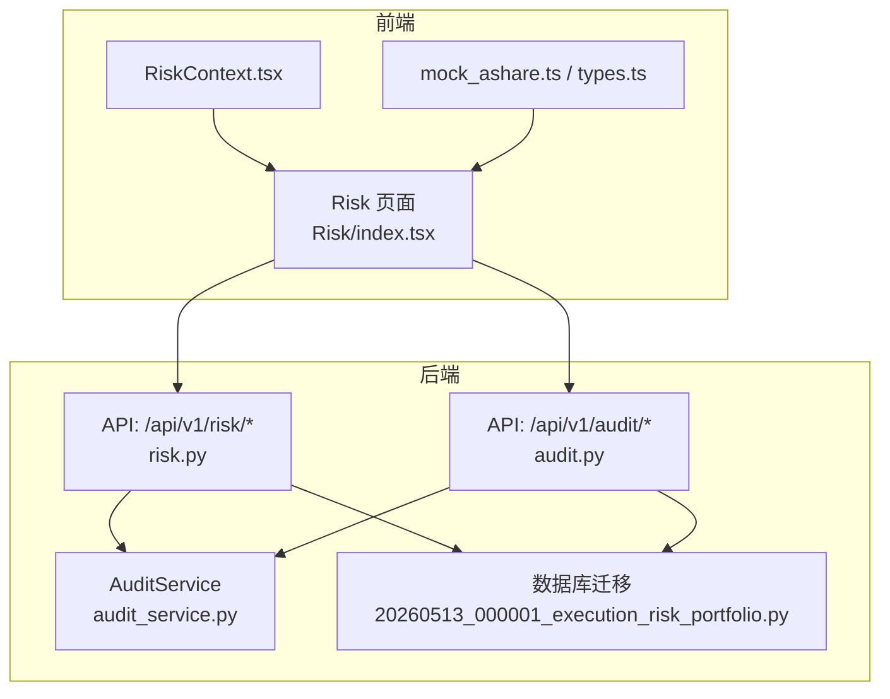
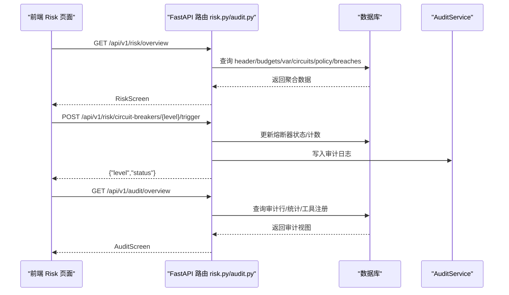
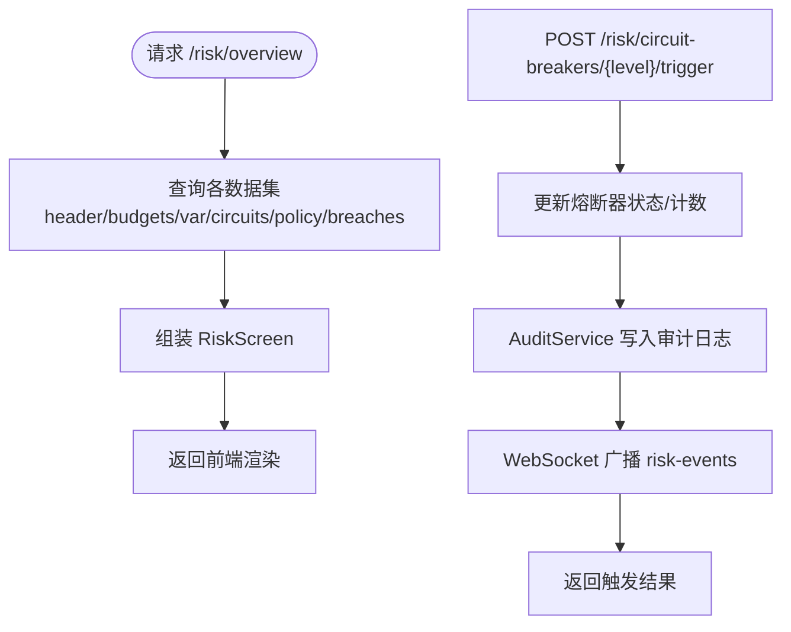
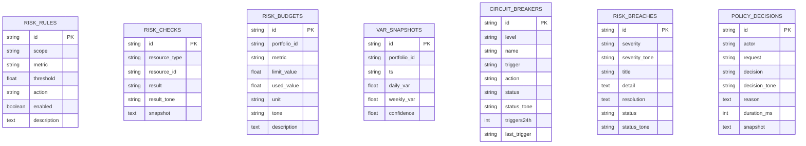
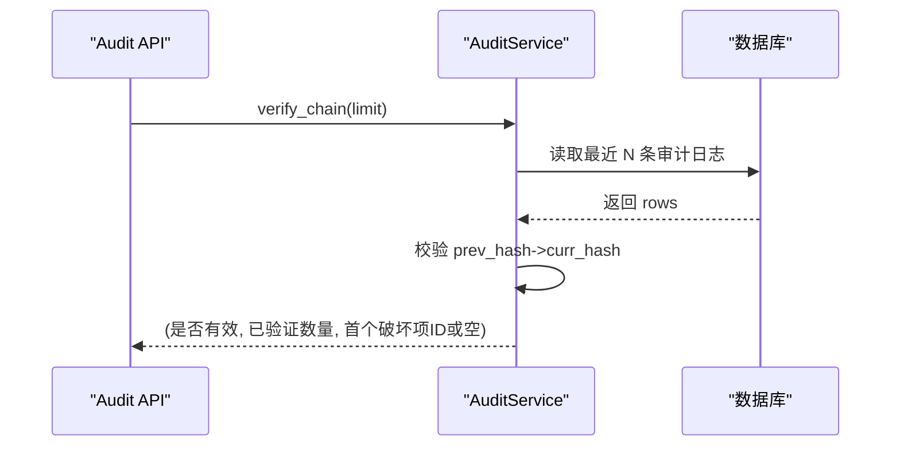
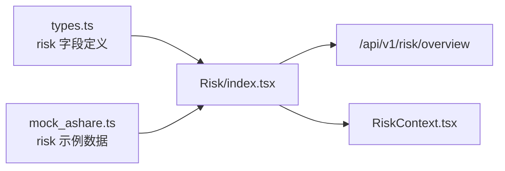
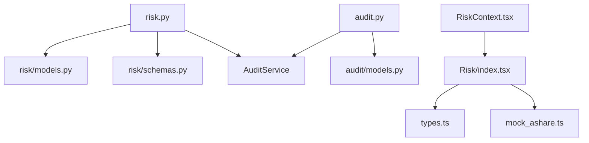

# 风险违规与报警

<cite>
**本文引用的文件**
- [backend/app/api/v1/risk.py](file://backend/app/api/v1/risk.py)
- [backend/app/domains/risk/models.py](file://backend/app/domains/risk/models.py)
- [backend/app/domains/risk/schemas.py](file://backend/app/domains/risk/schemas.py)
- [backend/app/api/v1/audit.py](file://backend/app/api/v1/audit.py)
- [backend/app/domains/audit/models.py](file://backend/app/domains/audit/models.py)
- [backend/app/services/audit_service.py](file://backend/app/services/audit_service.py)
- [backend/app/db/migrations/versions/20260513_000001_execution_risk_portfolio.py](file://backend/app/db/migrations/versions/20260513_000001_execution_risk_portfolio.py)
- [frontend/src/screens/Risk/index.tsx](file://frontend/src/screens/Risk/index.tsx)
- [frontend/src/contexts/RiskContext.tsx](file://frontend/src/contexts/RiskContext.tsx)
- [frontend/src/data/types.ts](file://frontend/src/data/types.ts)
- [frontend/src/data/mock_ashare.ts](file://frontend/src/data/mock_ashare.ts)
</cite>

## 目录
1. [简介](#简介)
2. [项目结构](#项目结构)
3. [核心组件](#核心组件)
4. [架构总览](#架构总览)
5. [详细组件分析](#详细组件分析)
6. [依赖分析](#依赖分析)
7. [性能考虑](#性能考虑)
8. [故障排查指南](#故障排查指南)
9. [结论](#结论)
10. [附录](#附录)

## 简介
本文件面向风险违规与报警系统，围绕风险规则、违规事件、熔断器、VaR、策略决策与审计追踪等能力，提供从数据库模型、API接口、前端展示到应急处置的全生命周期管理说明。重点覆盖：
- 风险违规检测与事件分级
- 报警级别划分与通知机制
- 违规事件分类、严重程度评估与自动处理流程
- 报警规则配置、通知渠道设置与处理状态跟踪
- 与策略引擎、执行系统、审计系统的集成路径

## 项目结构
后端采用 FastAPI + SQLAlchemy 异步 ORM，前端使用 React + TypeScript。风险域位于 backend/app/domains/risk，审计域位于 backend/app/domains/audit，API 路由分别在 backend/app/api/v1/risk.py 与 audit.py。

图表来源
- [frontend/src/screens/Risk/index.tsx:17-44](file://frontend/src/screens/Risk/index.tsx#L17-L44)
- [frontend/src/contexts/RiskContext.tsx:1-13](file://frontend/src/contexts/RiskContext.tsx#L1-L13)
- [frontend/src/data/types.ts:317-386](file://frontend/src/data/types.ts#L317-L386)
- [backend/app/api/v1/risk.py:1-273](file://backend/app/api/v1/risk.py#L1-L273)
- [backend/app/api/v1/audit.py:1-258](file://backend/app/api/v1/audit.py#L1-L258)
- [backend/app/services/audit_service.py:1-109](file://backend/app/services/audit_service.py#L1-L109)
- [backend/app/db/migrations/versions/20260513_000001_execution_risk_portfolio.py:127-218](file://backend/app/db/migrations/versions/20260513_000001_execution_risk_portfolio.py#L127-L218)

章节来源
- [backend/app/api/v1/risk.py:1-273](file://backend/app/api/v1/risk.py#L1-L273)
- [backend/app/api/v1/audit.py:1-258](file://backend/app/api/v1/audit.py#L1-L258)
- [backend/app/services/audit_service.py:1-109](file://backend/app/services/audit_service.py#L1-L109)
- [backend/app/domains/risk/models.py:1-101](file://backend/app/domains/risk/models.py#L1-L101)
- [backend/app/domains/audit/models.py:1-51](file://backend/app/domains/audit/models.py#L1-L51)
- [frontend/src/screens/Risk/index.tsx:17-44](file://frontend/src/screens/Risk/index.tsx#L17-L44)
- [frontend/src/contexts/RiskContext.tsx:1-13](file://frontend/src/contexts/RiskContext.tsx#L1-L13)
- [frontend/src/data/types.ts:317-386](file://frontend/src/data/types.ts#L317-L386)
- [frontend/src/data/mock_ashare.ts:317-386](file://frontend/src/data/mock_ashare.ts#L317-L386)

## 核心组件
- 风险规则与检查
  - 风险规则：scope（账户/组合/策略/订单）、metric（指标类型）、阈值、动作（告警/阻断/熔断）、启用状态、描述
  - 风险检查：资源类型/ID、结果（通过/关注/失败）、结果色调、快照
  - 风险预算：组合维度的预算分配与使用、单位、色调、描述
  - VaR 快照：日/周 VaR、置信度
  - 熔断器：等级、名称、触发条件、动作、状态（已装弹/已触发/冷却/禁用）、24 小时触发次数、最近触发时间
  - 违规事件：严重程度（致命/高/中/低）、标题、详情、处置建议、状态（已解决/进行中/复审）、色调
  - 策略决策：执行主体、请求、决策（允许/拒绝/审批/修改）、原因、耗时、快照
- 审计与合规
  - 审计日志：不可变追加、带哈希链，支持完整性校验
  - 幽灵幂等键：重复请求防护
  - 事件出站：可靠事件发布

章节来源
- [backend/app/domains/risk/models.py:9-101](file://backend/app/domains/risk/models.py#L9-L101)
- [backend/app/domains/audit/models.py:9-51](file://backend/app/domains/audit/models.py#L9-L51)

## 架构总览
风险与报警体系由“规则配置—实时检查—违规记录—熔断处置—审计追踪”构成闭环，前端通过 API 获取风险总览与事件流，后端通过数据库持久化与审计服务保障可追溯性。

图表来源
- [backend/app/api/v1/risk.py:188-273](file://backend/app/api/v1/risk.py#L188-L273)
- [backend/app/api/v1/audit.py:153-168](file://backend/app/api/v1/audit.py#L153-L168)
- [backend/app/services/audit_service.py:32-82](file://backend/app/services/audit_service.py#L32-L82)

## 详细组件分析

### 风控 API 与数据聚合
- 风控总览接口返回 RiskScreen，包含健康分、KPI、预算、VaR、熔断器、策略决策流、违规历史等
- 熔断器手动触发/恢复接口支持人工干预，并写入审计日志与 WebSocket 广播

图表来源
- [backend/app/api/v1/risk.py:188-273](file://backend/app/api/v1/risk.py#L188-L273)
- [backend/app/services/audit_service.py:32-82](file://backend/app/services/audit_service.py#L32-L82)

章节来源
- [backend/app/api/v1/risk.py:188-273](file://backend/app/api/v1/risk.py#L188-L273)

### 风险规则与违规事件
- 风险规则表定义 scope/metric/threshold/action/enabled/description，用于配置不同粒度的风险阈值与处置动作
- 违规事件表记录严重程度、标题、详情、处置建议、状态与色调，支持按严重程度与状态索引
- 熔断器表定义 L1-L4 等级、触发条件、动作与状态机，支持 24 小时触发计数与最近触发时间

图表来源
- [backend/app/db/migrations/versions/20260513_000001_execution_risk_portfolio.py:127-218](file://backend/app/db/migrations/versions/20260513_000001_execution_risk_portfolio.py#L127-L218)
- [backend/app/domains/risk/models.py:9-101](file://backend/app/domains/risk/models.py#L9-L101)

章节来源
- [backend/app/domains/risk/models.py:9-101](file://backend/app/domains/risk/models.py#L9-L101)
- [backend/app/db/migrations/versions/20260513_000001_execution_risk_portfolio.py:127-218](file://backend/app/db/migrations/versions/20260513_000001_execution_risk_portfolio.py#L127-L218)

### 审计与合规
- 审计日志采用不可变追加模式，每条记录计算 SHA-256 哈希并与前一条形成链，支持完整性校验
- 提供审计总览、分页查询、演员统计、工具注册、HITL 规则、哈希链验证与 CSV 导出

图表来源
- [backend/app/api/v1/audit.py:198-212](file://backend/app/api/v1/audit.py#L198-L212)
- [backend/app/services/audit_service.py:83-109](file://backend/app/services/audit_service.py#L83-L109)

章节来源
- [backend/app/api/v1/audit.py:153-258](file://backend/app/api/v1/audit.py#L153-L258)
- [backend/app/services/audit_service.py:1-109](file://backend/app/services/audit_service.py#L1-L109)
- [backend/app/domains/audit/models.py:9-51](file://backend/app/domains/audit/models.py#L9-L51)

### 前端集成与数据契约
- 前端 Risk 页面通过 API 获取 RiskScreen，使用 RiskContext 提供上下文数据，组件按模块渲染
- 类型定义中明确风险域字段，包括 header/kpis/budgets/var/circuits/policyStream/breaches

图表来源
- [frontend/src/screens/Risk/index.tsx:17-44](file://frontend/src/screens/Risk/index.tsx#L17-L44)
- [frontend/src/contexts/RiskContext.tsx:1-13](file://frontend/src/contexts/RiskContext.tsx#L1-L13)
- [frontend/src/data/types.ts:317-386](file://frontend/src/data/types.ts#L317-L386)
- [frontend/src/data/mock_ashare.ts:317-386](file://frontend/src/data/mock_ashare.ts#L317-L386)

章节来源
- [frontend/src/screens/Risk/index.tsx:17-44](file://frontend/src/screens/Risk/index.tsx#L17-L44)
- [frontend/src/contexts/RiskContext.tsx:1-13](file://frontend/src/contexts/RiskContext.tsx#L1-L13)
- [frontend/src/data/types.ts:317-386](file://frontend/src/data/types.ts#L317-L386)
- [frontend/src/data/mock_ashare.ts:317-386](file://frontend/src/data/mock_ashare.ts#L317-L386)

## 依赖分析
- 风控 API 依赖数据库模型与审计服务；审计 API 依赖审计服务与数据库模型
- 前端依赖类型定义与示例数据，通过上下文共享风险数据

图表来源
- [backend/app/api/v1/risk.py:1-273](file://backend/app/api/v1/risk.py#L1-L273)
- [backend/app/domains/risk/models.py:1-101](file://backend/app/domains/risk/models.py#L1-L101)
- [backend/app/domains/risk/schemas.py:1-96](file://backend/app/domains/risk/schemas.py#L1-L96)
- [backend/app/api/v1/audit.py:1-258](file://backend/app/api/v1/audit.py#L1-L258)
- [backend/app/domains/audit/models.py:1-51](file://backend/app/domains/audit/models.py#L1-L51)
- [frontend/src/screens/Risk/index.tsx:17-44](file://frontend/src/screens/Risk/index.tsx#L17-L44)
- [frontend/src/data/types.ts:317-386](file://frontend/src/data/types.ts#L317-L386)
- [frontend/src/data/mock_ashare.ts:317-386](file://frontend/src/data/mock_ashare.ts#L317-L386)

章节来源
- [backend/app/api/v1/risk.py:1-273](file://backend/app/api/v1/risk.py#L1-L273)
- [backend/app/api/v1/audit.py:1-258](file://backend/app/api/v1/audit.py#L1-L258)
- [frontend/src/screens/Risk/index.tsx:17-44](file://frontend/src/screens/Risk/index.tsx#L17-L44)

## 性能考虑
- 数据聚合：风险总览接口一次性拉取多类数据，建议在数据库侧建立合适索引（如按 severity/status、created_at 降序），并限制返回条数
- 审计链校验：verify_chain 默认限制最近 N 条，避免全量扫描；生产环境可根据数据规模调整 limit
- WebSocket 广播：熔断器触发/恢复时广播到 risk-events，注意订阅方并发与消息体积控制

## 故障排查指南
- 审计链完整性
  - 使用 /audit/verify 校验最近 N 条审计日志的哈希链是否完整
  - 若返回 broken，记录第一个破坏项 ID，定位问题后修复
- 熔断器状态异常
  - 检查熔断器表 status 与 triggers24h 是否符合预期
  - 通过 /risk/circuit-breakers/{level}/recover 请求恢复状态
- 风控规则未生效
  - 核对 risk_rules 表 enabled 与阈值配置
  - 检查 risk_checks 快照与结果色调，确认规则匹配逻辑
- 前端数据缺失
  - 确认 /risk/overview 能正常返回 RiskScreen
  - 检查 RiskContext 提供的数据结构与 types.ts 定义一致

章节来源
- [backend/app/api/v1/audit.py:198-212](file://backend/app/api/v1/audit.py#L198-L212)
- [backend/app/api/v1/risk.py:210-273](file://backend/app/api/v1/risk.py#L210-L273)
- [backend/app/domains/risk/models.py:9-101](file://backend/app/domains/risk/models.py#L9-L101)
- [frontend/src/contexts/RiskContext.tsx:1-13](file://frontend/src/contexts/RiskContext.tsx#L1-L13)
- [frontend/src/data/types.ts:317-386](file://frontend/src/data/types.ts#L317-L386)

## 结论
本系统通过“规则—检查—事件—熔断—审计”的闭环设计，实现了风险违规的可视化监控与应急处置。前端以 RiskScreen 为核心视图，后端以 FastAPI + SQLAlchemy 提供稳定的 API 与数据模型，AuditService 保障审计链的完整性与可追溯性。建议在生产环境中结合业务场景完善规则配置、通知渠道与处置流程，确保风险事件的快速识别与闭环管理。

## 附录

### 风险事件严重程度与处置动作映射
- 严重程度：致命(critical)/高(high)/中(medium)/低(low)
- 处置动作：允许/拒绝/审批/修改（策略决策）
- 熔断器动作：根据配置触发阻断或熔断

章节来源
- [backend/app/domains/risk/models.py:75-101](file://backend/app/domains/risk/models.py#L75-L101)
- [backend/app/domains/risk/models.py:89-101](file://backend/app/domains/risk/models.py#L89-L101)
- [backend/app/domains/risk/models.py:60-73](file://backend/app/domains/risk/models.py#L60-L73)

### 报警规则配置要点
- scope：账户/组合/策略/订单
- metric：指标名（如 max_drawdown/daily_loss/position_limit/var）
- threshold：阈值
- action：alert/alert/block/kill_switch
- enabled：是否启用
- 描述：便于审计与排障

章节来源
- [backend/app/domains/risk/models.py:9-20](file://backend/app/domains/risk/models.py#L9-L20)
- [backend/app/db/migrations/versions/20260513_000001_execution_risk_portfolio.py:127-139](file://backend/app/db/migrations/versions/20260513_000001_execution_risk_portfolio.py#L127-L139)

### 通知渠道与处理状态跟踪
- 通知渠道：前端通过 WebSocket 订阅 risk-events 主题接收熔断器状态变化
- 处理状态：违规事件 status 支持 ongoing/resolved/review；策略决策 decision 支持 allowed/denied/approval_required/modified

章节来源
- [backend/app/api/v1/risk.py:235-238](file://backend/app/api/v1/risk.py#L235-L238)
- [backend/app/domains/risk/models.py:75-86](file://backend/app/domains/risk/models.py#L75-L86)
- [backend/app/domains/risk/models.py:89-99](file://backend/app/domains/risk/models.py#L89-L99)