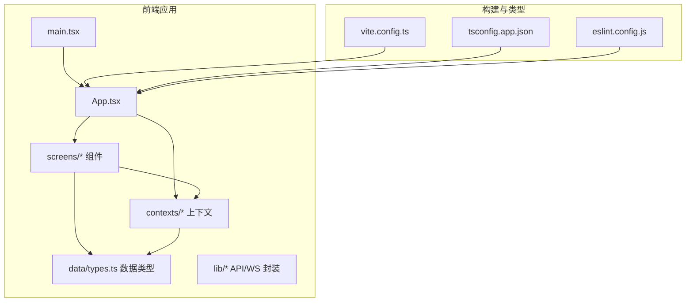
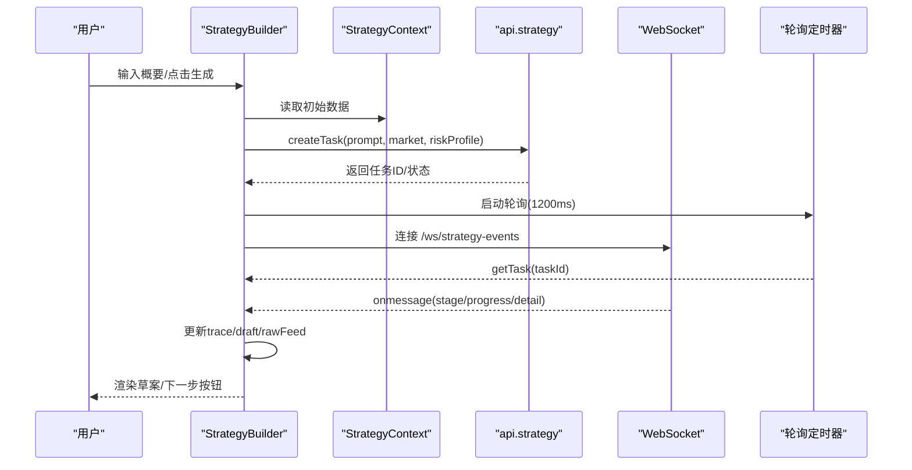
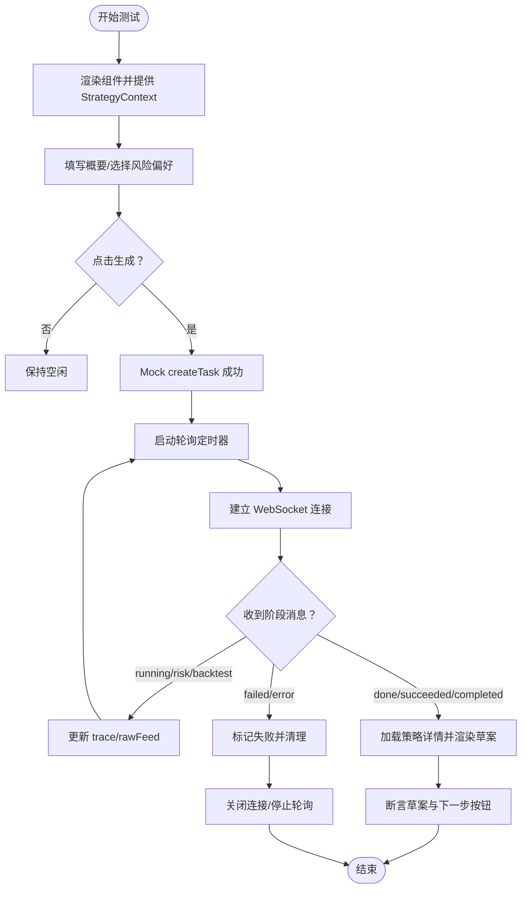
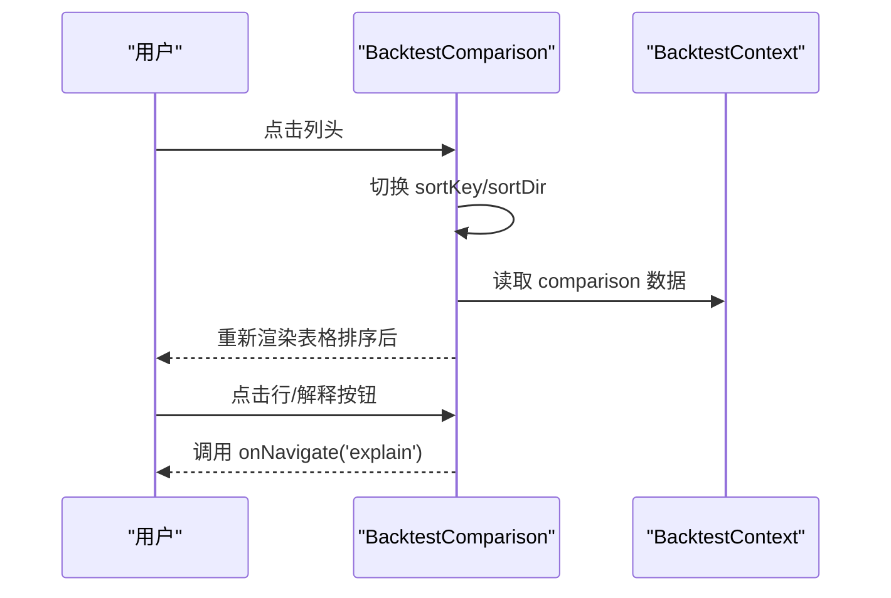
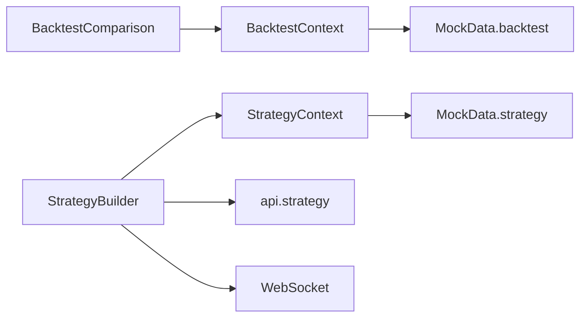

# 前端测试

<cite>
**本文引用的文件**
- [frontend/src/screens/Strategy/StrategyBuilder.tsx](file://frontend/src/screens/Strategy/StrategyBuilder.tsx)
- [frontend/src/screens/Backtest/BacktestComparison.tsx](file://frontend/src/screens/Backtest/BacktestComparison.tsx)
- [frontend/src/contexts/StrategyContext.tsx](file://frontend/src/contexts/StrategyContext.tsx)
- [frontend/src/contexts/BacktestContext.tsx](file://frontend/src/contexts/BacktestContext.tsx)
- [frontend/src/data/types.ts](file://frontend/src/data/types.ts)
- [frontend/package.json](file://frontend/package.json)
- [frontend/tsconfig.app.json](file://frontend/tsconfig.app.json)
- [frontend/eslint.config.js](file://frontend/eslint.config.js)
- [frontend/vite.config.ts](file://frontend/vite.config.ts)
</cite>

## 目录
1. [引言](#引言)
2. [项目结构](#项目结构)
3. [核心组件](#核心组件)
4. [架构总览](#架构总览)
5. [详细组件分析](#详细组件分析)
6. [依赖关系分析](#依赖关系分析)
7. [性能考量](#性能考量)
8. [故障排查指南](#故障排查指南)
9. [结论](#结论)
10. [附录](#附录)

## 引言
本指南面向 llmine-quant 前端团队，聚焦 React 组件测试、状态管理测试与用户交互测试的系统化落地方法。围绕策略构建器组件、回测比较组件、上下文状态与自定义 Hook 的测试策略，结合仓库现有代码结构，给出可执行的测试方案与最佳实践，覆盖 Jest 配置、React Testing Library 使用、Mock 组件与异步操作测试，并扩展到 TypeScript 类型测试、样式测试与可访问性测试，确保高质量与良好用户体验。

## 项目结构
前端采用 Vite + React 19 + TypeScript 构建，组件位于 src/screens 与 src/contexts，数据类型集中在 src/data/types.ts，上下文提供者用于状态注入。当前仓库未包含测试脚本与测试配置文件，因此本指南将指导如何在现有工程基础上补充测试基础设施与用例。

图表来源
- [frontend/src/screens/Strategy/StrategyBuilder.tsx](file://frontend/src/screens/Strategy/StrategyBuilder.tsx)
- [frontend/src/screens/Backtest/BacktestComparison.tsx](file://frontend/src/screens/Backtest/BacktestComparison.tsx)
- [frontend/src/contexts/StrategyContext.tsx](file://frontend/src/contexts/StrategyContext.tsx)
- [frontend/src/contexts/BacktestContext.tsx](file://frontend/src/contexts/BacktestContext.tsx)
- [frontend/src/data/types.ts](file://frontend/src/data/types.ts)
- [frontend/vite.config.ts](file://frontend/vite.config.ts)
- [frontend/tsconfig.app.json](file://frontend/tsconfig.app.json)
- [frontend/eslint.config.js](file://frontend/eslint.config.js)

章节来源
- [frontend/package.json](file://frontend/package.json)
- [frontend/tsconfig.app.json](file://frontend/tsconfig.app.json)
- [frontend/eslint.config.js](file://frontend/eslint.config.js)

## 核心组件
- 策略构建器组件：负责接收用户输入（市场、股票池、策略风格、风险偏好、自然语言描述），发起生成任务，通过轮询与 WebSocket 实时追踪生成进度与日志，并渲染策略草案与下一步操作入口。
- 回测比较组件：基于回测上下文数据，对候选策略进行排序与展示，支持点击进入解释视图并可视化关键指标。

章节来源
- [frontend/src/screens/Strategy/StrategyBuilder.tsx](file://frontend/src/screens/Strategy/StrategyBuilder.tsx)
- [frontend/src/screens/Backtest/BacktestComparison.tsx](file://frontend/src/screens/Backtest/BacktestComparison.tsx)

## 架构总览
组件通过自定义 Hook 访问上下文提供的 mock 数据，组件内部维护本地状态（如生成状态、任务进度、草案结果、追踪列表等），并与后端 API/WS 进行交互。测试应覆盖：
- 组件渲染与交互（RTL）
- 上下文提供者与 Hook 行为（Provider 包裹）
- 异步流程（轮询、WebSocket、错误处理）
- 用户输入与事件驱动的副作用
- 类型正确性与边界条件

图表来源
- [frontend/src/screens/Strategy/StrategyBuilder.tsx](file://frontend/src/screens/Strategy/StrategyBuilder.tsx)
- [frontend/src/contexts/StrategyContext.tsx](file://frontend/src/contexts/StrategyContext.tsx)

## 详细组件分析

### 策略构建器组件测试
目标
- 验证表单字段渲染与交互（市场、股票池、策略风格、风险偏好、自然语言描述）
- 验证生成按钮禁用/启用逻辑与点击行为
- 验证轮询与 WebSocket 的状态推进与 UI 反馈
- 验证草案渲染、下一步操作按钮与通知提示
- 验证错误路径与清理逻辑（取消、关闭连接）

测试要点
- 渲染与交互
  - 使用 RTL 渲染组件并提供 StrategyContext Provider
  - 断言各表单项存在且可编辑（生成中禁用）
  - 触发输入变更与点击事件，断言状态更新
- 生成流程
  - Mock api.strategy.createTask 返回任务信息
  - 断言生成状态切换、trace 列表初始化、任务进度与状态更新
  - 断言轮询定时器启动与停止
- WebSocket 事件
  - 模拟 onmessage 推送不同阶段消息，断言 trace 与 rawFeed 更新
  - 断言成功/失败分支的 UI 行为与资源清理
- 草案与导航
  - 断言草案渲染内容与下一步按钮行为
  - 断言 onOpenStrategy/onNavigate/onRefresh 回调被调用
- 错误处理
  - 断言网络异常、任务失败、WS 异常时的状态与提示

图表来源
- [frontend/src/screens/Strategy/StrategyBuilder.tsx](file://frontend/src/screens/Strategy/StrategyBuilder.tsx)
- [frontend/src/contexts/StrategyContext.tsx](file://frontend/src/contexts/StrategyContext.tsx)

章节来源
- [frontend/src/screens/Strategy/StrategyBuilder.tsx](file://frontend/src/screens/Strategy/StrategyBuilder.tsx)
- [frontend/src/contexts/StrategyContext.tsx](file://frontend/src/contexts/StrategyContext.tsx)

### 回测比较组件测试
目标
- 验证表格渲染与排序逻辑（按名称、年化、最大回撤、夏普、OOS）
- 验证过拟合标签、趋势折线、状态标签的视觉呈现
- 验证点击行/按钮触发导航回调

测试要点
- 渲染与排序
  - 提供 BacktestContext Provider，注入 comparison 数据
  - 断言表头与行数、单元格数值格式
  - 触发列头点击，断言 sortKey/sortDir 切换与排序结果
- 可视化元素
  - 断言过拟合标签颜色/文本、趋势折线方向
  - 断言状态标签样式与点标
- 交互
  - 断言行点击与按钮点击触发 onNavigate 回调

图表来源
- [frontend/src/screens/Backtest/BacktestComparison.tsx](file://frontend/src/screens/Backtest/BacktestComparison.tsx)
- [frontend/src/contexts/BacktestContext.tsx](file://frontend/src/contexts/BacktestContext.tsx)

章节来源
- [frontend/src/screens/Backtest/BacktestComparison.tsx](file://frontend/src/screens/Backtest/BacktestComparison.tsx)
- [frontend/src/contexts/BacktestContext.tsx](file://frontend/src/contexts/BacktestContext.tsx)

### 上下文状态与自定义 Hook 测试
目标
- 验证 useStrategy/useBacktest 等 Hook 在 Provider 缺失时抛错
- 验证 Provider 正确注入数据并被组件读取
- 验证数据结构与类型一致性（MockData）

测试要点
- Hook 行为
  - 在无 Provider 环境下调用 useStrategy/useBacktest，断言抛出错误
  - 在 Provider 包裹下断言返回非空对象
- 数据结构
  - 基于 MockData 接口断言字段存在性与类型（如 strategy.matrix/backtest.comparison 等）
- 边界条件
  - 空数组、null 值、缺失字段的渲染容错

章节来源
- [frontend/src/contexts/StrategyContext.tsx](file://frontend/src/contexts/StrategyContext.tsx)
- [frontend/src/contexts/BacktestContext.tsx](file://frontend/src/contexts/BacktestContext.tsx)
- [frontend/src/data/types.ts](file://frontend/src/data/types.ts)

### 自定义 Hook 测试（建议）
- 若未来新增自定义 Hook（如 useApiTask、useWebSocket），建议：
  - 单独测试 Hook 的返回值与副作用
  - 使用 TestInstance 暴露内部状态以便断言
  - 对副作用进行清理（如清理定时器、关闭 WebSocket）

## 依赖关系分析
- 组件依赖上下文 Hook 获取数据，上下文依赖 MockData 类型定义
- 策略构建器组件依赖 api.strategy 与 WebSocket，涉及异步与副作用
- 回测比较组件依赖回测上下文数据，涉及排序与渲染

图表来源
- [frontend/src/screens/Strategy/StrategyBuilder.tsx](file://frontend/src/screens/Strategy/StrategyBuilder.tsx)
- [frontend/src/screens/Backtest/BacktestComparison.tsx](file://frontend/src/screens/Backtest/BacktestComparison.tsx)
- [frontend/src/contexts/StrategyContext.tsx](file://frontend/src/contexts/StrategyContext.tsx)
- [frontend/src/contexts/BacktestContext.tsx](file://frontend/src/contexts/BacktestContext.tsx)
- [frontend/src/data/types.ts](file://frontend/src/data/types.ts)

章节来源
- [frontend/src/data/types.ts](file://frontend/src/data/types.ts)

## 性能考量
- 渲染优化
  - 使用 useMemo/memo 降低复杂表格与 SVG 折线的重渲染
  - 控制轮询频率与 WebSocket 消息处理的批处理
- 交互响应
  - 生成中禁用输入与按钮，避免重复提交
  - 合理的错误提示与降级 UI，减少闪烁
- 测试覆盖率
  - 关键分支（成功/失败、排序方向、空数据）必须覆盖
  - 异步流程需使用 fake timers 或等待微任务

## 故障排查指南
常见问题
- Hook 在无 Provider 下使用导致错误
  - 确保测试用例包裹 Provider
- 生成流程不触发或状态不更新
  - 检查 Mock API 返回值与时间线（轮询间隔、WS 消息）
- WebSocket 未关闭或定时器未清理
  - 在卸载/失败分支断言清理逻辑
- 排序与渲染不一致
  - 检查 sortKey/sortDir 与 useMemo 依赖项

章节来源
- [frontend/src/screens/Strategy/StrategyBuilder.tsx](file://frontend/src/screens/Strategy/StrategyBuilder.tsx)
- [frontend/src/contexts/StrategyContext.tsx](file://frontend/src/contexts/StrategyContext.tsx)

## 结论
通过围绕策略构建器与回测比较组件的测试实践，结合上下文与类型定义，可以系统性提升前端质量与稳定性。建议尽快补齐测试脚本与配置，优先覆盖异步流程与边界条件，持续完善类型、样式与可访问性测试，形成完整的前端测试体系。

## 附录

### Jest 与 React Testing Library 配置建议
- 测试脚本
  - 在 package.json 中添加测试脚本（如 test、test:watch、test:coverage）
- 运行环境
  - 使用 Vite 作为打包器，配合 Vitest 或 Jest（Jest 需要适配 Vite）
- RTL 建议
  - 使用 renderWithProviders 包裹 Provider
  - 使用 fireEvent、screen 查询器进行交互与断言
- 异步测试
  - 使用 waitFor、waitForElementToBeRemoved 等
  - 使用 fake timers 控制轮询与延时

章节来源
- [frontend/package.json](file://frontend/package.json)
- [frontend/vite.config.ts](file://frontend/vite.config.ts)

### TypeScript 类型测试
- 使用 ts-toolbelt 或自定义断言函数验证泛型推导
- 针对 MockData 的接口字段进行“存在性”与“类型”断言
- 对 API 返回类型（如 StrategyTaskOut）进行契约测试

章节来源
- [frontend/src/data/types.ts](file://frontend/src/data/types.ts)

### 样式与可访问性测试
- 样式
  - 使用 DOM 属性断言类名与内联样式
  - 对 SVG 图形（如趋势折线）断言路径点数量与坐标范围
- 可访问性
  - 使用 axe-core 或 @axe-core/react 测试无障碍属性（aria-*、tabindex、role）
  - 确保键盘可访问与焦点顺序合理

### Mock 组件与异步操作
- Mock 组件
  - 对第三方图表库（如 ECharts）使用轻量替身或静态快照
- 异步
  - 对 WebSocket 使用简单事件模拟，避免真实连接
  - 对轮询使用 fake timers 控制节奏