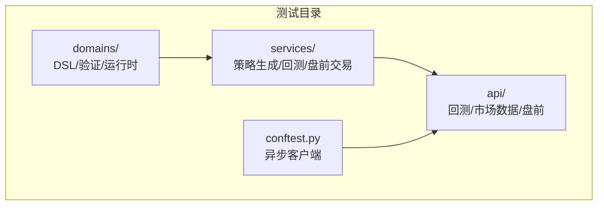
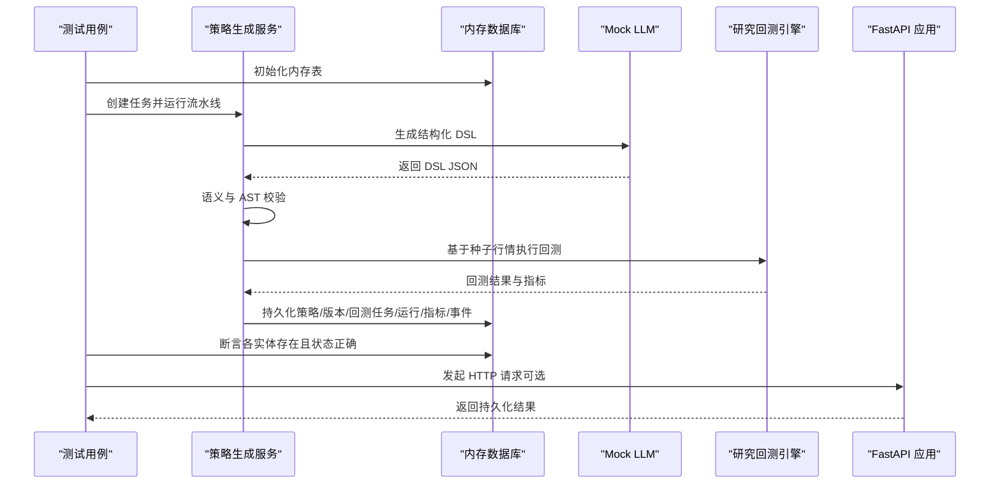
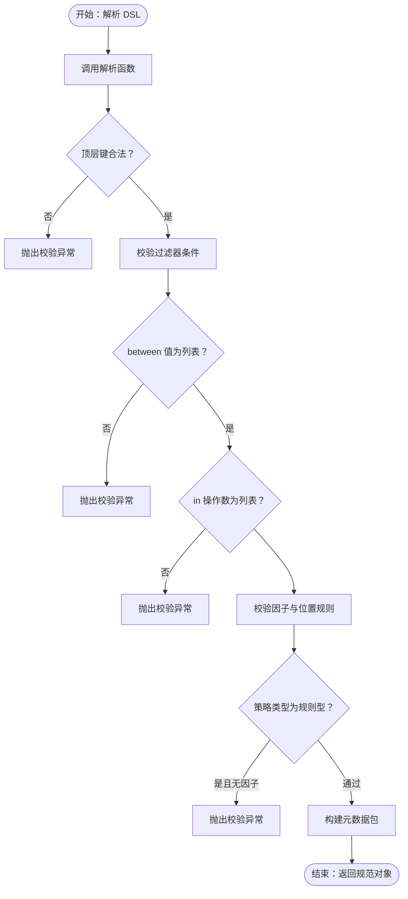
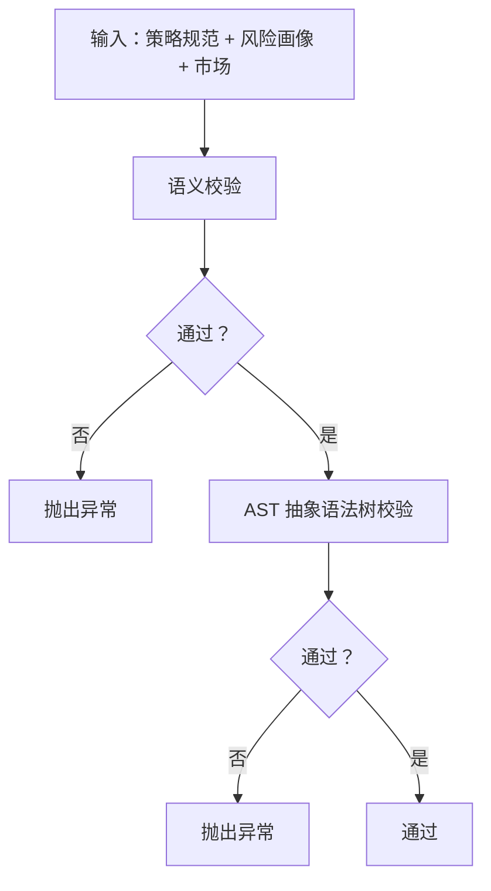
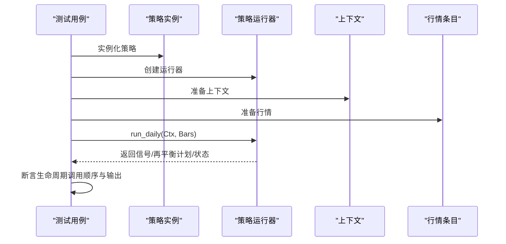
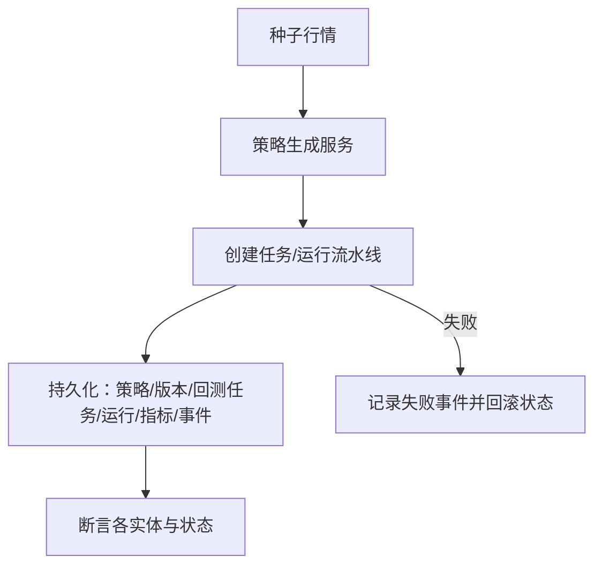
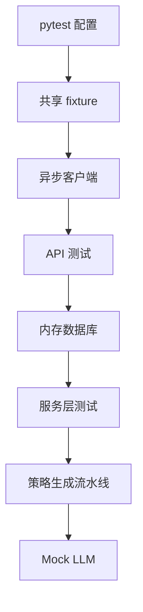

# 单元测试

<cite>
**本文引用的文件**
- [backend/tests/conftest.py](file://backend/tests/conftest.py)
- [backend/pyproject.toml](file://backend/pyproject.toml)
- [backend/tests/domains/test_strategy_generation_dsl.py](file://backend/tests/domains/test_strategy_generation_dsl.py)
- [backend/tests/domains/test_strategy_generation_validate.py](file://backend/tests/domains/test_strategy_generation_validate.py)
- [backend/tests/domains/test_strategy_runtime.py](file://backend/tests/domains/test_strategy_runtime.py)
- [backend/tests/domains/test_builtin_strategies.py](file://backend/tests/domains/test_builtin_strategies.py)
- [backend/tests/services/test_strategy_generation_e2e.py](file://backend/tests/services/test_strategy_generation_e2e.py)
- [backend/tests/api/test_backtests.py](file://backend/tests/api/test_backtests.py)
- [backend/tests/api/test_market_data_import.py](file://backend/tests/api/test_market_data_import.py)
- [backend/tests/services/test_daily_backtest.py](file://backend/tests/services/test_daily_backtest.py)
- [backend/tests/services/test_paper_trading.py](file://backend/tests/services/test_paper_trading.py)
- [backend/tests/services/test_overfitting.py](file://backend/tests/services/test_overfitting.py)
- [backend/tests/api/test_paper.py](file://backend/tests/api/test_paper.py)
- [backend/tests/api/test_screens.py](file://backend/tests/api/test_screens.py)
</cite>

## 目录
1. [引言](#引言)
2. [项目结构](#项目结构)
3. [核心组件](#核心组件)
4. [架构总览](#架构总览)
5. [详细组件分析](#详细组件分析)
6. [依赖分析](#依赖分析)
7. [性能考虑](#性能考虑)
8. [故障排查指南](#故障排查指南)
9. [结论](#结论)
10. [附录](#附录)

## 引言
本指南面向 llmine-quant 后端的单元测试与集成测试实践，系统讲解如何基于 pytest 进行策略生成 DSL 测试、验证逻辑测试、运行时测试、服务层测试与 API 测试。内容覆盖：
- pytest 配置与异步测试模式
- 测试用例编写规范与参数化、边界条件测试
- Mock 对象与外部依赖隔离（如 LLM 提供商）
- 数据库模型测试与事务/内存数据库隔离
- 覆盖率统计与测试数据准备
- 端到端流水线测试与失败场景回归

## 项目结构
后端测试主要位于 backend/tests 下，按领域与层次划分：
- domains：策略 DSL、验证、运行时接口的单元测试
- services：服务层（策略生成、研究回测、盘前交易）的集成与端到端测试
- api：HTTP 接口的集成测试，使用 ASGI 传输与内存数据库
- 根级 conftest.py 提供共享的异步客户端 fixture

**章节来源**
- [backend/tests/conftest.py:1-15](file://backend/tests/conftest.py#L1-L15)
- [backend/pyproject.toml:68-71](file://backend/pyproject.toml#L68-L71)

## 核心组件
- pytest 配置与运行模式
  - 异步模式：通过配置项启用 asyncio_mode 自动模式
  - 测试路径：testpaths 指向 tests
  - 覆盖率：addopts 使用 --cov=app 统计覆盖率，term-missing 输出缺失行
- 共享 fixture
  - 异步 HTTP 客户端：基于 ASGI 传输，便于 API 测试
- 测试分层
  - 域内单元：策略 DSL 解析、语义与 AST 校验、运行时生命周期
  - 服务集成：策略生成流水线、研究回测、盘前交易
  - API 集成：端到端 HTTP 接口测试，依赖注入替换数据库会话

**章节来源**
- [backend/pyproject.toml:68-71](file://backend/pyproject.toml#L68-L71)
- [backend/tests/conftest.py:9-14](file://backend/tests/conftest.py#L9-L14)

## 架构总览
下图展示从自然语言到回测完成的端到端测试路径，以及关键断言点。

**图表来源**
- [backend/tests/services/test_strategy_generation_e2e.py:87-211](file://backend/tests/services/test_strategy_generation_e2e.py#L87-L211)
- [backend/tests/api/test_backtests.py:35-91](file://backend/tests/api/test_backtests.py#L35-L91)

**章节来源**
- [backend/tests/services/test_strategy_generation_e2e.py:45-56](file://backend/tests/services/test_strategy_generation_e2e.py#L45-L56)
- [backend/tests/api/test_backtests.py:15-33](file://backend/tests/api/test_backtests.py#L15-L33)

## 详细组件分析

### 策略生成 DSL 测试
目标：
- 验证 DSL 规范解析、字段校验与默认值
- 验证元数据映射与 JSON Schema 结构化输出
- 验证 Mock LLM 的结构化输出可被 DSL 解析器接受

要点：
- 最小规则型策略解析与默认参数断言
- 未知顶层键触发校验异常
- 过滤器 between/in 的值类型校验
- 组合策略允许空因子列表
- 规则型策略至少需要一个因子
- 位置规则最小/最大值约束
- 元数据包映射与风险规则默认值
- Mock LLM 结构化输出作为 DSL 输入进行二次解析

**图表来源**
- [backend/tests/domains/test_strategy_generation_dsl.py:17-64](file://backend/tests/domains/test_strategy_generation_dsl.py#L17-L64)
- [backend/tests/domains/test_strategy_generation_dsl.py:85-96](file://backend/tests/domains/test_strategy_generation_dsl.py#L85-L96)

**章节来源**
- [backend/tests/domains/test_strategy_generation_dsl.py:17-127](file://backend/tests/domains/test_strategy_generation_dsl.py#L17-L127)

### 策略生成验证逻辑测试
目标：
- 语义校验：风险画像、市场、因子窗口等约束
- AST 校验：生成代码必须包含必要接口与类定义
- 边界条件：未来数据过滤、shift/pct_change 方向限制

要点：
- 平衡风险画像下的默认约束通过
- 保守画像下单只权重上限拒绝
- 最大回撤上限拒绝
- 因子窗口过大拒绝
- 非法市场拒绝
- 缺少必要接口或语法错误的代码拒绝
- 不允许负移位与负周期变化
- 正移位通过

**图表来源**
- [backend/tests/domains/test_strategy_generation_validate.py:26-58](file://backend/tests/domains/test_strategy_generation_validate.py#L26-L58)
- [backend/tests/domains/test_strategy_generation_validate.py:86-135](file://backend/tests/domains/test_strategy_generation_validate.py#L86-L135)

**章节来源**
- [backend/tests/domains/test_strategy_generation_validate.py:12-148](file://backend/tests/domains/test_strategy_generation_validate.py#L12-L148)

### 策略运行时测试
目标：
- 验证策略运行器生命周期顺序与输出
- 验证上下文与再平衡计划的输入校验
- 验证内置策略行为（如双均线）

要点：
- 生命周期顺序：initialize → generate_signals → rebalance
- 上下文与再平衡计划的非法输入断言
- 内置策略在历史不足、限涨跌停、等权分配等场景的行为

**图表来源**
- [backend/tests/domains/test_strategy_runtime.py:62-84](file://backend/tests/domains/test_strategy_runtime.py#L62-L84)

**章节来源**
- [backend/tests/domains/test_strategy_runtime.py:18-105](file://backend/tests/domains/test_strategy_runtime.py#L18-L105)
- [backend/tests/domains/test_builtin_strategies.py:28-107](file://backend/tests/domains/test_builtin_strategies.py#L28-L107)

### 服务层测试（策略生成端到端）
目标：
- 端到端验证从自然语言到回测完成的流水线
- 验证数据库实体链路与事件轨迹
- 失败场景的健壮性与诊断记录

要点：
- 内存数据库初始化与会话工厂
- 强制使用 Mock LLM 提供商以保证可重复性
- 种子行情生成，确保策略可产生交易
- 断言策略任务成功、策略与版本状态、回测任务/运行/指标/净值点
- PipelineEvent 覆盖所有阶段
- 特征存储与谱系图建立
- 失败场景：无行情导致回测失败，任务标记失败并回滚状态

**图表来源**
- [backend/tests/services/test_strategy_generation_e2e.py:87-211](file://backend/tests/services/test_strategy_generation_e2e.py#L87-L211)
- [backend/tests/services/test_strategy_generation_e2e.py:214-247](file://backend/tests/services/test_strategy_generation_e2e.py#L214-L247)

**章节来源**
- [backend/tests/services/test_strategy_generation_e2e.py:45-56](file://backend/tests/services/test_strategy_generation_e2e.py#L45-L56)
- [backend/tests/services/test_strategy_generation_e2e.py:87-247](file://backend/tests/services/test_strategy_generation_e2e.py#L87-L247)

### 研究回测服务测试
目标：
- 验证每日回测引擎的买卖信号、费用成本、指标计算
- 验证持久化：任务、运行、指标、净值点
- 验证 IS/OOS 分割与走查折叠
- 验证无行情与参数非法等边界条件

要点：
- 无行情抛出数据错误
- 成本包含佣金、印花税、滑点
- 指标：累计收益、年化收益、最大回撤、夏普比率、胜率、换手率
- IS/OOS 分割与相位标签
- 走查折叠的训练/测试窗口合法性
- 参数非法日期断言

**章节来源**
- [backend/tests/services/test_daily_backtest.py:46-369](file://backend/tests/services/test_daily_backtest.py#L46-L369)

### 盘前交易服务测试
目标：
- 验证盘前交易引擎的 EOD 循环：订单创建、成交、净值更新
- 验证风控预检查与熔断记录
- 验证幂等性与无行情处理

要点：
- 同一天重复调用幂等：第二次不产生新订单
- 单只股票权重超限触发风控拒绝
- 无行情当天不做任何处理
- 暴跌后记录日度损失/最大回撤熔断

**章节来源**
- [backend/tests/services/test_paper_trading.py:87-231](file://backend/tests/services/test_paper_trading.py#L87-231)

### API 测试（回测、市场数据导入、盘前）
- 回测 API
  - 创建研究回测并断言返回指标与净值曲线长度
  - 无行情返回 400
  - CSV 导入后可直接运行示例策略并断言指标
  - IS/OOS 分割与相位标签
  - /trades 与 /report 聚合产物
  - 走查接口写入数据库
  - 非法分割日期断言
- 市场数据导入 API
  - CSV 导入与查询校验
- 盘前账户生命周期与 EOD 执行
  - 账户创建、列表、EOD 执行、持仓/订单/成交/净值查询
  - 未知账户 EOD 返回 404
- 屏幕接口集合测试
  - 健康检查、仪表盘、数据、策略、回测、风控、组合、执行、解释、安全、协作、审计等模块概览与关键动作（审批、熔断触发/恢复、密钥轮换等）

**章节来源**
- [backend/tests/api/test_backtests.py:35-331](file://backend/tests/api/test_backtests.py#L35-L331)
- [backend/tests/api/test_market_data_import.py:32-61](file://backend/tests/api/test_market_data_import.py#L32-L61)
- [backend/tests/api/test_paper.py:54-111](file://backend/tests/api/test_paper.py#L54-L111)
- [backend/tests/api/test_screens.py:98-326](file://backend/tests/api/test_screens.py#L98-L326)

### 过拟合评估测试
目标：
- 验证过拟合评分由多源信号合成（夏普衰减、最大回撤一致性、走查连续性、参数稳定性）
- 在仅有基线的情况下给出保守评估

要点：
- 生成走查与敏感性分析后进行评估
- 断言组件名称与等级范围
- 在无分割/走查/敏感性时仍能给出结果

**章节来源**
- [backend/tests/services/test_overfitting.py:50-109](file://backend/tests/services/test_overfitting.py#L50-L109)

## 依赖分析
- 测试运行时依赖
  - pytest、pytest-asyncio、pytest-cov
  - httpx ASGI 传输用于 API 测试
  - SQLAlchemy 异步引擎与内存数据库（sqlite+aiosqlite:///:memory:）
- 测试隔离策略
  - 每个测试使用独立内存数据库，测试结束后释放连接
  - API 测试通过依赖注入替换数据库会话
  - 服务端测试通过 monkeypatch 将 LLM 提供商强制切换为 Mock
- 关键耦合点
  - 策略生成流水线依赖 Mock LLM 提供稳定输入
  - 回测服务依赖内存数据库持久化中间结果
  - API 测试依赖共享的异步客户端 fixture

**图表来源**
- [backend/tests/conftest.py:9-14](file://backend/tests/conftest.py#L9-L14)
- [backend/tests/services/test_strategy_generation_e2e.py:87-105](file://backend/tests/services/test_strategy_generation_e2e.py#L87-L105)

**章节来源**
- [backend/pyproject.toml:29-38](file://backend/pyproject.toml#L29-L38)
- [backend/tests/conftest.py:9-14](file://backend/tests/conftest.py#L9-L14)
- [backend/tests/services/test_strategy_generation_e2e.py:45-56](file://backend/tests/services/test_strategy_generation_e2e.py#L45-L56)

## 性能考虑
- 测试并发与异步
  - 使用 pytest-asyncio 的自动模式，避免手动标记
  - API 测试复用同一 ASGI 传输，减少启动开销
- 内存数据库
  - sqlite+aiosqlite 内存数据库显著降低 IO 开销
  - 每个测试独立会话，避免跨用例污染
- 覆盖率控制
  - 仅对 app 包统计覆盖率，避免第三方与测试代码干扰
  - 使用 term-missing 识别未覆盖的源码行

**章节来源**
- [backend/pyproject.toml:68-71](file://backend/pyproject.toml#L68-L71)

## 故障排查指南
- 无市场行情导致回测失败
  - 现象：回测任务失败，策略状态回滚为草稿
  - 排查：确认是否已播种行情；检查时间范围与符号
- Mock LLM 输出不符合 DSL Schema
  - 现象：解析器抛出校验异常
  - 排查：核对结构化输出字段与类型；确保与 JSON Schema 一致
- IS/OOS 分割日期非法
  - 现象：创建回测返回 400
  - 排查：分割日期必须在 [start_date, end_date) 之间
- 盘前风控拒绝
  - 现象：订单被拒绝，预检查记录失败
  - 排查：检查单只权重上限、账户现金与市值比例
- API 返回 404
  - 现象：盘前账户不存在
  - 排查：确认账户 ID 是否正确

**章节来源**
- [backend/tests/services/test_strategy_generation_e2e.py:214-247](file://backend/tests/services/test_strategy_generation_e2e.py#L214-L247)
- [backend/tests/api/test_backtests.py:293-309](file://backend/tests/api/test_backtests.py#L293-L309)
- [backend/tests/services/test_paper_trading.py:154-179](file://backend/tests/services/test_paper_trading.py#L154-L179)
- [backend/tests/api/test_paper.py:104-111](file://backend/tests/api/test_paper.py#L104-L111)

## 结论
本指南总结了 llmine-quant 后端的测试体系：以 pytest 为核心，结合内存数据库与 Mock 依赖，覆盖策略 DSL、验证逻辑、运行时接口、服务层流水线与 API 端到端路径。通过参数化、边界条件与失败场景测试，配合覆盖率统计，确保核心功能的稳定性与可维护性。

## 附录
- 测试数据准备
  - 使用内存数据库初始化表结构
  - 通过辅助函数播种行情与种子数据
- 测试环境隔离
  - API 测试通过依赖注入替换数据库会话
  - 服务测试通过 monkeypatch 切换 LLM 提供商
- 最佳实践清单
  - 优先使用内存数据库进行集成测试
  - 对外部依赖统一使用 Mock，保证可重复性
  - 为每个测试场景提供明确的断言点与失败诊断
  - 使用参数化覆盖边界条件与异常分支
  - 保持测试命名清晰，遵循“行为 + 场景 + 期望”的结构