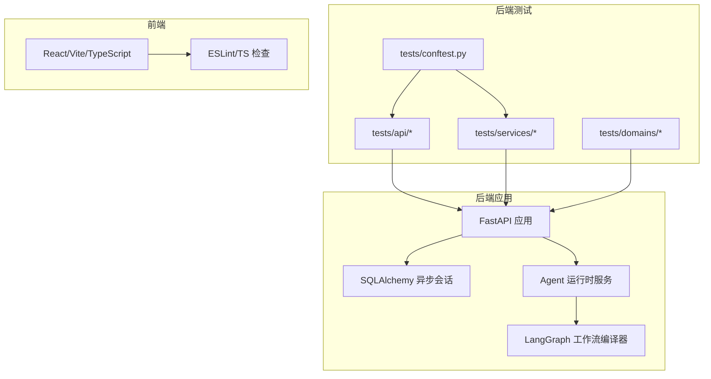
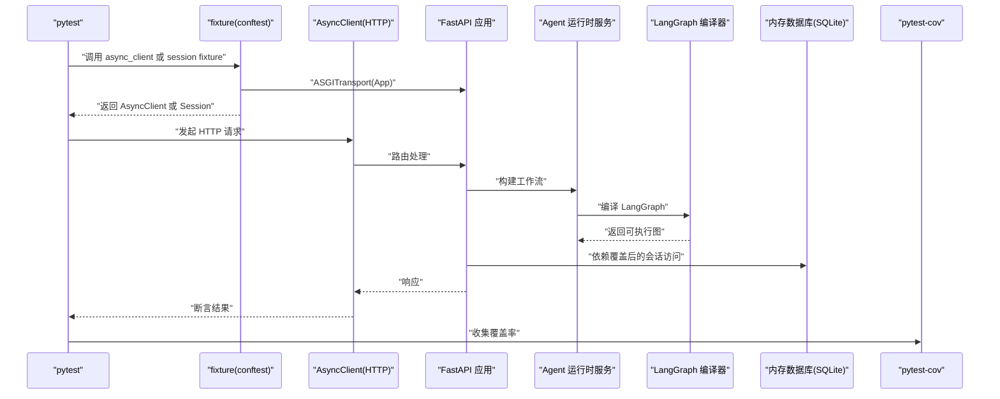
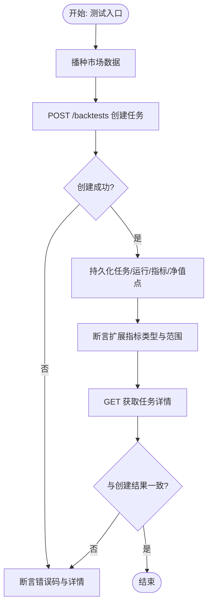
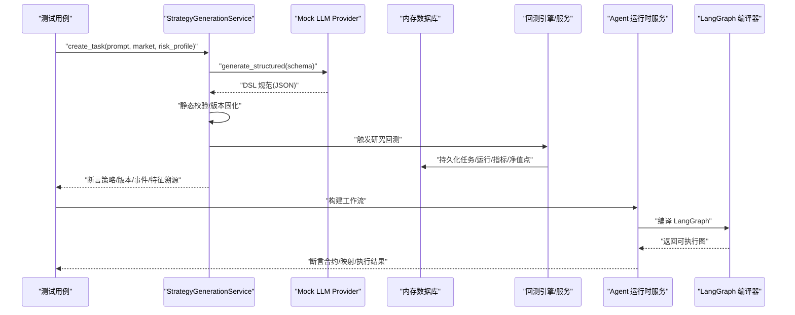
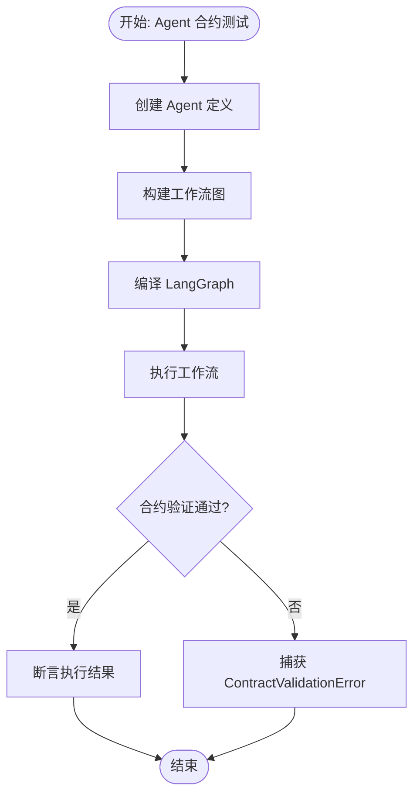
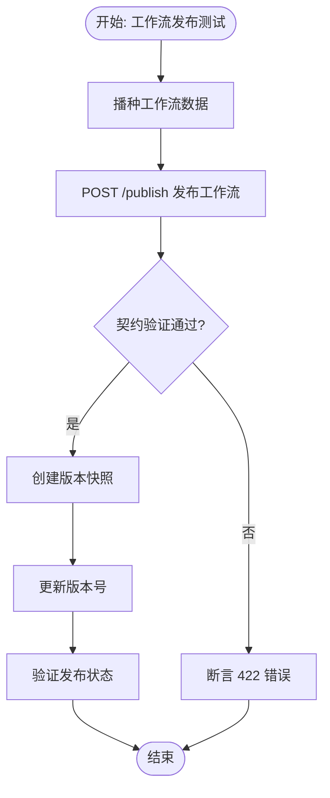
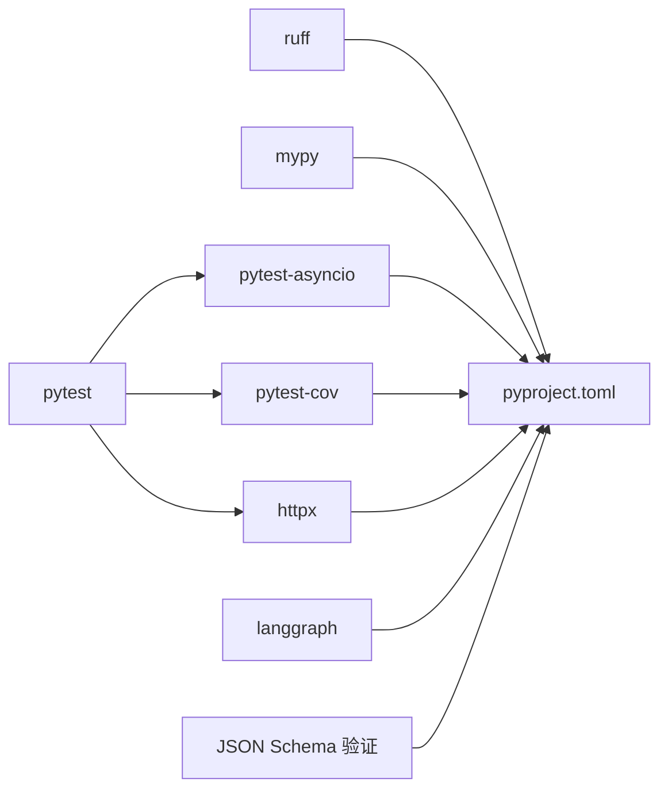

# 测试与质量保证

<cite>
**本文引用的文件**
- [backend/tests/conftest.py](file://backend/tests/conftest.py)
- [backend/pyproject.toml](file://backend/pyproject.toml)
- [backend/tests/api/test_backtests.py](file://backend/tests/api/test_backtests.py)
- [backend/tests/services/test_strategy_generation_e2e.py](file://backend/tests/services/test_strategy_generation_e2e.py)
- [backend/tests/domains/test_strategy_generation_dsl.py](file://backend/tests/domains/test_strategy_generation_dsl.py)
- [backend/tests/services/test_daily_backtest.py](file://backend/tests/services/test_daily_backtest.py)
- [backend/tests/api/test_agent_workflow_publish.py](file://backend/tests/api/test_agent_workflow_publish.py)
- [backend/tests/services/test_agent_runtime_contracts.py](file://backend/tests/services/test_agent_runtime_contracts.py)
- [backend/tests/services/test_agent_runtime_langgraph.py](file://backend/tests/services/test_agent_runtime_langgraph.py)
- [backend/tests/services/test_agent_runtime_override.py](file://backend/tests/services/test_agent_runtime_override.py)
- [backend/tests/services/test_agent_runtime_root_mapping.py](file://backend/tests/services/test_agent_runtime_root_mapping.py)
- [backend/app/api/v1/agents.py](file://backend/app/api/v1/agents.py)
- [backend/app/services/agents/runtime.py](file://backend/app/services/agents/runtime.py)
- [backend/app/domains/agents/models.py](file://backend/app/domains/agents/models.py)
- [backend/README.md](file://backend/README.md)
- [frontend/package.json](file://frontend/package.json)
</cite>

## 更新摘要
**所做更改**
- 新增 Agent 运行时合约验证测试章节
- 新增 LangGraph 集成测试章节
- 新增工作流发布 API 测试章节
- 更新核心组件以包含 Agent 运行时测试基础设施
- 更新架构总览以反映 Agent 工作流测试流程
- 更新测试用例编写规范以涵盖 Agent 相关测试

## 目录
1. [引言](#引言)
2. [项目结构](#项目结构)
3. [核心组件](#核心组件)
4. [架构总览](#架构总览)
5. [详细组件分析](#详细组件分析)
6. [依赖分析](#依赖分析)
7. [性能考虑](#性能考虑)
8. [故障排查指南](#故障排查指南)
9. [结论](#结论)
10. [附录](#附录)

## 引言
本指南面向 llmine-quant 后端与前端的测试与质量保证体系，系统梳理单元测试、集成测试、端到端测试的策略与实现方法，覆盖测试框架配置、Mock 对象使用、测试数据管理、覆盖率统计、API 测试、数据库一致性测试、服务层算法验证与性能测试最佳实践。特别针对新增的 Agent 运行时合约验证、LangGraph 集成测试和工作流发布 API 测试进行了深入分析。同时提供测试用例编写规范、持续集成配置建议与质量门禁标准，确保代码质量与系统稳定性。

## 项目结构
后端采用 FastAPI + SQLAlchemy 异步 ORM 架构，测试主要分布在 backend/tests 下，按职责划分为：
- api：基于 ASGI 的 HTTP 接口测试，使用内存数据库进行端到端验证
- services：服务层算法与流程测试，包含研究回测引擎、策略生成流水线、Agent 运行时合约验证等
- domains：领域模型与 DSL 解析校验测试
- 公共配置：pytest 配置与共享异步客户端 fixture

前端采用 React + Vite + TypeScript 技术栈，测试与质量工具通过 package.json 中的脚本与 ESLint 配置体现。

**图表来源**
- [backend/tests/conftest.py:1-15](file://backend/tests/conftest.py#L1-L15)
- [backend/tests/api/test_agent_workflow_publish.py:1-95](file://backend/tests/api/test_agent_workflow_publish.py#L1-L95)
- [backend/tests/services/test_agent_runtime_contracts.py:1-59](file://backend/tests/services/test_agent_runtime_contracts.py#L1-L59)
- [backend/tests/services/test_agent_runtime_langgraph.py:1-40](file://backend/tests/services/test_agent_runtime_langgraph.py#L1-L40)
- [backend/app/services/agents/runtime.py:1-200](file://backend/app/services/agents/runtime.py#L1-L200)
- [backend/app/api/v1/agents.py:1-571](file://backend/app/api/v1/agents.py#L1-L571)

**章节来源**
- [backend/tests/conftest.py:1-15](file://backend/tests/conftest.py#L1-L15)
- [backend/pyproject.toml:68-71](file://backend/pyproject.toml#L68-L71)
- [backend/README.md:1-45](file://backend/README.md#L1-L45)
- [frontend/package.json:1-43](file://frontend/package.json#L1-L43)

## 核心组件
- 测试框架与运行环境
  - 使用 pytest 及 pytest-asyncio 运行异步测试；pytest-cov 统计覆盖率；Ruff 与 mypy 提供静态检查与类型检查
  - 通过 pyproject.toml 配置测试路径、异步模式与覆盖率报告
- 共享测试客户端
  - 在 conftest.py 中定义 ASGI 异步客户端，统一注入到 API 层测试中
- 内存数据库与依赖注入覆盖
  - API 测试通过内存 SQLite 创建表结构，使用依赖覆盖将数据库会话指向测试会话，确保隔离性与可重复性
- Agent 运行时测试基础设施
  - 新增 Agent 运行时合约验证、LangGraph 集成测试和工作流发布 API 测试专用的内存数据库配置
  - 支持 Agent 定义、工作流定义、节点和边的完整测试场景
- 前端质量工具链
  - 通过 package.json 中的 lint/build/preview 脚本与 ESLint 配置，保障前端代码风格与构建质量

**章节来源**
- [backend/pyproject.toml:68-71](file://backend/pyproject.toml#L68-L71)
- [backend/tests/conftest.py:9-15](file://backend/tests/conftest.py#L9-L15)
- [backend/tests/api/test_backtests.py:15-33](file://backend/tests/api/test_backtests.py#L15-L33)
- [backend/tests/api/test_agent_workflow_publish.py:15-30](file://backend/tests/api/test_agent_workflow_publish.py#L15-L30)
- [backend/tests/services/test_agent_runtime_contracts.py:9-18](file://backend/tests/services/test_agent_runtime_contracts.py#L9-L18)
- [frontend/package.json:6-11](file://frontend/package.json#L6-L11)

## 架构总览
下图展示测试执行的关键路径：pytest 发现测试 → 初始化共享客户端/内存数据库 → 注入依赖 → 执行测试 → 数据库断言与覆盖率统计。新增的 Agent 测试涵盖了从工作流发布到运行时执行的完整链路。

**图表来源**
- [backend/tests/conftest.py:9-15](file://backend/tests/conftest.py#L9-L15)
- [backend/tests/api/test_backtests.py:15-33](file://backend/tests/api/test_backtests.py#L15-L33)
- [backend/tests/api/test_agent_workflow_publish.py:15-30](file://backend/tests/api/test_agent_workflow_publish.py#L15-L30)
- [backend/app/services/agents/runtime.py:160-200](file://backend/app/services/agents/runtime.py#L160-L200)
- [backend/pyproject.toml:68-71](file://backend/pyproject.toml#L68-L71)

## 详细组件分析

### API 测试（HTTP 接口）
- 目标与范围
  - 验证回测任务创建、CSV 导入、IS/OOS 分割、交易与报告聚合等端到端行为
  - 断言持久化结果（BacktestTask/Run/Metric/EquityPoint）与扩展指标一致性
- 关键策略
  - 内存数据库 + 依赖覆盖：在每个测试用例中创建独立内存数据库，使用依赖覆盖将 get_db 指向测试会话，避免跨用例污染
  - 测试数据播种：通过种子函数批量插入日线行情，确保回测可用
  - 行为断言：对状态码、任务 ID、指标字段类型与数值范围进行断言；GET 路由与 POST 结果一致性校验
- 最佳实践
  - 将"请求体""响应体""数据库实体"三者关联断言，确保接口与持久化一致
  - 对边界条件（如无市场数据、非法分割日期）进行显式错误断言
  - 使用临时文件写入 CSV 并断言导入行数与回测指标

**图表来源**
- [backend/tests/api/test_backtests.py:35-91](file://backend/tests/api/test_backtests.py#L35-L91)
- [backend/tests/api/test_backtests.py:109-166](file://backend/tests/api/test_backtests.py#L109-L166)
- [backend/tests/api/test_backtests.py:168-209](file://backend/tests/api/test_backtests.py#L168-L209)
- [backend/tests/api/test_backtests.py:211-259](file://backend/tests/api/test_backtests.py#L211-L259)
- [backend/tests/api/test_backtests.py:261-291](file://backend/tests/api/test_backtests.py#L261-L291)
- [backend/tests/api/test_backtests.py:293-309](file://backend/tests/api/test_backtests.py#L293-L309)

**章节来源**
- [backend/tests/api/test_backtests.py:15-33](file://backend/tests/api/test_backtests.py#L15-L33)
- [backend/tests/api/test_backtests.py:35-91](file://backend/tests/api/test_backtests.py#L35-L91)
- [backend/tests/api/test_backtests.py:93-107](file://backend/tests/api/test_backtests.py#L93-L107)
- [backend/tests/api/test_backtests.py:109-166](file://backend/tests/api/test_backtests.py#L109-L166)
- [backend/tests/api/test_backtests.py:168-209](file://backend/tests/api/test_backtests.py#L168-L209)
- [backend/tests/api/test_backtests.py:211-259](file://backend/tests/api/test_backtests.py#L211-L259)
- [backend/tests/api/test_backtests.py:261-291](file://backend/tests/api/test_backtests.py#L261-L291)
- [backend/tests/api/test_backtests.py:293-309](file://backend/tests/api/test_backtests.py#L293-L309)

### 服务层测试（算法与流程）
- 目标与范围
  - 验证每日回测引擎的信号生成、交易执行、费用计算、核心指标与持久化
  - 验证策略生成端到端流水线：自然语言 → DSL 规范 → 静态校验 → 研究回测 → 数据库持久化 → 事件追踪
  - **新增** 验证 Agent 运行时合约、LangGraph 工作流编译和运行时执行
- 关键策略
  - 内存数据库 + 依赖覆盖：同 API 测试，确保测试隔离
  - 场景驱动断言：零成本、含手续费、分段 IS/OOS、周频再平衡、走查折叠等
  - 端到端断言：从任务创建到版本固化、从运行记录到特征溯源链路
  - **新增** Agent 合约验证：验证输入输出模式匹配、映射关系正确性和运行时约束
- 最佳实践
  - 将"输入参数""中间结果""最终指标""数据库实体"串联断言
  - 对异常场景（无行情、走查样本不足、合约违规）进行明确错误断言
  - 使用 Mock LLM Provider 强制走"结构化输出即 DSL"的路径，确保 DSL 校验链完整
  - **新增** 对 Agent 运行时的输入输出模式、映射关系和运行时约束进行全面验证

**图表来源**
- [backend/tests/services/test_strategy_generation_e2e.py:87-212](file://backend/tests/services/test_strategy_generation_e2e.py#L87-L212)
- [backend/tests/services/test_strategy_generation_e2e.py:214-247](file://backend/tests/services/test_strategy_generation_e2e.py#L214-L247)
- [backend/tests/domains/test_strategy_generation_dsl.py:85-96](file://backend/tests/domains/test_strategy_generation_dsl.py#L85-L96)
- [backend/tests/services/test_agent_runtime_contracts.py:33-59](file://backend/tests/services/test_agent_runtime_contracts.py#L33-L59)
- [backend/tests/services/test_agent_runtime_langgraph.py:20-40](file://backend/tests/services/test_agent_runtime_langgraph.py#L20-L40)

**章节来源**
- [backend/tests/services/test_daily_backtest.py:33-44](file://backend/tests/services/test_daily_backtest.py#L33-L44)
- [backend/tests/services/test_daily_backtest.py:46-101](file://backend/tests/services/test_daily_backtest.py#L46-L101)
- [backend/tests/services/test_daily_backtest.py:103-140](file://backend/tests/services/test_daily_backtest.py#L103-L140)
- [backend/tests/services/test_daily_backtest.py:142-174](file://backend/tests/services/test_daily_backtest.py#L142-L174)
- [backend/tests/services/test_daily_backtest.py:176-220](file://backend/tests/services/test_daily_backtest.py#L176-L220)
- [backend/tests/services/test_daily_backtest.py:222-266](file://backend/tests/services/test_daily_backtest.py#L222-L266)
- [backend/tests/services/test_daily_backtest.py:268-303](file://backend/tests/services/test_daily_backtest.py#L268-L303)
- [backend/tests/services/test_daily_backtest.py:305-320](file://backend/tests/services/test_daily_backtest.py#L305-L320)
- [backend/tests/services/test_daily_backtest.py:322-339](file://backend/tests/services/test_daily_backtest.py#L322-L339)
- [backend/tests/services/test_daily_backtest.py:341-369](file://backend/tests/services/test_daily_backtest.py#L341-L369)
- [backend/tests/services/test_strategy_generation_e2e.py:45-56](file://backend/tests/services/test_strategy_generation_e2e.py#L45-L56)
- [backend/tests/services/test_strategy_generation_e2e.py:87-212](file://backend/tests/services/test_strategy_generation_e2e.py#L87-L212)
- [backend/tests/services/test_strategy_generation_e2e.py:214-247](file://backend/tests/services/test_strategy_generation_e2e.py#L214-L247)
- [backend/tests/domains/test_strategy_generation_dsl.py:17-28](file://backend/tests/domains/test_strategy_generation_dsl.py#L17-L28)
- [backend/tests/domains/test_strategy_generation_dsl.py:30-39](file://backend/tests/domains/test_strategy_generation_dsl.py#L30-L39)
- [backend/tests/domains/test_strategy_generation_dsl.py:41-50](file://backend/tests/domains/test_strategy_generation_dsl.py#L41-L50)
- [backend/tests/domains/test_strategy_generation_dsl.py:52-55](file://backend/tests/domains/test_strategy_generation_dsl.py#L52-L55)
- [backend/tests/domains/test_strategy_generation_dsl.py:57-60](file://backend/tests/domains/test_strategy_generation_dsl.py#L57-L60)
- [backend/tests/domains/test_strategy_generation_dsl.py:62-65](file://backend/tests/domains/test_strategy_generation_dsl.py#L62-L65)
- [backend/tests/domains/test_strategy_generation_dsl.py:67-83](file://backend/tests/domains/test_strategy_generation_dsl.py#L67-L83)
- [backend/tests/domains/test_strategy_generation_dsl.py:85-96](file://backend/tests/domains/test_strategy_generation_dsl.py#L85-L96)
- [backend/tests/domains/test_strategy_generation_dsl.py:98-127](file://backend/tests/domains/test_strategy_generation_dsl.py#L98-L127)

### Agent 运行时合约验证测试
- 目标与范围
  - 验证 Agent 工作流的运行时合约，包括输入输出模式匹配、映射关系正确性和运行时约束
  - 确保上游 Agent 输出与下游 Agent 输入的兼容性
  - 验证配置覆盖对运行时行为的影响
- 关键策略
  - 内存数据库 + 依赖覆盖：为每个测试用例创建独立的内存数据库实例
  - Agent 定义建模：创建具有特定输入输出模式的 Agent 定义
  - 工作流构建：通过 WorkflowDefinition、WorkflowNode 和 WorkflowEdge 建立完整的执行图
  - 合约验证：使用 ContractValidationError 捕获和验证合约违规
- 最佳实践
  - 对合法映射和非法映射场景分别进行测试
  - 验证根节点映射和节点间映射的不同行为
  - 使用配置覆盖验证运行时参数修改的效果

**图表来源**
- [backend/tests/services/test_agent_runtime_contracts.py:20-59](file://backend/tests/services/test_agent_runtime_contracts.py#L20-L59)
- [backend/tests/services/test_agent_runtime_root_mapping.py:20-51](file://backend/tests/services/test_agent_runtime_root_mapping.py#L20-L51)
- [backend/tests/services/test_agent_runtime_override.py:18-32](file://backend/tests/services/test_agent_runtime_override.py#L18-L32)

**章节来源**
- [backend/tests/services/test_agent_runtime_contracts.py:9-18](file://backend/tests/services/test_agent_runtime_contracts.py#L9-L18)
- [backend/tests/services/test_agent_runtime_contracts.py:20-59](file://backend/tests/services/test_agent_runtime_contracts.py#L20-L59)
- [backend/tests/services/test_agent_runtime_langgraph.py:9-18](file://backend/tests/services/test_agent_runtime_langgraph.py#L9-L18)
- [backend/tests/services/test_agent_runtime_langgraph.py:20-40](file://backend/tests/services/test_agent_runtime_langgraph.py#L20-L40)
- [backend/tests/services/test_agent_runtime_override.py:8-17](file://backend/tests/services/test_agent_runtime_override.py#L8-L17)
- [backend/tests/services/test_agent_runtime_override.py:18-32](file://backend/tests/services/test_agent_runtime_override.py#L18-L32)
- [backend/tests/services/test_agent_runtime_root_mapping.py:9-18](file://backend/tests/services/test_agent_runtime_root_mapping.py#L9-L18)
- [backend/tests/services/test_agent_runtime_root_mapping.py:20-51](file://backend/tests/services/test_agent_runtime_root_mapping.py#L20-L51)

### LangGraph 集成测试
- 目标与范围
  - 验证 LangGraph 工作流的编译和执行能力
  - 确保多个 Agent 之间的正确协作和数据传递
  - 验证工作流的状态管理和历史记录
- 关键策略
  - 工作流编译：使用 build_langgraph_workflow 将数据库中的工作流定义编译为可执行图
  - 多 Agent 协作：创建包含多个 Agent 的工作流，验证数据在 Agent 间的传递
  - 状态管理：验证工作流状态（traceId、payload、current、nodeResults、history）的正确维护
- 最佳实践
  - 使用 Mock LLM Provider 确保测试的确定性和可重复性
  - 验证工作流的起始节点、边缘连接和终止节点的正确性
  - 检查执行历史的完整性和顺序正确性

**章节来源**
- [backend/tests/services/test_agent_runtime_langgraph.py:9-18](file://backend/tests/services/test_agent_runtime_langgraph.py#L9-L18)
- [backend/tests/services/test_agent_runtime_langgraph.py:20-40](file://backend/tests/services/test_agent_runtime_langgraph.py#L20-L40)
- [backend/app/services/agents/runtime.py:160-200](file://backend/app/services/agents/runtime.py#L160-L200)

### 工作流发布 API 测试
- 目标与范围
  - 验证工作流发布的完整流程，包括契约检查、版本管理和快照创建
  - 确保发布前的合约验证机制正常工作
  - 验证版本号的自动递增和快照的正确存储
- 关键策略
  - 契约检查：在发布前验证工作流的输入输出契约是否满足要求
  - 版本管理：验证版本号的自动生成和递增逻辑
  - 快照创建：确保工作流定义和相关 Agent 定义的完整快照
- 最佳实践
  - 对合法工作流和非法工作流分别进行测试
  - 验证发布后的状态变更和版本历史
  - 检查 API 响应的完整性和一致性

**图表来源**
- [backend/tests/api/test_agent_workflow_publish.py:32-60](file://backend/tests/api/test_agent_workflow_publish.py#L32-L60)
- [backend/tests/api/test_agent_workflow_publish.py:62-83](file://backend/tests/api/test_agent_workflow_publish.py#L62-L83)
- [backend/tests/api/test_agent_workflow_publish.py:85-95](file://backend/tests/api/test_agent_workflow_publish.py#L85-L95)

**章节来源**
- [backend/tests/api/test_agent_workflow_publish.py:15-30](file://backend/tests/api/test_agent_workflow_publish.py#L15-L30)
- [backend/tests/api/test_agent_workflow_publish.py:32-60](file://backend/tests/api/test_agent_workflow_publish.py#L32-L60)
- [backend/tests/api/test_agent_workflow_publish.py:62-83](file://backend/tests/api/test_agent_workflow_publish.py#L62-L83)
- [backend/tests/api/test_agent_workflow_publish.py:85-95](file://backend/tests/api/test_agent_workflow_publish.py#L85-L95)
- [backend/app/api/v1/agents.py:514-550](file://backend/app/api/v1/agents.py#L514-L550)

### 领域模型与 DSL 测试
- 目标与范围
  - 验证策略生成 DSL 的解析、校验与序列化一致性
  - 验证结构化输出与 DSL 的双向映射
- 关键策略
  - 使用 Pydantic 校验器对字段约束进行断言（如 between 需要两个值、位置规则上下界）
  - 对最小规则策略、组合过滤器、风险规则等场景进行断言
  - 通过 Mock LLM Provider 生成符合 JSON Schema 的结构化输出，再解析为 DSL 规范
- 最佳实践
  - 对边界条件与非法输入进行显式错误断言
  - 使用 model_dump/model_validate 进行往返一致性测试

**章节来源**
- [backend/tests/domains/test_strategy_generation_dsl.py:17-28](file://backend/tests/domains/test_strategy_generation_dsl.py#L17-L28)
- [backend/tests/domains/test_strategy_generation_dsl.py:30-39](file://backend/tests/domains/test_strategy_generation_dsl.py#L30-L39)
- [backend/tests/domains/test_strategy_generation_dsl.py:41-50](file://backend/tests/domains/test_strategy_generation_dsl.py#L41-L50)
- [backend/tests/domains/test_strategy_generation_dsl.py:52-55](file://backend/tests/domains/test_strategy_generation_dsl.py#L52-L55)
- [backend/tests/domains/test_strategy_generation_dsl.py:57-60](file://backend/tests/domains/test_strategy_generation_dsl.py#L57-L60)
- [backend/tests/domains/test_strategy_generation_dsl.py:62-65](file://backend/tests/domains/test_strategy_generation_dsl.py#L62-L65)
- [backend/tests/domains/test_strategy_generation_dsl.py:67-83](file://backend/tests/domains/test_strategy_generation_dsl.py#L67-L83)
- [backend/tests/domains/test_strategy_generation_dsl.py:85-96](file://backend/tests/domains/test_strategy_generation_dsl.py#L85-L96)
- [backend/tests/domains/test_strategy_generation_dsl.py:98-127](file://backend/tests/domains/test_strategy_generation_dsl.py#L98-L127)

### 前端组件测试与质量保证
- 质量工具
  - 通过 package.json 中的 lint/build/preview 脚本与 ESLint 配置，保障代码风格与构建质量
- 建议实践
  - 为关键组件建立单元测试与快照测试，结合 ESLint 规则与 TypeScript 类型检查
  - 使用 Vite 预览验证构建产物与交互逻辑

**章节来源**
- [frontend/package.json:6-11](file://frontend/package.json#L6-L11)

## 依赖分析
- 测试框架与工具
  - pytest、pytest-asyncio、pytest-cov：异步测试与覆盖率
  - httpx：ASGI 客户端
  - ruff/mypy：代码风格与类型检查
  - **新增** langgraph：Agent 工作流编译和执行
- 后端测试耦合
  - API 测试依赖内存数据库与依赖覆盖，降低对外部服务的耦合
  - 服务层测试直接依赖业务服务与引擎，关注算法正确性与持久化一致性
  - **新增** Agent 运行时测试依赖 LangGraph 和 JSON Schema 验证
- 前端质量工具
  - ESLint 与 TypeScript 配合，保障前端代码质量

**图表来源**
- [backend/pyproject.toml:29-46](file://backend/pyproject.toml#L29-L46)
- [backend/pyproject.toml:48-67](file://backend/pyproject.toml#L48-L67)
- [backend/app/services/agents/runtime.py:8-9](file://backend/app/services/agents/runtime.py#L8-L9)

**章节来源**
- [backend/pyproject.toml:29-46](file://backend/pyproject.toml#L29-L46)
- [backend/pyproject.toml:48-67](file://backend/pyproject.toml#L48-L67)

## 性能考虑
- 测试性能优化
  - 使用内存数据库（SQLite in-memory）替代真实数据库，显著提升测试执行速度
  - 通过依赖覆盖将 get_db 指向测试会话，避免连接开销与锁竞争
  - 控制测试数据规模，仅播种必要天数与标的，减少回测计算时间
  - **新增** Agent 测试使用 Mock LLM Provider，避免真实 LLM 调用的性能开销
- 回测性能断言
  - 服务层测试对核心指标（年化收益、夏普比率、最大回撤、胜率、换手率）进行近似断言，避免对浮点精度过度敏感
- 建议
  - 对大规模回测场景增加"小样本快速验证 + 大样本降采样"的混合策略
  - 在 CI 中区分"快速测试集"和"全量回归"，以缩短反馈周期
  - **新增** 对 Agent 工作流测试进行分类，将合约验证和运行时测试分离到不同执行阶段

**章节来源**
- [backend/tests/api/test_backtests.py:15-33](file://backend/tests/api/test_backtests.py#L15-L33)
- [backend/tests/services/test_daily_backtest.py:142-174](file://backend/tests/services/test_daily_backtest.py#L142-L174)
- [backend/tests/services/test_agent_runtime_contracts.py:112-119](file://backend/tests/services/test_agent_runtime_contracts.py#L112-119)

## 故障排查指南
- 常见问题与定位
  - 无市场数据导致回测失败：检查播种函数是否正确写入 MarketBarDaily，确认日期连续与价格序列合理
  - IS/OOS 分割日期非法：确保 in_sample_end_date 位于 [start_date, end_date)，否则抛出异常或返回 400
  - 交易被限制（如涨停日不可买）：检查 can_buy/is_limit_up 字段，确认阻断日期集合
  - **新增** Agent 合约验证失败：检查上游 Agent 的 normalized_output_schema 与下游 Agent 的 normalized_input_schema 是否匹配
  - **新增** 工作流发布失败：检查工作流的边映射是否完整，确保所有下游必需字段都有对应映射
  - 覆盖率未更新：确认 pytest 配置中的 --cov 选项与源码包路径一致
- 调试建议
  - 在测试中打印关键中间结果（如 equity_curve、trades、metrics），便于定位偏差
  - 使用临时文件写入 CSV 并断言导入行数，验证数据导入链路
  - 对异常路径增加日志与断言，确保失败场景可诊断
  - **新增** 对 Agent 运行时错误，检查输入输出模式、映射关系和配置覆盖的正确性

**章节来源**
- [backend/tests/api/test_backtests.py:93-107](file://backend/tests/api/test_backtests.py#L93-L107)
- [backend/tests/api/test_backtests.py:293-309](file://backend/tests/api/test_backtests.py#L293-L309)
- [backend/tests/services/test_daily_backtest.py:90-101](file://backend/tests/services/test_daily_backtest.py#L90-L101)
- [backend/tests/services/test_daily_backtest.py:305-320](file://backend/tests/services/test_daily_backtest.py#L305-L320)
- [backend/tests/services/test_agent_runtime_contracts.py:47-59](file://backend/tests/services/test_agent_runtime_contracts.py#L47-L59)
- [backend/tests/api/test_agent_workflow_publish.py:85-95](file://backend/tests/api/test_agent_workflow_publish.py#L85-L95)
- [backend/pyproject.toml:68-71](file://backend/pyproject.toml#L68-L71)

## 结论
本测试体系通过"内存数据库 + 依赖覆盖 + 显式断言"的组合，实现了 API、服务层与领域模型的多层级质量保障。新增的 Agent 运行时测试进一步强化了工作流编译、合约验证和运行时执行的完整性。配合 pytest-cov 与静态检查工具，形成从单元到端到端的闭环质量控制。建议在 CI 中引入"快速通道 + 全量回归"，并持续完善 Mock LLM 与市场数据提供器，以支撑更复杂的端到端场景。

## 附录

### 测试用例编写规范
- 命名与组织
  - 测试文件按功能模块命名（如 test_backtests.py、test_daily_backtest.py、test_agent_runtime_contracts.py）
  - 测试函数以"test_"前缀，描述具体行为与断言点
- 断言策略
  - 对响应体字段、数据库实体与中间结果进行三者一致性断言
  - 对异常场景断言错误码与错误信息
  - **新增** 对 Agent 合约验证，断言 ContractValidationError 的正确抛出
- 数据管理
  - 使用播种函数统一写入测试数据，确保日期连续与业务语义正确
  - 对 CSV 导入场景使用临时文件，断言导入行数与回测指标
  - **新增** 对 Agent 测试，使用内存数据库创建 Agent 定义、工作流定义、节点和边
- Mock 使用
  - 通过 monkeypatch 或依赖覆盖强制使用 Mock LLM Provider，确保 DSL 校验链完整
  - **新增** 使用 FakeListChatModel 替代真实 LLM，确保测试确定性
- 覆盖率与静态检查
  - 保持 pytest-cov 开启，定期审查缺失分支
  - 通过 ruff 与 mypy 消除类型与风格问题

**章节来源**
- [backend/tests/api/test_backtests.py:15-33](file://backend/tests/api/test_backtests.py#L15-L33)
- [backend/tests/services/test_strategy_generation_e2e.py:87-212](file://backend/tests/services/test_strategy_generation_e2e.py#L87-L212)
- [backend/tests/domains/test_strategy_generation_dsl.py:85-96](file://backend/tests/domains/test_strategy_generation_dsl.py#L85-L96)
- [backend/tests/services/test_agent_runtime_contracts.py:20-59](file://backend/tests/services/test_agent_runtime_contracts.py#L20-L59)
- [backend/tests/services/test_agent_runtime_langgraph.py:20-40](file://backend/tests/services/test_agent_runtime_langgraph.py#L20-L40)
- [backend/tests/api/test_agent_workflow_publish.py:62-83](file://backend/tests/api/test_agent_workflow_publish.py#L62-L83)
- [backend/pyproject.toml:48-67](file://backend/pyproject.toml#L48-L67)

### 持续集成配置与质量门禁
- 建议步骤
  - 安装开发依赖：pip install -e ".[dev,llm]"
  - 运行测试与覆盖率：pytest --cov=app --cov-report=term-missing
  - 运行静态检查：ruff check && mypy
  - 前端质量：npm run lint（ESLint）与 npm run build（TypeScript/Vite）
- 质量门禁
  - 覆盖率阈值：设置最低行覆盖率与分支覆盖率阈值
  - 静态检查：禁止新增 ruff/mypy 警告
  - 测试通过：所有测试必须通过，异常路径需有断言覆盖
  - **新增** Agent 测试：确保工作流发布、合约验证和运行时执行测试全部通过

**章节来源**
- [backend/README.md:8-22](file://backend/README.md#L8-L22)
- [backend/pyproject.toml:68-71](file://backend/pyproject.toml#L68-L71)
- [frontend/package.json:6-11](file://frontend/package.json#L6-L11)

### Agent 测试最佳实践
- **新增** 合约验证测试
  - 测试合法映射：验证上游输出能够正确映射到下游输入
  - 测试非法映射：验证 ContractValidationError 的正确抛出
  - 测试根节点映射：验证初始输入的正确包装和传递
- **新增** 运行时执行测试
  - 测试多 Agent 协作：验证 Agent 间的正确数据传递
  - 测试配置覆盖：验证节点配置覆盖对运行时行为的影响
  - 测试状态管理：验证工作流状态的正确维护和历史记录
- **新增** API 集成测试
  - 测试工作流发布：验证发布流程的完整性和正确性
  - 测试版本管理：验证版本号的自动生成和递增逻辑
  - 测试快照创建：验证工作流定义和相关资源的完整保存

**章节来源**
- [backend/tests/services/test_agent_runtime_contracts.py:33-59](file://backend/tests/services/test_agent_runtime_contracts.py#L33-L59)
- [backend/tests/services/test_agent_runtime_langgraph.py:20-40](file://backend/tests/services/test_agent_runtime_langgraph.py#L20-L40)
- [backend/tests/services/test_agent_runtime_override.py:18-32](file://backend/tests/services/test_agent_runtime_override.py#L18-L32)
- [backend/tests/services/test_agent_runtime_root_mapping.py:20-51](file://backend/tests/services/test_agent_runtime_root_mapping.py#L20-L51)
- [backend/tests/api/test_agent_workflow_publish.py:62-95](file://backend/tests/api/test_agent_workflow_publish.py#L62-L95)