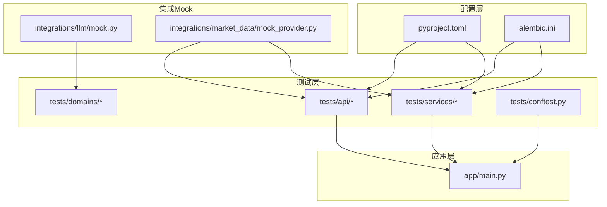
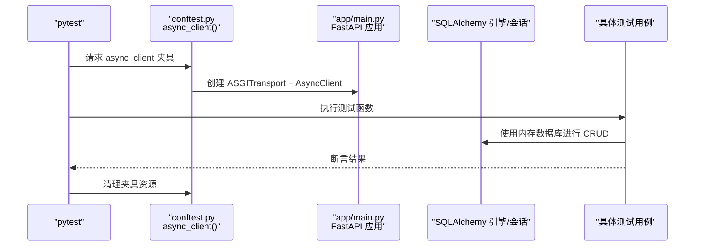
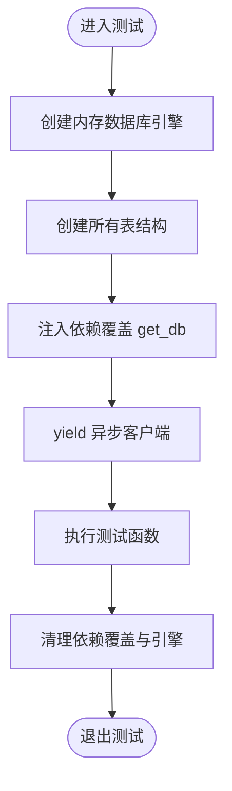
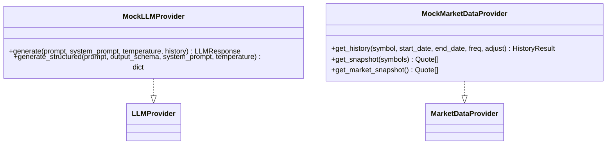
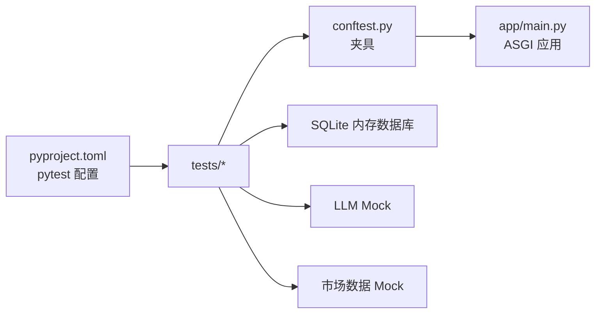

# 测试基础设施

<cite>
**本文引用的文件**
- [backend/tests/conftest.py](file://backend/tests/conftest.py)
- [backend/pyproject.toml](file://backend/pyproject.toml)
- [backend/alembic.ini](file://backend/alembic.ini)
- [backend/app/main.py](file://backend/app/main.py)
- [backend/tests/api/test_backtests.py](file://backend/tests/api/test_backtests.py)
- [backend/tests/services/test_daily_backtest.py](file://backend/tests/services/test_daily_backtest.py)
- [backend/app/integrations/llm/mock.py](file://backend/app/integrations/llm/mock.py)
- [backend/app/integrations/market_data/mock_provider.py](file://backend/app/integrations/market_data/mock_provider.py)
</cite>

## 目录
1. [引言](#引言)
2. [项目结构](#项目结构)
3. [核心组件](#核心组件)
4. [架构总览](#架构总览)
5. [详细组件分析](#详细组件分析)
6. [依赖分析](#依赖分析)
7. [性能考虑](#性能考虑)
8. [故障排查指南](#故障排查指南)
9. [结论](#结论)
10. [附录](#附录)

## 引言
本指南面向 llmine-quant 的后端测试基础设施，系统性阐述测试环境配置、测试数据管理、Mock 对象配置与测试工具链设置；深入解析 pytest 配置、测试夹具（fixture）设计、数据库测试环境与异步测试配置；并提供测试覆盖率、CI/CD 集成、测试报告生成与测试性能优化的实现方案，涵盖测试数据种子、测试环境隔离、并行测试执行与测试调试工具的使用方法。

## 项目结构
后端测试位于 backend/tests 目录，按功能域划分为 api、domains、services 子目录，并通过 conftest.py 提供共享的异步 HTTP 客户端夹具。pytest 配置集中在 pyproject.toml 中，数据库迁移配置在 alembic.ini 中，应用入口在 app/main.py 中。

图表来源
- [backend/tests/conftest.py:1-15](file://backend/tests/conftest.py#L1-L15)
- [backend/app/main.py:1-65](file://backend/app/main.py#L1-L65)
- [backend/pyproject.toml:68-72](file://backend/pyproject.toml#L68-L72)
- [backend/alembic.ini:58](file://backend/alembic.ini#L58)
- [backend/app/integrations/llm/mock.py:159-193](file://backend/app/integrations/llm/mock.py#L159-L193)
- [backend/app/integrations/market_data/mock_provider.py:29-109](file://backend/app/integrations/market_data/mock_provider.py#L29-L109)

章节来源
- [backend/tests/conftest.py:1-15](file://backend/tests/conftest.py#L1-L15)
- [backend/pyproject.toml:68-72](file://backend/pyproject.toml#L68-L72)
- [backend/alembic.ini:58](file://backend/alembic.ini#L58)
- [backend/app/main.py:1-65](file://backend/app/main.py#L1-L65)

## 核心组件
- 异步 HTTP 客户端夹具：通过 ASGI 传输在内存中启动 FastAPI 应用，提供无需外部网络的端到端测试客户端。
- 数据库测试环境：针对每个测试用例或模块创建独立的 SQLite 内存数据库，确保测试隔离与可重复性。
- Mock 对象体系：LLM 与市场数据提供 Mock 实现，保证离线与无网络场景下的稳定测试。
- pytest 工具链：启用 asyncio 自动模式、覆盖率统计与报告输出，支持并行与插件扩展。

章节来源
- [backend/tests/conftest.py:9-14](file://backend/tests/conftest.py#L9-L14)
- [backend/tests/api/test_backtests.py:15-33](file://backend/tests/api/test_backtests.py#L15-L33)
- [backend/tests/services/test_daily_backtest.py:33-43](file://backend/tests/services/test_daily_backtest.py#L33-L43)
- [backend/app/integrations/llm/mock.py:159-193](file://backend/app/integrations/llm/mock.py#L159-L193)
- [backend/app/integrations/market_data/mock_provider.py:29-109](file://backend/app/integrations/market_data/mock_provider.py#L29-L109)
- [backend/pyproject.toml:68-72](file://backend/pyproject.toml#L68-L72)

## 架构总览
下图展示测试执行的关键流程：pytest 发现测试、加载 conftest 夹具、启动 ASGI 应用、注入数据库会话、执行测试并产出覆盖率报告。

图表来源
- [backend/tests/conftest.py:9-14](file://backend/tests/conftest.py#L9-L14)
- [backend/app/main.py:39-65](file://backend/app/main.py#L39-L65)
- [backend/tests/api/test_backtests.py:15-33](file://backend/tests/api/test_backtests.py#L15-L33)
- [backend/tests/services/test_daily_backtest.py:33-43](file://backend/tests/services/test_daily_backtest.py#L33-L43)

## 详细组件分析

### pytest 配置与工具链
- 异步模式：pytest.ini_options 中设置 asyncio_mode 为 auto，自动适配协程测试。
- 测试路径：testpaths 指向 tests，统一发现与执行。
- 覆盖率：addopts 启用 --cov=app 并输出缺失项报告，便于识别未覆盖代码。
- 开发依赖：dev 组包含 pytest、pytest-asyncio、pytest-cov 等，满足测试与覆盖率需求。
- 类型检查与格式化：ruff、mypy、pyright 配置确保代码风格与类型安全。

章节来源
- [backend/pyproject.toml:68-72](file://backend/pyproject.toml#L68-L72)
- [backend/pyproject.toml:29-38](file://backend/pyproject.toml#L29-L38)
- [backend/pyproject.toml:48-77](file://backend/pyproject.toml#L48-L77)

### 测试夹具（fixture）设计
- 全局异步客户端：在 tests/conftest.py 中定义 async_client 夹具，使用 ASGITransport 直连 FastAPI 应用，避免启动真实 HTTP 服务器，提升测试速度与稳定性。
- 模块级数据库会话：在具体测试文件中定义 client_session 或 session 夹具，使用 sqlite+aiosqlite:///:memory: 创建内存数据库，初始化表结构，注入依赖覆盖 get_db，结束后清理依赖与引擎。

图表来源
- [backend/tests/conftest.py:9-14](file://backend/tests/conftest.py#L9-L14)
- [backend/tests/api/test_backtests.py:15-33](file://backend/tests/api/test_backtests.py#L15-L33)
- [backend/tests/services/test_daily_backtest.py:33-43](file://backend/tests/services/test_daily_backtest.py#L33-L43)

章节来源
- [backend/tests/conftest.py:9-14](file://backend/tests/conftest.py#L9-L14)
- [backend/tests/api/test_backtests.py:15-33](file://backend/tests/api/test_backtests.py#L15-L33)
- [backend/tests/services/test_daily_backtest.py:33-43](file://backend/tests/services/test_daily_backtest.py#L33-L43)

### 数据库测试环境
- 迁移脚本位置：alembic.ini 指定 script_location 为 app/db/migrations，确保迁移发现与执行路径正确。
- 连接字符串：sqlalchemy.url 默认指向本地 PostgreSQL（asyncpg），用于迁移与开发；测试中使用 sqlite+aiosqlite 内存数据库以实现隔离与快速回放。
- 表结构初始化：在夹具中使用 Base.metadata.create_all 初始化测试表，确保每个测试在干净的数据库状态上运行。

章节来源
- [backend/alembic.ini:5](file://backend/alembic.ini#L5)
- [backend/alembic.ini:58](file://backend/alembic.ini#L58)
- [backend/tests/api/test_backtests.py:17-19](file://backend/tests/api/test_backtests.py#L17-L19)
- [backend/tests/services/test_daily_backtest.py:35-37](file://backend/tests/services/test_daily_backtest.py#L35-L37)

### 异步测试配置
- 应用生命周期：app/main.py 中 lifespan 在启动时记录配置信息并在关闭时清理资源，确保测试期间应用状态可控。
- 协程测试：pytest-asyncio 的 asyncio_mode=auto 使测试函数与被测协程自然协作，无需手动事件循环管理。

章节来源
- [backend/app/main.py:20-36](file://backend/app/main.py#L20-L36)
- [backend/pyproject.toml:69](file://backend/pyproject.toml#L69)

### 测试数据管理与 Mock 对象
- LLM Mock：MockLLMProvider 返回确定性的策略模板与结构化输出，屏蔽真实 LLM API，保证测试一致性与离线可用性。
- 市场数据 Mock：MockMarketDataProvider 为指定蓝筹股票生成确定性 OHLCV 序列，支持历史与快照查询，避免网络依赖与数据漂移。
- 测试数据种子：Mock 提供 per-symbol 种子价格状态，确保多次调用间漂移累积一致，便于复现实验结果。

图表来源
- [backend/app/integrations/llm/mock.py:159-193](file://backend/app/integrations/llm/mock.py#L159-L193)
- [backend/app/integrations/market_data/mock_provider.py:29-109](file://backend/app/integrations/market_data/mock_provider.py#L29-L109)

章节来源
- [backend/app/integrations/llm/mock.py:159-193](file://backend/app/integrations/llm/mock.py#L159-L193)
- [backend/app/integrations/market_data/mock_provider.py:29-109](file://backend/app/integrations/market_data/mock_provider.py#L29-L109)

### API 层测试示例
- 端到端回测：通过 async_client 调用 /api/v1/backtests/ 接口，结合内存数据库断言任务、运行、指标与净值曲线持久化。
- 数据导入与回测：先导入 CSV 市场数据，再触发回测，验证指标与交易序列。
- 分割样本与折线验证：提供 inSampleEndDate 参数，断言 IS/OOS 段指标与净值阶段标记。
- 折线折叠与报告聚合：验证走查折叠生成与报告端点聚合内容。

章节来源
- [backend/tests/api/test_backtests.py:35-91](file://backend/tests/api/test_backtests.py#L35-L91)
- [backend/tests/api/test_backtests.py:109-166](file://backend/tests/api/test_backtests.py#L109-L166)
- [backend/tests/api/test_backtests.py:168-209](file://backend/tests/api/test_backtests.py#L168-L209)
- [backend/tests/api/test_backtests.py:211-259](file://backend/tests/api/test_backtests.py#L211-L259)
- [backend/tests/api/test_backtests.py:261-291](file://backend/tests/api/test_backtests.py#L261-L291)
- [backend/tests/api/test_backtests.py:293-309](file://backend/tests/api/test_backtests.py#L293-L309)

### 服务层测试示例
- 引擎驱动回测：使用 DailyBacktestEngine 执行每日回测，断言交易、净值、指标与费用计算。
- 持久化验证：run_and_persist 将任务、运行、指标与净值点写入数据库，断言实体存在与字段一致性。
- 分割样本与走查：验证 IS/OOS 段指标与阶段标签，以及走查折叠训练/测试窗口顺序与收益。
- 数据错误处理：当无行情或样本不足时抛出 BacktestDataError，断言异常与错误消息。

章节来源
- [backend/tests/services/test_daily_backtest.py:46-68](file://backend/tests/services/test_daily_backtest.py#L46-L68)
- [backend/tests/services/test_daily_backtest.py:70-88](file://backend/tests/services/test_daily_backtest.py#L70-L88)
- [backend/tests/services/test_daily_backtest.py:90-101](file://backend/tests/services/test_daily_backtest.py#L90-L101)
- [backend/tests/services/test_daily_backtest.py:103-140](file://backend/tests/services/test_daily_backtest.py#L103-L140)
- [backend/tests/services/test_daily_backtest.py:142-174](file://backend/tests/services/test_daily_backtest.py#L142-L174)
- [backend/tests/services/test_daily_backtest.py:176-220](file://backend/tests/services/test_daily_backtest.py#L176-L220)
- [backend/tests/services/test_daily_backtest.py:222-266](file://backend/tests/services/test_daily_backtest.py#L222-L266)
- [backend/tests/services/test_daily_backtest.py:268-303](file://backend/tests/services/test_daily_backtest.py#L268-L303)
- [backend/tests/services/test_daily_backtest.py:305-320](file://backend/tests/services/test_daily_backtest.py#L305-L320)
- [backend/tests/services/test_daily_backtest.py:322-339](file://backend/tests/services/test_daily_backtest.py#L322-L339)

## 依赖分析
- 测试对应用的耦合：通过 ASGI 传输直接调用 FastAPI 应用，减少 HTTP 层开销，提高测试执行效率。
- 数据库依赖：测试使用 SQLAlchemy 异步引擎与内存数据库，避免跨测试污染；生产迁移脚本由 alembic.ini 统一管理。
- Mock 依赖：LLM 与市场数据 Mock 解耦外部服务，确保测试可在离线环境稳定运行。

图表来源
- [backend/pyproject.toml:68-72](file://backend/pyproject.toml#L68-L72)
- [backend/tests/conftest.py:9-14](file://backend/tests/conftest.py#L9-L14)
- [backend/app/main.py:39-65](file://backend/app/main.py#L39-L65)
- [backend/app/integrations/llm/mock.py:159-193](file://backend/app/integrations/llm/mock.py#L159-L193)
- [backend/app/integrations/market_data/mock_provider.py:29-109](file://backend/app/integrations/market_data/mock_provider.py#L29-L109)

章节来源
- [backend/pyproject.toml:68-72](file://backend/pyproject.toml#L68-L72)
- [backend/tests/conftest.py:9-14](file://backend/tests/conftest.py#L9-L14)
- [backend/app/main.py:39-65](file://backend/app/main.py#L39-L65)
- [backend/app/integrations/llm/mock.py:159-193](file://backend/app/integrations/llm/mock.py#L159-L193)
- [backend/app/integrations/market_data/mock_provider.py:29-109](file://backend/app/integrations/market_data/mock_provider.py#L29-L109)

## 性能考虑
- 内存数据库：使用 sqlite+aiosqlite 内存数据库替代磁盘文件，显著降低 I/O 开销与测试启动时间。
- ASGI 直连：绕过 TCP/HTTP 层，减少网络与序列化开销，提升端到端测试吞吐。
- Mock 替代外部服务：LLM 与市场数据 Mock 避免网络抖动与外部限流影响，保证测试稳定性与可重复性。
- 并行执行：pytest 支持多进程/多线程并行，结合内存数据库与 Mock 可进一步缩短整体测试时间（需注意并发访问数据库的隔离策略）。
- 覆盖率粒度：--cov=app 精确统计业务模块覆盖率，聚焦关键路径，避免无关文件干扰。

章节来源
- [backend/tests/api/test_backtests.py:17-19](file://backend/tests/api/test_backtests.py#L17-L19)
- [backend/tests/services/test_daily_backtest.py:35-37](file://backend/tests/services/test_daily_backtest.py#L35-L37)
- [backend/tests/conftest.py:12-13](file://backend/tests/conftest.py#L12-L13)
- [backend/app/integrations/llm/mock.py:162-179](file://backend/app/integrations/llm/mock.py#L162-L179)
- [backend/app/integrations/market_data/mock_provider.py:36-38](file://backend/app/integrations/market_data/mock_provider.py#L36-L38)
- [backend/pyproject.toml:68-72](file://backend/pyproject.toml#L68-L72)

## 故障排查指南
- 端到端测试失败：检查 async_client 夹具是否正确创建 ASGITransport 与 AsyncClient，确认 app/main.py 的路由与中间件未阻断请求。
- 数据库相关错误：确认夹具中已注入依赖覆盖 get_db 并在测试结束后清理；检查内存数据库连接与表初始化顺序。
- 覆盖率不更新：核对 pyproject.toml 中 --cov=app 与 --cov-report=term-missing 是否生效；确保测试模块位于 testpaths 指定目录。
- Mock 不生效：确认 Mock 提供者已在配置中启用，且被测试模块正确注入；检查 Mock 返回值与断言匹配关系。
- CI/CD 报告缺失：在 CI 环境中启用覆盖率上传与报告生成步骤，确保覆盖率阈值与 PR 检查联动。

章节来源
- [backend/tests/conftest.py:9-14](file://backend/tests/conftest.py#L9-L14)
- [backend/app/main.py:39-65](file://backend/app/main.py#L39-L65)
- [backend/tests/api/test_backtests.py:23-26](file://backend/tests/api/test_backtests.py#L23-L26)
- [backend/pyproject.toml:68-72](file://backend/pyproject.toml#L68-L72)
- [backend/app/integrations/llm/mock.py:159-193](file://backend/app/integrations/llm/mock.py#L159-L193)
- [backend/app/integrations/market_data/mock_provider.py:29-109](file://backend/app/integrations/market_data/mock_provider.py#L29-L109)

## 结论
本测试基础设施通过 ASGI 直连、内存数据库与 Mock 对象，实现了高性能、可重复、离线稳定的测试体系。配合 pytest 的 asyncio 自动模式与覆盖率配置，能够高效支撑端到端 API 与服务层测试，并为 CI/CD 提供可靠的自动化基线。

## 附录
- 测试命令建议
  - 运行全部测试：pytest
  - 运行特定模块：pytest tests/api/test_backtests.py
  - 并行执行：pytest -n auto
  - 仅运行失败重试：pytest --lf
  - 生成覆盖率报告：pytest --cov=app --cov-report=term-missing --cov-report=html
- CI/CD 集成要点
  - 使用 Python 3.11+ 环境与虚拟环境
  - 安装开发依赖：pip install -e .[dev]
  - 执行测试与覆盖率：pytest --cov=app --cov-report=term-missing
  - 将覆盖率报告上传至 CI 平台（如 codecov）