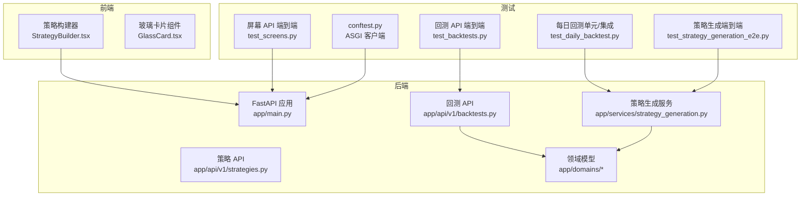
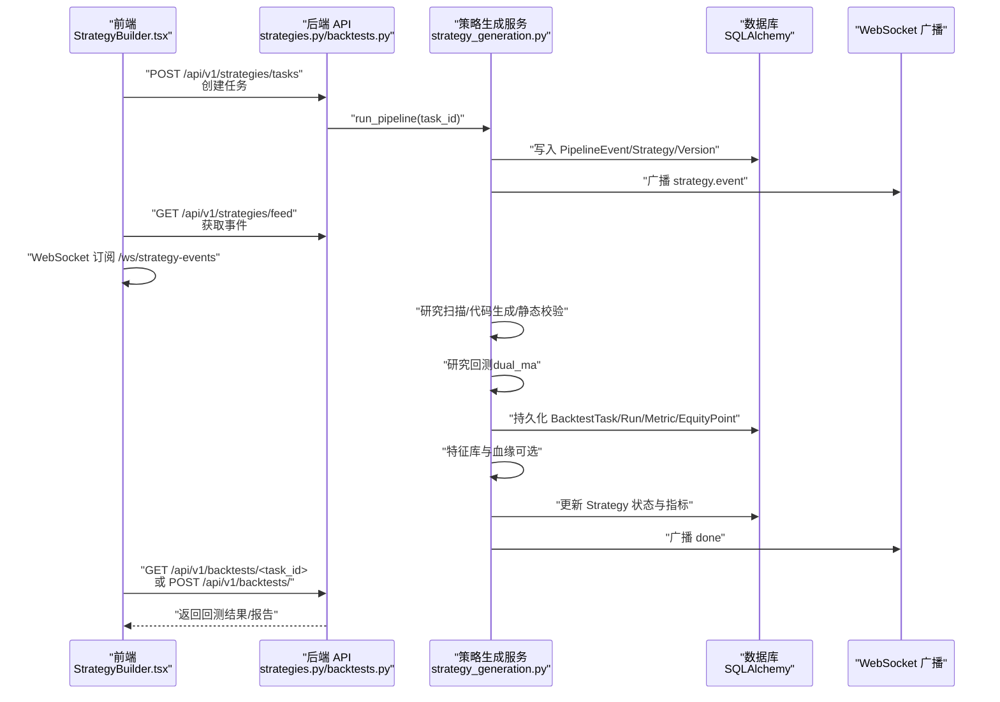
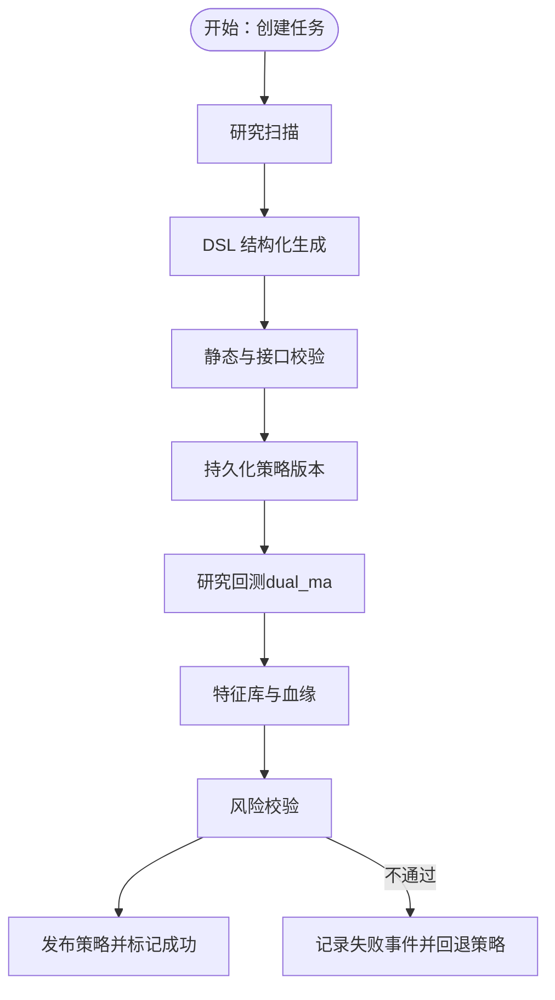
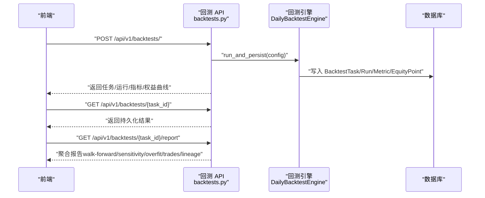
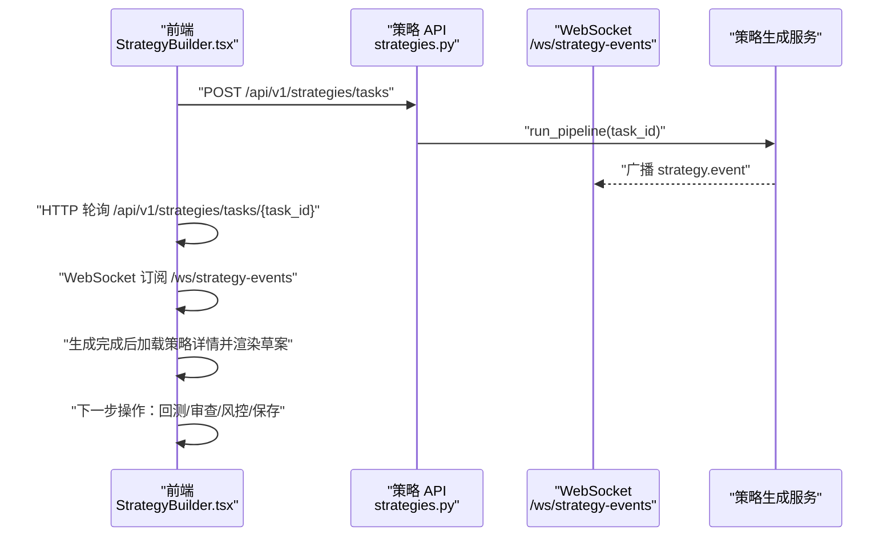
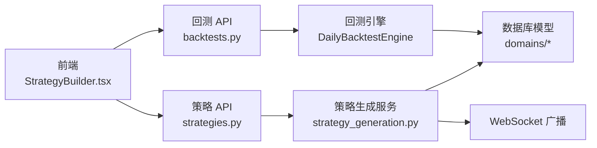

# 端到端测试

<cite>
**本文引用的文件**
- [backend/tests/conftest.py](file://backend/tests/conftest.py)
- [backend/tests/services/test_strategy_generation_e2e.py](file://backend/tests/services/test_strategy_generation_e2e.py)
- [backend/tests/api/test_backtests.py](file://backend/tests/api/test_backtests.py)
- [backend/tests/api/test_screens.py](file://backend/tests/api/test_screens.py)
- [backend/tests/services/test_daily_backtest.py](file://backend/tests/services/test_daily_backtest.py)
- [backend/tests/services/test_strategy_generation_research.py](file://backend/tests/services/test_strategy_generation_research.py)
- [backend/app/api/v1/strategies.py](file://backend/app/api/v1/strategies.py)
- [backend/app/api/v1/backtests.py](file://backend/app/api/v1/backtests.py)
- [backend/app/services/strategy_generation.py](file://backend/app/services/strategy_generation.py)
- [backend/app/domains/strategy/models.py](file://backend/app/domains/strategy/models.py)
- [backend/app/domains/backtest/models.py](file://backend/app/domains/backtest/models.py)
- [frontend/src/screens/Strategy/StrategyBuilder.tsx](file://frontend/src/screens/Strategy/StrategyBuilder.tsx)
- [frontend/src/components/GlassCard.tsx](file://frontend/src/components/GlassCard.tsx)
</cite>

## 目录
1. [简介](#简介)
2. [项目结构](#项目结构)
3. [核心组件](#核心组件)
4. [架构总览](#架构总览)
5. [详细组件分析](#详细组件分析)
6. [依赖分析](#依赖分析)
7. [性能考虑](#性能考虑)
8. [故障排查指南](#故障排查指南)
9. [结论](#结论)
10. [附录](#附录)

## 简介
本指南面向 llmine-quant 的端到端测试，覆盖从用户输入到系统输出的完整路径，包括：
- 自然语言到策略代码的生成式流水线端到端测试
- 基于真实市场数据的回测执行测试
- 用户界面（前端）端到端验证（策略生成、追踪与草案）

同时提供复杂业务流程测试、数据一致性测试、性能基准测试与用户体验测试的实现方案，以及测试环境搭建、测试数据管理、错误注入测试与回归测试策略。

## 项目结构
后端采用 FastAPI + SQLAlchemy 异步 ORM，测试使用 pytest + httpx ASGI 客户端；前端为 React + TypeScript，通过 WebSocket 实时接收策略流水线事件。测试文件分布在 backend/tests 与 frontend 目录下，分别覆盖服务层、API 层与 UI 层。

图表来源
- [backend/tests/conftest.py:9-14](file://backend/tests/conftest.py#L9-L14)
- [backend/tests/services/test_strategy_generation_e2e.py:87-247](file://backend/tests/services/test_strategy_generation_e2e.py#L87-L247)
- [backend/tests/api/test_backtests.py:15-33](file://backend/tests/api/test_backtests.py#L15-L33)
- [backend/tests/api/test_screens.py:13-18](file://backend/tests/api/test_screens.py#L13-L18)
- [backend/tests/services/test_daily_backtest.py:33-44](file://backend/tests/services/test_daily_backtest.py#L33-L44)
- [backend/app/api/v1/strategies.py:301-335](file://backend/app/api/v1/strategies.py#L301-L335)
- [backend/app/api/v1/backtests.py:444-456](file://backend/app/api/v1/backtests.py#L444-L456)
- [backend/app/services/strategy_generation.py:132-374](file://backend/app/services/strategy_generation.py#L132-L374)
- [frontend/src/screens/Strategy/StrategyBuilder.tsx:493-521](file://frontend/src/screens/Strategy/StrategyBuilder.tsx#L493-L521)

章节来源
- [backend/tests/conftest.py:9-14](file://backend/tests/conftest.py#L9-L14)
- [backend/tests/services/test_strategy_generation_e2e.py:87-247](file://backend/tests/services/test_strategy_generation_e2e.py#L87-L247)
- [backend/tests/api/test_backtests.py:15-33](file://backend/tests/api/test_backtests.py#L15-L33)
- [backend/tests/api/test_screens.py:13-18](file://backend/tests/api/test_screens.py#L13-L18)
- [backend/tests/services/test_daily_backtest.py:33-44](file://backend/tests/services/test_daily_backtest.py#L33-L44)
- [backend/app/api/v1/strategies.py:301-335](file://backend/app/api/v1/strategies.py#L301-L335)
- [backend/app/api/v1/backtests.py:444-456](file://backend/app/api/v1/backtests.py#L444-L456)
- [backend/app/services/strategy_generation.py:132-374](file://backend/app/services/strategy_generation.py#L132-L374)
- [frontend/src/screens/Strategy/StrategyBuilder.tsx:493-521](file://frontend/src/screens/Strategy/StrategyBuilder.tsx#L493-L521)

## 核心组件
- 策略生成服务：负责从自然语言到 DSL、再到 Python 策略代码的生成与校验，执行研究回测、风险校验与版本持久化，并广播流水线事件。
- 回测引擎：支持基础研究回测、参数敏感性分析与滚动窗口（Walk-Forward）分析，持久化指标、权益曲线与交易明细。
- API 层：提供策略任务创建、查询、流水线事件、回测任务创建与报告聚合等接口。
- 前端策略构建器：提供策略概要输入、生成追踪、草案展示与下一步操作入口，支持 WebSocket 实时事件订阅。

章节来源
- [backend/app/services/strategy_generation.py:86-374](file://backend/app/services/strategy_generation.py#L86-L374)
- [backend/app/api/v1/backtests.py:444-790](file://backend/app/api/v1/backtests.py#L444-L790)
- [backend/app/api/v1/strategies.py:301-555](file://backend/app/api/v1/strategies.py#L301-L555)
- [frontend/src/screens/Strategy/StrategyBuilder.tsx:102-767](file://frontend/src/screens/Strategy/StrategyBuilder.tsx#L102-L767)

## 架构总览
下图展示了从用户输入到系统输出的关键端到端路径：前端发起策略生成任务，后端通过策略生成服务执行流水线，期间持久化数据库并广播事件；前端通过 WebSocket 获取实时进度，随后调用回测 API 进行真实数据驱动的回测。

图表来源
- [backend/app/api/v1/strategies.py:301-335](file://backend/app/api/v1/strategies.py#L301-L335)
- [backend/app/services/strategy_generation.py:132-374](file://backend/app/services/strategy_generation.py#L132-L374)
- [backend/app/api/v1/backtests.py:444-585](file://backend/app/api/v1/backtests.py#L444-L585)
- [frontend/src/screens/Strategy/StrategyBuilder.tsx:391-491](file://frontend/src/screens/Strategy/StrategyBuilder.tsx#L391-L491)

## 详细组件分析

### 组件A：自然语言到策略代码的生成式流水线（端到端）
- 测试目标：验证从自然语言提示到策略版本发布全流程，包括 DSL 解析与语义校验、Python 策略 AST 校验、研究回测、特征库与血缘、风险校验与最终发布。
- 关键断言：
  - 任务状态流转：queued → running → succeeded，携带 backtest 任务/运行 ID 与指标。
  - 策略与版本：策略状态 backtesting，版本 ready，包含代码文本与参数模式。
  - 回测产物：BacktestTask/Run/Metric/EquityPoint 完整持久化，包含 IS/OOS 段指标与权益曲线。
  - 流水线事件：覆盖 research/code_gen/static_check/version/backtest/risk/done 各阶段。
  - 特征与血缘：FeatureSet/FeatureUsage/LineageNode/Edge 存在且关联正确。
  - 失败场景：无市场数据时回测失败，任务标记失败，策略退回 draft。
- 测试数据：内存 SQLite + 内置 mock LLM Provider，种子 60 天日线数据构造双均线穿越。

图表来源
- [backend/tests/services/test_strategy_generation_e2e.py:87-247](file://backend/tests/services/test_strategy_generation_e2e.py#L87-L247)
- [backend/app/services/strategy_generation.py:132-374](file://backend/app/services/strategy_generation.py#L132-L374)

章节来源
- [backend/tests/services/test_strategy_generation_e2e.py:87-247](file://backend/tests/services/test_strategy_generation_e2e.py#L87-L247)
- [backend/app/services/strategy_generation.py:132-374](file://backend/app/services/strategy_generation.py#L132-L374)

### 组件B：真实市场数据驱动的回测执行（端到端）
- 测试目标：验证回测 API 的创建、查询、报告聚合、参数敏感性与滚动窗口分析，确保指标与权益曲线一致性。
- 关键断言：
  - 创建回测：返回 completed 状态、任务/运行 ID、核心指标与每日权益点数量。
  - 查询回测：GET 返回与持久化一致的核心指标，扩展指标暂不存储。
  - CSV 导入：支持从 CSV 导入历史 K 线并直接运行示例策略。
  - IS/OOS 分割：当提供 inSampleEndDate 时，持久化 all/is/oos 三类指标与权益点 phase 标记。
  - 报告聚合：/report 聚合 walk-forward 与 sensitivity 等结果。
  - 错误场景：无市场数据时报 400，分割日期非法时报 400。
- 测试数据：内存 SQLite + 手工构造 K 线序列，或通过 CSV 导入。

图表来源
- [backend/tests/api/test_backtests.py:35-209](file://backend/tests/api/test_backtests.py#L35-L209)
- [backend/app/api/v1/backtests.py:444-790](file://backend/app/api/v1/backtests.py#L444-L790)
- [backend/tests/services/test_daily_backtest.py:176-266](file://backend/tests/services/test_daily_backtest.py#L176-L266)

章节来源
- [backend/tests/api/test_backtests.py:35-209](file://backend/tests/api/test_backtests.py#L35-L209)
- [backend/app/api/v1/backtests.py:444-790](file://backend/app/api/v1/backtests.py#L444-L790)
- [backend/tests/services/test_daily_backtest.py:176-266](file://backend/tests/services/test_daily_backtest.py#L176-L266)

### 组件C：页面交互与实时追踪（端到端）
- 测试目标：验证前端策略构建器的页面交互、生成追踪、实时事件订阅与草案展示。
- 关键断言：
  - 页面元素：概要表单（市场、股票池、策略类型、风险偏好、自然语言）、生成按钮、追踪面板与原始日志开关。
  - 生成流程：创建任务后，HTTP 轮询与 WebSocket 双通道驱动完成；完成时加载策略详情并生成草案。
  - 实时事件：WebSocket 订阅 /ws/strategy-events，按阶段更新追踪面板与原始日志。
  - 下一步操作：运行回测、审查信号逻辑、风控检查、保存草稿。
- 测试数据：通过 ASGI 测试客户端与内存会话，模拟后端 API 与 WebSocket。

图表来源
- [frontend/src/screens/Strategy/StrategyBuilder.tsx:493-521](file://frontend/src/screens/Strategy/StrategyBuilder.tsx#L493-L521)
- [frontend/src/screens/Strategy/StrategyBuilder.tsx:251-491](file://frontend/src/screens/Strategy/StrategyBuilder.tsx#L251-L491)
- [backend/app/api/v1/strategies.py:317-335](file://backend/app/api/v1/strategies.py#L317-L335)
- [backend/app/services/strategy_generation.py:556-584](file://backend/app/services/strategy_generation.py#L556-L584)

章节来源
- [frontend/src/screens/Strategy/StrategyBuilder.tsx:102-767](file://frontend/src/screens/Strategy/StrategyBuilder.tsx#L102-L767)
- [backend/app/api/v1/strategies.py:317-335](file://backend/app/api/v1/strategies.py#L317-L335)
- [backend/app/services/strategy_generation.py:556-584](file://backend/app/services/strategy_generation.py#L556-L584)

### 组件D：屏幕 API 端到端验证
- 测试目标：验证仪表盘、数据、策略、回测、风控、组合、执行、解释、安全、协作、审计等各屏的接口可用性与返回结构。
- 关键断言：
  - 健康检查与概览：/health、/api/v1/dashboard/overview、/api/v1/data/overview、/api/v1/strategies/overview、/api/v1/backtests/overview 等。
  - 风控熔断：触发与恢复。
  - 组合与执行：审批与再平衡提案。
  - 安全与权限：密钥轮换。
  - 协作与审计：评审与审计概览。
- 测试方法：ASGI 测试客户端 + 内存数据库 + 依赖覆盖（如需要）。

章节来源
- [backend/tests/api/test_screens.py:98-326](file://backend/tests/api/test_screens.py#L98-L326)

## 依赖分析
- 组件耦合：
  - 策略生成服务依赖 LLM Provider（mock 或真实）、回测引擎、特征库与血缘服务、审计与 WebSocket 广播。
  - 回测 API 依赖回测引擎与数据库模型，提供统一的报告聚合接口。
  - 前端通过 REST 与 WebSocket 与后端交互，依赖上下文与状态管理。
- 外部依赖：
  - httpx ASGITransport 用于测试客户端。
  - sqlite+aiosqlite 用于内存数据库测试。
  - WebSocket 服务器由后端统一管理。

图表来源
- [frontend/src/screens/Strategy/StrategyBuilder.tsx:391-491](file://frontend/src/screens/Strategy/StrategyBuilder.tsx#L391-L491)
- [backend/app/api/v1/strategies.py:301-335](file://backend/app/api/v1/strategies.py#L301-L335)
- [backend/app/api/v1/backtests.py:444-585](file://backend/app/api/v1/backtests.py#L444-L585)
- [backend/app/services/strategy_generation.py:132-374](file://backend/app/services/strategy_generation.py#L132-L374)
- [backend/app/domains/strategy/models.py:9-84](file://backend/app/domains/strategy/models.py#L9-L84)
- [backend/app/domains/backtest/models.py:9-155](file://backend/app/domains/backtest/models.py#L9-L155)

章节来源
- [backend/app/services/strategy_generation.py:86-374](file://backend/app/services/strategy_generation.py#L86-L374)
- [backend/app/api/v1/backtests.py:444-790](file://backend/app/api/v1/backtests.py#L444-L790)
- [backend/app/domains/strategy/models.py:9-84](file://backend/app/domains/strategy/models.py#L9-L84)
- [backend/app/domains/backtest/models.py:9-155](file://backend/app/domains/backtest/models.py#L9-L155)

## 性能考虑
- 测试并发与隔离：使用内存数据库与独立会话工厂，避免跨测试干扰；必要时并行运行独立测试集。
- 数据生成效率：通过批量插入与事务提交减少 IO；对回测测试使用紧凑的时间序列与最小化参数空间。
- WebSocket 事件风暴：前端轮询与 WS 并行，注意去重与幂等处理，避免重复完成。
- 指标计算：回测指标在引擎内部一次性计算并持久化，避免重复计算；报告聚合按需读取。
- LLM 调用：测试中强制使用 mock 提供商，避免外部依赖导致的不稳定与耗时。

## 故障排查指南
- 策略生成失败：
  - 检查 DSL 解析与语义校验是否通过；查看 PipelineEvent 中失败阶段与 detail。
  - 确认市场数据是否存在（无数据将导致研究回测失败）。
- 回测失败：
  - 检查 /api/v1/backtests/{task_id} 返回的错误信息；确认 inSampleEndDate 合法性。
  - 核对 CSV 导入路径与格式，确保 K 线字段齐全。
- 前端无事件：
  - 确认 WebSocket 地址与协议（http/https）匹配；检查浏览器控制台与网络面板。
  - 确认任务 ID 与 WS 主题一致；避免重复完成导致的连接提前关闭。
- 数据一致性：
  - 对比 GET 与持久化指标；扩展指标（如 calmarRatio）仅在运行时计算，不落库。
  - IS/OOS 分割后，权益点 phase 字段应正确标注。

章节来源
- [backend/tests/services/test_strategy_generation_e2e.py:214-247](file://backend/tests/services/test_strategy_generation_e2e.py#L214-L247)
- [backend/tests/api/test_backtests.py:93-107](file://backend/tests/api/test_backtests.py#L93-L107)
- [backend/tests/api/test_backtests.py:293-309](file://backend/tests/api/test_backtests.py#L293-L309)
- [frontend/src/screens/Strategy/StrategyBuilder.tsx:391-491](file://frontend/src/screens/Strategy/StrategyBuilder.tsx#L391-L491)

## 结论
本指南提供了 llmine-quant 端到端测试的系统化方案，覆盖生成式策略流水线、真实数据驱动回测与前端交互验证。通过内存数据库、mock LLM 与 ASGI 测试客户端，测试具备高隔离性与可重复性；结合 WebSocket 实时事件与报告聚合接口，能够全面验证复杂业务流程与用户体验。

## 附录

### 测试环境搭建
- 后端测试：
  - 使用 pytest 运行 backend/tests 下的测试文件。
  - conftest.py 提供 ASGI 测试客户端，自动注入 FastAPI 应用。
- 前端测试：
  - 使用 Vite 开发服务器启动前端，访问策略构建器页面进行交互测试。
  - WebSocket 事件通过 /ws/strategy-events 订阅，需与后端联调。

章节来源
- [backend/tests/conftest.py:9-14](file://backend/tests/conftest.py#L9-L14)
- [frontend/src/screens/Strategy/StrategyBuilder.tsx:391-491](file://frontend/src/screens/Strategy/StrategyBuilder.tsx#L391-L491)

### 测试数据管理
- 内存数据库：sqlite+aiosqlite:///:memory:，测试结束后自动释放。
- 种子数据：
  - 策略生成端到端：手工构造 60 天日线数据，构造双均线穿越。
  - 回测端到端：CSV 导入或手工插入 K 线序列。
- 依赖覆盖：通过 app.dependency_overrides 在测试中替换数据库会话。

章节来源
- [backend/tests/services/test_strategy_generation_e2e.py:58-94](file://backend/tests/services/test_strategy_generation_e2e.py#L58-L94)
- [backend/tests/api/test_backtests.py:109-166](file://backend/tests/api/test_backtests.py#L109-L166)
- [backend/tests/services/test_daily_backtest.py:341-369](file://backend/tests/services/test_daily_backtest.py#L341-L369)

### 错误注入测试
- 无市场数据：触发回测阶段失败，任务标记 failed，策略退回 draft。
- DSL/AST 校验失败：静态检查阶段失败，任务标记 failed。
- 风险阈值超限：风险阶段失败，任务标记 failed。
- 断言要点：PipelineEvent 中包含失败阶段与 detail；策略状态回退为 draft。

章节来源
- [backend/tests/services/test_strategy_generation_e2e.py:214-247](file://backend/tests/services/test_strategy_generation_e2e.py#L214-L247)
- [backend/app/services/strategy_generation.py:308-374](file://backend/app/services/strategy_generation.py#L308-L374)

### 回归测试策略
- 端到端测试：保留策略生成与回测的完整路径测试，确保关键断言稳定。
- 屏幕 API 测试：定期运行 screens 测试，确保各屏接口可用性。
- 前端交互测试：录制关键用户路径（创建任务 → 实时追踪 → 草案展示 → 下一步操作）。
- 性能回归：对大型回测（如滚动窗口）设定上限时间，发现显著退化及时报警。