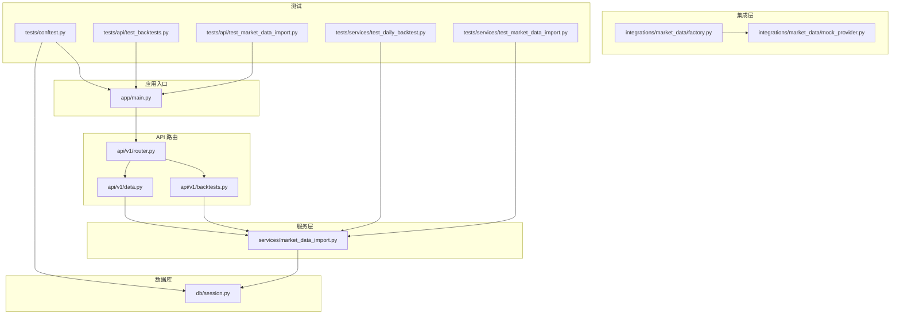
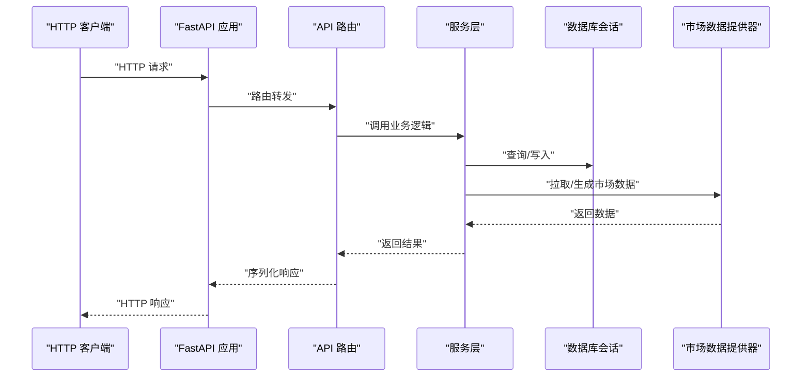
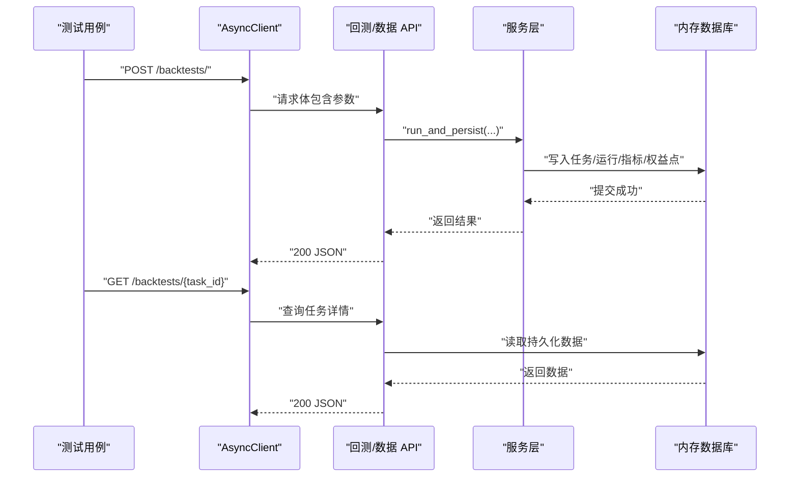
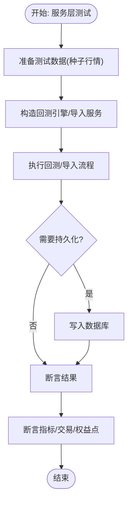
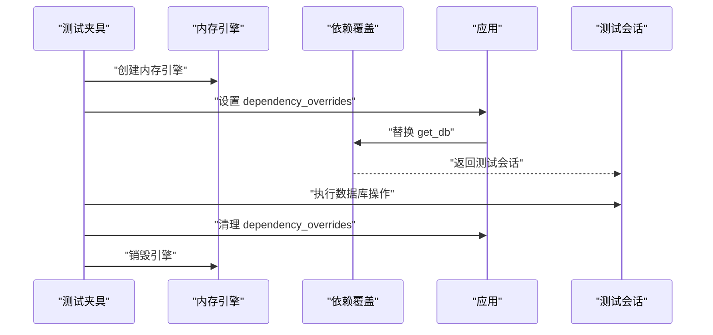
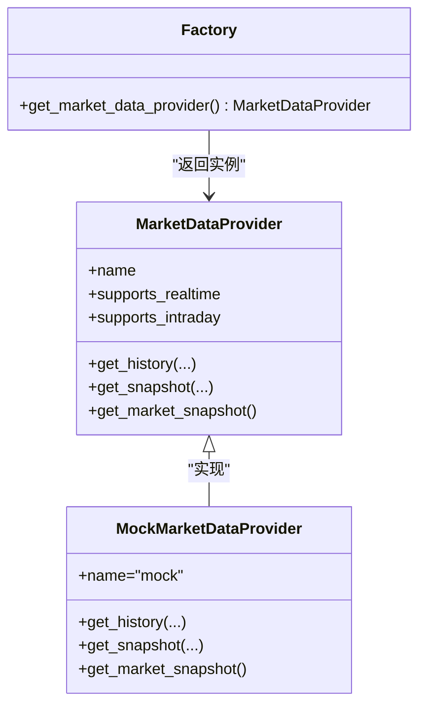

# 集成测试

<cite>
**本文引用的文件**
- [backend/tests/conftest.py](file://backend/tests/conftest.py)
- [backend/app/main.py](file://backend/app/main.py)
- [backend/app/db/session.py](file://backend/app/db/session.py)
- [backend/app/api/v1/router.py](file://backend/app/api/v1/router.py)
- [backend/app/api/v1/backtests.py](file://backend/app/api/v1/backtests.py)
- [backend/app/api/v1/data.py](file://backend/app/api/v1/data.py)
- [backend/app/services/market_data_import.py](file://backend/app/services/market_data_import.py)
- [backend/app/integrations/market_data/factory.py](file://backend/app/integrations/market_data/factory.py)
- [backend/app/integrations/market_data/mock_provider.py](file://backend/app/integrations/market_data/mock_provider.py)
- [backend/tests/api/test_backtests.py](file://backend/tests/api/test_backtests.py)
- [backend/tests/api/test_market_data_import.py](file://backend/tests/api/test_market_data_import.py)
- [backend/tests/services/test_daily_backtest.py](file://backend/tests/services/test_daily_backtest.py)
- [backend/tests/services/test_market_data_import.py](file://backend/tests/services/test_market_data_import.py)
- [backend/pyproject.toml](file://backend/pyproject.toml)
</cite>

## 目录
1. [简介](#简介)
2. [项目结构](#项目结构)
3. [核心组件](#核心组件)
4. [架构总览](#架构总览)
5. [详细组件分析](#详细组件分析)
6. [依赖分析](#依赖分析)
7. [性能考虑](#性能考虑)
8. [故障排查指南](#故障排查指南)
9. [结论](#结论)
10. [附录](#附录)

## 简介
本指南面向 llmine-quant 后端的集成测试，系统性阐述 API 接口测试、服务层集成测试与数据库集成测试的实现方法，并深入解析回测 API 测试、市场数据导入测试、模拟交易测试等关键集成场景。文档提供 HTTP 客户端测试、数据库连接测试、外部服务集成测试与跨模块通信测试的实践方案，涵盖测试数据准备、环境配置、Mock 替代方案与测试隔离策略，确保系统各组件协同工作的可靠性。

## 项目结构
后端采用 FastAPI 应用入口、API 路由聚合、服务层与领域模型分层组织。测试目录按功能域划分：API 测试、服务层测试与域模型测试，配合共享的 pytest 配置与数据库内存引擎，形成可重复、可隔离的集成测试体系。

图表来源
- [backend/app/main.py:1-65](file://backend/app/main.py#L1-L65)
- [backend/app/api/v1/router.py:1-40](file://backend/app/api/v1/router.py#L1-L40)
- [backend/app/api/v1/backtests.py:1-800](file://backend/app/api/v1/backtests.py#L1-L800)
- [backend/app/api/v1/data.py:1-392](file://backend/app/api/v1/data.py#L1-L392)
- [backend/app/services/market_data_import.py:1-426](file://backend/app/services/market_data_import.py#L1-L426)
- [backend/app/integrations/market_data/factory.py:1-57](file://backend/app/integrations/market_data/factory.py#L1-L57)
- [backend/app/integrations/market_data/mock_provider.py:1-109](file://backend/app/integrations/market_data/mock_provider.py#L1-L109)
- [backend/app/db/session.py:1-34](file://backend/app/db/session.py#L1-L34)
- [backend/tests/conftest.py:1-15](file://backend/tests/conftest.py#L1-L15)
- [backend/tests/api/test_backtests.py:1-331](file://backend/tests/api/test_backtests.py#L1-L331)
- [backend/tests/api/test_market_data_import.py:1-61](file://backend/tests/api/test_market_data_import.py#L1-L61)
- [backend/tests/services/test_daily_backtest.py:1-369](file://backend/tests/services/test_daily_backtest.py#L1-L369)
- [backend/tests/services/test_market_data_import.py:1-134](file://backend/tests/services/test_market_data_import.py#L1-L134)

章节来源
- [backend/app/main.py:1-65](file://backend/app/main.py#L1-L65)
- [backend/app/api/v1/router.py:1-40](file://backend/app/api/v1/router.py#L1-L40)
- [backend/tests/conftest.py:1-15](file://backend/tests/conftest.py#L1-L15)

## 核心组件
- 应用入口与生命周期：FastAPI 应用启动时初始化日志、中间件、异常处理器与路由，同时启动行情流服务并在关闭时停止。
- 数据库会话：异步 SQLAlchemy 引擎与会话工厂，提供依赖注入与事务回滚保障。
- API 路由：统一挂载认证、仪表盘、数据、策略、回测、报价、风险、组合、执行、解释、安全、协作、代理与模拟交易等模块。
- 服务层：市场数据导入服务负责 CSV/AKShare 数据清洗、去重、A 股标志位标注与持久化；回测引擎负责日频回测、IS/OOS 分割、走查分析与指标计算。
- 集成层：市场数据提供器工厂按配置选择真实或 Mock 提供器，保证测试与开发环境稳定可用。

章节来源
- [backend/app/main.py:1-65](file://backend/app/main.py#L1-L65)
- [backend/app/db/session.py:1-34](file://backend/app/db/session.py#L1-L34)
- [backend/app/api/v1/router.py:1-40](file://backend/app/api/v1/router.py#L1-L40)
- [backend/app/services/market_data_import.py:1-426](file://backend/app/services/market_data_import.py#L1-L426)
- [backend/app/integrations/market_data/factory.py:1-57](file://backend/app/integrations/market_data/factory.py#L1-L57)

## 架构总览
下图展示了从 HTTP 请求到服务层再到数据库与外部提供器的典型调用链路，以及测试中的依赖注入与内存数据库隔离策略。

图表来源
- [backend/app/main.py:1-65](file://backend/app/main.py#L1-L65)
- [backend/app/api/v1/router.py:1-40](file://backend/app/api/v1/router.py#L1-L40)
- [backend/app/api/v1/backtests.py:444-455](file://backend/app/api/v1/backtests.py#L444-L455)
- [backend/app/api/v1/data.py:155-172](file://backend/app/api/v1/data.py#L155-L172)
- [backend/app/services/market_data_import.py:177-241](file://backend/app/services/market_data_import.py#L177-L241)
- [backend/app/db/session.py:24-34](file://backend/app/db/session.py#L24-L34)
- [backend/app/integrations/market_data/factory.py:23-56](file://backend/app/integrations/market_data/factory.py#L23-L56)

## 详细组件分析

### API 接口测试（HTTP 客户端）
- 共享客户端：通过 pytest fixture 创建基于 ASGI 的异步 HTTP 客户端，避免每次测试重复构造应用实例。
- 依赖注入覆盖：在测试中以内存数据库替换真实数据库依赖，确保测试隔离与可重复性。
- 关键场景：
  - 回测任务创建与查询：校验任务状态、运行 ID、指标与权益曲线完整性。
  - 无行情数据时的错误处理：返回 400 并提示缺少行情。
  - CSV 导入与查询：验证导入条目数、查询结果与 A 股涨停/停牌标志。
  - 走查分析与报告聚合：校验折返期分割、交易明细与报告结构。

图表来源
- [backend/tests/conftest.py:9-14](file://backend/tests/conftest.py#L9-L14)
- [backend/tests/api/test_backtests.py:35-90](file://backend/tests/api/test_backtests.py#L35-L90)
- [backend/tests/api/test_market_data_import.py:32-60](file://backend/tests/api/test_market_data_import.py#L32-L60)
- [backend/app/api/v1/backtests.py:444-455](file://backend/app/api/v1/backtests.py#L444-L455)
- [backend/app/api/v1/data.py:155-172](file://backend/app/api/v1/data.py#L155-L172)

章节来源
- [backend/tests/conftest.py:1-15](file://backend/tests/conftest.py#L1-L15)
- [backend/tests/api/test_backtests.py:1-331](file://backend/tests/api/test_backtests.py#L1-L331)
- [backend/tests/api/test_market_data_import.py:1-61](file://backend/tests/api/test_market_data_import.py#L1-L61)

### 服务层集成测试（回测与市场数据）
- 回测引擎：验证交易生成、成本（佣金、印花税、滑点）计算、核心指标与 IS/OOS 分割持久化。
- 市场数据导入：验证 CSV 行清洗、去重、A 股标志位标注与重复记录替换。
- 走查分析：验证折返期窗口划分与收益指标。

图表来源
- [backend/tests/services/test_daily_backtest.py:46-220](file://backend/tests/services/test_daily_backtest.py#L46-L220)
- [backend/tests/services/test_market_data_import.py:25-106](file://backend/tests/services/test_market_data_import.py#L25-L106)
- [backend/app/services/market_data_import.py:177-241](file://backend/app/services/market_data_import.py#L177-L241)

章节来源
- [backend/tests/services/test_daily_backtest.py:1-369](file://backend/tests/services/test_daily_backtest.py#L1-L369)
- [backend/tests/services/test_market_data_import.py:1-134](file://backend/tests/services/test_market_data_import.py#L1-L134)
- [backend/app/services/market_data_import.py:1-426](file://backend/app/services/market_data_import.py#L1-L426)

### 数据库集成测试（内存引擎与依赖覆盖）
- 内存数据库：使用 sqlite+aiosqlite 内存引擎，每个测试用例独立创建与销毁表结构，避免状态污染。
- 依赖覆盖：通过 app.dependency_overrides 将 get_db 替换为测试专用会话工厂，确保所有数据库操作在内存中进行。
- 断言策略：在回测与导入测试中，直接查询 ORM 模型以验证持久化结果。

图表来源
- [backend/tests/api/test_backtests.py:15-32](file://backend/tests/api/test_backtests.py#L15-L32)
- [backend/tests/api/test_market_data_import.py:12-29](file://backend/tests/api/test_market_data_import.py#L12-L29)
- [backend/app/db/session.py:24-34](file://backend/app/db/session.py#L24-L34)

章节来源
- [backend/tests/api/test_backtests.py:1-331](file://backend/tests/api/test_backtests.py#L1-L331)
- [backend/tests/api/test_market_data_import.py:1-61](file://backend/tests/api/test_market_data_import.py#L1-L61)
- [backend/app/db/session.py:1-34](file://backend/app/db/session.py#L1-L34)

### 外部服务集成测试（市场数据提供器）
- 工厂模式：根据配置选择真实提供器（如 AKShare）或 Mock 提供器，当真实依赖不可用时自动降级。
- Mock 提供器：生成确定性合成行情，保证测试稳定性与可重复性。
- 测试策略：通过工厂与 Mock 提供器，无需真实网络即可完成导入与回测端到端验证。

图表来源
- [backend/app/integrations/market_data/factory.py:23-56](file://backend/app/integrations/market_data/factory.py#L23-L56)
- [backend/app/integrations/market_data/mock_provider.py:29-109](file://backend/app/integrations/market_data/mock_provider.py#L29-L109)

章节来源
- [backend/app/integrations/market_data/factory.py:1-57](file://backend/app/integrations/market_data/factory.py#L1-L57)
- [backend/app/integrations/market_data/mock_provider.py:1-109](file://backend/app/integrations/market_data/mock_provider.py#L1-L109)

### 跨模块通信测试（API 路由与服务层）
- 路由聚合：API v1 路由统一挂载各子模块，便于集中测试与维护。
- 服务编排：回测 API 在路由层调用服务层引擎，服务层再访问数据库与外部提供器，形成清晰的职责边界。
- 测试关注点：确保路由层输入输出模型正确、异常路径返回码与消息一致、服务层持久化行为符合预期。

章节来源
- [backend/app/api/v1/router.py:1-40](file://backend/app/api/v1/router.py#L1-L40)
- [backend/app/api/v1/backtests.py:444-455](file://backend/app/api/v1/backtests.py#L444-L455)
- [backend/app/api/v1/data.py:155-172](file://backend/app/api/v1/data.py#L155-L172)

## 依赖分析
- 运行时依赖：FastAPI、SQLAlchemy 异步、HTTPX、Celery、Redis 等。
- 可选依赖：LLM（Anthropic/OpenAI）、市场数据（AKShare）。
- 测试依赖：pytest、pytest-asyncio、httpx、覆盖率工具。

章节来源
- [backend/pyproject.toml:1-78](file://backend/pyproject.toml#L1-L78)

## 性能考虑
- 内存数据库：使用 sqlite+aiosqlite 内存引擎显著提升测试执行速度，避免磁盘 IO。
- 异步客户端：基于 ASGI 的异步 HTTP 客户端减少阻塞，提高并发测试效率。
- 依赖注入：通过覆盖 get_db 实现测试隔离，避免真实数据库连接带来的性能与稳定性问题。
- 外部依赖降级：Mock 提供器确保在网络不稳定或外部服务不可用时仍可执行集成测试。

## 故障排查指南
- 常见错误与定位
  - 缺少市场数据导致回测失败：检查导入接口是否成功写入数据库，确认查询条件与日期范围。
  - IS/OOS 分割日期非法：核对分割日期是否位于起止日期范围内。
  - 成本参数异常：检查佣金、印花税、滑点参数是否合理，确保数值类型与范围正确。
- 诊断步骤
  - 使用内存数据库断点：在测试中插入断点查看 ORM 查询结果与持久化状态。
  - 校验依赖覆盖：确认 app.dependency_overrides 是否正确设置与清理。
  - 外部提供器切换：在测试中强制使用 Mock 提供器，排除真实网络因素干扰。
- 建议
  - 为关键路径添加更细粒度的断言，覆盖边界条件与异常分支。
  - 对长时间运行的测试（如走查分析）增加超时与重试策略。

章节来源
- [backend/tests/api/test_backtests.py:93-106](file://backend/tests/api/test_backtests.py#L93-L106)
- [backend/tests/services/test_daily_backtest.py:322-339](file://backend/tests/services/test_daily_backtest.py#L322-L339)

## 结论
通过统一的测试夹具、内存数据库与依赖覆盖机制，结合 Mock 提供器与明确的断言策略，llmine-quant 的集成测试能够在不依赖真实外部服务的前提下，稳定验证回测、市场数据导入与跨模块通信的关键流程。建议持续扩展测试覆盖面，强化边界与异常场景，并保持测试数据与环境配置的可维护性。

## 附录
- 测试数据准备
  - 使用临时 CSV 文件与内存数据库，确保测试可重复。
  - 种子行情构造：按日期顺序生成连续价格序列，便于验证交易与指标。
- 环境配置
  - 使用 .env 或测试配置文件控制市场数据提供器与 LLM 提供器。
  - 在 CI 中固定 Python 版本与依赖版本，确保测试一致性。
- Mock 替代方案
  - 当 AKShare 不可用时，工厂自动降级为 Mock 提供器。
  - Mock 提供器生成确定性行情，适合回归测试与离线验证。
- 测试隔离策略
  - 每个测试用例独立创建与销毁内存数据库。
  - 清理 app.dependency_overrides，避免测试间相互影响。