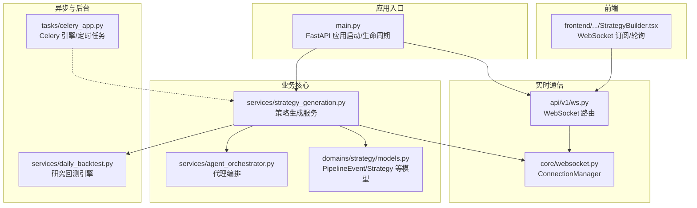
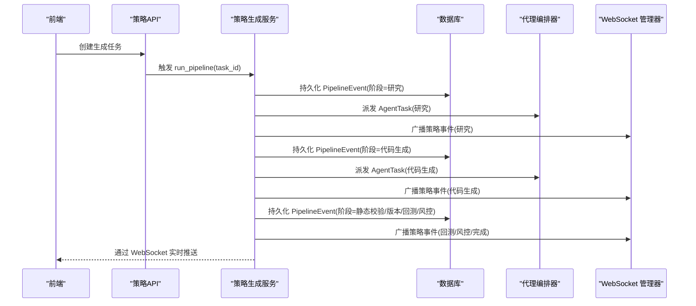
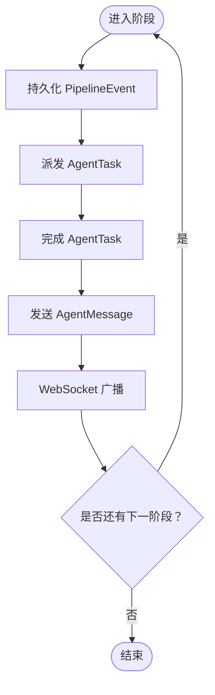
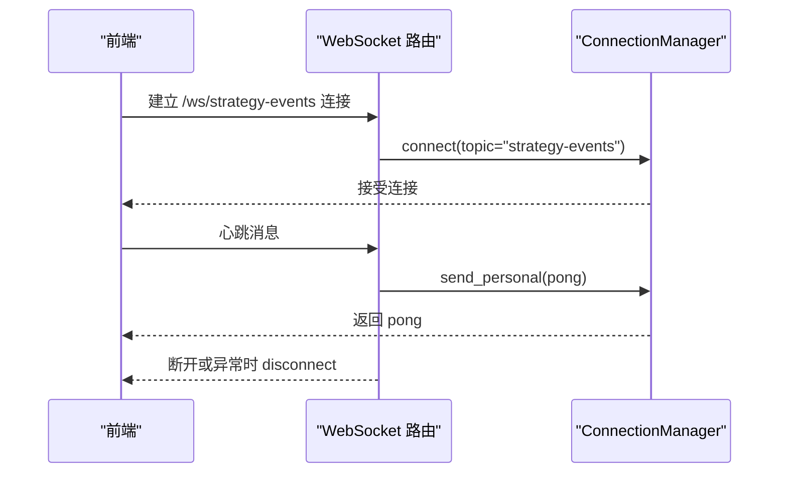
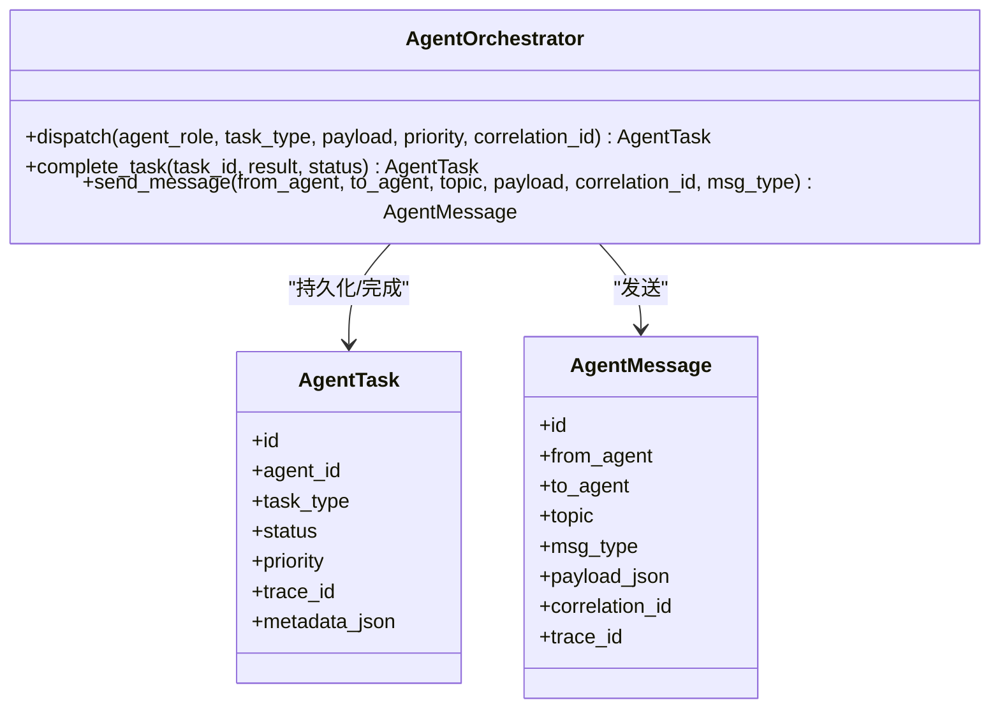
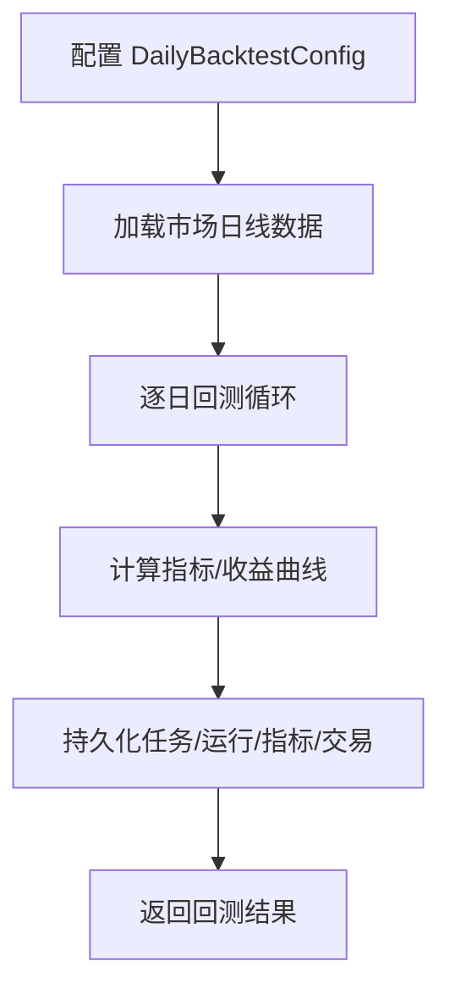
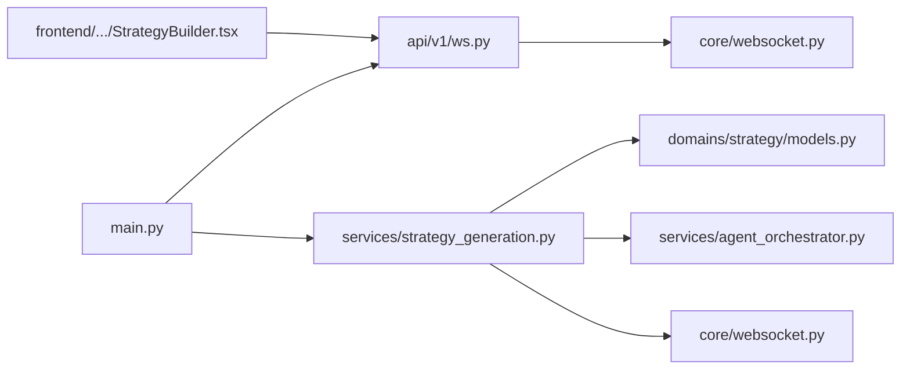

# 事件驱动架构

<cite>
**本文引用的文件**   
- [backend/app/main.py](file://backend/app/main.py)
- [backend/app/core/websocket.py](file://backend/app/core/websocket.py)
- [backend/app/api/v1/ws.py](file://backend/app/api/v1/ws.py)
- [backend/app/services/strategy_generation.py](file://backend/app/services/strategy_generation.py)
- [backend/app/domains/strategy/models.py](file://backend/app/domains/strategy/models.py)
- [backend/app/api/v1/strategies.py](file://backend/app/api/v1/strategies.py)
- [backend/app/services/agent_orchestrator.py](file://backend/app/services/agent_orchestrator.py)
- [backend/app/tasks/celery_app.py](file://backend/app/tasks/celery_app.py)
- [backend/app/services/daily_backtest.py](file://backend/app/services/daily_backtest.py)
- [frontend/src/screens/Strategy/StrategyBuilder.tsx](file://frontend/src/screens/Strategy/StrategyBuilder.tsx)
</cite>

## 目录
1. [简介](#简介)
2. [项目结构](#项目结构)
3. [核心组件](#核心组件)
4. [架构总览](#架构总览)
5. [详细组件分析](#详细组件分析)
6. [依赖关系分析](#依赖关系分析)
7. [性能考量](#性能考量)
8. [故障排查指南](#故障排查指南)
9. [结论](#结论)
10. [附录](#附录)

## 简介
本文件系统性阐述 llmine-quant 的事件驱动架构，围绕“策略生成流水线事件（PipelineEvent）”展开，覆盖事件产生、传播、处理与响应的全链路：从策略生成服务在各阶段持久化事件并广播到 WebSocket，到前端通过 WebSocket 订阅实时事件；同时包含异步任务调度（Celery）、代理编排（Agent Orchestrator）与回测执行等关键环节。文档还总结了事件驱动模式的优势、适用场景、性能权衡，并给出最佳实践与调试技巧。

## 项目结构
后端采用 FastAPI 应用入口统一注册路由与中间件，WebSocket 管理器集中管理连接与主题广播，策略生成服务作为事件主控协调各阶段与外部系统，API 层提供 REST 接口与 WebSocket 端点，前端通过 WebSocket 实时订阅策略事件。

**图表来源**
- [backend/app/main.py:1-65](file://backend/app/main.py#L1-L65)
- [backend/app/api/v1/ws.py:1-50](file://backend/app/api/v1/ws.py#L1-L50)
- [backend/app/core/websocket.py:1-45](file://backend/app/core/websocket.py#L1-L45)
- [backend/app/services/strategy_generation.py:1-584](file://backend/app/services/strategy_generation.py#L1-L584)
- [backend/app/domains/strategy/models.py:1-84](file://backend/app/domains/strategy/models.py#L1-L84)
- [backend/app/services/agent_orchestrator.py:1-105](file://backend/app/services/agent_orchestrator.py#L1-L105)
- [backend/app/tasks/celery_app.py:1-42](file://backend/app/tasks/celery_app.py#L1-L42)
- [backend/app/services/daily_backtest.py:1-800](file://backend/app/services/daily_backtest.py#L1-L800)
- [frontend/src/screens/Strategy/StrategyBuilder.tsx:357-394](file://frontend/src/screens/Strategy/StrategyBuilder.tsx#L357-L394)

**章节来源**
- [backend/app/main.py:1-65](file://backend/app/main.py#L1-L65)
- [backend/app/api/v1/ws.py:1-50](file://backend/app/api/v1/ws.py#L1-L50)
- [backend/app/core/websocket.py:1-45](file://backend/app/core/websocket.py#L1-L45)
- [backend/app/services/strategy_generation.py:1-584](file://backend/app/services/strategy_generation.py#L1-L584)
- [backend/app/domains/strategy/models.py:1-84](file://backend/app/domains/strategy/models.py#L1-L84)
- [backend/app/services/agent_orchestrator.py:1-105](file://backend/app/services/agent_orchestrator.py#L1-L105)
- [backend/app/tasks/celery_app.py:1-42](file://backend/app/tasks/celery_app.py#L1-L42)
- [backend/app/services/daily_backtest.py:1-800](file://backend/app/services/daily_backtest.py#L1-L800)
- [frontend/src/screens/Strategy/StrategyBuilder.tsx:357-394](file://frontend/src/screens/Strategy/StrategyBuilder.tsx#L357-L394)

## 核心组件
- PipelineEvent 模型：记录策略流水线的状态变更事件，包含阶段、事件类型、进度与详情，用于前后端对齐与审计。
- 策略生成服务：在每个阶段持久化 PipelineEvent、派发代理任务、发送代理消息、并通过 WebSocket 广播事件。
- WebSocket 管理器：按主题维护连接列表，支持广播与单播，保障实时事件分发。
- 代理编排器：将任务与消息持久化到数据库，形成可追踪的任务链路。
- 回测引擎：执行研究回测并将结果映射为 PipelineEvent 明细，驱动后续风险检查与发布。
- 前端订阅：通过 WebSocket 订阅策略事件，同时保留轮询兜底，确保弱网环境下的可用性。

**章节来源**
- [backend/app/domains/strategy/models.py:61-71](file://backend/app/domains/strategy/models.py#L61-L71)
- [backend/app/services/strategy_generation.py:377-443](file://backend/app/services/strategy_generation.py#L377-L443)
- [backend/app/core/websocket.py:10-45](file://backend/app/core/websocket.py#L10-L45)
- [backend/app/services/agent_orchestrator.py:31-105](file://backend/app/services/agent_orchestrator.py#L31-L105)
- [backend/app/services/daily_backtest.py:285-371](file://backend/app/services/daily_backtest.py#L285-L371)
- [frontend/src/screens/Strategy/StrategyBuilder.tsx:357-394](file://frontend/src/screens/Strategy/StrategyBuilder.tsx#L357-L394)

## 架构总览
事件驱动贯穿“策略生成流水线”。策略生成服务在每个阶段完成后：
- 持久化 PipelineEvent；
- 通过代理编排器派发 AgentTask；
- 发送 AgentMessage；
- 通过 WebSocket 广播策略事件；
- 在异常时持久化失败事件并回滚状态。

**图表来源**
- [backend/app/api/v1/strategies.py:125-130](file://backend/app/api/v1/strategies.py#L125-L130)
- [backend/app/services/strategy_generation.py:132-373](file://backend/app/services/strategy_generation.py#L132-L373)
- [backend/app/services/strategy_generation.py:377-443](file://backend/app/services/strategy_generation.py#L377-L443)
- [backend/app/services/agent_orchestrator.py:31-105](file://backend/app/services/agent_orchestrator.py#L31-L105)
- [backend/app/core/websocket.py:27-41](file://backend/app/core/websocket.py#L27-L41)

## 详细组件分析

### 策略生成服务（事件主控）
- 责任边界：协调流水线阶段、持久化事件、派发任务、发送消息、广播事件、审计日志与错误归因。
- 关键流程：
  - 阶段化方法 _stage：持久化 PipelineEvent → 派发 AgentTask → 完成任务 → 发送 AgentMessage → 广播 WebSocket。
  - 失败归因：根据异常内容判定失败阶段与事件，持久化失败事件并回写策略状态。
  - 结果落地：回测完成后更新策略指标并标记成功，最终发布事件。
- 数据结构：PipelineEvent、StrategyTask、Strategy、StrategyVersion。

**图表来源**
- [backend/app/services/strategy_generation.py:377-443](file://backend/app/services/strategy_generation.py#L377-L443)
- [backend/app/domains/strategy/models.py:61-71](file://backend/app/domains/strategy/models.py#L61-L71)

**章节来源**
- [backend/app/services/strategy_generation.py:86-373](file://backend/app/services/strategy_generation.py#L86-L373)
- [backend/app/domains/strategy/models.py:9-71](file://backend/app/domains/strategy/models.py#L9-L71)

### WebSocket 实时通信
- 连接管理：ConnectionManager 维护按主题的连接列表，支持连接接入、断开、广播与单播。
- 路由定义：提供通用事件流与策略事件流等多条 WebSocket 端点，分别对应不同主题。
- 前端订阅：前端建立到策略事件流的 WebSocket 连接，同时以轮询兜底，保证弱网与断连恢复。

**图表来源**
- [backend/app/api/v1/ws.py:12-50](file://backend/app/api/v1/ws.py#L12-L50)
- [backend/app/core/websocket.py:10-45](file://backend/app/core/websocket.py#L10-L45)
- [frontend/src/screens/Strategy/StrategyBuilder.tsx:391-394](file://frontend/src/screens/Strategy/StrategyBuilder.tsx#L391-L394)

**章节来源**
- [backend/app/api/v1/ws.py:1-50](file://backend/app/api/v1/ws.py#L1-L50)
- [backend/app/core/websocket.py:1-45](file://backend/app/core/websocket.py#L1-L45)
- [frontend/src/screens/Strategy/StrategyBuilder.tsx:357-394](file://frontend/src/screens/Strategy/StrategyBuilder.tsx#L357-L394)

### 代理编排器（Agent Orchestrator）
- 职责：将任务与消息持久化到数据库，提供任务完成与消息发送能力，配合策略生成服务形成可观测的任务链路。
- 关键点：支持相关 ID（correlation_id）与跟踪 ID（trace_id），便于跨服务追踪。

**图表来源**
- [backend/app/services/agent_orchestrator.py:15-105](file://backend/app/services/agent_orchestrator.py#L15-L105)

**章节来源**
- [backend/app/services/agent_orchestrator.py:1-105](file://backend/app/services/agent_orchestrator.py#L1-L105)

### 回测执行（研究回测）
- 责任：加载日线行情，执行回测循环，计算收益曲线与指标，持久化任务、运行、指标与交易明细。
- 输出：回测结果映射为 PipelineEvent 明细，驱动风险检查与发布。

**图表来源**
- [backend/app/services/daily_backtest.py:185-371](file://backend/app/services/daily_backtest.py#L185-L371)

**章节来源**
- [backend/app/services/daily_backtest.py:185-371](file://backend/app/services/daily_backtest.py#L185-L371)

### 异步任务与定时调度（Celery）
- 责任：承载周期性任务（如盘后复盘），通过队列解耦长耗时任务，提升吞吐与稳定性。
- 配置：序列化方式、时区、延迟确认、每工人生命周期等参数优化可靠性与性能。

**章节来源**
- [backend/app/tasks/celery_app.py:15-42](file://backend/app/tasks/celery_app.py#L15-L42)

## 依赖关系分析
- 策略生成服务依赖数据库模型（PipelineEvent/Strategy/Task/Version）、代理编排器与 WebSocket 管理器。
- WebSocket 路由依赖 WebSocket 管理器。
- 应用入口负责注册路由、中间件与生命周期钩子，启动行情流并在关闭时停止。
- 前端通过 WebSocket 订阅策略事件，同时以轮询兜底。

**图表来源**
- [backend/app/main.py:1-65](file://backend/app/main.py#L1-L65)
- [backend/app/api/v1/ws.py:1-50](file://backend/app/api/v1/ws.py#L1-L50)
- [backend/app/core/websocket.py:1-45](file://backend/app/core/websocket.py#L1-L45)
- [backend/app/services/strategy_generation.py:1-584](file://backend/app/services/strategy_generation.py#L1-L584)
- [backend/app/domains/strategy/models.py:1-84](file://backend/app/domains/strategy/models.py#L1-L84)
- [backend/app/services/agent_orchestrator.py:1-105](file://backend/app/services/agent_orchestrator.py#L1-L105)
- [frontend/src/screens/Strategy/StrategyBuilder.tsx:357-394](file://frontend/src/screens/Strategy/StrategyBuilder.tsx#L357-L394)

**章节来源**
- [backend/app/main.py:1-65](file://backend/app/main.py#L1-L65)
- [backend/app/api/v1/ws.py:1-50](file://backend/app/api/v1/ws.py#L1-L50)
- [backend/app/core/websocket.py:1-45](file://backend/app/core/websocket.py#L1-L45)
- [backend/app/services/strategy_generation.py:1-584](file://backend/app/services/strategy_generation.py#L1-L584)
- [backend/app/domains/strategy/models.py:1-84](file://backend/app/domains/strategy/models.py#L1-L84)
- [backend/app/services/agent_orchestrator.py:1-105](file://backend/app/services/agent_orchestrator.py#L1-L105)
- [frontend/src/screens/Strategy/StrategyBuilder.tsx:357-394](file://frontend/src/screens/Strategy/StrategyBuilder.tsx#L357-L394)

## 性能考量
- 事件广播：WebSocket 广播在连接数较多时可能成为瓶颈，建议按主题分区与限流，避免重复广播。
- 数据库写入：流水线阶段频繁写入 PipelineEvent 与 AgentTask，需关注索引与批量提交策略，减少锁竞争。
- 回测成本：回测引擎涉及大量数据扫描与计算，建议缓存常用数据、分页读取与并行化指标计算。
- 异步任务：Celery 延迟确认与工人生命周期限制有助于稳定吞吐，应结合任务优先级与队列隔离。
- 前端体验：弱网下轮询兜底可提升可用性，但会增加后端压力，建议动态调整轮询间隔与去抖。

## 故障排查指南
- WebSocket 连接异常
  - 现象：前端无法接收策略事件或连接频繁断开。
  - 排查：检查 WebSocket 路由与管理器的日志，确认连接/断开计数与异常捕获；验证前端协议与主机地址。
- 事件未到达前端
  - 现象：后端已广播，前端未收到。
  - 排查：确认订阅主题是否正确（策略事件流 vs 通用事件流）；检查广播 topic 与连接主题一致；观察连接列表清理逻辑。
- 流水线卡住
  - 现象：某阶段长时间无进展。
  - 排查：查看 PipelineEvent 最新记录与对应 AgentTask 状态；检查代理编排器派发与完成流程；核对回测数据可用性。
- 回测失败
  - 现象：回测抛出数据不足或参数非法异常。
  - 排查：检查回测配置（时间范围、标的池）与数据加载；定位 DailyBacktestEngine 抛错位置并修正输入。
- 前端轮询兜底
  - 现象：弱网时事件延迟。
  - 排查：确认轮询间隔与任务状态轮询逻辑；必要时降低轮询频率或合并请求。

**章节来源**
- [backend/app/api/v1/ws.py:12-25](file://backend/app/api/v1/ws.py#L12-L25)
- [backend/app/core/websocket.py:27-41](file://backend/app/core/websocket.py#L27-L41)
- [backend/app/services/strategy_generation.py:313-371](file://backend/app/services/strategy_generation.py#L313-L371)
- [backend/app/services/daily_backtest.py:29-31](file://backend/app/services/daily_backtest.py#L29-L31)
- [frontend/src/screens/Strategy/StrategyBuilder.tsx:366-394](file://frontend/src/screens/Strategy/StrategyBuilder.tsx#L366-L394)

## 结论
llmine-quant 的事件驱动架构以 PipelineEvent 为核心，串联策略生成、代理编排、回测与实时通信，形成高内聚、低耦合的可观测流水线。通过 WebSocket 实时广播与前端订阅，实现了策略生命周期的可视化与交互式反馈；结合 Celery 异步任务与数据库持久化，兼顾了可靠性与扩展性。建议在生产环境中强化广播限流、数据库索引与回测缓存，并完善监控与告警体系，持续优化事件传播与处理性能。

## 附录
- 事件类型与阶段
  - 阶段：research、code_gen、static_check、version、backtest、risk、done。
  - 事件示例：research.scan、code.generated、code.static_check_passed、version.created、backtest.completed、risk.passed/risk.flagged、strategy.published、pipeline.failed 等。
- 前端订阅要点
  - 使用 /ws/strategy-events 主题订阅策略事件；在断连时自动重连；弱网环境下使用轮询兜底。

**章节来源**
- [backend/app/services/strategy_generation.py:160-299](file://backend/app/services/strategy_generation.py#L160-L299)
- [backend/app/api/v1/strategies.py:422-446](file://backend/app/api/v1/strategies.py#L422-L446)
- [frontend/src/screens/Strategy/StrategyBuilder.tsx:391-394](file://frontend/src/screens/Strategy/StrategyBuilder.tsx#L391-L394)