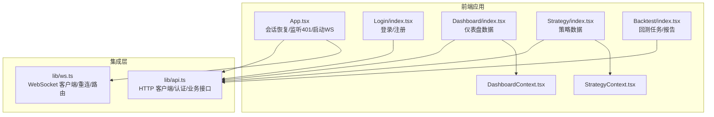
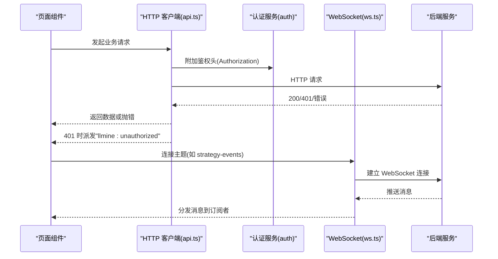
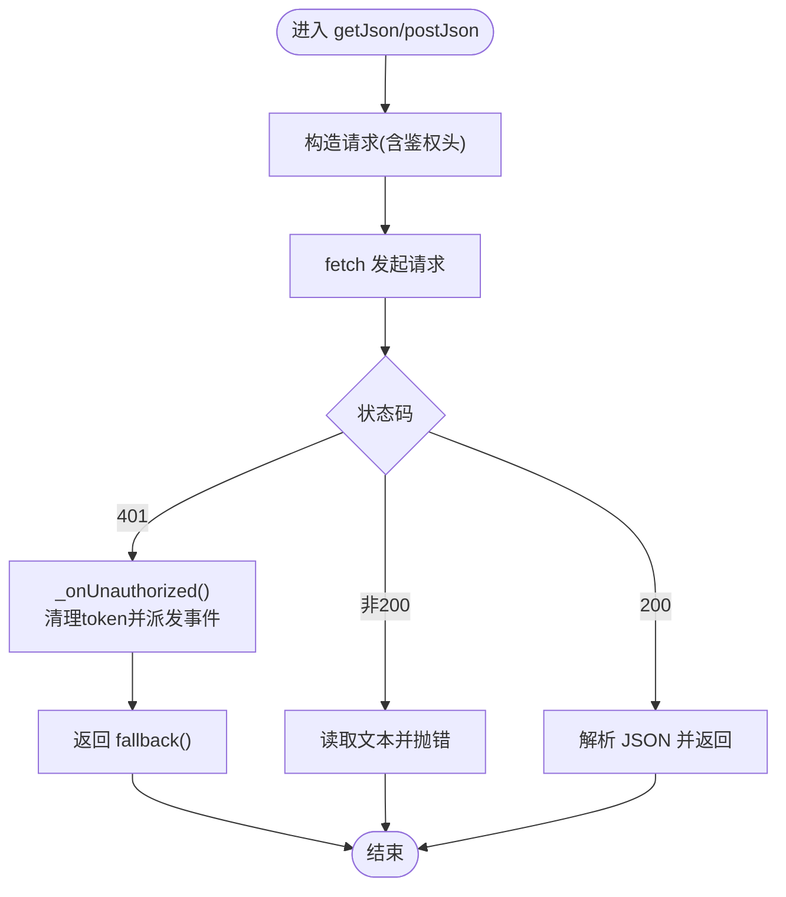
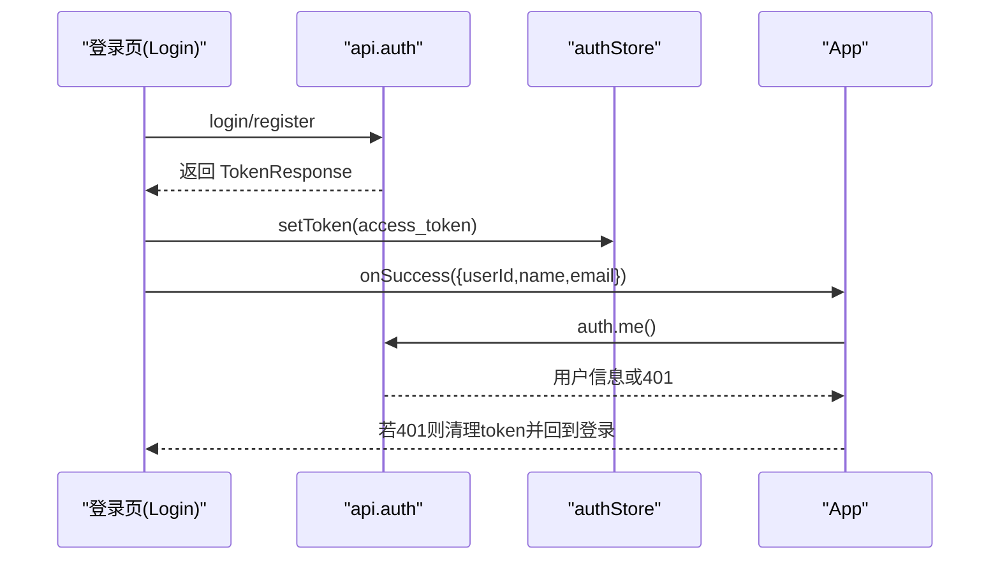
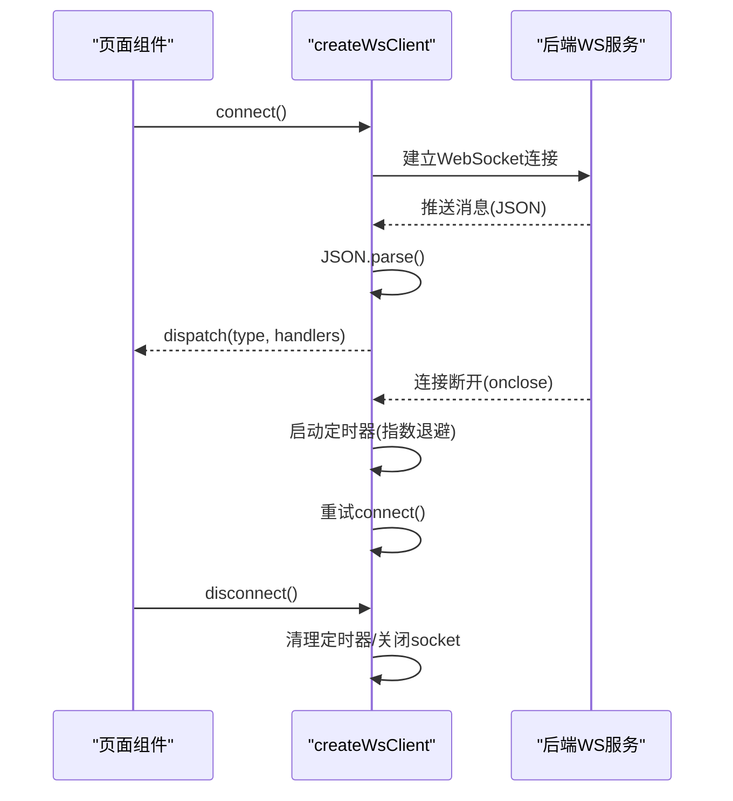
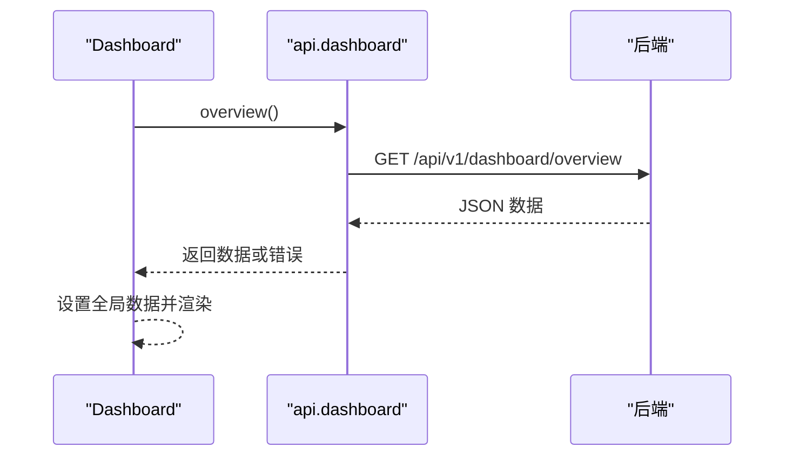
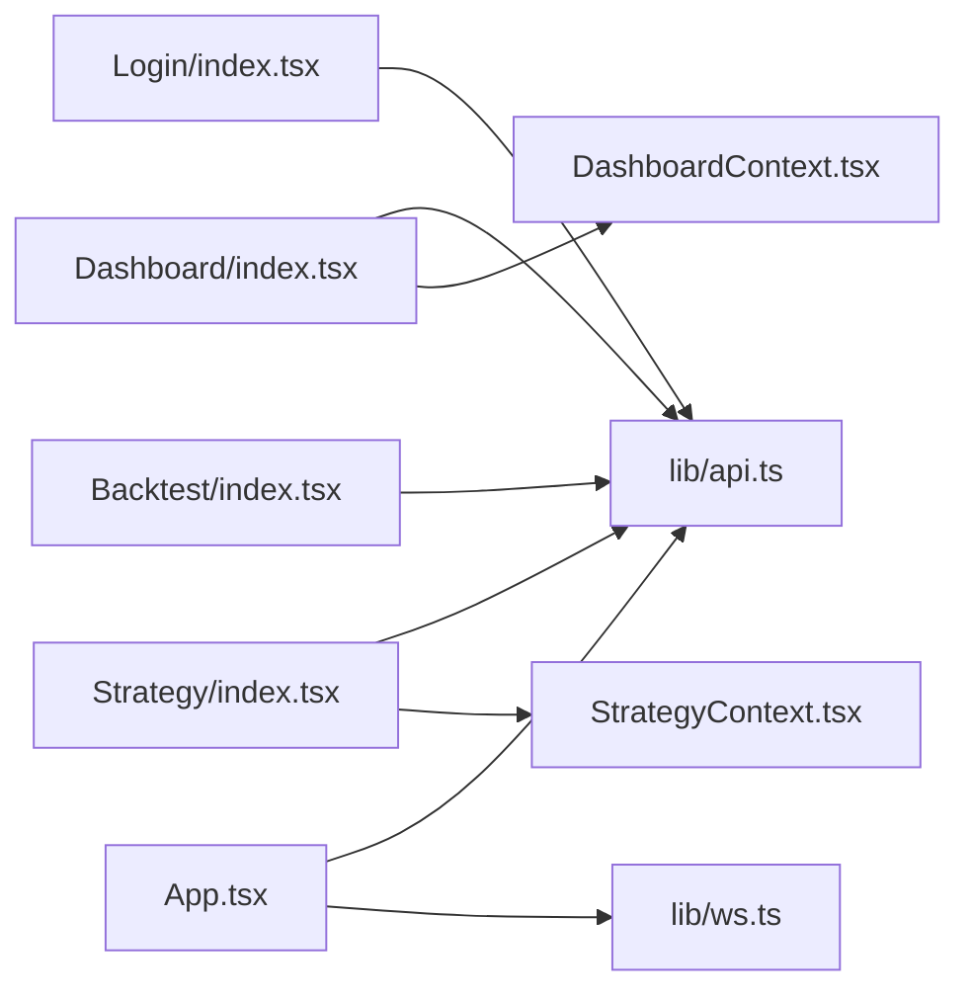

# API 集成层

<cite>
**本文引用的文件**
- [frontend/src/lib/api.ts](file://frontend/src/lib/api.ts)
- [frontend/src/lib/ws.ts](file://frontend/src/lib/ws.ts)
- [frontend/src/App.tsx](file://frontend/src/App.tsx)
- [frontend/src/screens/Login/index.tsx](file://frontend/src/screens/Login/index.tsx)
- [frontend/src/screens/Dashboard/index.tsx](file://frontend/src/screens/Dashboard/index.tsx)
- [frontend/src/screens/Strategy/index.tsx](file://frontend/src/screens/Strategy/index.tsx)
- [frontend/src/screens/Backtest/index.tsx](file://frontend/src/screens/Backtest/index.tsx)
- [frontend/src/contexts/DashboardContext.tsx](file://frontend/src/contexts/DashboardContext.tsx)
- [frontend/src/contexts/StrategyContext.tsx](file://frontend/src/contexts/StrategyContext.tsx)
</cite>

## 目录
1. [简介](#简介)
2. [项目结构](#项目结构)
3. [核心组件](#核心组件)
4. [架构总览](#架构总览)
5. [详细组件分析](#详细组件分析)
6. [依赖关系分析](#依赖关系分析)
7. [性能考量](#性能考量)
8. [故障排查指南](#故障排查指南)
9. [结论](#结论)
10. [附录](#附录)

## 简介
本文件面向 llmine-quant 前端的 API 集成层，系统化梳理 HTTP 客户端封装、认证与会话管理、WebSocket 实时通信、错误处理与安全机制，并结合典型业务场景给出调用模式与最佳实践。重点覆盖以下方面：
- HTTP 客户端封装：统一前缀、鉴权头、通用 GET/POST/PUT/DELETE 封装、401 自动登出与事件派发。
- 认证与会话：Token 存储与恢复、登录/注册/刷新/登出、me 查询、未授权事件监听。
- WebSocket 管理：主题订阅、连接建立、消息路由、心跳与指数退避重连。
- 错误处理与安全：统一错误抛出、401 自动清理、事件驱动的会话失效处理。
- 性能优化：请求去重、并发控制、缓存策略（mock 数据）、加载状态管理。

## 项目结构
API 集成层位于前端工程的 lib 目录，分别提供 HTTP 客户端与 WebSocket 客户端；业务页面通过上下文与组件消费 API 与 WebSocket。

图表来源
- [frontend/src/App.tsx:42-96](file://frontend/src/App.tsx#L42-L96)
- [frontend/src/lib/api.ts:514-779](file://frontend/src/lib/api.ts#L514-L779)
- [frontend/src/lib/ws.ts:27-89](file://frontend/src/lib/ws.ts#L27-L89)
- [frontend/src/screens/Login/index.tsx:10-65](file://frontend/src/screens/Login/index.tsx#L10-L65)
- [frontend/src/screens/Dashboard/index.tsx:17-24](file://frontend/src/screens/Dashboard/index.tsx#L17-L24)
- [frontend/src/screens/Strategy/index.tsx:32-46](file://frontend/src/screens/Strategy/index.tsx#L32-L46)
- [frontend/src/screens/Backtest/index.tsx:137-198](file://frontend/src/screens/Backtest/index.tsx#L137-L198)
- [frontend/src/contexts/DashboardContext.tsx:1-13](file://frontend/src/contexts/DashboardContext.tsx#L1-L13)
- [frontend/src/contexts/StrategyContext.tsx:1-13](file://frontend/src/contexts/StrategyContext.tsx#L1-L13)

章节来源
- [frontend/src/lib/api.ts:1-779](file://frontend/src/lib/api.ts#L1-L779)
- [frontend/src/lib/ws.ts:1-95](file://frontend/src/lib/ws.ts#L1-L95)
- [frontend/src/App.tsx:42-96](file://frontend/src/App.tsx#L42-L96)

## 核心组件
- HTTP 客户端与认证
  - 统一前缀与鉴权头：所有请求自动附加 Authorization: Bearer token。
  - 401 自动处理：收到 401 时清除本地 token 并派发自定义事件，触发登出与路由跳转。
  - 通用方法：getJson/postJson/putJson/deleteJson，负责错误转换与 fallback。
  - 认证 Store：localStorage 持久化 token，提供 setToken/getToken/clearToken/isAuthenticated。
  - 认证接口：login/register/logout/refresh/me。
- 业务接口聚合
  - dashboard、strategy、backtest、explain、portfolio、execution、risk、data、security、collaboration、audit、paper 等模块接口。
  - 支持查询参数与路径参数编码，部分接口提供 mock 回退。
- WebSocket 客户端
  - 主题订阅：strategy-events、execution-events、risk-events。
  - 连接管理：自动重连、指数退避、onmessage 解析与分发、断开清理。
  - 事件路由：支持按消息类型分发，以及通配符分发。

章节来源
- [frontend/src/lib/api.ts:8-21](file://frontend/src/lib/api.ts#L8-L21)
- [frontend/src/lib/api.ts:32-83](file://frontend/src/lib/api.ts#L32-L83)
- [frontend/src/lib/api.ts:514-779](file://frontend/src/lib/api.ts#L514-L779)
- [frontend/src/lib/ws.ts:27-89](file://frontend/src/lib/ws.ts#L27-L89)

## 架构总览
下图展示了从前端组件到 API 层与 WebSocket 层的整体交互：

图表来源
- [frontend/src/lib/api.ts:32-83](file://frontend/src/lib/api.ts#L32-L83)
- [frontend/src/lib/api.ts:514-549](file://frontend/src/lib/api.ts#L514-L549)
- [frontend/src/lib/ws.ts:40-67](file://frontend/src/lib/ws.ts#L40-L67)
- [frontend/src/App.tsx:69-96](file://frontend/src/App.tsx#L69-L96)

## 详细组件分析

### HTTP 客户端封装与请求拦截器
- 请求拦截
  - 统一前缀：API_PREFIX = '/api/v1'。
  - 鉴权头：_authHeader() 在存在 token 时附加 Authorization: Bearer。
  - Content-Type：表单登录使用 application/x-www-form-urlencoded，JSON 接口使用 application/json。
- 响应处理
  - getJson/postJson/putJson：统一处理 401、非 ok 状态码，抛出带 HTTP 码或文本的错误。
  - deleteJson：仅处理 401 与非 ok，返回 void。
- 错误处理机制
  - 401：调用 _onUnauthorized() 清理 token 并派发自定义事件，供上层监听并登出。
  - 其他错误：读取响应文本作为错误信息，兜底为“HTTP 状态码”。
- 通用 GET/POST/PUT/DELETE
  - 提供基础方法，避免重复样板代码，便于扩展与维护。

图表来源
- [frontend/src/lib/api.ts:32-83](file://frontend/src/lib/api.ts#L32-L83)

章节来源
- [frontend/src/lib/api.ts:32-83](file://frontend/src/lib/api.ts#L32-L83)

### 认证状态管理与 Token 管理
- Token 存储
  - 使用 localStorage 保存 token，键名 TOKEN_KEY。
  - authStore 提供 setToken/getToken/clearToken/isAuthenticated。
- 会话恢复
  - 应用启动时检查本地是否已有 token，并调用 api.auth.me() 验证有效性，否则清理 token。
- 登录/注册/刷新/登出
  - login/register：表单/JSON 提交，成功后写入 token。
  - refresh：刷新 token。
  - logout：向后端发送注销请求。
- 未授权处理
  - 401 触发 _onUnauthorized()，清理本地 token 并派发自定义事件。
  - App.tsx 监听该事件，清空用户信息并回到登录页。

图表来源
- [frontend/src/lib/api.ts:514-549](file://frontend/src/lib/api.ts#L514-L549)
- [frontend/src/lib/api.ts:8-21](file://frontend/src/lib/api.ts#L8-L21)
- [frontend/src/App.tsx:55-74](file://frontend/src/App.tsx#L55-L74)
- [frontend/src/screens/Login/index.tsx:28-65](file://frontend/src/screens/Login/index.tsx#L28-L65)

章节来源
- [frontend/src/lib/api.ts:8-21](file://frontend/src/lib/api.ts#L8-L21)
- [frontend/src/lib/api.ts:514-549](file://frontend/src/lib/api.ts#L514-L549)
- [frontend/src/App.tsx:55-74](file://frontend/src/App.tsx#L55-L74)
- [frontend/src/screens/Login/index.tsx:28-65](file://frontend/src/screens/Login/index.tsx#L28-L65)

### WebSocket 连接管理与消息路由
- 连接建立
  - createWsClient(topic) 创建客户端，基于当前协议与主机拼接 WS_BASE。
  - connect() 建立连接，onopen 重置重连延迟。
- 消息路由
  - onmessage 解析 JSON，按 msg.type 分发；若无 type 或为字符串则按 "__all__" 分发；另支持 "*" 通配符。
- 心跳与重连
  - 无显式 ping/pong 心跳；onclose 启动定时器，指数退避（上限 30 秒），避免频繁重连。
- 断开与清理
  - disconnect() 关闭 socket，取消重连定时器，标记不应继续重连。
- 单例客户端
  - strategyWs、executionWs、riskWs 三个主题的单例实例，按需 connect/disconnect。

图表来源
- [frontend/src/lib/ws.ts:27-89](file://frontend/src/lib/ws.ts#L27-L89)

章节来源
- [frontend/src/lib/ws.ts:27-89](file://frontend/src/lib/ws.ts#L27-L89)
- [frontend/src/App.tsx:85-96](file://frontend/src/App.tsx#L85-L96)

### 业务接口与调用模式
- 仪表盘
  - Dashboard 页面在挂载时调用 api.dashboard.overview() 获取全局概览数据。
- 策略工厂
  - Strategy 页面在挂载时调用 api.strategy.overview() 获取策略矩阵与统计；支持刷新回调。
- 回测实验室
  - Backtest 页面在挂载时拉取标的、可回测策略、运行历史；根据配置运行回测/敏感性/Walk-Forward，并加载报告。
- 上下文注入
  - Dashboard/Strategy 页面通过各自的 Provider 注入上下文，供子组件消费。

图表来源
- [frontend/src/screens/Dashboard/index.tsx:17-24](file://frontend/src/screens/Dashboard/index.tsx#L17-L24)
- [frontend/src/lib/api.ts:550-553](file://frontend/src/lib/api.ts#L550-L553)

章节来源
- [frontend/src/screens/Dashboard/index.tsx:17-24](file://frontend/src/screens/Dashboard/index.tsx#L17-L24)
- [frontend/src/screens/Strategy/index.tsx:32-46](file://frontend/src/screens/Strategy/index.tsx#L32-L46)
- [frontend/src/screens/Backtest/index.tsx:137-198](file://frontend/src/screens/Backtest/index.tsx#L137-L198)
- [frontend/src/contexts/DashboardContext.tsx:1-13](file://frontend/src/contexts/DashboardContext.tsx#L1-L13)
- [frontend/src/contexts/StrategyContext.tsx:1-13](file://frontend/src/contexts/StrategyContext.tsx#L1-L13)

### 错误处理与安全机制
- HTTP 错误
  - 非 200：读取响应文本作为错误信息，兜底为“HTTP 状态码”，便于用户感知。
  - 401：清理 token 并派发自定义事件，App.tsx 监听后清空用户并回到登录。
- 会话安全
  - 所有受保护接口自动附加 Authorization 头。
  - 登出时调用后端 logout 接口，确保服务端撤销会话。
- 事件驱动的会话失效
  - 通过自定义事件实现跨组件解耦的登出流程，避免在各页面重复处理 401。

章节来源
- [frontend/src/lib/api.ts:32-83](file://frontend/src/lib/api.ts#L32-L83)
- [frontend/src/App.tsx:69-74](file://frontend/src/App.tsx#L69-L74)

## 依赖关系分析
- 组件对 API 的依赖
  - Login/Logout 流程依赖 api.auth.*。
  - Dashboard/Strategy/Backtest 依赖各自模块的 api.*。
- 组件对 WebSocket 的依赖
  - App.tsx 在用户登录后启动多个主题的 WS 连接，在登出时断开。
- 上下文对数据的依赖
  - DashboardContext/StrategyContext 用于在页面内共享数据，减少重复请求。

图表来源
- [frontend/src/screens/Login/index.tsx:1-176](file://frontend/src/screens/Login/index.tsx#L1-L176)
- [frontend/src/screens/Dashboard/index.tsx:1-47](file://frontend/src/screens/Dashboard/index.tsx#L1-L47)
- [frontend/src/screens/Strategy/index.tsx:1-168](file://frontend/src/screens/Strategy/index.tsx#L1-L168)
- [frontend/src/screens/Backtest/index.tsx:1-800](file://frontend/src/screens/Backtest/index.tsx#L1-L800)
- [frontend/src/App.tsx:1-299](file://frontend/src/App.tsx#L1-L299)
- [frontend/src/lib/api.ts:514-779](file://frontend/src/lib/api.ts#L514-L779)
- [frontend/src/lib/ws.ts:27-89](file://frontend/src/lib/ws.ts#L27-L89)
- [frontend/src/contexts/DashboardContext.tsx:1-13](file://frontend/src/contexts/DashboardContext.tsx#L1-L13)
- [frontend/src/contexts/StrategyContext.tsx:1-13](file://frontend/src/contexts/StrategyContext.tsx#L1-L13)

章节来源
- [frontend/src/App.tsx:42-96](file://frontend/src/App.tsx#L42-L96)
- [frontend/src/lib/api.ts:514-779](file://frontend/src/lib/api.ts#L514-L779)
- [frontend/src/lib/ws.ts:27-89](file://frontend/src/lib/ws.ts#L27-L89)

## 性能考量
- 请求去重与并发控制
  - 当前未见集中式的请求去重与并发限制实现；可在业务层通过“任务 ID + 缓存”或“队列/信号量”进行控制，避免重复请求与风暴。
- 缓存策略
  - 部分接口提供 mock 回退，用于开发与演示；生产环境建议引入更细粒度的缓存与失效策略。
- 加载状态管理
  - 组件内部使用 loading/error/state 管理加载态，建议统一抽象为 Hook，复用在多页面。
- WebSocket 重连
  - 指数退避上限 30 秒，避免频繁重连；可考虑在页面不可见或网络异常时暂停重连。

[本节为通用指导，无需列出具体文件来源]

## 故障排查指南
- 登录后立即 401
  - 检查 api.auth.me() 是否返回 401；确认后端 JWT 有效且未被撤销。
  - 确认 App.tsx 是否正确监听并响应 "llmine:unauthorized" 事件。
- WebSocket 不接收消息
  - 检查 connect() 是否被调用，主题是否正确。
  - 确认 onmessage 是否能解析 JSON，消息是否包含 type 字段。
- 请求报错但无明确提示
  - 检查后端返回的错误文本是否为空，必要时在后端补充错误详情。
- 重连过于频繁
  - 指数退避上限为 30 秒，若仍频繁，检查网络状况或后端连接稳定性。

章节来源
- [frontend/src/App.tsx:69-74](file://frontend/src/App.tsx#L69-L74)
- [frontend/src/lib/ws.ts:40-67](file://frontend/src/lib/ws.ts#L40-L67)
- [frontend/src/lib/api.ts:32-83](file://frontend/src/lib/api.ts#L32-L83)

## 结论
本集成层以简洁的 HTTP 客户端与 WebSocket 客户端为核心，配合统一的鉴权头与 401 处理机制，实现了清晰的认证与会话管理。业务页面通过上下文与组件化消费 API，形成高内聚低耦合的数据流。建议后续在请求去重、并发控制、缓存策略与加载态抽象方面进一步完善，以提升用户体验与系统稳定性。

## 附录
- 最佳实践清单
  - 统一使用 api.* 方法发起请求，避免绕过鉴权头。
  - 对于受保护接口，始终检查 401 并清理本地 token。
  - 在页面级监听 "llmine:unauthorized" 事件，统一登出处理。
  - WebSocket 连接在用户登出时及时断开，避免资源泄漏。
  - 对关键接口增加 loading/error/state 管理，提升交互反馈。

[本节为通用指导，无需列出具体文件来源]