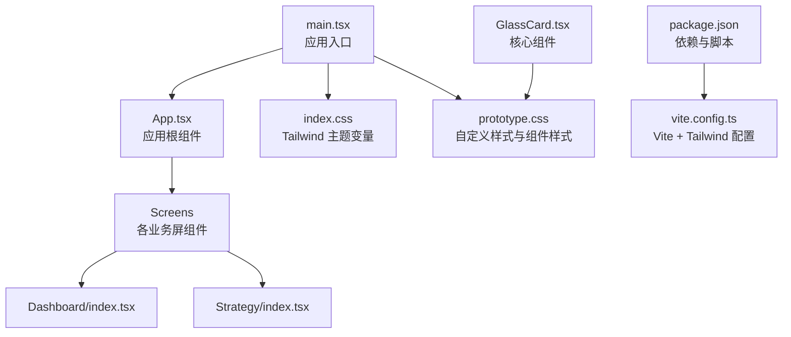
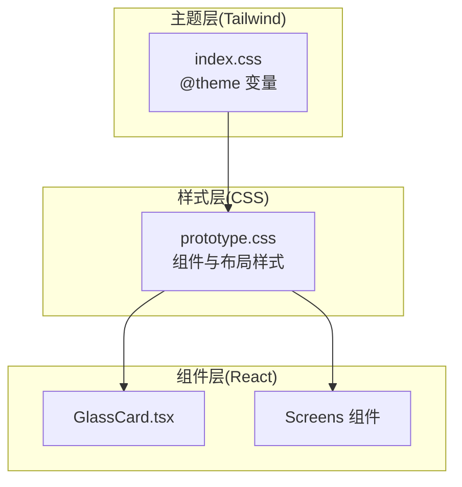
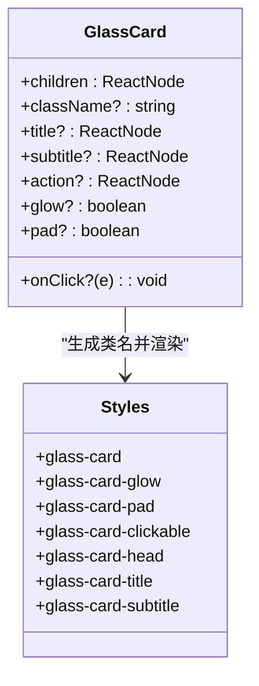
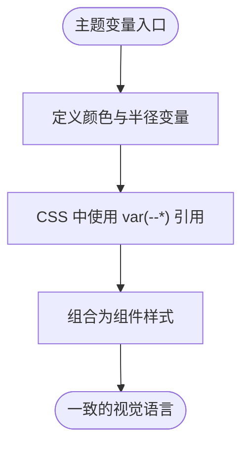
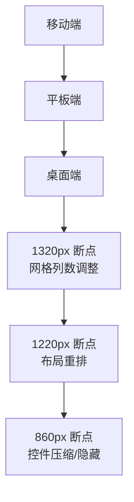
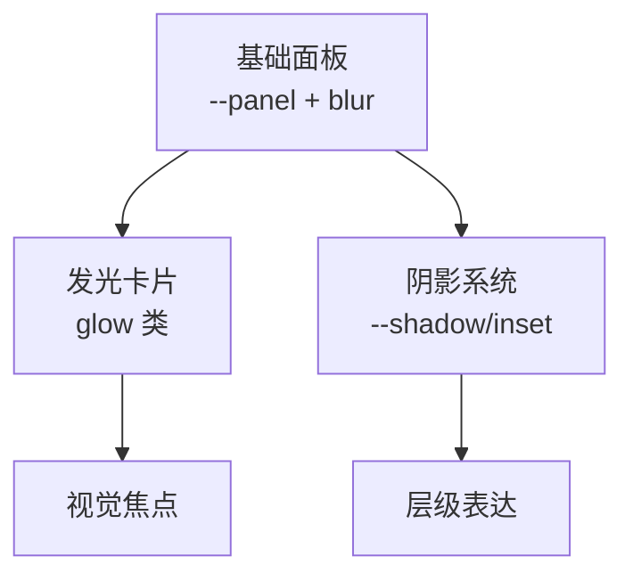
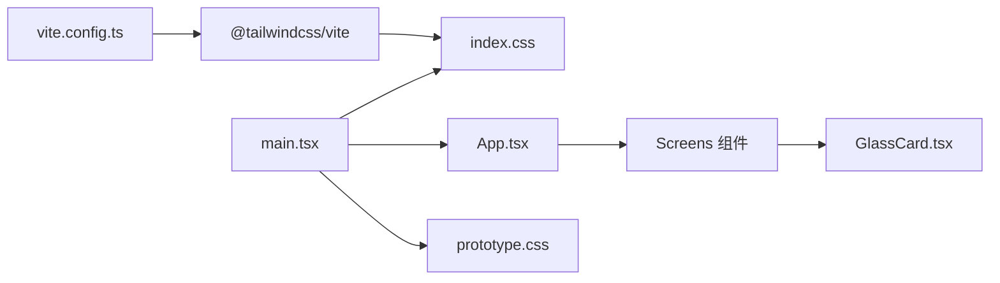

# UI 设计系统

<cite>
**本文引用的文件**
- [GlassCard.tsx](file://frontend/src/components/GlassCard.tsx)
- [prototype.css](file://frontend/src/styles/prototype.css)
- [index.css](file://frontend/src/index.css)
- [package.json](file://frontend/package.json)
- [vite.config.ts](file://frontend/vite.config.ts)
- [App.tsx](file://frontend/src/App.tsx)
- [main.tsx](file://frontend/src/main.tsx)
- [Dashboard/index.tsx](file://frontend/src/screens/Dashboard/index.tsx)
- [Strategy/index.tsx](file://frontend/src/screens/Strategy/index.tsx)
- [types.ts](file://frontend/src/data/types.ts)
</cite>

## 目录
1. [简介](#简介)
2. [项目结构](#项目结构)
3. [核心组件](#核心组件)
4. [架构总览](#架构总览)
5. [详细组件分析](#详细组件分析)
6. [依赖关系分析](#依赖关系分析)
7. [性能考量](#性能考量)
8. [故障排查指南](#故障排查指南)
9. [结论](#结论)
10. [附录](#附录)

## 简介
本文件系统化梳理 llmine-quant 前端 UI 设计系统，围绕基于 Tailwind CSS 的样式架构进行深入说明，覆盖主题系统、颜色体系、字体规范、间距系统、响应式布局策略，并重点解析 GlassCard 等核心组件的视觉与交互设计（毛玻璃、阴影、动画过渡）。同时提供样式类使用示例、自定义主题配置、组件样式扩展的最佳实践，以及无障碍访问、浏览器兼容性与性能优化的技术要点，并涵盖图标系统、动画库与第三方组件集成等设计资源。

## 项目结构
前端采用 React + Vite + Tailwind CSS 4.x 构建，样式通过 Tailwind 主题变量与自定义 CSS 共同驱动，组件以功能域分层组织，主入口统一注入全局样式与主题。

**图表来源**
- [main.tsx:1-12](file://frontend/src/main.tsx#L1-L12)
- [App.tsx:1-299](file://frontend/src/App.tsx#L1-L299)
- [index.css:1-24](file://frontend/src/index.css#L1-L24)
- [prototype.css:1-800](file://frontend/src/styles/prototype.css#L1-L800)
- [GlassCard.tsx:1-49](file://frontend/src/components/GlassCard.tsx#L1-L49)
- [package.json:1-43](file://frontend/package.json#L1-L43)
- [vite.config.ts:1-29](file://frontend/vite.config.ts#L1-L29)

**章节来源**
- [main.tsx:1-12](file://frontend/src/main.tsx#L1-L12)
- [App.tsx:180-299](file://frontend/src/App.tsx#L180-L299)
- [index.css:1-24](file://frontend/src/index.css#L1-L24)
- [prototype.css:1-800](file://frontend/src/styles/prototype.css#L1-L800)
- [package.json:12-24](file://frontend/package.json#L12-L24)
- [vite.config.ts:1-29](file://frontend/vite.config.ts#L1-L29)

## 核心组件
- GlassCard：通用毛玻璃卡片容器，支持标题/副标题/操作区、可点击态、发光与内边距开关，用于承载各类信息面板与卡片型内容。
- 屏幕级容器：如 Dashboard、Strategy 等，负责数据拉取、上下文提供与布局编排。
- 应用根组件：App 负责路由切换、侧边栏状态、模态框、WebSocket 连接与全局状态管理。

**章节来源**
- [GlassCard.tsx:1-49](file://frontend/src/components/GlassCard.tsx#L1-L49)
- [Dashboard/index.tsx:17-47](file://frontend/src/screens/Dashboard/index.tsx#L17-L47)
- [Strategy/index.tsx:32-168](file://frontend/src/screens/Strategy/index.tsx#L32-L168)
- [App.tsx:42-173](file://frontend/src/App.tsx#L42-L173)

## 架构总览
UI 样式由两层构成：
- Tailwind 主题层：通过 @theme 定义颜色、字体、圆角等变量，确保全局一致性与可定制性。
- 自定义样式层：在 prototype.css 中定义组件样式、布局网格、响应式断点与视觉装饰（渐变、阴影、模糊）。

**图表来源**
- [index.css:3-23](file://frontend/src/index.css#L3-L23)
- [prototype.css:1-800](file://frontend/src/styles/prototype.css#L1-L800)
- [GlassCard.tsx:14-48](file://frontend/src/components/GlassCard.tsx#L14-L48)

## 详细组件分析

### GlassCard 组件
GlassCard 是一个高复用的卡片容器，具备以下特性：
- 结构化头部区域：支持 title、subtitle、action 区域，便于统一卡片头部展示。
- 可选交互态：支持 onClick，提供 hover 动画与位移反馈。
- 视觉增强：glow 开启时叠加发光背景；pad 控制是否启用默认内边距。
- 类名拼接：动态合并 className，保证与 Tailwind 或自定义样式协同。

**图表来源**
- [GlassCard.tsx:3-32](file://frontend/src/components/GlassCard.tsx#L3-L32)
- [prototype.css:1608-1641](file://frontend/src/styles/prototype.css#L1608-L1641)

**章节来源**
- [GlassCard.tsx:14-48](file://frontend/src/components/GlassCard.tsx#L14-L48)
- [prototype.css:1608-1641](file://frontend/src/styles/prototype.css#L1608-L1641)

### 主题系统与颜色体系
- 主题变量：通过 @theme 在 index.css 中集中声明背景、面板、线条、文本、强调色与字体族等变量，供 CSS 使用 var(--*) 引用。
- 颜色体系：包含基础色板（蓝、青、绿、黄、橙、红、紫、粉）与语义化状态色（成功、警告、危险），用于按钮、标签、趋势指示等。
- 圆角体系：自定义 --radius-xl、--radius-lg、--radius-md、--radius-sm，统一卡片、按钮、输入框等组件的圆角风格。

**图表来源**
- [index.css:3-23](file://frontend/src/index.css#L3-L23)
- [prototype.css:2-27](file://frontend/src/styles/prototype.css#L2-L27)

**章节来源**
- [index.css:3-23](file://frontend/src/index.css#L3-L23)
- [prototype.css:2-27](file://frontend/src/styles/prototype.css#L2-L27)

### 字体规范与排版
- 字体族：通过 --font-sans 指定 Inter 与系统无衬线字体栈，兼顾国际化与本地化体验。
- 标题与正文：标题采用 clamp 缩放与负字距微调，正文行高与字号遵循可读性优先原则。
- 文本强调：使用 --text、--muted、--subtle 等语义化颜色，确保对比度与层次感。

**章节来源**
- [index.css:22](file://frontend/src/index.css#L22)
- [prototype.css:426-446](file://frontend/src/styles/prototype.css#L426-L446)

### 间距系统与网格布局
- 间距基值：大量使用 rem 与相对单位，配合 CSS Grid 与 Gap 实现灵活的栅格布局。
- 网格系统：提供 grid-2/3/4/Main 等网格类，用于快速搭建信息密度不同的面板布局。
- 卡片内间距：通过 .card.pad/.glass-card-pad 等类控制内边距，避免重复声明。

**章节来源**
- [prototype.css:504-507](file://frontend/src/styles/prototype.css#L504-L507)
- [prototype.css:1616](file://frontend/src/styles/prototype.css#L1616)

### 响应式布局策略
- 断点与适配：在多个关键宽度断点（如 1320px、1220px、1100px、860px）下调整网格列数、卡片排列与元素显隐。
- 移动端体验：提供移动端底部导航与折叠侧边栏，减少纵向滚动与信息过载。
- 示例断点：
  - 1320px：仪表盘指标网格从 4 列变为 3 列。
  - 1220px：仪表盘左右分区改为单列堆叠，快捷操作区改为双列。
  - 860px：进一步压缩网格与控件尺寸，隐藏次要文字。

**图表来源**
- [prototype.css:794-798](file://frontend/src/styles/prototype.css#L794-L798)
- [prototype.css:1642-1651](file://frontend/src/styles/prototype.css#L1642-L1651)
- [prototype.css:2558-2568](file://frontend/src/styles/prototype.css#L2558-L2568)

**章节来源**
- [prototype.css:794-798](file://frontend/src/styles/prototype.css#L794-L798)
- [prototype.css:1642-1651](file://frontend/src/styles/prototype.css#L1642-L1651)
- [prototype.css:2558-2568](file://frontend/src/styles/prototype.css#L2558-L2568)

### 毛玻璃效果与阴影系统
- 毛玻璃：通过 --panel、backdrop-filter: blur 与透明度混合，营造通透的背景质感。
- 阴影：统一使用 var(--shadow) 或内阴影 inset，结合面板背景形成深度层次。
- 发光卡片：在 GlassCard 上启用 glow 时叠加渐变背景，突出重要卡片。

**图表来源**
- [prototype.css:509-516](file://frontend/src/styles/prototype.css#L509-L516)
- [prototype.css:1617-1621](file://frontend/src/styles/prototype.css#L1617-L1621)
- [index.css:6-11](file://frontend/src/index.css#L6-L11)

**章节来源**
- [prototype.css:509-516](file://frontend/src/styles/prototype.css#L509-L516)
- [prototype.css:1617-1621](file://frontend/src/styles/prototype.css#L1617-L1621)
- [index.css:6-11](file://frontend/src/index.css#L6-L11)

### 动画与过渡
- 页面切换：屏幕容器使用淡入动画，提升页面切换的顺滑感。
- 按钮与卡片：hover 提升与饱和度变化，提供即时反馈。
- 侧边栏：宽度与内边距平滑过渡，改善交互体验。

**章节来源**
- [prototype.css:381-383](file://frontend/src/styles/prototype.css#L381-L383)
- [prototype.css:369-371](file://frontend/src/styles/prototype.css#L369-L371)
- [prototype.css:78](file://frontend/src/styles/prototype.css#L78)

### 图标系统与第三方资源
- 图标库：使用 lucide-react，按需引入图标组件，保持轻量与一致性。
- 图表库：集成 echarts，用于复杂可视化场景（如净值曲线、热力图）。
- 状态指示：使用 dot、status-chip、tag 等语义化类，配合颜色体系表达状态。

**章节来源**
- [package.json:18](file://frontend/package.json#L18)
- [package.json:17](file://frontend/package.json#L17)

### 组件样式扩展最佳实践
- 命名约定：以组件名前缀（如 glass-card-*、sf2-*）隔离作用域，避免冲突。
- 组合优先：优先使用 Tailwind 工具类组合，必要时在 prototype.css 中补充组件专属样式。
- 可访问性：为交互元素提供明确的 hover/focus 状态与键盘可达性。
- 性能：避免过度使用 backdrop-filter 与大范围阴影，移动端谨慎启用高成本滤镜。

**章节来源**
- [GlassCard.tsx:24-32](file://frontend/src/components/GlassCard.tsx#L24-L32)
- [prototype.css:1608-1641](file://frontend/src/styles/prototype.css#L1608-L1641)

## 依赖关系分析
- 构建链路：Vite 通过 @tailwindcss/vite 插件加载 Tailwind，再由 React 应用挂载。
- 样式链路：main.tsx 注入 index.css 与 prototype.css，后者定义组件样式与主题变量。
- 组件链路：App 管理屏幕切换与全局状态，各 Screen 组件负责具体业务布局与数据绑定。

**图表来源**
- [vite.config.ts:1-29](file://frontend/vite.config.ts#L1-L29)
- [main.tsx:1-12](file://frontend/src/main.tsx#L1-L12)
- [index.css:1](file://frontend/src/index.css#L1)
- [prototype.css:1](file://frontend/src/styles/prototype.css#L1)
- [GlassCard.tsx:14-48](file://frontend/src/components/GlassCard.tsx#L14-L48)

**章节来源**
- [vite.config.ts:1-29](file://frontend/vite.config.ts#L1-L29)
- [main.tsx:1-12](file://frontend/src/main.tsx#L1-L12)
- [index.css:1](file://frontend/src/index.css#L1)
- [prototype.css:1](file://frontend/src/styles/prototype.css#L1)
- [GlassCard.tsx:14-48](file://frontend/src/components/GlassCard.tsx#L14-L48)

## 性能考量
- 渲染优化：合理拆分组件，避免不必要的重渲染；对高频交互使用 useCallback/useMemo。
- 样式体积：仅引入所需 Tailwind 工具类，避免全量导入；将组件专属样式收敛到局部 CSS 文件。
- 滤镜与阴影：在低端设备上限制 backdrop-filter 与大范围阴影的使用频率。
- 图表性能：对大数据集采用虚拟化或采样策略，降低渲染压力。

## 故障排查指南
- 样式不生效
  - 检查 main.tsx 是否正确引入 index.css 与 prototype.css。
  - 确认 @theme 变量未被覆盖或拼写错误。
- 组件样式冲突
  - 使用组件前缀类（如 glass-card-*）隔离作用域。
  - 避免在组件内部硬编码样式，统一迁移到 prototype.css。
- 响应式异常
  - 核对断点与媒体查询顺序，确保覆盖范围正确。
  - 在关键断点处添加调试注释或临时边框辅助定位。
- 交互无反馈
  - 检查 hover/focus 状态类是否正确拼接。
  - 确保事件处理器未被阻止冒泡或默认行为。

**章节来源**
- [main.tsx:3-5](file://frontend/src/main.tsx#L3-L5)
- [GlassCard.tsx:24-32](file://frontend/src/components/GlassCard.tsx#L24-L32)
- [prototype.css:794-798](file://frontend/src/styles/prototype.css#L794-L798)

## 结论
llmine-quant 的 UI 设计系统以 Tailwind CSS 为主题核心，结合自定义 CSS 实现统一的视觉语言与灵活的组件样式。通过清晰的主题变量、颜色体系、字体与间距系统，以及完善的响应式策略，系统在桌面、平板与移动端均提供了良好的可用性与可维护性。GlassCard 等核心组件在毛玻璃、阴影与过渡方面形成了统一的视觉风格，配合图标与图表库，满足金融量化场景的复杂信息呈现需求。

## 附录

### 样式类使用示例（路径指引）
- 毛玻璃卡片：[GlassCard.tsx:34-47](file://frontend/src/components/GlassCard.tsx#L34-L47)
- 卡片头部与标题：[GlassCard.tsx:36-44](file://frontend/src/components/GlassCard.tsx#L36-L44)
- 发光卡片类：[prototype.css:1617-1621](file://frontend/src/styles/prototype.css#L1617-L1621)
- 侧边栏折叠过渡：[prototype.css:78](file://frontend/src/styles/prototype.css#L78)
- 响应式网格：[prototype.css:504-507](file://frontend/src/styles/prototype.css#L504-L507)

### 自定义主题配置（路径指引）
- 主题变量定义：[index.css:3-23](file://frontend/src/index.css#L3-L23)
- 圆角与颜色变量：[prototype.css:2-27](file://frontend/src/styles/prototype.css#L2-L27)

### 组件样式扩展（路径指引）
- 组件样式命名与组合：[GlassCard.tsx:24-32](file://frontend/src/components/GlassCard.tsx#L24-L32)
- 屏幕级容器与布局：[Dashboard/index.tsx:28-46](file://frontend/src/screens/Dashboard/index.tsx#L28-L46), [Strategy/index.tsx:80-126](file://frontend/src/screens/Strategy/index.tsx#L80-L126)

### 数据类型与上下文（路径指引）
- Mock 数据类型：[types.ts:1-647](file://frontend/src/data/types.ts#L1-L647)
- 上下文与 Provider：[Dashboard/index.tsx:28-46](file://frontend/src/screens/Dashboard/index.tsx#L28-L46), [Strategy/index.tsx:80-82](file://frontend/src/screens/Strategy/index.tsx#L80-L82)