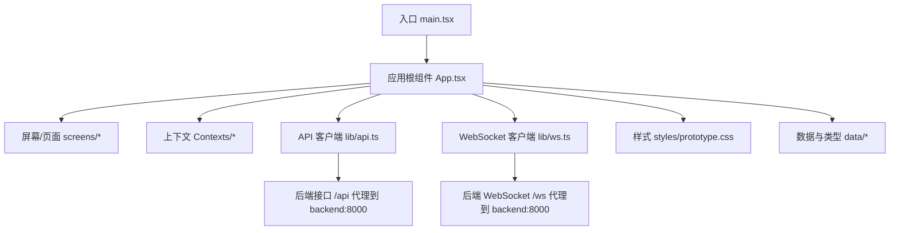
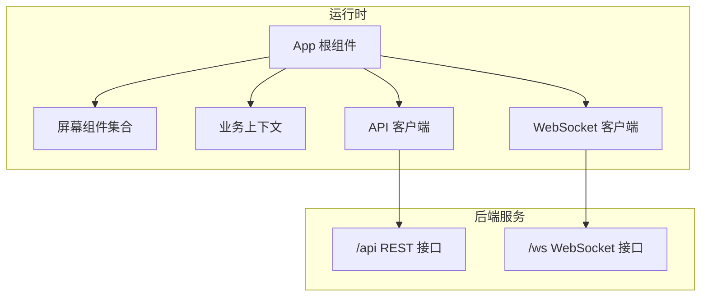
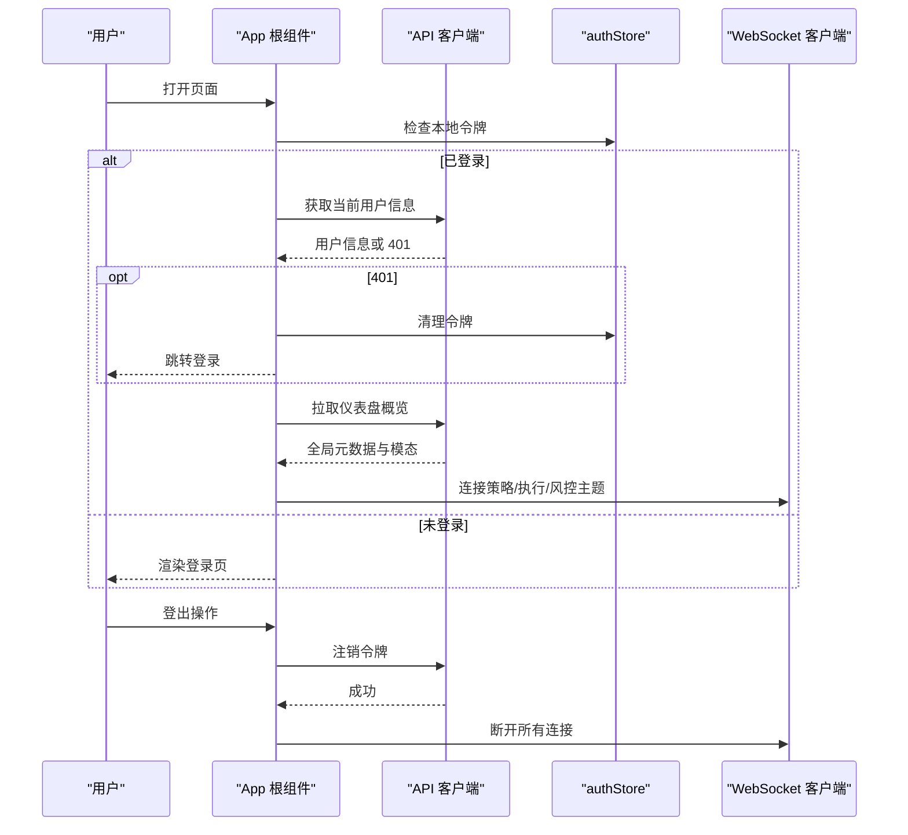
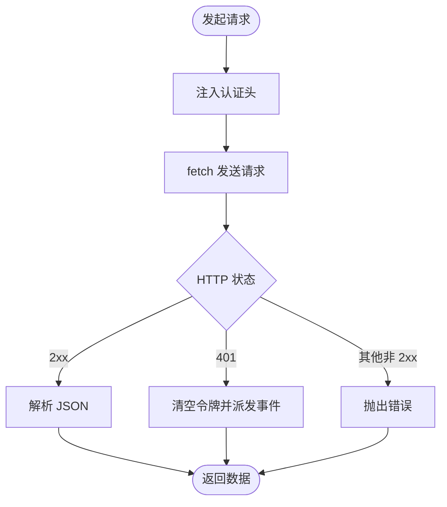
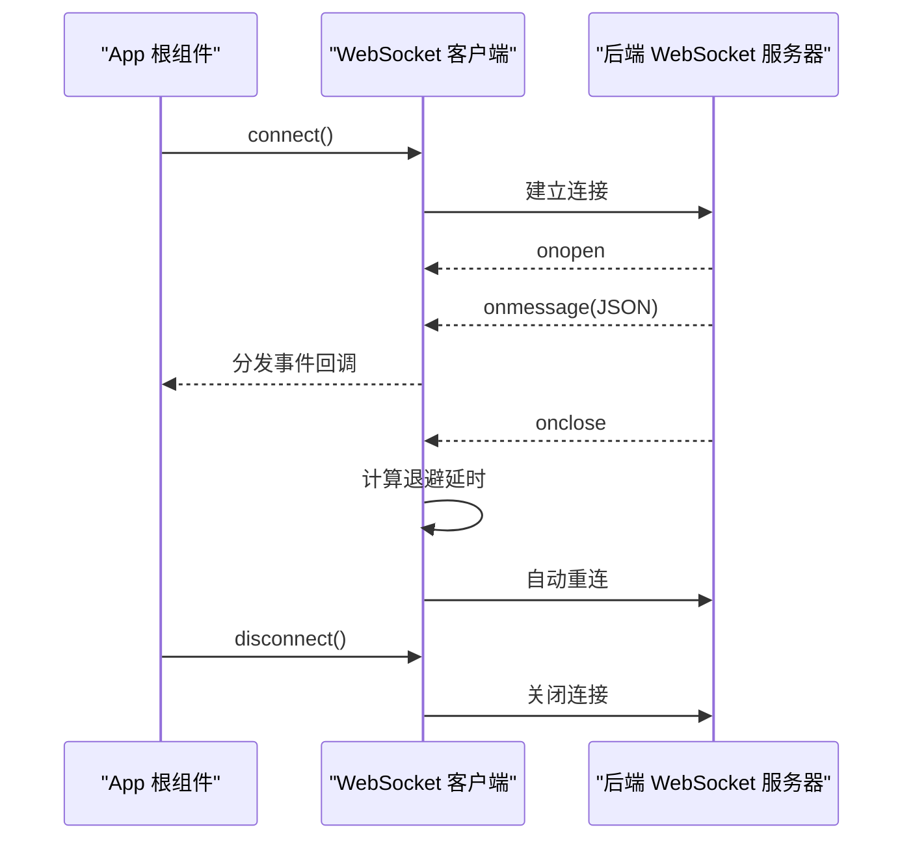
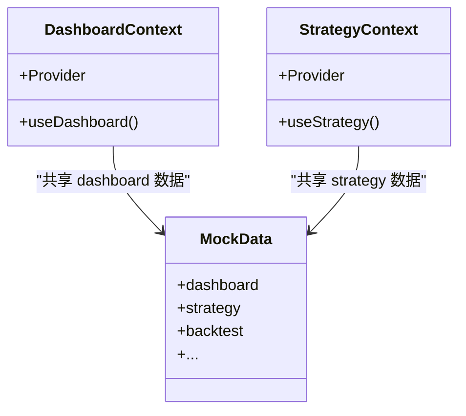
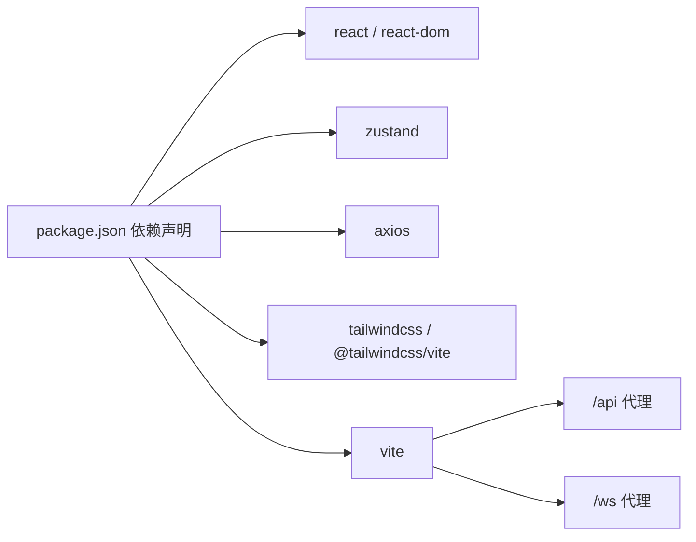

# 前端架构

<cite>
**本文引用的文件**
- [frontend/src/main.tsx](file://frontend/src/main.tsx)
- [frontend/src/App.tsx](file://frontend/src/App.tsx)
- [frontend/src/lib/api.ts](file://frontend/src/lib/api.ts)
- [frontend/src/lib/ws.ts](file://frontend/src/lib/ws.ts)
- [frontend/src/contexts/DashboardContext.tsx](file://frontend/src/contexts/DashboardContext.tsx)
- [frontend/src/contexts/StrategyContext.tsx](file://frontend/src/contexts/StrategyContext.tsx)
- [frontend/src/data/types.ts](file://frontend/src/data/types.ts)
- [frontend/src/data/index.ts](file://frontend/src/data/index.ts)
- [frontend/src/styles/prototype.css](file://frontend/src/styles/prototype.css)
- [frontend/package.json](file://frontend/package.json)
- [frontend/vite.config.ts](file://frontend/vite.config.ts)
</cite>

## 目录
1. [简介](#简介)
2. [项目结构](#项目结构)
3. [核心组件](#核心组件)
4. [架构总览](#架构总览)
5. [详细组件分析](#详细组件分析)
6. [依赖关系分析](#依赖关系分析)
7. [性能考量](#性能考量)
8. [故障排查指南](#故障排查指南)
9. [结论](#结论)
10. [附录](#附录)

## 简介
本文件面向 llmine-quant 前端团队与扩展开发者，系统性阐述基于 React 19 的前端架构设计与实现要点。重点覆盖应用入口点、组件层次结构、状态管理模式、API 集成层、Zustand 状态管理理念与使用模式、Context Provider 架构、状态持久化与异步状态处理、组件化设计、主题系统、响应式布局以及 WebSocket 连接管理等。文档同时提供流程与时序图示，帮助读者快速理解与高效扩展。

## 项目结构
前端采用 Vite + React 19 + TypeScript + TailwindCSS 构建，目录组织遵循“屏幕/页面 + 组件 + 上下文 + 数据/类型 + 样式”的分层方式，便于按功能域拆分与复用。

图表来源
- [frontend/src/main.tsx:1-12](file://frontend/src/main.tsx#L1-L12)
- [frontend/src/App.tsx:1-299](file://frontend/src/App.tsx#L1-L299)
- [frontend/src/lib/api.ts:1-778](file://frontend/src/lib/api.ts#L1-L778)
- [frontend/src/lib/ws.ts:1-95](file://frontend/src/lib/ws.ts#L1-L95)
- [frontend/vite.config.ts:1-29](file://frontend/vite.config.ts#L1-L29)

章节来源
- [frontend/src/main.tsx:1-12](file://frontend/src/main.tsx#L1-L12)
- [frontend/src/App.tsx:1-299](file://frontend/src/App.tsx#L1-L299)
- [frontend/vite.config.ts:1-29](file://frontend/vite.config.ts#L1-L29)

## 核心组件
- 应用入口与挂载
  - 入口文件负责创建根节点并渲染应用根组件。
  - 参考路径：[frontend/src/main.tsx:1-12](file://frontend/src/main.tsx#L1-L12)

- 应用根组件 App
  - 负责全局状态（屏幕切换、侧边栏折叠、模态弹窗、用户会话）、系统健康信息拉取、WebSocket 连接生命周期管理、路由与导航事件处理。
  - 参考路径：[frontend/src/App.tsx:1-299](file://frontend/src/App.tsx#L1-L299)

- API 客户端
  - 提供统一的认证令牌存储、鉴权头注入、错误处理（401 清理令牌并触发全局 Unauthorized 事件）、各类业务模块的 REST 接口封装。
  - 参考路径：[frontend/src/lib/api.ts:1-778](file://frontend/src/lib/api.ts#L1-L778)

- WebSocket 客户端
  - 提供通用的 WebSocket 客户端工厂，支持自动重连、延迟指数退避、消息分发与订阅、连接状态查询。
  - 参考路径：[frontend/src/lib/ws.ts:1-95](file://frontend/src/lib/ws.ts#L1-L95)

- 上下文与数据类型
  - 为各业务域提供 Context Provider 与类型定义，支撑组件化数据共享与类型安全。
  - 参考路径：[frontend/src/contexts/DashboardContext.tsx:1-13](file://frontend/src/contexts/DashboardContext.tsx#L1-L13)、[frontend/src/contexts/StrategyContext.tsx:1-13](file://frontend/src/contexts/StrategyContext.tsx#L1-L13)、[frontend/src/data/types.ts:1-647](file://frontend/src/data/types.ts#L1-L647)、[frontend/src/data/index.ts:1-10](file://frontend/src/data/index.ts#L1-L10)

- 样式与主题
  - 使用 CSS 变量定义主题色板与尺寸，配合 TailwindCSS 实现暗色主题与响应式布局。
  - 参考路径：[frontend/src/styles/prototype.css:1-800](file://frontend/src/styles/prototype.css#L1-L800)

章节来源
- [frontend/src/main.tsx:1-12](file://frontend/src/main.tsx#L1-L12)
- [frontend/src/App.tsx:1-299](file://frontend/src/App.tsx#L1-L299)
- [frontend/src/lib/api.ts:1-778](file://frontend/src/lib/api.ts#L1-L778)
- [frontend/src/lib/ws.ts:1-95](file://frontend/src/lib/ws.ts#L1-L95)
- [frontend/src/contexts/DashboardContext.tsx:1-13](file://frontend/src/contexts/DashboardContext.tsx#L1-L13)
- [frontend/src/contexts/StrategyContext.tsx:1-13](file://frontend/src/contexts/StrategyContext.tsx#L1-L13)
- [frontend/src/data/types.ts:1-647](file://frontend/src/data/types.ts#L1-L647)
- [frontend/src/data/index.ts:1-10](file://frontend/src/data/index.ts#L1-L10)
- [frontend/src/styles/prototype.css:1-800](file://frontend/src/styles/prototype.css#L1-L800)

## 架构总览
前端整体采用“根组件集中控制 + 屏幕级懒加载 + 业务上下文解耦 + API/WebSocket 抽象层”的分层架构。根组件负责用户会话、导航、全局模态与 WebSocket 生命周期；屏幕组件通过上下文与 API 客户端消费数据；样式系统提供一致的主题与响应式能力。

图表来源
- [frontend/src/App.tsx:1-299](file://frontend/src/App.tsx#L1-L299)
- [frontend/src/lib/api.ts:1-778](file://frontend/src/lib/api.ts#L1-L778)
- [frontend/src/lib/ws.ts:1-95](file://frontend/src/lib/ws.ts#L1-L95)
- [frontend/vite.config.ts:16-26](file://frontend/vite.config.ts#L16-L26)

## 详细组件分析

### 应用根组件 App.tsx
- 功能职责
  - 用户会话恢复与 401 处理：从本地存储恢复令牌，调用用户信息接口，监听 Unauthorized 事件清理状态。
  - 全局数据拉取：登录成功后拉取仪表盘概览，填充系统健康度、模态配置等。
  - WebSocket 生命周期：登录后建立多主题连接，登出或卸载时断开。
  - 导航与屏幕切换：支持复合目标解析（如 backtest:...），平滑滚动至顶部。
  - 模态管理：根据全局配置渲染不同类型的弹窗。
  - 侧边栏与移动端 Tab：支持折叠、品牌信息、导航按钮、系统健康卡片。
- 关键交互时序（登录与 WebSocket 启停）

图表来源
- [frontend/src/App.tsx:55-96](file://frontend/src/App.tsx#L55-L96)
- [frontend/src/lib/api.ts:10-30](file://frontend/src/lib/api.ts#L10-L30)
- [frontend/src/lib/ws.ts:92-95](file://frontend/src/lib/ws.ts#L92-L95)

章节来源
- [frontend/src/App.tsx:1-299](file://frontend/src/App.tsx#L1-L299)
- [frontend/src/lib/api.ts:10-30](file://frontend/src/lib/api.ts#L10-L30)
- [frontend/src/lib/ws.ts:92-95](file://frontend/src/lib/ws.ts#L92-L95)

### API 客户端与认证存储
- 认证存储
  - 在内存维护令牌，持久化到 localStorage，并提供 set/get/clear/isAuthenticated 方法。
  - 参考路径：[frontend/src/lib/api.ts:10-21](file://frontend/src/lib/api.ts#L10-L21)
- 请求工具
  - getJson/postJson/putJson/deleteJson 统一封装，自动注入 Authorization 头。
  - 401 统一处理：清空令牌并派发自定义事件，供根组件监听。
  - 参考路径：[frontend/src/lib/api.ts:32-83](file://frontend/src/lib/api.ts#L32-L83)
- 业务模块接口
  - 覆盖 auth/dashboard/strategy/backtest/explain/portfolio/execution/risk/data/security/collaboration/audit/paper 等模块的 REST 接口。
  - 参考路径：[frontend/src/lib/api.ts:513-778](file://frontend/src/lib/api.ts#L513-L778)

图表来源
- [frontend/src/lib/api.ts:32-83](file://frontend/src/lib/api.ts#L32-L83)

章节来源
- [frontend/src/lib/api.ts:10-21](file://frontend/src/lib/api.ts#L10-L21)
- [frontend/src/lib/api.ts:32-83](file://frontend/src/lib/api.ts#L32-L83)
- [frontend/src/lib/api.ts:513-778](file://frontend/src/lib/api.ts#L513-L778)

### WebSocket 客户端与自动重连
- 设计要点
  - 单例客户端工厂，支持订阅消息类型（含通配符）、自动重连、指数退避、onmessage 解析与分发。
  - 提供 strategy-events/execution-events/risk-events 三类主题客户端。
  - 参考路径：[frontend/src/lib/ws.ts:27-95](file://frontend/src/lib/ws.ts#L27-L95)
- 连接生命周期
  - 登录后由根组件启动，登出或卸载时断开，避免内存泄漏。
  - 参考路径：[frontend/src/App.tsx:85-96](file://frontend/src/App.tsx#L85-L96)

图表来源
- [frontend/src/lib/ws.ts:40-88](file://frontend/src/lib/ws.ts#L40-L88)
- [frontend/src/App.tsx:85-96](file://frontend/src/App.tsx#L85-L96)

章节来源
- [frontend/src/lib/ws.ts:27-95](file://frontend/src/lib/ws.ts#L27-L95)
- [frontend/src/App.tsx:85-96](file://frontend/src/App.tsx#L85-L96)

### 上下文与数据类型
- 上下文
  - 为各业务域提供 Context Provider 与 Hook，确保组件树内共享数据与行为。
  - 示例：DashboardContext、StrategyContext。
  - 参考路径：[frontend/src/contexts/DashboardContext.tsx:1-13](file://frontend/src/contexts/DashboardContext.tsx#L1-L13)、[frontend/src/contexts/StrategyContext.tsx:1-13](file://frontend/src/contexts/StrategyContext.tsx#L1-L13)
- 类型定义
  - MockData 定义了各模块的数据结构，用于前端 Mock 与类型约束。
  - 参考路径：[frontend/src/data/types.ts:1-647](file://frontend/src/data/types.ts#L1-L647)
- Mock 数据选择
  - 根据环境变量选择 A-share 或 Crypto 数据集。
  - 参考路径：[frontend/src/data/index.ts:1-10](file://frontend/src/data/index.ts#L1-L10)

图表来源
- [frontend/src/contexts/DashboardContext.tsx:1-13](file://frontend/src/contexts/DashboardContext.tsx#L1-L13)
- [frontend/src/contexts/StrategyContext.tsx:1-13](file://frontend/src/contexts/StrategyContext.tsx#L1-L13)
- [frontend/src/data/types.ts:1-647](file://frontend/src/data/types.ts#L1-L647)

章节来源
- [frontend/src/contexts/DashboardContext.tsx:1-13](file://frontend/src/contexts/DashboardContext.tsx#L1-L13)
- [frontend/src/contexts/StrategyContext.tsx:1-13](file://frontend/src/contexts/StrategyContext.tsx#L1-L13)
- [frontend/src/data/types.ts:1-647](file://frontend/src/data/types.ts#L1-L647)
- [frontend/src/data/index.ts:1-10](file://frontend/src/data/index.ts#L1-L10)

### 主题系统与响应式布局
- 主题变量
  - 使用 CSS 变量定义背景、面板、文字、强调色与圆角等，形成统一视觉语言。
  - 参考路径：[frontend/src/styles/prototype.css:2-27](file://frontend/src/styles/prototype.css#L2-L27)
- 响应式网格与布局
  - 侧边栏折叠、移动端标签页、卡片网格、图表容器等，均通过 CSS Grid/Flex 实现。
  - 参考路径：[frontend/src/styles/prototype.css:58-146](file://frontend/src/styles/prototype.css#L58-L146)、[frontend/src/styles/prototype.css:794-800](file://frontend/src/styles/prototype.css#L794-L800)
- 暗色背景与装饰
  - 背景渐变、径向光晕与网格纹理增强科技感。
  - 参考路径：[frontend/src/styles/prototype.css:31-56](file://frontend/src/styles/prototype.css#L31-L56)

章节来源
- [frontend/src/styles/prototype.css:2-27](file://frontend/src/styles/prototype.css#L2-L27)
- [frontend/src/styles/prototype.css:58-146](file://frontend/src/styles/prototype.css#L58-L146)
- [frontend/src/styles/prototype.css:31-56](file://frontend/src/styles/prototype.css#L31-L56)

## 依赖关系分析
- 依赖与工具链
  - React 19、React DOM、Zustand、Axios、TailwindCSS、Vite、TypeScript。
  - 参考路径：[frontend/package.json:12-42](file://frontend/package.json#L12-L42)
- 开发服务器与代理
  - /api 代理到 http://localhost:8000，/ws 代理到 ws://localhost:8000，支持热更新与主机暴露。
  - 参考路径：[frontend/vite.config.ts:16-26](file://frontend/vite.config.ts#L16-L26)

图表来源
- [frontend/package.json:12-42](file://frontend/package.json#L12-L42)
- [frontend/vite.config.ts:16-26](file://frontend/vite.config.ts#L16-L26)

章节来源
- [frontend/package.json:12-42](file://frontend/package.json#L12-L42)
- [frontend/vite.config.ts:16-26](file://frontend/vite.config.ts#L16-L26)

## 性能考量
- 网络层
  - 统一的 401 处理与令牌持久化，避免重复无效请求。
  - 参考路径：[frontend/src/lib/api.ts:27-30](file://frontend/src/lib/api.ts#L27-L30)
- WebSocket
  - 指数退避与最小重连间隔，降低风暴重连风险；仅在登录状态下保持连接。
  - 参考路径：[frontend/src/lib/ws.ts:57-63](file://frontend/src/lib/ws.ts#L57-L63)、[frontend/src/App.tsx:85-96](file://frontend/src/App.tsx#L85-L96)
- 样式与渲染
  - 使用 CSS 变量与 Tailwind 快速切换主题与布局，减少 JS 控制开销。
  - 参考路径：[frontend/src/styles/prototype.css:58-146](file://frontend/src/styles/prototype.css#L58-L146)
- 代码分割与懒加载
  - 屏幕组件按需渲染，结合浏览器缓存与代理热更新提升开发体验。
  - 参考路径：[frontend/src/App.tsx:137-173](file://frontend/src/App.tsx#L137-L173)

## 故障排查指南
- 登录失败或 401
  - 检查 authStore 是否写入/清除令牌，确认后端 /auth/* 接口可用。
  - 参考路径：[frontend/src/lib/api.ts:10-21](file://frontend/src/lib/api.ts#L10-L21)、[frontend/src/lib/api.ts:514-548](file://frontend/src/lib/api.ts#L514-L548)
- WebSocket 不断重连
  - 检查后端 ws 地址与协议（http/https），确认代理配置正确。
  - 参考路径：[frontend/src/lib/ws.ts:21-25](file://frontend/src/lib/ws.ts#L21-L25)、[frontend/vite.config.ts:21-25](file://frontend/vite.config.ts#L21-L25)
- 页面无数据
  - 确认已登录且仪表盘概览接口返回正常；检查 Mock 数据选择是否符合预期。
  - 参考路径：[frontend/src/App.tsx:76-83](file://frontend/src/App.tsx#L76-L83)、[frontend/src/data/index.ts:5-10](file://frontend/src/data/index.ts#L5-L10)

章节来源
- [frontend/src/lib/api.ts:10-21](file://frontend/src/lib/api.ts#L10-L21)
- [frontend/src/lib/api.ts:514-548](file://frontend/src/lib/api.ts#L514-L548)
- [frontend/src/lib/ws.ts:21-25](file://frontend/src/lib/ws.ts#L21-L25)
- [frontend/vite.config.ts:21-25](file://frontend/vite.config.ts#L21-L25)
- [frontend/src/App.tsx:76-83](file://frontend/src/App.tsx#L76-L83)
- [frontend/src/data/index.ts:5-10](file://frontend/src/data/index.ts#L5-L10)

## 结论
本前端架构以 React 19 为基础，通过清晰的分层与抽象，实现了稳定的会话管理、可靠的 API/WebSocket 集成、可扩展的上下文体系与一致的主题/布局。尽管当前上下文主要承载 Mock 数据，但其设计已为引入 Zustand 状态管理与真实后端数据打下良好基础。建议后续在保持现有上下文契约的前提下，逐步迁移状态到 Zustand 并完善异步状态与持久化策略。

## 附录
- 最佳实践清单
  - 使用统一的 authStore 管理令牌，避免在组件内直接操作 localStorage。
  - 对所有 API 请求进行 401 统一处理，确保会话一致性。
  - WebSocket 连接严格绑定登录状态，避免后台连接泄漏。
  - 通过 Context Provider 明确数据边界，避免跨域上下文污染。
  - 使用 CSS 变量与 Tailwind 快速迭代主题与布局，减少手写样式。
  - 在开发阶段利用 Vite 代理与热更新，提高迭代效率。