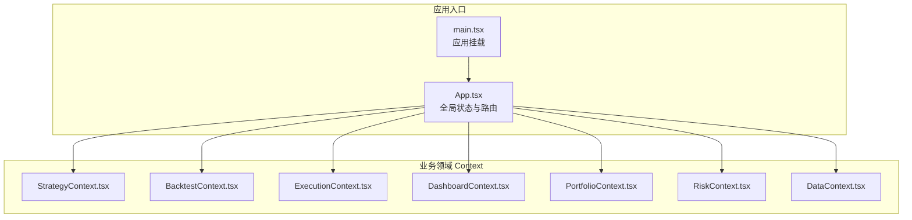
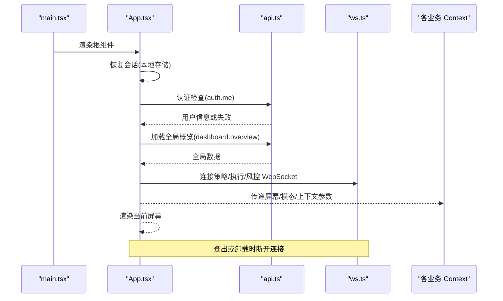
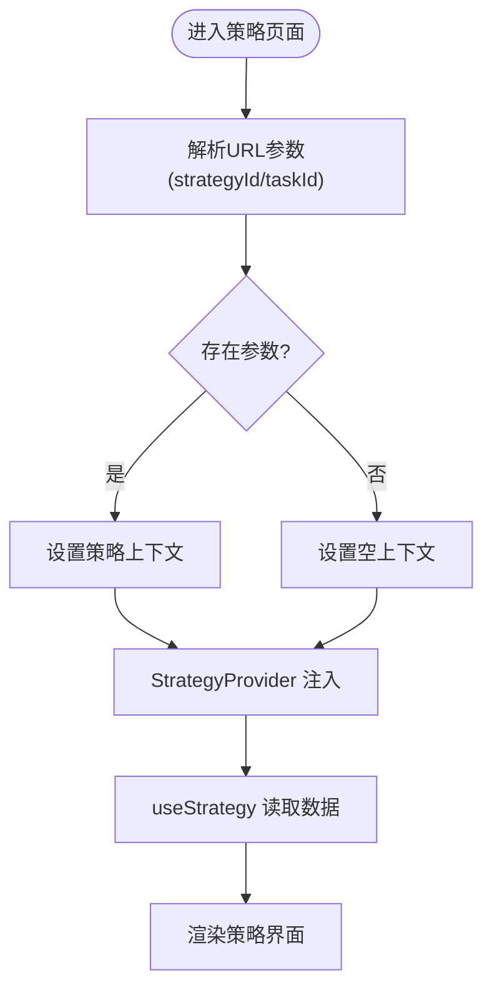
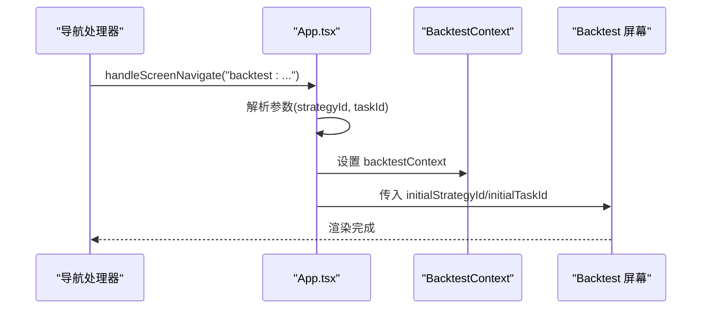
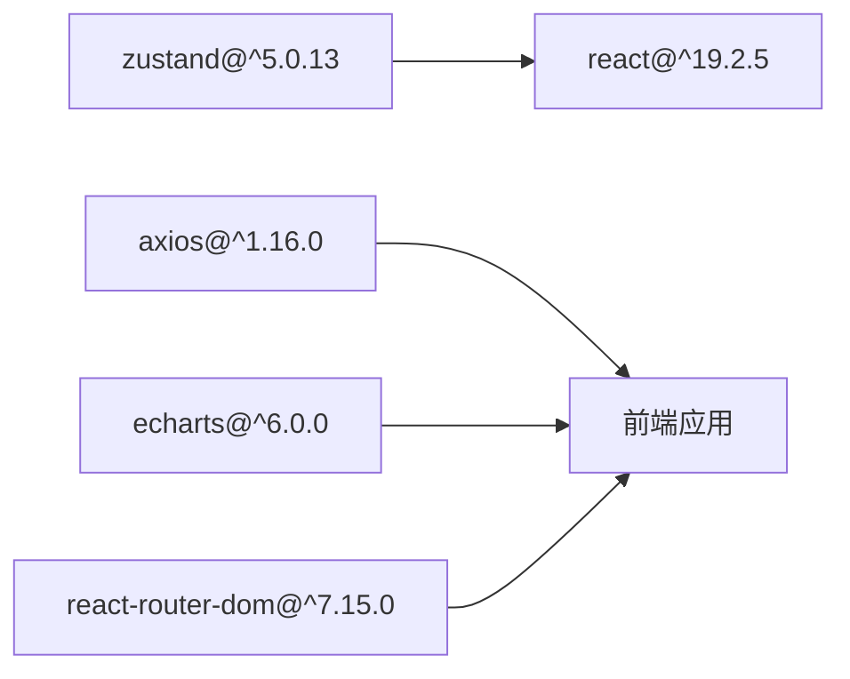

# 状态管理系统

<cite>
**本文引用的文件**
- [frontend/src/App.tsx](file://frontend/src/App.tsx)
- [frontend/src/main.tsx](file://frontend/src/main.tsx)
- [frontend/src/contexts/StrategyContext.tsx](file://frontend/src/contexts/StrategyContext.tsx)
- [frontend/src/contexts/BacktestContext.tsx](file://frontend/src/contexts/BacktestContext.tsx)
- [frontend/src/contexts/ExecutionContext.tsx](file://frontend/src/contexts/ExecutionContext.tsx)
- [frontend/src/contexts/DashboardContext.tsx](file://frontend/src/contexts/DashboardContext.tsx)
- [frontend/src/contexts/PortfolioContext.tsx](file://frontend/src/contexts/PortfolioContext.tsx)
- [frontend/src/contexts/RiskContext.tsx](file://frontend/src/contexts/RiskContext.tsx)
- [frontend/src/contexts/DataContext.tsx](file://frontend/src/contexts/DataContext.tsx)
- [frontend/package.json](file://frontend/package.json)
</cite>

## 目录
1. [简介](#简介)
2. [项目结构](#项目结构)
3. [核心组件](#核心组件)
4. [架构总览](#架构总览)
5. [详细组件分析](#详细组件分析)
6. [依赖分析](#依赖分析)
7. [性能考虑](#性能考虑)
8. [故障排查指南](#故障排查指南)
9. [结论](#结论)
10. [附录](#附录)

## 简介
本文件系统性梳理 llmine-quant 前端的状态管理方案，重点围绕 React Context Provider 设计模式与 Zustand 的集成实践，覆盖以下主题：
- 基于 React Context 的 Provider 设计模式与 Hook 使用规范
- 状态持久化策略（localStorage 会话恢复、WebSocket 实时数据接入）
- 异步状态处理机制（登录态校验、全局概览数据拉取、WebSocket 连接生命周期）
- 业务领域状态上下文：StrategyContext、BacktestContext、ExecutionContext 等的设计理念与使用模式
- 状态初始化、更新、订阅机制与跨组件共享最佳实践
- 状态重置、状态同步、性能优化等关键技术点

说明：当前仓库中未发现直接使用 Zustand 的 store 定义文件；Context Provider 是主要的状态共享方式。本文在“架构总览”和“详细组件分析”中将结合现有 Context 结构进行可视化说明，并在“依赖分析”中指出对 Zustand 的依赖来源。

## 项目结构
前端采用按功能域划分的目录组织，状态管理相关的核心位置如下：
- 应用入口与根组件：frontend/src/main.tsx、frontend/src/App.tsx
- 业务领域 Context：frontend/src/contexts/*.tsx
- 依赖声明：frontend/package.json（包含 zustand）

图表来源
- [frontend/src/main.tsx:1-12](file://frontend/src/main.tsx#L1-L12)
- [frontend/src/App.tsx:1-299](file://frontend/src/App.tsx#L1-L299)
- [frontend/src/contexts/StrategyContext.tsx:1-13](file://frontend/src/contexts/StrategyContext.tsx#L1-L13)
- [frontend/src/contexts/BacktestContext.tsx:1-13](file://frontend/src/contexts/BacktestContext.tsx#L1-L13)
- [frontend/src/contexts/ExecutionContext.tsx:1-13](file://frontend/src/contexts/ExecutionContext.tsx#L1-L13)
- [frontend/src/contexts/DashboardContext.tsx:1-13](file://frontend/src/contexts/DashboardContext.tsx#L1-L13)
- [frontend/src/contexts/PortfolioContext.tsx:1-13](file://frontend/src/contexts/PortfolioContext.tsx#L1-L13)
- [frontend/src/contexts/RiskContext.tsx:1-13](file://frontend/src/contexts/RiskContext.tsx#L1-L13)
- [frontend/src/contexts/DataContext.tsx:1-12](file://frontend/src/contexts/DataContext.tsx#L1-L12)

章节来源
- [frontend/src/main.tsx:1-12](file://frontend/src/main.tsx#L1-L12)
- [frontend/src/App.tsx:1-299](file://frontend/src/App.tsx#L1-L299)
- [frontend/src/contexts/StrategyContext.tsx:1-13](file://frontend/src/contexts/StrategyContext.tsx#L1-L13)
- [frontend/src/contexts/BacktestContext.tsx:1-13](file://frontend/src/contexts/BacktestContext.tsx#L1-L13)
- [frontend/src/contexts/ExecutionContext.tsx:1-13](file://frontend/src/contexts/ExecutionContext.tsx#L1-L13)
- [frontend/src/contexts/DashboardContext.tsx:1-13](file://frontend/src/contexts/DashboardContext.tsx#L1-L13)
- [frontend/src/contexts/PortfolioContext.tsx:1-13](file://frontend/src/contexts/PortfolioContext.tsx#L1-L13)
- [frontend/src/contexts/RiskContext.tsx:1-13](file://frontend/src/contexts/RiskContext.tsx#L1-L13)
- [frontend/src/contexts/DataContext.tsx:1-12](file://frontend/src/contexts/DataContext.tsx#L1-L12)

## 核心组件
本节聚焦于 Context Provider 设计模式与全局状态管理的关键实现要点：

- 全局状态与生命周期
  - 登录态校验与用户信息加载：通过事件监听与 API 调用完成认证检查与用户信息设置。
  - 全局概览数据：在用户信息可用时拉取并缓存到全局状态，供各屏幕使用。
  - WebSocket 连接：在用户登录后建立连接，在登出或组件卸载时断开，确保资源释放。
  - 侧边栏折叠、屏幕切换、模态框状态：均通过 useState 管理，保证 UI 交互一致性。

- Context Provider 设计模式
  - 每个业务领域 Context 提供一个 Provider 组件与对应的 Hook，用于在组件树中注入领域数据。
  - 所有 Context 默认值为 null，若在 Provider 外部调用 Hook 将抛出错误，强制正确使用 Provider 包裹。

- 状态持久化策略
  - 会话恢复：应用挂载时从本地存储恢复认证状态，避免重复登录。
  - 全局数据缓存：将系统健康度、风险标签、模态框配置等全局数据保存在顶层状态，减少重复请求。

- 异步状态处理机制
  - Promise 风格的 API 调用与错误处理：统一捕获异常并记录日志，保证用户体验稳定。
  - 事件驱动的登出处理：通过自定义事件解耦认证失效场景，便于集中处理。

章节来源
- [frontend/src/App.tsx:1-299](file://frontend/src/App.tsx#L1-L299)
- [frontend/src/contexts/StrategyContext.tsx:1-13](file://frontend/src/contexts/StrategyContext.tsx#L1-L13)
- [frontend/src/contexts/BacktestContext.tsx:1-13](file://frontend/src/contexts/BacktestContext.tsx#L1-L13)
- [frontend/src/contexts/ExecutionContext.tsx:1-13](file://frontend/src/contexts/ExecutionContext.tsx#L1-L13)
- [frontend/src/contexts/DashboardContext.tsx:1-13](file://frontend/src/contexts/DashboardContext.tsx#L1-L13)
- [frontend/src/contexts/PortfolioContext.tsx:1-13](file://frontend/src/contexts/PortfolioContext.tsx#L1-L13)
- [frontend/src/contexts/RiskContext.tsx:1-13](file://frontend/src/contexts/RiskContext.tsx#L1-L13)
- [frontend/src/contexts/DataContext.tsx:1-12](file://frontend/src/contexts/DataContext.tsx#L1-L12)

## 架构总览
下图展示了应用启动、认证、全局数据加载与 WebSocket 连接的整体流程，以及业务领域 Context 的分布与职责。

图表来源
- [frontend/src/main.tsx:1-12](file://frontend/src/main.tsx#L1-L12)
- [frontend/src/App.tsx:1-299](file://frontend/src/App.tsx#L1-L299)

## 详细组件分析

### StrategyContext 分析
- 设计理念
  - 以 Provider 注入策略相关的领域数据，配合 useStrategy Hook 在子组件中读取。
  - 默认值为 null，强制在 Provider 内部使用，避免空上下文访问。
- 使用模式
  - 屏幕组件通过 props 接收初始策略 ID 或任务 ID，再由 Provider 向下传递。
  - 与 BacktestContext 协作，支持从回测链接携带的参数自动填充上下文。
- 最佳实践
  - 在 Provider 外部调用 useStrategy 将触发错误，需确保组件树正确包裹。
  - 对外暴露的 Provider 名称为 StrategyProvider，保持命名一致性。

图表来源
- [frontend/src/contexts/StrategyContext.tsx:1-13](file://frontend/src/contexts/StrategyContext.tsx#L1-L13)
- [frontend/src/App.tsx:108-127](file://frontend/src/App.tsx#L108-L127)

章节来源
- [frontend/src/contexts/StrategyContext.tsx:1-13](file://frontend/src/contexts/StrategyContext.tsx#L1-L13)
- [frontend/src/App.tsx:108-127](file://frontend/src/App.tsx#L108-L127)

### BacktestContext 分析
- 设计理念
  - 支持从外部链接携带策略 ID 或任务 ID，自动填充回测上下文，提升导航体验。
  - 与 StrategyContext 协同，确保回测页面能快速定位目标对象。
- 使用模式
  - App 在处理导航时解析复合目标字符串，提取参数并设置 backtestContext。
  - 回测屏幕接收 initialStrategyId/initialTaskId 并渲染相应内容。
- 最佳实践
  - 参数解析遵循“冒号分隔基础路径，后续以&拼接键值”的约定，支持 URL 解码。
  - 若无参数则清空上下文，避免脏数据污染。

图表来源
- [frontend/src/App.tsx:108-127](file://frontend/src/App.tsx#L108-L127)
- [frontend/src/contexts/BacktestContext.tsx:1-13](file://frontend/src/contexts/BacktestContext.tsx#L1-L13)

章节来源
- [frontend/src/App.tsx:108-127](file://frontend/src/App.tsx#L108-L127)
- [frontend/src/contexts/BacktestContext.tsx:1-13](file://frontend/src/contexts/BacktestContext.tsx#L1-L13)

### ExecutionContext 分析
- 设计理念
  - 专注于交易执行领域的上下文注入，与 WebSocket 实时流配合，提供审批队列、订单簿等数据。
- 使用模式
  - 在用户登录后建立执行 WebSocket 连接，断开时清理资源。
  - 通过 Provider 向执行相关屏幕传递上下文数据。
- 最佳实践
  - 生命周期与用户状态绑定，确保只在已认证时开启连接。
  - 发生 401 时通过事件统一处理登出，避免状态不一致。

章节来源
- [frontend/src/contexts/ExecutionContext.tsx:1-13](file://frontend/src/contexts/ExecutionContext.tsx#L1-L13)
- [frontend/src/App.tsx:85-96](file://frontend/src/App.tsx#L85-L96)

### DashboardContext、PortfolioContext、RiskContext、DataContext
- 设计理念
  - 以上下文分别承载仪表盘、投资组合、风控与数据领域的数据，采用与 Strategy/Backtest 类似的 Provider/Hook 模式。
- 使用模式
  - 通过 App.tsx 中的全局数据加载与屏幕切换，向对应屏幕注入上下文。
- 最佳实践
  - 保持默认值为 null，防止误用。
  - 与全局状态协同，避免重复请求相同数据。

章节来源
- [frontend/src/contexts/DashboardContext.tsx:1-13](file://frontend/src/contexts/DashboardContext.tsx#L1-L13)
- [frontend/src/contexts/PortfolioContext.tsx:1-13](file://frontend/src/contexts/PortfolioContext.tsx#L1-L13)
- [frontend/src/contexts/RiskContext.tsx:1-13](file://frontend/src/contexts/RiskContext.tsx#L1-L13)
- [frontend/src/contexts/DataContext.tsx:1-12](file://frontend/src/contexts/DataContext.tsx#L1-L12)

## 依赖分析
- Zustand 依赖
  - package.json 显示项目依赖 zustand ^5.0.13，满足 React 18+ 与 use-sync-external-store 的要求。
  - 当前仓库未发现直接使用 Zustand 的 store 定义文件；Context Provider 是主要状态共享方式。
- React 生态
  - React 19.2.5、React Router Dom 7.x、Axios、ECharts 等共同构成前端技术栈。
- 依赖关系图

图表来源
- [frontend/package.json:12-24](file://frontend/package.json#L12-L24)

章节来源
- [frontend/package.json:12-24](file://frontend/package.json#L12-L24)

## 性能考虑
- 状态持久化
  - 会话恢复：应用挂载时从本地存储读取认证状态，减少不必要的登录请求。
  - 全局数据缓存：将系统健康度、风险标签等数据缓存至顶层状态，避免重复拉取。
- WebSocket 生命周期
  - 登录后建立连接，登出或卸载时断开，降低资源占用与内存泄漏风险。
- 组件渲染优化
  - 使用 useCallback 包装导航与模态操作，减少子组件重渲染。
  - 仅在必要依赖变化时发起 API 请求，避免无效调用。
- 数据流优化
  - 通过 Context 向下传递数据，避免深层 props 下钻带来的性能损耗。
  - 对于高频更新的数据，建议拆分 Context 或引入局部状态，降低全局广播成本。

## 故障排查指南
- Provider 外部使用 Hook 抛错
  - 现象：调用 useStrategy/useBacktest/useExecution 等时抛出“必须在 Provider 内部使用”的错误。
  - 排查：确认组件树是否正确包裹对应 Provider；检查路由与屏幕切换逻辑是否遗漏上下文注入。
- 登录态异常
  - 现象：认证检查失败或 401 事件触发导致登出。
  - 排查：检查本地存储中的 token 是否有效；确认 API 返回与事件监听器是否正常工作。
- WebSocket 连接问题
  - 现象：连接未建立或断开后未重连。
  - 排查：确认用户状态变化是否触发连接/断开逻辑；检查服务端 WebSocket 地址与网络状况。
- 全局数据为空
  - 现象：仪表盘或系统健康度显示占位符。
  - 排查：确认 dashboard.overview 接口返回结构与字段名；检查错误处理分支是否吞掉异常。

章节来源
- [frontend/src/contexts/StrategyContext.tsx:8-12](file://frontend/src/contexts/StrategyContext.tsx#L8-L12)
- [frontend/src/contexts/BacktestContext.tsx:8-12](file://frontend/src/contexts/BacktestContext.tsx#L8-L12)
- [frontend/src/contexts/ExecutionContext.tsx:8-12](file://frontend/src/contexts/ExecutionContext.tsx#L8-L12)
- [frontend/src/App.tsx:55-74](file://frontend/src/App.tsx#L55-L74)
- [frontend/src/App.tsx:85-96](file://frontend/src/App.tsx#L85-L96)
- [frontend/src/App.tsx:76-83](file://frontend/src/App.tsx#L76-L83)

## 结论
- llmine-quant 前端采用 React Context Provider 作为状态共享主干，结合 Zustand 依赖与本地存储实现会话持久化，形成清晰、可维护的状态管理架构。
- 通过全局状态与 WebSocket 生命周期管理，实现了认证、概览数据与实时流的协同。
- 业务领域 Context（Strategy、Backtest、Execution 等）遵循统一模式，便于扩展与维护。
- 建议后续在复杂场景下引入 Zustand store 以进一步优化状态更新与订阅性能，并完善状态重置与同步机制。

## 附录
- 状态初始化流程（代码片段路径）
  - [会话恢复与认证检查:55-67](file://frontend/src/App.tsx#L55-L67)
  - [全局概览数据加载:76-83](file://frontend/src/App.tsx#L76-L83)
- 状态更新与订阅机制（代码片段路径）
  - [屏幕切换与上下文设置:100-127](file://frontend/src/App.tsx#L100-L127)
  - [模态框状态管理:105-106](file://frontend/src/App.tsx#L105-L106)
- 异步状态处理（代码片段路径）
  - [WebSocket 连接与断开:85-96](file://frontend/src/App.tsx#L85-L96)
  - [401 事件处理:69-74](file://frontend/src/App.tsx#L69-L74)
- 跨组件状态共享最佳实践（代码片段路径）
  - [StrategyContext Provider/Hook:1-13](file://frontend/src/contexts/StrategyContext.tsx#L1-L13)
  - [BacktestContext Provider/Hook:1-13](file://frontend/src/contexts/BacktestContext.tsx#L1-L13)
  - [ExecutionContext Provider/Hook:1-13](file://frontend/src/contexts/ExecutionContext.tsx#L1-L13)