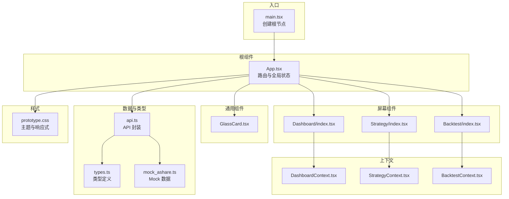
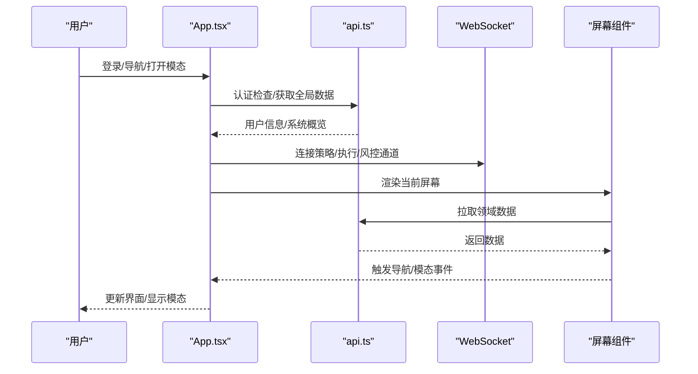
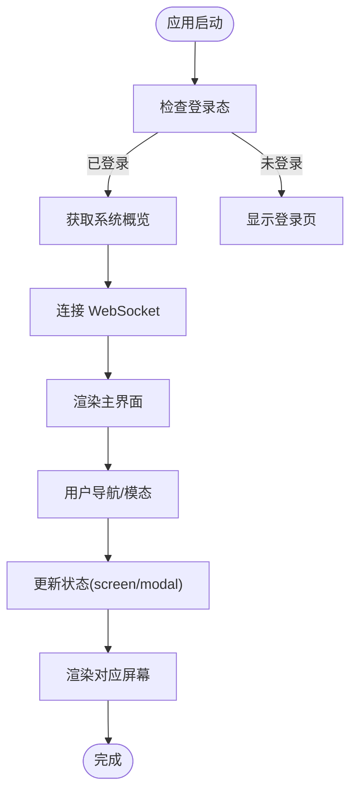
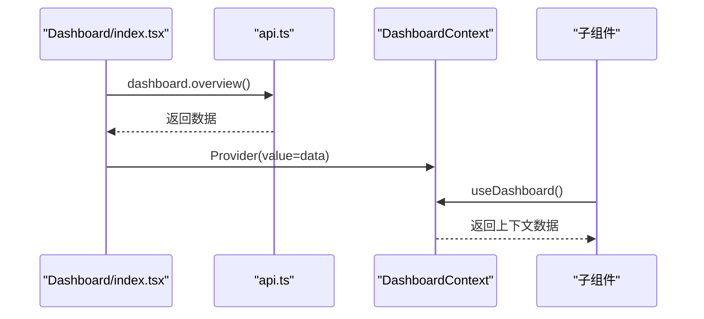
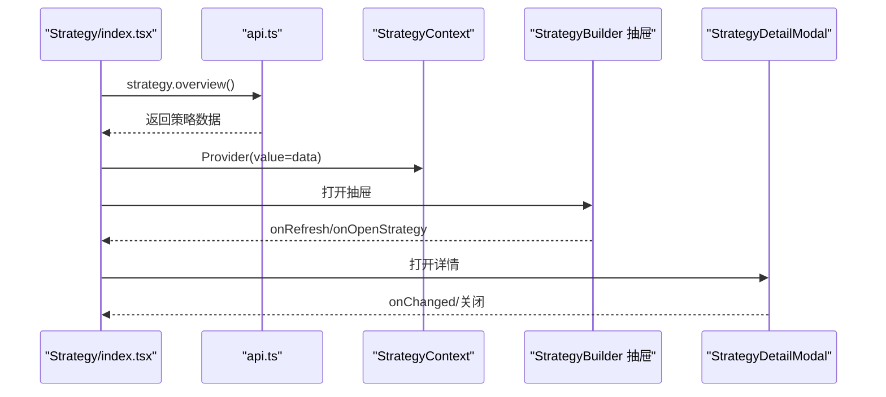
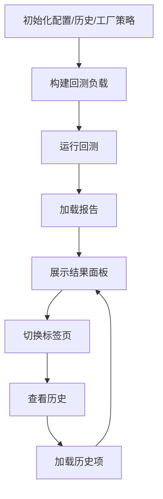
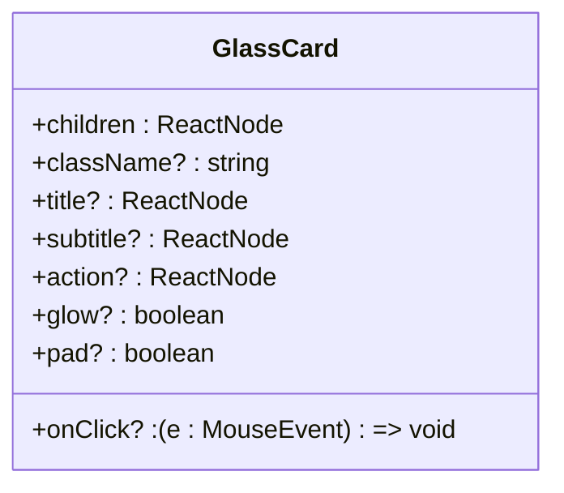
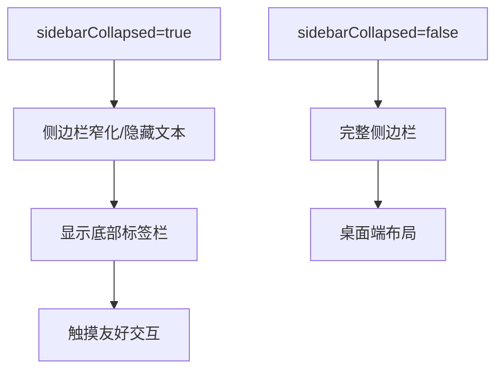
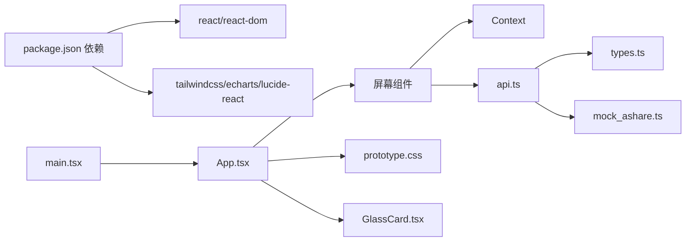

# 组件架构设计

<cite>
**本文档引用的文件**
- [App.tsx](file://frontend/src/App.tsx)
- [main.tsx](file://frontend/src/main.tsx)
- [GlassCard.tsx](file://frontend/src/components/GlassCard.tsx)
- [Dashboard/index.tsx](file://frontend/src/screens/Dashboard/index.tsx)
- [Strategy/index.tsx](file://frontend/src/screens/Strategy/index.tsx)
- [Backtest/index.tsx](file://frontend/src/screens/Backtest/index.tsx)
- [DashboardContext.tsx](file://frontend/src/contexts/DashboardContext.tsx)
- [StrategyContext.tsx](file://frontend/src/contexts/StrategyContext.tsx)
- [BacktestContext.tsx](file://frontend/src/contexts/BacktestContext.tsx)
- [api.ts](file://frontend/src/lib/api.ts)
- [types.ts](file://frontend/src/data/types.ts)
- [mock_ashare.ts](file://frontend/src/data/mock_ashare.ts)
- [prototype.css](file://frontend/src/styles/prototype.css)
- [package.json](file://frontend/package.json)
</cite>

## 目录
1. [简介](#简介)
2. [项目结构](#项目结构)
3. [核心组件](#核心组件)
4. [架构总览](#架构总览)
5. [详细组件分析](#详细组件分析)
6. [依赖关系分析](#依赖关系分析)
7. [性能考虑](#性能考虑)
8. [故障排查指南](#故障排查指南)
9. [结论](#结论)

## 简介
本文件面向 llmine-quant 前端组件架构，围绕基于 React 19 的组件化设计理念，系统阐述 App.tsx 作为根组件的架构设计、屏幕组件的组织方式、通用组件的设计模式，以及组件间通信、状态管理、事件处理、生命周期管理等核心概念。文档同时涵盖移动端适配与响应式设计的实现方式，并提供可复用的组件模式与最佳实践指导。

## 项目结构
前端采用清晰的分层组织：
- 入口与根组件：main.tsx 创建根节点，App.tsx 作为应用根容器
- 屏幕组件：按业务域划分，如 Dashboard、Strategy、Backtest 等
- 通用组件：如 GlassCard 提供可复用的卡片样式与交互
- 上下文与状态：各屏幕域内的 Context 提供局部状态共享
- 数据与类型：统一的数据类型定义与 Mock 数据
- 样式与主题：基于 CSS 变量的主题与响应式布局

**图表来源**
- [main.tsx:1-12](file://frontend/src/main.tsx#L1-L12)
- [App.tsx:1-299](file://frontend/src/App.tsx#L1-L299)
- [Dashboard/index.tsx:1-47](file://frontend/src/screens/Dashboard/index.tsx#L1-L47)
- [Strategy/index.tsx:1-168](file://frontend/src/screens/Strategy/index.tsx#L1-L168)
- [Backtest/index.tsx:1-800](file://frontend/src/screens/Backtest/index.tsx#L1-L800)
- [GlassCard.tsx:1-49](file://frontend/src/components/GlassCard.tsx#L1-L49)
- [DashboardContext.tsx:1-13](file://frontend/src/contexts/DashboardContext.tsx#L1-L13)
- [StrategyContext.tsx:1-13](file://frontend/src/contexts/StrategyContext.tsx#L1-L13)
- [BacktestContext.tsx:1-13](file://frontend/src/contexts/BacktestContext.tsx#L1-L13)
- [api.ts:1-779](file://frontend/src/lib/api.ts#L1-L779)
- [types.ts:1-647](file://frontend/src/data/types.ts#L1-L647)
- [mock_ashare.ts:1-800](file://frontend/src/data/mock_ashare.ts#L1-L800)
- [prototype.css:1-800](file://frontend/src/styles/prototype.css#L1-L800)

**章节来源**
- [main.tsx:1-12](file://frontend/src/main.tsx#L1-L12)
- [App.tsx:1-299](file://frontend/src/App.tsx#L1-L299)
- [prototype.css:1-800](file://frontend/src/styles/prototype.css#L1-L800)

## 核心组件
本节聚焦根组件 App.tsx 的架构设计与屏幕组件的组织方式，解释 Props 传递机制、事件处理模式、状态提升策略与组件通信。

- 根组件 App.tsx
  - 全局状态：屏幕状态、模态框状态、侧边栏折叠状态、用户信息、系统全局数据、回测上下文
  - 生命周期：登录态检查、401 监听、认证后拉取全局数据、WebSocket 连接管理
  - 导航与模态：支持复合导航目标（如 backtest:taskId=...）、命令面板与全局概览
  - 渲染策略：根据 screen 动态渲染对应屏幕组件，支持平滑滚动与条件渲染
  - 移动端适配：底部移动标签栏，响应式布局

- 屏幕组件组织
  - Dashboard：聚合市场、组合、策略、快速操作等模块，使用 DashboardContext 提供数据
  - Strategy：策略矩阵、生命周期、详情弹窗、抽屉式策略构建器
  - Backtest：实验工作台，包含策略选择、股票池构建、参数配置、运行与结果展示

- 通用组件
  - GlassCard：卡片容器，支持标题/副标题/操作区、点击回调、发光与内边距开关

- 上下文与状态提升
  - 各屏幕通过 Provider 将数据提升到 Context，子组件通过 hooks 获取，避免深层 Props 下传
  - App.tsx 作为全局状态持有者，负责跨屏幕的状态协调（如回测上下文）

**章节来源**
- [App.tsx:1-299](file://frontend/src/App.tsx#L1-L299)
- [Dashboard/index.tsx:1-47](file://frontend/src/screens/Dashboard/index.tsx#L1-L47)
- [Strategy/index.tsx:1-168](file://frontend/src/screens/Strategy/index.tsx#L1-L168)
- [Backtest/index.tsx:1-800](file://frontend/src/screens/Backtest/index.tsx#L1-L800)
- [GlassCard.tsx:1-49](file://frontend/src/components/GlassCard.tsx#L1-L49)
- [DashboardContext.tsx:1-13](file://frontend/src/contexts/DashboardContext.tsx#L1-L13)
- [StrategyContext.tsx:1-13](file://frontend/src/contexts/StrategyContext.tsx#L1-L13)
- [BacktestContext.tsx:1-13](file://frontend/src/contexts/BacktestContext.tsx#L1-L13)

## 架构总览
下图展示了组件层次结构、数据流向与事件处理路径：

**图表来源**
- [App.tsx:1-299](file://frontend/src/App.tsx#L1-L299)
- [api.ts:1-779](file://frontend/src/lib/api.ts#L1-L779)

**章节来源**
- [App.tsx:1-299](file://frontend/src/App.tsx#L1-L299)
- [api.ts:1-779](file://frontend/src/lib/api.ts#L1-L779)

## 详细组件分析

### App.tsx 根组件分析
- 状态管理
  - screen：当前激活屏幕标识
  - modal：当前激活模态类型
  - sidebarCollapsed：侧边栏折叠状态
  - backtestContext：回测初始参数上下文
  - currentUser/globalData：用户信息与系统全局数据
- 生命周期
  - 登录态检查与 401 处理
  - 认证后拉取系统概览
  - WebSocket 连接与断开
- 事件处理
  - 切换屏幕、打开/关闭模态
  - 复合导航目标解析（支持 backtest:taskId=...）
- 渲染策略
  - 条件渲染登录页或主界面
  - 动态渲染当前屏幕
  - 模态框统一处理

**图表来源**
- [App.tsx:1-299](file://frontend/src/App.tsx#L1-L299)

**章节来源**
- [App.tsx:1-299](file://frontend/src/App.tsx#L1-L299)

### Dashboard 屏幕组件分析
- 数据获取与提供
  - 通过 api.dashboard.overview 拉取数据
  - 使用 DashboardContext 提供数据给子组件
- 组件组合
  - MarketBar、PortfolioChart、AgentMatrix、AlertQueue、StrategyGrid、QuickActions
  - 通过 onNavigate/onModal 与根组件通信
- 状态提升
  - 将聚合数据提升到 Provider，子组件通过 useDashboard 获取

**图表来源**
- [Dashboard/index.tsx:1-47](file://frontend/src/screens/Dashboard/index.tsx#L1-L47)
- [DashboardContext.tsx:1-13](file://frontend/src/contexts/DashboardContext.tsx#L1-L13)
- [api.ts:1-779](file://frontend/src/lib/api.ts#L1-L779)

**章节来源**
- [Dashboard/index.tsx:1-47](file://frontend/src/screens/Dashboard/index.tsx#L1-L47)
- [DashboardContext.tsx:1-13](file://frontend/src/contexts/DashboardContext.tsx#L1-L13)
- [api.ts:1-779](file://frontend/src/lib/api.ts#L1-L779)

### Strategy 屏幕组件分析
- 数据与状态
  - 通过 api.strategy.overview 拉取策略域数据
  - 内部维护 selectedStrategyId、lastCreatedId、drawerOpen 等状态
- 组件组合
  - StrategyMatrix、StrategyLifecycle、StrategyDetailModal
  - 抽屉式 StrategyBuilder 用于新建策略
- 事件与导航
  - onNavigate/onOpenStrategy/onCreateOpenStrategy 等回调与根组件通信

**图表来源**
- [Strategy/index.tsx:1-168](file://frontend/src/screens/Strategy/index.tsx#L1-L168)
- [StrategyContext.tsx:1-13](file://frontend/src/contexts/StrategyContext.tsx#L1-L13)
- [api.ts:1-779](file://frontend/src/lib/api.ts#L1-L779)

**章节来源**
- [Strategy/index.tsx:1-168](file://frontend/src/screens/Strategy/index.tsx#L1-L168)
- [StrategyContext.tsx:1-13](file://frontend/src/contexts/StrategyContext.tsx#L1-L13)
- [api.ts:1-779](file://frontend/src/lib/api.ts#L1-L779)

### Backtest 屏幕组件分析
- 数据与状态
  - 配置状态（universe、日期、参数、成本假设）
  - 历史记录、活动任务、报告、段落（IS/OOS/All）
  - 运行状态（回测/Walk-Forward/敏感性）
- 功能特性
  - 策略来源：内置引擎与策略工厂
  - 股票池：Agent 构建与手动选择
  - 参数与成本配置的折叠面板
  - 实验执行与结果面板（概览/月度/Walk-Forward/敏感性/交易/过拟合/历史）
- 事件与导航
  - 运行按钮触发 API 调用，结果面板滚动定位

**图表来源**
- [Backtest/index.tsx:1-800](file://frontend/src/screens/Backtest/index.tsx#L1-L800)

**章节来源**
- [Backtest/index.tsx:1-800](file://frontend/src/screens/Backtest/index.tsx#L1-L800)

### 通用组件 GlassCard 设计模式
- 设计要点
  - 支持 children、className、title/subtitle/action、onClick、glow、pad 等属性
  - 动态类名拼接，支持发光与内边距开关
  - 可点击卡片样式与头部区域布局
- 复用场景
  - Dashboard/Strategy/Backtest 中的各类卡片容器
  - 通过 props 控制外观与交互，保持一致的视觉与行为

**图表来源**
- [GlassCard.tsx:1-49](file://frontend/src/components/GlassCard.tsx#L1-L49)

**章节来源**
- [GlassCard.tsx:1-49](file://frontend/src/components/GlassCard.tsx#L1-L49)

### 组件间通信与状态提升
- 事件传递
  - 子组件通过回调（如 onNavigate/onModal/onRefresh/onOpenStrategy）向上游传递事件
  - 根组件统一处理事件并更新状态，实现跨屏幕通信
- 状态提升
  - 屏幕组件内部状态在必要时提升到根组件（如 backtestContext）
  - 使用 Context 在屏幕内部共享数据，减少 Props 传递层级
- 高阶组件与组合
  - Provider 包裹子树，useContext 获取数据
  - 抽屉/模态等容器组件承载复杂交互，保持子组件纯展示

**章节来源**
- [App.tsx:1-299](file://frontend/src/App.tsx#L1-L299)
- [Dashboard/index.tsx:1-47](file://frontend/src/screens/Dashboard/index.tsx#L1-L47)
- [Strategy/index.tsx:1-168](file://frontend/src/screens/Strategy/index.tsx#L1-L168)
- [Backtest/index.tsx:1-800](file://frontend/src/screens/Backtest/index.tsx#L1-L800)

### 移动端适配与响应式设计
- 响应式布局
  - 侧边栏折叠：通过 sidebarCollapsed 控制宽度与内容显隐
  - 移动端标签栏：底部导航按钮，覆盖常用屏幕
- 样式主题
  - CSS 变量定义主题色、背景、圆角等
  - 玻璃拟态效果与模糊背景，增强视觉层次
- 交互优化
  - 平滑滚动与动画过渡
  - 移动端按钮尺寸与间距适配

**图表来源**
- [App.tsx:1-299](file://frontend/src/App.tsx#L1-L299)
- [prototype.css:1-800](file://frontend/src/styles/prototype.css#L1-L800)

**章节来源**
- [App.tsx:1-299](file://frontend/src/App.tsx#L1-L299)
- [prototype.css:1-800](file://frontend/src/styles/prototype.css#L1-L800)

## 依赖关系分析
- 组件依赖
  - main.tsx 依赖 App.tsx
  - App.tsx 依赖各屏幕组件与通用组件
  - 屏幕组件依赖 Context 与 api.ts
- 外部依赖
  - React 19、React DOM、TailwindCSS、ECharts、Lucide React 等
- 类型与数据
  - types.ts 定义 MockData 与接口类型
  - mock_ashare.ts 提供 Mock 数据，api.ts 封装 HTTP 与 WebSocket

**图表来源**
- [package.json:1-43](file://frontend/package.json#L1-L43)
- [main.tsx:1-12](file://frontend/src/main.tsx#L1-L12)
- [App.tsx:1-299](file://frontend/src/App.tsx#L1-L299)
- [api.ts:1-779](file://frontend/src/lib/api.ts#L1-L779)
- [types.ts:1-647](file://frontend/src/data/types.ts#L1-L647)
- [mock_ashare.ts:1-800](file://frontend/src/data/mock_ashare.ts#L1-L800)
- [prototype.css:1-800](file://frontend/src/styles/prototype.css#L1-L800)
- [GlassCard.tsx:1-49](file://frontend/src/components/GlassCard.tsx#L1-L49)

**章节来源**
- [package.json:1-43](file://frontend/package.json#L1-L43)
- [App.tsx:1-299](file://frontend/src/App.tsx#L1-L299)
- [api.ts:1-779](file://frontend/src/lib/api.ts#L1-L779)

## 性能考虑
- 渲染优化
  - 使用 useCallback 缓存导航与模态回调，减少重渲染
  - 条件渲染与懒加载：未认证时不渲染主界面；屏幕组件按需渲染
- 网络与缓存
  - 本地存储 Token，避免重复鉴权
  - 401 自动清理与登出，防止无效请求
- WebSocket 管理
  - 登录后建立连接，登出时断开，避免资源泄露
- 图表与可视化
  - ECharts 按需引入，避免不必要的包体积
- 样式与主题
  - CSS 变量与玻璃拟态减少重绘，提升移动端流畅度

[本节为通用指导，无需特定文件引用]

## 故障排查指南
- 登录与鉴权
  - 检查 authStore 是否正确设置/清除 Token
  - 监听自定义事件 llmine:unauthorized，确保自动登出
- API 错误处理
  - 401 时清理 Token 并重定向登录
  - 请求失败时捕获错误并提示用户
- WebSocket 连接
  - 确认 currentUser 存在后再连接
  - 卸载时断开连接，避免内存泄漏
- 模态与导航
  - 校验 VALID_SCREENS/VALID_MODALS，防止非法目标
  - 复合导航目标解析（如 backtest:taskId=...）需解码参数

**章节来源**
- [api.ts:1-779](file://frontend/src/lib/api.ts#L1-L779)
- [App.tsx:1-299](file://frontend/src/App.tsx#L1-L299)

## 结论
llmine-quant 前端采用清晰的组件化架构：以 App.tsx 为根容器统一管理全局状态与导航，屏幕组件按域划分并通过 Context 提供数据，通用组件（如 GlassCard）实现可复用的视觉与交互模式。通过 Props 传递、事件回调与状态提升，组件间形成松耦合的通信机制；结合响应式设计与移动端标签栏，满足多端体验需求。建议在后续迭代中进一步完善错误边界、加载状态与性能监控，持续优化用户体验与开发效率。