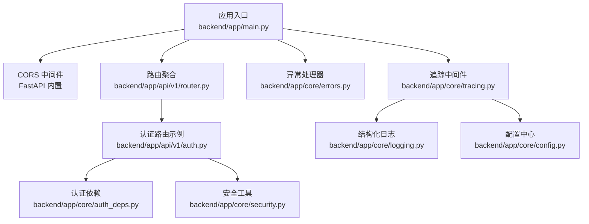
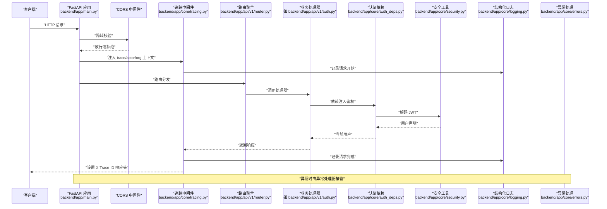
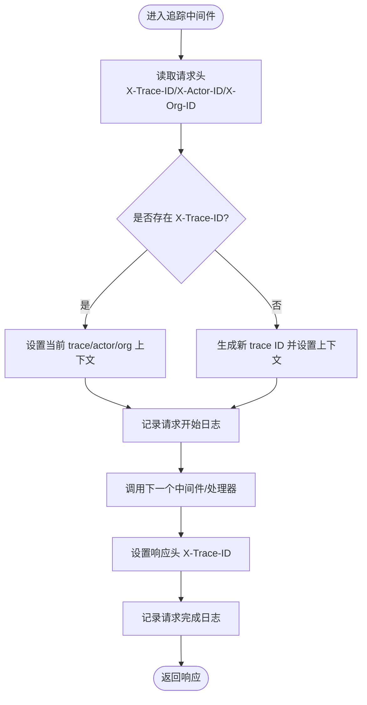
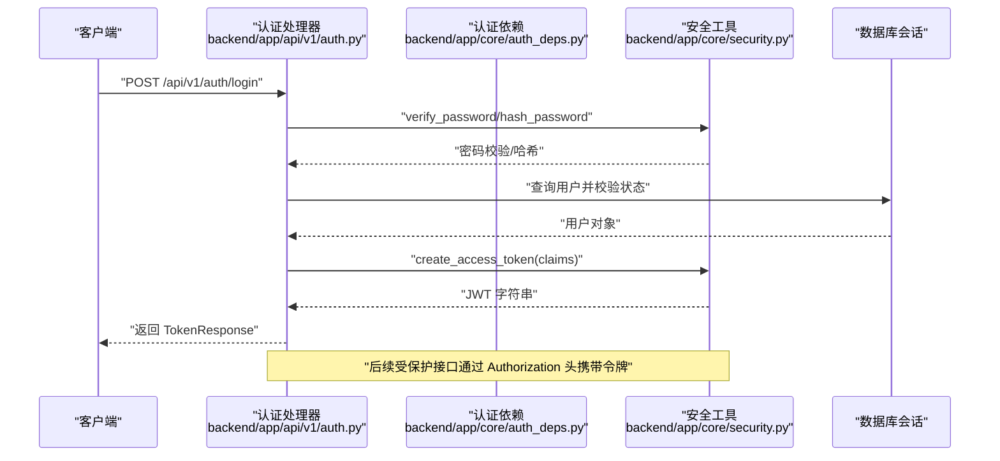
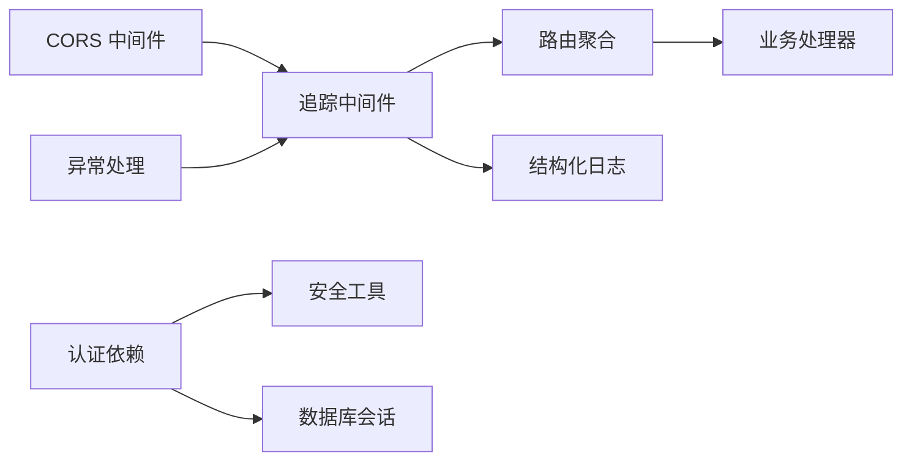

# 中间件配置

<cite>
**本文引用的文件**
- [main.py](file://backend/app/main.py)
- [tracing.py](file://backend/app/core/tracing.py)
- [logging.py](file://backend/app/core/logging.py)
- [errors.py](file://backend/app/core/errors.py)
- [config.py](file://backend/app/core/config.py)
- [auth_deps.py](file://backend/app/core/auth_deps.py)
- [security.py](file://backend/app/core/security.py)
- [router.py](file://backend/app/api/v1/router.py)
- [auth.py](file://backend/app/api/v1/auth.py)
</cite>

## 目录
1. [简介](#简介)
2. [项目结构](#项目结构)
3. [核心组件](#核心组件)
4. [架构总览](#架构总览)
5. [详细组件分析](#详细组件分析)
6. [依赖分析](#依赖分析)
7. [性能考虑](#性能考虑)
8. [故障排查指南](#故障排查指南)
9. [结论](#结论)
10. [附录](#附录)

## 简介
本文件系统性梳理 llmine-quant 后端的中间件配置与实现，重点覆盖以下方面：
- CORS 中间件：跨域策略与配置项说明
- 追踪中间件：请求上下文注入（跟踪 ID、用户标识、组织标识）与日志联动
- 日志中间件：结构化日志配置与渲染策略
- 安全中间件：基于 JWT 的认证依赖与令牌管理
- 异常处理：统一错误响应与追踪 ID 关联
- 执行顺序与控制流：中间件注册顺序、请求生命周期
- 自定义中间件开发：扩展点与最佳实践
- 请求/响应拦截与性能监控：可扩展的观测性能力

## 项目结构
后端入口在应用层集中配置中间件、异常处理器与路由挂载；核心能力由独立模块提供：
- 应用入口与中间件注册：backend/app/main.py
- 追踪与上下文：backend/app/core/tracing.py
- 结构化日志：backend/app/core/logging.py
- 错误与异常处理：backend/app/core/errors.py
- 配置中心：backend/app/core/config.py
- 认证依赖与安全工具：backend/app/core/auth_deps.py、backend/app/core/security.py
- 路由聚合：backend/app/api/v1/router.py
- 认证接口示例：backend/app/api/v1/auth.py

图表来源
- [main.py:49-54](file://backend/app/main.py#L49-L54)
- [tracing.py:49-86](file://backend/app/core/tracing.py#L49-L86)
- [logging.py:11-35](file://backend/app/core/logging.py#L11-L35)
- [errors.py:73-118](file://backend/app/core/errors.py#L73-L118)
- [config.py:69-70](file://backend/app/core/config.py#L69-L70)
- [auth_deps.py:12-52](file://backend/app/core/auth_deps.py#L12-L52)
- [security.py:11-37](file://backend/app/core/security.py#L11-L37)
- [router.py:23-39](file://backend/app/api/v1/router.py#L23-L39)
- [auth.py:47-89](file://backend/app/api/v1/auth.py#L47-L89)

章节来源
- [main.py:1-65](file://backend/app/main.py#L1-L65)
- [router.py:1-40](file://backend/app/api/v1/router.py#L1-L40)

## 核心组件
- CORS 中间件：通过 FastAPI 内置 CORSMiddleware 注入，配置项来自配置中心，支持通配符方法与头。
- 追踪中间件：注入 X-Trace-ID、X-Actor-ID、X-Org-ID 到请求与响应头，记录请求开始/结束日志。
- 结构化日志：基于 structlog，按环境选择 JSON 或控制台渲染，统一日志格式。
- 安全中间件：OAuth2PasswordBearer 提供令牌解析，get_current_user/get_optional_user 实现鉴权依赖。
- 异常处理：统一捕获 LLMineException 与通用异常，返回带 trace_id 的标准化错误响应。

章节来源
- [main.py:49-54](file://backend/app/main.py#L49-L54)
- [tracing.py:49-86](file://backend/app/core/tracing.py#L49-L86)
- [logging.py:11-41](file://backend/app/core/logging.py#L11-L41)
- [auth_deps.py:12-52](file://backend/app/core/auth_deps.py#L12-L52)
- [errors.py:73-118](file://backend/app/core/errors.py#L73-L118)

## 架构总览
下图展示请求从进入应用到响应返回的关键路径，以及中间件与各模块的交互关系。

图表来源
- [main.py:49-54](file://backend/app/main.py#L49-L54)
- [tracing.py:49-86](file://backend/app/core/tracing.py#L49-L86)
- [router.py:23-39](file://backend/app/api/v1/router.py#L23-L39)
- [auth.py:47-89](file://backend/app/api/v1/auth.py#L47-L89)
- [auth_deps.py:15-39](file://backend/app/core/auth_deps.py#L15-L39)
- [security.py:24-37](file://backend/app/core/security.py#L24-L37)
- [logging.py:19-35](file://backend/app/core/logging.py#L19-L35)
- [errors.py:73-118](file://backend/app/core/errors.py#L73-L118)

## 详细组件分析

### CORS 中间件
- 作用：允许前端不同源访问后端 API，避免浏览器跨域限制。
- 配置来源：配置中心 settings.cors_origins 控制允许的源列表。
- 关键行为：允许凭据、通配符方法与头，简化前端集成。
- 配置参数：
  - allow_origins：允许的源列表
  - allow_credentials：是否允许携带凭据
  - allow_methods：允许的 HTTP 方法
  - allow_headers：允许的请求头
- 典型场景：本地开发（如前端 Vite/VitePress 默认端口）与生产域名白名单。

章节来源
- [main.py:49-49](file://backend/app/main.py#L49-L49)
- [config.py:69-70](file://backend/app/core/config.py#L69-L70)

### 追踪中间件
- 作用：为每个请求生成或复用 trace ID，并注入 actor 与组织上下文，贯穿日志与异常处理。
- 关键函数：
  - tracing_middleware：注入上下文、记录开始/结束日志、设置响应头
  - get_trace_id/set_trace_id：读取/设置当前 trace ID
  - get_actor_id/set_actor_id、get_org_id/set_org_id：读取/设置 actor/Org
- 头部约定：
  - 请求头：X-Trace-ID、X-Actor-ID、X-Org-ID
  - 响应头：X-Trace-ID（便于客户端/网关关联）
- 日志字段：trace_id、actor_id、method、path、status_code 等。

图表来源
- [tracing.py:49-86](file://backend/app/core/tracing.py#L49-L86)
- [logging.py:19-35](file://backend/app/core/logging.py#L19-L35)

章节来源
- [tracing.py:13-86](file://backend/app/core/tracing.py#L13-L86)

### 日志中间件（结构化）
- 作用：统一输出结构化日志，便于采集与检索。
- 渲染策略：
  - 生产环境：JSONRenderer
  - 开发环境：ConsoleRenderer
- 处理器链路：合并上下文变量 → 添加日志级别 → 时间戳 → 堆栈信息 → 异常格式化 → Unicode 解码 → 渲染器
- 日志来源：追踪中间件与错误处理器均使用结构化日志记录关键事件。

章节来源
- [logging.py:11-41](file://backend/app/core/logging.py#L11-L41)

### 安全中间件（认证依赖）
- 作用：基于 Bearer 令牌的认证与授权，提供“必需”和“可选”两种依赖。
- 组件：
  - OAuth2PasswordBearer：令牌提取
  - get_current_user：缺失或无效令牌时抛出 401
  - get_optional_user：缺失或无效令牌时返回 None
- 令牌处理：decode_access_token 使用密钥与算法解码，失败则视为无效。
- 与认证接口配合：登录成功签发 JWT，并持久化会话。

图表来源
- [auth.py:47-89](file://backend/app/api/v1/auth.py#L47-L89)
- [auth_deps.py:12-39](file://backend/app/core/auth_deps.py#L12-L39)
- [security.py:14-29](file://backend/app/core/security.py#L14-L29)

章节来源
- [auth_deps.py:12-52](file://backend/app/core/auth_deps.py#L12-L52)
- [security.py:14-37](file://backend/app/core/security.py#L14-L37)
- [auth.py:47-89](file://backend/app/api/v1/auth.py#L47-L89)

### 异常处理
- 自定义异常：LLMineException 及其子类（如 NotFound、BadRequest、Unauthorized 等），统一包含 code、status_code、details。
- 异常处理器：
  - handle_llmine_exception：记录告警日志，返回带 trace_id 的 JSON 错误响应
  - handle_generic_exception：记录异常日志，返回通用内部错误
- 与追踪中间件联动：从上下文中读取 trace_id，确保问题可追溯。

章节来源
- [errors.py:13-118](file://backend/app/core/errors.py#L13-L118)
- [tracing.py:75-76](file://backend/app/core/tracing.py#L75-L76)

## 依赖分析
- 中间件注册顺序影响请求生命周期：
  1) CORS 中间件：最先执行，决定是否放行跨域请求
  2) 追踪中间件：其次执行，注入上下文并记录开始/结束日志
  3) 路由与业务处理器：随后执行
  4) 异常处理器：最后兜底，统一错误响应
- 模块耦合：
  - 追踪中间件依赖配置中心（读取日志级别）与结构化日志
  - 认证依赖依赖安全工具与数据库会话
  - 异常处理器依赖追踪中间件提供的 trace_id

图表来源
- [main.py:49-54](file://backend/app/main.py#L49-L54)
- [tracing.py:49-86](file://backend/app/core/tracing.py#L49-L86)
- [router.py:23-39](file://backend/app/api/v1/router.py#L23-L39)
- [auth_deps.py:12-52](file://backend/app/core/auth_deps.py#L12-L52)
- [security.py:11-37](file://backend/app/core/security.py#L11-L37)
- [errors.py:73-118](file://backend/app/core/errors.py#L73-L118)
- [logging.py:19-35](file://backend/app/core/logging.py#L19-L35)

章节来源
- [main.py:49-54](file://backend/app/main.py#L49-L54)
- [tracing.py:49-86](file://backend/app/core/tracing.py#L49-L86)
- [auth_deps.py:12-52](file://backend/app/core/auth_deps.py#L12-L52)
- [errors.py:73-118](file://backend/app/core/errors.py#L73-L118)

## 性能考虑
- 中间件开销：追踪中间件仅进行上下文注入与少量日志写入，对延迟影响较小；建议在生产环境启用 JSON 渲染以提升可观测性。
- 日志级别：通过配置中心 log_level 控制日志输出量，避免在高吞吐场景下产生过多 I/O。
- CORS 放宽：仅在开发阶段开放通配符方法与头，生产环境建议收敛 allow_methods 与 allow_headers，减少预检请求成本。
- 异常处理：统一异常响应可减少分支判断，但需注意异常堆栈记录的成本，建议在生产环境保留必要字段。

## 故障排查指南
- 无法跨域访问
  - 检查 CORS 配置中的 allow_origins 是否包含前端地址
  - 确认请求头是否携带凭据且服务端允许
- 401 未认证或令牌无效
  - 确认 Authorization 头格式为 Bearer 令牌
  - 检查密钥与算法配置是否正确
  - 核对用户状态是否为 active
- 无 trace_id 或日志不完整
  - 确认请求头是否传入 X-Trace-ID
  - 检查结构化日志渲染器是否按环境正确配置
- 500 内部错误
  - 查看错误响应中的 trace_id，结合日志定位问题
  - 检查异常处理器是否被正确注册

章节来源
- [config.py:55-55](file://backend/app/core/config.py#L55-L55)
- [auth_deps.py:15-39](file://backend/app/core/auth_deps.py#L15-L39)
- [errors.py:73-118](file://backend/app/core/errors.py#L73-L118)
- [logging.py:19-35](file://backend/app/core/logging.py#L19-L35)

## 结论
本项目采用轻量而清晰的中间件体系：CORS 简化跨域、追踪中间件提供统一上下文与可观测性、结构化日志保障日志质量、认证依赖与安全工具实现标准 JWT 流程、异常处理器统一错误响应。整体执行顺序明确，易于扩展与维护。

## 附录

### 中间件执行顺序与控制流
- 注册顺序
  1) CORS 中间件
  2) 追踪中间件
  3) 路由与业务处理器
  4) 异常处理器
- 控制流要点
  - CORS 在最前，决定是否放行
  - 追踪在第二，负责上下文与日志
  - 路由与处理器在中间，处理业务
  - 异常处理器在最后，兜底统一响应

章节来源
- [main.py:49-54](file://backend/app/main.py#L49-L54)

### 配置参数一览（节选）
- CORS
  - cors_origins：允许的源列表
- 日志
  - log_level：日志级别
- 安全
  - secret_key：JWT 密钥
  - algorithm：签名算法
  - access_token_expire_minutes：令牌过期时间
- API
  - api_v1_prefix：API 前缀
  - idempotency_key_header：幂等键请求头名

章节来源
- [config.py:51-75](file://backend/app/core/config.py#L51-L75)

### 自定义中间件开发指南
- 开发步骤
  - 定义异步中间件函数，接收 request 与 call_next
  - 在进入 call_next 前后分别做请求/响应拦截
  - 使用结构化日志记录关键事件
  - 通过 app.middleware("http")(your_middleware) 注册
- 注意事项
  - 保持中间件职责单一，避免阻塞
  - 明确中间件注册顺序，避免覆盖或冲突
  - 与追踪中间件协同，确保 trace_id 一致
  - 对异常进行捕获并交由异常处理器统一处理

章节来源
- [main.py:49-50](file://backend/app/main.py#L49-L50)
- [tracing.py:49-86](file://backend/app/core/tracing.py#L49-L86)
- [logging.py:19-35](file://backend/app/core/logging.py#L19-L35)
- [errors.py:73-118](file://backend/app/core/errors.py#L73-L118)