# 后端架构

<cite>
**本文引用的文件**
- [backend/app/main.py](file://backend/app/main.py)
- [backend/app/api/v1/router.py](file://backend/app/api/v1/router.py)
- [backend/app/api/v1/auth.py](file://backend/app/api/v1/auth.py)
- [backend/app/core/config.py](file://backend/app/core/config.py)
- [backend/app/core/errors.py](file://backend/app/core/errors.py)
- [backend/app/core/logging.py](file://backend/app/core/logging.py)
- [backend/app/core/tracing.py](file://backend/app/core/tracing.py)
- [backend/app/core/auth_deps.py](file://backend/app/core/auth_deps.py)
- [backend/app/db/session.py](file://backend/app/db/session.py)
- [backend/app/services/__init__.py](file://backend/app/services/__init__.py)
- [backend/app/services/strategy_generation.py](file://backend/app/services/strategy_generation.py)
- [backend/app/domains/strategy/models.py](file://backend/app/domains/strategy/models.py)
- [backend/app/tasks/celery_app.py](file://backend/app/tasks/celery_app.py)
- [backend/pyproject.toml](file://backend/pyproject.toml)
- [backend/README.md](file://backend/README.md)
</cite>

## 目录
1. [简介](#简介)
2. [项目结构](#项目结构)
3. [核心组件](#核心组件)
4. [架构总览](#架构总览)
5. [详细组件分析](#详细组件分析)
6. [依赖分析](#依赖分析)
7. [性能考虑](#性能考虑)
8. [故障排查指南](#故障排查指南)
9. [结论](#结论)
10. [附录](#附录)

## 简介
本文件系统性梳理 llmine-quant 后端的架构设计与实现，围绕基于 FastAPI 的应用入口、生命周期管理、中间件与异常处理、分层架构（表现层、应用层、领域层、基础设施层）、路由组织、依赖注入、配置管理、日志与追踪、以及任务调度等主题展开。文档同时提供可视化图示与最佳实践建议，帮助开发者快速理解并扩展后端能力。

## 项目结构
后端采用“按功能域分层 + 模块化路由”的组织方式：
- 应用入口与生命周期：在应用入口集中注册中间件、异常处理器、路由前缀，并通过 lifespan 管理启动/停止流程。
- 表现层（API v1）：以 APIRouter 聚合各业务模块路由，统一前缀与标签。
- 应用层（Services）：封装业务编排与跨仓库/协调逻辑，面向请求粒度实例化。
- 领域层（Domains）：定义实体与数据模型，承载业务不变量。
- 基础设施层（DB、配置、日志、追踪、任务队列）：提供数据库连接、配置加载、结构化日志、请求追踪、异步任务执行等支撑能力。
- 集成与外部服务：LLM 提供商工厂、市场数据适配器等。

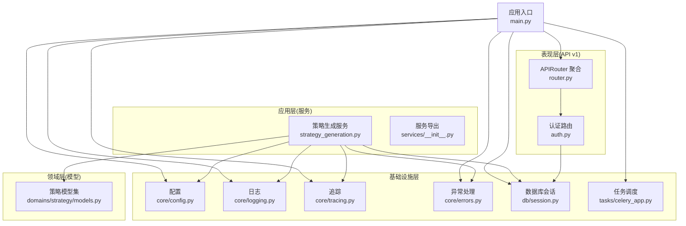

图表来源
- [backend/app/main.py:1-65](file://backend/app/main.py#L1-L65)
- [backend/app/api/v1/router.py:1-40](file://backend/app/api/v1/router.py#L1-L40)
- [backend/app/api/v1/auth.py:1-194](file://backend/app/api/v1/auth.py#L1-L194)
- [backend/app/services/strategy_generation.py:1-584](file://backend/app/services/strategy_generation.py#L1-L584)
- [backend/app/domains/strategy/models.py:1-84](file://backend/app/domains/strategy/models.py#L1-L84)
- [backend/app/core/config.py:1-196](file://backend/app/core/config.py#L1-L196)
- [backend/app/core/logging.py:1-41](file://backend/app/core/logging.py#L1-L41)
- [backend/app/core/tracing.py:1-87](file://backend/app/core/tracing.py#L1-L87)
- [backend/app/core/errors.py:1-119](file://backend/app/core/errors.py#L1-L119)
- [backend/app/db/session.py:1-34](file://backend/app/db/session.py#L1-L34)
- [backend/app/tasks/celery_app.py:1-42](file://backend/app/tasks/celery_app.py#L1-L42)

章节来源
- [backend/app/main.py:1-65](file://backend/app/main.py#L1-L65)
- [backend/app/api/v1/router.py:1-40](file://backend/app/api/v1/router.py#L1-L40)
- [backend/app/services/__init__.py:1-18](file://backend/app/services/__init__.py#L1-L18)

## 核心组件
- 应用入口与生命周期
  - 使用 lifespan 在启动时打印关键配置、启动行情流；在关闭时停止行情流并记录日志。
  - 注册 CORS、Tracing 中间件、全局异常处理器。
  - 路由聚合：include_router 统一挂载 API v1 与 WebSocket 路由。
- 配置管理
  - 基于 pydantic-settings 的 Settings 类，支持从环境变量与本地 CLI 配置自动填充 LLM 凭据。
  - 数据库 URL 归一化（SQLite 相对路径锚定），确保多进程工作目录不一致时仍指向同一文件。
- 日志与追踪
  - 结构化日志：开发/生产差异化渲染；统一通过 structlog 获取 Logger。
  - 请求追踪：中间件注入 trace_id、actor_id、org_id，贯穿请求生命周期并在响应头回传。
- 异常处理
  - 自定义 LLMineException 及其子类，统一错误响应格式与日志字段。
  - 未捕获异常统一返回内部错误并附带 trace_id。
- 依赖注入与数据库会话
  - AsyncSessionLocal 工厂按配置创建引擎；get_db 作为 FastAPI 依赖提供请求级会话，自动回滚与关闭。
- 认证与授权
  - OAuth2PasswordBearer + JWT 解码；get_current_user/get_optional_user 用于保护路由。
- 服务层与业务编排
  - StrategyGenerationService 将自然语言到代码再到回测的完整流水线编排为可观察、可观测的阶段事件。
- 任务调度
  - Celery 应用与周期任务配置，支持后台作业与队列隔离。

章节来源
- [backend/app/main.py:19-65](file://backend/app/main.py#L19-L65)
- [backend/app/core/config.py:48-196](file://backend/app/core/config.py#L48-L196)
- [backend/app/core/logging.py:11-41](file://backend/app/core/logging.py#L11-L41)
- [backend/app/core/tracing.py:13-87](file://backend/app/core/tracing.py#L13-L87)
- [backend/app/core/errors.py:13-119](file://backend/app/core/errors.py#L13-L119)
- [backend/app/db/session.py:14-34](file://backend/app/db/session.py#L14-L34)
- [backend/app/core/auth_deps.py:15-53](file://backend/app/core/auth_deps.py#L15-L53)
- [backend/app/services/strategy_generation.py:86-374](file://backend/app/services/strategy_generation.py#L86-L374)
- [backend/app/tasks/celery_app.py:15-42](file://backend/app/tasks/celery_app.py#L15-L42)

## 架构总览
下图展示从客户端到服务层、领域层与基础设施层的整体交互路径，以及关键中间件与异常处理的插入点。

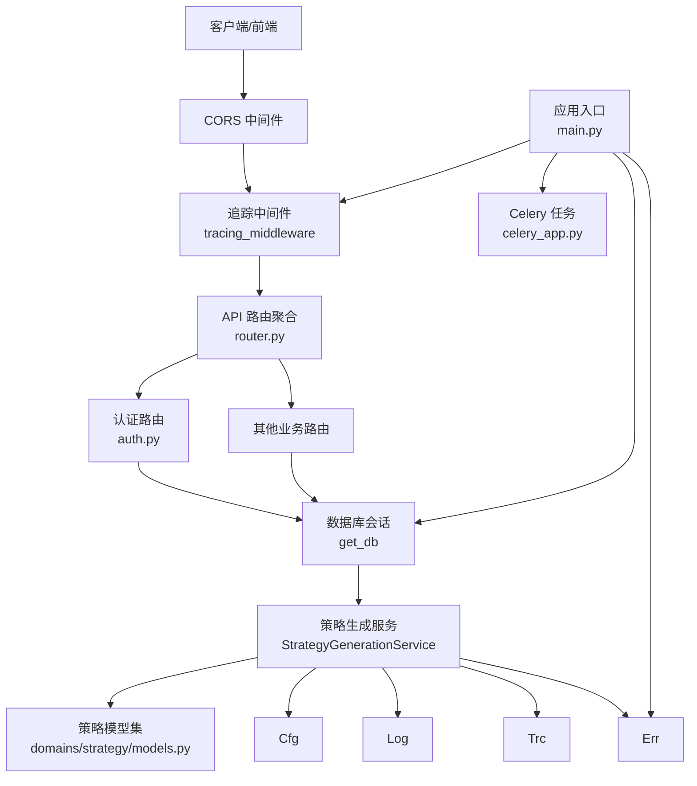

图表来源
- [backend/app/main.py:39-65](file://backend/app/main.py#L39-L65)
- [backend/app/api/v1/router.py:23-40](file://backend/app/api/v1/router.py#L23-L40)
- [backend/app/api/v1/auth.py:47-194](file://backend/app/api/v1/auth.py#L47-L194)
- [backend/app/services/strategy_generation.py:86-584](file://backend/app/services/strategy_generation.py#L86-L584)
- [backend/app/domains/strategy/models.py:9-84](file://backend/app/domains/strategy/models.py#L9-L84)
- [backend/app/db/session.py:24-34](file://backend/app/db/session.py#L24-L34)
- [backend/app/tasks/celery_app.py:15-42](file://backend/app/tasks/celery_app.py#L15-L42)

## 详细组件分析

### 应用入口与生命周期（FastAPI）
- 生命周期管理：使用 lifespan 在启动时记录应用信息与外部依赖（如行情流），在关闭时优雅停止。
- 中间件：CORS 允许跨域；Tracing 中间件注入 trace/actor/org 上下文并记录请求开始/结束。
- 异常处理：注册自定义 LLMineException 与通用 Exception 处理器。
- 路由组织：include_router 统一挂载 API v1 与 WebSocket 路由，设置 openapi/docs/redoc 路径。

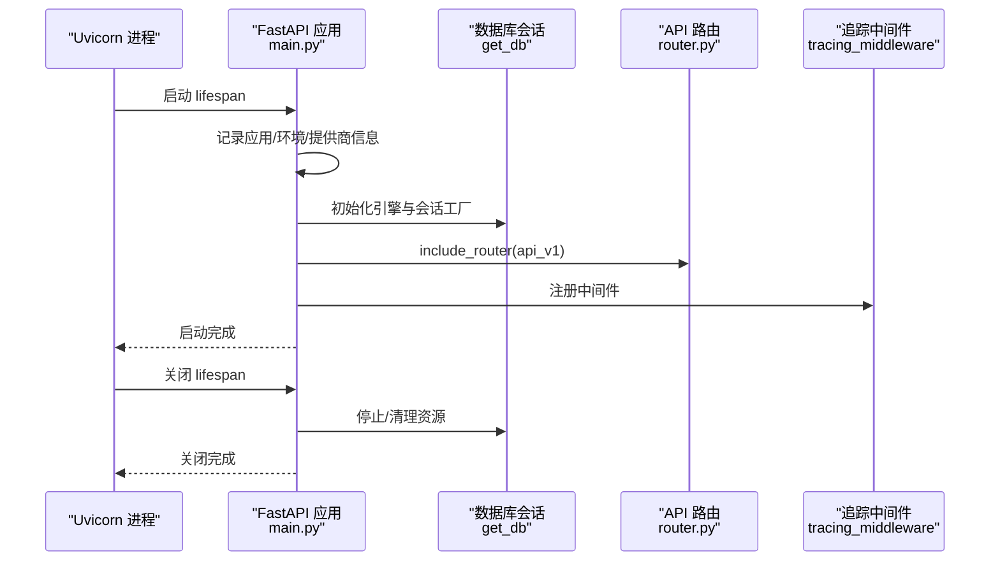

图表来源
- [backend/app/main.py:20-36](file://backend/app/main.py#L20-L36)
- [backend/app/db/session.py:14-21](file://backend/app/db/session.py#L14-L21)
- [backend/app/api/v1/router.py:23-40](file://backend/app/api/v1/router.py#L23-L40)
- [backend/app/core/tracing.py:49-87](file://backend/app/core/tracing.py#L49-L87)

章节来源
- [backend/app/main.py:19-65](file://backend/app/main.py#L19-L65)

### 分层架构与职责划分
- 表现层（API v1）
  - 负责路由聚合、参数校验、响应模型定义与认证依赖注入。
  - 示例：认证路由 login/register/refresh/logout/me。
- 应用层（Services）
  - 封装业务编排与跨域协作，面向请求粒度实例化，负责事务边界与审计日志。
  - 示例：StrategyGenerationService 协调研究、代码生成、静态检查、版本持久化、回测、风控与发布。
- 领域层（Domains）
  - 定义实体与不变量，如策略主表、版本、任务、流水线事件与模板。
- 基础设施层（DB/Config/Logging/Tracing/Tasks）
  - 提供数据库引擎与会话、配置加载、结构化日志、请求追踪、任务队列等。

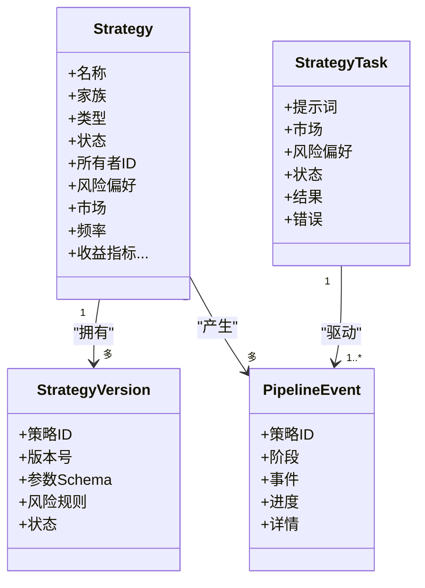

图表来源
- [backend/app/domains/strategy/models.py:9-84](file://backend/app/domains/strategy/models.py#L9-L84)

章节来源
- [backend/app/api/v1/auth.py:47-194](file://backend/app/api/v1/auth.py#L47-L194)
- [backend/app/services/strategy_generation.py:86-374](file://backend/app/services/strategy_generation.py#L86-L374)
- [backend/app/domains/strategy/models.py:9-84](file://backend/app/domains/strategy/models.py#L9-L84)

### 路由组织与依赖注入
- 路由聚合：API v1 路由器 include_router 多个业务模块，统一前缀与标签，便于文档与维护。
- 依赖注入：get_db 提供请求级 AsyncSession；OAuth2PasswordBearer 与 get_current_user/get_optional_user 提供认证依赖。

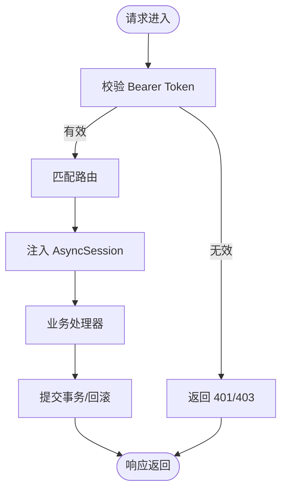

图表来源
- [backend/app/api/v1/router.py:23-40](file://backend/app/api/v1/router.py#L23-L40)
- [backend/app/core/auth_deps.py:15-53](file://backend/app/core/auth_deps.py#L15-L53)
- [backend/app/db/session.py:24-34](file://backend/app/db/session.py#L24-L34)

章节来源
- [backend/app/api/v1/router.py:1-40](file://backend/app/api/v1/router.py#L1-L40)
- [backend/app/core/auth_deps.py:15-53](file://backend/app/core/auth_deps.py#L15-L53)
- [backend/app/db/session.py:24-34](file://backend/app/db/session.py#L24-L34)

### 配置管理与凭据自动发现
- 支持从环境变量与本地 CLI 配置文件（~/.claude/settings.json、~/.codex/auth.json）自动填充 LLM 凭据。
- 自动选择 LLM 提供商（Anthropic/OpenAI/Mock），并记录来源。
- 数据库 URL 归一化，避免相对路径因工作目录不同导致的文件解析差异。

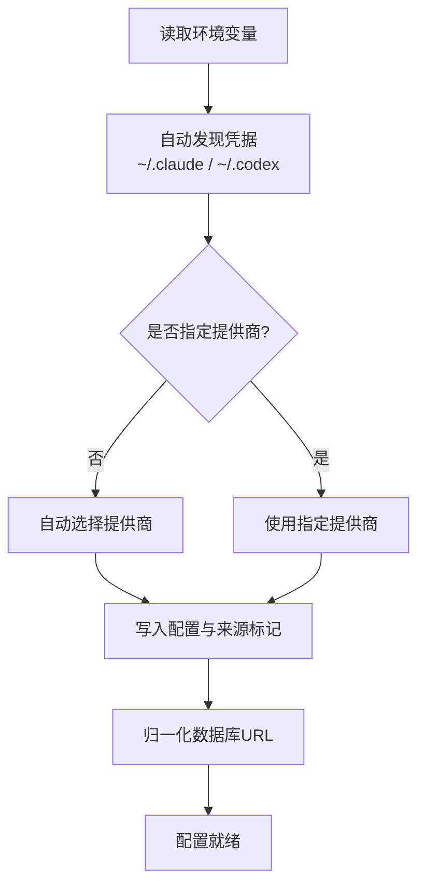

图表来源
- [backend/app/core/config.py:110-196](file://backend/app/core/config.py#L110-L196)

章节来源
- [backend/app/core/config.py:110-196](file://backend/app/core/config.py#L110-L196)

### 日志记录与追踪
- 结构化日志：开发环境控制台渲染，生产环境 JSON 渲染；统一过滤级别。
- 请求追踪：中间件注入 trace_id、actor_id、org_id；日志中记录请求开始/结束；响应头回传 trace_id。

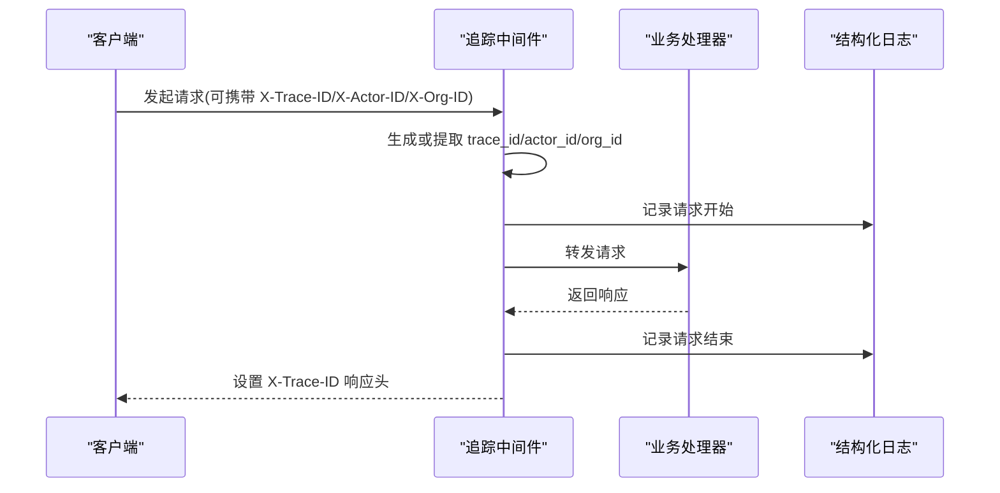

图表来源
- [backend/app/core/tracing.py:49-87](file://backend/app/core/tracing.py#L49-L87)
- [backend/app/core/logging.py:11-41](file://backend/app/core/logging.py#L11-L41)

章节来源
- [backend/app/core/logging.py:11-41](file://backend/app/core/logging.py#L11-L41)
- [backend/app/core/tracing.py:13-87](file://backend/app/core/tracing.py#L13-L87)

### 异常处理机制
- 自定义异常：LLMineException 及其子类（NotFound/BadRequest/Unauthorized/Forbidden/Conflict/Idempotency/LLM）。
- 统一响应：handle_llmine_exception 与 handle_generic_exception 输出标准化错误体并附带 trace_id。
- 日志记录：区分受控错误与未受控异常，保留上下文信息便于定位。

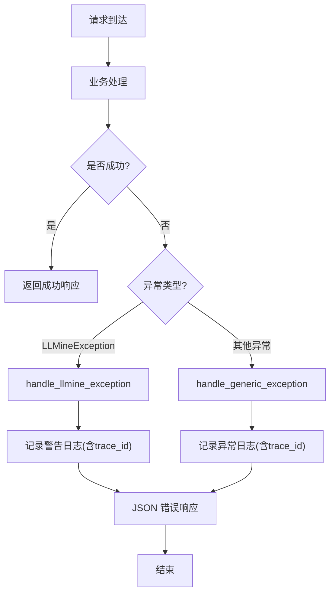

图表来源
- [backend/app/core/errors.py:73-119](file://backend/app/core/errors.py#L73-L119)

章节来源
- [backend/app/core/errors.py:13-119](file://backend/app/core/errors.py#L13-L119)

### 服务编排：策略生成流水线
- 流水线阶段：研究扫描、代码生成、静态检查、版本持久化、研究回测、风控评估、发布与审计。
- 观察与广播：每个阶段持久化 PipelineEvent 并通过 WebSocket 广播，支持前端实时反馈。
- 失败归因：根据异常类型与消息关键词推断失败阶段，记录失败事件并回滚策略状态。

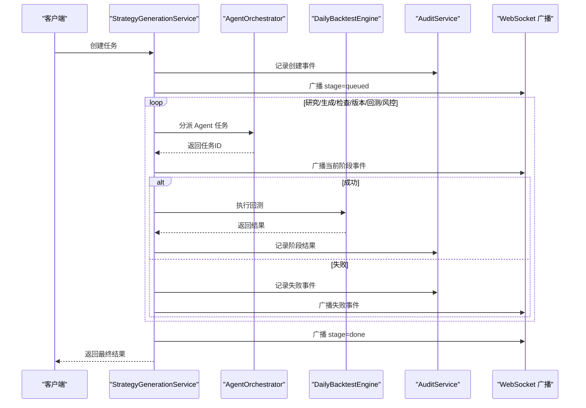

图表来源
- [backend/app/services/strategy_generation.py:96-374](file://backend/app/services/strategy_generation.py#L96-L374)

章节来源
- [backend/app/services/strategy_generation.py:86-584](file://backend/app/services/strategy_generation.py#L86-L584)

### 认证与授权
- 登录：邮箱+密码校验，生成 JWT 并记录会话。
- 注册：去重校验，创建用户并签发令牌。
- 刷新：验证旧令牌有效性后签发新令牌。
- 注销：撤销会话（删除 token 哈希对应记录）。
- 当前用户：从 Authorization Bearer 中解析并校验 JWT，查询用户状态。

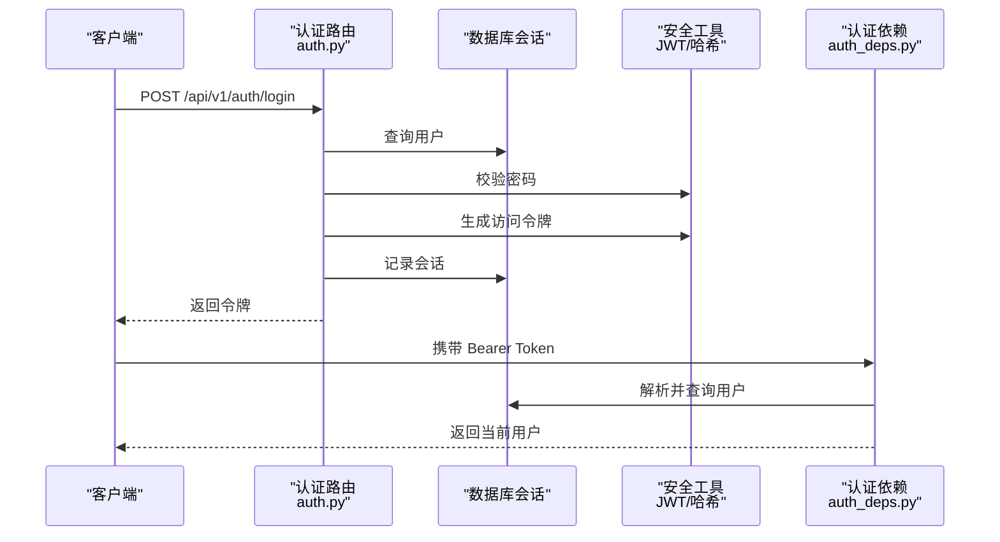

图表来源
- [backend/app/api/v1/auth.py:47-194](file://backend/app/api/v1/auth.py#L47-L194)
- [backend/app/core/auth_deps.py:15-53](file://backend/app/core/auth_deps.py#L15-L53)

章节来源
- [backend/app/api/v1/auth.py:47-194](file://backend/app/api/v1/auth.py#L47-L194)
- [backend/app/core/auth_deps.py:15-53](file://backend/app/core/auth_deps.py#L15-L53)

### 任务调度与后台作业
- Celery 应用：Broker/Backend 默认 Redis，序列化 JSON，UTC+8 时区。
- 周期任务：盘后纸交易批处理（工作日 15:30）。
- 队列隔离：任务在独立队列中执行，便于资源与优先级管理。

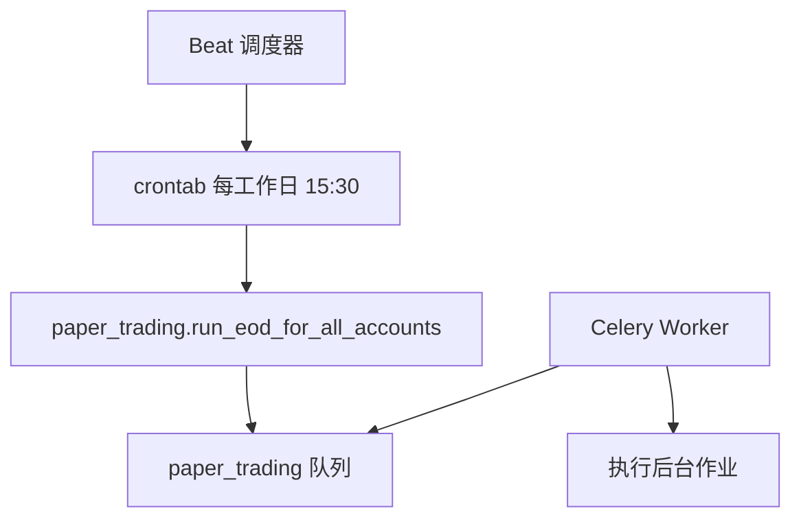

图表来源
- [backend/app/tasks/celery_app.py:35-42](file://backend/app/tasks/celery_app.py#L35-L42)

章节来源
- [backend/app/tasks/celery_app.py:15-42](file://backend/app/tasks/celery_app.py#L15-L42)

## 依赖分析
- 第三方依赖：FastAPI、Uvicorn、SQLAlchemy asyncio、Alembic、structlog、Celery、Redis、Pydantic/Settings、Passlib、Prometheus 等。
- LLM 与市场数据：可选安装（llm、market-data），通过工厂与适配器解耦。
- 版本与工具链：Ruff、Mypy、Pytest 等保证代码质量与一致性。

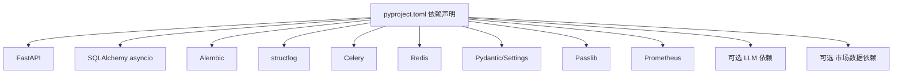

图表来源
- [backend/pyproject.toml:7-27](file://backend/pyproject.toml#L7-L27)
- [backend/pyproject.toml:39-46](file://backend/pyproject.toml#L39-L46)

章节来源
- [backend/pyproject.toml:1-78](file://backend/pyproject.toml#L1-L78)

## 性能考虑
- 数据库连接：异步引擎与连接池配置，SQLite 场景开启跨线程兼容；请求级会话减少长事务占用。
- 日志开销：生产环境 JSON 渲染与结构化字段，避免过度格式化；追踪中间件仅注入必要上下文。
- 任务并发：Celery worker 最大任务数限制与延迟确认，平衡吞吐与稳定性。
- 回测与特征：回测与特征存储为最佳努力，异常不阻塞主流水线，保障可用性。

## 故障排查指南
- 健康检查：/health 返回状态与版本，便于容器编排与运维监控。
- 异常定位：所有错误响应包含 trace_id，结合日志与追踪上下文快速复现。
- 认证问题：确认 Authorization Bearer 是否正确、令牌是否过期、用户状态是否激活。
- 数据库问题：检查 DATABASE_URL、SQLite 路径归一化、连接参数；请求级回滚避免脏状态。
- LLM 问题：检查 LLM 提供商配置与凭据来源，必要时切换至 mock 提供商验证集成。

章节来源
- [backend/app/main.py:61-65](file://backend/app/main.py#L61-L65)
- [backend/app/core/errors.py:73-119](file://backend/app/core/errors.py#L73-L119)
- [backend/app/core/auth_deps.py:15-53](file://backend/app/core/auth_deps.py#L15-L53)
- [backend/app/db/session.py:24-34](file://backend/app/db/session.py#L24-L34)
- [backend/app/core/config.py:110-196](file://backend/app/core/config.py#L110-L196)

## 结论
该后端以 FastAPI 为核心，采用清晰的分层架构与模块化路由，结合结构化日志、请求追踪、统一异常处理与可插拔的配置/LLM/市场数据适配器，形成高内聚、低耦合且易于扩展的系统。服务层通过编排流水线将自然语言到代码再到回测的复杂流程拆解为可观察、可观测的阶段，配合审计与广播机制提升可观测性与可运维性。建议在生产环境中完善鉴权策略、限流与熔断、监控指标与告警，并持续优化回测与特征存储的性能与可靠性。

## 附录
- 快速启动与运行：参考 README 的安装、迁移、种子数据与服务启动步骤。
- 环境变量：DATABASE_URL、REDIS_URL、SECRET_KEY、ENV、LOG_LEVEL 等。

章节来源
- [backend/README.md:1-45](file://backend/README.md#L1-L45)