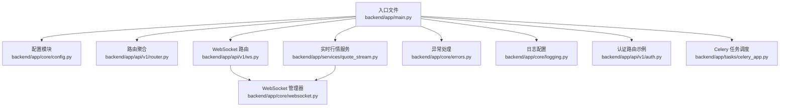
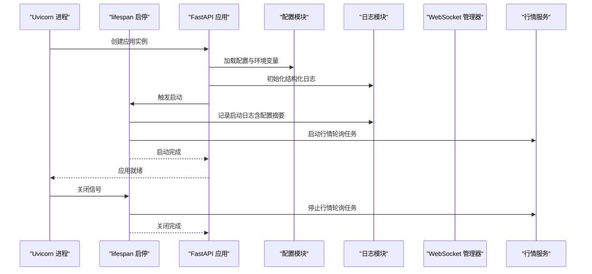
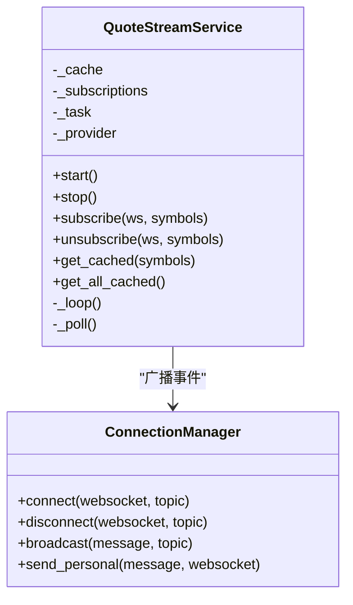
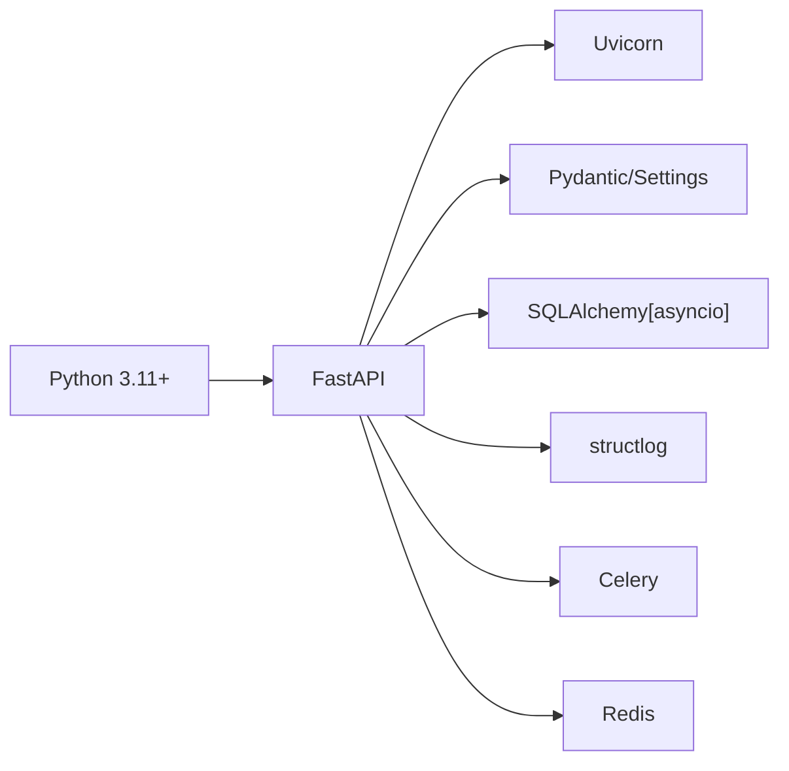

# 应用入口点

<cite>
**本文引用的文件**
- [main.py](file://backend/app/main.py)
- [config.py](file://backend/app/core/config.py)
- [router.py](file://backend/app/api/v1/router.py)
- [ws.py](file://backend/app/api/v1/ws.py)
- [quote_stream.py](file://backend/app/services/quote_stream.py)
- [errors.py](file://backend/app/core/errors.py)
- [logging.py](file://backend/app/core/logging.py)
- [websocket.py](file://backend/app/core/websocket.py)
- [auth.py](file://backend/app/api/v1/auth.py)
- [celery_app.py](file://backend/app/tasks/celery_app.py)
- [pyproject.toml](file://backend/pyproject.toml)
- [README.md](file://backend/README.md)
- [Dockerfile](file://backend/Dockerfile)
</cite>

## 目录
1. [简介](#简介)
2. [项目结构](#项目结构)
3. [核心组件](#核心组件)
4. [架构总览](#架构总览)
5. [详细组件分析](#详细组件分析)
6. [依赖关系分析](#依赖关系分析)
7. [性能考虑](#性能考虑)
8. [故障排查指南](#故障排查指南)
9. [结论](#结论)
10. [附录](#附录)

## 简介
本文件聚焦于 llmine-quant 后端应用的 FastAPI 入口点，系统性阐述应用初始化流程（生命周期管理）、健康检查端点、配置加载与环境变量管理、异常处理、中间件与路由装配、以及异步上下文管理器在启动/关闭阶段的资源管理策略。同时给出可操作的扩展建议与最佳实践，帮助开发者正确配置与增强入口点功能。

## 项目结构
后端入口位于 backend/app/main.py，围绕该文件展开的子系统包括：
- 配置模块：从环境变量与本地 CLI 配置自动加载并归一化参数
- 路由聚合：将各业务模块路由统一挂载到 API v1 前缀
- WebSocket：提供多主题事件流广播
- 实时行情服务：后台轮询市场数据并通过 WebSocket 广播
- 日志与追踪：结构化日志与请求追踪
- 异常处理：统一的自定义异常与通用异常响应

图表来源
- [main.py:1-65](file://backend/app/main.py#L1-L65)
- [config.py:1-196](file://backend/app/core/config.py#L1-L196)
- [router.py:1-40](file://backend/app/api/v1/router.py#L1-L40)
- [ws.py:1-50](file://backend/app/api/v1/ws.py#L1-L50)
- [quote_stream.py:1-152](file://backend/app/services/quote_stream.py#L1-L152)
- [errors.py:1-119](file://backend/app/core/errors.py#L1-L119)
- [logging.py:1-41](file://backend/app/core/logging.py#L1-L41)
- [websocket.py:1-45](file://backend/app/core/websocket.py#L1-L45)
- [auth.py:1-194](file://backend/app/api/v1/auth.py#L1-L194)
- [celery_app.py:1-42](file://backend/app/tasks/celery_app.py#L1-L42)

章节来源
- [main.py:1-65](file://backend/app/main.py#L1-L65)
- [config.py:1-196](file://backend/app/core/config.py#L1-L196)

## 核心组件
- FastAPI 应用实例与生命周期
  - 使用异步上下文管理器定义应用启动/关闭钩子，确保资源有序初始化与释放
  - 在启动时打印关键配置项用于可观测性，并启动实时行情服务；在关闭时停止行情服务
- 中间件与异常处理
  - 注入 CORS 中间件与 HTTP 层追踪中间件
  - 注册自定义异常处理器与通用异常处理器
- 路由装配
  - 将 API v1 聚合路由与 WebSocket 路由按前缀挂载
- 健康检查端点
  - 提供轻量级健康检查与版本号返回，便于探活与版本识别

章节来源
- [main.py:19-65](file://backend/app/main.py#L19-L65)

## 架构总览
下图展示了从 Uvicorn 启动到应用就绪的关键交互路径，涵盖配置加载、中间件注入、路由注册与资源启动。

图表来源
- [main.py:19-65](file://backend/app/main.py#L19-L65)
- [config.py:193-196](file://backend/app/core/config.py#L193-L196)
- [logging.py:11-35](file://backend/app/core/logging.py#L11-L35)
- [quote_stream.py:73-82](file://backend/app/services/quote_stream.py#L73-L82)

## 详细组件分析

### FastAPI 应用初始化与生命周期
- 异步上下文管理器 lifespan
  - 启动阶段：记录应用名称、版本、环境、LLM/行情提供商等关键配置；启动行情服务
  - 关闭阶段：停止行情服务并记录关闭日志
- 应用实例构造
  - 从配置读取标题、版本、OpenAPI 文档路径、文档页面路径
  - 通过 lifespan 参数注入生命周期钩子
- 中间件
  - CORS：允许跨域来源、凭证、方法与头
  - HTTP 追踪中间件：为请求链路提供追踪能力
- 异常处理
  - 自定义 LLMineException 及其子类映射到标准 HTTP 状态码
  - 通用异常处理器统一返回内部错误响应
- 路由装配
  - API v1 聚合路由按模块前缀挂载
  - WebSocket 路由按 /ws 前缀挂载
- 健康检查
  - GET /health 返回状态与版本信息

章节来源
- [main.py:19-65](file://backend/app/main.py#L19-L65)
- [errors.py:13-119](file://backend/app/core/errors.py#L13-L119)

### 配置加载与环境变量管理
- 配置来源与优先级
  - 默认值定义于 Settings 类字段
  - .env 文件覆盖默认值（env_file 指定）
  - 启动时自动检测 Claude/Codex 配置并填充空字段，显式环境变量优先
- 关键配置项
  - 应用元信息：应用名、版本、日志级别
  - 数据库与 Redis：连接字符串、回显开关
  - 安全：密钥、JWT 过期时间、算法
  - CORS：允许的源列表
  - API：v1 前缀、幂等性头部
  - 分页：默认与最大分页大小
  - 市场数据：提供商、轮询间隔、第三方令牌
  - LLM：提供商、超时、最大 token、Anthropic/OpenAI 凭证与模型、基础 URL、自动加载开关
  - LLM 源标识：记录从哪里填充了 LLM 配置
- SQLite 路径归一化
  - 对相对 SQLite 路径进行锚定，避免不同工作目录导致的路径不一致问题
- 设置对象生成与自动检测
  - settings 实例化后执行自动检测与数据库 URL 归一化

章节来源
- [config.py:48-108](file://backend/app/core/config.py#L48-L108)
- [config.py:110-172](file://backend/app/core/config.py#L110-L172)
- [config.py:177-196](file://backend/app/core/config.py#L177-L196)

### WebSocket 与实时行情服务
- WebSocket 管理器
  - 支持按主题订阅，维护连接列表，广播消息并清理断开连接
- 行情服务
  - 单例后台任务：仅对至少一个客户端订阅的标的发起拉取
  - 交易时段与非交易时段采用不同轮询间隔
  - 仅在价格变化时广播增量更新
  - 提供 REST 快照接口缓存访问能力
- 入口点集成
  - 在 lifespan 启动时启动行情服务，在关闭时停止

图表来源
- [websocket.py:10-45](file://backend/app/core/websocket.py#L10-L45)
- [quote_stream.py:62-152](file://backend/app/services/quote_stream.py#L62-L152)

章节来源
- [ws.py:12-50](file://backend/app/api/v1/ws.py#L12-L50)
- [quote_stream.py:1-152](file://backend/app/services/quote_stream.py#L1-L152)
- [websocket.py:1-45](file://backend/app/core/websocket.py#L1-L45)

### API 路由组织与示例
- 路由聚合
  - API v1 路由按模块前缀挂载，统一管理各领域接口
- 示例：认证路由
  - 登录、注册、刷新、注销与当前用户查询等典型接口
  - 依赖数据库会话与安全工具，结合配置中的过期时间等参数

章节来源
- [router.py:23-40](file://backend/app/api/v1/router.py#L23-L40)
- [auth.py:47-194](file://backend/app/api/v1/auth.py#L47-L194)

### 异常处理与日志
- 异常体系
  - 自定义 LLMineException 及其子类（未找到、请求错误、未授权、禁止、冲突、幂等等）
  - 统一异常处理器输出结构化错误响应，包含 trace_id、路径、方法等上下文
- 日志配置
  - 结构化日志处理器链：时间戳、堆栈渲染、JSON 渲染（生产）或控制台渲染（开发）
  - 根据环境变量动态选择日志级别

章节来源
- [errors.py:13-119](file://backend/app/core/errors.py#L13-L119)
- [logging.py:11-41](file://backend/app/core/logging.py#L11-L41)

### Celery 任务与后台作业
- Broker/Backend 来源：Redis（默认本地地址），可由配置覆盖
- 任务序列化：JSON
- 时区与 UTC：本地时区与 UTC 开关
- 任务策略：延迟确认、单 worker 最大任务数限制
- 定时任务：盘后纸交易批处理（周一至周五 15:30）

章节来源
- [celery_app.py:11-42](file://backend/app/tasks/celery_app.py#L11-L42)

## 依赖关系分析
- Python 版本与依赖
  - Python >= 3.11
  - FastAPI、Uvicorn、Pydantic/Settings、SQLAlchemy/Async、structlog、Celery、Redis 等
- 可选依赖
  - dev：测试与静态分析
  - llm：Anthropic、OpenAI
  - market-data：akshare、pandas
- 构建与运行
  - Dockerfile 基于 slim 镜像，安装系统依赖后以可编辑模式安装项目
  - CMD 中先执行数据库迁移再启动服务

图表来源
- [pyproject.toml:6-27](file://backend/pyproject.toml#L6-L27)
- [Dockerfile:1-25](file://backend/Dockerfile#L1-L25)

章节来源
- [pyproject.toml:1-78](file://backend/pyproject.toml#L1-L78)
- [Dockerfile:1-25](file://backend/Dockerfile#L1-L25)

## 性能考虑
- 行情轮询优化
  - 仅对已订阅标的发起拉取，避免全市场扫描
  - 交易时段与非交易时段采用不同轮询间隔，降低网络与计算开销
- WebSocket 广播
  - 仅在价格变化时发送增量更新，减少无效广播
- 日志与追踪
  - 生产环境使用 JSON 渲染，便于日志收集与检索
  - 追踪 ID 串联请求链路，辅助定位性能瓶颈
- 任务调度
  - Celery 任务延迟确认与最大任务数限制，平衡吞吐与稳定性

[本节为通用指导，无需特定文件引用]

## 故障排查指南
- 健康检查失败
  - 检查 /health 是否返回状态与版本信息
  - 若无响应，确认应用是否成功加载配置与中间件
- CORS 问题
  - 确认前端源在 CORS 允许列表中，且启用了凭据
- LLM/Provider 未生效
  - 检查环境变量是否覆盖默认值；若启用自动检测，确认 ~/.claude 或 ~/.codex 配置存在
- 行情不更新
  - 确认行情服务已启动（lifespan 启动日志）与订阅连接正常
  - 检查市场数据提供商配置与令牌
- 异常响应
  - 查看统一异常处理器返回的 trace_id，结合日志定位具体错误

章节来源
- [main.py:61-65](file://backend/app/main.py#L61-L65)
- [config.py:110-172](file://backend/app/core/config.py#L110-L172)
- [quote_stream.py:73-82](file://backend/app/services/quote_stream.py#L73-L82)
- [errors.py:73-119](file://backend/app/core/errors.py#L73-L119)

## 结论
本入口点通过清晰的生命周期管理、完善的配置加载与环境变量优先级、结构化的日志与追踪、以及可扩展的路由与异常处理机制，为 llmine-quant 后端提供了稳定可靠的启动与运行基座。实时行情服务与 WebSocket 广播进一步增强了系统的实时性与可观测性。建议在生产环境中严格管理环境变量与凭据，合理设置轮询间隔与日志级别，并通过健康检查与监控持续保障服务可用性。

[本节为总结性内容，无需特定文件引用]

## 附录

### 常用命令与环境变量
- 快速启动与迁移
  - 安装依赖、执行迁移、导入示例数据、启动 API 服务器
- 环境变量参考
  - DATABASE_URL、REDIS_URL、SECRET_KEY、ENV、LOG_LEVEL 等

章节来源
- [README.md:7-45](file://backend/README.md#L7-L45)

### 扩展建议
- 在 lifespan 中增加更多资源初始化（如指标采集、缓存预热）
- 为健康检查扩展更细粒度的子系统探测（数据库、Redis、LLM Provider）
- 在路由层增加速率限制与幂等性校验中间件
- 将 WebSocket 主题扩展为更细粒度的事件通道，支持订阅过滤

[本节为概念性建议，无需特定文件引用]