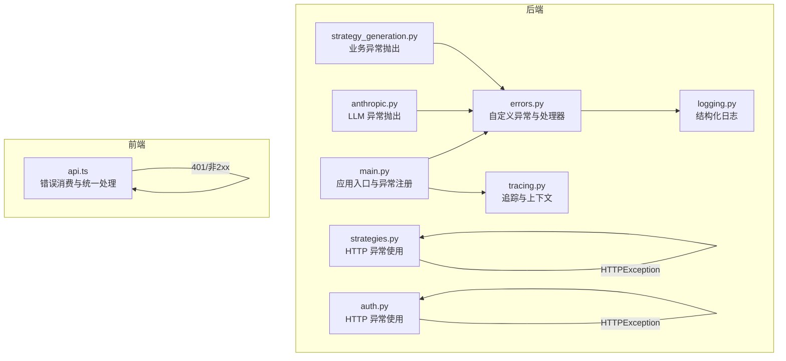
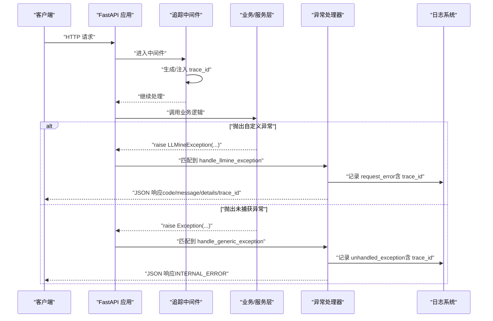
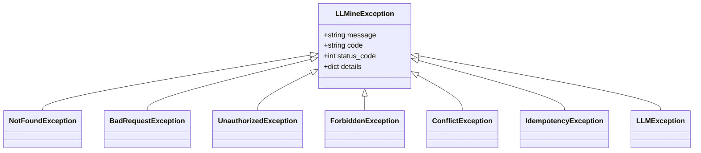
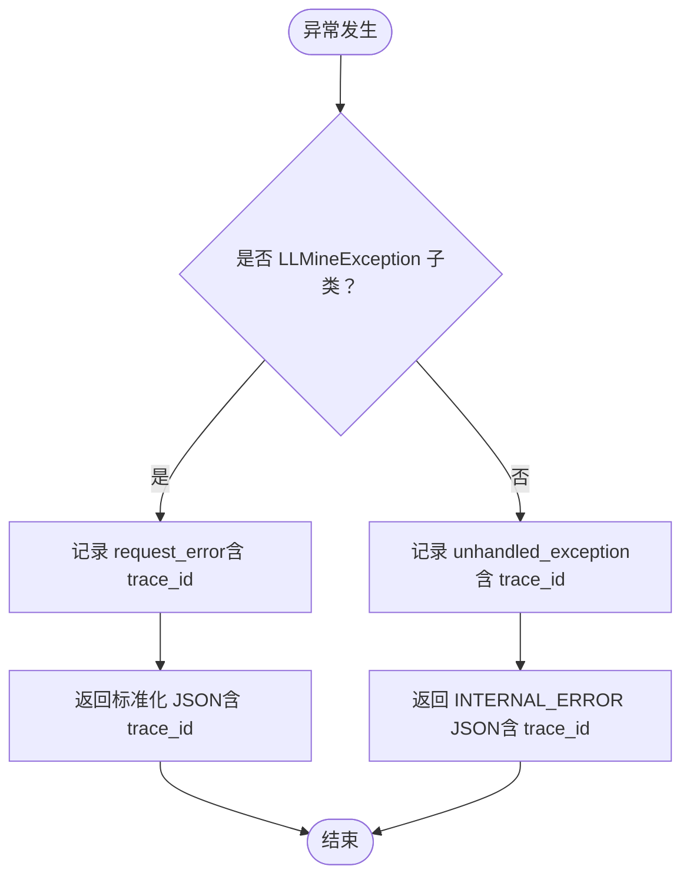
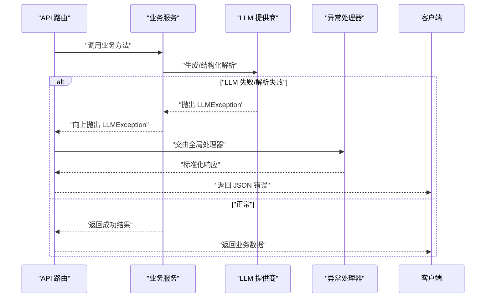
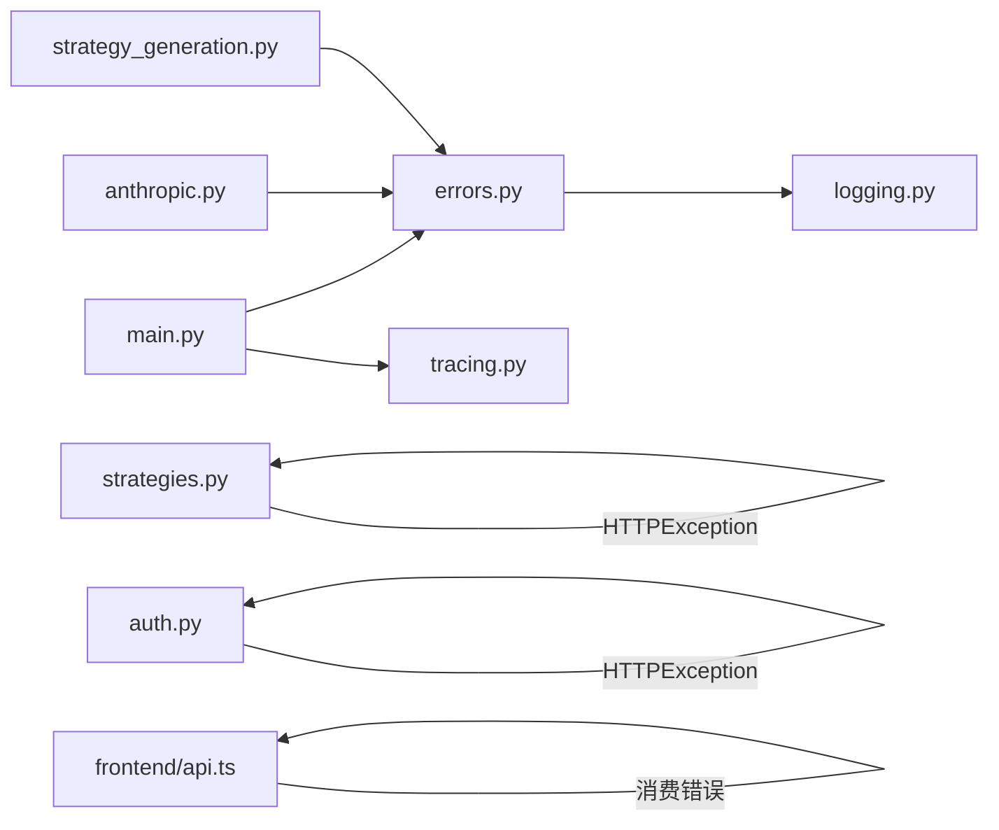

# 异常处理机制

<cite>
**本文引用的文件**
- [backend/app/core/errors.py](file://backend/app/core/errors.py)
- [backend/app/main.py](file://backend/app/main.py)
- [backend/app/core/logging.py](file://backend/app/core/logging.py)
- [backend/app/core/tracing.py](file://backend/app/core/tracing.py)
- [backend/app/integrations/llm/anthropic.py](file://backend/app/integrations/llm/anthropic.py)
- [backend/app/services/strategy_generation.py](file://backend/app/services/strategy_generation.py)
- [backend/app/api/v1/strategies.py](file://backend/app/api/v1/strategies.py)
- [backend/app/api/v1/auth.py](file://backend/app/api/v1/auth.py)
- [frontend/src/lib/api.ts](file://frontend/src/lib/api.ts)
- [backend/tests/services/test_strategy_generation_research.py](file://backend/tests/services/test_strategy_generation_research.py)
</cite>

## 目录
1. [简介](#简介)
2. [项目结构](#项目结构)
3. [核心组件](#核心组件)
4. [架构总览](#架构总览)
5. [详细组件分析](#详细组件分析)
6. [依赖关系分析](#依赖关系分析)
7. [性能考量](#性能考量)
8. [故障排查指南](#故障排查指南)
9. [结论](#结论)
10. [附录](#附录)

## 简介
本文件系统性梳理 llmine-quant 的异常处理机制，覆盖自定义异常类体系、全局异常处理器、HTTP 状态码映射、错误响应格式标准化、日志记录策略、异常传播与恢复、调试信息提供、最佳实践与扩展方法。目标是帮助开发者在不深入源码的情况下也能理解并正确使用异常处理流程。

## 项目结构
异常处理相关代码主要分布在以下位置：
- 核心异常与处理器：backend/app/core/errors.py
- 应用入口与异常注册：backend/app/main.py
- 日志与追踪：backend/app/core/logging.py、backend/app/core/tracing.py
- LLM 集成与业务服务中的异常抛出：backend/app/integrations/llm/anthropic.py、backend/app/services/strategy_generation.py
- API 层对标准 HTTP 异常的使用：backend/app/api/v1/strategies.py、backend/app/api/v1/auth.py
- 前端错误消费与统一处理：frontend/src/lib/api.ts
- 测试中对 LLM 异常的断言：backend/tests/services/test_strategy_generation_research.py

图表来源
- [backend/app/core/errors.py:1-119](file://backend/app/core/errors.py#L1-L119)
- [backend/app/main.py:1-65](file://backend/app/main.py#L1-L65)
- [backend/app/core/logging.py:1-41](file://backend/app/core/logging.py#L1-L41)
- [backend/app/core/tracing.py:1-87](file://backend/app/core/tracing.py#L1-L87)
- [backend/app/integrations/llm/anthropic.py:1-150](file://backend/app/integrations/llm/anthropic.py#L1-L150)
- [backend/app/services/strategy_generation.py:1-584](file://backend/app/services/strategy_generation.py#L1-L584)
- [backend/app/api/v1/strategies.py:1-605](file://backend/app/api/v1/strategies.py#L1-L605)
- [backend/app/api/v1/auth.py:1-194](file://backend/app/api/v1/auth.py#L1-L194)
- [frontend/src/lib/api.ts:1-83](file://frontend/src/lib/api.ts#L1-L83)

章节来源
- [backend/app/core/errors.py:1-119](file://backend/app/core/errors.py#L1-L119)
- [backend/app/main.py:1-65](file://backend/app/main.py#L1-L65)

## 核心组件
- 自定义异常基类与派生类型
  - 基类：LLMineException，统一承载 message、code、status_code、details 字段
  - 典型派生：NotFoundException、BadRequestException、UnauthorizedException、ForbiddenException、ConflictException、IdempotencyException、LLMException
- 全局异常处理器
  - handle_llmine_exception：处理 LLMineException 及其子类，标准化响应结构并写入日志
  - handle_generic_exception：兜底处理未捕获异常，返回统一内部错误响应
- 追踪与日志
  - tracing.py：注入/提取 trace_id，贯穿请求生命周期并在中间件中设置 X-Trace-ID 响应头
  - logging.py：结构化日志配置，支持生产环境 JSON 输出与开发环境控制台渲染
- 应用入口注册
  - main.py：注册异常处理器、中间件、路由

章节来源
- [backend/app/core/errors.py:13-71](file://backend/app/core/errors.py#L13-L71)
- [backend/app/core/errors.py:73-118](file://backend/app/core/errors.py#L73-L118)
- [backend/app/core/tracing.py:13-86](file://backend/app/core/tracing.py#L13-L86)
- [backend/app/core/logging.py:11-41](file://backend/app/core/logging.py#L11-L41)
- [backend/app/main.py:39-58](file://backend/app/main.py#L39-L58)

## 架构总览
异常处理在请求生命周期中的流转如下：

图表来源
- [backend/app/main.py:52-54](file://backend/app/main.py#L52-L54)
- [backend/app/core/errors.py:73-118](file://backend/app/core/errors.py#L73-L118)
- [backend/app/core/tracing.py:49-86](file://backend/app/core/tracing.py#L49-L86)

## 详细组件分析

### 自定义异常类体系
- 设计要点
  - 统一字段：message（人类可读）、code（机器可读错误码）、status_code（HTTP 状态码）、details（结构化细节）
  - 派生类按语义与 HTTP 状态码绑定，便于快速识别错误类型
- 关键类型
  - LLMineException：所有自定义异常的根
  - LLMException：LLM 提供商侧错误（如网络、解析、配置问题），映射为 502
  - 其他常见类型：400、401、403、404、409、冲突/幂等性等

图表来源
- [backend/app/core/errors.py:13-71](file://backend/app/core/errors.py#L13-L71)

章节来源
- [backend/app/core/errors.py:13-71](file://backend/app/core/errors.py#L13-L71)

### 全局异常处理器
- handle_llmine_exception
  - 行为：记录 request_error；返回包含 code、message、details、trace_id 的 JSON；状态码来自异常对象
  - 用途：统一对外错误响应格式，便于前端与监控系统解析
- handle_generic_exception
  - 行为：记录 unhandled_exception；返回 INTERNAL_ERROR；状态码固定为 500
  - 用途：兜底，确保不会向客户端暴露内部细节

图表来源
- [backend/app/core/errors.py:73-118](file://backend/app/core/errors.py#L73-L118)

章节来源
- [backend/app/core/errors.py:73-118](file://backend/app/core/errors.py#L73-L118)

### HTTP 状态码映射与错误响应格式
- 映射规则
  - 400：BadRequestException
  - 401：UnauthorizedException
  - 403：ForbiddenException
  - 404：NotFoundException
  - 409：ConflictException、IdempotencyException
  - 502：LLMException（LLM 提供商侧错误）
  - 500：未捕获异常（handle_generic_exception）
- 错误响应格式
  - 字段：code、message、details、trace_id
  - 说明：code 用于程序化判断；message 用于用户提示；details 承载结构化上下文；trace_id 用于跨系统关联定位

章节来源
- [backend/app/core/errors.py:24-70](file://backend/app/core/errors.py#L24-L70)
- [backend/app/core/errors.py:87-95](file://backend/app/core/errors.py#L87-L95)
- [backend/app/core/errors.py:110-118](file://backend/app/core/errors.py#L110-L118)

### 日志记录策略
- 结构化日志
  - logging.py：根据环境选择 JSON 或 Console 渲染；统一时间戳、级别、堆栈、异常信息
- 异常日志
  - handle_llmine_exception：记录 request_error，包含 code、message、status_code、trace_id、路径、方法
  - handle_generic_exception：记录 unhandled_exception，包含 trace_id、路径、方法、错误字符串
- 追踪上下文
  - tracing.py：中间件注入 trace_id，响应头携带 X-Trace-ID，便于链路追踪

章节来源
- [backend/app/core/logging.py:11-41](file://backend/app/core/logging.py#L11-L41)
- [backend/app/core/errors.py:78-86](file://backend/app/core/errors.py#L78-L86)
- [backend/app/core/errors.py:103-109](file://backend/app/core/errors.py#L103-L109)
- [backend/app/core/tracing.py:49-86](file://backend/app/core/tracing.py#L49-L86)

### 异常传播机制与业务使用
- LLM 集成层
  - anthropic.py：SDK 缺失、认证缺失、API 调用失败、解析非 JSON 等场景抛出 LLMException
- 业务服务层
  - strategy_generation.py：参数校验失败、回测数据错误、风险超限、代码/DSL 校验失败等抛出 LLMException
- API 层
  - strategies.py、auth.py：对资源不存在、权限不足等使用 HTTPException（FastAPI 内置），由框架自动映射状态码

图表来源
- [backend/app/integrations/llm/anthropic.py:43-150](file://backend/app/integrations/llm/anthropic.py#L43-L150)
- [backend/app/services/strategy_generation.py:445-514](file://backend/app/services/strategy_generation.py#L445-L514)
- [backend/app/api/v1/strategies.py:301-334](file://backend/app/api/v1/strategies.py#L301-L334)
- [backend/app/api/v1/auth.py:47-89](file://backend/app/api/v1/auth.py#L47-L89)

章节来源
- [backend/app/integrations/llm/anthropic.py:43-150](file://backend/app/integrations/llm/anthropic.py#L43-L150)
- [backend/app/services/strategy_generation.py:445-514](file://backend/app/services/strategy_generation.py#L445-L514)
- [backend/app/api/v1/strategies.py:301-334](file://backend/app/api/v1/strategies.py#L301-L334)
- [backend/app/api/v1/auth.py:47-89](file://backend/app/api/v1/auth.py#L47-L89)

### 错误恢复策略与调试信息
- 错误恢复
  - 对外：统一错误响应，避免泄露内部实现细节
  - 对内：记录 trace_id，结合日志与追踪进行定位
- 调试信息
  - trace_id：贯穿请求全链路，便于跨服务关联
  - details：承载上下文（如 provider、model、raw 截断等），辅助诊断
  - 前端：401 时清理本地 token 并触发登出事件，保证会话一致性

章节来源
- [backend/app/core/errors.py:87-95](file://backend/app/core/errors.py#L87-L95)
- [backend/app/core/errors.py:110-118](file://backend/app/core/errors.py#L110-L118)
- [backend/app/core/tracing.py:56-76](file://backend/app/core/tracing.py#L56-L76)
- [frontend/src/lib/api.ts:27-30](file://frontend/src/lib/api.ts#L27-L30)

## 依赖关系分析
- 组件耦合
  - main.py 仅依赖 errors.py 中的异常类与处理器函数，耦合度低
  - tracing.py 与 logging.py 分别独立负责追踪与日志，通过 get_logger/get_trace_id 协作
  - 业务层通过导入 LLMException 抛出领域错误，不直接依赖处理器
- 外部依赖
  - FastAPI：异常处理器注册、中间件、HTTPException
  - structlog：结构化日志渲染

图表来源
- [backend/app/main.py:52-54](file://backend/app/main.py#L52-L54)
- [backend/app/core/errors.py:1-119](file://backend/app/core/errors.py#L1-L119)
- [backend/app/core/tracing.py:1-87](file://backend/app/core/tracing.py#L1-L87)
- [backend/app/core/logging.py:1-41](file://backend/app/core/logging.py#L1-L41)
- [backend/app/integrations/llm/anthropic.py:15](file://backend/app/integrations/llm/anthropic.py#L15)
- [backend/app/services/strategy_generation.py:12](file://backend/app/services/strategy_generation.py#L12)
- [backend/app/api/v1/strategies.py:8](file://backend/app/api/v1/strategies.py#L8)
- [backend/app/api/v1/auth.py:7](file://backend/app/api/v1/auth.py#L7)
- [frontend/src/lib/api.ts:32-42](file://frontend/src/lib/api.ts#L32-L42)

章节来源
- [backend/app/main.py:52-54](file://backend/app/main.py#L52-L54)
- [backend/app/core/errors.py:1-119](file://backend/app/core/errors.py#L1-L119)

## 性能考量
- 异常路径的开销
  - JSONResponse 序列化与日志输出在异常路径上不可避免，但仅在异常发生时触发
  - 建议避免在高频路径中频繁抛出异常；将“预期错误”转为显式状态返回（如业务层返回 False/None 并记录日志）
- 日志渲染
  - 生产环境采用 JSON 渲染，利于日志收集与检索；开发环境采用 Console 渲染，便于本地调试
- 追踪成本
  - trace_id 注入/提取为常量时间操作；建议在高并发场景下保持默认生成策略，避免重复注入

## 故障排查指南
- 如何获取 trace_id
  - 请求头：X-Trace-ID（若客户端未提供则由中间件生成）
  - 响应头：X-Trace-ID（始终返回）
  - 响应体：trace_id 字段（异常响应中包含）
- 常见排查步骤
  - 客户端：检查 401 时是否触发登出流程（前端已内置）
  - 后端：查看日志中 request_error/unhandled_exception 的 trace_id，定位具体请求
  - LLM：关注 LLMException 的 details（provider/model/raw 截断等），确认供应商侧问题
- 测试验证
  - 使用测试用例断言 LLMException 的抛出与消息匹配，确保异常路径覆盖完整

章节来源
- [backend/app/core/tracing.py:56-76](file://backend/app/core/tracing.py#L56-L76)
- [backend/app/core/errors.py:87-95](file://backend/app/core/errors.py#L87-L95)
- [backend/app/core/errors.py:103-109](file://backend/app/core/errors.py#L103-L109)
- [frontend/src/lib/api.ts:27-30](file://frontend/src/lib/api.ts#L27-L30)
- [backend/tests/services/test_strategy_generation_research.py:29-50](file://backend/tests/services/test_strategy_generation_research.py#L29-L50)

## 结论
llmine-quant 的异常处理机制以 LLMineException 为核心，配合统一的异常处理器与追踪/日志基础设施，实现了：
- 明确的错误语义与 HTTP 状态码映射
- 标准化的错误响应格式与 trace_id 支持
- 可观测性的日志记录与链路追踪
- 在 LLM 与业务层的清晰异常边界
建议在新增异常类型时遵循现有模式，保持 code/message/status_code/trace_id 的一致性，并在业务层优先使用 LLMException 表达领域错误，以便统一治理与监控。

## 附录
- 最佳实践
  - 为每个新领域错误定义专用异常类型，明确 status_code 与 code
  - 在异常 details 中补充关键上下文（如 provider、model、字段名等）
  - 将“可预期”的错误路径从异常改为返回值/状态码，减少异常开销
  - 前端统一处理 401 与非 2xx 响应，保证用户体验与会话安全
- 扩展方法
  - 新增异常类型：继承 LLMineException，设置合适的 code 与 status_code
  - 新增异常处理器：在 main.py 中注册新的异常类型与处理器函数
  - 新增日志字段：在 errors.py 的日志记录处增加结构化字段，便于检索