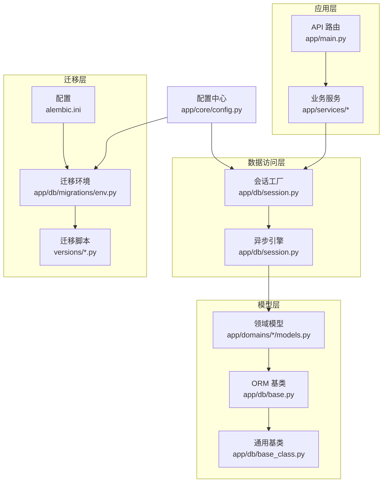
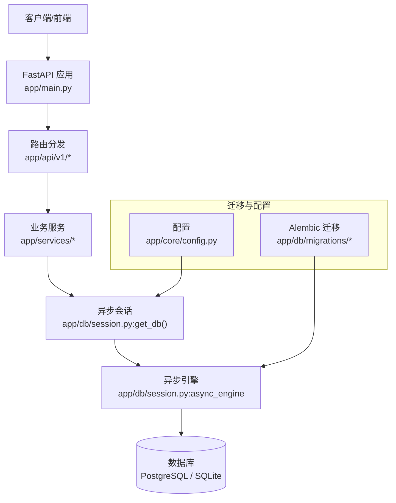
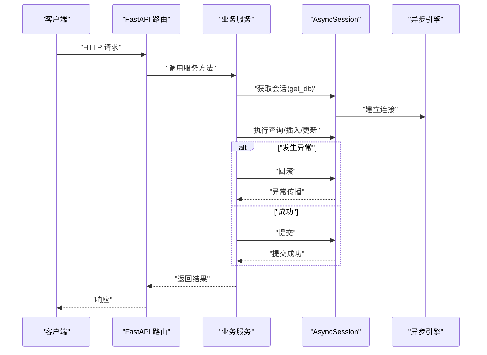
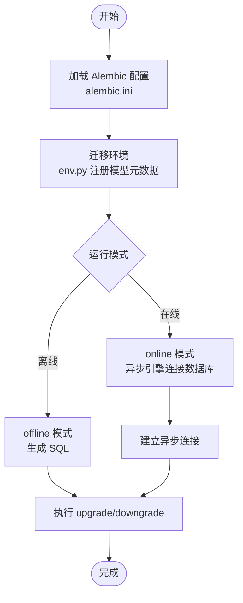
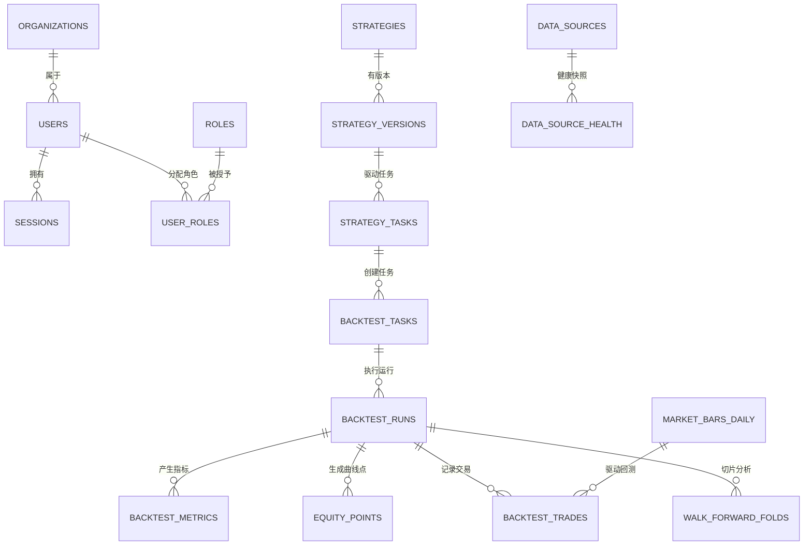
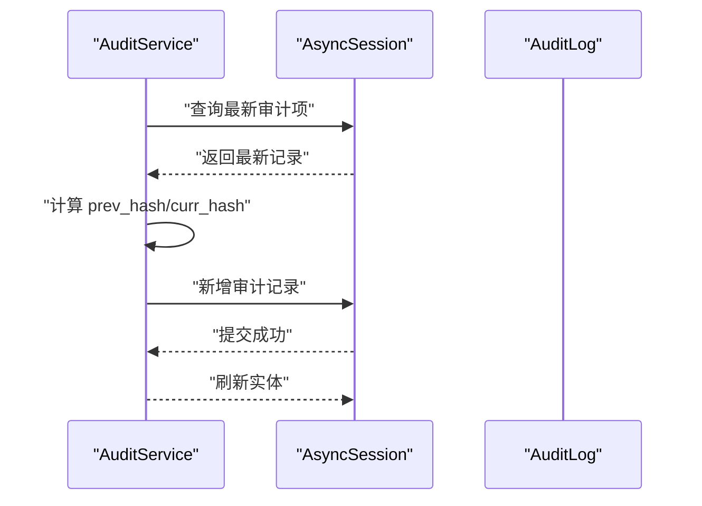
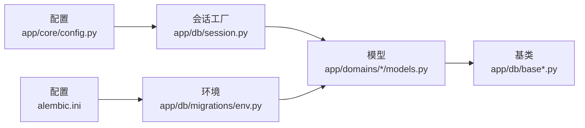

# 数据库集成

<cite>
**本文引用的文件**
- [backend/app/db/base.py](file://backend/app/db/base.py)
- [backend/app/db/base_class.py](file://backend/app/db/base_class.py)
- [backend/app/db/session.py](file://backend/app/db/session.py)
- [backend/app/core/config.py](file://backend/app/core/config.py)
- [backend/alembic.ini](file://backend/alembic.ini)
- [backend/app/db/migrations/env.py](file://backend/app/db/migrations/env.py)
- [backend/app/db/migrations/versions/20260510_000001_init_identity_and_audit.py](file://backend/app/db/migrations/versions/20260510_000001_init_identity_and_audit.py)
- [backend/app/db/migrations/versions/20260512_000004_backtest_results.py](file://backend/app/db/migrations/versions/20260512_000004_backtest_results.py)
- [backend/app/domains/identity/models.py](file://backend/app/domains/identity/models.py)
- [backend/app/domains/strategy/models.py](file://backend/app/domains/strategy/models.py)
- [backend/app/domains/backtest/models.py](file://backend/app/domains/backtest/models.py)
- [backend/app/domains/data/models.py](file://backend/app/domains/data/models.py)
- [backend/app/services/audit_service.py](file://backend/app/services/audit_service.py)
- [backend/app/services/daily_backtest.py](file://backend/app/services/daily_backtest.py)
- [backend/app/main.py](file://backend/app/main.py)
</cite>

## 目录
1. [简介](#简介)
2. [项目结构](#项目结构)
3. [核心组件](#核心组件)
4. [架构总览](#架构总览)
5. [详细组件分析](#详细组件分析)
6. [依赖分析](#依赖分析)
7. [性能考虑](#性能考虑)
8. [故障排查指南](#故障排查指南)
9. [结论](#结论)
10. [附录](#附录)

## 简介
本文件面向 llmine-quant 的数据库集成，系统性阐述基于 SQLAlchemy 的异步 ORM 配置、会话与连接管理、事务处理策略；详述 Alembic 迁移体系（迁移脚本生成、版本管理、升级降级）；总结数据库模型设计原则、关系映射与索引策略；并提供性能优化、备份恢复与监控告警的运维实践建议。文档兼顾工程落地与可读性，既适合开发者深入理解实现细节，也便于运维人员快速上手。

## 项目结构
数据库相关代码主要分布在以下位置：
- ORM 基类与会话：backend/app/db
- 领域模型：backend/app/domains/*/models.py
- 迁移配置与环境：backend/app/db/migrations/* 与 backend/alembic.ini
- 应用配置：backend/app/core/config.py
- 服务层数据库使用示例：backend/app/services/*

图表来源
- [backend/app/db/session.py:1-34](file://backend/app/db/session.py#L1-L34)
- [backend/app/db/base.py:1-10](file://backend/app/db/base.py#L1-L10)
- [backend/app/db/base_class.py:1-31](file://backend/app/db/base_class.py#L1-L31)
- [backend/app/db/migrations/env.py:1-113](file://backend/app/db/migrations/env.py#L1-L113)
- [backend/alembic.ini:1-111](file://backend/alembic.ini#L1-L111)
- [backend/app/core/config.py:1-196](file://backend/app/core/config.py#L1-L196)
- [backend/app/main.py:1-65](file://backend/app/main.py#L1-L65)

章节来源
- [backend/app/db/session.py:1-34](file://backend/app/db/session.py#L1-L34)
- [backend/app/db/base.py:1-10](file://backend/app/db/base.py#L1-L10)
- [backend/app/db/base_class.py:1-31](file://backend/app/db/base_class.py#L1-L31)
- [backend/app/db/migrations/env.py:1-113](file://backend/app/db/migrations/env.py#L1-L113)
- [backend/alembic.ini:1-111](file://backend/alembic.ini#L1-L111)
- [backend/app/core/config.py:1-196](file://backend/app/core/config.py#L1-L196)
- [backend/app/main.py:1-65](file://backend/app/main.py#L1-L65)

## 核心组件
- ORM 基类与通用模型字段
  - 基类：统一的 DeclarativeBase 子类，作为所有模型的元数据根。
  - 通用基类：提供审计字段（如 id、org_id、created_at、updated_at、trace_id、metadata_json、deleted_at）与默认值，确保跨域模型的一致性与可审计性。
- 异步会话与连接管理
  - 使用 asyncpg 驱动创建异步引擎，支持 SQLite（通过 aiosqlite）与 PostgreSQL。
  - 通过 async_sessionmaker 构建 AsyncSession 工厂，关闭过期对象、禁用自动 flush，保证事务边界清晰。
  - 提供依赖注入式 get_db，自动回滚异常并关闭会话，避免资源泄漏。
- 配置中心
  - 从环境变量读取数据库 URL 与日志开关，支持 SQLite 绝对路径规范化，避免不同工作目录导致的路径不一致问题。
- 迁移系统
  - Alembic 配置指向 app/db/migrations，环境脚本动态注册所有模型元数据，支持在线/离线迁移。
  - 迁移脚本按时间戳前缀组织，包含升级与降级步骤，确保可逆演。

章节来源
- [backend/app/db/base.py:1-10](file://backend/app/db/base.py#L1-L10)
- [backend/app/db/base_class.py:1-31](file://backend/app/db/base_class.py#L1-L31)
- [backend/app/db/session.py:1-34](file://backend/app/db/session.py#L1-L34)
- [backend/app/core/config.py:57-60](file://backend/app/core/config.py#L57-L60)
- [backend/app/db/migrations/env.py:1-113](file://backend/app/db/migrations/env.py#L1-L113)
- [backend/alembic.ini:1-111](file://backend/alembic.ini#L1-L111)

## 架构总览
下图展示数据库集成在系统中的位置与交互：

图表来源
- [backend/app/main.py:1-65](file://backend/app/main.py#L1-L65)
- [backend/app/db/session.py:1-34](file://backend/app/db/session.py#L1-L34)
- [backend/app/db/migrations/env.py:1-113](file://backend/app/db/migrations/env.py#L1-L113)
- [backend/app/core/config.py:1-196](file://backend/app/core/config.py#L1-L196)

## 详细组件分析

### ORM 配置与会话管理
- 设计要点
  - 异步引擎：使用 asyncpg 驱动，SQLite 场景启用多线程兼容参数。
  - 会话工厂：禁用 expire_on_commit 与 autoflush，减少隐式变更带来的副作用；通过上下文管理器确保异常时回滚与关闭。
  - 依赖注入：get_db 作为 FastAPI 依赖，自动处理事务生命周期。
- 事务处理
  - 服务层在执行复杂流程（如回测任务）时，先持久化任务与运行记录，再写入指标与交易明细，最后统一提交；失败时回滚并更新状态。
- 错误处理
  - 会话层捕获异常并回滚，避免脏状态；服务层根据业务语义设置任务/运行状态并抛出异常，便于上层统一处理。

图表来源
- [backend/app/db/session.py:24-34](file://backend/app/db/session.py#L24-L34)
- [backend/app/services/daily_backtest.py:285-372](file://backend/app/services/daily_backtest.py#L285-L372)

章节来源
- [backend/app/db/session.py:1-34](file://backend/app/db/session.py#L1-L34)
- [backend/app/services/daily_backtest.py:285-372](file://backend/app/services/daily_backtest.py#L285-L372)

### Alembic 迁移系统
- 配置与环境
  - alembic.ini 指定迁移脚本目录与日志级别；env.py 动态注册所有模型元数据，并覆盖 sqlalchemy.url 为 settings 中的数据库地址。
  - 支持离线与在线两种模式：离线直接生成 SQL；在线通过异步引擎连接数据库执行迁移。
- 迁移脚本
  - 版本脚本采用日期时间前缀，清晰表达演进顺序；每个脚本包含 upgrade 与 downgrade，确保可逆演。
  - 示例：初始化身份与审计表、回测结果表族等。
- 版本管理
  - 通过 down_revision 明确依赖关系；支持多版本目录与分隔符配置。

图表来源
- [backend/alembic.ini:1-111](file://backend/alembic.ini#L1-L111)
- [backend/app/db/migrations/env.py:1-113](file://backend/app/db/migrations/env.py#L1-L113)
- [backend/app/db/migrations/versions/20260510_000001_init_identity_and_audit.py:1-180](file://backend/app/db/migrations/versions/20260510_000001_init_identity_and_audit.py#L1-L180)
- [backend/app/db/migrations/versions/20260512_000004_backtest_results.py:1-132](file://backend/app/db/migrations/versions/20260512_000004_backtest_results.py#L1-L132)

章节来源
- [backend/alembic.ini:1-111](file://backend/alembic.ini#L1-L111)
- [backend/app/db/migrations/env.py:1-113](file://backend/app/db/migrations/env.py#L1-L113)
- [backend/app/db/migrations/versions/20260510_000001_init_identity_and_audit.py:1-180](file://backend/app/db/migrations/versions/20260510_000001_init_identity_and_audit.py#L1-L180)
- [backend/app/db/migrations/versions/20260512_000004_backtest_results.py:1-132](file://backend/app/db/migrations/versions/20260512_000004_backtest_results.py#L1-L132)

### 数据库模型设计原则与关系映射
- 设计原则
  - 统一审计字段：所有模型继承自通用基类，具备 org_id、trace_id、metadata_json、deleted_at 等字段，便于多租户与审计追踪。
  - 字段类型与约束：使用 String、Integer、Float、Boolean、Text、UniqueConstraint 等，结合索引提升查询效率。
  - JSON 字段：metadata_json、dependencies_json 等用于存储半结构化数据，便于扩展。
- 关系映射
  - 多表关联：如 BacktestRun 与 BacktestTask 一对多；BacktestMetric 与 BacktestRun 多对一；MarketBarDaily 与回测结果通过 run_id 关联。
  - 复合唯一键：如市场日线表的 symbol+trade_date 复合唯一，避免重复数据。
- 典型模型
  - 身份域：Organization、User、Role、UserRole、Session。
  - 策略域：Strategy、StrategyVersion、StrategyTask、PipelineEvent、StrategyTemplate。
  - 回测域：BacktestTask、BacktestRun、BacktestMetric、EquityPoint、SensitivityRun、WalkForwardFold、BacktestTrade、StressResult。
  - 数据域：DataSource、DataSourceHealth、MarketBarDaily、CorporateAction、FeatureSet、FeatureUsage、LineageNode、LineageEdge、DataIncident。

图表来源
- [backend/app/domains/identity/models.py:1-60](file://backend/app/domains/identity/models.py#L1-L60)
- [backend/app/domains/strategy/models.py:1-84](file://backend/app/domains/strategy/models.py#L1-L84)
- [backend/app/domains/backtest/models.py:1-155](file://backend/app/domains/backtest/models.py#L1-L155)
- [backend/app/domains/data/models.py:1-144](file://backend/app/domains/data/models.py#L1-L144)

章节来源
- [backend/app/domains/identity/models.py:1-60](file://backend/app/domains/identity/models.py#L1-L60)
- [backend/app/domains/strategy/models.py:1-84](file://backend/app/domains/strategy/models.py#L1-L84)
- [backend/app/domains/backtest/models.py:1-155](file://backend/app/domains/backtest/models.py#L1-L155)
- [backend/app/domains/data/models.py:1-144](file://backend/app/domains/data/models.py#L1-L144)

### 索引策略
- 常见索引
  - 审计字段：org_id、created_at、updated_at 等常用过滤与排序字段建立索引。
  - 关联键：外键字段（如 strategy_version_id、task_id、run_id、user_id、role_id 等）建立索引，加速 JOIN 与过滤。
  - 高选择性字段：email、token_hash、key 等唯一字段建立唯一索引或唯一约束。
  - 时间序列：trade_date、phase 等用于回测与分析的字段建立复合索引或单列索引。
- 复合唯一键
  - 市场日线表：symbol+trade_date 复合唯一，避免重复数据。
- 建议
  - 对高频查询字段持续评估索引收益与写入成本；定期分析慢查询日志，针对性补充索引。

章节来源
- [backend/app/domains/identity/models.py:24-59](file://backend/app/domains/identity/models.py#L24-L59)
- [backend/app/domains/backtest/models.py:44-118](file://backend/app/domains/backtest/models.py#L44-L118)
- [backend/app/domains/data/models.py:44-66](file://backend/app/domains/data/models.py#L44-L66)

### 服务层数据库使用示例
- 审计服务
  - 通过 AsyncSession 执行查询与插入，计算哈希链形成不可篡改的审计轨迹；提供链式校验能力。
- 日内回测引擎
  - 将任务、运行、指标、等值曲线点、交易明细与折返分析等批量持久化，统一提交；失败时回滚并更新状态。
- 查询模式
  - 使用 select + where + order_by 实现条件过滤与排序；对大表进行分页或限制返回数量，避免内存压力。

图表来源
- [backend/app/services/audit_service.py:32-109](file://backend/app/services/audit_service.py#L32-L109)

章节来源
- [backend/app/services/audit_service.py:1-109](file://backend/app/services/audit_service.py#L1-L109)
- [backend/app/services/daily_backtest.py:285-372](file://backend/app/services/daily_backtest.py#L285-L372)

## 依赖分析
- 组件耦合
  - 服务层仅依赖 AsyncSession 接口，不直接依赖具体数据库驱动，降低耦合度。
  - 模型层依赖 ORM 基类与通用字段，保持一致性；迁移环境集中注册模型元数据，避免遗漏。
- 外部依赖
  - SQLAlchemy 异步 ORM 与 Alembic 迁移工具；PostgreSQL/SQLite 驱动；FastAPI 生命周期管理。
- 循环依赖
  - 迁移环境显式导入各域模型，但未形成循环；会话工厂与配置中心相互独立。

图表来源
- [backend/app/core/config.py:1-196](file://backend/app/core/config.py#L1-L196)
- [backend/app/db/session.py:1-34](file://backend/app/db/session.py#L1-L34)
- [backend/app/db/base.py:1-10](file://backend/app/db/base.py#L1-L10)
- [backend/app/db/base_class.py:1-31](file://backend/app/db/base_class.py#L1-L31)
- [backend/alembic.ini:1-111](file://backend/alembic.ini#L1-L111)
- [backend/app/db/migrations/env.py:1-113](file://backend/app/db/migrations/env.py#L1-L113)

章节来源
- [backend/app/core/config.py:1-196](file://backend/app/core/config.py#L1-L196)
- [backend/app/db/session.py:1-34](file://backend/app/db/session.py#L1-L34)
- [backend/app/db/migrations/env.py:1-113](file://backend/app/db/migrations/env.py#L1-L113)

## 性能考虑
- 连接与会话
  - 使用异步引擎与会话工厂，避免阻塞；合理设置超时与并发上限，避免连接池耗尽。
  - 在高频写入场景中，批量提交（flush/commit）减少往返次数。
- 查询优化
  - 为高频过滤与排序字段建立索引；避免 SELECT *，仅取必要字段。
  - 对时间序列数据（如回测指标、等值曲线点）按日期范围分页查询。
- 写入策略
  - 批量插入/更新，减少事务次数；对长文本字段（JSON）控制长度，避免过大行影响 IO。
- 缓存与归档
  - 对历史静态数据（如市场日线）考虑归档策略；对热点查询结果引入缓存层（Redis 可复用项目已有配置）。
- 监控与诊断
  - 启用数据库日志（settings.database_echo），定位慢查询；结合 APM 与数据库性能视图分析瓶颈。

## 故障排查指南
- 迁移失败
  - 确认 alembic.ini 中 script_location 与 env.py 中的 Base.metadata 是否匹配。
  - 在线迁移时检查数据库连接字符串与权限；离线模式用于预检 SQL。
- 会话异常
  - 若出现“会话已关闭”或“事务未提交”，检查服务层是否在异常分支正确回滚并重新抛出。
  - 确保 get_db 依赖在请求范围内使用，避免跨请求复用会话。
- 数据重复或缺失
  - 检查唯一约束（如 market_bars_daily 的复合唯一）与索引是否生效。
  - 对批量导入场景，先验证数据完整性，再执行写入。
- 审计链校验
  - 使用 AuditService.verify_chain 校验最近 N 条记录的哈希链一致性，定位篡改风险。

章节来源
- [backend/app/db/migrations/env.py:1-113](file://backend/app/db/migrations/env.py#L1-L113)
- [backend/app/db/session.py:24-34](file://backend/app/db/session.py#L24-L34)
- [backend/app/domains/data/models.py:44-66](file://backend/app/domains/data/models.py#L44-L66)
- [backend/app/services/audit_service.py:83-109](file://backend/app/services/audit_service.py#L83-L109)

## 结论
本项目采用 SQLAlchemy 异步 ORM 与 Alembic 迁移，结合统一的模型基类与严格的索引策略，实现了可维护、可观测、可扩展的数据层。通过服务层的事务封装与错误处理，保障了业务流程的可靠性。建议在生产环境中进一步完善连接池参数、慢查询监控与备份恢复方案，持续优化查询与写入性能。

## 附录
- 运维最佳实践
  - 备份：定期导出数据库（PostgreSQL 可使用逻辑备份），保留多个版本；对 SQLite 文件进行文件级备份。
  - 恢复：制定演练计划，验证备份可用性与恢复时间目标（RTO/RPO）。
  - 监控：开启数据库慢查询日志与连接数监控，设置阈值告警；结合应用日志与数据库性能视图定位问题。
  - 安全：最小权限原则；敏感字段加密存储；审计日志不可篡改（哈希链）。