# 服务层架构

<cite>
**本文档引用的文件**
- [backend/app/services/__init__.py](file://backend/app/services/__init__.py)
- [backend/app/services/strategy_generation.py](file://backend/app/services/strategy_generation.py)
- [backend/app/services/daily_backtest.py](file://backend/app/services/daily_backtest.py)
- [backend/app/services/paper_trading.py](file://backend/app/services/paper_trading.py)
- [backend/app/services/market_data_import.py](file://backend/app/services/market_data_import.py)
- [backend/app/services/agent_orchestrator.py](file://backend/app/services/agent_orchestrator.py)
- [backend/app/services/audit_service.py](file://backend/app/services/audit_service.py)
- [backend/app/services/feature_lineage.py](file://backend/app/services/feature_lineage.py)
- [backend/app/services/sensitivity.py](file://backend/app/services/sensitivity.py)
- [backend/app/services/overfitting.py](file://backend/app/services/overfitting.py)
- [backend/app/domains/strategy/models.py](file://backend/app/domains/strategy/models.py)
- [backend/app/domains/backtest/models.py](file://backend/app/domains/backtest/models.py)
- [backend/app/domains/execution/paper_models.py](file://backend/app/domains/execution/paper_models.py)
- [backend/app/api/v1/router.py](file://backend/app/api/v1/router.py)
- [backend/app/api/v1/strategies.py](file://backend/app/api/v1/strategies.py)
- [backend/app/api/v1/backtests.py](file://backend/app/api/v1/backtests.py)
- [backend/app/main.py](file://backend/app/main.py)
</cite>

## 目录
1. [引言](#引言)
2. [项目结构](#项目结构)
3. [核心组件](#核心组件)
4. [架构总览](#架构总览)
5. [详细组件分析](#详细组件分析)
6. [依赖分析](#依赖分析)
7. [性能考虑](#性能考虑)
8. [故障排查指南](#故障排查指南)
9. [结论](#结论)

## 引言
本文件系统化梳理 llmine-quant 后端服务层的架构设计与实现，重点阐述服务层在业务逻辑封装、服务接口定义、依赖注入与协作、以及与 API 层和领域层的交互模式。服务层以“按职责分层、以服务为中心”的方式组织，围绕策略生成流水线、回测引擎、模拟交易、数据导入、审计与可观测性等核心能力展开，确保业务规则清晰、可测试、可扩展。

## 项目结构
服务层位于 backend/app/services 目录，采用“按功能域划分”的组织方式，每个服务模块独立封装特定业务能力，并通过 SQLAlchemy AsyncSession 进行数据库访问。服务层与 API 层（FastAPI 路由）和领域层（ORM 模型）之间形成清晰的边界：API 层负责请求接入与响应封装，服务层负责业务编排与规则执行，领域层负责数据模型与持久化。

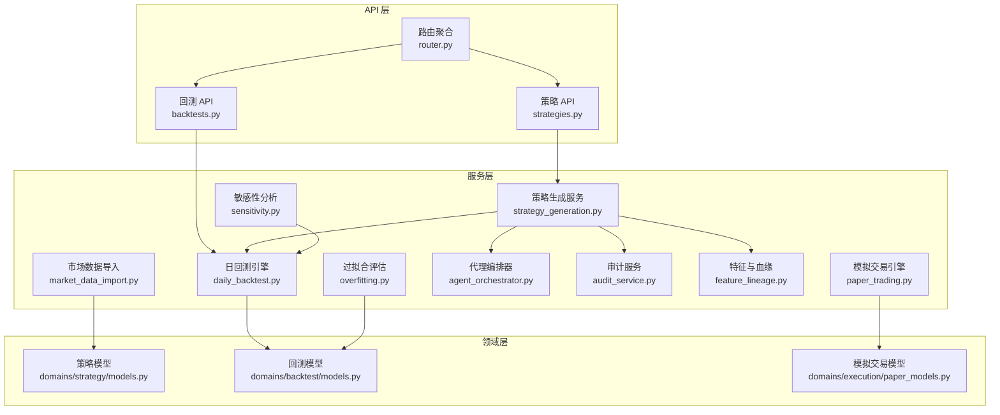

**图表来源**
- [backend/app/api/v1/router.py:1-40](file://backend/app/api/v1/router.py#L1-L40)
- [backend/app/api/v1/strategies.py:1-605](file://backend/app/api/v1/strategies.py#L1-L605)
- [backend/app/api/v1/backtests.py:1-1122](file://backend/app/api/v1/backtests.py#L1-L1122)
- [backend/app/services/__init__.py:1-18](file://backend/app/services/__init__.py#L1-L18)
- [backend/app/services/strategy_generation.py:1-584](file://backend/app/services/strategy_generation.py#L1-L584)
- [backend/app/services/daily_backtest.py:1-899](file://backend/app/services/daily_backtest.py#L1-L899)
- [backend/app/services/paper_trading.py:1-634](file://backend/app/services/paper_trading.py#L1-L634)
- [backend/app/services/market_data_import.py:1-426](file://backend/app/services/market_data_import.py#L1-L426)
- [backend/app/services/agent_orchestrator.py:1-105](file://backend/app/services/agent_orchestrator.py#L1-L105)
- [backend/app/services/audit_service.py:1-109](file://backend/app/services/audit_service.py#L1-L109)
- [backend/app/services/feature_lineage.py:1-217](file://backend/app/services/feature_lineage.py#L1-L217)
- [backend/app/services/sensitivity.py:1-139](file://backend/app/services/sensitivity.py#L1-L139)
- [backend/app/services/overfitting.py:1-168](file://backend/app/services/overfitting.py#L1-L168)
- [backend/app/domains/strategy/models.py:1-84](file://backend/app/domains/strategy/models.py#L1-L84)
- [backend/app/domains/backtest/models.py:1-155](file://backend/app/domains/backtest/models.py#L1-L155)
- [backend/app/domains/execution/paper_models.py:1-133](file://backend/app/domains/execution/paper_models.py#L1-L133)

**章节来源**
- [backend/app/services/__init__.py:1-18](file://backend/app/services/__init__.py#L1-L18)
- [backend/app/api/v1/router.py:1-40](file://backend/app/api/v1/router.py#L1-L40)

## 核心组件
- 策略生成服务（StrategyGenerationService）
  - 负责从自然语言到代码再到回测的完整流水线编排，包含研究扫描、代码生成、静态校验、版本持久化、研究回测、风险控制、结果汇总与审计记录。
  - 关键交互：AgentOrchestrator（任务派发与消息）、AuditService（审计链）、DailyBacktestEngine（回测）、WebSocket 广播。
- 日回测引擎（DailyBacktestEngine）
  - 基于每日 K 线进行回测，支持参数/滑点敏感性分析、Walk-Forward 折叠分析、IS/OOS 分割、指标计算与持久化。
- 模拟交易引擎（PaperTradingEngine）
  - 按日执行标记、信号、预交易风控、撮合成交、净值记录与事后风控检查，支持账户级成本配置与风控阈值。
- 市场数据导入（MarketDataImportService）
  - 支持本地 CSV 与 AKShare 两种来源，统一清洗、去重、校验与入库，兼容 A 股特殊标志位。
- 代理编排器（AgentOrchestrator）
  - 统一的任务派发、完成标记与消息发送，支撑策略流水线中的角色化协作。
- 审计服务（AuditService）
  - 追加式审计日志，维护 SHA-256 哈希链，支持链式校验。
- 特征与血缘（feature_lineage.py）
  - 将策略 DSL 中的因子写入特征集，记录使用关系与回测运行的血缘链路。
- 敏感性分析（sensitivity.py）
  - 在基准回测基础上进行小规模扰动实验，输出参数与滑点敏感性结果。
- 过拟合评估（overfitting.py）
  - 基于 IS/OOS、Walk-Forward、参数扰动与交易成本等维度综合评估过拟合风险。

**章节来源**
- [backend/app/services/strategy_generation.py:86-584](file://backend/app/services/strategy_generation.py#L86-L584)
- [backend/app/services/daily_backtest.py:185-899](file://backend/app/services/daily_backtest.py#L185-L899)
- [backend/app/services/paper_trading.py:76-634](file://backend/app/services/paper_trading.py#L76-L634)
- [backend/app/services/market_data_import.py:177-426](file://backend/app/services/market_data_import.py#L177-L426)
- [backend/app/services/agent_orchestrator.py:15-105](file://backend/app/services/agent_orchestrator.py#L15-L105)
- [backend/app/services/audit_service.py:32-109](file://backend/app/services/audit_service.py#L32-L109)
- [backend/app/services/feature_lineage.py:41-217](file://backend/app/services/feature_lineage.py#L41-L217)
- [backend/app/services/sensitivity.py:60-139](file://backend/app/services/sensitivity.py#L60-L139)
- [backend/app/services/overfitting.py:129-168](file://backend/app/services/overfitting.py#L129-L168)

## 架构总览
服务层采用“请求即会话”的设计：每个 API 请求在进入服务层时注入一个 AsyncSession，服务内部在该会话上下文中完成所有数据库操作，避免跨请求共享状态。服务间通过组合与依赖注入协作，不直接依赖外部框架，便于单元测试与替换。

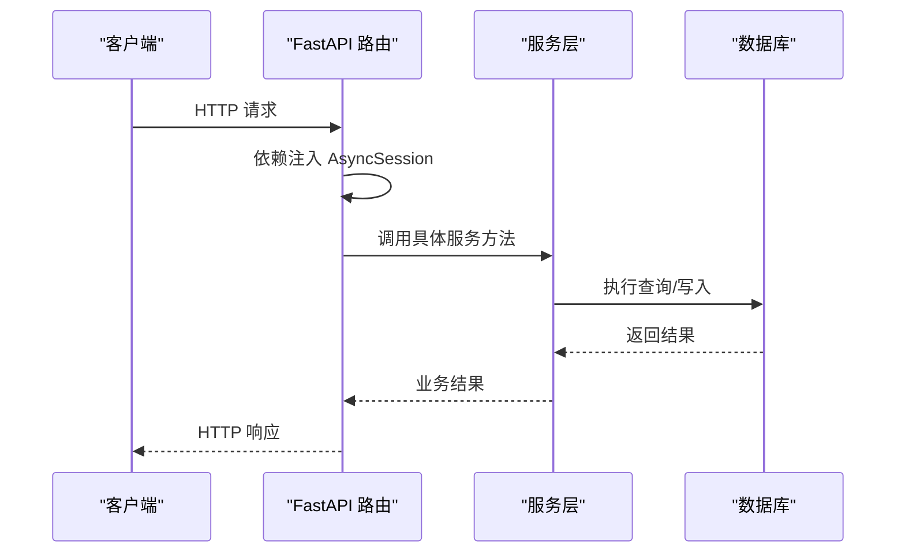

**图表来源**
- [backend/app/api/v1/strategies.py:301-314](file://backend/app/api/v1/strategies.py#L301-L314)
- [backend/app/db/session.py](file://backend/app/db/session.py)

**章节来源**
- [backend/app/api/v1/strategies.py:125-129](file://backend/app/api/v1/strategies.py#L125-L129)

## 详细组件分析

### 策略生成服务（StrategyGenerationService）
- 设计要点
  - 流水线化：研究扫描 → 代码生成 → 静态校验 → 版本持久化 → 研究回测 → 风控校验 → 结果更新 → 审计记录。
  - 可观测性：每阶段持久化 PipelineEvent，广播 WebSocket 事件，便于前端实时反馈。
  - 审计与追踪：使用 trace_id/actor_id 记录操作轨迹，失败阶段自动归因。
- 关键流程
  - 创建任务：写入 StrategyTask，记录审计日志，广播“排队”事件。
  - 执行流水线：按阶段推进，必要时调用 AgentOrchestrator 派发任务并完成，最终持久化回测结果并更新策略元数据。
  - 风控阈值：基于风险画像限制最大回撤与夏普比率下限。
- 依赖关系
  - 依赖 DailyBacktestEngine 进行研究回测。
  - 依赖 AgentOrchestrator 协调代理任务。
  - 依赖 AuditService 记录审计。
  - 依赖 feature_lineage 写入特征与血缘。

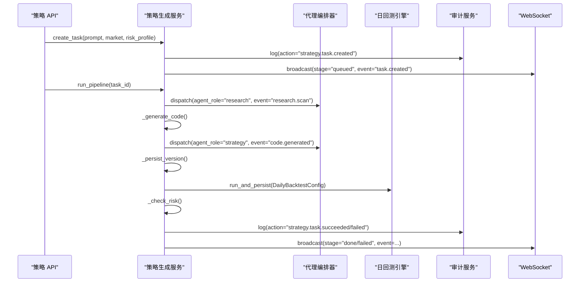

**图表来源**
- [backend/app/services/strategy_generation.py:96-373](file://backend/app/services/strategy_generation.py#L96-L373)
- [backend/app/services/agent_orchestrator.py:31-60](file://backend/app/services/agent_orchestrator.py#L31-L60)
- [backend/app/services/daily_backtest.py:285-371](file://backend/app/services/daily_backtest.py#L285-L371)
- [backend/app/services/audit_service.py:38-81](file://backend/app/services/audit_service.py#L38-L81)

**章节来源**
- [backend/app/services/strategy_generation.py:86-584](file://backend/app/services/strategy_generation.py#L86-L584)

### 日回测引擎（DailyBacktestEngine）
- 设计要点
  - 配置驱动：DailyBacktestConfig 描述回测范围、参数、成本假设与 IS/OOS 切分。
  - 指标完备：支持累计收益、年化收益、最大回撤、夏普比率、胜率、换手率、Calmar、Sortino、波动率、利润因子等。
  - 可扩展：支持 Walk-Forward 折叠分析与敏感性分析。
- 关键流程
  - 加载日线 → 构建上下文 → 策略运行 → 资产组合再平衡 → 成交撮合与费用计算 → 记录净值曲线与交易明细 → 持久化指标与回测结果。

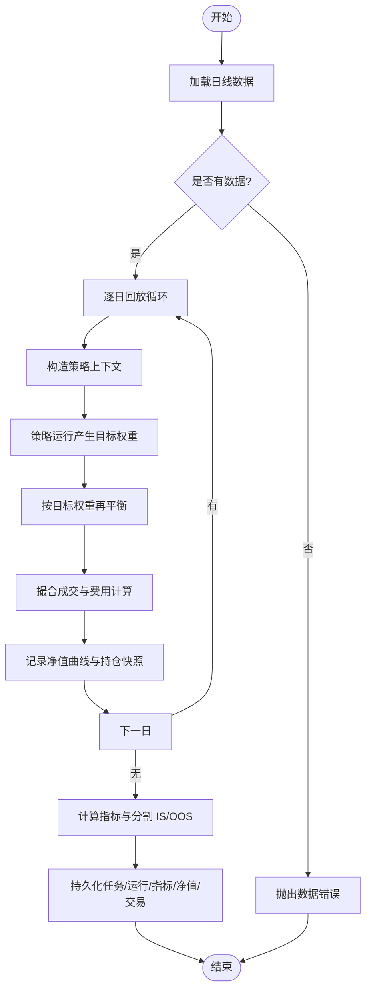

**图表来源**
- [backend/app/services/daily_backtest.py:191-283](file://backend/app/services/daily_backtest.py#L191-L283)
- [backend/app/services/daily_backtest.py:285-452](file://backend/app/services/daily_backtest.py#L285-L452)

**章节来源**
- [backend/app/services/daily_backtest.py:185-899](file://backend/app/services/daily_backtest.py#L185-L899)

### 模拟交易引擎（PaperTradingEngine）
- 设计要点
  - EOD 循环：标记市值 → 信号生成 → 预交易风控 → 撮合成交 → 净值记录 → 事后风控。
  - 成本一致：与回测引擎共享 BacktestCostConfig，保证研究与实操的一致性。
  - 规则明确：单票上限、现金保留、日跌幅与最大回撤阈值等。
- 关键流程
  - 获取当日日线 → 加载账户与持仓 → 市值标记与再平衡前净值 → 计算目标权重 → 创建订单 → 预交易风控 → 成交撮合 → 更新账户与持仓 → 写入净值 → 事后风控检查。

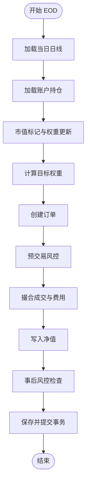

**图表来源**
- [backend/app/services/paper_trading.py:82-134](file://backend/app/services/paper_trading.py#L82-L134)
- [backend/app/services/paper_trading.py:314-577](file://backend/app/services/paper_trading.py#L314-L577)

**章节来源**
- [backend/app/services/paper_trading.py:76-634](file://backend/app/services/paper_trading.py#L76-L634)

### 市场数据导入（MarketDataImportService）
- 设计要点
  - 多源支持：本地 CSV 与 AKShare（可选依赖）。
  - 清洗与校验：列别名映射、必填字段校验、数值合法性、A 股特殊标志位（ST、涨跌停、是否可买卖）。
  - 去重与替换：按 symbol+date 去重，重复键替换旧记录。
- 关键流程
  - 读取原始行 → 归一化与校验 → 去重与替换 → 写入 MarketBarDaily。

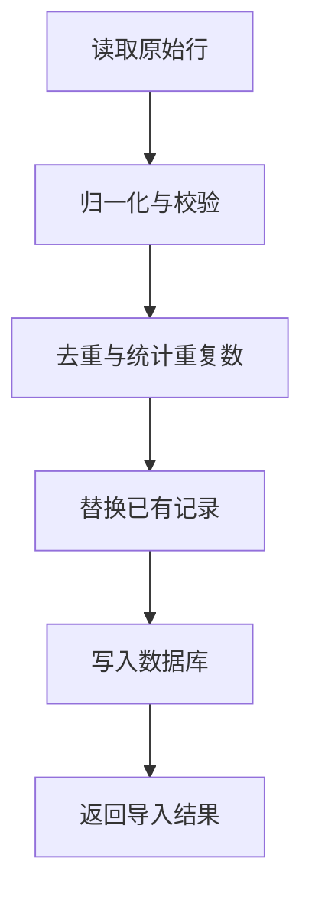

**图表来源**
- [backend/app/services/market_data_import.py:213-241](file://backend/app/services/market_data_import.py#L213-L241)
- [backend/app/services/market_data_import.py:270-289](file://backend/app/services/market_data_import.py#L270-L289)

**章节来源**
- [backend/app/services/market_data_import.py:177-426](file://backend/app/services/market_data_import.py#L177-L426)

### 代理编排器（AgentOrchestrator）
- 设计要点
  - 任务派发：按角色解析代理 ID，持久化 AgentTask。
  - 任务完成：记录结果与完成时间。
  - 消息发送：支持点对点或广播消息，附带关联 ID 与追踪 ID。
- 关键流程
  - 解析角色 → 创建任务 → 完成任务 → 发送消息。

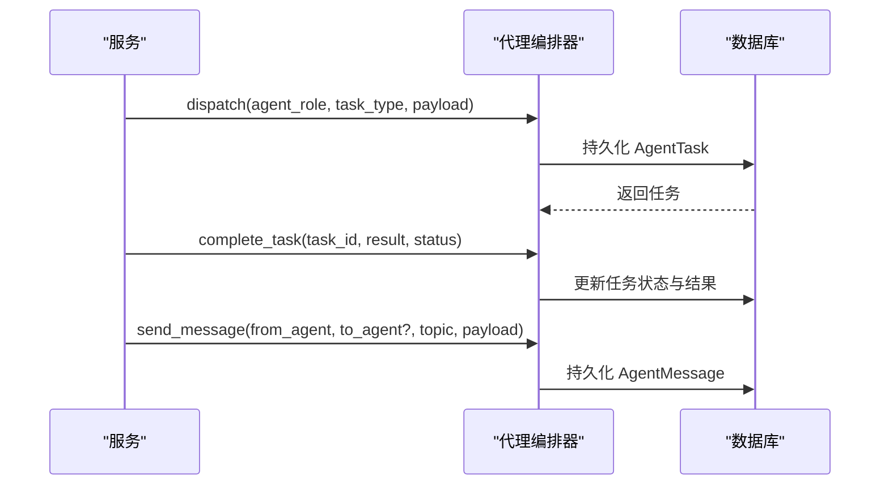

**图表来源**
- [backend/app/services/agent_orchestrator.py:31-105](file://backend/app/services/agent_orchestrator.py#L31-L105)

**章节来源**
- [backend/app/services/agent_orchestrator.py:15-105](file://backend/app/services/agent_orchestrator.py#L15-L105)

### 审计服务（AuditService）
- 设计要点
  - 追加式审计：每次新增日志时计算哈希并链接上一条记录，形成不可篡改链。
  - 链式校验：支持对最近 N 条记录进行链式校验，定位断裂点。
- 关键流程
  - 获取最新日志 → 计算 prev_hash → 新增条目 → 计算 curr_hash → 提交。

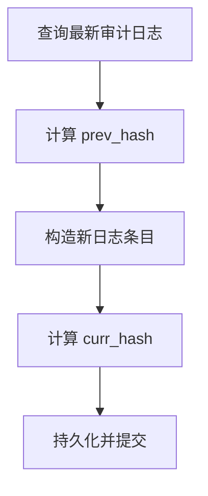

**图表来源**
- [backend/app/services/audit_service.py:38-81](file://backend/app/services/audit_service.py#L38-L81)
- [backend/app/services/audit_service.py:83-109](file://backend/app/services/audit_service.py#L83-L109)

**章节来源**
- [backend/app/services/audit_service.py:32-109](file://backend/app/services/audit_service.py#L32-L109)

### 特征与血缘（feature_lineage.py）
- 设计要点
  - 因子去重与版本化：基于参数哈希生成稳定版本号。
  - 血缘链路：raw → cleaned → feature → strategy → run 的完整链路。
- 关键流程
  - 从 DSL 规格提取因子 → upsert 特征集 → 记录使用关系 → 写入血缘节点与边。

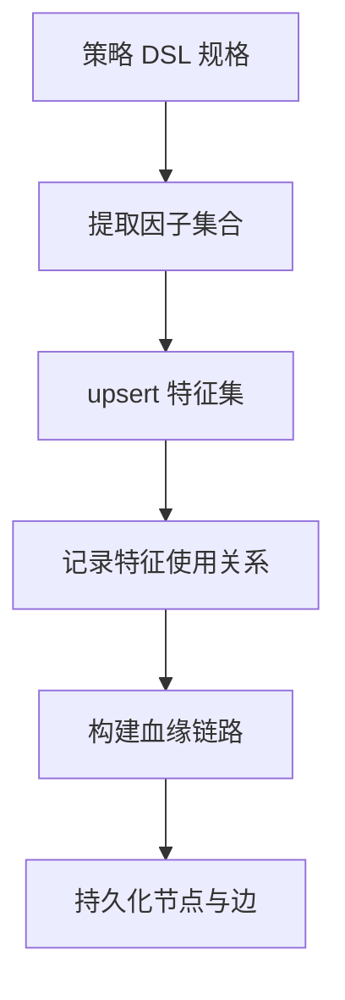

**图表来源**
- [backend/app/services/feature_lineage.py:41-97](file://backend/app/services/feature_lineage.py#L41-L97)
- [backend/app/services/feature_lineage.py:100-194](file://backend/app/services/feature_lineage.py#L100-L194)

**章节来源**
- [backend/app/services/feature_lineage.py:1-217](file://backend/app/services/feature_lineage.py#L1-L217)

### 敏感性分析（sensitivity.py）
- 设计要点
  - 参数扰动：针对双均线策略生成短/长窗口的小幅扰动组合。
  - 滑点扰动：围绕基准滑点设置若干点位。
  - 结果持久化：统一写入 SensitivityRun。
- 关键流程
  - 重新运行基准 → 生成扰动组合 → 逐一回测 → 持久化结果。

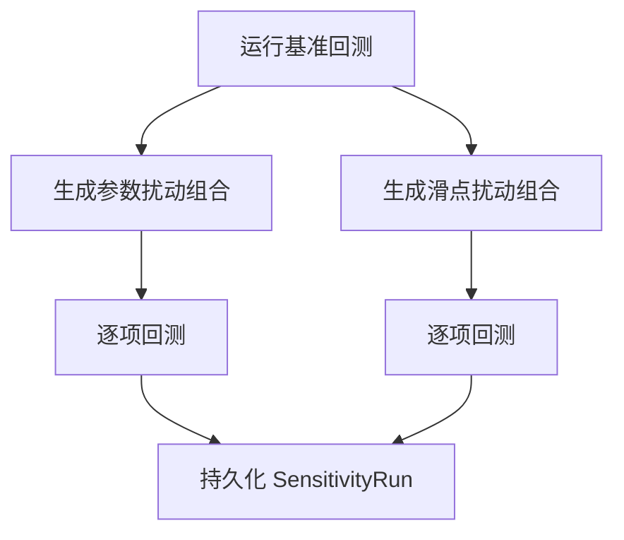

**图表来源**
- [backend/app/services/sensitivity.py:60-139](file://backend/app/services/sensitivity.py#L60-L139)

**章节来源**
- [backend/app/services/sensitivity.py:1-139](file://backend/app/services/sensitivity.py#L1-L139)

### 过拟合评估（overfitting.py）
- 设计要点
  - 综合指标：IS/OOS 夏普衰减、IS/OOS 最大回撤一致性、Walk-Forward 连续性、参数扰动稳定性。
  - 分数聚合：平均后映射为 0-100 分并分级。
  - 结果落库：写回 BacktestMetric 的 oos_score 与 overfit_level。
- 关键流程
  - 读取指标/折叠/敏感性 → 计算各分量 → 聚合评分 → 持久化。

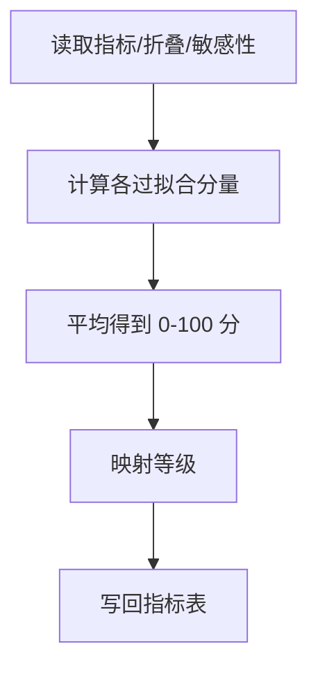

**图表来源**
- [backend/app/services/overfitting.py:129-167](file://backend/app/services/overfitting.py#L129-L167)

**章节来源**
- [backend/app/services/overfitting.py:1-168](file://backend/app/services/overfitting.py#L1-L168)

## 依赖分析
- 服务层内部耦合
  - StrategyGenerationService 与 DailyBacktestEngine、AgentOrchestrator、AuditService、WebSocket 紧密协作，体现“流水线编排”的高内聚特性。
  - DailyBacktestEngine 与回测领域模型（BacktestTask/Run/Metric/EquityPoint/Sensitivity/WalkForward）强耦合，但对外暴露简洁的 run/run_and_persist 接口。
  - PaperTradingEngine 与模拟交易领域模型（PaperAccount/Position/Order/Fill/Nav/PreTradeCheck/RiskBreach）紧密绑定。
- 服务层与 API 层
  - API 路由通过依赖注入获取 AsyncSession，构造服务实例并调用，保持控制器薄化。
- 服务层与领域层
  - 服务层仅通过 SQLAlchemy ORM 操作领域模型，不反向依赖服务层，避免循环依赖。
- 外部集成
  - LLM 提供商（OpenAI/Anthropic/Mock）通过工厂模式注入，支持切换。
  - 市场数据提供商（AKShare）按需引入，不影响核心路径。

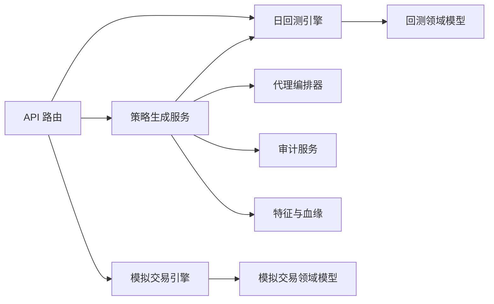

**图表来源**
- [backend/app/api/v1/router.py:1-40](file://backend/app/api/v1/router.py#L1-L40)
- [backend/app/services/strategy_generation.py:89-92](file://backend/app/services/strategy_generation.py#L89-L92)
- [backend/app/domains/backtest/models.py:1-155](file://backend/app/domains/backtest/models.py#L1-L155)
- [backend/app/domains/execution/paper_models.py:1-133](file://backend/app/domains/execution/paper_models.py#L1-L133)

**章节来源**
- [backend/app/api/v1/strategies.py:125-129](file://backend/app/api/v1/strategies.py#L125-L129)
- [backend/app/api/v1/backtests.py:445-456](file://backend/app/api/v1/backtests.py#L445-L456)

## 性能考虑
- 数据加载与缓存
  - 日回测按日期分组加载日线，建议在上游保证索引与分区合理，减少全表扫描。
  - 模拟交易按日处理，注意批量查询与 flush 策略，避免频繁往返。
- 事务与并发
  - 服务层以“请求即会话”模式运行，避免跨请求共享 Session；后台任务使用独立会话，防止阻塞主请求。
- 异步与批处理
  - 策略流水线中的后台执行通过 asyncio.create_task 触发，避免阻塞 API 响应。
  - 市场数据导入支持异步抓取（AKShare），注意限流与错误重试。
- 指标计算复杂度
  - 指标计算多为 O(N)（N 为交易日数），注意内存占用与序列化开销。
- WebSocket 广播
  - 策略事件广播仅用于前端反馈，建议在高并发场景下限制主题订阅与消息频率。

[本节为通用指导，无需列出具体文件来源]

## 故障排查指南
- 策略生成失败
  - 现象：流水线在“代码生成/静态校验/回测/风控”任一阶段失败。
  - 排查：查看 PipelineEvent 与审计日志，定位失败阶段与异常类型；检查 LLM 提供商可用性与输出结构。
  - 参考
    - [backend/app/services/strategy_generation.py:308-373](file://backend/app/services/strategy_generation.py#L308-L373)
    - [backend/app/services/audit_service.py:38-81](file://backend/app/services/audit_service.py#L38-L81)
- 回测数据不足
  - 现象：抛出“无市场日线”类错误。
  - 排查：确认导入数据范围与符号集合；检查 MarketBarDaily 是否存在对应日期与符号。
  - 参考
    - [backend/app/services/daily_backtest.py:28-31](file://backend/app/services/daily_backtest.py#L28-L31)
    - [backend/app/services/market_data_import.py:213-241](file://backend/app/services/market_data_import.py#L213-L241)
- 模拟交易风控触发
  - 现象：订单被拒绝或事后风控告警。
  - 排查：核对单票上限、现金保留比例、日跌幅与最大回撤阈值；检查当日日线是否有效。
  - 参考
    - [backend/app/services/paper_trading.py:314-577](file://backend/app/services/paper_trading.py#L314-L577)
- 审计链校验失败
  - 现象：verify_chain 返回失败与断裂位置。
  - 排查：检查 prev_hash/curr_hash 计算一致性；确认日志未被外部修改。
  - 参考
    - [backend/app/services/audit_service.py:83-109](file://backend/app/services/audit_service.py#L83-L109)

**章节来源**
- [backend/app/services/strategy_generation.py:308-373](file://backend/app/services/strategy_generation.py#L308-L373)
- [backend/app/services/daily_backtest.py:28-31](file://backend/app/services/daily_backtest.py#L28-L31)
- [backend/app/services/paper_trading.py:314-577](file://backend/app/services/paper_trading.py#L314-L577)
- [backend/app/services/audit_service.py:83-109](file://backend/app/services/audit_service.py#L83-L109)

## 结论
llmine-quant 服务层以清晰的职责边界与稳健的编排机制，实现了从自然语言到策略代码、从研究回测到模拟交易的闭环。通过 AsyncSession 的请求级生命周期管理、服务间的松耦合协作、以及完善的审计与可观测性，服务层既满足了快速迭代的需求，也为后续扩展（如多市场接入、更多代理角色、更复杂的风控规则）提供了良好基础。建议在扩展时遵循“服务单一职责、接口稳定、依赖注入、可观测性优先”的原则，持续提升系统的可靠性与可维护性。