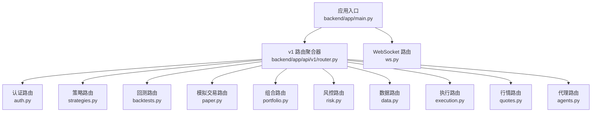
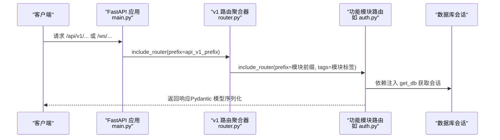
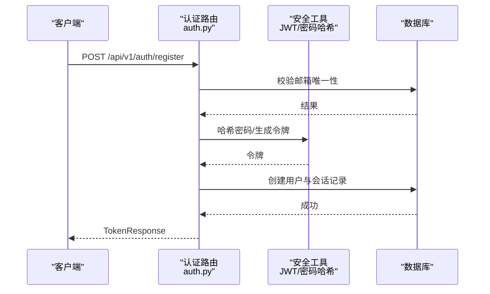
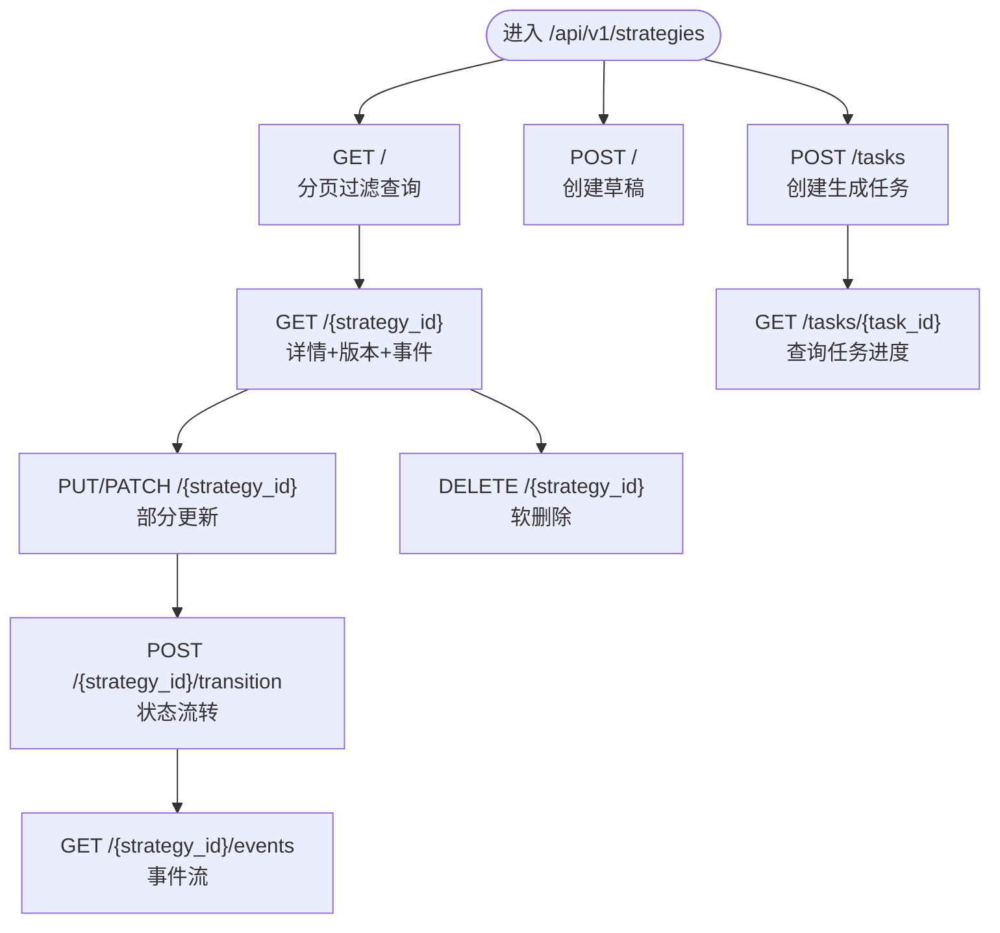
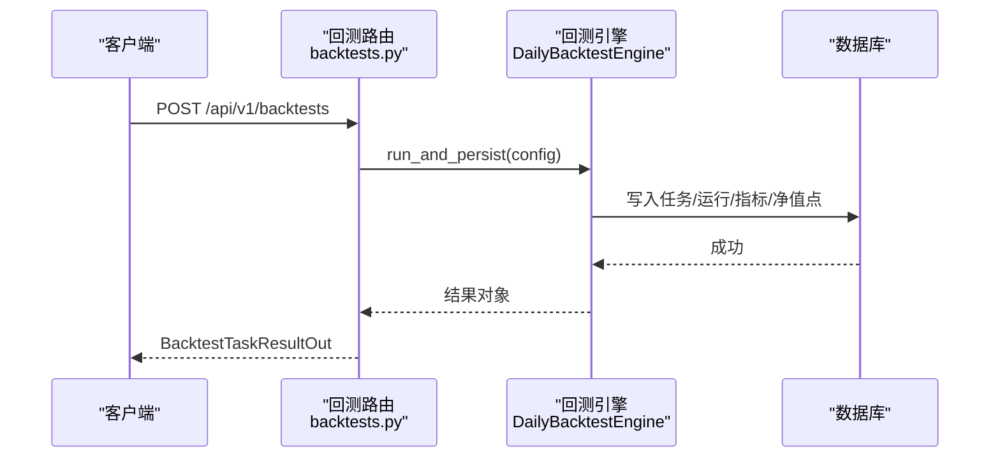
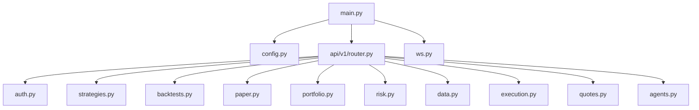

# 路由系统

<cite>
**本文档引用的文件**
- [backend/app/api/v1/router.py](file://backend/app/api/v1/router.py)
- [backend/app/main.py](file://backend/app/main.py)
- [backend/app/api/v1/auth.py](file://backend/app/api/v1/auth.py)
- [backend/app/api/v1/strategies.py](file://backend/app/api/v1/strategies.py)
- [backend/app/api/v1/backtests.py](file://backend/app/api/v1/backtests.py)
- [backend/app/api/v1/paper.py](file://backend/app/api/v1/paper.py)
- [backend/app/api/v1/portfolio.py](file://backend/app/api/v1/portfolio.py)
- [backend/app/api/v1/risk.py](file://backend/app/api/v1/risk.py)
- [backend/app/api/v1/data.py](file://backend/app/api/v1/data.py)
- [backend/app/api/v1/execution.py](file://backend/app/api/v1/execution.py)
- [backend/app/api/v1/quotes.py](file://backend/app/api/v1/quotes.py)
- [backend/app/api/v1/agents.py](file://backend/app/api/v1/agents.py)
- [backend/app/api/v1/ws.py](file://backend/app/api/v1/ws.py)
- [backend/app/core/config.py](file://backend/app/core/config.py)
</cite>

## 目录
1. [简介](#简介)
2. [项目结构](#项目结构)
3. [核心组件](#核心组件)
4. [架构总览](#架构总览)
5. [详细组件分析](#详细组件分析)
6. [依赖分析](#依赖分析)
7. [性能考虑](#性能考虑)
8. [故障排查指南](#故障排查指南)
9. [结论](#结论)

## 简介
本文件系统性梳理 llmine-quant 后端的 FastAPI 路由体系，重点覆盖：
- API 版本管理与路由前缀配置
- 路由聚合与端点注册机制
- 认证、策略、回测、模拟交易、组合、风控、数据、执行、行情、代理等模块的路由组织方式
- 路由装饰器、路径参数与查询参数处理、HTTP 方法映射等技术细节
- 路由扩展最佳实践与示例路径

## 项目结构
后端采用按“版本 + 功能域”分层的路由组织方式：
- 入口应用在主文件中定义，挂载 v1 路由聚合器，并注册 WebSocket 路由
- v1 路由聚合器统一 include 各功能模块的子路由，实现按前缀分组
- 各模块内部使用 APIRouter 定义具体端点，遵循 REST 设计

图表来源
- [backend/app/main.py:57-58](file://backend/app/main.py#L57-L58)
- [backend/app/api/v1/router.py:25-39](file://backend/app/api/v1/router.py#L25-L39)

章节来源
- [backend/app/main.py:39-65](file://backend/app/main.py#L39-L65)
- [backend/app/api/v1/router.py:1-40](file://backend/app/api/v1/router.py#L1-L40)

## 核心组件
- 应用入口与生命周期
  - 应用实例化时设置标题、版本、OpenAPI 文档路径、生命周期钩子
  - 注册中间件（CORS、链路追踪）
  - 注册全局异常处理器
  - 挂载 v1 路由聚合器与 WebSocket 路由
- 配置中心
  - 统一管理 API 前缀、数据库、Redis、CORS、LLM/市场数据提供商等
  - 默认 API v1 前缀为 /api/v1
- v1 路由聚合器
  - 将各功能模块的 APIRouter 以固定前缀与标签进行 include
  - 便于统一管理与扩展

章节来源
- [backend/app/main.py:19-65](file://backend/app/main.py#L19-L65)
- [backend/app/core/config.py:73](file://backend/app/core/config.py#L73)
- [backend/app/api/v1/router.py:25-39](file://backend/app/api/v1/router.py#L25-L39)

## 架构总览
下图展示了路由层次与端点注册的关键流程。

图表来源
- [backend/app/main.py:57](file://backend/app/main.py#L57)
- [backend/app/api/v1/router.py:25-39](file://backend/app/api/v1/router.py#L25-L39)

## 详细组件分析

### 认证路由（/api/v1/auth）
- 路由装饰器与 HTTP 方法
  - 使用装饰器定义端点，如 POST /login、POST /register、POST /refresh、POST /logout、GET /me
- 路径与查询参数
  - 登录使用 OAuth2 表单认证，无需显式路径参数
  - 注册接收 JSON 请求体
  - 刷新与登出接收请求体中的 access_token
  - 查询参数用于用户信息接口（如分页）
- 依赖注入与数据库
  - 通过依赖注入获取数据库会话
  - 使用安全工具生成/校验 JWT
- 错误处理
  - 对无效凭据、用户不存在、账户非活跃等情况返回标准 HTTP 状态码

图表来源
- [backend/app/api/v1/auth.py:92-131](file://backend/app/api/v1/auth.py#L92-L131)

章节来源
- [backend/app/api/v1/auth.py:47-194](file://backend/app/api/v1/auth.py#L47-L194)

### 策略路由（/api/v1/strategies）
- 路由装饰器与 HTTP 方法
  - GET /overview、/templates、/backtest-ready、/、/feed
  - POST /tasks、POST /{strategy_id}/transition
  - GET /{strategy_id}、/{strategy_id}/events
  - PUT /{strategy_id}、PATCH /{strategy_id}
  - DELETE /{strategy_id}
  - POST /（创建草稿）
- 路径与查询参数
  - 路径参数：strategy_id、task_id
  - 查询参数：status、family、market、q、page、page_size
- 业务逻辑要点
  - 支持策略生命周期状态转换并记录流水事件
  - 提供策略详情、版本列表、流水事件列表
  - 支持软删除（设置 deleted_at）

图表来源
- [backend/app/api/v1/strategies.py:384-420](file://backend/app/api/v1/strategies.py#L384-L420)
- [backend/app/api/v1/strategies.py:422-447](file://backend/app/api/v1/strategies.py#L422-L447)
- [backend/app/api/v1/strategies.py:449-461](file://backend/app/api/v1/strategies.py#L449-L461)
- [backend/app/api/v1/strategies.py:463-555](file://backend/app/api/v1/strategies.py#L463-L555)
- [backend/app/api/v1/strategies.py:557-605](file://backend/app/api/v1/strategies.py#L557-L605)

章节来源
- [backend/app/api/v1/strategies.py:162-605](file://backend/app/api/v1/strategies.py#L162-L605)

### 回测路由（/api/v1/backtests）
- 路由装饰器与 HTTP 方法
  - POST /universe/suggest（AI 股票池建议）
  - GET /overview
  - POST /（基础回测）
  - POST /sensitivity（灵敏度分析）
  - POST /walk-forward（滚动回测）
  - GET /{task_id}（查询任务结果）
  - GET /（任务列表）
  - GET /{task_id}/trades（交易清单）
  - GET /{task_id}/report（综合报告）
- 路由参数与查询参数
  - 路径参数：task_id
  - 查询参数：limit 等
- 业务逻辑要点
  - 调用引擎执行回测并持久化结果
  - 提供折线图、热力图、压力测试、过拟合评估等可视化数据

图表来源
- [backend/app/api/v1/backtests.py:445-457](file://backend/app/api/v1/backtests.py#L445-L457)

章节来源
- [backend/app/api/v1/backtests.py:200-791](file://backend/app/api/v1/backtests.py#L200-L791)

### 模拟交易路由（/api/v1/paper）
- 路由装饰器与 HTTP 方法
  - POST /accounts、GET /accounts、GET /accounts/{account_id}
  - GET /accounts/{account_id}/positions、orders、fills、nav、breaches
  - POST /accounts/{account_id}/run-eod
- 路由参数与查询参数
  - 路径参数：account_id
  - 查询参数：limit
- 业务逻辑要点
  - 账户创建、查询、状态管理
  - 实时/历史持仓、订单、成交、净值、风控告警
  - 手动触发 EOD 流程

章节来源
- [backend/app/api/v1/paper.py:43-276](file://backend/app/api/v1/paper.py#L43-L276)

### 组合路由（/api/v1/portfolio）
- 路由装饰器与 HTTP 方法
  - GET /overview、/rebalance
  - POST /rebalance/{proposal_id}/approve
- 路由参数与查询参数
  - 路径参数：proposal_id
- 业务逻辑要点
  - 组合概览（净值、风险预算、资产配置、相关性、集中度）
  - 待审批调仓提案列表与审批操作

章节来源
- [backend/app/api/v1/portfolio.py:140-186](file://backend/app/api/v1/portfolio.py#L140-L186)

### 风控路由（/api/v1/risk）
- 路由装饰器与 HTTP 方法
  - GET /overview
  - POST /circuit-breakers/{level}/trigger、/recover
- 路由参数与查询参数
  - 路径参数：level
- 业务逻辑要点
  - 风控概览（健康评分、限额、VaR、熔断器、策略流、告警）
  - 手动触发/恢复熔断器并广播实时事件

章节来源
- [backend/app/api/v1/risk.py:188-273](file://backend/app/api/v1/risk.py#L188-L273)

### 数据路由（/api/v1/data）
- 路由装饰器与 HTTP 方法
  - GET /overview、/sources、/latency-trend、/lineage、/symbols、/features、/features/usages、/incidents、/bias-gates
  - POST /market-bars/import/csv、/market-bars/import/akshare
  - GET /market-bars
  - GET /lineage/runs/{run_id}
- 路由参数与查询参数
  - 查询参数：startDate、endDate、limit、strategy_version_id、backtest_run_id 等
- 业务逻辑要点
  - 数据源健康度、延迟趋势、偏见门禁、特征使用、血缘图谱
  - 导入 CSV/AKShare 日线数据
  - 查询行情、特征、血缘运行图

章节来源
- [backend/app/api/v1/data.py:134-392](file://backend/app/api/v1/data.py#L134-L392)

### 执行路由（/api/v1/execution）
- 路由装饰器与 HTTP 方法
  - GET /overview
  - GET /approvals（支持查询参数 status、limit）
  - POST /approvals/{approval_id}/approve、/reject
- 路由参数与查询参数
  - 路径参数：approval_id
  - 查询参数：status、limit
- 业务逻辑要点
  - 审批概览、订单簿、代理轨迹、执行指标
  - 人工审批/拒绝交易并写审计日志与广播事件

章节来源
- [backend/app/api/v1/execution.py:188-281](file://backend/app/api/v1/execution.py#L188-L281)

### 行情路由（/api/v1/quotes）
- 路由装饰器与 HTTP 方法
  - GET /history、/snapshot、/market
  - WebSocket /ws（订阅/退订/心跳）
- 路由参数与查询参数
  - 查询参数：symbol、start_date、end_date、freq、adjust、symbols 等
- 业务逻辑要点
  - 历史 K 线、快照、全市场快照
  - WebSocket 实时推送与缓存回放

章节来源
- [backend/app/api/v1/quotes.py:16-129](file://backend/app/api/v1/quotes.py#L16-L129)

### 代理路由（/api/v1/agents）
- 路由装饰器与 HTTP 方法
  - GET /overview
  - POST /tasks、GET /tasks/{task_id}
  - POST /messages、GET /messages
- 路由参数与查询参数
  - 路径参数：task_id
  - 查询参数：limit
- 业务逻辑要点
  - 代理概览（代理、任务、消息、工具）
  - 分发任务、发送/查询消息

章节来源
- [backend/app/api/v1/agents.py:93-172](file://backend/app/api/v1/agents.py#L93-L172)

### WebSocket 路由（/ws）
- 路由装饰器与方法
  - WebSocket /events、/strategy-events、/execution-events、/risk-events
- 业务逻辑要点
  - 连接管理、消息收发、异常处理、广播事件

章节来源
- [backend/app/api/v1/ws.py:28-50](file://backend/app/api/v1/ws.py#L28-L50)

## 依赖分析
- 路由聚合器依赖各模块路由文件，形成“前缀 + 标签”的统一注册
- 主应用依赖配置中心与中间件，统一设置 OpenAPI 路径、CORS、链路追踪与异常处理
- 各模块路由依赖数据库会话注入与领域模型/模式，确保端点职责清晰

图表来源
- [backend/app/main.py:57-58](file://backend/app/main.py#L57-L58)
- [backend/app/api/v1/router.py:5-21](file://backend/app/api/v1/router.py#L5-L21)

章节来源
- [backend/app/main.py:39-65](file://backend/app/main.py#L39-L65)
- [backend/app/api/v1/router.py:25-39](file://backend/app/api/v1/router.py#L25-L39)

## 性能考虑
- 路由前缀与标签
  - 通过 include_router 的 prefix 与 tags，便于前端路由分包与文档分类
- 异步数据库会话
  - 各模块端点依赖异步会话注入，减少阻塞
- 缓存与回放
  - 行情模块支持缓存回放，降低首次拉取成本
- 并行与后台任务
  - 策略生成与回测等耗时流程可后台执行，避免阻塞请求

## 故障排查指南
- 常见错误与处理
  - 认证失败：检查邮箱/密码、账户状态、令牌有效性
  - 资源不存在：检查路径参数是否正确，软删除状态
  - 数据导入失败：检查文件路径、数据格式、提供商配置
  - WebSocket 连接异常：检查订阅符号、心跳、服务端日志
- 建议
  - 在端点中捕获并转换为标准 HTTP 异常
  - 使用中间件记录请求上下文（trace_id、actor_id）
  - 对外部服务调用增加超时与重试策略

章节来源
- [backend/app/api/v1/auth.py:57-64](file://backend/app/api/v1/auth.py#L57-L64)
- [backend/app/api/v1/backtests.py:454-456](file://backend/app/api/v1/backtests.py#L454-L456)
- [backend/app/api/v1/quotes.py:122-128](file://backend/app/api/v1/quotes.py#L122-L128)

## 结论
llmine-quant 的路由系统以 FastAPI 为基础，采用“v1 聚合器 + 功能域模块”的清晰分层，结合统一的前缀与标签管理，实现了良好的可维护性与扩展性。通过依赖注入、中间件与异常处理机制，系统在保证功能完整性的同时兼顾了性能与可观测性。后续扩展新模块时，建议遵循现有命名与前缀规范，复用依赖注入与异常处理模式，确保一致的开发体验与运维效率。