# 数据架构

<cite>
**本文引用的文件**
- [backend/app/db/base.py](file://backend/app/db/base.py)
- [backend/app/db/base_class.py](file://backend/app/db/base_class.py)
- [backend/app/db/session.py](file://backend/app/db/session.py)
- [backend/alembic.ini](file://backend/alembic.ini)
- [backend/pyproject.toml](file://backend/pyproject.toml)
- [backend/app/domains/strategy/models.py](file://backend/app/domains/strategy/models.py)
- [backend/app/domains/backtest/models.py](file://backend/app/domains/backtest/models.py)
- [backend/app/domains/execution/models.py](file://backend/app/domains/execution/models.py)
- [backend/app/domains/risk/models.py](file://backend/app/domains/risk/models.py)
- [backend/app/domains/portfolio/models.py](file://backend/app/domains/portfolio/models.py)
- [backend/app/domains/audit/models.py](file://backend/app/domains/audit/models.py)
- [backend/app/domains/identity/models.py](file://backend/app/domains/identity/models.py)
- [backend/app/domains/data/models.py](file://backend/app/domains/data/models.py)
- [backend/app/domains/data/schemas.py](file://backend/app/domains/data/schemas.py)
- [backend/app/domains/security/models.py](file://backend/app/domains/security/models.py)
- [backend/app/domains/collaboration/models.py](file://backend/app/domains/collaboration/models.py)
- [backend/app/db/migrations/versions/20260516_000002_stock_info.py](file://backend/app/db/migrations/versions/20260516_000002_stock_info.py)
- [backend/app/api/v1/data.py](file://backend/app/api/v1/data.py)
- [backend/app/services/market_data_full_sync.py](file://backend/app/services/market_data_full_sync.py)
- [backend/scripts/refresh_stock_info_once.py](file://backend/scripts/refresh_stock_info_once.py)
</cite>

## 更新摘要
**所做更改**
- 新增StockInfo实体章节，详细描述股票元数据存储和管理
- 更新数据模型组织章节，添加StockInfo实体的详细说明
- 更新API端点章节，说明股票信息刷新功能
- 更新迁移策略章节，包含StockInfo迁移脚本的详细分析
- 更新性能考量章节，添加StockInfo相关的索引和查询优化建议

## 目录
1. [简介](#简介)
2. [项目结构](#项目结构)
3. [核心组件](#核心组件)
4. [架构总览](#架构总览)
5. [详细组件分析](#详细组件分析)
6. [依赖关系分析](#依赖关系分析)
7. [性能考量](#性能考量)
8. [故障排查指南](#故障排查指南)
9. [结论](#结论)
10. [附录](#附录)

## 简介
本文件系统性梳理 llmine-quant 后端的数据架构，围绕基于 SQLAlchemy 的 ORM 设计、数据库连接与会话管理、迁移策略、领域模型组织（策略、回测、执行、风险、组合、数据、安全、协作、审计与身份）展开。文档重点覆盖：
- ORM 基类与通用字段设计
- 异步数据库引擎与会话生命周期
- 迁移脚本与版本管理
- 领域模型的表结构、索引与约束
- 查询优化与一致性保障
- 实际使用示例与最佳实践

**更新** 新增StockInfo实体用于存储股票元数据，支持更好的数据展示和过滤功能，包括股票中文名称、板块分类、ST标记等元信息。

## 项目结构
后端采用按"领域"划分的模块化组织方式，数据库层位于 app/db，迁移脚本位于 app/db/migrations，各领域模型位于 app/domains/<domain>/models.py。

```mermaid
graph TB
subgraph "数据库层"
BASE["Base(ORM基类)<br/>backend/app/db/base.py"]
BASECLS["BaseModel(通用字段)<br/>backend/app/db/base_class.py"]
SESSION["异步会话工厂<br/>backend/app/db/session.py"]
ALEMBIC["迁移配置<br/>backend/alembic.ini"]
end
subgraph "领域模型"
STRAT["策略模型<br/>backend/app/domains/strategy/models.py"]
BT["回测模型<br/>backend/app/domains/backtest/models.py"]
EXEC["执行模型<br/>backend/app/domains/execution/models.py"]
RISK["风险模型<br/>backend/app/domains/risk/models.py"]
PORT["组合模型<br/>backend/app/domains/portfolio/models.py"]
DATA["数据模型<br/>backend/app/domains/data/models.py"]
SEC["安全模型<br/>backend/app/domains/security/models.py"]
COL["协作模型<br/>backend/app/domains/collaboration/models.py"]
AUD["审计模型<br/>backend/app/domains/audit/models.py"]
ID["身份模型<br/>backend/app/domains/identity/models.py"]
STOCKINFO["股票信息模型<br/>StockInfo实体"]
end
BASECLS --> STRAT
BASECLS --> BT
BASECLS --> EXEC
BASECLS --> RISK
BASECLS --> PORT
BASECLS --> DATA
BASECLS --> SEC
BASECLS --> COL
BASECLS --> AUD
BASECLS --> ID
BASECLS --> STOCKINFO
SESSION --> STRAT
SESSION --> BT
SESSION --> EXEC
SESSION --> RISK
SESSION --> PORT
SESSION --> DATA
SESSION --> SEC
SESSION --> COL
SESSION --> AUD
SESSION --> ID
SESSION --> STOCKINFO
ALEMBIC --> SESSION
```

**图表来源**
- [backend/app/db/base.py:6-10](file://backend/app/db/base.py#L6-L10)
- [backend/app/db/base_class.py:17-31](file://backend/app/db/base_class.py#L17-L31)
- [backend/app/db/session.py:1-34](file://backend/app/db/session.py#L1-L34)
- [backend/alembic.ini:1-111](file://backend/alembic.ini#L1-L111)
- [backend/app/domains/strategy/models.py:1-84](file://backend/app/domains/strategy/models.py#L1-L84)
- [backend/app/domains/backtest/models.py:1-155](file://backend/app/domains/backtest/models.py#L1-L155)
- [backend/app/domains/execution/models.py:1-103](file://backend/app/domains/execution/models.py#L1-L103)
- [backend/app/domains/risk/models.py:1-101](file://backend/app/domains/risk/models.py#L1-L101)
- [backend/app/domains/portfolio/models.py:1-83](file://backend/app/domains/portfolio/models.py#L1-L83)
- [backend/app/domains/data/models.py:1-163](file://backend/app/domains/data/models.py#L1-L163)
- [backend/app/domains/security/models.py:1-59](file://backend/app/domains/security/models.py#L1-L59)
- [backend/app/domains/collaboration/models.py:1-44](file://backend/app/domains/collaboration/models.py#L1-L44)
- [backend/app/domains/audit/models.py:1-51](file://backend/app/domains/audit/models.py#L1-L51)
- [backend/app/domains/identity/models.py:1-60](file://backend/app/domains/identity/models.py#L1-L60)

**章节来源**
- [backend/app/db/base.py:1-10](file://backend/app/db/base.py#L1-L10)
- [backend/app/db/base_class.py:1-31](file://backend/app/db/base_class.py#L1-L31)
- [backend/app/db/session.py:1-34](file://backend/app/db/session.py#L1-L34)
- [backend/alembic.ini:1-111](file://backend/alembic.ini#L1-L111)

## 核心组件
- ORM 基类与通用字段
  - Base：声明式 ORM 基类，所有模型继承自该基类，确保统一的元数据与行为。
  - BaseModel：抽象基模型，统一提供主键、租户隔离字段、审计字段、时间戳、删除标记、trace_id、metadata_json 等。
- 异步数据库连接与会话
  - 使用 SQLAlchemy 2.x 异步引擎与异步会话工厂，支持 SQLite（多线程）与 PostgreSQL（异步驱动）。
  - 提供依赖注入式 get_db，自动回滚与关闭会话，保证异常时的一致性。
- 迁移与版本管理
  - Alembic 配置指定迁移脚本位置、日志级别、SQLAlchemy URL 等。
  - 版本化迁移脚本按时间顺序组织，便于演进与回滚。

**章节来源**
- [backend/app/db/base.py:6-10](file://backend/app/db/base.py#L6-L10)
- [backend/app/db/base_class.py:17-31](file://backend/app/db/base_class.py#L17-L31)
- [backend/app/db/session.py:10-34](file://backend/app/db/session.py#L10-L34)
- [backend/alembic.ini:58](file://backend/alembic.ini#L58)

## 架构总览
下图展示数据层在系统中的位置与交互关系，以及各领域模型的职责边界。

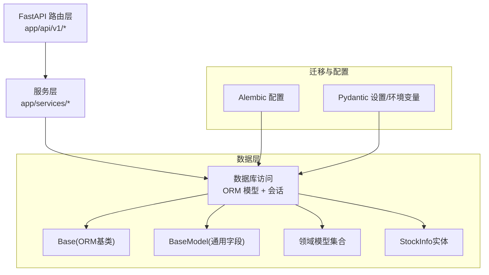

**图表来源**
- [backend/app/db/base.py:6-10](file://backend/app/db/base.py#L6-L10)
- [backend/app/db/base_class.py:17-31](file://backend/app/db/base_class.py#L17-L31)
- [backend/app/db/session.py:10-34](file://backend/app/db/session.py#L10-L34)
- [backend/alembic.ini:58](file://backend/alembic.ini#L58)

## 详细组件分析

### ORM 基类与通用字段
- 设计要点
  - 统一 UUID 主键，提升分布式场景下的唯一性与可追踪性。
  - 支持租户隔离字段 org_id，并建立索引以加速过滤。
  - 审计字段：created_at/updated_at 自动维护；created_by/updated_by 记录操作者；trace_id 支持端到端追踪；metadata_json 存储扩展元数据。
  - 删除标记 deleted_at 支持软删除策略。
- 复杂度与性能
  - 字段数量有限，索引主要集中在 org_id、trace_id、deleted_at 等高频过滤字段上，避免对写入造成显著开销。
  - 默认值与 onupdate 回调由 ORM 层处理，减少业务代码重复。

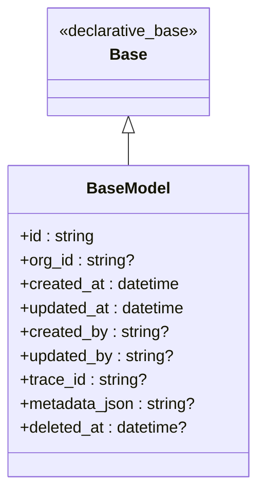

**图表来源**
- [backend/app/db/base.py:6-10](file://backend/app/db/base.py#L6-L10)
- [backend/app/db/base_class.py:17-31](file://backend/app/db/base_class.py#L17-L31)

**章节来源**
- [backend/app/db/base.py:6-10](file://backend/app/db/base.py#L6-L10)
- [backend/app/db/base_class.py:12-31](file://backend/app/db/base_class.py#L12-L31)

### 数据库连接与会话管理
- 引擎与会话
  - 异步引擎创建，SQLite 场景启用多线程兼容；PostgreSQL 使用异步驱动。
  - 会话工厂配置 expire_on_commit=False、autoflush=False，降低 ORM 状态同步成本。
- 依赖注入与异常处理
  - get_db 作为 FastAPI 依赖，自动开启/关闭会话；捕获异常并回滚，finally 关闭会话，确保资源释放。
- 并发与一致性
  - 异步会话避免阻塞；结合索引与批量写入可提升吞吐；软删除与审计字段保障历史可追溯。

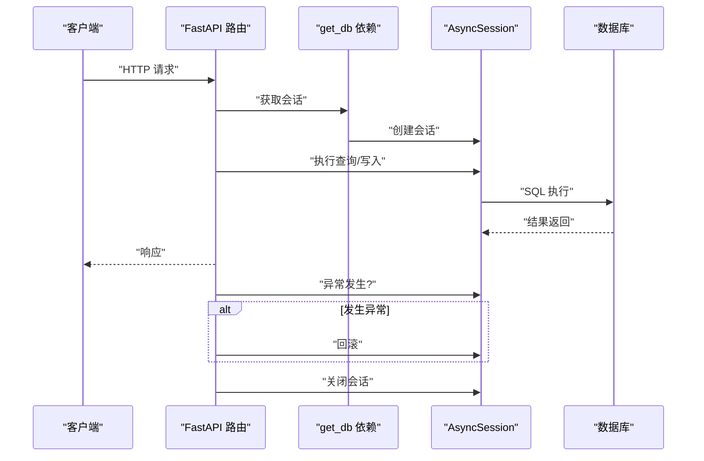

**图表来源**
- [backend/app/db/session.py:24-34](file://backend/app/db/session.py#L24-L34)

**章节来源**
- [backend/app/db/session.py:10-34](file://backend/app/db/session.py#L10-L34)

### 迁移策略与版本管理
- 配置与脚本位置
  - script_location 指向 app/db/migrations；prepend_sys_path 保证导入路径正确。
  - SQLAlchemy URL 在 alembic.ini 中配置，支持 PostgreSQL 异步驱动。
- 版本化迁移
  - 迁移脚本按时间顺序命名，包含初始化、领域表创建、指标与折返测试、交易与解释等演进。
- 最新迁移：StockInfo实体
  - 新增 stock_info 表，包含 symbol、name、board、is_st、last_synced_at 字段
  - 建立唯一约束（symbol）和索引（org_id、symbol）
  - 支持 SQLite ON CONFLICT DO UPDATE 语法
- 最佳实践
  - 新增字段建议使用 nullable=True 并配合默认值；避免在生产库直接删除列。
  - 使用 UniqueConstraint 与索引明确约束与查询路径。

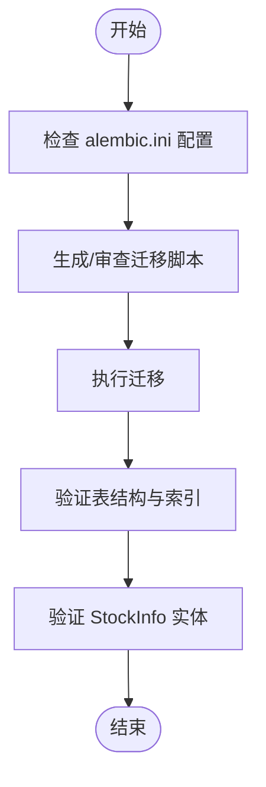

**图表来源**
- [backend/alembic.ini:58](file://backend/alembic.ini#L58)
- [backend/app/db/migrations/versions/20260516_000002_stock_info.py:34-47](file://backend/app/db/migrations/versions/20260516_000002_stock_info.py#L34-L47)

**章节来源**
- [backend/alembic.ini:1-111](file://backend/alembic.ini#L1-L111)
- [backend/app/db/migrations/versions/20260516_000002_stock_info.py:1-53](file://backend/app/db/migrations/versions/20260516_000002_stock_info.py#L1-L53)

### 领域模型组织与数据流

#### 策略领域（Strategy）
- 关键表
  - strategies：策略主记录，包含名称、家族、类型、状态、所有者、描述、风险偏好、市场、频率、收益指标等。
  - strategy_versions：不可变策略版本，保存代码 URI/文本、参数模式、风控规则等。
  - strategy_tasks：自然语言生成任务，跟踪提示词、市场、风险等级、状态、关联对象等。
  - strategy_pipeline_events：策略管线事件，记录阶段、事件、进度与详情。
  - strategy_templates：预置模板，包含名称、风险等级、市场、家族、模板 URI、描述等。
- 索引与查询
  - 常见过滤字段（family、type、status、owner_id、strategy_id、stage、event）建立索引，支撑筛选与分页。
- 性能建议
  - 对高基数字段（如 owner_id、strategy_id）建立复合索引，避免全表扫描。

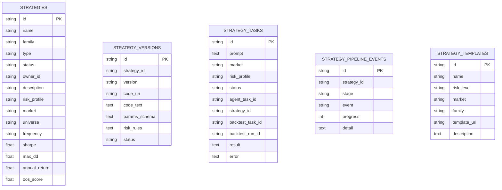

**图表来源**
- [backend/app/domains/strategy/models.py:9-84](file://backend/app/domains/strategy/models.py#L9-L84)

**章节来源**
- [backend/app/domains/strategy/models.py:1-84](file://backend/app/domains/strategy/models.py#L1-L84)

#### 回测领域（Backtest）
- 关键表
  - backtest_tasks：回测任务配置，含策略版本、优先级、状态等。
  - backtest_runs：单次回测运行，记录参数集、起止时间、状态、报告 URI。
  - backtest_metrics：回测指标，区分全样本/样本内/样本外，包含累计收益、年化收益、最大回撤、夏普、索提诺、胜率、换手率、过拟合等级等。
  - equity_points：净值曲线点，含日期、净值、基准、回撤、阶段标识。
  - sensitivity_runs：敏感性分析（参数扰动/滑点），区分基线与变体。
  - walk_forward_folds：折返测试折叠，记录训练/测试窗口与指标。
  - backtest_trades：持久化模拟交易，记录原因与费用。
  - stress_results：压力测试结果，含场景、损失、熔断、建议等。
- 索引与查询
  - run_id、task_id、segment、trade_date、symbol、kind、fold_index 等字段建立索引，支撑回测结果聚合与可视化。
- 性能建议
  - 将大体量的时间序列（净值、K线）拆分存储或使用时序数据库（如 TimescaleDB）以提升查询效率。

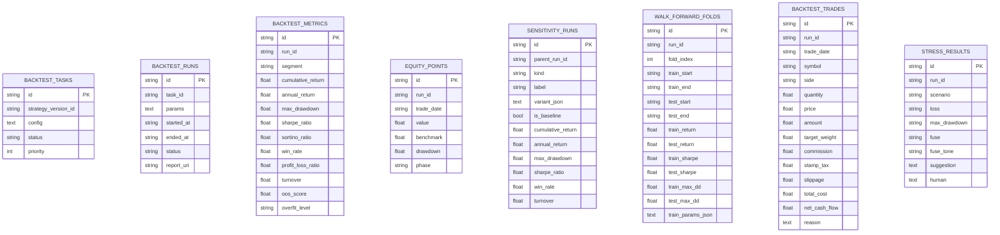

**图表来源**
- [backend/app/domains/backtest/models.py:9-155](file://backend/app/domains/backtest/models.py#L9-L155)

**章节来源**
- [backend/app/domains/backtest/models.py:1-155](file://backend/app/domains/backtest/models.py#L1-L155)

#### 执行领域（Execution）
- 关键表
  - approvals：人工在环审批请求，含组合、策略、标的、方向、数量、限价/止损、置信度、影响、时效、状态等。
  - orders：订单簿条目，含账户、标的、方向、数量、限价、成交数量、状态、滑点、盈亏、策略标识。
  - fills：成交明细，记录订单与成交价格、数量、手续费。
  - execution_metrics：执行质量指标快照，统计滑点、成交率、延迟、成功率等。
  - pre_trade_checks：交易前风控检查，记录资源、阈值、结果与说明。
  - agent_traces：Agent 执行轨迹日志。
- 索引与查询
  - account_id、symbol、strategy_id、order_id、status 等字段建立索引，支撑实时风控与执行监控。
- 性能建议
  - 对高频写入的 orders/fills 建立分区或物化视图，结合异步队列解耦写入与计算。

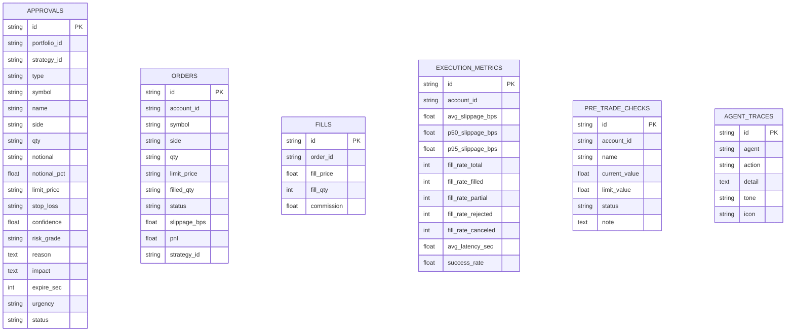

**图表来源**
- [backend/app/domains/execution/models.py:9-103](file://backend/app/domains/execution/models.py#L9-L103)

**章节来源**
- [backend/app/domains/execution/models.py:1-103](file://backend/app/domains/execution/models.py#L1-L103)

#### 风险领域（Risk）
- 关键表
  - risk_rules：可配置风控规则，限定范围（账户/组合/策略/订单）、指标、阈值、动作（告警/阻断/紧急停止）、启用状态与描述。
  - risk_checks：风控检查结果记录，包含资源类型/ID、结果与快照。
  - risk_budgets：风险预算分配与使用，按组合、指标、单位与描述管理限额与占用。
  - var_snapshots：VaR 快照，记录日/周 VaR 与置信度。
  - circuit_breakers：熔断器配置与状态，含触发条件、动作、触发次数与最近触发时间。
  - risk_breaches：风险违规事件，记录严重程度、标题、详情、处置状态与说明。
  - policy_decisions：策略引擎决策日志，记录请求、决策、原因、耗时与快照。
- 索引与查询
  - scope、metric、resource_type/resource_id、portfolio_id、level/status 等字段建立索引，支撑实时风控与合规报表。
- 性能建议
  - 对高频检查项进行缓存与批处理，结合事件驱动更新快照。

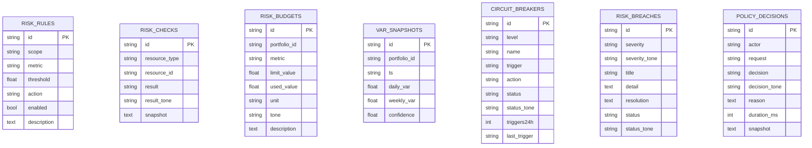

**图表来源**
- [backend/app/domains/risk/models.py:9-101](file://backend/app/domains/risk/models.py#L9-L101)

**章节来源**
- [backend/app/domains/risk/models.py:1-101](file://backend/app/domains/risk/models.py#L1-L101)

#### 组合与账户（Portfolio）
- 关键表
  - portfolios：组合主记录，含名称、基础货币、状态、所有者。
  - accounts：交易账户，含角色（托管/实盘/仿真/沙盒）、经纪商、是否实盘、额度、所属组合。
  - positions：当前持仓，含账户、标的、数量、成本、市值。
  - cash_balances：按币种的现金余额（可用/冻结）。
  - nav_snapshots：组合净值快照，含净值、日收益、杠杆。
  - rebalance_proposals：再平衡提案，含类型、标的变动、原因、影响、紧急度与状态。
- 索引与查询
  - account_id、symbol、portfolio_id、ts 等字段建立索引，支撑实时估值与风控。
- 性能建议
  - 对高频估值与再平衡流程采用增量更新与缓存，降低数据库压力。

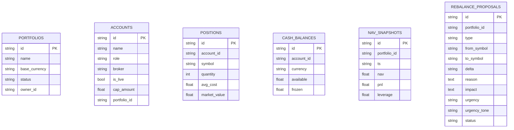

**图表来源**
- [backend/app/domains/portfolio/models.py:9-83](file://backend/app/domains/portfolio/models.py#L9-L83)

**章节来源**
- [backend/app/domains/portfolio/models.py:1-83](file://backend/app/domains/portfolio/models.py#L1-L83)

#### 数据与特征（Data）
- 关键表
  - data_sources：外部数据源配置与健康度指标（延迟、缺失率、漂移、许可证等）。
  - data_source_health：数据源健康快照。
  - market_bars_daily：日线 OHLCV（TimescaleDB 生产环境），唯一约束（symbol, trade_date）。
  - corporate_actions：公司行动（拆分、分红等）。
  - feature_sets：特征集注册、血缘哈希、校验状态、依赖与计算窗口。
  - feature_usages：策略版本与特征消费关系。
  - lineage_nodes/edges：数据血缘有向无环图节点与边，支持回溯与审计。
  - data_incidents：数据质量事件（延迟、缺失、漂移、许可证、停机、模式变更等）。
  - **stock_info：股票元数据表，存储股票中文名称、板块分类、ST标记等信息**。
- 索引与查询
  - symbol/trade_date、source_id、feature_id、strategy_version_id、node_type/ref_id、symbol 等字段建立索引。
- 性能建议
  - 日线数据使用时序数据库与分区表；特征与血缘采用物化视图与增量更新。

**更新** 新增StockInfo实体，包含以下字段：
- symbol：股票代码（唯一约束）
- name：股票中文名称
- board：板块分类（主板/创业板/科创板/北交所）
- is_st：是否ST标记
- last_synced_at：最后同步时间

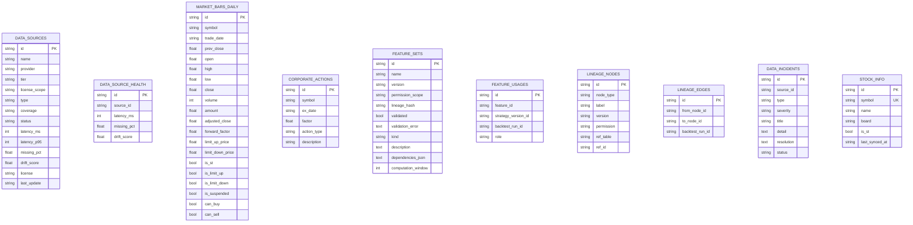

**图表来源**
- [backend/app/domains/data/models.py:68-86](file://backend/app/domains/data/models.py#L68-L86)
- [backend/app/domains/data/models.py:9-144](file://backend/app/domains/data/models.py#L9-L144)

**章节来源**
- [backend/app/domains/data/models.py:1-163](file://backend/app/domains/data/models.py#L1-L163)

#### 安全与权限（Security）
- 关键表
  - vault_keys：密钥管理（API/钱包/SSH/Webhook/数据库），含标签、类型、提供商、轮换/到期时间、有效期、状态、作用域与加密值。
  - ai_permissions：AI 工具权限规则，含类别、API 名称、允许状态与原因。
  - withdrawal_rules：取现守卫规则，含名称、描述与状态。
  - security_events：安全审计事件，含事件类型、严重程度、标题、参与者、详情、处置状态与说明。
- 索引与查询
  - key_type/provider/label、api_name、status 等字段建立索引，支撑权限与合规审计。
- 性能建议
  - 密钥轮换与到期提醒采用定时任务与事件通知，避免阻塞主业务。

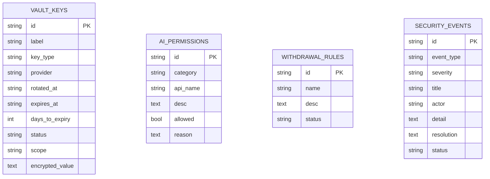

**图表来源**
- [backend/app/domains/security/models.py:9-59](file://backend/app/domains/security/models.py#L9-L59)

**章节来源**
- [backend/app/domains/security/models.py:1-59](file://backend/app/domains/security/models.py#L1-L59)

#### 协作与评审（Collaboration）
- 关键表
  - strategy_reviews：策略版本评审请求，含策略、版本区间、状态、优先级与创建者。
  - reviewer_decisions：评审人决策。
  - ab_tests：A/B 实验，含对照/实验策略、状态、持续天数、样本量、改进幅度。
- 索引与查询
  - strategy_id、from_version/to_version、review_id、status 等字段建立索引，支撑评审流程与实验管理。
- 性能建议
  - 评审与实验采用工作流引擎与状态机，减少数据库锁竞争。

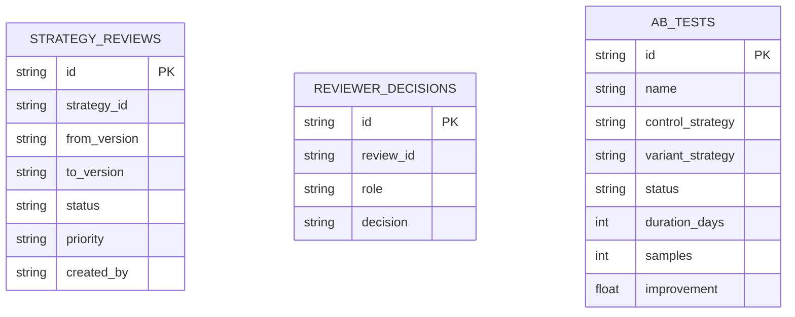

**图表来源**
- [backend/app/domains/collaboration/models.py:9-44](file://backend/app/domains/collaboration/models.py#L9-L44)

**章节来源**
- [backend/app/domains/collaboration/models.py:1-44](file://backend/app/domains/collaboration/models.py#L1-L44)

#### 审计与身份（Audit & Identity）
- 审计模型
  - audit_logs：不可变审计日志，含操作者、动作、资源、结果、置信度、链式哈希、IP 等。
  - idempotency_keys：幂等键，防止重复请求。
  - event_outbox：可靠事件发布箱，记录事件类型、载荷、状态与错误。
- 身份模型
  - organizations/users/roles/user_roles/sessions：组织、用户、角色、用户-角色映射、登录会话。
- 索引与查询
  - actor/action/resource_id/trace_id、key/scope、event_type/status 等字段建立索引，支撑审计与合规。
- 性能建议
  - 审计日志采用追加写与归档策略，避免热路径阻塞。

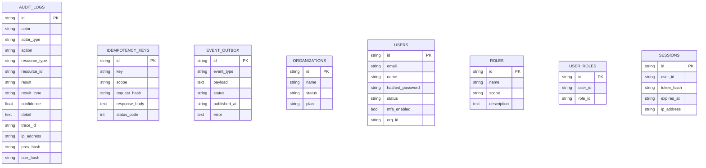

**图表来源**
- [backend/app/domains/audit/models.py:9-51](file://backend/app/domains/audit/models.py#L9-L51)
- [backend/app/domains/identity/models.py:9-60](file://backend/app/domains/identity/models.py#L9-L60)

**章节来源**
- [backend/app/domains/audit/models.py:1-51](file://backend/app/domains/audit/models.py#L1-L51)
- [backend/app/domains/identity/models.py:1-60](file://backend/app/domains/identity/models.py#L1-L60)

#### 股票信息实体（StockInfo）
**新增** StockInfo实体是本次数据架构扩展的核心组件，专门用于存储股票元数据信息。

- 实体定义
  - 继承自 BaseModel，具备标准的审计字段和租户隔离能力
  - 唯一约束：symbol（确保每个股票代码只有一条记录）
  - 主要字段：
    - symbol：股票代码（字符串，长度32，必填，建立索引）
    - name：股票中文名称（字符串，长度64，必填，默认空字符串）
    - board：板块分类（字符串，长度16，可选）
    - is_st：是否ST标记（布尔值，默认False）
    - last_synced_at：最后同步时间（字符串，长度64，可选）

- 数据来源与更新机制
  - 从 AKShare 的 stock_zh_a_spot 接口获取全量A股快照
  - 支持两种更新模式：
    - 全量同步：在市场数据全量同步过程中同时更新股票信息
    - 独立刷新：通过 /stock-info/refresh 端点单独刷新股票信息
  - 使用 SQLite ON CONFLICT DO UPDATE 语法实现UPSERT操作

- API端点
  - POST /stock-info/refresh：手动刷新股票信息
  - 返回包含更新数量和同步时间的响应

- 性能优化
  - 建立 org_id 和 symbol 索引以支持快速查询
  - 批量处理：每次最多500行，避免超过SQLite参数限制
  - 异常容错：股票信息更新失败不影响市场数据同步主流程

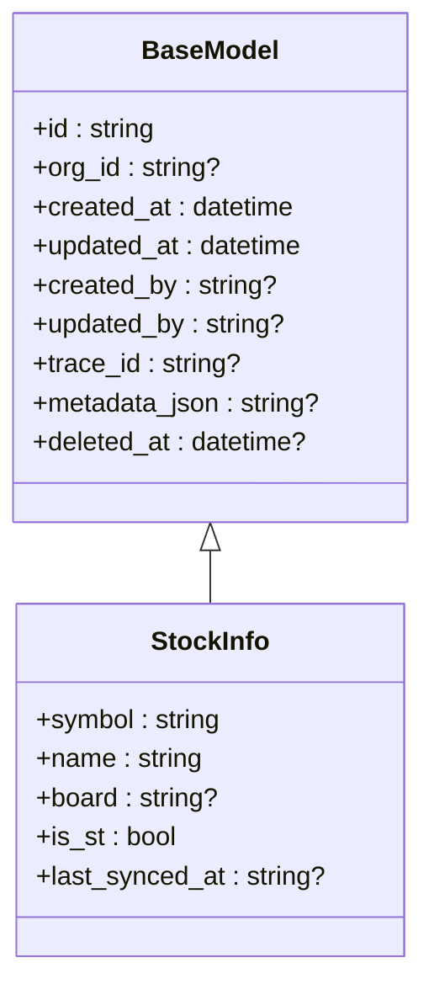

**图表来源**
- [backend/app/domains/data/models.py:68-86](file://backend/app/domains/data/models.py#L68-L86)
- [backend/app/db/migrations/versions/20260516_000002_stock_info.py:34-47](file://backend/app/db/migrations/versions/20260516_000002_stock_info.py#L34-L47)

**章节来源**
- [backend/app/domains/data/models.py:68-86](file://backend/app/domains/data/models.py#L68-L86)
- [backend/app/db/migrations/versions/20260516_000002_stock_info.py:1-53](file://backend/app/db/migrations/versions/20260516_000002_stock_info.py#L1-L53)
- [backend/app/api/v1/data.py:317-331](file://backend/app/api/v1/data.py#L317-L331)
- [backend/app/services/market_data_full_sync.py:146-192](file://backend/app/services/market_data_full_sync.py#L146-L192)

## 依赖关系分析
- 组件耦合
  - 所有领域模型均继承自 BaseModel，统一审计与租户字段，降低跨领域重复代码。
  - 会话工厂与依赖注入贯穿 API 层，确保一致的事务边界与异常处理。
  - **StockInfo实体与MarketBarDaily模型通过symbol字段建立关联，支持股票名称显示和搜索功能**。
- 外部依赖
  - SQLAlchemy 异步驱动、Alembic 迁移工具、PostgreSQL/SQLite 驱动。
  - AKShare 库用于获取股票元数据。
- 潜在循环依赖
  - 当前模型间通过字符串外键引用，未发现直接循环依赖；若引入双向关系需谨慎设计。

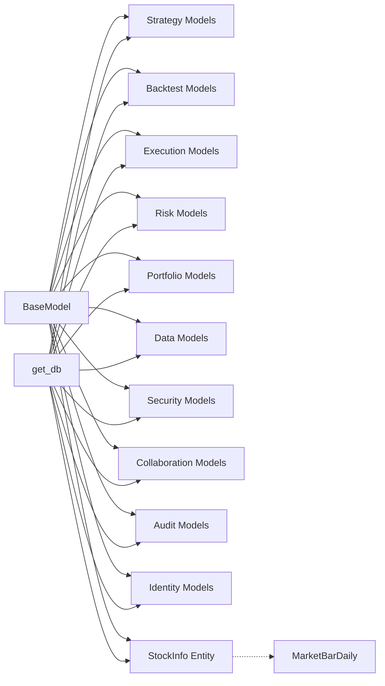

**图表来源**
- [backend/app/db/base_class.py:17-31](file://backend/app/db/base_class.py#L17-L31)
- [backend/app/db/session.py:24-34](file://backend/app/db/session.py#L24-L34)
- [backend/app/domains/data/models.py:68-86](file://backend/app/domains/data/models.py#L68-L86)
- [backend/app/domains/data/models.py:60-67](file://backend/app/domains/data/models.py#L60-L67)

**章节来源**
- [backend/app/db/base_class.py:17-31](file://backend/app/db/base_class.py#L17-L31)
- [backend/app/db/session.py:24-34](file://backend/app/db/session.py#L24-L34)

## 性能考量
- 索引策略
  - 高频过滤字段（如 owner_id、strategy_id、account_id、symbol、status、segment、trade_date、event_type、resource_id 等）建立索引，避免全表扫描。
  - **StockInfo实体建立 symbol 唯一索引和 org_id 索引，支持快速查找和去重**。
  - 对唯一约束（如 market_bars_daily 的 symbol+trade_date、stock_info 的 symbol）减少重复与冲突。
- 写入优化
  - 批量插入与异步提交；对审计与事件表采用追加写与归档。
  - 对高频指标（execution_metrics、risk_checks、nav_snapshots）采用物化视图或缓存。
  - **StockInfo实体使用 SQLite ON CONFLICT DO UPDATE 语法，支持高效的UPSERT操作**。
- 查询优化
  - 使用复合索引与覆盖索引；避免 SELECT *，仅取必要字段。
  - 分页查询使用游标或基于索引的 LIMIT/OFFSET。
  - **StockInfo与MarketBarDaily通过LEFT JOIN实现股票名称显示，支持模糊搜索**。
- 存储与时序
  - 日线与净值曲线等时间序列数据使用时序数据库或分区表，提升查询与压缩效率。
- 并发控制
  - 异步会话避免阻塞；对热点行使用乐观锁或重试机制；对幂等写入使用 idempotency_keys。
  - **StockInfo批量处理控制在500行以内，避免超过SQLite参数限制**。

**更新** 新增StockInfo实体的性能考量：
- 建立 symbol 唯一约束和索引，确保查询性能
- 使用批量UPSERT操作，支持高效的数据同步
- 异常容错机制，确保股票信息更新失败不影响主流程

## 故障排查指南
- 迁移失败
  - 检查 alembic.ini 中 sqlalchemy.url 与数据库连通性；确认脚本位置与 sys.path 正确。
  - **验证 stock_info 表结构，确认唯一约束和索引已正确创建**。
- 会话异常
  - get_db 在异常时自动回滚并关闭会话，排查上游异常栈定位问题。
- 审计与幂等
  - 审计日志不可变，若出现重复请求，检查 idempotency_keys 是否正确命中。
- 血缘与特征
  - 特征集校验失败时，核对 lineage_hash 与依赖 JSON；检查 feature_usages 与 backtest_run_id 关联。
- **StockInfo实体故障排查**
  - **检查 AKShare 接口是否正常返回数据**：确认 _fetch_market_symbols 函数能够成功获取股票列表
  - **验证数据库连接**：确认 stock_info 表存在且具有正确的索引
  - **检查批量处理**：确认每次处理不超过500行，避免SQLite参数限制
  - **监控异常容错**：观察 upsert_stock_info 函数的异常处理逻辑

**更新** 新增StockInfo实体的故障排查指南：
- 迁移失败：检查 stock_info 表的唯一约束和索引创建
- 数据同步失败：检查 AKShare 接口访问权限和网络连接
- 批量处理异常：监控 SQLite 参数数量限制
- 查询性能问题：验证 symbol 索引的使用情况

**章节来源**
- [backend/alembic.ini:58](file://backend/alembic.ini#L58)
- [backend/app/db/session.py:24-34](file://backend/app/db/session.py#L24-L34)
- [backend/app/domains/audit/models.py:29-51](file://backend/app/domains/audit/models.py#L29-L51)
- [backend/app/domains/data/models.py:81-107](file://backend/app/domains/data/models.py#L81-L107)
- [backend/app/services/market_data_full_sync.py:104-121](file://backend/app/services/market_data_full_sync.py#L104-L121)
- [backend/app/services/market_data_full_sync.py:146-192](file://backend/app/services/market_data_full_sync.py#L146-L192)

## 结论
本数据架构以 SQLAlchemy 异步 ORM 为核心，通过统一的 BaseModel 抽象与严格的索引/约束设计，支撑策略、回测、执行、风险、组合、数据、安全、协作、审计与身份等核心领域的数据模型。配合 Alembic 迁移与异步会话管理，实现了可演进、可观测、可维护的数据层。

**更新** 最新的架构扩展包括新增的StockInfo实体，专门用于存储股票元数据信息，包括股票中文名称、板块分类、ST标记等，为数据展示和过滤提供了更好的支持。该实体通过AKShare接口获取全量A股快照数据，支持独立刷新和全量同步两种更新模式，具备高效的批量处理能力和异常容错机制。

建议在生产中进一步完善时序数据存储、物化视图与缓存策略，以满足高并发与低延迟需求。同时，StockInfo实体的引入为后续的数据质量监控、风险控制和用户体验优化奠定了坚实的基础。

## 附录
- 依赖与版本
  - SQLAlchemy 异步驱动、Alembic、PostgreSQL/SQLite 驱动等在项目依赖中明确声明。
  - **新增 AKShare 库依赖，用于获取股票元数据**。
- 配置参考
  - 数据库 URL、日志级别、脚本位置等在 alembic.ini 中集中配置。
- **StockInfo实体使用示例**
  - **API端点：POST /stock-info/refresh 用于手动刷新股票信息**
  - **批量处理：upsert_stock_info 函数支持最多500行的批量UPSERT操作**
  - **异常容错：股票信息更新失败不影响市场数据同步主流程**

**更新** 新增StockInfo实体的配置和使用参考：
- 迁移脚本：20260516_000002_stock_info.py
- API端点：/stock-info/refresh
- 批量处理：upsert_stock_info函数
- 脚本工具：scripts/refresh_stock_info_once.py

**章节来源**
- [backend/pyproject.toml:7-27](file://backend/pyproject.toml#L7-L27)
- [backend/alembic.ini:58](file://backend/alembic.ini#L58)
- [backend/app/db/migrations/versions/20260516_000002_stock_info.py:1-53](file://backend/app/db/migrations/versions/20260516_000002_stock_info.py#L1-L53)
- [backend/app/api/v1/data.py:317-331](file://backend/app/api/v1/data.py#L317-L331)
- [backend/app/services/market_data_full_sync.py:146-192](file://backend/app/services/market_data_full_sync.py#L146-L192)
- [backend/scripts/refresh_stock_info_once.py:1-39](file://backend/scripts/refresh_stock_info_once.py#L1-L39)