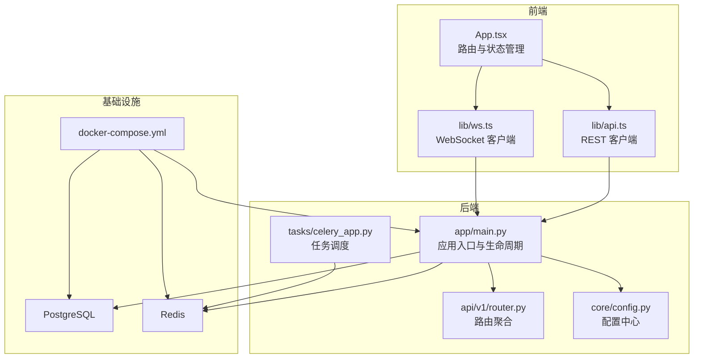
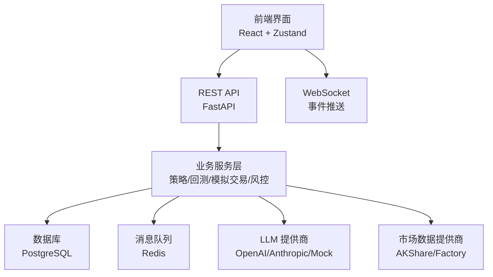
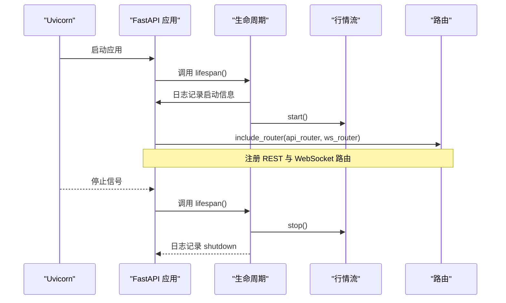
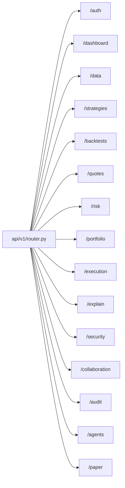
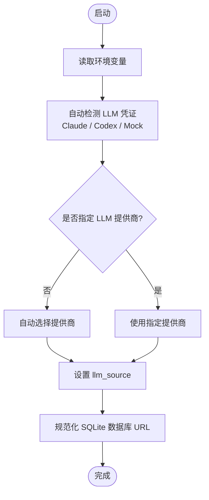
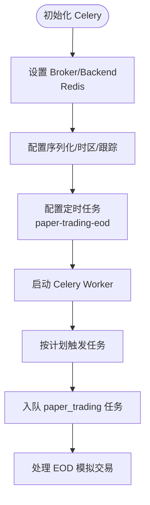
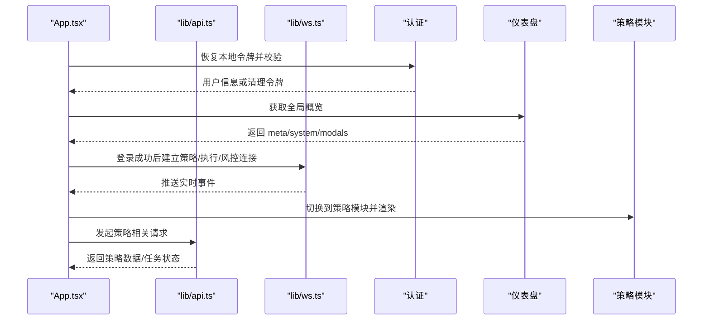
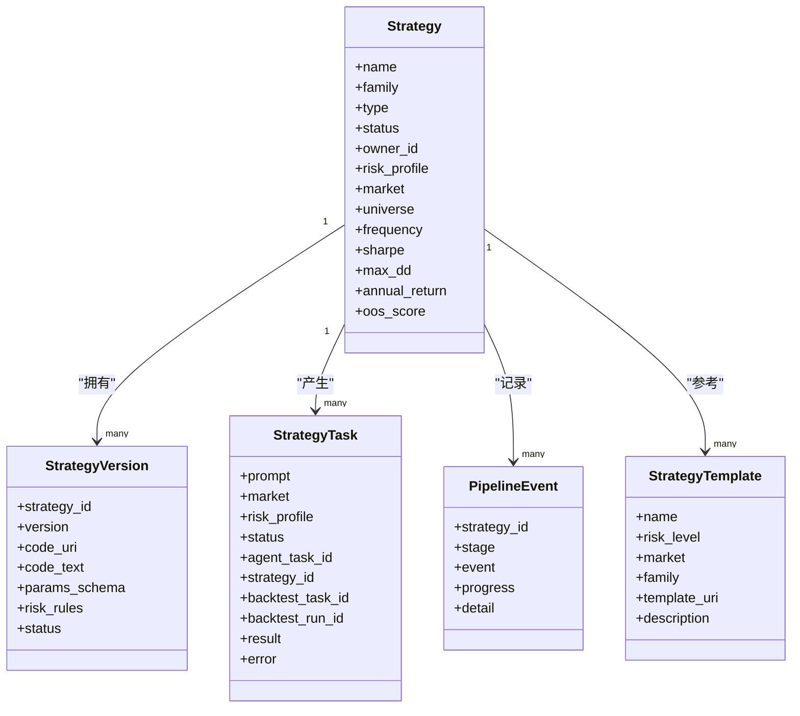
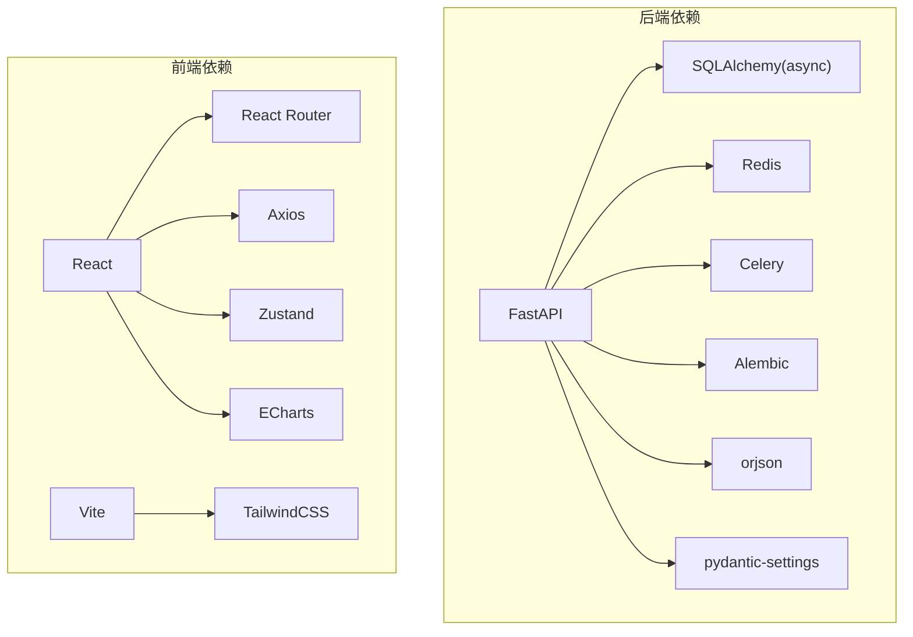

# 整体架构设计

<cite>
**本文引用的文件**
- [backend/README.md](file://backend/README.md)
- [frontend/README.md](file://frontend/README.md)
- [backend/pyproject.toml](file://backend/pyproject.toml)
- [frontend/package.json](file://frontend/package.json)
- [backend/app/main.py](file://backend/app/main.py)
- [backend/app/api/v1/router.py](file://backend/app/api/v1/router.py)
- [backend/app/core/config.py](file://backend/app/core/config.py)
- [backend/app/tasks/celery_app.py](file://backend/app/tasks/celery_app.py)
- [deploy/docker-compose.yml](file://deploy/docker-compose.yml)
- [frontend/src/App.tsx](file://frontend/src/App.tsx)
- [frontend/src/lib/api.ts](file://frontend/src/lib/api.ts)
- [frontend/src/lib/ws.ts](file://frontend/src/lib/ws.ts)
- [backend/app/domains/strategy/models.py](file://backend/app/domains/strategy/models.py)
- [backend/app/services/agent_orchestrator.py](file://backend/app/services/agent_orchestrator.py)
- [backend/app/integrations/llm/base.py](file://backend/app/integrations/llm/base.py)
- [backend/app/integrations/market_data/base.py](file://backend/app/integrations/market_data/base.py)
</cite>

## 目录
1. [引言](#引言)
2. [项目结构](#项目结构)
3. [核心组件](#核心组件)
4. [架构总览](#架构总览)
5. [详细组件分析](#详细组件分析)
6. [依赖分析](#依赖分析)
7. [性能考量](#性能考量)
8. [故障排查指南](#故障排查指南)
9. [结论](#结论)
10. [附录](#附录)

## 引言
本文件为 llmine-quant 的整体架构设计文档，面向开发者与技术管理者，系统化阐述系统的高层架构模式、前后端分离的微服务架构、事件驱动的业务流程、分层架构设计以及组件间的交互关系。文档重点解释 FastAPI 后端与 React 前端的设计理念，包括 RESTful API 架构、WebSocket 实时通信、状态管理模式，并覆盖系统边界、数据流向、安全架构与可扩展性设计，同时提供架构决策记录与权衡考虑，帮助团队理解设计思路与未来演进方向。

## 项目结构
llmine-quant 采用前后端分离的 Monorepo 结构：
- 后端（Python/FastAPI）：提供 REST API、WebSocket、任务调度、数据库访问与集成能力。
- 前端（React + TypeScript + Vite）：通过 REST API 与 WebSocket 实时订阅，实现仪表盘与各功能模块的交互。
- 部署（Docker Compose）：统一编排数据库、缓存与 API 服务，便于本地开发与生产部署。

图表来源
- [backend/app/main.py:1-65](file://backend/app/main.py#L1-L65)
- [backend/app/api/v1/router.py:1-40](file://backend/app/api/v1/router.py#L1-L40)
- [backend/app/core/config.py:1-196](file://backend/app/core/config.py#L1-L196)
- [backend/app/tasks/celery_app.py:1-42](file://backend/app/tasks/celery_app.py#L1-L42)
- [deploy/docker-compose.yml:1-59](file://deploy/docker-compose.yml#L1-L59)

章节来源
- [backend/README.md:1-45](file://backend/README.md#L1-L45)
- [frontend/README.md:1-74](file://frontend/README.md#L1-L74)
- [backend/pyproject.toml:1-78](file://backend/pyproject.toml#L1-L78)
- [frontend/package.json:1-43](file://frontend/package.json#L1-L43)

## 核心组件
- 应用入口与生命周期（FastAPI）
  - 负责中间件注册、异常处理、路由挂载与应用生命周期管理。
  - 启动时初始化市场行情流，关闭时优雅停止。
- 路由聚合（API v1）
  - 将认证、仪表盘、数据、策略工厂、回测实验室、执行中心、解释与血缘、组合驾驶舱、风险控制、安全与金库、协作实验室、审计追踪、Agent 编排、模拟交易等子路由按标签组织。
- 配置中心（Settings）
  - 统一加载环境变量、数据库连接、Redis 连接、CORS、分页参数、市场数据与 LLM 提供商配置；支持从用户主目录自动检测 LLM 凭证。
- 任务调度（Celery）
  - 基于 Redis 作为消息代理，定时执行每日 EOD 模拟交易批处理任务。
- 前端应用
  - 使用 React + Zustand 管理全局状态，Axios 发起 REST 请求，WebSocket 订阅实时事件，路由按模块划分，支持命令面板与 Kill Switch 等全局操作。
- 基础设施
  - PostgreSQL 存储业务数据；Redis 支持缓存与任务队列；Docker Compose 统一编排。

章节来源
- [backend/app/main.py:1-65](file://backend/app/main.py#L1-L65)
- [backend/app/api/v1/router.py:1-40](file://backend/app/api/v1/router.py#L1-L40)
- [backend/app/core/config.py:1-196](file://backend/app/core/config.py#L1-L196)
- [backend/app/tasks/celery_app.py:1-42](file://backend/app/tasks/celery_app.py#L1-L42)
- [frontend/src/App.tsx:1-299](file://frontend/src/App.tsx#L1-L299)
- [frontend/src/lib/api.ts:1-778](file://frontend/src/lib/api.ts#L1-L778)
- [frontend/src/lib/ws.ts:1-95](file://frontend/src/lib/ws.ts#L1-L95)
- [deploy/docker-compose.yml:1-59](file://deploy/docker-compose.yml#L1-L59)

## 架构总览
llmine-quant 采用“前后端分离 + 微服务化”的架构模式：
- 后端以 FastAPI 为核心，提供 REST API 与 WebSocket，按模块拆分路由，使用 SQLAlchemy 进行异步数据库访问，Celery 执行后台任务。
- 前端以 React 为核心，通过 Axios 与后端交互，通过 WebSocket 实时订阅策略、执行与风控事件，Zustand 管理全局状态。
- 事件驱动体现在 WebSocket 实时推送与 Celery 任务队列，支撑策略生成、回测、模拟交易与风控告警等业务流程。
- 分层架构体现为：表现层（前端）、接口层（FastAPI 路由）、业务层（服务与领域模型）、数据层（数据库与外部数据提供商）。

图表来源
- [backend/app/main.py:1-65](file://backend/app/main.py#L1-L65)
- [backend/app/api/v1/router.py:1-40](file://backend/app/api/v1/router.py#L1-L40)
- [backend/app/core/config.py:1-196](file://backend/app/core/config.py#L1-L196)
- [backend/app/tasks/celery_app.py:1-42](file://backend/app/tasks/celery_app.py#L1-L42)
- [frontend/src/lib/api.ts:1-778](file://frontend/src/lib/api.ts#L1-L778)
- [frontend/src/lib/ws.ts:1-95](file://frontend/src/lib/ws.ts#L1-L95)

## 详细组件分析

### 后端应用入口与生命周期
- 生命周期钩子在启动时打印应用信息与配置摘要，启动市场行情流；在关闭时优雅停止行情流。
- 中间件包含 CORS 与链路追踪；异常处理器统一处理业务异常与通用异常。
- 路由挂载 REST 与 WebSocket，健康检查端点返回版本信息。

图表来源
- [backend/app/main.py:1-65](file://backend/app/main.py#L1-L65)

章节来源
- [backend/app/main.py:1-65](file://backend/app/main.py#L1-L65)

### API v1 路由聚合
- 路由按模块聚合，统一前缀与标签，便于 OpenAPI 文档生成与维护。
- 包含认证、仪表盘、数据、策略工厂、回测实验室、执行中心、解释与血缘、组合驾驶舱、风险控制、安全与金库、协作实验室、审计追踪、Agent 编排、模拟交易等。

图表来源
- [backend/app/api/v1/router.py:1-40](file://backend/app/api/v1/router.py#L1-L40)

章节来源
- [backend/app/api/v1/router.py:1-40](file://backend/app/api/v1/router.py#L1-L40)

### 配置中心（Settings）
- 加载数据库、Redis、CORS、分页、市场数据与 LLM 提供商等配置。
- 自动检测 Claude 与 Codex 的本地配置，优先级为显式环境变量 > Claude > Codex > mock。
- 支持 SQLite 相对路径规范化，确保多进程工作目录不一致时仍指向同一文件。

图表来源
- [backend/app/core/config.py:1-196](file://backend/app/core/config.py#L1-L196)

章节来源
- [backend/app/core/config.py:1-196](file://backend/app/core/config.py#L1-L196)

### 任务调度（Celery）
- 以 Redis 为 Broker 与 Backend，序列化为 JSON，启用 UTC 与时区设置。
- 定时任务：每周一至周五下午 15:30（CST）执行所有账户的 EOD 模拟交易。
- 任务选项：开启任务跟踪、延迟确认、限制每工人任务数，提升稳定性。

图表来源
- [backend/app/tasks/celery_app.py:1-42](file://backend/app/tasks/celery_app.py#L1-L42)

章节来源
- [backend/app/tasks/celery_app.py:1-42](file://backend/app/tasks/celery_app.py#L1-L42)

### 前端应用与状态管理
- App.tsx 负责全局状态（当前用户、侧边栏折叠、屏幕切换、模态框、全局数据），登录态恢复与 401 处理，WebSocket 连接生命周期管理。
- lib/api.ts 封装 REST 客户端，统一鉴权头、错误处理与 401 清理令牌；类型定义覆盖策略、回测、组合、执行、风险、数据、安全、协作、审计、模拟交易等。
- lib/ws.ts 提供 WebSocket 客户端，支持自动重连、主题订阅与事件派发，分别用于策略、执行与风控主题。

图表来源
- [frontend/src/App.tsx:1-299](file://frontend/src/App.tsx#L1-L299)
- [frontend/src/lib/api.ts:1-778](file://frontend/src/lib/api.ts#L1-L778)
- [frontend/src/lib/ws.ts:1-95](file://frontend/src/lib/ws.ts#L1-L95)

章节来源
- [frontend/src/App.tsx:1-299](file://frontend/src/App.tsx#L1-L299)
- [frontend/src/lib/api.ts:1-778](file://frontend/src/lib/api.ts#L1-L778)
- [frontend/src/lib/ws.ts:1-95](file://frontend/src/lib/ws.ts#L1-L95)

### 领域模型与服务
- 策略领域模型：策略主表、版本、任务、流水线事件与模板，支撑策略全生命周期管理。
- Agent Orchestration：封装 AgentTask 与 AgentMessage 的持久化与派发，支持角色解析、优先级与关联 ID。
- LLM Provider 抽象：定义消息格式与结构化输出能力，屏蔽具体提供商差异。
- 市场数据 Provider 抽象：定义历史与快照接口、交易时段判断与数据模型，支持多提供商工厂注册。

图表来源
- [backend/app/domains/strategy/models.py:1-84](file://backend/app/domains/strategy/models.py#L1-L84)

章节来源
- [backend/app/domains/strategy/models.py:1-84](file://backend/app/domains/strategy/models.py#L1-L84)
- [backend/app/services/agent_orchestrator.py:1-105](file://backend/app/services/agent_orchestrator.py#L1-L105)
- [backend/app/integrations/llm/base.py:1-75](file://backend/app/integrations/llm/base.py#L1-L75)
- [backend/app/integrations/market_data/base.py:1-113](file://backend/app/integrations/market_data/base.py#L1-L113)

## 依赖分析
- 后端依赖
  - Web：FastAPI、Uvicorn、WebSockets
  - 数据库：SQLAlchemy（异步）、Alembic 迁移
  - 缓存/消息：Redis、Celery
  - 工具：Pydantic/Settings、Structlog、HTTPX、Prometheus、Passlib/Bcrypt、JWKS
- 前端依赖
  - React 生态：React、React Router、Axios
  - 可视化：ECharts
  - 状态管理：Zustand
  - 构建：Vite、TailwindCSS

图表来源
- [backend/pyproject.toml:1-78](file://backend/pyproject.toml#L1-L78)
- [frontend/package.json:1-43](file://frontend/package.json#L1-L43)

章节来源
- [backend/pyproject.toml:1-78](file://backend/pyproject.toml#L1-L78)
- [frontend/package.json:1-43](file://frontend/package.json#L1-L43)

## 性能考量
- 异步与并发
  - 后端使用 SQLAlchemy 异步引擎与 FastAPI 异步路由，降低 I/O 阻塞。
  - WebSocket 与 REST 并行运行，避免阻塞。
- 缓存与队列
  - Redis 作为缓存与任务队列，减轻数据库压力；Celery 任务支持延迟确认与任务跟踪，提升可靠性。
- 数据库与迁移
  - Alembic 管理数据库版本，建议在生产中严格控制迁移策略与回滚预案。
- 前端性能
  - 按需渲染与路由懒加载；Zustand 精简状态更新；ECharts 图表按需加载。
- 网络与安全
  - CORS 白名单配置；JWT 令牌管理；401 自动登出与本地存储令牌清理。

## 故障排查指南
- 健康检查
  - 后端提供 /health 端点返回状态与版本；前端登录失败或 401 会触发自动登出。
- WebSocket 连接
  - 自动重连机制与指数退避；若连接异常，检查后端 WebSocket 路由与前端协议推断（http/https → ws/wss）。
- 任务调度
  - 确认 Redis 可达；查看 Celery Beat 与 Worker 日志；核对定时任务配置与队列名称。
- 数据库
  - 使用 Alembic 升级；SQLite 相对路径规范化避免跨工作目录问题；生产环境建议 PostgreSQL。
- LLM 与市场数据
  - 若未显式配置，系统会尝试自动检测本地凭据；否则回退到 mock；检查提供商可用性与网络。

章节来源
- [backend/app/main.py:61-65](file://backend/app/main.py#L61-L65)
- [frontend/src/App.tsx:55-74](file://frontend/src/App.tsx#L55-L74)
- [frontend/src/lib/ws.ts:40-68](file://frontend/src/lib/ws.ts#L40-L68)
- [backend/app/tasks/celery_app.py:35-41](file://backend/app/tasks/celery_app.py#L35-L41)
- [backend/app/core/config.py:177-190](file://backend/app/core/config.py#L177-L190)

## 结论
llmine-quant 通过前后端分离与微服务化设计，结合事件驱动与分层架构，实现了从策略生成、回测评估、模拟交易到实时风控的完整闭环。FastAPI 与 React 的组合提供了高性能与良好的开发体验；Redis 与 Celery 支撑了可靠的异步任务体系；配置中心与抽象层提升了可扩展性与可维护性。未来演进方向可围绕可观测性增强、多租户与权限模型扩展、LLM 与市场数据提供商的进一步解耦与弹性扩缩容等方面推进。

## 附录
- 开发与部署
  - 后端本地开发：安装依赖、执行迁移、种子数据、启动 API 与 Celery Worker。
  - 前端本地开发：安装依赖、启动 Vite 开发服务器。
  - Docker Compose：一键编排数据库、缓存与 API 服务。

章节来源
- [backend/README.md:5-45](file://backend/README.md#L5-L45)
- [frontend/README.md:1-74](file://frontend/README.md#L1-L74)
- [deploy/docker-compose.yml:1-59](file://deploy/docker-compose.yml#L1-L59)