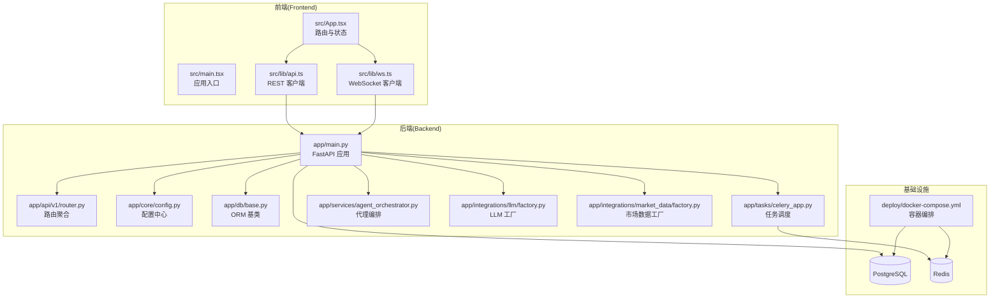
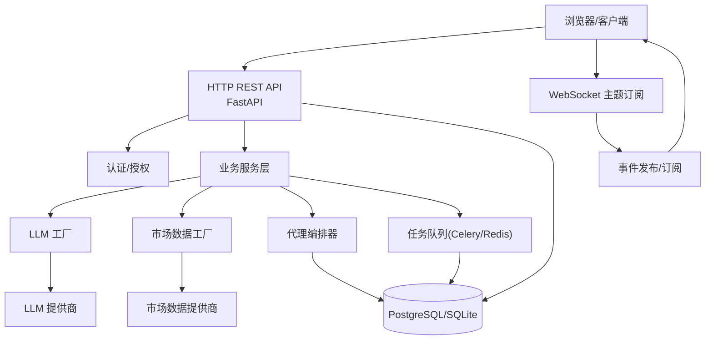
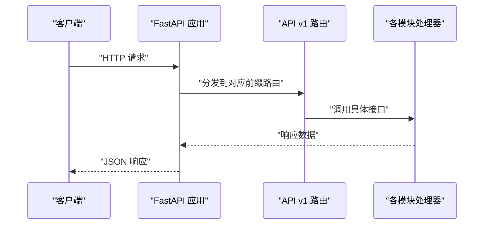
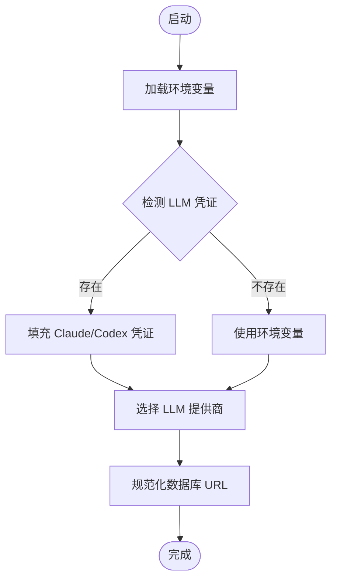
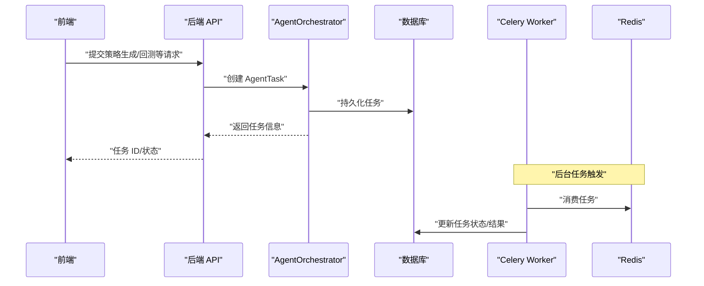
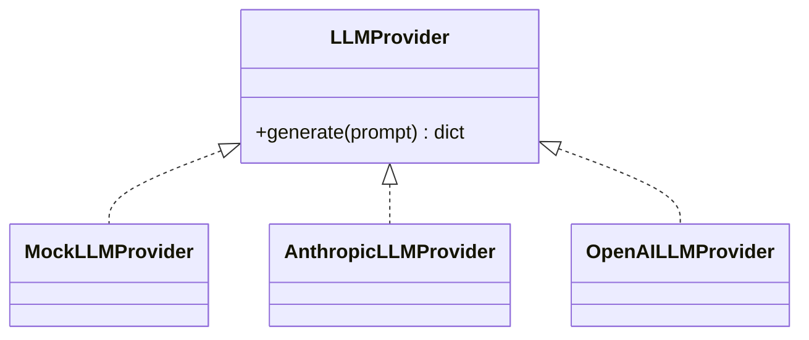
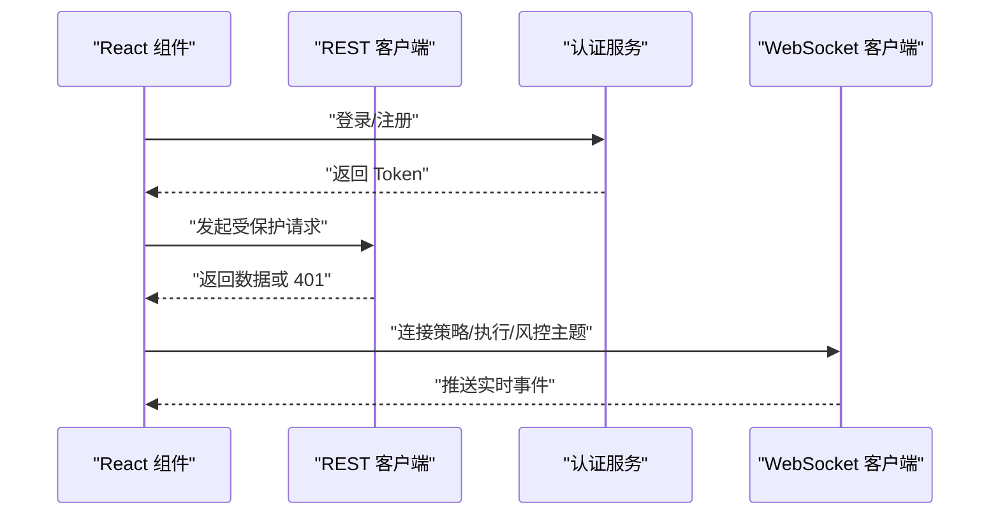
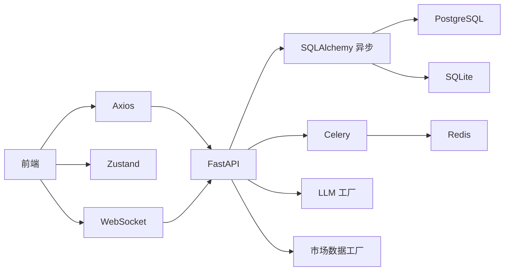

# 系统架构

<cite>
**本文引用的文件**
- [backend/README.md](file://backend/README.md)
- [frontend/README.md](file://frontend/README.md)
- [backend/pyproject.toml](file://backend/pyproject.toml)
- [frontend/package.json](file://frontend/package.json)
- [backend/app/main.py](file://backend/app/main.py)
- [backend/app/api/v1/router.py](file://backend/app/api/v1/router.py)
- [backend/app/core/config.py](file://backend/app/core/config.py)
- [backend/app/db/base.py](file://backend/app/db/base.py)
- [frontend/src/main.tsx](file://frontend/src/main.tsx)
- [frontend/src/App.tsx](file://frontend/src/App.tsx)
- [deploy/docker-compose.yml](file://deploy/docker-compose.yml)
- [backend/app/services/agent_orchestrator.py](file://backend/app/services/agent_orchestrator.py)
- [backend/app/tasks/celery_app.py](file://backend/app/tasks/celery_app.py)
- [backend/app/integrations/llm/factory.py](file://backend/app/integrations/llm/factory.py)
- [backend/app/integrations/market_data/factory.py](file://backend/app/integrations/market_data/factory.py)
- [frontend/src/lib/api.ts](file://frontend/src/lib/api.ts)
- [frontend/src/lib/ws.ts](file://frontend/src/lib/ws.ts)
</cite>

## 目录
1. [引言](#引言)
2. [项目结构](#项目结构)
3. [核心组件](#核心组件)
4. [架构总览](#架构总览)
5. [详细组件分析](#详细组件分析)
6. [依赖分析](#依赖分析)
7. [性能考量](#性能考量)
8. [故障排查指南](#故障排查指南)
9. [结论](#结论)
10. [附录](#附录)

## 引言
本架构文档面向 llmine-quant 系统，目标是为开发者与架构师提供一份全面、可操作的技术蓝图。系统采用前后端分离的微服务架构，后端以 FastAPI 为核心，结合事件驱动与任务队列实现异步处理；前端基于 React 19 与 Zustand 状态管理，通过 WebSocket 实时订阅关键业务主题。数据库使用 SQLAlchemy（异步）与 Alembic 迁移，Redis 作为消息中间件与 Celery 任务队列后端，PostgreSQL 提供持久化存储。系统支持多 LLM 供应商（Anthropic/OpenAI/Mock），并内置市场数据适配器工厂，便于扩展。

## 项目结构
系统采用“monorepo”式组织：前端与后端分别位于独立目录，共享仓库根路径下的部署与文档资源。后端通过 Uvicorn 提供 HTTP API，Celery Worker 处理后台任务；前端通过 Vite 构建，Axios 发起 REST 请求，Zustand 管理状态，WebSocket 订阅实时事件流。

图表来源
- [backend/app/main.py:1-65](file://backend/app/main.py#L1-L65)
- [backend/app/api/v1/router.py:1-40](file://backend/app/api/v1/router.py#L1-L40)
- [backend/app/core/config.py:1-196](file://backend/app/core/config.py#L1-L196)
- [backend/app/db/base.py:1-10](file://backend/app/db/base.py#L1-L10)
- [backend/app/tasks/celery_app.py:1-42](file://backend/app/tasks/celery_app.py#L1-L42)
- [backend/app/services/agent_orchestrator.py:1-105](file://backend/app/services/agent_orchestrator.py#L1-L105)
- [backend/app/integrations/llm/factory.py:1-66](file://backend/app/integrations/llm/factory.py#L1-L66)
- [backend/app/integrations/market_data/factory.py:1-57](file://backend/app/integrations/market_data/factory.py#L1-L57)
- [frontend/src/main.tsx:1-12](file://frontend/src/main.tsx#L1-L12)
- [frontend/src/App.tsx:1-299](file://frontend/src/App.tsx#L1-L299)
- [frontend/src/lib/api.ts:1-778](file://frontend/src/lib/api.ts#L1-L778)
- [frontend/src/lib/ws.ts:1-95](file://frontend/src/lib/ws.ts#L1-L95)
- [deploy/docker-compose.yml:1-59](file://deploy/docker-compose.yml#L1-L59)

章节来源
- [backend/README.md:1-45](file://backend/README.md#L1-L45)
- [frontend/README.md:1-74](file://frontend/README.md#L1-L74)
- [backend/pyproject.toml:1-78](file://backend/pyproject.toml#L1-L78)
- [frontend/package.json:1-43](file://frontend/package.json#L1-L43)

## 核心组件
- 后端应用与生命周期
  - FastAPI 应用在启动时初始化日志、Tracing 中间件、CORS、异常处理器，并注册各模块路由与 WebSocket 路由；应用生命周期中启动行情流并优雅停止。
- 配置中心
  - 使用 Pydantic Settings 统一加载环境变量，支持自动检测 Claude/Codex 凭证，统一数据库与 Redis 连接、CORS、分页参数、LLM 与市场数据提供商等。
- 数据库与会话
  - SQLAlchemy 异步 ORM 基类，配合 Alembic 进行迁移管理，支持 SQLite 文件与 PostgreSQL。
- 任务与事件
  - Celery 作为任务队列与定时任务调度器，Redis 作为 Broker/Backend；AgentOrchestrator 将代理任务与消息持久化，支持跟踪 ID 与关联 ID。
- LLM 与市场数据工厂
  - 运行时根据配置选择 LLM 提供商（Mock/Anthropic/OpenAI），或回退到 Mock；市场数据工厂按配置选择 AKShare/Tushare/Wind 或 Mock。
- 前端应用
  - React 19 + TypeScript，Zustand 管理全局状态；Axios 封装 REST 客户端，WebSocket 客户端负责订阅策略、执行、风控主题；登录态通过本地存储维护。

章节来源
- [backend/app/main.py:1-65](file://backend/app/main.py#L1-L65)
- [backend/app/core/config.py:1-196](file://backend/app/core/config.py#L1-L196)
- [backend/app/db/base.py:1-10](file://backend/app/db/base.py#L1-L10)
- [backend/app/tasks/celery_app.py:1-42](file://backend/app/tasks/celery_app.py#L1-L42)
- [backend/app/services/agent_orchestrator.py:1-105](file://backend/app/services/agent_orchestrator.py#L1-L105)
- [backend/app/integrations/llm/factory.py:1-66](file://backend/app/integrations/llm/factory.py#L1-L66)
- [backend/app/integrations/market_data/factory.py:1-57](file://backend/app/integrations/market_data/factory.py#L1-L57)
- [frontend/src/App.tsx:1-299](file://frontend/src/App.tsx#L1-L299)
- [frontend/src/lib/api.ts:1-778](file://frontend/src/lib/api.ts#L1-L778)
- [frontend/src/lib/ws.ts:1-95](file://frontend/src/lib/ws.ts#L1-L95)

## 架构总览
系统采用“API + 任务队列 + 实时事件”的混合架构：
- API 层：FastAPI 提供 REST 接口，OpenAPI 文档自动生成，支持健康检查与认证。
- 任务层：Celery + Redis 执行周期性与异步任务（如盘后模拟交易结算）。
- 事件层：WebSocket 主题订阅，前端按需连接策略、执行、风控主题，实现低延迟交互。
- 数据层：PostgreSQL 存储业务数据；SQLite 可用于本地开发；Alembic 管理迁移。
- 集成层：LLM 工厂与市场数据工厂解耦具体供应商，便于替换与扩展。

图表来源
- [backend/app/main.py:1-65](file://backend/app/main.py#L1-L65)
- [backend/app/api/v1/router.py:1-40](file://backend/app/api/v1/router.py#L1-L40)
- [backend/app/tasks/celery_app.py:1-42](file://backend/app/tasks/celery_app.py#L1-L42)
- [backend/app/services/agent_orchestrator.py:1-105](file://backend/app/services/agent_orchestrator.py#L1-L105)
- [backend/app/integrations/llm/factory.py:1-66](file://backend/app/integrations/llm/factory.py#L1-L66)
- [backend/app/integrations/market_data/factory.py:1-57](file://backend/app/integrations/market_data/factory.py#L1-L57)
- [frontend/src/lib/api.ts:1-778](file://frontend/src/lib/api.ts#L1-L778)
- [frontend/src/lib/ws.ts:1-95](file://frontend/src/lib/ws.ts#L1-L95)

## 详细组件分析

### 后端应用与路由
- 应用入口负责：
  - 初始化日志与 Tracing 中间件
  - 注册 CORS、异常处理器
  - 聚合 API v1 路由与 WebSocket 路由
  - 生命周期内启动行情流并在关闭时停止
- 路由聚合将认证、仪表盘、数据、策略工厂、回测实验室、行情、风控、组合驾驶舱、交易审批、解释与血缘、安全与金库、协作实验室、审计追踪、代理编排、模拟交易等模块化路由集中挂载。

图表来源
- [backend/app/main.py:1-65](file://backend/app/main.py#L1-L65)
- [backend/app/api/v1/router.py:1-40](file://backend/app/api/v1/router.py#L1-L40)

章节来源
- [backend/app/main.py:1-65](file://backend/app/main.py#L1-L65)
- [backend/app/api/v1/router.py:1-40](file://backend/app/api/v1/router.py#L1-L40)

### 配置中心与环境变量
- 关键配置项：
  - 应用名称、版本、日志级别、CORS 允许域
  - 数据库连接（支持 SQLite 文件锚定）、是否开启 SQL 回显
  - Redis 连接
  - 安全：JWT 密钥、过期时间、算法
  - API 前缀、幂等键头、分页默认与最大值
  - 市场数据提供商（默认 AKShare，可切换 Tushare/Wind/Mock）
  - LLM 提供商（Anthropic/OpenAI/Mock），自动从用户家目录探测 Claude/Codex 凭证
- SQLite URL 规范化确保跨工作目录一致性。

图表来源
- [backend/app/core/config.py:1-196](file://backend/app/core/config.py#L1-L196)

章节来源
- [backend/app/core/config.py:1-196](file://backend/app/core/config.py#L1-L196)

### 数据库与 ORM 基类
- 使用 SQLAlchemy DeclarativeBase 作为所有模型的基类，配合异步引擎与 Alembic 迁移，支持 PostgreSQL 与 SQLite。
- 迁移脚本位于 app/db/migrations，包含身份审计、策略与代理表、行情、回测结果、执行与风控、组合、解释与协作、特征存储与血缘、滚动训练折等。

章节来源
- [backend/app/db/base.py:1-10](file://backend/app/db/base.py#L1-L10)

### 任务与事件编排
- Celery 应用：
  - Broker/Backend 使用 Redis
  - 包含 paper_trading 任务模块
  - 启用 UTC、任务序列化、延迟确认、每工人最大任务数限制
  - 定时任务：盘后模拟交易（每周一至周五 15:30）
- 代理编排器：
  - 将代理任务与消息持久化，支持优先级、关联 ID、跟踪 ID
  - 提供派发任务、完成任务、发送消息等方法

图表来源
- [backend/app/services/agent_orchestrator.py:1-105](file://backend/app/services/agent_orchestrator.py#L1-L105)
- [backend/app/tasks/celery_app.py:1-42](file://backend/app/tasks/celery_app.py#L1-L42)

章节来源
- [backend/app/services/agent_orchestrator.py:1-105](file://backend/app/services/agent_orchestrator.py#L1-L105)
- [backend/app/tasks/celery_app.py:1-42](file://backend/app/tasks/celery_app.py#L1-L42)

### LLM 与市场数据工厂
- LLM 工厂：
  - 支持 mock、anthropic、openai，自动校验必要配置（如模型、基础 URL）
  - 未知提供商会抛出异常
- 市场数据工厂：
  - 默认 AKShare，若未安装则回退到 Mock
  - 支持 tushare、wind，未知名称回退到 Mock 并记录警告

图表来源
- [backend/app/integrations/llm/factory.py:1-66](file://backend/app/integrations/llm/factory.py#L1-L66)

章节来源
- [backend/app/integrations/llm/factory.py:1-66](file://backend/app/integrations/llm/factory.py#L1-L66)
- [backend/app/integrations/market_data/factory.py:1-57](file://backend/app/integrations/market_data/factory.py#L1-L57)

### 前端应用与状态管理
- 应用入口：
  - React 19 渲染，引入样式与主应用组件
- 主应用：
  - 维护当前用户、屏幕状态、侧边栏折叠、全局系统健康数据
  - 登录态恢复与 401 自动登出
  - WebSocket 连接在认证后建立，登出时断开
  - 导航与模态框管理
- REST 客户端：
  - 统一封装 GET/POST/PUT/DELETE，自动注入 Bearer Token
  - 401 触发全局 Unauthorized 事件，清理本地令牌
- WebSocket 客户端：
  - 自动重连、按主题订阅、事件分发

图表来源
- [frontend/src/App.tsx:1-299](file://frontend/src/App.tsx#L1-L299)
- [frontend/src/lib/api.ts:1-778](file://frontend/src/lib/api.ts#L1-L778)
- [frontend/src/lib/ws.ts:1-95](file://frontend/src/lib/ws.ts#L1-L95)

章节来源
- [frontend/src/main.tsx:1-12](file://frontend/src/main.tsx#L1-L12)
- [frontend/src/App.tsx:1-299](file://frontend/src/App.tsx#L1-L299)
- [frontend/src/lib/api.ts:1-778](file://frontend/src/lib/api.ts#L1-L778)
- [frontend/src/lib/ws.ts:1-95](file://frontend/src/lib/ws.ts#L1-L95)

## 依赖分析
- 技术栈与选型理由
  - FastAPI：高性能 ASGI 框架，自动生成 OpenAPI 文档，类型安全，适合构建金融领域高可靠 API。
  - SQLAlchemy（异步）+ Alembic：现代 ORM 与迁移工具，支持 PostgreSQL 与 SQLite，满足研发与生产双场景。
  - Celery + Redis：成熟的消息队列与任务调度方案，适合盘后批量处理与异步任务。
  - React 19 + TypeScript：最新稳定版 React，强类型保障，适合复杂金融界面。
  - Zustand：轻量状态管理，避免 Provider 树复杂度，适合前端模块化状态。
  - Axios：简洁稳定的 HTTP 客户端，便于封装 REST API。
  - WebSocket：低延迟事件推送，满足实时风控、执行与策略动态。
- 外部依赖与集成点
  - LLM：Anthropic、OpenAI、Mock；通过工厂模式解耦。
  - 市场数据：AKShare（免费）、Tushare、Wind；默认 AKShare，缺失时回退 Mock。
  - 数据库：PostgreSQL 生产，SQLite 开发；URL 规范化保证一致性。
  - Redis：Celery Broker/Backend，WebSocket 也可扩展为消息桥接。

图表来源
- [backend/pyproject.toml:1-78](file://backend/pyproject.toml#L1-L78)
- [frontend/package.json:1-43](file://frontend/package.json#L1-L43)
- [backend/app/main.py:1-65](file://backend/app/main.py#L1-L65)
- [backend/app/tasks/celery_app.py:1-42](file://backend/app/tasks/celery_app.py#L1-L42)
- [backend/app/integrations/llm/factory.py:1-66](file://backend/app/integrations/llm/factory.py#L1-L66)
- [backend/app/integrations/market_data/factory.py:1-57](file://backend/app/integrations/market_data/factory.py#L1-L57)

章节来源
- [backend/pyproject.toml:1-78](file://backend/pyproject.toml#L1-L78)
- [frontend/package.json:1-43](file://frontend/package.json#L1-L43)

## 性能考量
- 异步 I/O：FastAPI 与 SQLAlchemy 异步引擎减少阻塞，提升并发吞吐。
- 任务批处理：盘后批量任务在固定时间窗口执行，避免高峰时段压力。
- 缓存与消息：Redis 作为缓存与队列，降低数据库压力；WebSocket 仅订阅必要主题，减少带宽占用。
- 前端优化：Zustand 避免不必要渲染；Axios 统一错误处理与重试策略（建议在业务层扩展）。
- 数据库：合理索引与分页参数，避免一次性拉取大量数据；SQLite 仅限开发环境，生产使用 PostgreSQL。

## 故障排查指南
- 健康检查
  - 后端提供 /health 接口，返回状态与版本信息，可用于容器探针。
- 认证问题
  - 401 时前端会清除本地 Token 并触发 Unauthorized 事件；检查后端 JWT 密钥与过期时间配置。
- WebSocket 断线
  - 客户端具备指数退避重连机制；检查后端 WebSocket 路由与前端连接协议（ws/wss）。
- 任务未执行
  - 确认 Redis 可达；检查 Celery Beat 配置与队列名；查看任务日志与结果后端。
- LLM/市场数据不可用
  - 检查工厂配置与凭证；LLM 缺少模型或基础 URL 会抛出异常；市场数据缺依赖回退 Mock。

章节来源
- [backend/app/main.py:61-65](file://backend/app/main.py#L61-L65)
- [frontend/src/lib/api.ts:27-30](file://frontend/src/lib/api.ts#L27-L30)
- [frontend/src/lib/ws.ts:40-68](file://frontend/src/lib/ws.ts#L40-L68)
- [backend/app/tasks/celery_app.py:35-41](file://backend/app/tasks/celery_app.py#L35-L41)
- [backend/app/integrations/llm/factory.py:33-43](file://backend/app/integrations/llm/factory.py#L33-L43)
- [backend/app/integrations/market_data/factory.py:32-40](file://backend/app/integrations/market_data/factory.py#L32-L40)

## 结论
llmine-quant 采用清晰的前后端分离与微服务化架构，后端以 FastAPI 为核心，结合 Celery 与 Redis 实现任务与事件解耦，前端以 React 19 与 Zustand 构建交互体验。通过工厂模式抽象 LLM 与市场数据，系统具备良好的可扩展性与可维护性。建议在生产环境中完善监控与告警、接入 Prometheus/Grafana，强化安全与合规能力，并持续迭代策略工厂与回测管线。

## 附录
- 部署与运行
  - Docker Compose 提供 Postgres 与 Redis 服务，后端镜像构建并执行迁移后启动 API。
  - 本地开发可使用 SQLite（通过 DATABASE_URL 指向文件），无需 PostgreSQL。
- 开发与测试
  - 后端使用 pytest、ruff、mypy；前端使用 Vite、ESLint、TypeScript。
  - 建议在 CI 中集成静态检查与覆盖率报告。

章节来源
- [deploy/docker-compose.yml:1-59](file://deploy/docker-compose.yml#L1-L59)
- [backend/README.md:1-45](file://backend/README.md#L1-L45)
- [frontend/README.md:1-74](file://frontend/README.md#L1-L74)