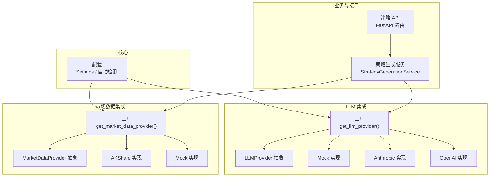
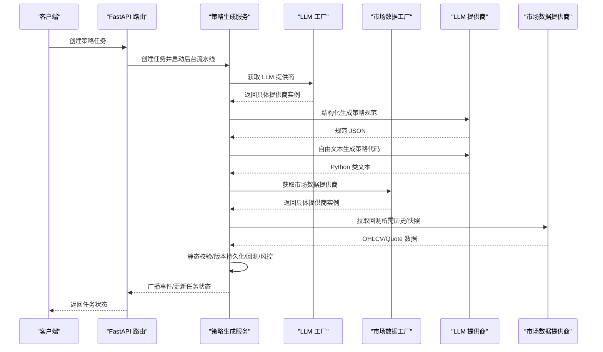
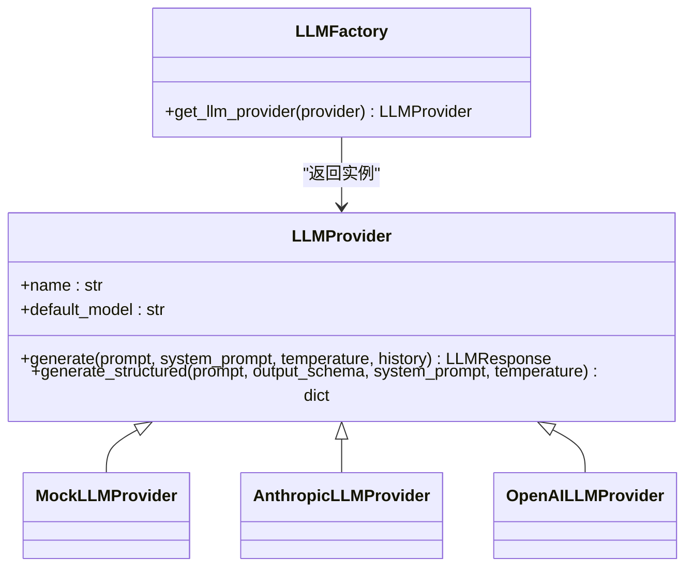
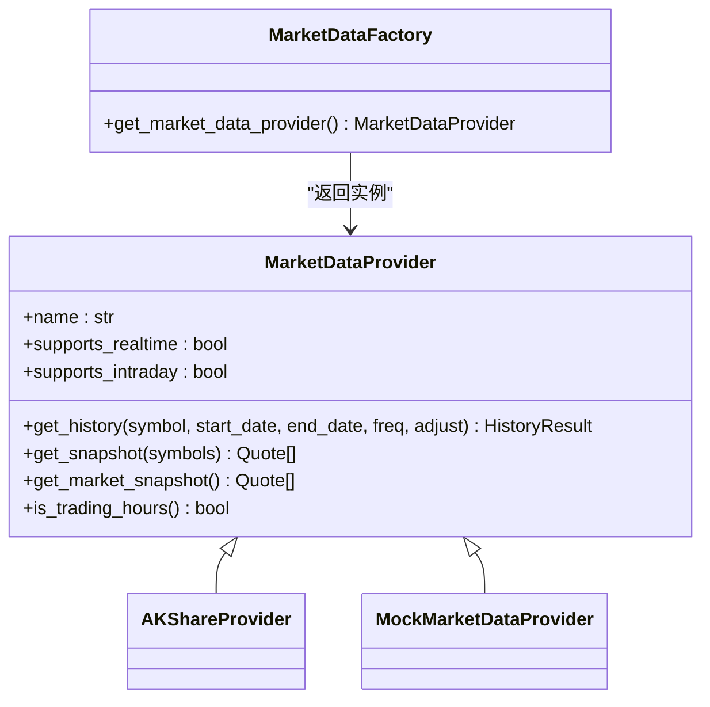
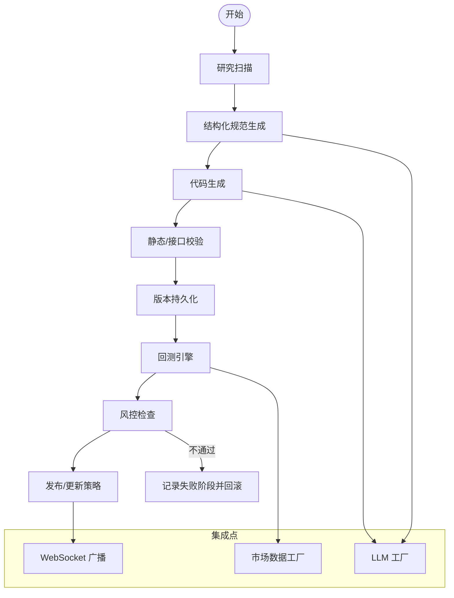
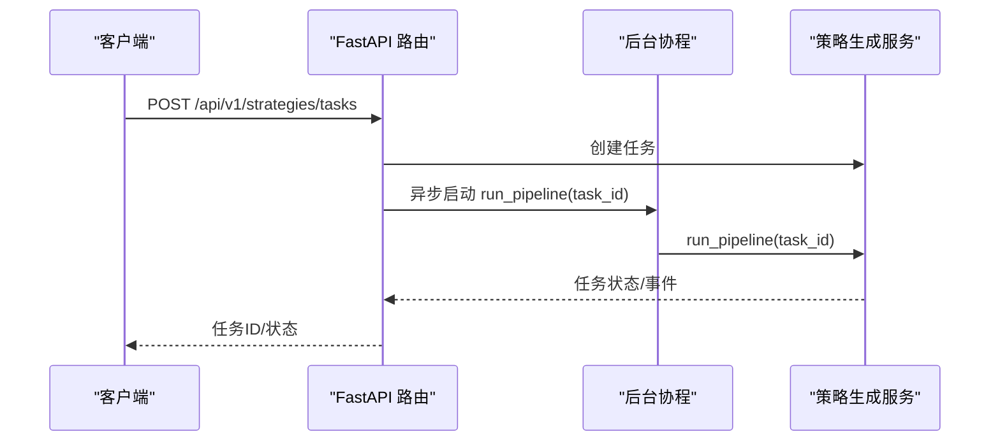
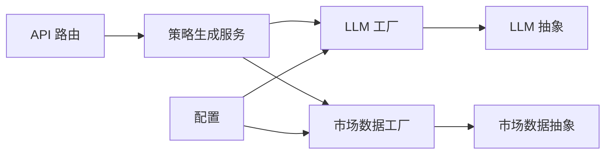

# 集成架构

<cite>
**本文引用的文件**
- [backend/app/integrations/llm/factory.py](file://backend/app/integrations/llm/factory.py)
- [backend/app/integrations/llm/base.py](file://backend/app/integrations/llm/base.py)
- [backend/app/integrations/llm/anthropic.py](file://backend/app/integrations/llm/anthropic.py)
- [backend/app/integrations/llm/openai.py](file://backend/app/integrations/llm/openai.py)
- [backend/app/integrations/llm/mock.py](file://backend/app/integrations/llm/mock.py)
- [backend/app/integrations/llm/prompts.py](file://backend/app/integrations/llm/prompts.py)
- [backend/app/integrations/llm/__init__.py](file://backend/app/integrations/llm/__init__.py)
- [backend/app/integrations/market_data/factory.py](file://backend/app/integrations/market_data/factory.py)
- [backend/app/integrations/market_data/base.py](file://backend/app/integrations/market_data/base.py)
- [backend/app/integrations/market_data/akshare_provider.py](file://backend/app/integrations/market_data/akshare_provider.py)
- [backend/app/integrations/market_data/mock_provider.py](file://backend/app/integrations/market_data/mock_provider.py)
- [backend/app/integrations/market_data/__init__.py](file://backend/app/integrations/market_data/__init__.py)
- [backend/app/core/config.py](file://backend/app/core/config.py)
- [backend/app/services/strategy_generation.py](file://backend/app/services/strategy_generation.py)
- [backend/app/api/v1/strategies.py](file://backend/app/api/v1/strategies.py)
</cite>

## 目录
1. [引言](#引言)
2. [项目结构](#项目结构)
3. [核心组件](#核心组件)
4. [架构总览](#架构总览)
5. [详细组件分析](#详细组件分析)
6. [依赖分析](#依赖分析)
7. [性能考量](#性能考量)
8. [故障排查指南](#故障排查指南)
9. [结论](#结论)
10. [附录](#附录)

## 引言
本文件系统化梳理 llmine-quant 的集成架构，重点阐述插件化集成设计与工厂模式的应用，涵盖 LLM Provider 抽象、市场数据适配器、第三方服务集成等。文档将从架构视角解释控制流、数据流、错误处理与扩展点，并提供可操作的集成示例与扩展指南，帮助开发者快速添加新的集成组件。

## 项目结构
本项目采用“领域驱动 + 插件化”的组织方式：
- 核心配置与基础设施位于 core 层，负责设置加载与全局行为。
- 集成层分为两类：
  - LLM 集成：抽象接口 + 工厂 + 具体提供商（Mock/Anthropic/OpenAI）。
  - 市场数据集成：抽象接口 + 工厂 + 具体提供商（AKShare/Mock/Tushare/Wind）。
- 业务服务层通过工厂获取具体实现，API 层编排工作流并广播状态。

图表来源
- [backend/app/core/config.py:48-196](file://backend/app/core/config.py#L48-L196)
- [backend/app/integrations/llm/factory.py:11-66](file://backend/app/integrations/llm/factory.py#L11-L66)
- [backend/app/integrations/llm/base.py:31-75](file://backend/app/integrations/llm/base.py#L31-L75)
- [backend/app/integrations/llm/mock.py:159-193](file://backend/app/integrations/llm/mock.py#L159-L193)
- [backend/app/integrations/llm/anthropic.py:19-150](file://backend/app/integrations/llm/anthropic.py#L19-L150)
- [backend/app/integrations/llm/openai.py:14-132](file://backend/app/integrations/llm/openai.py#L14-L132)
- [backend/app/integrations/market_data/factory.py:23-57](file://backend/app/integrations/market_data/factory.py#L23-L57)
- [backend/app/integrations/market_data/base.py:64-113](file://backend/app/integrations/market_data/base.py#L64-L113)
- [backend/app/integrations/market_data/akshare_provider.py:145-262](file://backend/app/integrations/market_data/akshare_provider.py#L145-L262)
- [backend/app/integrations/market_data/mock_provider.py:29-109](file://backend/app/integrations/market_data/mock_provider.py#L29-L109)
- [backend/app/services/strategy_generation.py:86-584](file://backend/app/services/strategy_generation.py#L86-L584)
- [backend/app/api/v1/strategies.py:301-315](file://backend/app/api/v1/strategies.py#L301-L315)

章节来源
- [backend/app/integrations/llm/__init__.py:1-7](file://backend/app/integrations/llm/__init__.py#L1-7)
- [backend/app/integrations/market_data/__init__.py:1-18](file://backend/app/integrations/market_data/__init__.py#L1-18)

## 核心组件
- LLMProvider 抽象与工厂
  - 抽象定义统一的消息、响应与调用契约，屏蔽具体 SDK 差异。
  - 工厂根据配置动态选择 Mock/Anthropic/OpenAI，支持覆盖参数与错误处理。
- MarketDataProvider 抽象与工厂
  - 统一历史/实时行情接口，工厂按配置选择 AKShare/Mock/Tushare/Wind，具备降级与日志。
- 配置与自动检测
  - 从用户主目录自动读取 Claude/Codex 凭证，填充空值；支持 SQLite 路径规范化。
- 策略生成服务
  - 以流水线形式协调研究、代码生成、静态校验、版本持久化、回测、风控与结果广播。
- API 路由
  - 提供任务创建、状态查询、事件流等接口，后台异步执行流水线。

章节来源
- [backend/app/integrations/llm/base.py:12-75](file://backend/app/integrations/llm/base.py#L12-L75)
- [backend/app/integrations/llm/factory.py:11-66](file://backend/app/integrations/llm/factory.py#L11-L66)
- [backend/app/integrations/market_data/base.py:17-113](file://backend/app/integrations/market_data/base.py#L17-L113)
- [backend/app/integrations/market_data/factory.py:23-57](file://backend/app/integrations/market_data/factory.py#L23-L57)
- [backend/app/core/config.py:48-196](file://backend/app/core/config.py#L48-L196)
- [backend/app/services/strategy_generation.py:86-584](file://backend/app/services/strategy_generation.py#L86-L584)
- [backend/app/api/v1/strategies.py:301-315](file://backend/app/api/v1/strategies.py#L301-L315)

## 架构总览
下图展示从 API 到服务再到集成层的调用链路与数据流：

图表来源
- [backend/app/api/v1/strategies.py:301-315](file://backend/app/api/v1/strategies.py#L301-L315)
- [backend/app/services/strategy_generation.py:132-373](file://backend/app/services/strategy_generation.py#L132-L373)
- [backend/app/integrations/llm/factory.py:11-66](file://backend/app/integrations/llm/factory.py#L11-L66)
- [backend/app/integrations/market_data/factory.py:23-57](file://backend/app/integrations/market_data/factory.py#L23-L57)

## 详细组件分析

### LLMProvider 抽象与工厂
- 设计要点
  - 抽象类定义消息、响应与两个核心方法：自由文本生成与结构化 JSON 生成。
  - 工厂函数依据配置选择提供商，支持覆盖参数与异常包装。
- 错误处理
  - 缺少必要配置时抛出统一异常；SDK 未安装或调用失败时统一转译为业务异常。
- 扩展指南
  - 新增提供商：实现抽象类，注册到工厂分支；如需延迟导入 SDK，在内部进行捕获与提示。

图表来源
- [backend/app/integrations/llm/base.py:31-75](file://backend/app/integrations/llm/base.py#L31-L75)
- [backend/app/integrations/llm/mock.py:159-193](file://backend/app/integrations/llm/mock.py#L159-L193)
- [backend/app/integrations/llm/anthropic.py:19-150](file://backend/app/integrations/llm/anthropic.py#L19-L150)
- [backend/app/integrations/llm/openai.py:14-132](file://backend/app/integrations/llm/openai.py#L14-L132)
- [backend/app/integrations/llm/factory.py:11-66](file://backend/app/integrations/llm/factory.py#L11-L66)

章节来源
- [backend/app/integrations/llm/base.py:12-75](file://backend/app/integrations/llm/base.py#L12-L75)
- [backend/app/integrations/llm/factory.py:11-66](file://backend/app/integrations/llm/factory.py#L11-L66)
- [backend/app/integrations/llm/anthropic.py:43-150](file://backend/app/integrations/llm/anthropic.py#L43-L150)
- [backend/app/integrations/llm/openai.py:36-132](file://backend/app/integrations/llm/openai.py#L36-L132)
- [backend/app/integrations/llm/mock.py:159-193](file://backend/app/integrations/llm/mock.py#L159-L193)

### 市场数据适配器与工厂
- 设计要点
  - 抽象类统一历史/快照接口，标注异步与阻塞调用的处理方式。
  - 工厂按配置选择提供商，支持降级（如 AKShare 缺失时回退 Mock）。
- 性能与可靠性
  - 对同步库通过线程池异步封装，避免阻塞事件循环。
  - 提供全市场扫描与批量快照接口，满足不同场景需求。
- 扩展指南
  - 新增提供商：实现抽象类并在工厂中注册；确保异步语义与错误处理一致。

图表来源
- [backend/app/integrations/market_data/base.py:64-113](file://backend/app/integrations/market_data/base.py#L64-L113)
- [backend/app/integrations/market_data/akshare_provider.py:145-262](file://backend/app/integrations/market_data/akshare_provider.py#L145-L262)
- [backend/app/integrations/market_data/mock_provider.py:29-109](file://backend/app/integrations/market_data/mock_provider.py#L29-L109)
- [backend/app/integrations/market_data/factory.py:23-57](file://backend/app/integrations/market_data/factory.py#L23-L57)

章节来源
- [backend/app/integrations/market_data/base.py:17-113](file://backend/app/integrations/market_data/base.py#L17-L113)
- [backend/app/integrations/market_data/factory.py:23-57](file://backend/app/integrations/market_data/factory.py#L23-L57)
- [backend/app/integrations/market_data/akshare_provider.py:145-262](file://backend/app/integrations/market_data/akshare_provider.py#L145-L262)
- [backend/app/integrations/market_data/mock_provider.py:29-109](file://backend/app/integrations/market_data/mock_provider.py#L29-L109)

### 策略生成流水线与集成点
- 流水线阶段
  - 研究扫描、结构化规范生成、Python 代码生成、静态校验、版本持久化、回测、风控、结果广播。
- 关键集成点
  - LLM 工厂：统一获取提供商，支持结构化输出与自由文本生成。
  - 市场数据工厂：提供回测所需的历史与快照数据。
  - WebSocket 广播：向前端推送进度与事件。
- 错误归因与恢复
  - 根据异常类型与信息归类失败阶段，记录事件并回滚状态。

图表来源
- [backend/app/services/strategy_generation.py:132-373](file://backend/app/services/strategy_generation.py#L132-L373)
- [backend/app/integrations/llm/factory.py:11-66](file://backend/app/integrations/llm/factory.py#L11-L66)
- [backend/app/integrations/market_data/factory.py:23-57](file://backend/app/integrations/market_data/factory.py#L23-L57)

章节来源
- [backend/app/services/strategy_generation.py:86-584](file://backend/app/services/strategy_generation.py#L86-L584)

### API 路由与后台执行
- 路由职责
  - 创建任务、查询任务、拉取事件流、列表与详情等。
- 后台执行
  - 使用独立会话与服务实例在后台协程中运行流水线，避免阻塞请求线程。
- 事件广播
  - 将流水线事件推送到 WebSocket 主题，前端订阅实时更新。

图表来源
- [backend/app/api/v1/strategies.py:301-315](file://backend/app/api/v1/strategies.py#L301-L315)
- [backend/app/api/v1/strategies.py:125-130](file://backend/app/api/v1/strategies.py#L125-L130)
- [backend/app/services/strategy_generation.py:132-373](file://backend/app/services/strategy_generation.py#L132-L373)

章节来源
- [backend/app/api/v1/strategies.py:301-315](file://backend/app/api/v1/strategies.py#L301-L315)
- [backend/app/api/v1/strategies.py:125-130](file://backend/app/api/v1/strategies.py#L125-L130)

## 依赖分析
- 组件耦合
  - 服务层仅依赖抽象接口与工厂，降低对具体实现的耦合。
  - 工厂依赖配置模块，保证运行时可插拔。
- 外部依赖
  - LLM 提供商依赖对应 SDK；市场数据提供商依赖第三方库（如 AKShare）。
- 循环依赖
  - 通过模块拆分与延迟导入避免循环依赖风险。

图表来源
- [backend/app/api/v1/strategies.py:301-315](file://backend/app/api/v1/strategies.py#L301-L315)
- [backend/app/services/strategy_generation.py:86-584](file://backend/app/services/strategy_generation.py#L86-L584)
- [backend/app/integrations/llm/factory.py:11-66](file://backend/app/integrations/llm/factory.py#L11-L66)
- [backend/app/integrations/market_data/factory.py:23-57](file://backend/app/integrations/market_data/factory.py#L23-L57)
- [backend/app/core/config.py:48-196](file://backend/app/core/config.py#L48-L196)

章节来源
- [backend/app/core/config.py:48-196](file://backend/app/core/config.py#L48-L196)
- [backend/app/integrations/llm/factory.py:11-66](file://backend/app/integrations/llm/factory.py#L11-L66)
- [backend/app/integrations/market_data/factory.py:23-57](file://backend/app/integrations/market_data/factory.py#L23-L57)

## 性能考量
- 异步与并发
  - 市场数据提供商对阻塞调用进行异步封装，避免事件循环阻塞。
  - API 路由使用后台协程执行耗时流水线，提升响应速度。
- 缓存与降级
  - 市场数据工厂在 AKShare 不可用时自动降级至 Mock，保证功能可用。
  - LLM 工厂支持 Mock 提供商，便于离线开发与测试。
- 资源限制
  - 统一超时与最大令牌数配置，防止长尾请求影响稳定性。

章节来源
- [backend/app/integrations/market_data/akshare_provider.py:206-210](file://backend/app/integrations/market_data/akshare_provider.py#L206-L210)
- [backend/app/integrations/market_data/factory.py:32-43](file://backend/app/integrations/market_data/factory.py#L32-L43)
- [backend/app/integrations/llm/factory.py:21-30](file://backend/app/integrations/llm/factory.py#L21-L30)
- [backend/app/core/config.py:87-98](file://backend/app/core/config.py#L87-L98)

## 故障排查指南
- LLM 提供商相关
  - SDK 未安装：工厂会抛出明确异常，指引安装对应包。
  - 缺少认证信息：在缺少 API Key 或 Token 时抛出异常，检查配置。
  - 调用失败：捕获底层异常并包装为统一异常，包含提供商与模型信息。
- 市场数据提供商相关
  - AKShare 未安装：自动降级为 Mock；可通过配置切换其他提供商。
  - 请求异常：返回空集或抛出异常，检查网络与第三方接口可用性。
- 配置问题
  - 自动检测：若未显式配置，系统尝试从用户主目录读取 Claude/Codex 配置。
  - SQLite 路径：相对路径会被规范化，避免不同工作目录导致的数据文件不一致。

章节来源
- [backend/app/integrations/llm/anthropic.py:43-68](file://backend/app/integrations/llm/anthropic.py#L43-L68)
- [backend/app/integrations/llm/openai.py:36-58](file://backend/app/integrations/llm/openai.py#L36-L58)
- [backend/app/integrations/llm/factory.py:32-65](file://backend/app/integrations/llm/factory.py#L32-L65)
- [backend/app/integrations/market_data/factory.py:32-53](file://backend/app/integrations/market_data/factory.py#L32-L53)
- [backend/app/core/config.py:110-172](file://backend/app/core/config.py#L110-L172)

## 结论
本项目通过清晰的抽象与工厂模式实现了高度可插拔的集成架构：LLM 与市场数据均可在运行时按配置切换，具备完善的错误处理与降级策略。服务层与 API 层通过异步与广播机制解耦，既保证了扩展性，也兼顾了性能与可观测性。新增集成组件只需遵循抽象契约并在工厂中注册即可无缝接入。

## 附录

### 扩展新 LLM 提供商步骤
- 实现抽象类
  - 参考现有实现，完成初始化与客户端获取、生成与结构化生成方法。
- 注册到工厂
  - 在工厂函数中增加分支，读取配置并返回实例。
- 配置项
  - 在配置模块中添加必要的环境变量字段，确保自动检测与覆盖生效。
- 单元测试
  - 提供最小化测试，验证生成与结构化输出格式。

章节来源
- [backend/app/integrations/llm/base.py:31-75](file://backend/app/integrations/llm/base.py#L31-L75)
- [backend/app/integrations/llm/factory.py:11-66](file://backend/app/integrations/llm/factory.py#L11-L66)
- [backend/app/core/config.py:87-98](file://backend/app/core/config.py#L87-L98)

### 扩展新市场数据提供商步骤
- 实现抽象类
  - 实现历史/快照接口，注意异步封装与错误处理。
- 注册到工厂
  - 在工厂中增加分支，按配置选择新提供商。
- 配置项
  - 如需额外凭据，参考现有字段在配置模块中添加。
- 单元测试
  - 提供数据模型与接口契约的测试，覆盖边界条件。

章节来源
- [backend/app/integrations/market_data/base.py:64-113](file://backend/app/integrations/market_data/base.py#L64-L113)
- [backend/app/integrations/market_data/factory.py:23-57](file://backend/app/integrations/market_data/factory.py#L23-L57)
- [backend/app/core/config.py:80-86](file://backend/app/core/config.py#L80-L86)