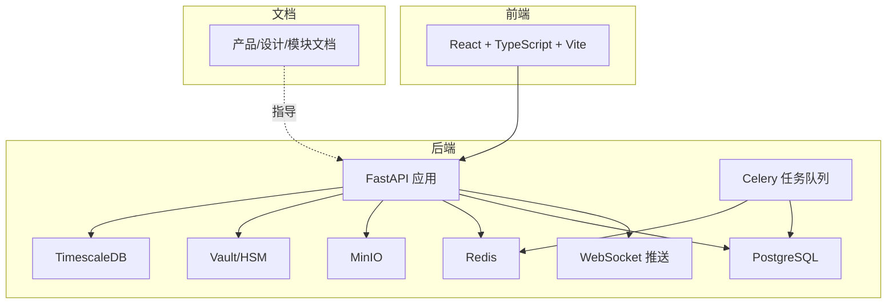
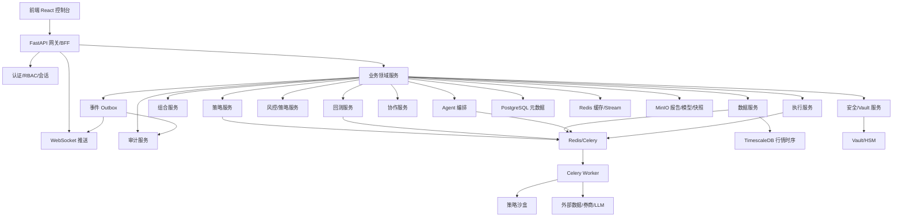
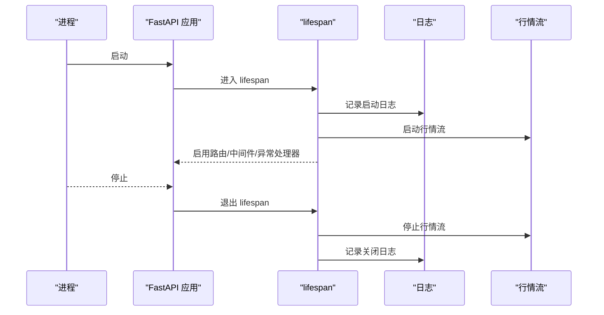
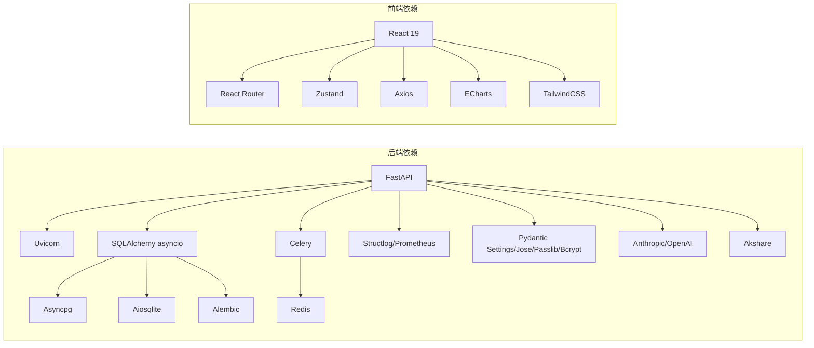

# 贡献指南

<cite>
**本文引用的文件**
- [backend/README.md](file://backend/README.md)
- [frontend/README.md](file://frontend/README.md)
- [backend/pyproject.toml](file://backend/pyproject.toml)
- [frontend/package.json](file://frontend/package.json)
- [backend/ROADMAP.md](file://backend/ROADMAP.md)
- [backend/app/main.py](file://backend/app/main.py)
- [backend/app/core/config.py](file://backend/app/core/config.py)
- [backend/app/core/errors.py](file://backend/app/core/errors.py)
- [frontend/eslint.config.js](file://frontend/eslint.config.js)
- [doc/01-产品概述与愿景.md](file://doc/01-产品概述与愿景.md)
- [doc/03-核心模块设计.md](file://doc/03-核心模块设计.md)
- [doc/07-后端项目设计说明书.md](file://doc/07-后端项目设计说明书.md)
</cite>

## 目录
1. [简介](#简介)
2. [项目结构](#项目结构)
3. [核心组件](#核心组件)
4. [架构总览](#架构总览)
5. [详细组件分析](#详细组件分析)
6. [依赖分析](#依赖分析)
7. [性能考量](#性能考量)
8. [故障排查指南](#故障排查指南)
9. [结论](#结论)
10. [附录](#附录)

## 简介
本指南面向 llmine-quant 项目的贡献者，旨在帮助新成员快速理解开发流程、代码规范、提交规范、代码审查标准、分支管理策略、版本发布流程以及社区参与方式。文档同时涵盖开发环境搭建、测试要求、文档编写规范、问题报告模板、贡献者协议与许可证信息、知识产权相关事项，确保贡献过程高效、一致、可追溯。

## 项目结构
llmine-quant 采用前后端分离的单仓多模块架构：
- 后端（Python/FastAPI）：提供 REST API、WebSocket、任务队列（Celery）、数据库（PostgreSQL/TimescaleDB/Redis）、事件总线与审计链路。
- 前端（React + TypeScript + Vite）：提供 11 个业务屏的交互界面，配合后端 API 与 WebSocket 实时推送。
- 文档（doc/）：产品愿景、系统设计、模块设计、项目设计说明书等，指导开发与评审。
- 部署（deploy/）：Compose 编排（可选）。
- 脚本（scripts/）：本地开发数据注入、市场数据导入等辅助脚本。

**图表来源**
- [doc/07-后端项目设计说明书.md:39-78](file://doc/07-后端项目设计说明书.md#L39-L78)
- [backend/app/main.py:39-58](file://backend/app/main.py#L39-L58)

**章节来源**
- [backend/README.md:1-45](file://backend/README.md#L1-L45)
- [frontend/README.md:1-74](file://frontend/README.md#L1-L74)
- [doc/07-后端项目设计说明书.md:39-78](file://doc/07-后端项目设计说明书.md#L39-L78)

## 核心组件
- 应用入口与生命周期：后端应用通过 lifespan 管理启动/停止，注册中间件、异常处理器与路由。
- 配置系统：集中式配置加载，支持数据库、Redis、CORS、API 前缀、分页、市场数据与 LLM 提供商等。
- 错误处理：统一异常体系，标准化错误响应结构，包含 trace_id 以便审计与排障。
- 开发工具链：后端使用 Ruff/Mypy/pytest；前端使用 ESLint + TypeScript。

**章节来源**
- [backend/app/main.py:20-64](file://backend/app/main.py#L20-L64)
- [backend/app/core/config.py:48-196](file://backend/app/core/config.py#L48-L196)
- [backend/app/core/errors.py:13-119](file://backend/app/core/errors.py#L13-L119)
- [backend/pyproject.toml:48-78](file://backend/pyproject.toml#L48-L78)
- [frontend/eslint.config.js:1-23](file://frontend/eslint.config.js#L1-L23)

## 架构总览
后端采用“模块化单体 + 异步任务 + 事件总线 + 审计链”的设计，围绕 11 个业务屏提供 API，并通过 Outbox 机制实现跨模块事件解耦与审计同步。

**图表来源**
- [doc/07-后端项目设计说明书.md:39-78](file://doc/07-后端项目设计说明书.md#L39-L78)

**章节来源**
- [doc/07-后端项目设计说明书.md:11-25](file://doc/07-后端项目设计说明书.md#L11-L25)
- [doc/07-后端项目设计说明书.md:540-687](file://doc/07-后端项目设计说明书.md#L540-L687)

## 详细组件分析

### 后端应用与生命周期
- 生命周期钩子负责应用启动时的日志记录与行情流启动、关闭时的清理与日志记录。
- 中间件包括 CORS、Tracing。
- 异常处理器统一处理自定义异常与通用异常，返回标准化错误响应并附带 trace_id。

**图表来源**
- [backend/app/main.py:20-36](file://backend/app/main.py#L20-L36)

**章节来源**
- [backend/app/main.py:20-64](file://backend/app/main.py#L20-L64)

### 配置系统与环境变量
- 配置类集中管理数据库、Redis、CORS、API 前缀、分页、市场数据提供商、LLM 提供商等。
- 支持从用户主目录自动加载 Claude/Codex 凭证，优先级高于显式环境变量。
- SQLite 相对路径在启动时规范化，确保不同工作目录下行为一致。

**章节来源**
- [backend/app/core/config.py:48-196](file://backend/app/core/config.py#L48-L196)

### 错误处理与审计
- 自定义异常体系覆盖常见 HTTP 场景（未找到、请求错误、未授权、禁止、冲突等）。
- 异常处理器记录 trace_id，便于审计与问题追踪。
- API 规范要求错误响应包含 code/message/details/trace_id。

**章节来源**
- [backend/app/core/errors.py:13-119](file://backend/app/core/errors.py#L13-L119)
- [doc/07-后端项目设计说明书.md:540-554](file://doc/07-后端项目设计说明书.md#L540-L554)

### 前端开发与代码规范
- ESLint 配置推荐使用 TypeScript ESLint 推荐规则集，结合 React Hooks 与 React Refresh 插件。
- 建议启用类型感知规则以提升生产级质量。

**章节来源**
- [frontend/eslint.config.js:1-23](file://frontend/eslint.config.js#L1-L23)
- [frontend/README.md:14-73](file://frontend/README.md#L14-L73)

### 开发环境搭建
- 后端
  - 安装依赖与运行迁移、种子数据、启动 API 服务器与 Celery Worker。
  - SQLite 模式可在未运行 PostgreSQL 时使用，通过 DATABASE_URL 指向文件数据库。
- 前端
  - 使用 Vite + React + TypeScript 开发，提供 dev/build/lint/preview 脚本。

**章节来源**
- [backend/README.md:5-44](file://backend/README.md#L5-L44)
- [frontend/package.json:6-11](file://frontend/package.json#L6-L11)

## 依赖分析
- 后端依赖
  - Web 框架与异步：FastAPI、Uvicorn、WebSockets
  - ORM 与数据库：SQLAlchemy[asyncio]、Asyncpg、Aiosqlite、Alembic
  - 任务与缓存：Celery、Redis
  - 日志与可观测：Structlog、Prometheus
  - 安全与认证：Pydantic Settings、Jose、Passlib、Bcrypt
  - LLM 与市场数据：Anthropic、OpenAI、Akshare（可选）
- 前端依赖
  - React 19、React Router、Zustand、Axios、ECharts、TailwindCSS
  - 开发工具：ESLint、TypeScript、Vite、SWC/Oxc

**图表来源**
- [backend/pyproject.toml:7-46](file://backend/pyproject.toml#L7-L46)
- [frontend/package.json:12-41](file://frontend/package.json#L12-L41)

**章节来源**
- [backend/pyproject.toml:1-78](file://backend/pyproject.toml#L1-L78)
- [frontend/package.json:1-43](file://frontend/package.json#L1-L43)

## 性能考量
- 异步与并发：后端大量使用异步 I/O 与 Celery 任务队列，减少阻塞，提高吞吐。
- 数据库连接与缓存：合理配置连接池、索引与 Redis 缓存，避免热点与慢查询。
- 事件驱动与 Outbox：通过 Outbox 与事件总线解耦模块，降低耦合与峰值压力。
- LLM 与外部集成：对 LLM 请求设置超时与令牌限制，避免雪崩效应。
- 前端性能：按需加载、组件拆分、Tailwind 与 ECharts 的合理使用，避免不必要的重渲染。

[本节为通用指导，无需具体文件引用]

## 故障排查指南
- 健康检查：后端提供 /health 接口，可用于快速判断服务状态。
- 错误响应：统一错误响应包含 code/message/details/trace_id，便于定位问题。
- 日志与追踪：异常处理器记录 trace_id，结合日志系统进行问题回溯。
- 环境变量：确认 DATABASE_URL、REDIS_URL、SECRET_KEY、LLM 提供商配置正确。
- 任务队列：确保 Redis 正常运行，Celery Worker 正常消费队列。

**章节来源**
- [backend/app/main.py:61-64](file://backend/app/main.py#L61-L64)
- [backend/app/core/errors.py:73-119](file://backend/app/core/errors.py#L73-L119)
- [backend/app/core/config.py:58-103](file://backend/app/core/config.py#L58-L103)
- [backend/README.md:32-44](file://backend/README.md#L32-L44)

## 结论
本指南提供了 llmine-quant 项目的贡献流程与规范要点，涵盖开发环境、代码规范、测试与文档要求、分支与发布策略、问题报告与社区参与方式。建议贡献者在提交前阅读相关文档与规范，确保代码质量与一致性。

[本节为总结，无需具体文件引用]

## 附录

### 开发流程与提交规范
- 分支策略
  - 主分支：保护分支，仅接受经审查的合并请求。
  - 功能分支：基于主分支创建，命名建议使用 feature/xxx 或 fix/xxx。
  - 发布分支：用于版本发布与紧急修复，遵循语义化版本。
- 提交流程
  - 在本地完成开发与测试，提交前运行后端 Ruff/Mypy/pytest 与前端 ESLint/TypeScript 检查。
  - 提交信息采用约定式提交（例如 feat(core): 添加新功能），并在 PR 描述中引用相关 Issue。
- 代码审查
  - 至少一名维护者审查，关注代码质量、安全性、可维护性与文档完整性。
  - 审查通过后方可合并。

[本节为通用流程，无需具体文件引用]

### 代码规范与测试要求
- 后端
  - Lint：Ruff，行宽 120，选择性启用 pydocstyle Google 风格。
  - 类型检查：Mypy，严格模式，禁止未注释定义。
  - 测试：pytest + httpx AsyncClient，覆盖率报告 term-missing。
- 前端
  - Lint：ESLint + TypeScript ESLint 推荐规则集，结合 React Hooks 与 React Refresh。
  - 类型：TypeScript 严格类型检查，建议启用类型感知规则集。

**章节来源**
- [backend/pyproject.toml:48-78](file://backend/pyproject.toml#L48-L78)
- [frontend/eslint.config.js:1-23](file://frontend/eslint.config.js#L1-L23)

### 文档编写规范
- 文档应与代码同步演进，重要设计决策与变更需在 doc/ 下更新相应文档。
- 文档风格遵循产品愿景与模块设计，保持术语一致与结构清晰。

**章节来源**
- [doc/01-产品概述与愿景.md:1-88](file://doc/01-产品概述与愿景.md#L1-L88)
- [doc/03-核心模块设计.md:1-599](file://doc/03-核心模块设计.md#L1-L599)

### 问题报告模板
- 标题：简明扼要描述问题
- 环境信息：操作系统、浏览器/后端版本、依赖版本
- 复现步骤：最小可复现步骤
- 预期行为与实际行为
- 日志与截图（如有）

[本节为模板说明，无需具体文件引用]

### 分支管理策略
- 主分支（main）：稳定版本，保护分支
- develop 分支：日常开发，合并功能分支
- release 分支：版本发布准备与紧急修复
- hotfix 分支：线上紧急修复

[本节为通用策略，无需具体文件引用]

### 版本发布流程
- 语义化版本：根据破坏性变更、功能与修复调整主/次/补丁版本
- 发布前检查：通过 CI、测试覆盖率、安全扫描
- 发布标签与变更日志：在 Release 页面记录变更摘要

[本节为通用流程，无需具体文件引用]

### 社区参与方式
- 讨论与反馈：通过 Issue/PR 讨论功能与问题
- 文档贡献：完善 doc/ 下的设计与使用文档
- 代码贡献：遵循规范与审查流程

[本节为通用说明，无需具体文件引用]

### 贡献者协议与许可证
- 贡献者需签署 CLA（如适用），以明确知识产权归属与使用许可。
- 项目许可证详见仓库根目录或相关文件，贡献即表示同意遵守许可证条款。

[本节为通用说明，无需具体文件引用]