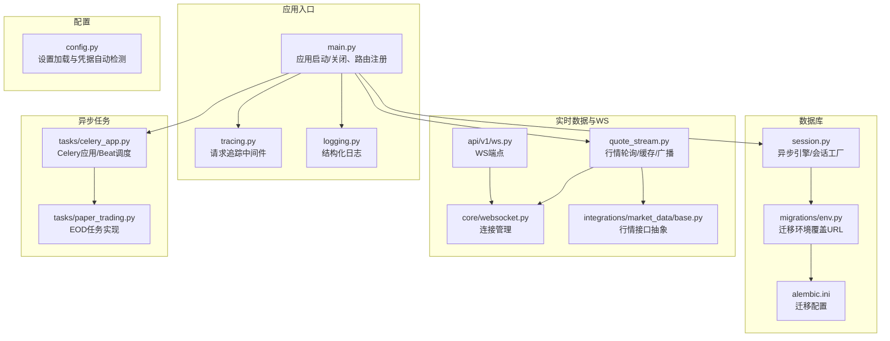
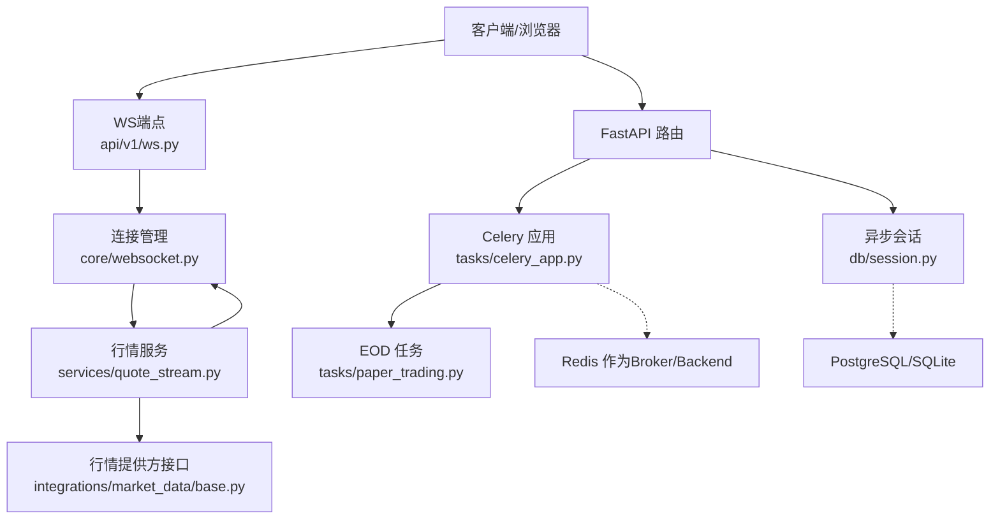
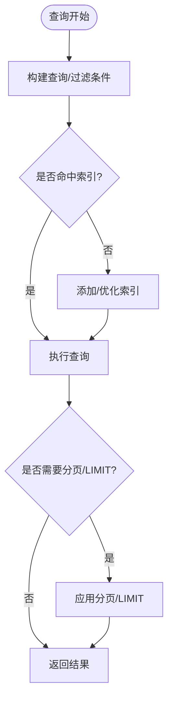
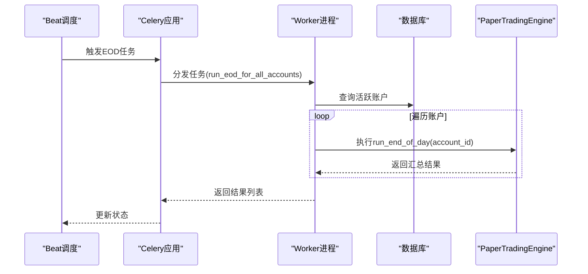
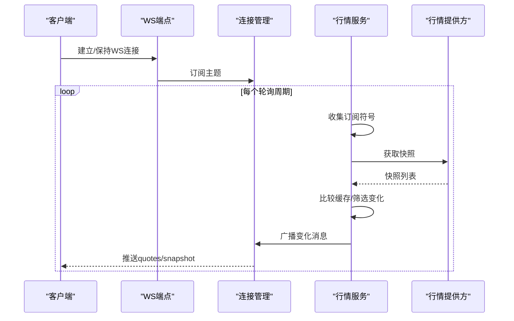
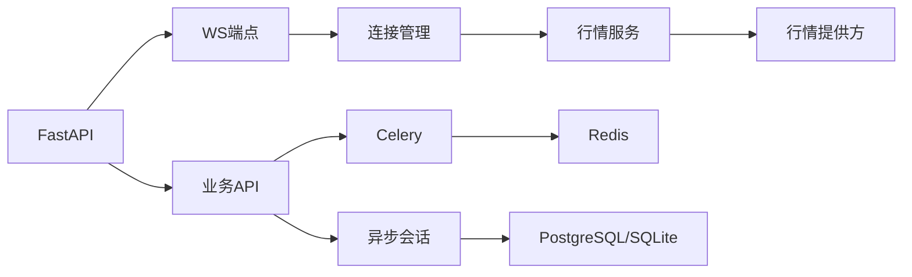

# 性能调优

<cite>
**本文引用的文件**
- [backend/app/main.py](file://backend/app/main.py)
- [backend/app/core/config.py](file://backend/app/core/config.py)
- [backend/app/db/session.py](file://backend/app/db/session.py)
- [backend/app/tasks/celery_app.py](file://backend/app/tasks/celery_app.py)
- [backend/app/tasks/paper_trading.py](file://backend/app/tasks/paper_trading.py)
- [backend/app/services/quote_stream.py](file://backend/app/services/quote_stream.py)
- [backend/app/api/v1/ws.py](file://backend/app/api/v1/ws.py)
- [backend/app/core/websocket.py](file://backend/app/core/websocket.py)
- [backend/app/core/tracing.py](file://backend/app/core/tracing.py)
- [backend/app/core/logging.py](file://backend/app/core/logging.py)
- [backend/app/integrations/market_data/base.py](file://backend/app/integrations/market_data/base.py)
- [backend/pyproject.toml](file://backend/pyproject.toml)
- [backend/alembic.ini](file://backend/alembic.ini)
- [backend/app/db/migrations/env.py](file://backend/app/db/migrations/env.py)
- [backend/app/db/migrations/versions/20260513_000001_execution_risk_portfolio.py](file://backend/app/db/migrations/versions/20260513_000001_execution_risk_portfolio.py)
</cite>

## 目录
1. [简介](#简介)
2. [项目结构](#项目结构)
3. [核心组件](#核心组件)
4. [架构总览](#架构总览)
5. [详细组件分析](#详细组件分析)
6. [依赖分析](#依赖分析)
7. [性能考虑](#性能考虑)
8. [故障排查指南](#故障排查指南)
9. [结论](#结论)
10. [附录](#附录)

## 简介
本指南面向 llmine-quant 后端系统，聚焦于应用性能调优，覆盖并发配置、内存管理、CPU 使用优化；数据库性能调优（查询优化、连接池配置、索引策略）；异步任务系统（Celery 队列与 worker 调优、任务优先级）；WebSocket 实时推送优化与缓存策略；以及性能基准测试与瓶颈定位方法。文档以代码为依据，结合架构图与流程图，帮助读者在生产环境中稳定、高效地运行系统。

## 项目结构
后端采用 FastAPI + 异步 SQLAlchemy + Celery 的技术栈，核心模块包括：
- 应用入口与生命周期：FastAPI 应用、中间件、异常处理、路由注册
- 配置中心：统一读取环境变量与自动检测凭据
- 数据库层：异步引擎与会话工厂、迁移配置
- 实时行情与 WebSocket：后台轮询、缓存与广播
- 异步任务：Celery 应用、周期任务与任务执行
- 日志与追踪：结构化日志、请求追踪上下文注入

图表来源
- [backend/app/main.py:1-65](file://backend/app/main.py#L1-L65)
- [backend/app/core/tracing.py:1-87](file://backend/app/core/tracing.py#L1-L87)
- [backend/app/core/logging.py:1-41](file://backend/app/core/logging.py#L1-L41)
- [backend/app/core/config.py:1-196](file://backend/app/core/config.py#L1-L196)
- [backend/app/db/session.py:1-34](file://backend/app/db/session.py#L1-L34)
- [backend/alembic.ini:1-38](file://backend/alembic.ini#L1-L38)
- [backend/app/db/migrations/env.py:46-84](file://backend/app/db/migrations/env.py#L46-L84)
- [backend/app/services/quote_stream.py:1-152](file://backend/app/services/quote_stream.py#L1-L152)
- [backend/app/api/v1/ws.py:1-50](file://backend/app/api/v1/ws.py#L1-L50)
- [backend/app/core/websocket.py:1-45](file://backend/app/core/websocket.py#L1-L45)
- [backend/app/integrations/market_data/base.py:1-113](file://backend/app/integrations/market_data/base.py#L1-L113)
- [backend/app/tasks/celery_app.py:1-42](file://backend/app/tasks/celery_app.py#L1-L42)
- [backend/app/tasks/paper_trading.py:1-73](file://backend/app/tasks/paper_trading.py#L1-L73)

章节来源
- [backend/app/main.py:1-65](file://backend/app/main.py#L1-L65)
- [backend/app/core/config.py:1-196](file://backend/app/core/config.py#L1-L196)
- [backend/app/db/session.py:1-34](file://backend/app/db/session.py#L1-L34)
- [backend/app/tasks/celery_app.py:1-42](file://backend/app/tasks/celery_app.py#L1-L42)
- [backend/app/tasks/paper_trading.py:1-73](file://backend/app/tasks/paper_trading.py#L1-L73)
- [backend/app/services/quote_stream.py:1-152](file://backend/app/services/quote_stream.py#L1-L152)
- [backend/app/api/v1/ws.py:1-50](file://backend/app/api/v1/ws.py#L1-L50)
- [backend/app/core/websocket.py:1-45](file://backend/app/core/websocket.py#L1-L45)
- [backend/app/core/tracing.py:1-87](file://backend/app/core/tracing.py#L1-L87)
- [backend/app/core/logging.py:1-41](file://backend/app/core/logging.py#L1-L41)
- [backend/app/integrations/market_data/base.py:1-113](file://backend/app/integrations/market_data/base.py#L1-L113)
- [backend/alembic.ini:1-38](file://backend/alembic.ini#L1-L38)
- [backend/app/db/migrations/env.py:46-84](file://backend/app/db/migrations/env.py#L46-L84)

## 核心组件
- 应用生命周期与中间件：通过 lifespan 在启动时初始化行情流，在关闭时优雅停止；中间件注入追踪上下文并记录日志。
- 配置中心：集中管理数据库、Redis、市场数据提供商、LLM 提供商等参数，并支持从本地配置自动填充。
- 数据库层：异步 SQLAlchemy 引擎与会话工厂，支持 SQLite/PostgreSQL；迁移配置通过 Alembic 注入实际 URL。
- 实时行情与 WebSocket：按订阅集合拉取行情快照，缓存并仅对变化推送；WS 管理器按主题广播。
- 异步任务：Celery 应用与 Beat 调度，EOD 批处理任务串行遍历账户并聚合结果。
- 日志与追踪：结构化日志输出；请求追踪 ID 注入与响应头透传。

章节来源
- [backend/app/main.py:20-65](file://backend/app/main.py#L20-L65)
- [backend/app/core/config.py:48-108](file://backend/app/core/config.py#L48-L108)
- [backend/app/db/session.py:10-21](file://backend/app/db/session.py#L10-L21)
- [backend/app/services/quote_stream.py:62-152](file://backend/app/services/quote_stream.py#L62-L152)
- [backend/app/api/v1/ws.py:12-50](file://backend/app/api/v1/ws.py#L12-L50)
- [backend/app/core/websocket.py:10-45](file://backend/app/core/websocket.py#L10-L45)
- [backend/app/tasks/celery_app.py:15-42](file://backend/app/tasks/celery_app.py#L15-L42)
- [backend/app/tasks/paper_trading.py:19-73](file://backend/app/tasks/paper_trading.py#L19-L73)
- [backend/app/core/tracing.py:49-87](file://backend/app/core/tracing.py#L49-L87)
- [backend/app/core/logging.py:11-41](file://backend/app/core/logging.py#L11-L41)

## 架构总览
下图展示系统关键组件交互：应用启动时初始化行情服务；WS 客户端订阅事件；行情轮询服务根据订阅集合拉取并广播；数据库访问通过异步会话；Celery 任务驱动批处理。

图表来源
- [backend/app/api/v1/ws.py:28-50](file://backend/app/api/v1/ws.py#L28-L50)
- [backend/app/core/websocket.py:10-45](file://backend/app/core/websocket.py#L10-L45)
- [backend/app/services/quote_stream.py:62-152](file://backend/app/services/quote_stream.py#L62-L152)
- [backend/app/integrations/market_data/base.py:64-113](file://backend/app/integrations/market_data/base.py#L64-L113)
- [backend/app/db/session.py:14-34](file://backend/app/db/session.py#L14-L34)
- [backend/app/tasks/celery_app.py:15-42](file://backend/app/tasks/celery_app.py#L15-L42)
- [backend/app/tasks/paper_trading.py:19-73](file://backend/app/tasks/paper_trading.py#L19-L73)

## 详细组件分析

### 并发与生命周期管理
- 生命周期：在 lifespan 中启动行情服务并在关闭时停止，避免资源泄漏。
- 中间件：追踪中间件注入 trace_id、actor_id、org_id，便于跨服务链路追踪。
- 日志：结构化日志在生产环境输出 JSON，便于采集与检索。

优化建议
- 将长耗时任务移出请求路径，使用 Celery 或后台任务队列。
- 对外部服务调用设置超时与重试，避免阻塞请求线程。
- 使用限流与熔断策略保护下游依赖。

章节来源
- [backend/app/main.py:20-36](file://backend/app/main.py#L20-L36)
- [backend/app/core/tracing.py:49-87](file://backend/app/core/tracing.py#L49-L87)
- [backend/app/core/logging.py:11-41](file://backend/app/core/logging.py#L11-L41)

### 数据库性能调优
- 连接池与引擎：使用异步引擎，针对 SQLite 设置线程检查参数；会话工厂关闭过期与自动刷新，降低 ORM 开销。
- 迁移配置：Alembic 通过环境脚本注入实际数据库 URL，确保迁移与运行时一致。
- 查询优化：示例中存在多处 count 聚合与排序限制，建议：
  - 对高频查询字段建立合适索引（如风险规则的 scope、metric，风险检查的 resource_type、resource_id）。
  - 使用分页与 LIMIT 控制返回规模。
  - 避免 N+1 查询，批量加载关联数据。
- 连接池参数：可结合部署规模调整连接数、空闲回收、超时等参数（需在引擎创建处扩展）。

图表来源
- [backend/app/db/migrations/versions/20260513_000001_execution_risk_portfolio.py:127-151](file://backend/app/db/migrations/versions/20260513_000001_execution_risk_portfolio.py#L127-L151)

章节来源
- [backend/app/db/session.py:10-21](file://backend/app/db/session.py#L10-L21)
- [backend/app/db/migrations/env.py:55-59](file://backend/app/db/migrations/env.py#L55-L59)
- [backend/alembic.ini:1-38](file://backend/alembic.ini#L1-L38)
- [backend/app/db/migrations/versions/20260513_000001_execution_risk_portfolio.py:127-151](file://backend/app/db/migrations/versions/20260513_000001_execution_risk_portfolio.py#L127-L151)

### 异步任务系统（Celery）调优
- Broker/Backend：默认使用 Redis，任务序列化为 JSON，UTC 关闭，延迟确认开启，单 worker 子任务上限防止内存泄漏。
- 任务：EOD 批处理遍历活跃账户顺序执行，聚合结果返回。
- 调优要点：
  - worker 数量：根据 CPU 核心数与任务类型（IO 密集/计算密集）设定并发。
  - 队列与优先级：为高优先级任务单独队列，合理分配资源。
  - 任务粒度：拆分大任务，避免长时间占用 worker。
  - 监控：启用任务跟踪与失败重试策略，结合 Redis 查看队列长度与延迟。

图表来源
- [backend/app/tasks/celery_app.py:33-41](file://backend/app/tasks/celery_app.py#L33-L41)
- [backend/app/tasks/paper_trading.py:19-73](file://backend/app/tasks/paper_trading.py#L19-L73)

章节来源
- [backend/app/tasks/celery_app.py:15-42](file://backend/app/tasks/celery_app.py#L15-L42)
- [backend/app/tasks/paper_trading.py:19-73](file://backend/app/tasks/paper_trading.py#L19-L73)

### WebSocket 连接与实时推送优化
- 订阅管理：按 WebSocket 连接维护订阅符号集合，仅对订阅符号进行轮询。
- 缓存与广播：缓存最新行情，仅对价格变化推送；广播时清理失效连接。
- 行情轮询：交易时段与非交易时段采用不同轮询间隔，减少无效调用。

图表来源
- [backend/app/api/v1/ws.py:12-50](file://backend/app/api/v1/ws.py#L12-L50)
- [backend/app/core/websocket.py:16-41](file://backend/app/core/websocket.py#L16-L41)
- [backend/app/services/quote_stream.py:112-147](file://backend/app/services/quote_stream.py#L112-L147)
- [backend/app/integrations/market_data/base.py:104-113](file://backend/app/integrations/market_data/base.py#L104-L113)

章节来源
- [backend/app/api/v1/ws.py:12-50](file://backend/app/api/v1/ws.py#L12-L50)
- [backend/app/core/websocket.py:10-45](file://backend/app/core/websocket.py#L10-L45)
- [backend/app/services/quote_stream.py:62-152](file://backend/app/services/quote_stream.py#L62-L152)
- [backend/app/integrations/market_data/base.py:64-113](file://backend/app/integrations/market_data/base.py#L64-L113)

### 缓存策略优化
- 行情缓存：按符号缓存最新报价，仅对变化推送，显著降低广播开销。
- 会话缓存：REST 快照端点可直接从缓存返回，避免重复网络请求。
- 建议：
  - 为热点查询结果增加应用层缓存（如 Redis），设置 TTL 与失效策略。
  - 对历史数据与报表类查询，采用只增式缓存或物化视图。

章节来源
- [backend/app/services/quote_stream.py:65-108](file://backend/app/services/quote_stream.py#L65-L108)

### 内存与 CPU 优化
- 内存：Celery worker 最大任务数限制防止长期运行导致的内存累积；WS 广播清理失效连接。
- CPU：行情轮询按订阅集合裁剪，避免全市场扫描；异步 IO 减少阻塞；任务拆分与队列隔离降低峰值 CPU 占用。

章节来源
- [backend/app/tasks/celery_app.py:30-31](file://backend/app/tasks/celery_app.py#L30-L31)
- [backend/app/core/websocket.py:30-35](file://backend/app/core/websocket.py#L30-L35)
- [backend/app/services/quote_stream.py:121-123](file://backend/app/services/quote_stream.py#L121-L123)

## 依赖分析
- 外部依赖：FastAPI、Uvicorn、SQLAlchemy Async、Celery、Redis、Prometheus 客户端等。
- 组件耦合：WS 与行情服务松耦合，通过连接管理器广播；任务系统与业务解耦，通过 Celery 异步执行。

图表来源
- [backend/pyproject.toml:7-27](file://backend/pyproject.toml#L7-L27)
- [backend/app/api/v1/ws.py:12-50](file://backend/app/api/v1/ws.py#L12-L50)
- [backend/app/core/websocket.py:10-45](file://backend/app/core/websocket.py#L10-L45)
- [backend/app/services/quote_stream.py:62-152](file://backend/app/services/quote_stream.py#L62-L152)
- [backend/app/db/session.py:14-34](file://backend/app/db/session.py#L14-L34)
- [backend/app/tasks/celery_app.py:15-42](file://backend/app/tasks/celery_app.py#L15-L42)

章节来源
- [backend/pyproject.toml:7-27](file://backend/pyproject.toml#L7-L27)

## 性能考虑
- 并发与线程模型：使用异步框架与异步数据库驱动，避免阻塞；WS 广播采用异步发送，失败连接及时剔除。
- 资源隔离：将 IO 密集型任务（行情拉取、外部 API）与计算密集型任务（回测、特征工程）分离到不同队列与 worker。
- 监控与可观测性：启用结构化日志与请求追踪，结合 Prometheus 指标（如队列长度、任务耗时）进行监控告警。
- 配置项建议：
  - 数据库：根据吞吐量调整连接池大小与超时；开启慢查询日志（开发环境）。
  - Redis：持久化策略与内存淘汰策略按场景选择；主从复制保障高可用。
  - Celery：根据 CPU 与内存资源设定并发数与子任务上限；启用延迟确认与任务跟踪。

## 故障排查指南
- 健康检查：提供 /health 端点用于快速判断服务状态。
- 日志与追踪：通过结构化日志定位错误；追踪中间件在请求头注入 trace_id，便于跨服务串联。
- 常见问题：
  - WS 断连：检查连接管理器的异常捕获与清理逻辑；确认客户端心跳与 ping/pong。
  - 行情不更新：检查行情提供方可用性、轮询间隔与订阅集合；确认缓存一致性。
  - 任务堆积：查看 Redis 队列长度与 worker 并发；评估任务粒度与优先级。

章节来源
- [backend/app/main.py:61-65](file://backend/app/main.py#L61-L65)
- [backend/app/core/logging.py:11-41](file://backend/app/core/logging.py#L11-L41)
- [backend/app/core/tracing.py:49-87](file://backend/app/core/tracing.py#L49-L87)
- [backend/app/core/websocket.py:27-41](file://backend/app/core/websocket.py#L27-L41)
- [backend/app/services/quote_stream.py:112-147](file://backend/app/services/quote_stream.py#L112-L147)

## 结论
通过对并发模型、数据库连接池、索引策略、异步任务队列、WS 广播与缓存机制的系统性调优，llmine-quant 可在高并发与实时性要求下保持稳定与高性能。建议在生产环境持续监控关键指标，结合业务负载迭代优化配置与任务编排。

## 附录
- 性能基准测试方法
  - 接口压测：使用工具对关键 API（如行情快照、策略矩阵）施加压力，观察响应时间与错误率。
  - WS 压测：模拟大量客户端同时订阅，测量广播延迟与连接稳定性。
  - 数据库压测：对高频查询构造负载，验证索引命中与分页效果。
  - 任务系统压测：构造大量小任务与少量大任务，评估队列长度与 worker 并发。
- 瓶颈识别工具
  - 日志与追踪：结合 trace_id 串联请求链路，定位慢点。
  - 指标监控：采集 CPU、内存、队列长度、数据库连接数、WS 连接数等。
  - 性能剖析：对热点函数与异步任务进行采样分析，识别热点路径。