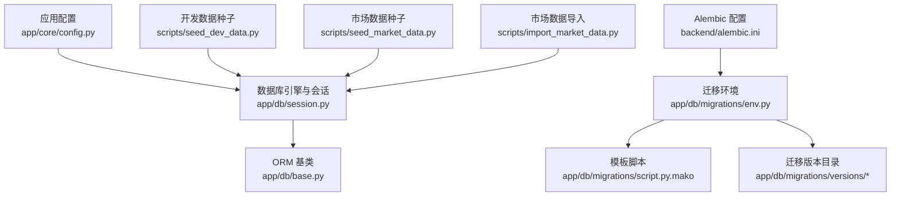
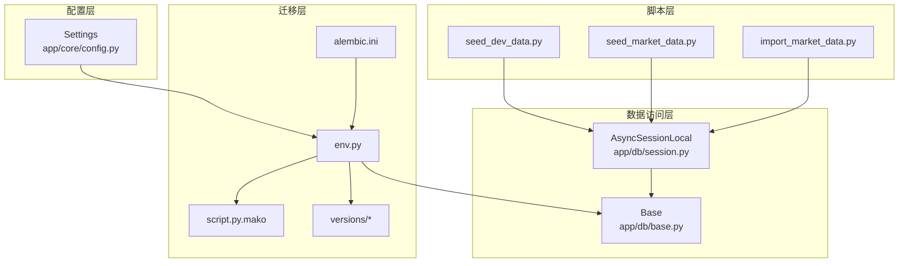
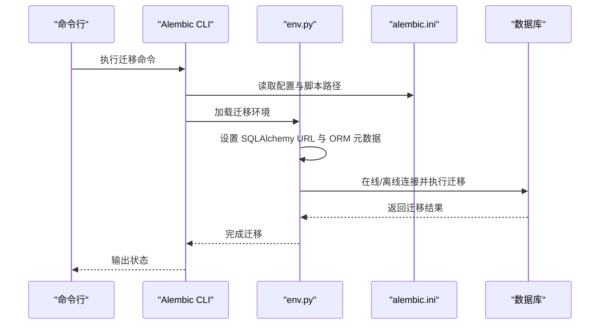
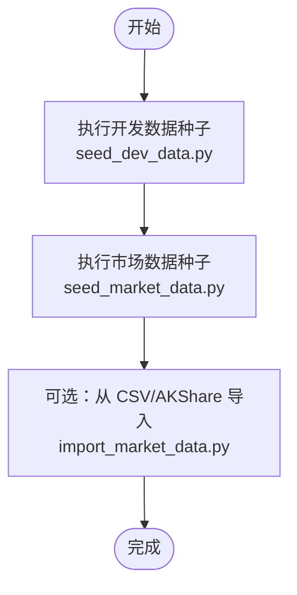
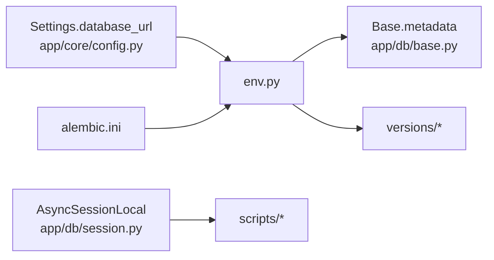

# 数据库维护

<cite>
**本文引用的文件**
- [alembic.ini](file://backend/alembic.ini)
- [env.py](file://backend/app/db/migrations/env.py)
- [script.py.mako](file://backend/app/db/migrations/script.py.mako)
- [base.py](file://backend/app/db/base.py)
- [session.py](file://backend/app/db/session.py)
- [config.py](file://backend/app/core/config.py)
- [seed_dev_data.py](file://backend/scripts/seed_dev_data.py)
- [seed_market_data.py](file://backend/scripts/seed_market_data.py)
- [import_market_data.py](file://backend/scripts/import_market_data.py)
- [20260510_000001_init_identity_and_audit.py](file://backend/app/db/migrations/versions/20260510_000001_init_identity_and_audit.py)
- [20260512_000003_market_data_daily.py](file://backend/app/db/migrations/versions/20260512_000003_market_data_daily.py)
- [61868637158e_feature_store_and_lineage.py](file://backend/app/db/migrations/versions/61868637158e_feature_store_and_lineage.py)
- [07-后端项目设计说明书.md](file://doc/07-后端项目设计说明书.md)
</cite>

## 目录
1. [简介](#简介)
2. [项目结构](#项目结构)
3. [核心组件](#核心组件)
4. [架构总览](#架构总览)
5. [详细组件分析](#详细组件分析)
6. [依赖分析](#依赖分析)
7. [性能考虑](#性能考虑)
8. [故障排查指南](#故障排查指南)
9. [结论](#结论)
10. [附录](#附录)

## 简介
本指南面向 llmine-quant 后端数据库的运维与维护工作，聚焦以下目标：
- 使用 Alembic 进行异步迁移（在线/离线模式）、迁移文件创建、版本管理与回滚策略
- 解析数据库初始化脚本与开发环境数据填充流程
- 提供数据库备份与恢复策略（全量/增量）与灾难恢复流程建议
- 给出性能优化、索引管理与锁表监控的最佳实践
- 提供常见数据库问题的诊断与解决思路

## 项目结构
后端数据库相关的关键位置如下：
- Alembic 配置与环境：backend/alembic.ini、app/db/migrations/env.py、app/db/migrations/script.py.mako
- ORM 基类与会话：app/db/base.py、app/db/session.py
- 应用配置：app/core/config.py
- 初始化与种子脚本：scripts/seed_dev_data.py、scripts/seed_market_data.py、scripts/import_market_data.py
- 迁移版本：app/db/migrations/versions/*.py

图表来源
- [alembic.ini:1-111](file://backend/alembic.ini#L1-L111)
- [env.py:1-113](file://backend/app/db/migrations/env.py#L1-L113)
- [script.py.mako:1-25](file://backend/app/db/migrations/script.py.mako#L1-L25)
- [base.py:1-10](file://backend/app/db/base.py#L1-L10)
- [session.py:1-34](file://backend/app/db/session.py#L1-L34)
- [config.py:1-196](file://backend/app/core/config.py#L1-L196)
- [seed_dev_data.py:1-185](file://backend/scripts/seed_dev_data.py#L1-L185)
- [seed_market_data.py:1-196](file://backend/scripts/seed_market_data.py#L1-L196)
- [import_market_data.py:1-53](file://backend/scripts/import_market_data.py#L1-L53)

章节来源
- [alembic.ini:1-111](file://backend/alembic.ini#L1-L111)
- [env.py:1-113](file://backend/app/db/migrations/env.py#L1-L113)
- [script.py.mako:1-25](file://backend/app/db/migrations/script.py.mako#L1-L25)
- [base.py:1-10](file://backend/app/db/base.py#L1-L10)
- [session.py:1-34](file://backend/app/db/session.py#L1-L34)
- [config.py:1-196](file://backend/app/core/config.py#L1-L196)
- [seed_dev_data.py:1-185](file://backend/scripts/seed_dev_data.py#L1-L185)
- [seed_market_data.py:1-196](file://backend/scripts/seed_market_data.py#L1-L196)
- [import_market_data.py:1-53](file://backend/scripts/import_market_data.py#L1-L53)

## 核心组件
- Alembic 异步迁移环境：支持离线与在线两种模式，通过 env.py 注入数据库 URL 与 ORM 元数据，确保迁移在异步上下文中执行。
- 数据库会话与引擎：基于 SQLAlchemy AsyncIO，统一的异步会话工厂与依赖注入，支持回滚与关闭。
- 应用配置：集中管理数据库连接串、回显开关等，支持 SQLite 路径规范化。
- 种子脚本：提供开发环境用户、角色、熔断器、风险预算等基础数据；提供合成 A 股日线数据的种子脚本；提供从 CSV 或 AKShare 导入的工具脚本。

章节来源
- [env.py:1-113](file://backend/app/db/migrations/env.py#L1-L113)
- [session.py:1-34](file://backend/app/db/session.py#L1-L34)
- [config.py:57-60](file://backend/app/core/config.py#L57-L60)
- [seed_dev_data.py:1-185](file://backend/scripts/seed_dev_data.py#L1-L185)
- [seed_market_data.py:1-196](file://backend/scripts/seed_market_data.py#L1-L196)
- [import_market_data.py:1-53](file://backend/scripts/import_market_data.py#L1-L53)

## 架构总览
下图展示 Alembic 迁移、ORM 会话与应用配置之间的交互关系，以及种子脚本对数据库的初始化作用。

图表来源
- [config.py:57-60](file://backend/app/core/config.py#L57-L60)
- [alembic.ini:58-58](file://backend/alembic.ini#L58-L58)
- [env.py:55-62](file://backend/app/db/migrations/env.py#L55-L62)
- [base.py:6-9](file://backend/app/db/base.py#L6-L9)
- [session.py:14-21](file://backend/app/db/session.py#L14-L21)
- [seed_dev_data.py:14-22](file://backend/scripts/seed_dev_data.py#L14-L22)
- [seed_market_data.py:142-191](file://backend/scripts/seed_market_data.py#L142-L191)
- [import_market_data.py:14-31](file://backend/scripts/import_market_data.py#L14-L31)

## 详细组件分析

### Alembic 迁移系统
- 在线/离线模式
  - 离线：直接使用配置中的数据库 URL，生成 SQL 并执行事务。
  - 在线：通过异步引擎连接数据库，使用连接回调执行迁移。
- 模板与元数据
  - script.py.mako 提供标准升级/降级模板。
  - env.py 将 ORM 元数据注入迁移上下文，并覆盖 SQLAlchemy URL。
- 版本文件组织
  - versions 下按时间戳前缀组织，便于顺序与追踪。
- 回滚策略
  - 每个版本文件包含 upgrade 与 downgrade，遵循“先建后拆”的原则，避免破坏性变更。
  - 建议在生产中谨慎使用 downgrade，优先采用“向前修复”策略。

图表来源
- [alembic.ini:5-58](file://backend/alembic.ini#L5-L58)
- [env.py:65-112](file://backend/app/db/migrations/env.py#L65-L112)
- [script.py.mako:19-24](file://backend/app/db/migrations/script.py.mako#L19-L24)

章节来源
- [alembic.ini:1-111](file://backend/alembic.ini#L1-L111)
- [env.py:1-113](file://backend/app/db/migrations/env.py#L1-L113)
- [script.py.mako:1-25](file://backend/app/db/migrations/script.py.mako#L1-L25)

### 数据库初始化与种子脚本
- 开发数据填充（seed_dev_data.py）
  - 通过异步会话创建所有表并写入默认组织、用户、角色及分配，以及熔断器与风险预算配置。
  - 适合本地开发与演示环境快速就绪。
- 市场数据种子（seed_market_data.py）
  - 生成 A 股日线 OHLCV 的合成数据，覆盖指定日期范围与股票池，支持熔断限制与交易日过滤。
  - 可用于策略研究与回测的初始数据准备。
- 市场数据导入（import_market_data.py）
  - 支持从 CSV 或 AKShare 导入真实数据，便于与种子数据结合使用。

图表来源
- [seed_dev_data.py:12-22](file://backend/scripts/seed_dev_data.py#L12-L22)
- [seed_market_data.py:137-191](file://backend/scripts/seed_market_data.py#L137-L191)
- [import_market_data.py:14-31](file://backend/scripts/import_market_data.py#L14-L31)

章节来源
- [seed_dev_data.py:1-185](file://backend/scripts/seed_dev_data.py#L1-L185)
- [seed_market_data.py:1-196](file://backend/scripts/seed_market_data.py#L1-L196)
- [import_market_data.py:1-53](file://backend/scripts/import_market_data.py#L1-L53)

### 迁移版本示例与索引策略
- 身份与审计初始化（20260510_000001）
  - 创建组织、用户、角色、会话、审计日志、幂等键与事件外箱等表，为身份认证与审计留痕奠定基础。
- 日线行情表（20260512_000003）
  - 建立唯一约束（symbol, trade_date），并为 org_id、symbol、trade_date 建立索引，支撑高频查询。
- 特征存储与血缘（61868637158e）
  - 新增特征集、特征使用、血缘节点与边表，配套索引提升关联查询效率。

章节来源
- [20260510_000001_init_identity_and_audit.py:1-180](file://backend/app/db/migrations/versions/20260510_000001_init_identity_and_audit.py#L1-L180)
- [20260512_000003_market_data_daily.py:34-68](file://backend/app/db/migrations/versions/20260512_000003_market_data_daily.py#L34-L68)
- [61868637158e_feature_store_and_lineage.py:33-92](file://backend/app/db/migrations/versions/61868637158e_feature_store_and_lineage.py#L33-L92)

## 依赖分析
- 配置驱动迁移
  - alembic.ini 指定脚本位置与 SQLAlchemy URL；env.py 从 Settings 动态注入 URL，确保与应用一致。
- ORM 元数据绑定
  - env.py 将 Base.metadata 注入迁移上下文，保证迁移能感知所有模型定义。
- 脚本与会话耦合
  - 种子与导入脚本均通过 AsyncSessionLocal 获取会话，确保与应用一致的连接与事务语义。

图表来源
- [config.py:57-60](file://backend/app/core/config.py#L57-L60)
- [alembic.ini:5-58](file://backend/alembic.ini#L5-L58)
- [env.py:55-62](file://backend/app/db/migrations/env.py#L55-L62)
- [base.py:6-9](file://backend/app/db/base.py#L6-L9)
- [session.py:16-21](file://backend/app/db/session.py#L16-L21)

章节来源
- [config.py:57-60](file://backend/app/core/config.py#L57-L60)
- [alembic.ini:5-58](file://backend/alembic.ini#L5-L58)
- [env.py:55-62](file://backend/app/db/migrations/env.py#L55-L62)
- [base.py:6-9](file://backend/app/db/base.py#L6-L9)
- [session.py:16-21](file://backend/app/db/session.py#L16-L21)

## 性能考虑
- 连接与回滚
  - 会话在异常时自动回滚并关闭，避免长事务占用资源。
- 回显与日志
  - database_echo 可用于调试，但不建议在生产开启。
- 索引与查询
  - 日线行情表已针对高频查询建立索引；建议在新增表时同步评估查询模式，补充必要索引。
- 锁表监控
  - 建议通过数据库内置监控视图与慢查询日志识别热点表与长时间锁等待。
- 备份与恢复
  - 生产环境推荐使用数据库自带的物理/逻辑备份工具进行全量与增量备份，并定期验证恢复流程。

章节来源
- [session.py:24-34](file://backend/app/db/session.py#L24-L34)
- [config.py:57-60](file://backend/app/core/config.py#L57-L60)
- [20260512_000003_market_data_daily.py:59-61](file://backend/app/db/migrations/versions/20260512_000003_market_data_daily.py#L59-L61)

## 故障排查指南
- 迁移失败
  - 确认 alembic.ini 中的 SQLAlchemy URL 与实际数据库一致；检查 env.py 是否正确注入 URL。
  - 若为在线模式，确认数据库可达且具备相应权限。
- 升级/降级冲突
  - 检查版本文件是否遗漏 downgrade 实现；确保 downgrade 顺序与依赖关系正确。
- 数据不一致
  - 使用种子脚本重建开发数据；注意先清理旧数据再插入，避免唯一约束冲突。
- 性能问题
  - 分析慢查询与锁等待；根据查询模式补充索引；控制批量写入批次大小。
- 备份与恢复
  - 制定全量/增量备份计划；定期演练恢复流程；验证关键业务表的数据完整性。

章节来源
- [alembic.ini:58-58](file://backend/alembic.ini#L58-L58)
- [env.py:55-62](file://backend/app/db/migrations/env.py#L55-L62)
- [seed_dev_data.py:14-22](file://backend/scripts/seed_dev_data.py#L14-L22)
- [20260512_000003_market_data_daily.py:57-58](file://backend/app/db/migrations/versions/20260512_000003_market_data_daily.py#L57-L58)

## 结论
本指南梳理了 llmine-quant 的数据库迁移、初始化与运维要点。建议在团队内明确迁移规范与回滚策略，结合种子脚本快速搭建开发环境，并建立完善的备份与恢复机制与性能监控体系，以保障系统稳定运行与持续演进。

## 附录
- 表结构参考（来自设计文档）
  - 风控相关：circuit_breakers、risk_breaches 等
  - 解释相关：signals、signal_attributions、decision_chain_steps、similar_history_cases 等
  - 安全相关：secret_refs、tool_registry、tool_permissions、security_events、withdrawal_rules 等

章节来源
- [07-后端项目设计说明书.md:489-518](file://doc/07-后端项目设计说明书.md#L489-L518)