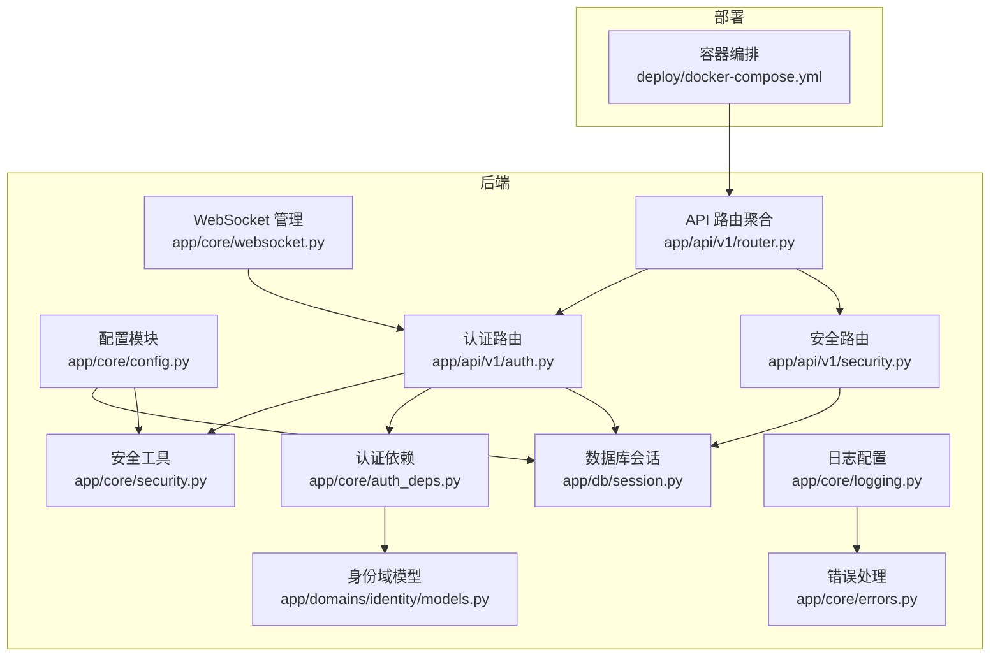
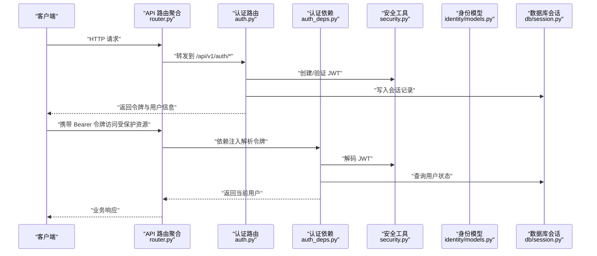
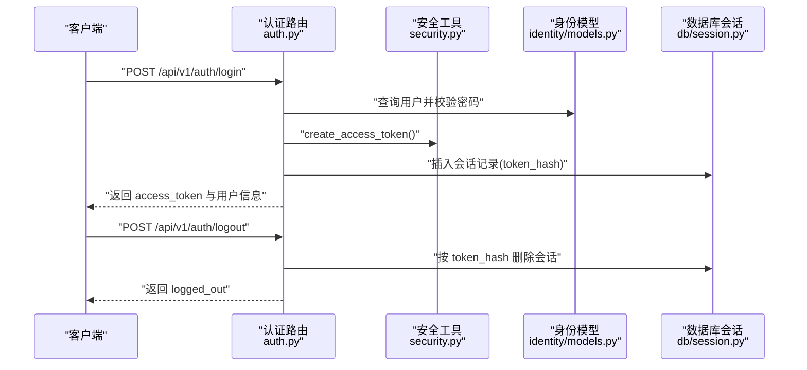
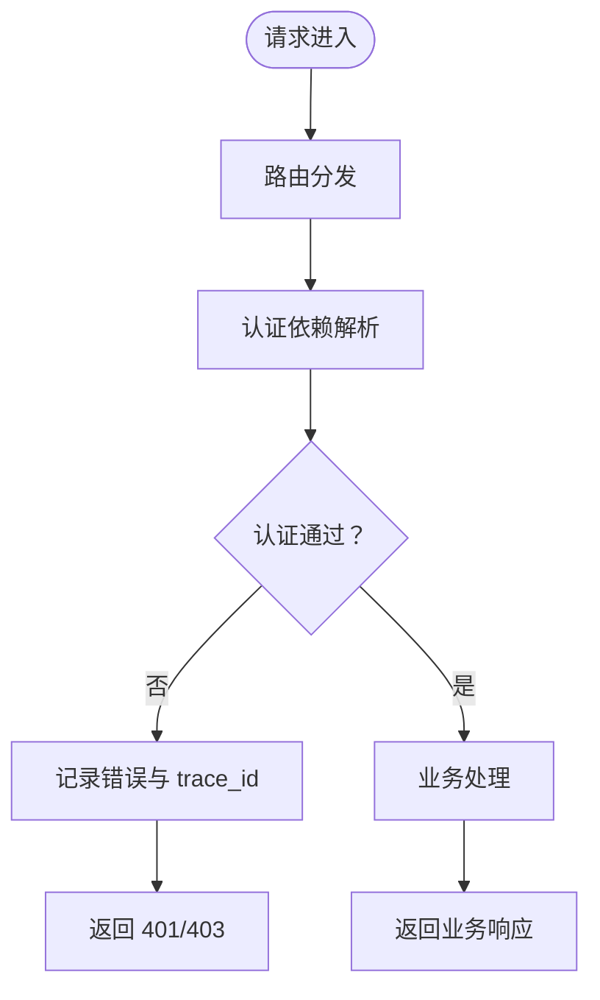
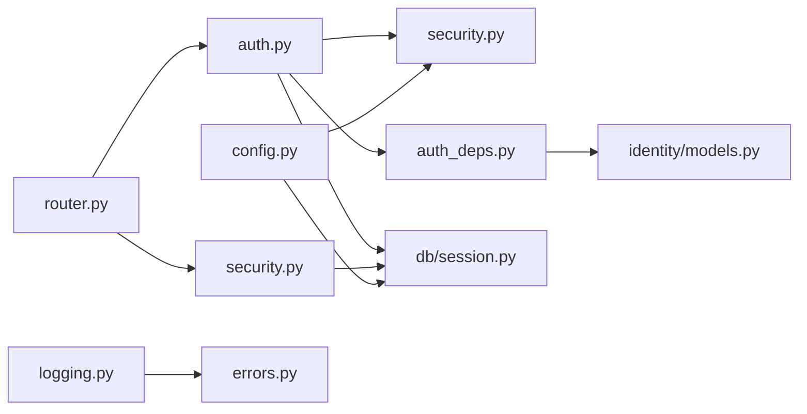

# 生产环境安全

<cite>
**本文引用的文件**
- [backend/app/core/config.py](file://backend/app/core/config.py)
- [backend/app/core/security.py](file://backend/app/core/security.py)
- [backend/app/core/auth_deps.py](file://backend/app/core/auth_deps.py)
- [backend/app/api/v1/auth.py](file://backend/app/api/v1/auth.py)
- [backend/app/api/v1/security.py](file://backend/app/api/v1/security.py)
- [backend/app/domains/identity/models.py](file://backend/app/domains/identity/models.py)
- [backend/app/db/session.py](file://backend/app/db/session.py)
- [backend/app/core/logging.py](file://backend/app/core/logging.py)
- [backend/app/core/errors.py](file://backend/app/core/errors.py)
- [backend/app/core/websocket.py](file://backend/app/core/websocket.py)
- [backend/app/api/v1/router.py](file://backend/app/api/v1/router.py)
- [deploy/docker-compose.yml](file://deploy/docker-compose.yml)
</cite>

## 目录
1. [引言](#引言)
2. [项目结构](#项目结构)
3. [核心组件](#核心组件)
4. [架构总览](#架构总览)
5. [详细组件分析](#详细组件分析)
6. [依赖分析](#依赖分析)
7. [性能考虑](#性能考虑)
8. [故障排查指南](#故障排查指南)
9. [结论](#结论)
10. [附录](#附录)

## 引言
本指南面向 llmine-quant 在生产环境中的安全配置与运维实践，聚焦以下关键领域：密钥与凭据管理、SSL/TLS 与网络边界、身份认证与授权（含 JWT 令牌生命周期）、会话与审计、数据传输与存储安全、日志与审计、入侵检测与威胁防护、安全扫描与应急响应。文档基于仓库现有实现进行系统化梳理，并提出可落地的加固建议。

## 项目结构
后端采用 FastAPI + SQLAlchemy Async 架构，安全相关能力集中在核心配置、安全工具、认证依赖、错误处理与日志等模块；前端通过 API 路由暴露认证、安全与审计接口；部署使用 docker-compose 进行编排。

**图表来源**
- [backend/app/api/v1/router.py:1-40](file://backend/app/api/v1/router.py#L1-L40)
- [backend/app/api/v1/auth.py:1-194](file://backend/app/api/v1/auth.py#L1-L194)
- [backend/app/api/v1/security.py:1-172](file://backend/app/api/v1/security.py#L1-L172)
- [backend/app/core/config.py:48-108](file://backend/app/core/config.py#L48-L108)
- [backend/app/core/security.py:1-38](file://backend/app/core/security.py#L1-L38)
- [backend/app/core/auth_deps.py:1-53](file://backend/app/core/auth_deps.py#L1-L53)
- [backend/app/domains/identity/models.py:1-60](file://backend/app/domains/identity/models.py#L1-L60)
- [backend/app/db/session.py:1-34](file://backend/app/db/session.py#L1-L34)
- [backend/app/core/logging.py:1-41](file://backend/app/core/logging.py#L1-L41)
- [backend/app/core/errors.py:1-119](file://backend/app/core/errors.py#L1-L119)
- [backend/app/core/websocket.py:1-45](file://backend/app/core/websocket.py#L1-L45)
- [deploy/docker-compose.yml](file://deploy/docker-compose.yml)

**章节来源**
- [backend/app/api/v1/router.py:1-40](file://backend/app/api/v1/router.py#L1-L40)
- [deploy/docker-compose.yml](file://deploy/docker-compose.yml)

## 核心组件
- 安全配置与密钥管理
  - 密钥与算法：通过配置模块集中定义密钥、算法与过期时间，避免硬编码。
  - 环境变量优先级：支持从用户目录自动加载第三方 LLM 凭据，同时保留显式环境变量覆盖。
- 身份认证与授权
  - 基于 JWT 的登录、注册、刷新与登出；会话记录与校验。
  - 依赖注入获取当前用户，缺失或无效令牌统一返回 401。
- 数据与会话安全
  - 用户密码使用 pbkdf2_sha256 哈希；会话令牌以 SHA-256 哈希存入数据库。
  - 数据库连接与回滚策略，确保异常时事务一致性。
- 日志与审计
  - 结构化日志输出，生产环境输出 JSON；统一错误处理器记录 trace_id。
- WebSocket 安全
  - 连接管理器按主题订阅广播，异常断开清理连接列表。

**章节来源**
- [backend/app/core/config.py:48-108](file://backend/app/core/config.py#L48-L108)
- [backend/app/core/security.py:1-38](file://backend/app/core/security.py#L1-L38)
- [backend/app/api/v1/auth.py:1-194](file://backend/app/api/v1/auth.py#L1-L194)
- [backend/app/core/auth_deps.py:1-53](file://backend/app/core/auth_deps.py#L1-L53)
- [backend/app/domains/identity/models.py:1-60](file://backend/app/domains/identity/models.py#L1-L60)
- [backend/app/db/session.py:1-34](file://backend/app/db/session.py#L1-L34)
- [backend/app/core/logging.py:1-41](file://backend/app/core/logging.py#L1-L41)
- [backend/app/core/errors.py:1-119](file://backend/app/core/errors.py#L1-L119)
- [backend/app/core/websocket.py:1-45](file://backend/app/core/websocket.py#L1-L45)

## 架构总览
下图展示生产环境安全相关的关键交互：客户端经 API 路由访问认证与安全接口，认证依赖从请求头提取令牌并解码，数据库持久化会话；错误与日志贯穿全链路。

**图表来源**
- [backend/app/api/v1/router.py:23-40](file://backend/app/api/v1/router.py#L23-L40)
- [backend/app/api/v1/auth.py:47-182](file://backend/app/api/v1/auth.py#L47-L182)
- [backend/app/core/auth_deps.py:15-39](file://backend/app/core/auth_deps.py#L15-L39)
- [backend/app/core/security.py:24-37](file://backend/app/core/security.py#L24-L37)
- [backend/app/domains/identity/models.py:51-60](file://backend/app/domains/identity/models.py#L51-L60)
- [backend/app/db/session.py:24-34](file://backend/app/db/session.py#L24-L34)

## 详细组件分析

### 组件一：密钥管理与配置
- 配置项要点
  - secret_key：用于 JWT 签名的密钥，开发默认值需在生产替换。
  - algorithm：签名算法，默认 HS256。
  - access_token_expire_minutes：令牌有效期。
  - 数据库与缓存连接、CORS 白名单等。
- 最佳实践
  - 使用强随机密钥，定期轮换；通过环境变量注入，不纳入版本库。
  - 限制 CORS 源，仅允许受信域名。
  - 将敏感字段（如 LLM 凭据）置于独立密钥管理系统中，最小权限访问。

**章节来源**
- [backend/app/core/config.py:48-108](file://backend/app/core/config.py#L48-L108)

### 组件二：SSL/TLS 与网络安全
- 当前实现
  - 后端为 HTTP 服务；数据库连接为异步驱动。
- 生产建议
  - 在反向代理层启用 TLS（如 Nginx/Caddy），终止 TLS 并向后端传递安全头。
  - 严格限制入站端口与源 IP，结合 WAF/云防火墙实现 DDoS 与攻击防护。
  - 对外暴露的 API 仅开放必要端口，内部服务通过私网通信。

**章节来源**
- [backend/app/db/session.py:10-14](file://backend/app/db/session.py#L10-L14)
- [deploy/docker-compose.yml](file://deploy/docker-compose.yml)

### 组件三：身份认证与授权（JWT）
- 认证流程
  - 登录：校验邮箱与密码，生成 JWT 并持久化会话哈希。
  - 注册：去重检查、密码哈希、签发令牌并记录会话。
  - 刷新：对有效旧令牌签发新令牌并更新会话。
  - 登出：根据令牌哈希删除会话记录。
  - 获取当前用户：OAuth2 Bearer 解析、JWT 解码、用户状态校验。
- 授权与会话安全
  - 令牌过期时间可控；会话记录支持主动撤销。
  - 用户状态非 active 将拒绝访问。
- 建议强化
  - 引入刷新令牌黑名单与滑动过期策略。
  - 增加 MFA 字段并在登录流程中启用。
  - 对高风险操作增加二次确认与审计事件。

**图表来源**
- [backend/app/api/v1/auth.py:47-182](file://backend/app/api/v1/auth.py#L47-L182)
- [backend/app/core/security.py:24-29](file://backend/app/core/security.py#L24-L29)
- [backend/app/domains/identity/models.py:51-60](file://backend/app/domains/identity/models.py#L51-L60)
- [backend/app/db/session.py:24-34](file://backend/app/db/session.py#L24-L34)

**章节来源**
- [backend/app/api/v1/auth.py:1-194](file://backend/app/api/v1/auth.py#L1-L194)
- [backend/app/core/auth_deps.py:1-53](file://backend/app/core/auth_deps.py#L1-L53)
- [backend/app/core/security.py:1-38](file://backend/app/core/security.py#L1-L38)
- [backend/app/domains/identity/models.py:1-60](file://backend/app/domains/identity/models.py#L1-L60)

### 组件四：数据安全（传输与存储）
- 传输安全
  - 建议在反向代理层强制 HTTPS；后端仅处理解密后的请求。
  - 对敏感字段（如令牌、密码）避免在日志中打印明文。
- 存储安全
  - 密码使用 pbkdf2_sha256 哈希；令牌以 SHA-256 哈希存储。
  - 数据库连接参数与 URL 通过配置注入，避免硬编码。
- 建议强化
  - 对数据库表中的敏感列（如用户凭证）启用透明数据加密（TDE）。
  - 定期备份与异地容灾，备份介质加密存储。

**章节来源**
- [backend/app/core/security.py:14-21](file://backend/app/core/security.py#L14-L21)
- [backend/app/api/v1/auth.py:43-44](file://backend/app/api/v1/auth.py#L43-L44)
- [backend/app/db/session.py:1-34](file://backend/app/db/session.py#L1-L34)
- [backend/app/core/config.py:57-62](file://backend/app/core/config.py#L57-L62)

### 组件五：安全审计与日志
- 日志配置
  - 生产环境输出 JSON；开发环境输出控制台；统一时间戳与级别。
- 错误处理
  - 统一异常包装与追踪 ID 输出，便于审计与定位问题。
- 建议增强
  - 将关键安全事件（登录失败、令牌过期、会话撤销）写入审计日志。
  - 集成 SIEM 或日志平台，设置告警规则与阈值。

**图表来源**
- [backend/app/core/auth_deps.py:15-39](file://backend/app/core/auth_deps.py#L15-L39)
- [backend/app/core/errors.py:73-118](file://backend/app/core/errors.py#L73-L118)
- [backend/app/core/logging.py:11-35](file://backend/app/core/logging.py#L11-L35)

**章节来源**
- [backend/app/core/logging.py:1-41](file://backend/app/core/logging.py#L1-L41)
- [backend/app/core/errors.py:1-119](file://backend/app/core/errors.py#L1-L119)

### 组件六：入侵检测与威胁防护
- 现状
  - 提供安全概览与事件列表接口，支持密钥轮换与权限控制视图。
- 建议
  - 在反向代理层开启 WAF，阻断常见攻击（SQL 注入、XSS、CSRF）。
  - 实施速率限制与 IP 黑名单；对异常行为触发告警。
  - 定期进行安全扫描与渗透测试，形成闭环整改。

**章节来源**
- [backend/app/api/v1/security.py:1-172](file://backend/app/api/v1/security.py#L1-L172)

### 组件七：WebSocket 与实时事件
- 连接管理
  - 支持按主题订阅广播，异常断开自动清理连接。
- 安全建议
  - 对 WebSocket 入口同样启用 TLS；限制订阅主题与权限。
  - 对消息体进行鉴权与内容校验，防止恶意推送。

**章节来源**
- [backend/app/core/websocket.py:1-45](file://backend/app/core/websocket.py#L1-L45)

## 依赖分析
- 组件耦合
  - 认证路由依赖安全工具与认证依赖；认证依赖依赖数据库会话与身份模型。
  - API 路由聚合统一挂载各模块路由，形成清晰边界。
- 外部依赖
  - JWT 编解码、密码哈希、异步数据库驱动、结构化日志库。
- 建议
  - 明确各模块职责，避免跨模块直接耦合；对外暴露的接口统一走路由层。

**图表来源**
- [backend/app/api/v1/auth.py:1-194](file://backend/app/api/v1/auth.py#L1-L194)
- [backend/app/core/auth_deps.py:1-53](file://backend/app/core/auth_deps.py#L1-L53)
- [backend/app/domains/identity/models.py:1-60](file://backend/app/domains/identity/models.py#L1-L60)
- [backend/app/db/session.py:1-34](file://backend/app/db/session.py#L1-L34)
- [backend/app/api/v1/security.py:1-172](file://backend/app/api/v1/security.py#L1-L172)
- [backend/app/api/v1/router.py:1-40](file://backend/app/api/v1/router.py#L1-L40)
- [backend/app/core/config.py:48-108](file://backend/app/core/config.py#L48-L108)
- [backend/app/core/logging.py:1-41](file://backend/app/core/logging.py#L1-L41)
- [backend/app/core/errors.py:1-119](file://backend/app/core/errors.py#L1-L119)

**章节来源**
- [backend/app/api/v1/router.py:1-40](file://backend/app/api/v1/router.py#L1-L40)
- [backend/app/api/v1/auth.py:1-194](file://backend/app/api/v1/auth.py#L1-L194)
- [backend/app/api/v1/security.py:1-172](file://backend/app/api/v1/security.py#L1-L172)
- [backend/app/core/auth_deps.py:1-53](file://backend/app/core/auth_deps.py#L1-L53)
- [backend/app/domains/identity/models.py:1-60](file://backend/app/domains/identity/models.py#L1-L60)
- [backend/app/db/session.py:1-34](file://backend/app/db/session.py#L1-L34)
- [backend/app/core/config.py:48-108](file://backend/app/core/config.py#L48-L108)
- [backend/app/core/logging.py:1-41](file://backend/app/core/logging.py#L1-L41)
- [backend/app/core/errors.py:1-119](file://backend/app/core/errors.py#L1-L119)

## 性能考虑
- 令牌生成与解码为轻量操作，性能瓶颈通常不在认证层。
- 建议
  - 合理设置令牌过期时间，平衡安全性与用户体验。
  - 对频繁调用的公开接口启用缓存与限流，降低数据库压力。

[本节为通用指导，无需特定文件来源]

## 故障排查指南
- 常见问题
  - 401 未认证：检查 Authorization 头是否携带 Bearer 令牌；确认令牌未过期。
  - 403 禁止访问：用户状态非 active 或权限不足。
  - 登录失败：邮箱不存在或密码校验失败。
  - 会话未生效：确认会话记录是否正确写入数据库。
- 定位手段
  - 查看结构化日志中的 trace_id 与错误上下文。
  - 检查统一错误处理器返回的错误码与详情。
- 建议
  - 对高风险操作增加审计事件与告警联动。
  - 定期巡检密钥轮换与过期情况。

**章节来源**
- [backend/app/core/auth_deps.py:15-39](file://backend/app/core/auth_deps.py#L15-L39)
- [backend/app/api/v1/auth.py:57-64](file://backend/app/api/v1/auth.py#L57-L64)
- [backend/app/core/errors.py:73-118](file://backend/app/core/errors.py#L73-L118)
- [backend/app/core/logging.py:11-35](file://backend/app/core/logging.py#L11-L35)

## 结论
本指南基于现有代码实现了对 llmine-quant 生产环境安全的系统性梳理与加固建议。建议优先完成密钥轮换、TLS 终止、CORS 与网络边界收敛、MFA 与二次确认、审计与日志增强、WAF 与入侵检测部署，并建立安全扫描与应急响应流程，持续提升整体安全水平。

[本节为总结性内容，无需特定文件来源]

## 附录

### A. 生产环境安全配置清单
- 密钥与算法
  - 替换默认 secret_key，启用强随机密钥；定期轮换。
  - 使用 HS256 或更安全算法（如 RS256）配合密钥对。
- 网络与传输
  - 反向代理启用 TLS；限制入站端口与源 IP；启用 WAF。
  - CORS 仅允许受信域名；禁用通配符。
- 认证与授权
  - 启用 MFA；对高风险操作增加二次确认。
  - 刷新令牌黑名单与滑动过期；会话撤销即时生效。
- 数据与日志
  - 数据库启用 TDE；敏感字段脱敏输出；生产环境日志 JSON 化。
  - 审计事件覆盖登录、令牌、会话、权限变更等。
- 监控与响应
  - SIEM 集成与阈值告警；定期渗透测试与漏洞扫描。
  - 应急预案与演练，明确处置流程与升级通道。

[本节为通用指导，无需特定文件来源]